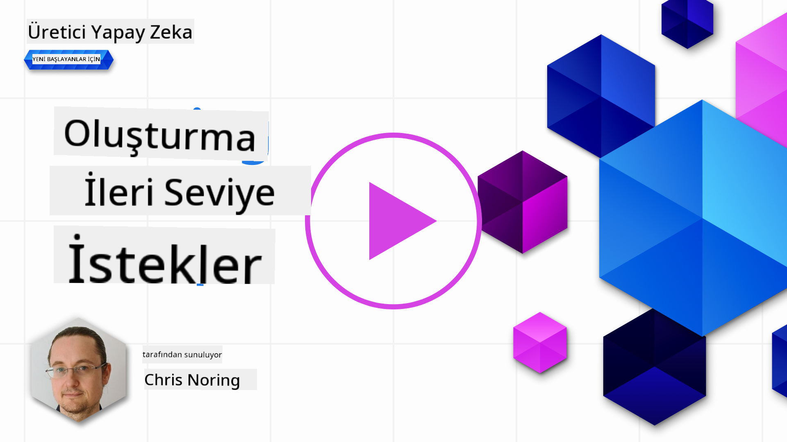

<!--
CO_OP_TRANSLATOR_METADATA:
{
  "original_hash": "b2651fb16bcfbc62b8e518751ed90fdb",
  "translation_date": "2025-10-18T00:59:58+00:00",
  "source_file": "05-advanced-prompts/README.md",
  "language_code": "tr"
}
-->
# Gelişmiş İstekler Oluşturma

[](https://youtu.be/BAjzkaCdRok?si=NmUIyRf7-cDgbjtt)

Önceki bölümden bazı öğrenimleri tekrar gözden geçirelim:

> İstek _mühendisliği_, modele daha faydalı talimatlar veya bağlam sağlayarak **daha alakalı yanıtlar vermesini sağlama sürecidir**.

İstek yazmanın iki adımı vardır: İsteği oluşturmak, yani ilgili bağlamı sağlamak ve _optimizasyon_, isteği kademeli olarak nasıl geliştireceğimiz.

Bu noktada, istek yazma konusunda temel bir anlayışa sahibiz, ancak daha derine inmemiz gerekiyor. Bu bölümde, çeşitli istekleri denemekten bir isteğin neden diğerinden daha iyi olduğunu anlamaya geçeceksiniz. Herhangi bir LLM'de uygulanabilecek bazı temel teknikleri takip ederek istekler oluşturmayı öğreneceksiniz.

## Giriş

Bu bölümde aşağıdaki konuları ele alacağız:

- İstek mühendisliği bilginizi farklı teknikleri isteklerinize uygulayarak genişletin.
- Çıktıyı değiştirmek için isteklerinizi yapılandırın.

## Öğrenme Hedefleri

Bu dersi tamamladıktan sonra şunları yapabileceksiniz:

- İsteklerinizin sonucunu iyileştiren istek mühendisliği tekniklerini uygulayın.
- Çeşitli veya deterministik istekler gerçekleştirin.

## İstek Mühendisliği

İstek mühendisliği, isteklerin istenen sonucu üretecek şekilde oluşturulması sürecidir. İstek mühendisliği sadece bir metin isteği yazmaktan ibaret değildir. İstek mühendisliği bir mühendislik disiplini değil, istenen sonucu elde etmek için uygulanabilecek bir dizi tekniktir.

### Bir İstek Örneği

Basit bir istek örneği alalım:

> Coğrafya hakkında 10 soru oluşturun.

Bu istekte aslında farklı istek tekniklerini uyguluyorsunuz.

Bunu parçalayalım.

- **Bağlam**, "coğrafya" hakkında olması gerektiğini belirtiyorsunuz.
- **Çıktıyı sınırlama**, en fazla 10 soru istiyorsunuz.

### Basit İsteklerin Sınırlamaları

İstediğiniz sonucu elde edebilirsiniz veya edemeyebilirsiniz. Sorularınız oluşturulacak, ancak coğrafya geniş bir konu olduğundan aşağıdaki nedenlerden dolayı istediğiniz sonucu alamayabilirsiniz:

- **Geniş konu**, ülkeler, başkentler, nehirler vb. hakkında olup olmayacağını bilmiyorsunuz.
- **Format**, soruların belirli bir şekilde formatlanmasını istiyorsanız ne olacak?

Gördüğünüz gibi, istek oluştururken dikkate alınması gereken çok şey var.

Şimdiye kadar basit bir istek örneği gördük, ancak üretken yapay zeka, çeşitli roller ve sektörlerde insanlara yardımcı olmak için çok daha fazlasını yapabilir. Şimdi bazı temel teknikleri keşfedelim.

### İstek Teknikleri

Öncelikle, istek oluşturmanın bir LLM'nin _ortaya çıkan_ bir özelliği olduğunu anlamamız gerekiyor, yani bu modelin içine yerleştirilmiş bir özellik değil, modeli kullandıkça keşfettiğimiz bir şey.

Bir LLM'yi yönlendirmek için kullanabileceğimiz bazı temel teknikler var. Bunları inceleyelim.

- **Sıfır atış isteği**, bu en temel istek türüdür. LLM'den yalnızca eğitim verilerine dayanarak bir yanıt talep eden tek bir istektir.
- **Az atış isteği**, bu tür istek, LLM'yi yanıtını oluştururken dayanabileceği bir veya daha fazla örnek sağlayarak yönlendirir.
- **Düşünce zinciri**, bu tür istek, LLM'ye bir problemi adım adım nasıl çözebileceğini söyler.
- **Üretilmiş bilgi**, bir isteğin yanıtını iyileştirmek için isteğinize ek olarak üretilmiş gerçekler veya bilgiler sağlayabilirsiniz.
- **Azdan çoğa**, düşünce zinciri gibi, bu teknik bir problemi bir dizi adıma ayırmak ve ardından bu adımların sırayla gerçekleştirilmesini istemekle ilgilidir.
- **Kendi kendini geliştirme**, bu teknik, LLM'nin çıktısını eleştirmek ve ardından iyileştirmesini istemekle ilgilidir.
- **Maieutik istek**, burada istediğiniz şey, LLM'nin yanıtının doğru olmasını sağlamak ve yanıtın çeşitli bölümlerini açıklamasını istemektir. Bu, bir tür kendi kendini geliştirme tekniğidir.

### Sıfır Atış İsteği

Bu istek stili çok basittir, tek bir isteği içerir. Bu teknik, LLM'ler hakkında bilgi edinmeye başladığınızda muhtemelen kullandığınız tekniktir. İşte bir örnek:

- İstek: "Cebir nedir?"
- Yanıt: "Cebir, matematiksel sembolleri ve bu sembolleri manipüle etme kurallarını inceleyen bir matematik dalıdır."

### Az Atış İsteği

Bu istek stili, modelin talep ile birlikte birkaç örnek sağlayarak yardımcı olur. Tek bir istek ve ek görevle ilgili verilerden oluşur. İşte bir örnek:

- İstek: "Shakespeare tarzında bir şiir yaz. İşte birkaç Shakespeare sonesi örneği:
  Sone 18: 'Seni bir yaz gününe benzetebilir miyim? Sen daha güzel ve daha ılımlısın...'
  Sone 116: 'Gerçek zihinlerin evliliğine engel koymayayım. Aşk, değişimle değişen aşk değildir...'
  Sone 132: 'Gözlerini seviyorum ve onlar, bana acıyarak, Kalbini bildiklerinden beni hor görüyorlar,...'
  Şimdi, ayın güzelliği hakkında bir sone yaz."
- Yanıt: "Gökyüzünde ay yumuşakça parlıyor, Gümüş ışık, zarif bir lütuf yayıyor,..."

Örnekler, LLM'ye istenen çıktının bağlamını, formatını veya stilini sağlar. Modelin belirli görevi anlamasına ve daha doğru ve ilgili yanıtlar oluşturmasına yardımcı olurlar.

### Düşünce Zinciri

Düşünce zinciri, LLM'yi bir dizi adım boyunca yönlendirmekle ilgili çok ilginç bir tekniktir. Fikir, LLM'yi bir şeyi nasıl yapacağını anlayacak şekilde yönlendirmektir. Düşünce zinciri olmadan ve düşünce zinciri ile bir örneği düşünün:

    - İstek: "Alice'in 5 elması var, 3 elmayı atıyor, 2 elmayı Bob'a veriyor ve Bob birini geri veriyor, Alice'in kaç elması var?"
    - Yanıt: 5

LLM 5 yanıtını verir, bu yanlış. Doğru yanıt 1 elmadır, hesaplama (5 -3 -2 + 1 = 1) göz önüne alındığında.

Peki LLM'ye bunu doğru yapmayı nasıl öğretebiliriz?

Düşünce zincirini deneyelim. Düşünce zincirini uygulamak şu anlama gelir:

1. LLM'ye benzer bir örnek verin.
1. Hesaplamayı gösterin ve doğru şekilde nasıl hesaplanacağını açıklayın.
1. Orijinal isteği sağlayın.

İşte nasıl yapılacağı:

- İstek: "Lisa'nın 7 elması var, 1 elmayı atıyor, 4 elmayı Bart'a veriyor ve Bart birini geri veriyor:
  7 -1 = 6
  6 -4 = 2
  2 +1 = 3  
  Alice'in 5 elması var, 3 elmayı atıyor, 2 elmayı Bob'a veriyor ve Bob birini geri veriyor, Alice'in kaç elması var?"
  Yanıt: 1

Daha uzun bir istek yazdığımızı, başka bir örnek, bir hesaplama ve ardından orijinal isteği sağladığımızı ve doğru yanıt olan 1'e ulaştığımızı görebilirsiniz.

Gördüğünüz gibi, düşünce zinciri çok güçlü bir tekniktir.

### Üretilmiş Bilgi

Çoğu zaman bir istek oluşturmak istediğinizde, bunu kendi şirketinizin verilerini kullanarak yapmak istersiniz. İsteğin bir kısmının şirketten, diğer kısmının ise ilgilendiğiniz asıl isteğin olması gerekir.

Örneğin, sigorta işindeyseniz isteğiniz şu şekilde görünebilir:

```text
{{company}}: {{company_name}}
{{products}}:
{{products_list}}
Please suggest an insurance given the following budget and requirements:
Budget: {{budget}}
Requirements: {{requirements}}
```

Yukarıda, isteğin bir şablon kullanılarak nasıl oluşturulduğunu görüyorsunuz. Şablonda, bir şirket API'sinden gelen gerçek değerlerle değiştirilecek bir dizi değişken, `{{variable}}` ile belirtilmiştir.

Değişkenler şirketinizden gelen içerikle değiştirildikten sonra isteğin nasıl görünebileceğine dair bir örnek:

```text
Insurance company: ACME Insurance
Insurance products (cost per month):
- Car, cheap, 500 USD
- Car, expensive, 1100 USD
- Home, cheap, 600 USD
- Home, expensive, 1200 USD
- Life, cheap, 100 USD

Please suggest an insurance given the following budget and requirements:
Budget: $1000
Requirements: Car, Home, and Life insurance
```

Bu isteği bir LLM üzerinden çalıştırmak şu şekilde bir yanıt üretecektir:

```output
Given the budget and requirements, we suggest the following insurance package from ACME Insurance:
- Car, cheap, 500 USD
- Home, cheap, 600 USD
- Life, cheap, 100 USD
Total cost: $1,200 USD
```

Gördüğünüz gibi, aynı zamanda Hayat sigortasını da öneriyor, ki bunu yapmamalı. Bu sonuç, isteği daha net hale getirmek için değiştirerek optimize etmemiz gerektiğinin bir göstergesidir. Biraz _deneme yanılma_ sonrasında şu isteğe ulaşıyoruz:

```text
Insurance company: ACME Insurance
Insurance products (cost per month):
- type: Car, cheap, cost: 500 USD
- type: Car, expensive, cost: 1100 USD
- type: Home, cheap, cost: 600 USD
- type: Home, expensive, cost: 1200 USD
- type: Life, cheap, cost: 100 USD

Please suggest an insurance given the following budget and requirements:
Budget: $1000 restrict choice to types: Car, Home
```

Dikkat edin, _tür_ ve _maliyet_ eklemek ve ayrıca _kısıtlama_ anahtar kelimesini kullanmak, LLM'nin ne istediğimizi anlamasına yardımcı oluyor.

Şimdi şu yanıtı alıyoruz:

```output
Given the budget and requirements, we suggest the Car, Cheap insurance product which costs 500 USD per month.
```

Bu örneğin amacı, _üretilmiş bilgi_ gibi temel bir teknik kullansak bile, çoğu durumda istenen sonucu elde etmek için isteği optimize etmemiz gerektiğini göstermektir.

### Azdan Çoğa

Azdan çoğa isteğin fikri, daha büyük bir problemi alt problemlere ayırmaktır. Bu şekilde, LLM'yi daha büyük problemi nasıl "fethedeceği" konusunda yönlendirmiş olursunuz. İyi bir örnek, veri bilimi için şu şekilde bir problem bölme isteği olabilir:

> İstek: Veri bilimi nasıl 5 adımda gerçekleştirilir?

AI asistanınız şu şekilde yanıt verebilir:

1. Veri toplama
1. Veriyi temizleme
1. Veriyi analiz etme
1. Veriyi görselleştirme
1. Veriyi sunma

### Kendi Kendini Geliştirme, Sonuçları Eleştirme

Üretken yapay zekalar ve LLM'ler ile, çıktıya güvenemezsiniz. Onu doğrulamanız gerekir. Sonuçta, LLM size sadece bir sonraki en olası şeyi söylemektedir, doğru olanı değil. Bu nedenle, LLM'den kendini eleştirmesini istemek iyi bir fikirdir, bu da bizi kendi kendini geliştirme tekniğine götürür.

Nasıl çalıştığı şu adımları takip eder:

1. LLM'den bir problemi çözmesini isteyen ilk istek
1. LLM yanıt verir
1. Yanıtı eleştirir ve AI'dan iyileştirmesini istersiniz
1. LLM tekrar yanıt verir, bu sefer eleştiriyi dikkate alır ve önerdiği çözümleri sunar

Bu süreci istediğiniz kadar tekrarlayabilirsiniz.

İşte bu tekniği kullanan bir örnek:

> İstek: "Ürünler ve müşteriler rotaları olan bir Python Web API'si oluşturun"

AI Yanıtı:

```python
import flask
app = Flask(__name__)

@app.route('/products')
def products():
    return 'Products'

@app.route('/customers')
def customers():
    return 'Customers'
```

> İstek: Yukarıdaki kodun 3 iyileştirmesini önerin

AI Yanıtı:

```text
Sure, here are three suggestions to improve the code:

Import the correct module: The first line should import Flask instead of flask. The correct import statement should be from flask import Flask.

Add a main function: Add a if __name__ == '__main__': block to the end of the file to run the application when the file is executed.

Use f-strings: Use f-strings to format the return statements in the route functions. For example, return 'Products' can be changed to return f'This is the {request.path} page'.
```

```python
from flask import Flask, request

app = Flask(__name__)

@app.route('/products')
def products():
    return f'This is the {request.path} page'

@app.route('/customers')
def customers():
    return f'This is the {request.path} page'

if __name__ == '__main__':
    app.run()
```

Gördüğünüz gibi, yukarıdaki AI yanıtı, ilk önerilen kodu eleştirerek iyileştiriyor.

### Maieutik İstek

Maieutik istek, kendi kendini geliştirme tekniğine benzer bir tekniktir, ancak daha çok LLM'den kendini açıklamasını istemekle ilgilidir. Amaç, LLM'nin çıktısındaki tutarsızlıkları azaltmak ve doğru sonuca ulaşmasını sağlamaktır. Takip edilmesi gereken iş akışı şudur:

1. LLM'den bir soruyu yanıtlamasını isteyin
1. Yanıtın her bir bölümü için LLM'den daha ayrıntılı açıklama yapmasını isteyin.
1. Tutarsızlıklar varsa, tutarsız olan bölümleri çıkarın.

2 ve 3'ü tüm bölümleri gözden geçirene ve yanıttan memnun kalana kadar tekrarlayın.

İşte bir örnek istek:

> İstek: Bir pandemiyi hafifletmek için bir kriz planı nasıl oluşturulur? 5 adımda açıklayın.
> LLM yanıtı:

```text
1. Identify the risks
1. Identify the stakeholders
1. Identify the resources
1. Identify the actions
1. Identify the communication channels
```

5 adım belirlenmiş, ancak bunun doğru olup olmadığını belirleyebilir miyiz? LLM'den her adımı daha ayrıntılı açıklamasını isteyelim:

> İstek: İlk adımı daha ayrıntılı açıkla, bir pandemideki riskler nelerdir?

```text
The risks are the following:

- Loss of life
- Loss of business
- Loss of reputation
- Loss of customers
- Loss of employees
```

Bu noktada, LLM'nin doğru olduğundan emin olmak istiyoruz, bu yüzden ilk riski daha ayrıntılı açıklamasını istiyoruz ve yukarıdaki yanıtla tutarlı olmasını umuyoruz:

> İstek: Bir pandemide en büyük risk nedir ve neden?

```text
The biggest risk is loss of life because it's the most important thing to protect.
```

> Bir pandemideki en büyük iki risk nedir?

```text
The two biggest risks are loss of life and loss of business.
```

Bu noktada, LLM tutarlı ve "hayat" ve "iş"i en büyük iki risk olarak belirtiyor. Şimdi bir sonraki adıma geçebilir ve oldukça emin hissedebiliriz. Ancak, LLM'ye körü körüne güvenmemeliyiz, her zaman çıktıyı doğrulamalıyız.

## Çıktınızı Çeşitlendirin

LLM'ler doğası gereği belirli bir sonuç üretmez, yani aynı isteği her çalıştırdığınızda farklı sonuçlar alabilirsiniz. Örneğin şu isteği deneyin:

> "Bir Python Web API'si için kod oluşturun"

```python
# Import necessary modules
import flask
from flask import request, jsonify

# Create a Flask app
app = flask.Flask(__name__)

# Create a route for the API
@app.route('/api', methods=['GET'])
def api():
    # Get the data from the request
    data = request.args

    # Process the data
    result = process_data(data)

    # Return the result as JSON
    return jsonify(result)

# Function to process the data
def process_data(data):
    # Do something with the data
    result = data + 1

    # Return the result
    return result

# Run the app
if __name__ == '__main__':
    app.run()

```

Aynı isteği tekrar çalıştırdığınızda biraz farklı bir yanıt alırsınız:

```python
#import necessary packages
import flask
from flask import request, jsonify

#create the Flask application
app = flask.Flask(__name__)
app.config["DEBUG"] = True

#create a list of books
books = [
    {'id': 0,
     'title': 'A Fire Upon the Deep',
     'author': 'Vernor Vinge',
     'first_sentence': 'The coldsleep itself was dreamless.',
     'year_published': '1992'},
    {'id': 1,
     'title': 'The Ones Who Walk Away From Omelas',
     'author': 'Ursula K. Le Guin',
     'first_sentence': 'With a clamor of bells that set the swallows soaring, the Festival of Summer came to the city Omelas, bright-towered by the sea.',
     'published': '1973'},
    {'id': 2,
     'title': 'Dhalgren',
     'author': 'Samuel R. Delany',
     'first_sentence': 'to wound the autumnal city.',
     'published': '1975'}
]

#create an endpoint for the API
@app.route('/', methods=['GET'])
def home():
    return '''<h1>Books API</h1>
<p>A prototype API for retrieving books.</p>'''

#create an endpoint to return all books
@app.route('/api/v1/resources/books/all', methods=['GET'])
def api_all():
    return jsonify(books)

#create an endpoint to return a single book
@app.route('/api/v1/resources/books', methods=['GET'])
def api_id():
    #check if an ID was provided as part of the URL
    #if ID is provided, assign it to a variable
    #if no ID is provided, display an error
    if 'id' in request.args:
        id = int(request.args['id'])
    else:
        return "Error: No id field provided. Please specify an id."

    #create an empty list for our results
    results = []

    #loop through the data and match results that fit the requested ID
    #IDs are unique, but other fields might return many results
    for book in books:
        if book['id'] == id:
            results.append(book)

    #use the jsonify function from Flask to convert our list of
    #Python dictionaries to the JSON format
    return jsonify(results)

app.run()
```

> Peki, çeşitlendirilmiş çıktı bir sorun mu?

Ne yapmaya çalıştığınıza bağlı. Belirli bir yanıt istiyorsanız, bu bir sorun olabilir. "Coğrafya hakkında herhangi 3 soru oluştur" gibi çeşitlendirilmiş bir çıktı istiyorsanız, bu bir sorun değildir.

### Çıktınızı Çeşitlendirmek İçin Sıcaklık Kullanımı

Tamam, daha tahmin edilebilir, yani daha belirli bir çıktı elde etmek istediğimize karar verdik. Bunu nasıl yaparız?

Sıcaklık, 0 ile 1 arasında bir değerdir; burada 0 en belirli, 1 ise en çeşitlendirilmiş olanıdır. Varsayılan değer 0.7'dir. Sıcaklık değeri 0.1 olarak ayarlanmış aynı isteğin iki çalıştırmasında neler olduğunu görelim:

> "Bir Python Web API'si için kod oluşturun"

```python
#import necessary libraries
import flask
from flask import request, jsonify

#create an instance of the Flask class
app = flask.Flask(__name__)

#create an endpoint for the API
@app.route('/api/v1/endpoint', methods=['GET'])
def api_endpoint():
    #get the request data
    data = request.get_json()

    #process the data
    result = process_data(data)

    #return the result
    return jsonify(result)

#function to process the data
def process_data(data):
    #process the data
    result = {'result': 'success'}

    #return the result
    return result

#run the Flask app
if __name__ == '__main__':
    app.run()

```

İsteği tekrar çalıştırdığımızda şu sonucu alıyoruz:

```python
#import necessary libraries
import flask
from flask import request, jsonify

#create a Flask app
app = flask.Flask(__name__)

#create a route for the API
@app.route('/api', methods=['GET'])
def api_call():
    #get the data from the request
    data = request.get_json()

    #process the data
    result = process_data(data)

    #return the result
    return jsonify(result)

#define the process_data function
def process_data(data):
    #do something with the data
    result = data + 1

    #return the result
    return result

#run the app
if __name__ == '__main__':
    app.run()

```

Bu iki çıktı arasında yalnızca küçük bir fark var. Bu sefer tam tersini yapalım, sıcaklık değerini 0.9 olarak ayarlayalım:

```python
# Import necessary libraries
import flask
from flask import request, jsonify

# Create a Flask app
app = flask.Flask(__name__)

# Create a route for the API
@app.route('/api', methods=['GET'])
def api_call():
    # Get the data from the request
    data = request.args

    # Process the data
    result = process_data(data)

    # Return the result
    return jsonify(result)

# Function to process the data
def process_data(data):
    # Do something with the data
    result = data + 1

    # Return the result
    return result

# Run the app
if __name__ == '__main__':
    app.run()

```

ve sıcaklık değeri 0.9 olarak ayarlanmış ikinci deneme:

```python
import flask
from flask import request, jsonify

# create the Flask app
app = flask.Flask(__name__)
app.config['DEBUG'] = True

# create some test data
books = [
    {'id': 0, 'title': 'A Fire Upon The Deep', 'author': 'Vernor Vinge', 'first_sentence': 'The coldsleep itself was dreamless.', 'year_published': '1992'},
    {'id': 1, 'title': 'The Ones Who Walk Away From Omelas', 'author': 'Ursula K. Le Guin', 'first_sentence': 'With a clamor of bells that set the swallows soaring, the Festival of Summer came to the city Omelas, bright-towered by the sea.', 'published': '1973'},
    {'id': 2, 'title': 'Dhalgren', 'author': 'Samuel R. Delany', 'first_sentence': 'to wound the autumnal city.', 'published': '1975'}
]

# create an endpoint
@app.route('/', methods=['GET'])
def home():
    return '''<h1>Welcome to our book API!</h1>'''

@app.route('/api/v1/resources/books

```

Gördüğünüz gibi, sonuçlar daha çeşitli olamazdı.

> Unutmayın, çıktıyı çeşitlendirmek için değiştirebileceğiniz daha fazla parametre var, örneğin top-k, top-p, tekrar cezası, uzunluk cezası ve çeşitlilik cezası, ancak bunlar bu müfredatın kapsamı dışında.

## İyi Uygulamalar

İstediğiniz sonuçları elde etmek için uygulayabileceğiniz birçok yöntem vardır. Prompting'i daha fazla kullandıkça kendi tarzınızı geliştireceksiniz.

Ele aldığımız tekniklere ek olarak, bir LLM'yi yönlendirirken dikkate almanız gereken bazı iyi uygulamalar vardır.

İşte dikkate almanız gereken bazı iyi uygulamalar:

- **Bağlamı belirtin**. Bağlam önemlidir, alan, konu gibi ne kadar çok şey belirtebilirseniz o kadar iyi olur.
- Çıktıyı sınırlayın. Belirli bir öğe sayısı veya belirli bir uzunluk istiyorsanız, bunu belirtin.
- **Ne istediğinizi ve nasıl istediğinizi belirtin**. Hem ne istediğinizi hem de nasıl istediğinizi belirtmeyi unutmayın, örneğin "Ürünler ve müşteriler rotaları olan bir Python Web API'si oluştur, bunu 3 dosyaya böl".
- **Şablonlar kullanın**. Çoğu zaman, şirketinizden gelen verilerle prompt'larınızı zenginleştirmek isteyeceksiniz. Bunu yapmak için şablonlar kullanın. Şablonlar, gerçek verilerle değiştirebileceğiniz değişkenlere sahip olabilir.
- **Doğru yazın**. LLM'ler size doğru bir yanıt verebilir, ancak doğru yazarsanız daha iyi bir yanıt alırsınız.

## Ödev

İşte Flask kullanarak basit bir API oluşturmayı gösteren Python kodu:

```python
from flask import Flask, request

app = Flask(__name__)

@app.route('/')
def hello():
    name = request.args.get('name', 'World')
    return f'Hello, {name}!'

if __name__ == '__main__':
    app.run()
```

GitHub Copilot veya ChatGPT gibi bir yapay zeka asistanı kullanın ve kodu iyileştirmek için "self-refine" tekniğini uygulayın.

## Çözüm

Lütfen kodu geliştirmek için uygun prompt'lar ekleyerek ödevi çözmeyi deneyin.

> [!TIP]
> İyileştirme istemek için bir prompt oluşturun, iyileştirmelerin sayısını sınırlamak iyi bir fikirdir. Ayrıca mimari, performans, güvenlik gibi belirli bir şekilde iyileştirme yapmasını isteyebilirsiniz.

[Çözüm](../../../05-advanced-prompts/python/aoai-solution.py)

## Bilgi Kontrolü

Neden chain-of-thought prompting kullanmalıyım? Bana 1 doğru ve 2 yanlış cevap gösterin.

1. LLM'ye bir problemi nasıl çözeceğini öğretmek için.
1. B, LLM'ye koddaki hataları bulmayı öğretmek için.
1. C, LLM'ye farklı çözümler üretmesini söylemek için.

A: 1, çünkü chain-of-thought, LLM'ye bir problemi nasıl çözeceğini göstermekle ilgilidir; bir dizi adım ve benzer problemlerle nasıl çözüldüklerini sunarak.

## 🚀 Meydan Okuma

Ödevde self-refine tekniğini yeni kullandınız. Oluşturduğunuz herhangi bir programı alın ve ona hangi iyileştirmeleri uygulamak istediğinizi düşünün. Şimdi önerilen değişiklikleri uygulamak için self-refine tekniğini kullanın. Sonuç hakkında ne düşündünüz, daha mı iyi oldu yoksa daha mı kötü?

## Harika İş! Öğrenmeye Devam Edin

Bu dersi tamamladıktan sonra, Generative AI bilginizi geliştirmeye devam etmek için [Generative AI Öğrenme koleksiyonumuza](https://aka.ms/genai-collection?WT.mc_id=academic-105485-koreyst) göz atın!

Prompt Engineering bilgimizi kullanarak [metin oluşturma uygulamaları oluşturacağımız](../06-text-generation-apps/README.md?WT.mc_id=academic-105485-koreyst) 6. Derse geçin.

---

**Feragatname**:  
Bu belge, AI çeviri hizmeti [Co-op Translator](https://github.com/Azure/co-op-translator) kullanılarak çevrilmiştir. Doğruluk için çaba göstersek de, otomatik çeviriler hata veya yanlışlıklar içerebilir. Belgenin orijinal dili, yetkili kaynak olarak kabul edilmelidir. Kritik bilgiler için profesyonel insan çevirisi önerilir. Bu çevirinin kullanımından kaynaklanan yanlış anlamalar veya yanlış yorumlamalardan sorumlu değiliz.