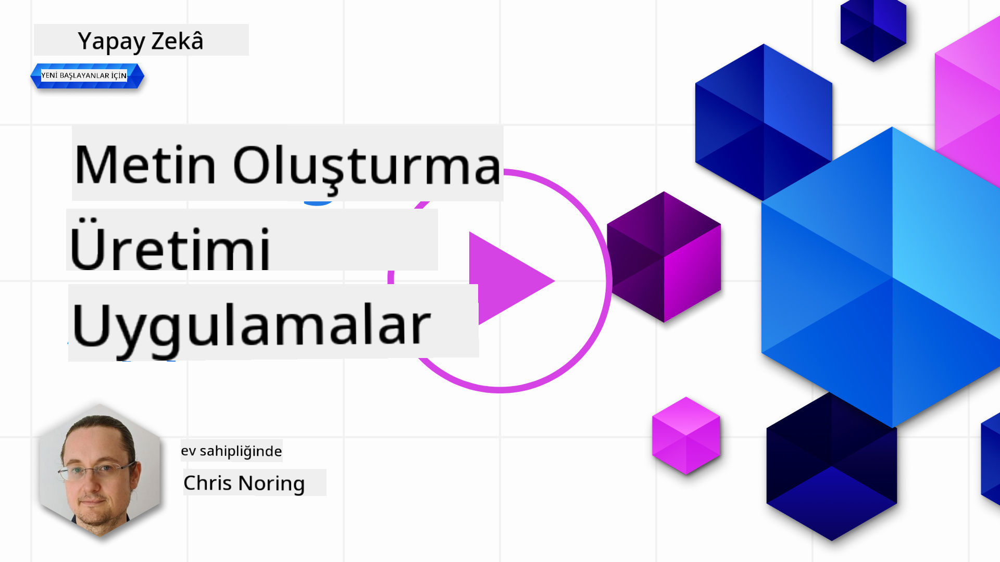

<!--
CO_OP_TRANSLATOR_METADATA:
{
  "original_hash": "5ec6c92b629564538ef397c550adb73e",
  "translation_date": "2025-05-19T16:55:16+00:00",
  "source_file": "06-text-generation-apps/README.md",
  "language_code": "tr"
}
-->
# Metin Üretme Uygulamaları Oluşturma

[](https://aka.ms/gen-ai-lesson6-gh?WT.mc_id=academic-105485-koreyst)

> _(Bu dersin videosunu izlemek için yukarıdaki görsele tıklayın)_

Bu müfredatta şimdiye kadar, istemler ve hatta "istem mühendisliği" adlı bir disiplin gibi temel kavramlar gördünüz. ChatGPT, Office 365, Microsoft Power Platform ve daha fazlası gibi etkileşimde bulunabileceğiniz birçok araç, bir şeyler başarmak için istemleri kullanmanıza destek sağlar.

Bir uygulamaya böyle bir deneyim eklemek istiyorsanız, istemler, tamamlamalar gibi kavramları anlamanız ve çalışmak için bir kütüphane seçmeniz gerekir. Tam olarak bu bölümde öğreneceğiniz şey de bu.

## Giriş

Bu bölümde:

- openai kütüphanesini ve temel kavramlarını öğreneceksiniz.
- openai kullanarak bir metin üretme uygulaması oluşturacaksınız.
- Metin üretme uygulaması oluşturmak için istem, sıcaklık ve tokenlar gibi kavramları nasıl kullanacağınızı anlayacaksınız.

## Öğrenme Hedefleri

Bu dersin sonunda:

- Metin üretme uygulamasının ne olduğunu açıklayabileceksiniz.
- openai kullanarak bir metin üretme uygulaması oluşturabileceksiniz.
- Uygulamanızı daha fazla veya daha az token kullanacak ve ayrıca sıcaklığı değiştirecek şekilde yapılandırabileceksiniz, böylece farklı çıktılar elde edebilirsiniz.

## Metin Üretme Uygulaması Nedir?

Genellikle bir uygulama oluşturduğunuzda aşağıdaki gibi bir arayüze sahiptir:

- Komut tabanlı. Konsol uygulamaları, bir komut yazıp bir görevi yerine getirdiğiniz tipik uygulamalardır. Örneğin, `git` bir komut tabanlı uygulamadır.
- Kullanıcı arayüzü (UI). Bazı uygulamalar, düğmelere tıkladığınız, metin girdiğiniz, seçenekleri seçtiğiniz ve daha fazlasını yaptığınız grafik kullanıcı arayüzlerine (GUI) sahiptir.

### Konsol ve UI uygulamaları sınırlıdır

Bir komut yazdığınız komut tabanlı bir uygulama ile karşılaştırın:

- **Sınırlıdır**. Herhangi bir komut yazamazsınız, yalnızca uygulamanın desteklediği komutları yazabilirsiniz.
- **Dil spesifik**. Bazı uygulamalar birçok dili destekler, ancak varsayılan olarak uygulama belirli bir dil için oluşturulmuştur, ek dil desteği ekleyebilseniz bile.

### Metin Üretme Uygulamalarının Faydaları

Peki bir metin üretme uygulaması nasıl farklıdır?

Bir metin üretme uygulamasında, daha fazla esnekliğe sahipsiniz, belirli bir komut setine veya belirli bir giriş diline bağlı değilsiniz. Bunun yerine, uygulama ile etkileşim kurmak için doğal dili kullanabilirsiniz. Başka bir avantajı, zaten geniş bir bilgi birikimi üzerinde eğitilmiş bir veri kaynağı ile etkileşimde bulunduğunuzdan, geleneksel bir uygulamanın bir veritabanında olanlarla sınırlı olabileceği durumlarda daha geniş bilgiye erişebilmenizdir.

### Metin Üretme Uygulamasıyla Neler Yapabilirim?

Birçok şey yapabilirsiniz. Örneğin:

- **Bir sohbet botu**. Şirketiniz ve ürünleri hakkında sorular yanıtlayan bir sohbet botu iyi bir eşleşme olabilir.
- **Yardımcı**. LLM'ler metin özetleme, metinden içgörüler elde etme, özgeçmiş gibi metinler üretme gibi konularda harikadır.
- **Kod asistanı**. Kullandığınız dil modeline bağlı olarak, kod yazmanıza yardımcı olan bir kod asistanı oluşturabilirsiniz. Örneğin, GitHub Copilot gibi bir ürünü ve ChatGPT'yi kullanarak kod yazmanıza yardımcı olabilirsiniz.

## Nasıl Başlayabilirim?

Bir LLM ile entegre olmanın bir yolunu bulmanız gerekiyor, bu genellikle şu iki yaklaşımı içerir:

- Bir API kullanın. Burada isteminizle web istekleri oluşturuyorsunuz ve üretilen metni geri alıyorsunuz.
- Bir kütüphane kullanın. Kütüphaneler, API çağrılarını kapsar ve kullanımlarını kolaylaştırır.

## Kütüphaneler/SDK'lar

LLM'lerle çalışmak için bilinen birkaç kütüphane vardır:

- **openai**, bu kütüphane modelinize bağlanmayı ve istem göndermeyi kolaylaştırır.

Daha üst seviyede çalışan kütüphaneler de vardır:

- **Langchain**. Langchain iyi bilinir ve Python'u destekler.
- **Semantic Kernel**. Semantic Kernel, Microsoft tarafından desteklenen ve C#, Python ve Java dillerini destekleyen bir kütüphanedir.

## openai Kullanarak İlk Uygulama

İlk uygulamamızı nasıl oluşturabileceğimizi, hangi kütüphanelere ihtiyacımız olduğunu, ne kadar gereklilik olduğunu ve daha fazlasını görelim.

### openai Kurulumu

OpenAI veya Azure OpenAI ile etkileşimde bulunmak için birçok kütüphane vardır. C#, Python, JavaScript, Java ve daha fazlası gibi birçok programlama dili de kullanılabilir. `openai` Python kütüphanesini kullanmayı seçtik, bu yüzden `pip` kullanarak kurulum yapacağız.

```bash
pip install openai
```

### Kaynak Oluşturma

Aşağıdaki adımları gerçekleştirmeniz gerekir:

- Azure üzerinde bir hesap oluşturun [https://azure.microsoft.com/free/](https://azure.microsoft.com/free/?WT.mc_id=academic-105485-koreyst).
- Azure OpenAI'ye erişim sağlayın. [https://learn.microsoft.com/azure/ai-services/openai/overview#how-do-i-get-access-to-azure-openai](https://learn.microsoft.com/azure/ai-services/openai/overview#how-do-i-get-access-to-azure-openai?WT.mc_id=academic-105485-koreyst) adresine gidin ve erişim isteğinde bulunun.

  > [!NOTE]
  > Yazıldığı sırada, Azure OpenAI'ye erişim için başvurmanız gerekmektedir.

- Python'u kurun <https://www.python.org/>
- Bir Azure OpenAI Hizmeti kaynağı oluşturun. [Kaynak oluşturma](https://learn.microsoft.com/azure/ai-services/openai/how-to/create-resource?pivots=web-portal?WT.mc_id=academic-105485-koreyst) kılavuzuna bakın.

### API Anahtarı ve Uç Noktayı Bulma

Bu noktada, `openai` kütüphanenize hangi API anahtarını kullanacağını söylemeniz gerekir. API anahtarınızı bulmak için Azure OpenAI kaynağınızın "Anahtarlar ve Uç Nokta" bölümüne gidin ve "Anahtar 1" değerini kopyalayın.


Bu bilgileri kopyaladığınıza göre, kütüphanelere bunu kullanmalarını talimat verelim.

> [!NOTE]
> API anahtarınızı kodunuzdan ayırmak değerlidir. Bunu çevresel değişkenler kullanarak yapabilirsiniz.
>
> - Çevresel değişkeni ayarlayın `OPENAI_API_KEY` to your API key.
>   `export OPENAI_API_KEY='sk-...'`

### Azure Yapılandırmasını Ayarlama

Azure OpenAI kullanıyorsanız, işte yapılandırmayı nasıl ayarlayacağınız:

```python
openai.api_type = 'azure'
openai.api_key = os.environ["OPENAI_API_KEY"]
openai.api_version = '2023-05-15'
openai.api_base = os.getenv("API_BASE")
```

Yukarıda, aşağıdakileri ayarlıyoruz:

- `api_type` to `azure`. This tells the library to use Azure OpenAI and not OpenAI.
- `api_key`, this is your API key found in the Azure Portal.
- `api_version`, this is the version of the API you want to use. At the time of writing, the latest version is `2023-05-15`.
- `api_base`, this is the endpoint of the API. You can find it in the Azure Portal next to your API key.

> [!NOTE] > `os.getenv` is a function that reads environment variables. You can use it to read environment variables like `OPENAI_API_KEY` and `API_BASE`. Set these environment variables in your terminal or by using a library like `dotenv`.

## Generate text

The way to generate text is to use the `Completion` sınıfı. İşte bir örnek:

```python
prompt = "Complete the following: Once upon a time there was a"

completion = openai.Completion.create(model="davinci-002", prompt=prompt)
print(completion.choices[0].text)
```

Yukarıdaki kodda, kullanmak istediğimiz modeli ve istemi geçerek bir tamamlama nesnesi oluşturuyoruz. Ardından üretilen metni yazdırıyoruz.

### Sohbet Tamamlamaları

Şimdiye kadar `Completion` to generate text. But there's another class called `ChatCompletion` kullanarak sohbet botları için daha uygun bir yapı kullandık. İşte bunu kullanmanın bir örneği:

```python
import openai

openai.api_key = "sk-..."

completion = openai.ChatCompletion.create(model="gpt-3.5-turbo", messages=[{"role": "user", "content": "Hello world"}])
print(completion.choices[0].message.content)
```

Bu işlevsellik hakkında daha fazla bilgi gelecek bir bölümde.

## Egzersiz - İlk Metin Üretme Uygulamanız

openai'yi nasıl kurup yapılandıracağımızı öğrendik, şimdi ilk metin üretme uygulamanızı oluşturma zamanı. Uygulamanızı oluşturmak için şu adımları izleyin:

1. Sanal bir ortam oluşturun ve openai'yi kurun:

   ```bash
   python -m venv venv
   source venv/bin/activate
   pip install openai
   ```

   > [!NOTE]
   > Windows kullanıyorsanız `venv\Scripts\activate` instead of `source venv/bin/activate`.

   > [!NOTE]
   > Locate your Azure OpenAI key by going to [https://portal.azure.com/](https://portal.azure.com/?WT.mc_id=academic-105485-koreyst) and search for `Open AI` and select the `Open AI resource` and then select `Keys and Endpoint` and copy the `Key 1` değerini yazın.

1. _app.py_ dosyası oluşturun ve aşağıdaki kodu verin:

   ```python
   import openai

   openai.api_key = "<replace this value with your open ai key or Azure OpenAI key>"

   openai.api_type = 'azure'
   openai.api_version = '2023-05-15'
   openai.api_base = "<endpoint found in Azure Portal where your API key is>"
   deployment_name = "<deployment name>"

   # add your completion code
   prompt = "Complete the following: Once upon a time there was a"
   messages = [{"role": "user", "content": prompt}]

   # make completion
   completion = openai.chat.completions.create(model=deployment_name, messages=messages)

   # print response
   print(completion.choices[0].message.content)
   ```

   > [!NOTE]
   > Azure OpenAI kullanıyorsanız, `api_type` to `azure` and set the `api_key` ayarını Azure OpenAI anahtarınıza yapmanız gerekmektedir.

   Aşağıdaki gibi bir çıktı görmelisiniz:

   ```output
    very unhappy _____.

   Once upon a time there was a very unhappy mermaid.
   ```

## Farklı Şeyler İçin Farklı Türde İstemler

Artık bir istem kullanarak metin nasıl üretileceğini gördünüz. Çalıştırabileceğiniz ve farklı metin türleri üretmek için değiştirebileceğiniz bir programınız bile var.

İstemler çeşitli görevler için kullanılabilir. Örneğin:

- **Bir tür metin üretin**. Örneğin, bir şiir, bir sınav için sorular vb. üretebilirsiniz.
- **Bilgi arama**. İstemleri, web geliştirmede 'CORS ne anlama gelir?' gibi bilgileri aramak için kullanabilirsiniz.
- **Kod üretme**. İstemleri, e-posta doğrulama için kullanılan bir düzenli ifade geliştirmek veya neden bir web uygulaması gibi tüm bir programı üretmek için kullanabilirsiniz.

## Daha Pratik Bir Kullanım Durumu: Bir Tarif Üretici

Evde malzemeleriniz olduğunu ve bir şeyler pişirmek istediğinizi hayal edin. Bunun için bir tarif gereklidir. Tarifleri bulmanın bir yolu bir arama motoru kullanmak ya da bir LLM kullanmaktır.

Şu şekilde bir istem yazabilirsiniz:

> "Tavuk, patates ve havuç ile bir yemek için 5 tarif göster. Her tarifte kullanılan tüm malzemeleri listele"

Yukarıdaki isteme göre, şu şekilde bir yanıt alabilirsiniz:

```output
1. Roasted Chicken and Vegetables:
Ingredients:
- 4 chicken thighs
- 2 potatoes, cut into cubes
- 2 carrots, cut into cubes
- 2 tablespoons olive oil
- 2 cloves garlic, minced
- 1 teaspoon dried thyme
- 1 teaspoon dried oregano
- Salt and pepper, to taste

2. Chicken and Potato Stew:
Ingredients:
- 2 tablespoons olive oil
- 1 onion, diced
- 2 cloves garlic, minced
- 2 chicken breasts, cut into cubes
- 2 potatoes, cut into cubes
- 2 carrots, cut into cubes
- 1 teaspoon dried oregano
- 1 teaspoon dried thyme
- 1 cup chicken broth
- Salt and pepper, to taste

3. Chicken and Potato Bake:
Ingredients:
- 2 tablespoons olive oil
- 2 chicken breasts, cut into cubes
- 2 potatoes, cut into cubes
- 2 carrots, cut into cubes
- 1 onion, diced
- 2 cloves garlic, minced
- 1 teaspoon dried oregano
- 1 teaspoon dried thyme
- 1 cup chicken broth
- Salt and pepper, to taste

4. Chicken and Potato Soup:
Ingredients:
- 2 tablespoons olive oil
- 1 onion, diced
- 2 cloves garlic, minced
- 2 chicken breasts, cut into cubes
- 2 potatoes, cut into cubes
- 2 carrots, cut into cubes
- 1 teaspoon dried oregano
- 1 teaspoon dried thyme
- 4 cups chicken broth
- Salt and pepper, to taste

5. Chicken and Potato Hash:
Ingredients:
- 2 tablespoons olive oil
- 2 chicken breasts, cut into cubes
- 2 potatoes, cut into cubes
- 2 carrots, cut into cubes
- 1 onion, diced
- 2 cloves garlic, minced
- 1 teaspoon dried oregano
```

Bu sonuç harika, ne pişireceğimi biliyorum. Bu noktada, faydalı olabilecek iyileştirmeler şunlardır:

- Sevmediğim veya alerjik olduğum malzemeleri filtreleme.
- Evde olmayan malzemeler için bir alışveriş listesi oluşturma.

Yukarıdaki durumlar için ek bir istem ekleyelim:

> "Sarımsak içeren tarifleri çıkarın çünkü alerjim var ve başka bir şeyle değiştirin. Ayrıca, evde tavuk, patates ve havuç olduğunu düşünerek tarifler için bir alışveriş listesi oluşturun."

Artık yeni bir sonuç elde ettiniz, yani:

```output
1. Roasted Chicken and Vegetables:
Ingredients:
- 4 chicken thighs
- 2 potatoes, cut into cubes
- 2 carrots, cut into cubes
- 2 tablespoons olive oil
- 1 teaspoon dried thyme
- 1 teaspoon dried oregano
- Salt and pepper, to taste

2. Chicken and Potato Stew:
Ingredients:
- 2 tablespoons olive oil
- 1 onion, diced
- 2 chicken breasts, cut into cubes
- 2 potatoes, cut into cubes
- 2 carrots, cut into cubes
- 1 teaspoon dried oregano
- 1 teaspoon dried thyme
- 1 cup chicken broth
- Salt and pepper, to taste

3. Chicken and Potato Bake:
Ingredients:
- 2 tablespoons olive oil
- 2 chicken breasts, cut into cubes
- 2 potatoes, cut into cubes
- 2 carrots, cut into cubes
- 1 onion, diced
- 1 teaspoon dried oregano
- 1 teaspoon dried thyme
- 1 cup chicken broth
- Salt and pepper, to taste

4. Chicken and Potato Soup:
Ingredients:
- 2 tablespoons olive oil
- 1 onion, diced
- 2 chicken breasts, cut into cubes
- 2 potatoes, cut into cubes
- 2 carrots, cut into cubes
- 1 teaspoon dried oregano
- 1 teaspoon dried thyme
- 4 cups chicken broth
- Salt and pepper, to taste

5. Chicken and Potato Hash:
Ingredients:
- 2 tablespoons olive oil
- 2 chicken breasts, cut into cubes
- 2 potatoes, cut into cubes
- 2 carrots, cut into cubes
- 1 onion, diced
- 1 teaspoon dried oregano

Shopping List:
- Olive oil
- Onion
- Thyme
- Oregano
- Salt
- Pepper
```

İşte sarımsak içermeyen beş tarifiniz ve ayrıca evde olanları dikkate alarak bir alışveriş listeniz var.

## Egzersiz - Bir Tarif Üretici Oluşturma

Artık bir senaryo oynadık, şimdi gösterilen senaryoya uygun kod yazalım. Bunu yapmak için şu adımları izleyin:

1. Mevcut _app.py_ dosyasını başlangıç noktası olarak kullanın
1. `prompt` değişkenini bulun ve kodunu aşağıdaki şekilde değiştirin:

   ```python
   prompt = "Show me 5 recipes for a dish with the following ingredients: chicken, potatoes, and carrots. Per recipe, list all the ingredients used"
   ```

   Şimdi kodu çalıştırırsanız, şu şekilde bir çıktı görmelisiniz:

   ```output
   -Chicken Stew with Potatoes and Carrots: 3 tablespoons oil, 1 onion, chopped, 2 cloves garlic, minced, 1 carrot, peeled and chopped, 1 potato, peeled and chopped, 1 bay leaf, 1 thyme sprig, 1/2 teaspoon salt, 1/4 teaspoon black pepper, 1 1/2 cups chicken broth, 1/2 cup dry white wine, 2 tablespoons chopped fresh parsley, 2 tablespoons unsalted butter, 1 1/2 pounds boneless, skinless chicken thighs, cut into 1-inch pieces
   -Oven-Roasted Chicken with Potatoes and Carrots: 3 tablespoons extra-virgin olive oil, 1 tablespoon Dijon mustard, 1 tablespoon chopped fresh rosemary, 1 tablespoon chopped fresh thyme, 4 cloves garlic, minced, 1 1/2 pounds small red potatoes, quartered, 1 1/2 pounds carrots, quartered lengthwise, 1/2 teaspoon salt, 1/4 teaspoon black pepper, 1 (4-pound) whole chicken
   -Chicken, Potato, and Carrot Casserole: cooking spray, 1 large onion, chopped, 2 cloves garlic, minced, 1 carrot, peeled and shredded, 1 potato, peeled and shredded, 1/2 teaspoon dried thyme leaves, 1/4 teaspoon salt, 1/4 teaspoon black pepper, 2 cups fat-free, low-sodium chicken broth, 1 cup frozen peas, 1/4 cup all-purpose flour, 1 cup 2% reduced-fat milk, 1/4 cup grated Parmesan cheese

   -One Pot Chicken and Potato Dinner: 2 tablespoons olive oil, 1 pound boneless, skinless chicken thighs, cut into 1-inch pieces, 1 large onion, chopped, 3 cloves garlic, minced, 1 carrot, peeled and chopped, 1 potato, peeled and chopped, 1 bay leaf, 1 thyme sprig, 1/2 teaspoon salt, 1/4 teaspoon black pepper, 2 cups chicken broth, 1/2 cup dry white wine

   -Chicken, Potato, and Carrot Curry: 1 tablespoon vegetable oil, 1 large onion, chopped, 2 cloves garlic, minced, 1 carrot, peeled and chopped, 1 potato, peeled and chopped, 1 teaspoon ground coriander, 1 teaspoon ground cumin, 1/2 teaspoon ground turmeric, 1/2 teaspoon ground ginger, 1/4 teaspoon cayenne pepper, 2 cups chicken broth, 1/2 cup dry white wine, 1 (15-ounce) can chickpeas, drained and rinsed, 1/2 cup raisins, 1/2 cup chopped fresh cilantro
   ```

   > NOT, LLM'niz belirleyici değildir, bu nedenle programı her çalıştırdığınızda farklı sonuçlar alabilirsiniz.

   Harika, şimdi nasıl iyileştirebileceğimize bakalım. İyileştirmek için, kodun esnek olmasını sağlamak istiyoruz, böylece malzemeler ve tarif sayısı geliştirilebilir ve değiştirilebilir.

1. Kodu şu şekilde değiştirin:

   ```python
   no_recipes = input("No of recipes (for example, 5): ")

   ingredients = input("List of ingredients (for example, chicken, potatoes, and carrots): ")

   # interpolate the number of recipes into the prompt an ingredients
   prompt = f"Show me {no_recipes} recipes for a dish with the following ingredients: {ingredients}. Per recipe, list all the ingredients used"
   ```

   Kodun bir test çalışması, şu şekilde görünebilir:

   ```output
   No of recipes (for example, 5): 3
   List of ingredients (for example, chicken, potatoes, and carrots): milk,strawberries

   -Strawberry milk shake: milk, strawberries, sugar, vanilla extract, ice cubes
   -Strawberry shortcake: milk, flour, baking powder, sugar, salt, unsalted butter, strawberries, whipped cream
   -Strawberry milk: milk, strawberries, sugar, vanilla extract
   ```

### Filtre ve Alışveriş Listesi Ekleyerek İyileştirme

Şu anda, tarif üretebilen bir uygulamamız var ve hem tarif sayısı hem de kullanılan malzemeler için kullanıcının girdilerine dayandığı için esnek.

Bunu daha da geliştirmek için şunları eklemek istiyoruz:

- **Malzemeleri filtrele**. Sevmediğimiz veya alerjik olduğumuz malzemeleri filtrelemek istiyoruz. Bu değişikliği gerçekleştirmek için mevcut istemimizi düzenleyebilir ve sonuna bir filtre koşulu ekleyebiliriz:

  ```python
  filter = input("Filter (for example, vegetarian, vegan, or gluten-free): ")

  prompt = f"Show me {no_recipes} recipes for a dish with the following ingredients: {ingredients}. Per recipe, list all the ingredients used, no {filter}"
  ```

  Yukarıda, istemin sonuna `{filter}` ekledik ve ayrıca filtre değerini kullanıcıdan alıyoruz.

  Programı çalıştırmanın örnek bir girişi şu şekilde görünebilir:

  ```output
  No of recipes (for example, 5): 3
  List of ingredients (for example, chicken, potatoes, and carrots): onion,milk
  Filter (for example, vegetarian, vegan, or gluten-free): no milk

  1. French Onion Soup

  Ingredients:

  -1 large onion, sliced
  -3 cups beef broth
  -1 cup milk
  -6 slices french bread
  -1/4 cup shredded Parmesan cheese
  -1 tablespoon butter
  -1 teaspoon dried thyme
  -1/4 teaspoon salt
  -1/4 teaspoon black pepper

  Instructions:

  1. In a large pot, sauté onions in butter until golden brown.
  2. Add beef broth, milk, thyme, salt, and pepper. Bring to a boil.
  3. Reduce heat and simmer for 10 minutes.
  4. Place french bread slices on soup bowls.
  5. Ladle soup over bread.
  6. Sprinkle with Parmesan cheese.

  2. Onion and Potato Soup

  Ingredients:

  -1 large onion, chopped
  -2 cups potatoes, diced
  -3 cups vegetable broth
  -1 cup milk
  -1/4 teaspoon black pepper

  Instructions:

  1. In a large pot, sauté onions in butter until golden brown.
  2. Add potatoes, vegetable broth, milk, and pepper. Bring to a boil.
  3. Reduce heat and simmer for 10 minutes.
  4. Serve hot.

  3. Creamy Onion Soup

  Ingredients:

  -1 large onion, chopped
  -3 cups vegetable broth
  -1 cup milk
  -1/4 teaspoon black pepper
  -1/4 cup all-purpose flour
  -1/2 cup shredded Parmesan cheese

  Instructions:

  1. In a large pot, sauté onions in butter until golden brown.
  2. Add vegetable broth, milk, and pepper. Bring to a boil.
  3. Reduce heat and simmer for 10 minutes.
  4. In a small bowl, whisk together flour and Parmesan cheese until smooth.
  5. Add to soup and simmer for an additional 5 minutes, or until soup has thickened.
  ```

  Gördüğünüz gibi, süt içeren tarifler filtrelenmiştir. Ancak, laktoz intoleransınız varsa, peynir içeren tarifleri de filtrelemek isteyebilirsiniz, bu yüzden net olmanız gerekebilir.

- **Alışveriş listesi oluşturma**. Evde zaten ne olduğunu dikkate alarak bir alışveriş listesi oluşturmak istiyoruz.

  Bu işlevsellik için her şeyi tek bir istemde çözmeyi deneyebiliriz veya iki isteme bölebiliriz. İkinci yaklaşımı deneyelim. Burada ek bir istem eklemeyi öneriyoruz, ancak bunun çalışması için, ilk istemin sonucunu ikinci isteme bağlam olarak eklememiz gerekiyor.

  Kodun ilk istemin sonucunu yazdıran kısmını bulun ve aşağıdaki kodu ekleyin:

  ```python
  old_prompt_result = completion.choices[0].message.content
  prompt = "Produce a shopping list for the generated recipes and please don't include ingredients that I already have."

  new_prompt = f"{old_prompt_result} {prompt}"
  messages = [{"role": "user", "content": new_prompt}]
  completion = openai.Completion.create(engine=deployment_name, messages=messages, max_tokens=1200)

  # print response
  print("Shopping list:")
  print(completion.choices[0].message.content)
  ```

  Şunlara dikkat edin:

  1. İlk istemden gelen sonucu yeni isteme ekleyerek yeni bir istem oluşturuyoruz:

     ```python
     new_prompt = f"{old_prompt_result} {prompt}"
     ```

  1. Yeni bir istek yapıyoruz, ancak ilk istemde talep ettiğimiz token sayısını da dikkate alarak, bu sefer `max_tokens` 1200 olduğunu söylüyoruz.

     ```python
     completion = openai.Completion.create(engine=deployment_name, prompt=new_prompt, max_tokens=1200)
     ```

     Bu kodu test ettiğimizde, şimdi aşağıdaki çıktıya ulaşıyoruz:

     ```output
     No of recipes (for example, 5): 2
     List of ingredients (for example, chicken, potatoes, and carrots): apple,flour
     Filter (for example, vegetarian, vegan, or gluten-free): sugar


     -Apple and flour pancakes: 1 cup flour, 1/2 tsp baking powder, 1/2 tsp baking soda, 1/4 tsp salt, 1 tbsp sugar, 1 egg, 1 cup buttermilk or sour milk, 1/4 cup melted butter, 1 Granny Smith apple, peeled and grated
     -Apple fritters: 1-1/2 cups flour, 1 tsp baking powder, 1/4 tsp salt, 1/4 tsp baking soda, 1/4 tsp nutmeg, 1/4 tsp cinnamon, 1/4 tsp allspice, 1/4 cup sugar, 1/4 cup vegetable shortening, 1/4 cup milk, 1 egg, 2 cups shredded, peeled apples
     Shopping list:
     -Flour, baking powder, baking soda, salt, sugar, egg, buttermilk, butter, apple, nutmeg, cinnamon, allspice
     ```

## Kurulumunuzu İyileştirin

Şu ana kadar çalışan bir kodumuz var, ancak bazı ayarlamalar yaparak işleri daha da geliştirmeliyiz. Yapmamız gereken bazı şeyler şunlardır:

- **Gizlilikleri koddan ayırın**, API anahtarı gibi. Gizlilikler kodda yer almaz ve güvenli bir yerde saklanmalıdır. Gizlilikleri koddan ayırmak için çevresel değişkenler ve `python-dotenv` to load them from a file. Here's how that would look like in code:

  1. Create a `.env` dosyası gibi kütüphaneler kullanabiliriz:

     ```bash
     OPENAI_API_KEY=sk-...
     ```

     > Not, Azure için aşağıdaki çevresel değişkenleri ayarlamanız gerekir:

     ```bash
     OPENAI_API_TYPE=azure
     OPENAI_API_VERSION=2023-05-15
     OPENAI_API_BASE=<replace>
     ```

     Kodda çevresel değişkenleri şu şekilde yükleyebilirsiniz:

     ```python
     from dotenv import load_dotenv

     load_dotenv()

     openai.api_key = os.environ["OPENAI_API_KEY"]
     ```

- **Token uzunluğu hakkında bir kelime**. İstediğimiz metni oluşturmak için ne kadar token gerektiğini düşünmeliyiz. Tokenlar para maliyeti, bu yüzden mümkün olduğunda, kullandığımız token sayısını ekonomik olarak kullanmaya çalışmalıyız. Örneğin, istemi daha az token kullanacak şekilde ifade edebilir miyiz?

  Kullanılan tokenları değiştirmek için `max_tokens` parametresini kullanabilirsiniz. Örneğin, 100 token kullanmak istiyorsanız, şu şekilde yaparsınız:

  ```python
  completion = client.chat.completions.create(model=deployment, messages=messages, max_tokens=100)
  ```

- **Sıcaklıkla Deney Yapma**. Sıcaklık, programımızın nasıl performans gösterdiği için önemli bir bağlamdır. Sıcaklık değeri ne kadar yüksekse, çıktı o kadar rastgele olur. Tersine, sıcaklık değeri ne kadar düşükse, çıktı o kadar öngörülebilir olur. Çıktınızda çeşitlilik isteyip istemediğinizi düşünün.

  Sıcaklığı değiştirmek için `temperature` parametresini kullanabilirsiniz. Örneğin, 0.5 sıcaklık kullanmak istiyorsanız, şu şekilde yaparsınız:

  ```python
  completion = client.chat.completions.create(model=deployment, messages=messages, temperature=0.5)
  ```

  > Not, 1.0'a ne kadar yakınsa, çıktı o kadar çeşitli olur.

## Görev

Bu görev için ne inşa edeceğinizi seçebilirsiniz.

İşte bazı öneriler:

- Tarif üretici uygulamasını daha da geliştirmek için ayarlamalar yapın. Sıcaklık değerleri ve istemlerle oynayın, neler bulabileceğinizi görün.
- Bir "çalışma arkadaşı" oluşturun. Bu uygulama, örneğin Python gibi bir konu hakkında sorular yanıtlayabilmelidir, "Python'da belirli bir konu nedir?" gibi istemleriniz olabilir veya belirli bir konu için kod gösteren bir isteminiz olabilir.
- Tarih botu, tarihi canlandırın, botu belirli bir tarihi karakter olarak yönlendirin ve hayatı ve

**Feragatname**: 
Bu belge, AI çeviri hizmeti [Co-op Translator](https://github.com/Azure/co-op-translator) kullanılarak çevrilmiştir. Doğruluk için çaba gösteriyoruz, ancak otomatik çevirilerin hata veya yanlışlık içerebileceğini lütfen unutmayın. Belgenin orijinal dili, yetkili kaynak olarak kabul edilmelidir. Kritik bilgiler için profesyonel insan çevirisi önerilir. Bu çevirinin kullanımından doğabilecek yanlış anlamalar veya yanlış yorumlamalar için sorumluluk kabul etmiyoruz.