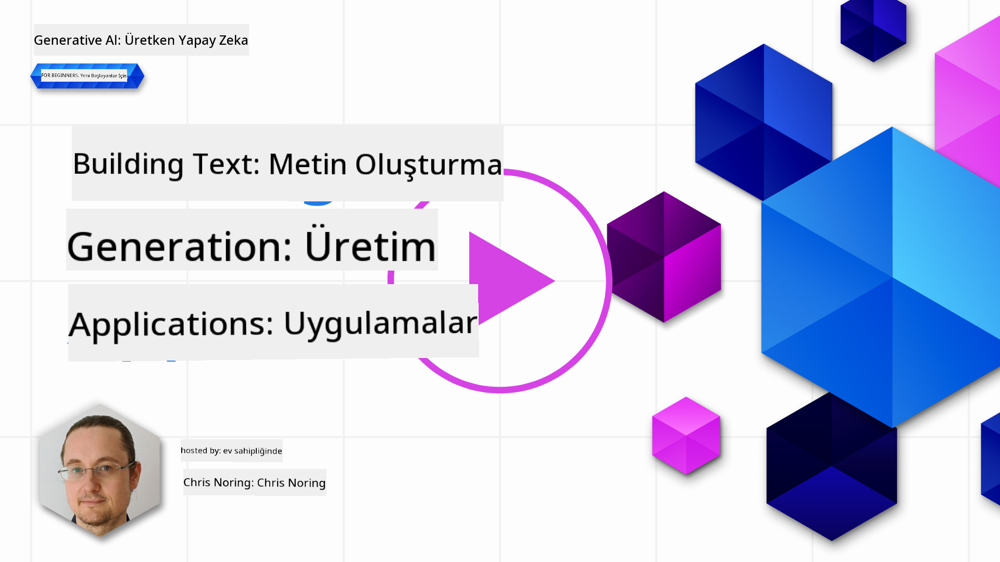

<!--
CO_OP_TRANSLATOR_METADATA:
{
  "original_hash": "ce8224073b86b728ed52b19bed7932fd",
  "translation_date": "2025-07-09T11:57:01+00:00",
  "source_file": "06-text-generation-apps/README.md",
  "language_code": "tr"
}
-->
# Metin Üretim Uygulamaları Geliştirme

[](https://aka.ms/gen-ai-lesson6-gh?WT.mc_id=academic-105485-koreyst)

> _(Dersi izlemek için yukarıdaki görsele tıklayın)_

Bu müfredat boyunca gördüğünüz gibi, promptlar gibi temel kavramlar ve hatta "prompt mühendisliği" adı verilen bir disiplin var. ChatGPT, Office 365, Microsoft Power Platform ve daha fazlası gibi birçok araç, bir şeyler başarmak için prompt kullanmanızı destekliyor.

Bir uygulamaya böyle bir deneyim eklemek istiyorsanız, promptlar, tamamlamalar gibi kavramları anlamalı ve çalışmak için bir kütüphane seçmelisiniz. İşte bu bölümde tam olarak bunu öğreneceksiniz.

## Giriş

Bu bölümde:

- openai kütüphanesi ve temel kavramları hakkında bilgi edineceksiniz.
- openai kullanarak bir metin üretim uygulaması geliştireceksiniz.
- prompt, sıcaklık (temperature) ve tokenlar gibi kavramları kullanarak metin üretim uygulaması nasıl yapılır anlayacaksınız.

## Öğrenme hedefleri

Bu dersin sonunda:

- Metin üretim uygulamasının ne olduğunu açıklayabileceksiniz.
- openai kullanarak bir metin üretim uygulaması geliştirebileceksiniz.
- Uygulamanızı daha fazla veya daha az token kullanacak şekilde yapılandırabilecek ve farklı çıktılar için sıcaklığı değiştirebileceksiniz.

## Metin üretim uygulaması nedir?

Normalde bir uygulama geliştirirken aşağıdaki gibi bir arayüzü olur:

- Komut tabanlı. Konsol uygulamaları, komut yazdığınız ve bir görev gerçekleştiren tipik uygulamalardır. Örneğin, `git` komut tabanlı bir uygulamadır.
- Kullanıcı arayüzü (UI). Bazı uygulamalar, butonlara tıklayabileceğiniz, metin girebileceğiniz, seçenekler seçebileceğiniz grafiksel kullanıcı arayüzlerine (GUI) sahiptir.

### Konsol ve UI uygulamaları sınırlıdır

Bir komut tabanlı uygulama ile karşılaştırın:

- **Sınırlıdır**. Herhangi bir komut yazamazsınız, sadece uygulamanın desteklediği komutları kullanabilirsiniz.
- **Dil spesifik**. Bazı uygulamalar birçok dili destekler, ancak varsayılan olarak uygulama belirli bir dil için geliştirilmiştir, ek dil desteği ekleyebilirsiniz.

### Metin üretim uygulamalarının avantajları

Peki metin üretim uygulaması nasıl farklıdır?

Metin üretim uygulamasında daha fazla esneklik vardır, belirli komutlar veya belirli bir giriş dili ile sınırlı değilsiniz. Bunun yerine, uygulama ile doğal dil kullanarak etkileşim kurabilirsiniz. Bir diğer avantaj ise, zaten geniş bir bilgi kümesi üzerinde eğitilmiş bir veri kaynağı ile etkileşimde bulunmanızdır; geleneksel bir uygulama ise genellikle veritabanındaki bilgilerle sınırlıdır.

### Metin üretim uygulaması ile neler yapabilirim?

Birçok şey yapabilirsiniz. Örneğin:

- **Bir sohbet botu**. Şirketiniz ve ürünleri hakkında soruları yanıtlayan bir sohbet botu iyi bir örnek olabilir.
- **Yardımcı**. LLM’ler metin özetleme, metinden çıkarım yapma, özgeçmiş gibi metinler üretme gibi konularda çok iyidir.
- **Kod asistanı**. Kullandığınız dil modeline bağlı olarak, kod yazmanıza yardımcı olan bir kod asistanı geliştirebilirsiniz. Örneğin, GitHub Copilot veya ChatGPT gibi ürünleri kod yazarken destek için kullanabilirsiniz.

## Nasıl başlayabilirim?

Genellikle LLM ile entegrasyon için iki yaklaşım vardır:

- Bir API kullanmak. Burada promptunuzla web istekleri oluşturur ve üretilen metni geri alırsınız.
- Bir kütüphane kullanmak. Kütüphaneler API çağrılarını kapsüller ve kullanımı kolaylaştırır.

## Kütüphaneler/SDK’lar

LLM’lerle çalışmak için bilinen birkaç kütüphane vardır:

- **openai**, bu kütüphane modelinize bağlanmayı ve prompt göndermeyi kolaylaştırır.

Daha üst seviyede çalışan kütüphaneler ise:

- **Langchain**. Langchain iyi bilinir ve Python’u destekler.
- **Semantic Kernel**. Semantic Kernel, Microsoft tarafından geliştirilen ve C#, Python ve Java dillerini destekleyen bir kütüphanedir.

## openai kullanarak ilk uygulama

İlk uygulamamızı nasıl geliştireceğimize, hangi kütüphanelere ihtiyacımız olduğuna ve ne kadar gerektirdiğine bakalım.

### openai kurulumu

OpenAI veya Azure OpenAI ile etkileşim için birçok kütüphane var. C#, Python, JavaScript, Java gibi birçok programlama dili kullanılabilir. Biz `openai` Python kütüphanesini seçtik, bu yüzden `pip` ile kuracağız.

```bash
pip install openai
```

### Kaynak oluşturma

Aşağıdaki adımları yapmanız gerekiyor:

- Azure’da bir hesap oluşturun [https://azure.microsoft.com/free/](https://azure.microsoft.com/free/?WT.mc_id=academic-105485-koreyst).
- Azure OpenAI erişimi alın. [https://learn.microsoft.com/azure/ai-services/openai/overview#how-do-i-get-access-to-azure-openai](https://learn.microsoft.com/azure/ai-services/openai/overview#how-do-i-get-access-to-azure-openai?WT.mc_id=academic-105485-koreyst) adresine gidip erişim talep edin.

  > [!NOTE]
  > Yazının yazıldığı tarihte Azure OpenAI erişimi için başvuru yapmanız gerekiyor.

- Python’u kurun <https://www.python.org/>
- Azure OpenAI Hizmeti kaynağı oluşturun. Kaynak oluşturma rehberine bakın: [create a resource](https://learn.microsoft.com/azure/ai-services/openai/how-to/create-resource?pivots=web-portal?WT.mc_id=academic-105485-koreyst).

### API anahtarı ve uç noktayı bulun

Şimdi `openai` kütüphanesine hangi API anahtarını kullanacağını söylemeniz gerekiyor. API anahtarınızı bulmak için Azure OpenAI kaynağınızın "Keys and Endpoint" bölümüne gidin ve "Key 1" değerini kopyalayın.


Bu bilgiyi kopyaladıktan sonra, kütüphanelere bunu kullanmasını söyleyelim.

> [!NOTE]
> API anahtarınızı koddan ayrı tutmak faydalıdır. Bunu ortam değişkenleri kullanarak yapabilirsiniz.
>
> - `OPENAI_API_KEY` ortam değişkenini API anahtarınız olarak ayarlayın.
>   `export OPENAI_API_KEY='sk-...'`

### Azure yapılandırmasını ayarlama

Azure OpenAI kullanıyorsanız, yapılandırmayı şöyle yaparsınız:

```python
openai.api_type = 'azure'
openai.api_key = os.environ["OPENAI_API_KEY"]
openai.api_version = '2023-05-15'
openai.api_base = os.getenv("API_BASE")
```

Yukarıda şunları ayarlıyoruz:

- `api_type` değerini `azure` yapıyoruz. Bu, kütüphaneye Azure OpenAI kullanacağını söylüyor, OpenAI değil.
- `api_key`, Azure Portal’da bulduğunuz API anahtarı.
- `api_version`, kullanmak istediğiniz API sürümü. Yazının yazıldığı tarihte en güncel sürüm `2023-05-15`.
- `api_base`, API’nin uç noktası. Azure Portal’da API anahtarınızın yanında bulabilirsiniz.

> [!NOTE] > `os.getenv` ortam değişkenlerini okuyan bir fonksiyondur. `OPENAI_API_KEY` ve `API_BASE` gibi ortam değişkenlerini okumak için kullanabilirsiniz. Bu ortam değişkenlerini terminalinizde veya `dotenv` gibi bir kütüphane ile ayarlayın.

## Metin üretme

Metin üretmenin yolu `Completion` sınıfını kullanmaktır. İşte bir örnek:

```python
prompt = "Complete the following: Once upon a time there was a"

completion = openai.Completion.create(model="davinci-002", prompt=prompt)
print(completion.choices[0].text)
```

Yukarıdaki kodda, bir completion nesnesi oluşturuyoruz, kullanmak istediğimiz modeli ve promptu veriyoruz. Sonra üretilen metni yazdırıyoruz.

### Sohbet tamamlamaları

Şimdiye kadar `Completion` kullanarak metin ürettik. Ancak sohbet botları için daha uygun olan `ChatCompletion` adında başka bir sınıf var. İşte kullanımı:

```python
import openai

openai.api_key = "sk-..."

completion = openai.ChatCompletion.create(model="gpt-3.5-turbo", messages=[{"role": "user", "content": "Hello world"}])
print(completion.choices[0].message.content)
```

Bu işlevsellik hakkında daha fazla bilgi gelecek bölümlerde.

## Alıştırma - ilk metin üretim uygulamanız

Artık openai’yi nasıl kurup yapılandıracağımızı öğrendik, ilk metin üretim uygulamanızı geliştirme zamanı. Uygulamanızı geliştirmek için şu adımları izleyin:

1. Sanal ortam oluşturun ve openai’yi kurun:

   ```bash
   python -m venv venv
   source venv/bin/activate
   pip install openai
   ```

   > [!NOTE]
   > Windows kullanıyorsanız `source venv/bin/activate` yerine `venv\Scripts\activate` yazın.

   > [!NOTE]
   > Azure OpenAI anahtarınızı bulmak için [https://portal.azure.com/](https://portal.azure.com/?WT.mc_id=academic-105485-koreyst) adresine gidin, `Open AI` araması yapın, `Open AI resource` seçin, ardından `Keys and Endpoint` bölümünden `Key 1` değerini kopyalayın.

1. _app.py_ dosyası oluşturun ve aşağıdaki kodu ekleyin:

   ```python
   import openai

   openai.api_key = "<replace this value with your open ai key or Azure OpenAI key>"

   openai.api_type = 'azure'
   openai.api_version = '2023-05-15'
   openai.api_base = "<endpoint found in Azure Portal where your API key is>"
   deployment_name = "<deployment name>"

   # add your completion code
   prompt = "Complete the following: Once upon a time there was a"
   messages = [{"role": "user", "content": prompt}]

   # make completion
   completion = openai.chat.completions.create(model=deployment_name, messages=messages)

   # print response
   print(completion.choices[0].message.content)
   ```

   > [!NOTE]
   > Azure OpenAI kullanıyorsanız, `api_type` değerini `azure` yapmalı ve `api_key` olarak Azure OpenAI anahtarınızı ayarlamalısınız.

   Aşağıdaki gibi bir çıktı görmelisiniz:

   ```output
    very unhappy _____.

   Once upon a time there was a very unhappy mermaid.
   ```

## Farklı amaçlar için farklı prompt türleri

Artık prompt kullanarak metin üretmeyi gördünüz. Çalışan bir programınız var ve farklı metin türleri üretmek için değiştirebilirsiniz.

Promptlar her türlü görev için kullanılabilir. Örneğin:

- **Bir metin türü üretmek**. Örneğin, şiir, quiz soruları vb. üretebilirsiniz.
- **Bilgi aramak**. Örneğin, 'Web geliştirmede CORS ne anlama gelir?' gibi bilgi aramak için prompt kullanabilirsiniz.
- **Kod üretmek**. Örneğin, e-posta doğrulamak için düzenli ifade (regex) oluşturmak veya bir web uygulaması gibi tam bir program üretmek için prompt kullanabilirsiniz.

## Daha pratik bir örnek: tarif oluşturucu

Evde malzemeleriniz var ve bir şeyler pişirmek istiyorsunuz. Bunun için bir tarife ihtiyacınız var. Tarif bulmanın yolu arama motoru kullanmak ya da bir LLM kullanmak olabilir.

Şöyle bir prompt yazabilirsiniz:

> "Aşağıdaki malzemelerle yapılabilecek 5 yemek tarifi göster: tavuk, patates ve havuç. Her tarif için kullanılan tüm malzemeleri listele."

Bu prompta benzer bir yanıt alabilirsiniz:

```output
1. Roasted Chicken and Vegetables:
Ingredients:
- 4 chicken thighs
- 2 potatoes, cut into cubes
- 2 carrots, cut into cubes
- 2 tablespoons olive oil
- 2 cloves garlic, minced
- 1 teaspoon dried thyme
- 1 teaspoon dried oregano
- Salt and pepper, to taste

2. Chicken and Potato Stew:
Ingredients:
- 2 tablespoons olive oil
- 1 onion, diced
- 2 cloves garlic, minced
- 2 chicken breasts, cut into cubes
- 2 potatoes, cut into cubes
- 2 carrots, cut into cubes
- 1 teaspoon dried oregano
- 1 teaspoon dried thyme
- 1 cup chicken broth
- Salt and pepper, to taste

3. Chicken and Potato Bake:
Ingredients:
- 2 tablespoons olive oil
- 2 chicken breasts, cut into cubes
- 2 potatoes, cut into cubes
- 2 carrots, cut into cubes
- 1 onion, diced
- 2 cloves garlic, minced
- 1 teaspoon dried oregano
- 1 teaspoon dried thyme
- 1 cup chicken broth
- Salt and pepper, to taste

4. Chicken and Potato Soup:
Ingredients:
- 2 tablespoons olive oil
- 1 onion, diced
- 2 cloves garlic, minced
- 2 chicken breasts, cut into cubes
- 2 potatoes, cut into cubes
- 2 carrots, cut into cubes
- 1 teaspoon dried oregano
- 1 teaspoon dried thyme
- 4 cups chicken broth
- Salt and pepper, to taste

5. Chicken and Potato Hash:
Ingredients:
- 2 tablespoons olive oil
- 2 chicken breasts, cut into cubes
- 2 potatoes, cut into cubes
- 2 carrots, cut into cubes
- 1 onion, diced
- 2 cloves garlic, minced
- 1 teaspoon dried oregano
```

Bu sonuç harika, ne pişireceğimi biliyorum. Şimdi faydalı olabilecek geliştirmeler:

- Sevmediğim veya alerjim olan malzemeleri filtrelemek.
- Evde olmayan malzemeler için alışveriş listesi oluşturmak.

Bunlar için ek bir prompt ekleyelim:

> "Lütfen sarımsak içeren tarifleri çıkar çünkü ona alerjim var ve yerine başka bir şey koy. Ayrıca, evde tavuk, patates ve havuç olduğunu göz önünde bulundurarak tarifler için bir alışveriş listesi oluştur."

Şimdi yeni bir sonuç alırsınız:

```output
1. Roasted Chicken and Vegetables:
Ingredients:
- 4 chicken thighs
- 2 potatoes, cut into cubes
- 2 carrots, cut into cubes
- 2 tablespoons olive oil
- 1 teaspoon dried thyme
- 1 teaspoon dried oregano
- Salt and pepper, to taste

2. Chicken and Potato Stew:
Ingredients:
- 2 tablespoons olive oil
- 1 onion, diced
- 2 chicken breasts, cut into cubes
- 2 potatoes, cut into cubes
- 2 carrots, cut into cubes
- 1 teaspoon dried oregano
- 1 teaspoon dried thyme
- 1 cup chicken broth
- Salt and pepper, to taste

3. Chicken and Potato Bake:
Ingredients:
- 2 tablespoons olive oil
- 2 chicken breasts, cut into cubes
- 2 potatoes, cut into cubes
- 2 carrots, cut into cubes
- 1 onion, diced
- 1 teaspoon dried oregano
- 1 teaspoon dried thyme
- 1 cup chicken broth
- Salt and pepper, to taste

4. Chicken and Potato Soup:
Ingredients:
- 2 tablespoons olive oil
- 1 onion, diced
- 2 chicken breasts, cut into cubes
- 2 potatoes, cut into cubes
- 2 carrots, cut into cubes
- 1 teaspoon dried oregano
- 1 teaspoon dried thyme
- 4 cups chicken broth
- Salt and pepper, to taste

5. Chicken and Potato Hash:
Ingredients:
- 2 tablespoons olive oil
- 2 chicken breasts, cut into cubes
- 2 potatoes, cut into cubes
- 2 carrots, cut into cubes
- 1 onion, diced
- 1 teaspoon dried oregano

Shopping List:
- Olive oil
- Onion
- Thyme
- Oregano
- Salt
- Pepper
```

İşte sarımsak içermeyen beş tarif ve evde olan malzemeleri dikkate alan bir alışveriş listesi.

## Alıştırma - tarif oluşturucu yap

Senaryoyu oynadığımıza göre, şimdi bu senaryoya uygun kod yazalım. Şu adımları izleyin:

1. Mevcut _app.py_ dosyasını başlangıç noktası olarak kullanın.
1. `prompt` değişkenini bulun ve kodunu aşağıdaki gibi değiştirin:

   ```python
   prompt = "Show me 5 recipes for a dish with the following ingredients: chicken, potatoes, and carrots. Per recipe, list all the ingredients used"
   ```

   Şimdi kodu çalıştırırsanız, aşağıdakine benzer bir çıktı görmelisiniz:

   ```output
   -Chicken Stew with Potatoes and Carrots: 3 tablespoons oil, 1 onion, chopped, 2 cloves garlic, minced, 1 carrot, peeled and chopped, 1 potato, peeled and chopped, 1 bay leaf, 1 thyme sprig, 1/2 teaspoon salt, 1/4 teaspoon black pepper, 1 1/2 cups chicken broth, 1/2 cup dry white wine, 2 tablespoons chopped fresh parsley, 2 tablespoons unsalted butter, 1 1/2 pounds boneless, skinless chicken thighs, cut into 1-inch pieces
   -Oven-Roasted Chicken with Potatoes and Carrots: 3 tablespoons extra-virgin olive oil, 1 tablespoon Dijon mustard, 1 tablespoon chopped fresh rosemary, 1 tablespoon chopped fresh thyme, 4 cloves garlic, minced, 1 1/2 pounds small red potatoes, quartered, 1 1/2 pounds carrots, quartered lengthwise, 1/2 teaspoon salt, 1/4 teaspoon black pepper, 1 (4-pound) whole chicken
   -Chicken, Potato, and Carrot Casserole: cooking spray, 1 large onion, chopped, 2 cloves garlic, minced, 1 carrot, peeled and shredded, 1 potato, peeled and shredded, 1/2 teaspoon dried thyme leaves, 1/4 teaspoon salt, 1/4 teaspoon black pepper, 2 cups fat-free, low-sodium chicken broth, 1 cup frozen peas, 1/4 cup all-purpose flour, 1 cup 2% reduced-fat milk, 1/4 cup grated Parmesan cheese

   -One Pot Chicken and Potato Dinner: 2 tablespoons olive oil, 1 pound boneless, skinless chicken thighs, cut into 1-inch pieces, 1 large onion, chopped, 3 cloves garlic, minced, 1 carrot, peeled and chopped, 1 potato, peeled and chopped, 1 bay leaf, 1 thyme sprig, 1/2 teaspoon salt, 1/4 teaspoon black pepper, 2 cups chicken broth, 1/2 cup dry white wine

   -Chicken, Potato, and Carrot Curry: 1 tablespoon vegetable oil, 1 large onion, chopped, 2 cloves garlic, minced, 1 carrot, peeled and chopped, 1 potato, peeled and chopped, 1 teaspoon ground coriander, 1 teaspoon ground cumin, 1/2 teaspoon ground turmeric, 1/2 teaspoon ground ginger, 1/4 teaspoon cayenne pepper, 2 cups chicken broth, 1/2 cup dry white wine, 1 (15-ounce) can chickpeas, drained and rinsed, 1/2 cup raisins, 1/2 cup chopped fresh cilantro
   ```

   > NOT: LLM’ler deterministik değildir, bu yüzden programı her çalıştırdığınızda farklı sonuçlar alabilirsiniz.

Harika, şimdi işleri nasıl geliştirebileceğimize bakalım. Geliştirmek için kodun esnek olmasını istiyoruz, böylece tarif sayısı ve malzemeler değiştirilebilir olsun.

1. Kodu şu şekilde değiştirelim:

   ```python
   no_recipes = input("No of recipes (for example, 5): ")

   ingredients = input("List of ingredients (for example, chicken, potatoes, and carrots): ")

   # interpolate the number of recipes into the prompt an ingredients
   prompt = f"Show me {no_recipes} recipes for a dish with the following ingredients: {ingredients}. Per recipe, list all the ingredients used"
   ```

Test amaçlı kod çalıştırması şöyle olabilir:

```output
   No of recipes (for example, 5): 3
   List of ingredients (for example, chicken, potatoes, and carrots): milk,strawberries

   -Strawberry milk shake: milk, strawberries, sugar, vanilla extract, ice cubes
   -Strawberry shortcake: milk, flour, baking powder, sugar, salt, unsalted butter, strawberries, whipped cream
   -Strawberry milk: milk, strawberries, sugar, vanilla extract
   ```

### Filtre ve alışveriş listesi ekleyerek geliştirme

Artık tarif üretebilen çalışan bir uygulamamız var ve kullanıcıdan hem tarif sayısı hem de malzemelerle ilgili giriş alarak esnek.

Daha da geliştirmek için şunları eklemek istiyoruz:

- **Malzemeleri filtreleme**. Sevmediğimiz veya alerjimiz olan malzemeleri filtreleyebilmek. Bunu yapmak için mevcut promptu düzenleyip sonuna şöyle bir filtre koşulu ekleyebiliriz:

  ```python
  filter = input("Filter (for example, vegetarian, vegan, or gluten-free): ")

  prompt = f"Show me {no_recipes} recipes for a dish with the following ingredients: {ingredients}. Per recipe, list all the ingredients used, no {filter}"
  ```

Yukarıda, promptun sonuna `{filter}` ekledik ve kullanıcıdan filtre değerini aldık.

Programı çalıştırırken örnek bir giriş şöyle olabilir:

```output
  No of recipes (for example, 5): 3
  List of ingredients (for example, chicken, potatoes, and carrots): onion,milk
  Filter (for example, vegetarian, vegan, or gluten-free): no milk

  1. French Onion Soup

  Ingredients:

  -1 large onion, sliced
  -3 cups beef broth
  -1 cup milk
  -6 slices french bread
  -1/4 cup shredded Parmesan cheese
  -1 tablespoon butter
  -1 teaspoon dried thyme
  -1/4 teaspoon salt
  -1/4 teaspoon black pepper

  Instructions:

  1. In a large pot, sauté onions in butter until golden brown.
  2. Add beef broth, milk, thyme, salt, and pepper. Bring to a boil.
  3. Reduce heat and simmer for 10 minutes.
  4. Place french bread slices on soup bowls.
  5. Ladle soup over bread.
  6. Sprinkle with Parmesan cheese.

  2. Onion and Potato Soup

  Ingredients:

  -1 large onion, chopped
  -2 cups potatoes, diced
  -3 cups vegetable broth
  -1 cup milk
  -1/4 teaspoon black pepper

  Instructions:

  1. In a large pot, sauté onions in butter until golden brown.
  2. Add potatoes, vegetable broth, milk, and pepper. Bring to a boil.
  3. Reduce heat and simmer for 10 minutes.
  4. Serve hot.

  3. Creamy Onion Soup

  Ingredients:

  -1 large onion, chopped
  -3 cups vegetable broth
  -1 cup milk
  -1/4 teaspoon black pepper
  -1/4 cup all-purpose flour
  -1/2 cup shredded Parmesan cheese

  Instructions:

  1. In a large pot, sauté onions in butter until golden brown.
  2. Add vegetable broth, milk, and pepper. Bring to a boil.
  3. Reduce heat and simmer for 10 minutes.
  4. In a small bowl, whisk together flour and Parmesan cheese until smooth.
  5. Add to soup and simmer for an additional 5 minutes, or until soup has thickened.
  ```

Gördüğünüz gibi, içinde süt olan tarifler filtrelenmiş. Ancak laktoz intoleransınız varsa peynir içeren tarifleri de filtrelemek isteyebilirsiniz, bu yüzden net olmak önemli.

- **Alışveriş listesi oluşturma**. Evde olan malzemeleri dikkate alarak alışveriş listesi oluşturmak istiyoruz.

  Bu işlevsellik için her şeyi tek bir promptta çözebiliriz ya da iki prompta bölebiliriz. İkinci yaklaşımı deneyelim. Burada ek bir prompt ekliyoruz, ancak bunun çalışması için önceki promptun sonucunu sonraki prompta bağlam olarak eklememiz gerekiyor.

  İlk promptun sonucunu yazdırdığımız kod kısmını bulun ve altına şu kodu ekleyin:

  ```python
  old_prompt_result = completion.choices[0].message.content
  prompt = "Produce a shopping list for the generated recipes and please don't include ingredients that I already have."

  new_prompt = f"{old_prompt_result} {prompt}"
  messages = [{"role": "user", "content": new_prompt}]
  completion = openai.Completion.create(engine=deployment_name, messages=messages, max_tokens=1200)

  # print response
  print("Shopping list:")
  print(completion.choices[0].message.content)
  ```

Şuna dikkat edin:

1. Yeni promptu, ilk promptun sonucunu ekleyerek oluşturuyoruz:

   ```python
     new_prompt = f"{old_prompt_result} {prompt}"
     ```
1. Yeni bir istek yapıyoruz, ancak ilk istemde istediğimiz token sayısını da göz önünde bulundurarak, bu sefer `max_tokens` değerini 1200 olarak belirtiyoruz.

```python
     completion = openai.Completion.create(engine=deployment_name, prompt=new_prompt, max_tokens=1200)
     ```

Bu kodu çalıştırdığımızda, aşağıdaki çıktıya ulaşıyoruz:

```output
     No of recipes (for example, 5): 2
     List of ingredients (for example, chicken, potatoes, and carrots): apple,flour
     Filter (for example, vegetarian, vegan, or gluten-free): sugar


     -Apple and flour pancakes: 1 cup flour, 1/2 tsp baking powder, 1/2 tsp baking soda, 1/4 tsp salt, 1 tbsp sugar, 1 egg, 1 cup buttermilk or sour milk, 1/4 cup melted butter, 1 Granny Smith apple, peeled and grated
     -Apple fritters: 1-1/2 cups flour, 1 tsp baking powder, 1/4 tsp salt, 1/4 tsp baking soda, 1/4 tsp nutmeg, 1/4 tsp cinnamon, 1/4 tsp allspice, 1/4 cup sugar, 1/4 cup vegetable shortening, 1/4 cup milk, 1 egg, 2 cups shredded, peeled apples
     Shopping list:
     -Flour, baking powder, baking soda, salt, sugar, egg, buttermilk, butter, apple, nutmeg, cinnamon, allspice
     ```

## Kurulumunuzu Geliştirin

Şu ana kadar elimizde çalışan bir kod var, ancak işleri daha da iyileştirmek için yapmamız gereken bazı ayarlamalar var. Yapmamız gereken bazı şeyler şunlar:

- **Gizli bilgileri koddan ayırın**, örneğin API anahtarı gibi. Gizli bilgiler koda ait değildir ve güvenli bir yerde saklanmalıdır. Gizli bilgileri koddan ayırmak için ortam değişkenlerini ve `python-dotenv` gibi kütüphaneleri kullanarak bunları bir dosyadan yükleyebiliriz. Kodda bu şöyle görünebilir:

  1. Aşağıdaki içeriğe sahip bir `.env` dosyası oluşturun:

     ```bash
     OPENAI_API_KEY=sk-...
     ```

     
> Not, Azure için aşağıdaki ortam değişkenlerini ayarlamanız gerekir:

     ```bash
     OPENAI_API_TYPE=azure
     OPENAI_API_VERSION=2023-05-15
     OPENAI_API_BASE=<replace>
     ```

     Kodda ortam değişkenlerini şu şekilde yüklersiniz:

     ```python
     from dotenv import load_dotenv

     load_dotenv()

     openai.api_key = os.environ["OPENAI_API_KEY"]
     ```

- **Token uzunluğu hakkında bir not**. İstediğimiz metni oluşturmak için kaç token gerektiğini göz önünde bulundurmalıyız. Tokenlar maliyetlidir, bu yüzden mümkün olduğunca token kullanımında tasarruflu olmaya çalışmalıyız. Örneğin, istemi daha az token kullanacak şekilde nasıl ifade edebiliriz?

  Kullanılan token sayısını değiştirmek için `max_tokens` parametresini kullanabilirsiniz. Örneğin, 100 token kullanmak istiyorsanız şöyle yaparsınız:

  ```python
  completion = client.chat.completions.create(model=deployment, messages=messages, max_tokens=100)
  ```

- **Temperature ile denemeler yapmak**. Temperature (sıcaklık) şimdiye kadar bahsetmediğimiz ama programımızın performansı için önemli bir parametredir. Temperature değeri ne kadar yüksekse, çıktı o kadar rastgele olur. Tersine, temperature değeri ne kadar düşükse, çıktı o kadar tahmin edilebilir olur. Çıktınızda çeşitlilik isteyip istemediğinizi düşünün.

  Temperature değerini değiştirmek için `temperature` parametresini kullanabilirsiniz. Örneğin, 0.5 değerinde bir temperature kullanmak istiyorsanız şöyle yaparsınız:

  ```python
  completion = client.chat.completions.create(model=deployment, messages=messages, temperature=0.5)
  ```

  > Not, 1.0’a ne kadar yakınsa, çıktı o kadar çeşitli olur.

## Ödev

Bu ödevde ne yapacağınızı siz seçebilirsiniz.

İşte bazı öneriler:

- Tarif oluşturucu uygulamasını daha da geliştirmek için ayarlamalar yapın. Temperature değerleri ve istemlerle oynayarak neler yapabileceğinizi keşfedin.
- Bir "çalışma arkadaşı" uygulaması yapın. Bu uygulama, örneğin Python hakkında soruları yanıtlayabilmeli. "Python’da belirli bir konu nedir?" gibi istemler olabilir veya "Belirli bir konu için kod göster" gibi istemler kullanabilirsiniz.
- Tarih botu yapın, tarihi canlandırın. Botu belirli bir tarihi karakteri canlandırması için yönlendirin ve onun hayatı ve dönemi hakkında sorular sorun.

## Çözüm

### Çalışma arkadaşı

Aşağıda başlangıç için bir istem var, nasıl kullanabileceğinizi ve istediğiniz gibi nasıl değiştirebileceğinizi görün.

```text
- "You're an expert on the Python language

    Suggest a beginner lesson for Python in the following format:

    Format:
    - concepts:
    - brief explanation of the lesson:
    - exercise in code with solutions"
```

### Tarih botu

Kullanabileceğiniz bazı istemler şunlardır:

```text
- "You are Abe Lincoln, tell me about yourself in 3 sentences, and respond using grammar and words like Abe would have used"
- "You are Abe Lincoln, respond using grammar and words like Abe would have used:

   Tell me about your greatest accomplishments, in 300 words"
```

## Bilgi Kontrolü

Temperature kavramı ne işe yarar?

1. Çıktının ne kadar rastgele olacağını kontrol eder.  
1. Yanıtın ne kadar büyük olacağını kontrol eder.  
1. Kaç token kullanılacağını kontrol eder.

## 🚀 Meydan Okuma

Ödev üzerinde çalışırken temperature değerini değiştirerek deneyin, 0, 0.5 ve 1 olarak ayarlamayı deneyin. Unutmayın, 0 en az çeşitlilik, 1 ise en fazla çeşitlilik demektir. Uygulamanız için en iyi değer hangisi?

## Harika İş! Öğrenmeye Devam Edin

Bu dersi tamamladıktan sonra, Generative AI bilginizi geliştirmeye devam etmek için [Generative AI Learning collection](https://aka.ms/genai-collection?WT.mc_id=academic-105485-koreyst) koleksiyonumuza göz atın!

Bir sonraki derse, [sohbet uygulamaları nasıl yapılır](../07-building-chat-applications/README.md?WT.mc_id=academic-105485-koreyst) bakmak için geçin!

**Feragatname**:  
Bu belge, AI çeviri servisi [Co-op Translator](https://github.com/Azure/co-op-translator) kullanılarak çevrilmiştir. Doğruluk için çaba gösterilse de, otomatik çevirilerin hatalar veya yanlışlıklar içerebileceğini lütfen unutmayınız. Orijinal belge, kendi dilinde yetkili kaynak olarak kabul edilmelidir. Kritik bilgiler için profesyonel insan çevirisi önerilir. Bu çevirinin kullanımı sonucu oluşabilecek yanlış anlamalar veya yorum hatalarından sorumlu değiliz.