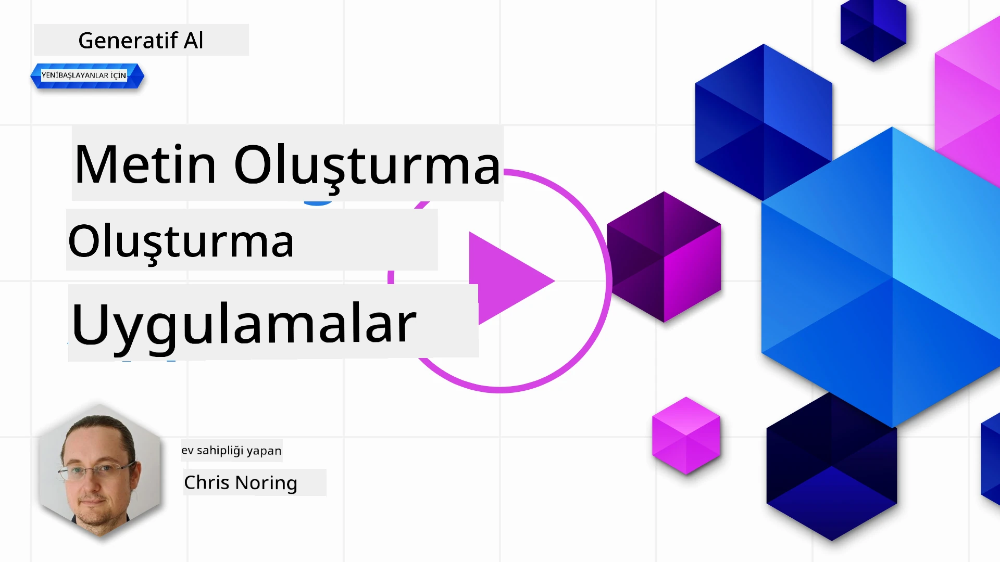

# Metin Üretme Uygulamaları Oluşturma

[](https://youtu.be/0Y5Luf5sRQA?si=t_xVg0clnAI4oUFZ)

> _(Dersi izlemek için yukarıdaki resme tıklayın)_

Bu müfredat boyunca şimdiye kadar istemler gibi temel kavramları ve hatta "istem mühendisliği" diye adlandırılan bir disiplini gördünüz. ChatGPT, Office 365, Microsoft Power Platform gibi etkileşimde bulunabileceğiniz birçok araç, bir şeyi başarmak için istemleri kullanmanızı destekler.

Böyle bir deneyimi bir uygulamaya ekleyebilmeniz için istemler, tamamlamalar gibi kavramları anlamanız ve çalışmak için bir kütüphane seçmeniz gerekir. Tam olarak bu, bu bölümde öğreneceğiniz şeydir.

## Giriş

Bu bölümde şunları yapacaksınız:

- openai kütüphanesi ve temel kavramları hakkında bilgi edinin.
- openai kullanarak bir metin oluşturma uygulaması oluşturun.
- Metin oluşturma uygulaması yapmak için istem, sıcaklık ve tokenlar gibi kavramların nasıl kullanılacağını anlayın.

## Öğrenme hedefleri

Bu dersin sonunda şunları yapabilecek duruma geleceksiniz:

- Metin oluşturma uygulamasının ne olduğunu açıklayın.
- openai kullanarak bir metin oluşturma uygulaması geliştirin.
- Uygulamanızın daha fazla veya daha az token kullanacak şekilde yapılandırılmasını sağlayın ve değişken çıktı için sıcaklığı değiştirin.

## Metin oluşturma uygulaması nedir?

Normalde bir uygulama oluşturduğunuzda şöyle bir arayüze sahiptir:

- Komut tabanlı. Konsol uygulamaları tipik olarak bir komut yazdığınız ve görevi gerçekleştirdiği uygulamalardır. Örneğin, `git` komut tabanlı bir uygulamadır.
- Kullanıcı arayüzü (UI). Bazı uygulamalarda düğmelere tıklamanız, metin girmeniz, seçenekleri seçmeniz gibi grafiksel kullanıcı arayüzleri (GUI) vardır.

### Konsol ve UI uygulamaları sınırlıdır

Bir komut tabanlı uygulama ile karşılaştırın, komut yazdığınızda:

- **Sınırlıdır**. Her komutu yazamazsınız, sadece uygulamanın desteklediği komutları kullanabilirsiniz.
- **Dil spesifik**. Bazı uygulamalar birçok dili destekler, ancak varsayılan olarak uygulama belirli bir dil için oluşturulmuştur, ek dil desteği ekleyebilirsiniz.

### Metin oluşturma uygulamalarının faydaları

Peki metin oluşturma uygulaması nasıl farklıdır?

Bir metin oluşturma uygulamasında daha fazla esnekliğiniz vardır, önceden belirlenmiş komutlarla veya belirli bir giriş diliyle sınırlı değilsiniz. Bunun yerine, doğal dili kullanarak uygulamayla etkileşime geçebilirsiniz. Bir diğer avantaj ise; zaten geniş bir bilgi dizisini öğrenmiş bir veri kaynağı ile etkileşimdesiniz, oysa geleneksel bir uygulama veri tabanındaki bilgilerle sınırlı olabilir.

### Metin oluşturma uygulaması ile ne yapabilirim?

Birçok şey yapabilirsiniz. Örneğin:

- **Bir sohbet botu**. Şirketiniz ve ürünleri hakkında soruları yanıtlayan bir sohbet botu iyi bir eşleşme olabilir.
- **Yardımcı**. LLM'ler metin özetlemek, metinden içgörü almak, özgeçmiş gibi metinler üretmek gibi konularda çok iyidir.
- **Kod asistanı**. Kullandığınız dil modeline bağlı olarak, kod yazmanıza yardımcı olan bir kod asistanı oluşturabilirsiniz. Örneğin, GitHub Copilot ve ChatGPT gibi ürünleri kullanabilirsiniz.

## Nasıl başlayabilirim?

Genellikle LLM ile entegre olmak için aşağıdaki iki yöntemden biri gerekir:

- Bir API kullanmak. Burada isteminizle web isteği oluşturur ve oluşturulan metni alırsınız.
- Bir kütüphane kullanmak. Kütüphaneler API çağrılarını kapsüller ve kullanımı kolaylaştırır.

## Kütüphaneler/SDK'lar

LLM'lerle çalışmak için bazı bilinen kütüphaneler şunlardır:

- **openai**, bu kütüphane modelinize kolayca bağlanmayı ve istem göndermeyi sağlar.

Daha üst düzeyde çalışan kütüphaneler de vardır:

- **Langchain**. Langchain iyi bilinir ve Python'u destekler.
- **Semantic Kernel**. Semantic Kernel Microsoft'un C#, Python ve Java dillerini destekleyen bir kütüphanesidir.

## openai kullanarak ilk uygulama

İlk uygulamamızı nasıl oluşturacağımızı, hangi kütüphanelere ihtiyaç duyacağımızı ve ne kadarının gerekli olduğunu görelim.

### openai yükleyin

OpenAI veya Azure OpenAI ile etkileşim için birçok kütüphane vardır. C#, Python, JavaScript, Java gibi birçok programlama dili de kullanılabilir. Biz `openai` Python kütüphanesini seçtik, bu yüzden `pip` ile yükleyeceğiz.

```bash
pip install openai
```

### Bir kaynak oluşturun

Şu adımları gerçekleştirmelisiniz:

- Azure'da bir hesap oluşturun [https://azure.microsoft.com/free/](https://azure.microsoft.com/free/?WT.mc_id=academic-105485-koreyst).
- Azure OpenAI erişimi edinin. [https://learn.microsoft.com/azure/ai-foundry/openai/overview#how-do-i-get-access-to-azure-openai](https://learn.microsoft.com/azure/ai-foundry/openai/overview#how-do-i-get-access-to-azure-openai?WT.mc_id=academic-105485-koreyst) adresine gidin ve erişim isteyin.

  > [!NOTE]
  > Yazım tarihi itibarıyla Azure OpenAI erişimi için başvurmanız gerekmektedir.

- Python yükleyin <https://www.python.org/>
- Azure OpenAI Servis kaynağı oluşturduğunuzdan emin olun. Kaynak oluşturma rehberine buradan bakabilirsiniz: [kaynak oluşturma](https://learn.microsoft.com/azure/ai-foundry/openai/how-to/create-resource?pivots=web-portal?WT.mc_id=academic-105485-koreyst).

### API anahtarı ve uç noktayı bulun

Şu anda, `openai` kütüphanenize hangi API anahtarını kullanacağını söylemeniz gerekir. API anahtarınızı bulmak için Azure OpenAI kaynağınızın "Anahtarlar ve Uç Nokta" bölümüne gidin ve "Anahtar 1" değerini kopyalayın.


Bu bilgileri kopyaladıktan sonra, kütüphanelere bunları kullanmasını söyleyelim.

> [!NOTE]
> API anahtarınızı kodunuzdan ayrı tutmak faydalıdır. Bunu ortam değişkenleri kullanarak yapabilirsiniz.
>
> - `OPENAI_API_KEY` ortam değişkenini API anahtarınız olarak ayarlayın.
>   `export OPENAI_API_KEY='sk-...'`

### Azure yapılandırmasını ayarlama

Azure OpenAI (şimdi Microsoft Foundry'nin bir parçası) kullanıyorsanız, yapılandırmayı şöyle ayarlarsınız. Standart `OpenAI` istemcisini Azure OpenAI `/openai/v1/` uç noktasına yönlendiriyoruz; bu, Responses API ile çalışır ve `api_version` gerekmez:

```python
import os
from openai import OpenAI

client = OpenAI(
    api_key=os.environ["AZURE_OPENAI_API_KEY"],
    base_url=f"{os.environ['AZURE_OPENAI_ENDPOINT'].rstrip('/')}/openai/v1/",
)
```

Yukarıda şunları ayarlıyoruz:

- `api_key`, bu Azure Portal veya Microsoft Foundry portalında bulunan API anahtarınızdır.
- `base_url`, bu Foundry kaynak uç noktasıdır ve `/openai/v1/` eklenmiştir. Kararlı v1 uç noktası OpenAI ve Azure OpenAI arasında `api_version` yönetimine gerek kalmadan çalışır.

> [!NOTE] > `os.environ` ortam değişkenlerini okur. `AZURE_OPENAI_API_KEY` ve `AZURE_OPENAI_ENDPOINT` gibi ortam değişkenlerini okumak için kullanabilirsiniz. Bu ortam değişkenlerini terminalde veya `dotenv` gibi kütüphane ile ayarlayın.

## Metin üretme

Metin üretmek için `responses.create` yöntemiyle Responses API’yi kullanırsınız. İşte bir örnek:

```python
prompt = "Complete the following: Once upon a time there was a"

response = client.responses.create(
    model="gpt-5-mini",  # bu sizin model dağıtım adınızdır
    input=prompt,
    store=False,
)
print(response.output_text)
```

Yukarıdaki kodda, bir yanıt oluşturuyoruz ve kullanmak istediğimiz modeli ve istemi geçiriyoruz. Sonra `response.output_text` üzerinden oluşturulan metni yazdırıyoruz.

### Çok turlu sohbetler

Responses API, tek tur metin oluşturma ve çok turlu sohbet botları için uygundur - `input` parametresine mesaj listesi vererek bir konuşma oluşturuyorsunuz:

```python
from openai import OpenAI

client = OpenAI(api_key="sk-...")

response = client.responses.create(model="gpt-5-mini", input="Hello world", store=False)
print(response.output_text)
```

Bu işlevselliğin detaylarını sonraki bir bölümde göreceğiz.

## Alıştırma - ilk metin oluşturma uygulamanız

Artık openai’yı nasıl kurulup yapılandıracağımızı öğrendiğimize göre, ilk metin oluşturma uygulamanızı oluşturalım. Uygulamanızı oluşturmak için şu adımları izleyin:

1. Sanal bir ortam oluşturun ve openai yükleyin:

   ```bash
   python -m venv venv
   source venv/bin/activate
   pip install openai
   ```

   > [!NOTE]
   > Windows kullanıyorsanız `source venv/bin/activate` yerine `venv\Scripts\activate` yazın.

   > [!NOTE]
   > Azure OpenAI anahtarınızı bulmak için [https://portal.azure.com/](https://portal.azure.com/?WT.mc_id=academic-105485-koreyst) adresine gidin, `Open AI` araması yapın, `Open AI kaynağı` seçin, `Anahtarlar ve Uç Nokta`ya gidin ve `Anahtar 1` değerini kopyalayın.

1. Bir _app.py_ dosyası oluşturun ve içine şu kodu yazın:

   ```python
   import os
   from openai import OpenAI

   client = OpenAI(
       api_key="<replace this value with your Azure OpenAI key>",
       base_url="<endpoint found in Azure Portal>/openai/v1/",
   )
   deployment_name = "<deployment name>"

   # tamamlayıcı kodunuzu ekleyin
   prompt = "Complete the following: Once upon a time there was a"

   # Responses API kullanarak bir istek yapın
   response = client.responses.create(model=deployment_name, input=prompt, store=False)

   # yanıtı yazdırın
   print(response.output_text)
   ```

   > [!NOTE]
   > Sadece OpenAI (Azure değil) kullanıyorsanız, `client = OpenAI(api_key="<OpenAI anahtarınız ile değiştirin>")` (base_url olmadan) kullanın ve deployment ismi yerine `gpt-5-mini` gibi model adı verin.

   Şu çıktıyı görmelisiniz:

   ```output
    very unhappy _____.

   Once upon a time there was a very unhappy mermaid.
   ```

## Farklı işler için farklı istem türleri

Artık bir istem kullanarak metin üretmeyi gördünüz. Değiştirip farklı türde metinler oluşturabileceğiniz bir programınız var.

İstemler her türlü görev için kullanılabilir. Örneğin:

- **Bir tür metin oluşturma**. Örneğin, şiir, quiz soruları oluşturabilirsiniz.
- **Bilgi arama**. Örneğin "Web geliştirmede CORS ne anlama gelir?" gibi bilgiler için istem kullanabilirsiniz.
- **Kod oluşturma**. İstemler kullanarak kod oluşturabilirsiniz, örneğin e-posta doğrulayan bir düzenli ifade geliştirme ya da bir web uygulaması gibi tüm bir program yazma.

## Daha pratik bir örnek: tarif oluşturucu

Evde malzemeleriniz var ve bir şey pişirmek istiyorsunuz. Bunun için tarif gerekir. Tarif bulmak için arama motoru kullanabilir ya da LLM kullanabilirsiniz.

Örneğin şu istemi yazabilirsiniz:

> "Aşağıdaki malzemelerle yapılacak yemek için 5 tarif göster: tavuk, patates ve havuç. Her tarif için kullanılan tüm malzemeleri listele"

Yukarıdaki istem verildiğinde şöyle bir yanıt gelebilir:

```output
1. Roasted Chicken and Vegetables:
Ingredients:
- 4 chicken thighs
- 2 potatoes, cut into cubes
- 2 carrots, cut into cubes
- 2 tablespoons olive oil
- 2 cloves garlic, minced
- 1 teaspoon dried thyme
- 1 teaspoon dried oregano
- Salt and pepper, to taste

2. Chicken and Potato Stew:
Ingredients:
- 2 tablespoons olive oil
- 1 onion, diced
- 2 cloves garlic, minced
- 2 chicken breasts, cut into cubes
- 2 potatoes, cut into cubes
- 2 carrots, cut into cubes
- 1 teaspoon dried oregano
- 1 teaspoon dried thyme
- 1 cup chicken broth
- Salt and pepper, to taste

3. Chicken and Potato Bake:
Ingredients:
- 2 tablespoons olive oil
- 2 chicken breasts, cut into cubes
- 2 potatoes, cut into cubes
- 2 carrots, cut into cubes
- 1 onion, diced
- 2 cloves garlic, minced
- 1 teaspoon dried oregano
- 1 teaspoon dried thyme
- 1 cup chicken broth
- Salt and pepper, to taste

4. Chicken and Potato Soup:
Ingredients:
- 2 tablespoons olive oil
- 1 onion, diced
- 2 cloves garlic, minced
- 2 chicken breasts, cut into cubes
- 2 potatoes, cut into cubes
- 2 carrots, cut into cubes
- 1 teaspoon dried oregano
- 1 teaspoon dried thyme
- 4 cups chicken broth
- Salt and pepper, to taste

5. Chicken and Potato Hash:
Ingredients:
- 2 tablespoons olive oil
- 2 chicken breasts, cut into cubes
- 2 potatoes, cut into cubes
- 2 carrots, cut into cubes
- 1 onion, diced
- 2 cloves garlic, minced
- 1 teaspoon dried oregano
```

Sonuç harika, ne pişireceğimi biliyorum. Bu aşamada faydalı olacak iyileştirmeler şunlar olabilir:

- Sevmediğim veya alerjim olan malzemeleri filtreleme.
- Evde olmayan malzemeler için alışveriş listesi oluşturma.

Bu durumlar için ek bir istem ekleyelim:

> "Sarımsak alerjim olduğu için tariflerden çıkar ve yerine başka bir şey koy. Ayrıca, evde zaten tavuk, patates ve havuç olduğunu göz önüne alarak tarifler için bir alışveriş listesi hazırla."

Şimdi yeni bir sonuç alırsınız, yani:

```output
1. Roasted Chicken and Vegetables:
Ingredients:
- 4 chicken thighs
- 2 potatoes, cut into cubes
- 2 carrots, cut into cubes
- 2 tablespoons olive oil
- 1 teaspoon dried thyme
- 1 teaspoon dried oregano
- Salt and pepper, to taste

2. Chicken and Potato Stew:
Ingredients:
- 2 tablespoons olive oil
- 1 onion, diced
- 2 chicken breasts, cut into cubes
- 2 potatoes, cut into cubes
- 2 carrots, cut into cubes
- 1 teaspoon dried oregano
- 1 teaspoon dried thyme
- 1 cup chicken broth
- Salt and pepper, to taste

3. Chicken and Potato Bake:
Ingredients:
- 2 tablespoons olive oil
- 2 chicken breasts, cut into cubes
- 2 potatoes, cut into cubes
- 2 carrots, cut into cubes
- 1 onion, diced
- 1 teaspoon dried oregano
- 1 teaspoon dried thyme
- 1 cup chicken broth
- Salt and pepper, to taste

4. Chicken and Potato Soup:
Ingredients:
- 2 tablespoons olive oil
- 1 onion, diced
- 2 chicken breasts, cut into cubes
- 2 potatoes, cut into cubes
- 2 carrots, cut into cubes
- 1 teaspoon dried oregano
- 1 teaspoon dried thyme
- 4 cups chicken broth
- Salt and pepper, to taste

5. Chicken and Potato Hash:
Ingredients:
- 2 tablespoons olive oil
- 2 chicken breasts, cut into cubes
- 2 potatoes, cut into cubes
- 2 carrots, cut into cubes
- 1 onion, diced
- 1 teaspoon dried oregano

Shopping List:
- Olive oil
- Onion
- Thyme
- Oregano
- Salt
- Pepper
```

Bu, sarımsak içermeyen beş tarif ve evde olanlara göre oluşturulmuş bir alışveriş listesidir.

## Alıştırma - tarif oluşturucu yapın

Senaryoyu oynadığımıza göre, bunu kodla uygulayalım. Şu adımları izleyin:

1. Var olan _app.py_ dosyasını başlangıç noktası olarak kullanın.
1. `prompt` değişkenini bulun ve kodunu şu şekilde değiştirin:

   ```python
   prompt = "Show me 5 recipes for a dish with the following ingredients: chicken, potatoes, and carrots. Per recipe, list all the ingredients used"
   ```

   Şimdi kodu çalıştırırsanız, şu çıktıyı görmelisiniz:

   ```output
   -Chicken Stew with Potatoes and Carrots: 3 tablespoons oil, 1 onion, chopped, 2 cloves garlic, minced, 1 carrot, peeled and chopped, 1 potato, peeled and chopped, 1 bay leaf, 1 thyme sprig, 1/2 teaspoon salt, 1/4 teaspoon black pepper, 1 1/2 cups chicken broth, 1/2 cup dry white wine, 2 tablespoons chopped fresh parsley, 2 tablespoons unsalted butter, 1 1/2 pounds boneless, skinless chicken thighs, cut into 1-inch pieces
   -Oven-Roasted Chicken with Potatoes and Carrots: 3 tablespoons extra-virgin olive oil, 1 tablespoon Dijon mustard, 1 tablespoon chopped fresh rosemary, 1 tablespoon chopped fresh thyme, 4 cloves garlic, minced, 1 1/2 pounds small red potatoes, quartered, 1 1/2 pounds carrots, quartered lengthwise, 1/2 teaspoon salt, 1/4 teaspoon black pepper, 1 (4-pound) whole chicken
   -Chicken, Potato, and Carrot Casserole: cooking spray, 1 large onion, chopped, 2 cloves garlic, minced, 1 carrot, peeled and shredded, 1 potato, peeled and shredded, 1/2 teaspoon dried thyme leaves, 1/4 teaspoon salt, 1/4 teaspoon black pepper, 2 cups fat-free, low-sodium chicken broth, 1 cup frozen peas, 1/4 cup all-purpose flour, 1 cup 2% reduced-fat milk, 1/4 cup grated Parmesan cheese

   -One Pot Chicken and Potato Dinner: 2 tablespoons olive oil, 1 pound boneless, skinless chicken thighs, cut into 1-inch pieces, 1 large onion, chopped, 3 cloves garlic, minced, 1 carrot, peeled and chopped, 1 potato, peeled and chopped, 1 bay leaf, 1 thyme sprig, 1/2 teaspoon salt, 1/4 teaspoon black pepper, 2 cups chicken broth, 1/2 cup dry white wine

   -Chicken, Potato, and Carrot Curry: 1 tablespoon vegetable oil, 1 large onion, chopped, 2 cloves garlic, minced, 1 carrot, peeled and chopped, 1 potato, peeled and chopped, 1 teaspoon ground coriander, 1 teaspoon ground cumin, 1/2 teaspoon ground turmeric, 1/2 teaspoon ground ginger, 1/4 teaspoon cayenne pepper, 2 cups chicken broth, 1/2 cup dry white wine, 1 (15-ounce) can chickpeas, drained and rinsed, 1/2 cup raisins, 1/2 cup chopped fresh cilantro
   ```

   > NOT: LLM'ler deterministik değildir, bu yüzden her çalıştırmada farklı sonuçlar alabilirsiniz.

   Harika, işleri nasıl geliştirebileceğimize bakalım. Daha esnek olması için malzeme ve tarif sayısının değiştirilebilmesini istiyoruz.

1. Kodu şu şekilde değiştirelim:

   ```python
   no_recipes = input("No of recipes (for example, 5): ")

   ingredients = input("List of ingredients (for example, chicken, potatoes, and carrots): ")

   # tarif sayısını, talimata ve malzemelere yerleştiriniz
   prompt = f"Show me {no_recipes} recipes for a dish with the following ingredients: {ingredients}. Per recipe, list all the ingredients used"
   ```

   Kodu test çalıştırması yapmak şöyle görünebilir:

   ```output
   No of recipes (for example, 5): 3
   List of ingredients (for example, chicken, potatoes, and carrots): milk,strawberries

   -Strawberry milk shake: milk, strawberries, sugar, vanilla extract, ice cubes
   -Strawberry shortcake: milk, flour, baking powder, sugar, salt, unsalted butter, strawberries, whipped cream
   -Strawberry milk: milk, strawberries, sugar, vanilla extract
   ```

### Filtre ve alışveriş listesi ekleyerek geliştir

Şimdi malzeme ve tarif sayısını kullanıcı girdisine bağlı olarak değiştirebilen çalışan bir uygulamamız var.

Daha da geliştirmek için şu özellikleri eklemek istiyoruz:

- **Malzemeleri filtreleme**. Sevmediğimiz veya alerjimiz olan malzemeleri filtreleyebilmek istiyoruz. Bunu yapmak için istemimizi değiştirip sonuna şu filtre koşulunu ekleyebiliriz:

  ```python
  filter = input("Filter (for example, vegetarian, vegan, or gluten-free): ")

  prompt = f"Show me {no_recipes} recipes for a dish with the following ingredients: {ingredients}. Per recipe, list all the ingredients used, no {filter}"
  ```

  Yukarıda, istemin sonuna `{filter}` ekliyoruz ve aynı zamanda kullanıcıdan filtre değerini alıyoruz.

  Programı çalıştırırken örnek giriş şöyle görünebilir:

  ```output
  No of recipes (for example, 5): 3
  List of ingredients (for example, chicken, potatoes, and carrots): onion,milk
  Filter (for example, vegetarian, vegan, or gluten-free): no milk

  1. French Onion Soup

  Ingredients:

  -1 large onion, sliced
  -3 cups beef broth
  -1 cup milk
  -6 slices french bread
  -1/4 cup shredded Parmesan cheese
  -1 tablespoon butter
  -1 teaspoon dried thyme
  -1/4 teaspoon salt
  -1/4 teaspoon black pepper

  Instructions:

  1. In a large pot, sauté onions in butter until golden brown.
  2. Add beef broth, milk, thyme, salt, and pepper. Bring to a boil.
  3. Reduce heat and simmer for 10 minutes.
  4. Place french bread slices on soup bowls.
  5. Ladle soup over bread.
  6. Sprinkle with Parmesan cheese.

  2. Onion and Potato Soup

  Ingredients:

  -1 large onion, chopped
  -2 cups potatoes, diced
  -3 cups vegetable broth
  -1 cup milk
  -1/4 teaspoon black pepper

  Instructions:

  1. In a large pot, sauté onions in butter until golden brown.
  2. Add potatoes, vegetable broth, milk, and pepper. Bring to a boil.
  3. Reduce heat and simmer for 10 minutes.
  4. Serve hot.

  3. Creamy Onion Soup

  Ingredients:

  -1 large onion, chopped
  -3 cups vegetable broth
  -1 cup milk
  -1/4 teaspoon black pepper
  -1/4 cup all-purpose flour
  -1/2 cup shredded Parmesan cheese

  Instructions:

  1. In a large pot, sauté onions in butter until golden brown.
  2. Add vegetable broth, milk, and pepper. Bring to a boil.
  3. Reduce heat and simmer for 10 minutes.
  4. In a small bowl, whisk together flour and Parmesan cheese until smooth.
  5. Add to soup and simmer for an additional 5 minutes, or until soup has thickened.
  ```

  Gördüğünüz gibi, içinde süt olan tarifler filtrelenmiş. Ancak laktoz intoleransınız varsa, peynir içeren tarifleri de filtrelemek isteyebilirsiniz, bu yüzden açık olunması gerekir.


- **Bir alışveriş listesi oluşturun**. Evde zaten nelerimiz olduğunu göz önünde bulundurarak bir alışveriş listesi oluşturmak istiyoruz.

  Bu işlevsellik için her şeyi tek bir istemde çözmeyi deneyebiliriz ya da bunu iki isteme bölebiliriz. İkinci yaklaşımı deneyelim. Burada ek bir istem eklemeyi öneriyoruz, ancak bunun işlemesi için ilk istemin sonucunu ikinci isteğe bağlamamız gerekiyor.

  İlk istemden çıkan sonucu yazdıran kod kısmını bulun ve altına aşağıdaki kodu ekleyin:

  ```python
  old_prompt_result = response.output_text
  prompt = "Produce a shopping list for the generated recipes and please don't include ingredients that I already have."

  new_prompt = f"{old_prompt_result} {prompt}"
  response = client.responses.create(model=deployment_name, input=new_prompt, max_output_tokens=1200, store=False)

  # yanıtı yazdır
  print("Shopping list:")
  print(response.output_text)
  ```

  Şunlara dikkat edin:

  1. İlk istemden gelen sonucu yeni isteme ekleyerek yeni bir istem oluşturuyoruz:

     ```python
     new_prompt = f"{old_prompt_result} {prompt}"
     ```

  1. Yeni bir istek yapıyoruz, ancak ilk istemde sorduğumuz token sayısını da göz önünde bulundurarak bu sefer `max_output_tokens` değerini 1200 olarak belirtiyoruz.

     ```python
     response = client.responses.create(model=deployment_name, input=new_prompt, max_output_tokens=1200, store=False)
     ```

     Bu kodu çalıştırdığımızda aşağıdaki çıktıya ulaşıyoruz:

     ```output
     No of recipes (for example, 5): 2
     List of ingredients (for example, chicken, potatoes, and carrots): apple,flour
     Filter (for example, vegetarian, vegan, or gluten-free): sugar


     -Apple and flour pancakes: 1 cup flour, 1/2 tsp baking powder, 1/2 tsp baking soda, 1/4 tsp salt, 1 tbsp sugar, 1 egg, 1 cup buttermilk or sour milk, 1/4 cup melted butter, 1 Granny Smith apple, peeled and grated
     -Apple fritters: 1-1/2 cups flour, 1 tsp baking powder, 1/4 tsp salt, 1/4 tsp baking soda, 1/4 tsp nutmeg, 1/4 tsp cinnamon, 1/4 tsp allspice, 1/4 cup sugar, 1/4 cup vegetable shortening, 1/4 cup milk, 1 egg, 2 cups shredded, peeled apples
     Shopping list:
     -Flour, baking powder, baking soda, salt, sugar, egg, buttermilk, butter, apple, nutmeg, cinnamon, allspice
     ```

## Kurulumunuzu geliştirin

Şimdiye kadar elimizde çalışan bir kod var, ancak işi daha da iyileştirmek için bazı düzenlemeler yapmalıyız. Yapmamız gereken bazı şeyler şunlar:

- **Koddan gizli bilgileri ayırın**, örneğin API anahtarı. Gizli bilgiler koda ait olmayıp güvenli bir yerde saklanmalıdır. Gizli bilgileri koddan ayırmak için ortam değişkenlerini ve `python-dotenv` gibi bir dosyadan yüklemeye yarayan kütüphaneleri kullanabiliriz. Bu kodda şöyle görünür:

  1. Aşağıdaki içeriğe sahip bir `.env` dosyası oluşturun:

     ```bash
     OPENAI_API_KEY=sk-...
     ```

     > Not: Microsoft Foundry'de Azure OpenAI kullanırken aşağıdaki ortam değişkenlerini ayarlamanız gerekir:

     ```bash
     AZURE_OPENAI_API_KEY=<replace>
     AZURE_OPENAI_ENDPOINT=<replace>
     AZURE_OPENAI_API_VERSION=2024-10-21
     ```

     Koddaki ortam değişkenlerini şöyle yüklersiniz:

     ```python
     import os
     from dotenv import load_dotenv
     from openai import OpenAI

     load_dotenv()

     client = OpenAI(api_key=os.environ["OPENAI_API_KEY"])
     ```

- **Token uzunluğuna dair bir not**. Üretmek istediğimiz metnin kaç token gerektirdiğini dikkate almalıyız. Tokenlar maliyetlidir, bu yüzden mümkünse token kullanımını ekonomik yapmalıyız. Örneğin, istemi daha az token kullanacak şekilde ifade edebilir miyiz?

  Kullanılan token sayısını değiştirmek için `max_output_tokens` parametresini kullanabilirsiniz. Örneğin, 100 token kullanmak isterseniz:

  ```python
  response = client.responses.create(model=deployment, input=prompt, max_output_tokens=100, store=False)
  ```

- **Temperature ile denemeler yapmak**. Temperature'dan daha önce bahsetmedik ancak program performansımız için önemli bir bağlamdır. Temperature değeri ne kadar yüksekse çıktı o kadar rastgele olur. Tam tersine low temperature değeri çıktı daha öngörülebilir yapar. Çıktınızda varyasyon isteyip istemediğinizi düşünün.

  Temperature parametresini değiştirmek için `temperature` parametresini kullanabilirsiniz. Örneğin, 0.5 temperature kullanmak isterseniz:

  ```python
  response = client.responses.create(model=deployment, input=prompt, temperature=0.5, store=False)
  ```

  > Not: 1.0'a ne kadar yakınsa çıktı o kadar çeşitli olur.

- **Akıl yürütme modelleri `temperature` kullanmaz**. Bu, 2026 için önemli bir değişikliktir. Microsoft Foundry'deki mevcut, kullanımda olan modeller **akıl yürütme modelleridir** (GPT-5 ailesi, o-serisi) - ve bu modeller **`temperature` veya `top_p` (veya `max_tokens`; bunun yerine `max_output_tokens` kullanın) desteklemez. `gpt-5-mini` modeline `temperature` gönderirseniz "parameter not supported" hatası alırsınız. Yukarıdaki temperature örneğini denemek için, hala örnekleme kontrolünü destekleyen bir modele yönelmelisiniz - örneğin Microsoft Foundry model kataloğundaki [open Llama modeli](https://ai.azure.com/catalog/models?WT.mc_id=academic-105485-koreyst) olan `Llama-3.3-70B-Instruct`, Foundry Models / Azure AI Inference endpoint üzerinden çağrılır (tıpkı `githubmodels-*` örneklerindeki gibi). GPT-5 gibi akıl yürütme modellerinde çıktı farklı şekilde yönlendirilir:
  - **İstem mühendisliği** - açık talimatlar, örnekler ve yapılandırılmış çıktı (bkz: ders [04 - İstem Mühendisliği](../04-prompt-engineering-fundamentals/README.md?WT.mc_id=academic-105485-koreyst)) örnekleme ayarlarının yaptığı işi yapar.
  - **Akıl yürütme kontrolleri** - akıl yürütme çabası/detay parametreleri derinlik ile gecikme ve maliyeti dengeler.

  Özetle: `temperature`/`top_p` birçok modelde (Llama, Mistral, Phi ve GPT-4.x ailesi - ancak GPT-4.x eskimekte) hala geçerlidir, ancak yönelim GPT-5 gibi akıl yürütme modellerinde istem mühendisliği + akıl yürütme kontrolüne doğru kaymaktadır.

## Ödev

Bu ödev için ne yapacağınızı seçebilirsiniz.

İşte bazı öneriler:

- Tarif oluşturucu uygulamasını daha da geliştirmek için oynayın. Temperature değerleri ve istemlerle ne çıkarabileceğinize bakın.
- Bir "çalışma arkadaşı" oluşturun. Bu uygulama, örneğin Python hakkında soruları yanıtlayabilmeli; "Python'da belirli bir konu nedir?" gibi istemler içerebilir veya belirli bir konu için kod gösteren bir istem olabilir.
- Tarih botu, tarihi canlandırın, bota belirli bir tarihi karakteri canlandırması talimatını verin ve hayatı ve dönemi hakkında sorular sorun.

## Çözüm

### Çalışma arkadaşı

Aşağıda başlangıç için bir istem var, nasıl kullanabileceğinizi ve isteğinizi nasıl ayarlayabileceğinizi görün.

```text
- "You're an expert on the Python language

    Suggest a beginner lesson for Python in the following format:

    Format:
    - concepts:
    - brief explanation of the lesson:
    - exercise in code with solutions"
```

### Tarih botu

Kullanabileceğiniz bazı istemler şunlar:

```text
- "You are Abe Lincoln, tell me about yourself in 3 sentences, and respond using grammar and words like Abe would have used"
- "You are Abe Lincoln, respond using grammar and words like Abe would have used:

   Tell me about your greatest accomplishments, in 300 words"
```

## Bilgi testi

Temperature kavramı ne işe yarar?

1. Çıktının ne kadar rastgele olduğunu kontrol eder.
1. Yanıtın ne kadar büyük olduğunu kontrol eder.
1. Kaç token kullanıldığını kontrol eder.

## 🚀 Meydan okuma

Ödev üzerinde çalışırken temperature değerini değiştirerek 0, 0.5 ve 1 yapmayı deneyin. Unutmayın, 0 en az varyasyonlu, 1 ise en çok varyasyonlu değerdir. Sizin uygulamanız için en iyi değer hangisidir?

## Harika İş! Öğrenmeye Devam Edin

Bu dersi tamamladıktan sonra, Generative AI bilginizi ilerletmeye devam etmek için [Generative AI Öğrenme koleksiyonumuzu](https://aka.ms/genai-collection?WT.mc_id=academic-105485-koreyst) inceleyin!

Devamında, [sohbet uygulamaları nasıl oluşturulur](../07-building-chat-applications/README.md?WT.mc_id=academic-105485-koreyst) konusuna baktığımız 7. derse geçin!

---

<!-- CO-OP TRANSLATOR DISCLAIMER START -->
**Feragatname**:
Bu belge, AI çeviri hizmeti [Co-op Translator](https://github.com/Azure/co-op-translator) kullanılarak çevrilmiştir. Doğruluk için çaba sarf etsek de, otomatik çevirilerin hata veya yanlışlık içerebileceğini lütfen unutmayınız. Orijinal belge, kendi dilinde yetkili kaynak olarak kabul edilmelidir. Kritik bilgiler için profesyonel insan çevirisi önerilir. Bu çevirinin kullanımı sonucu ortaya çıkabilecek yanlış anlamalardan veya yanlış yorumlamalardan sorumlu değiliz.
<!-- CO-OP TRANSLATOR DISCLAIMER END -->