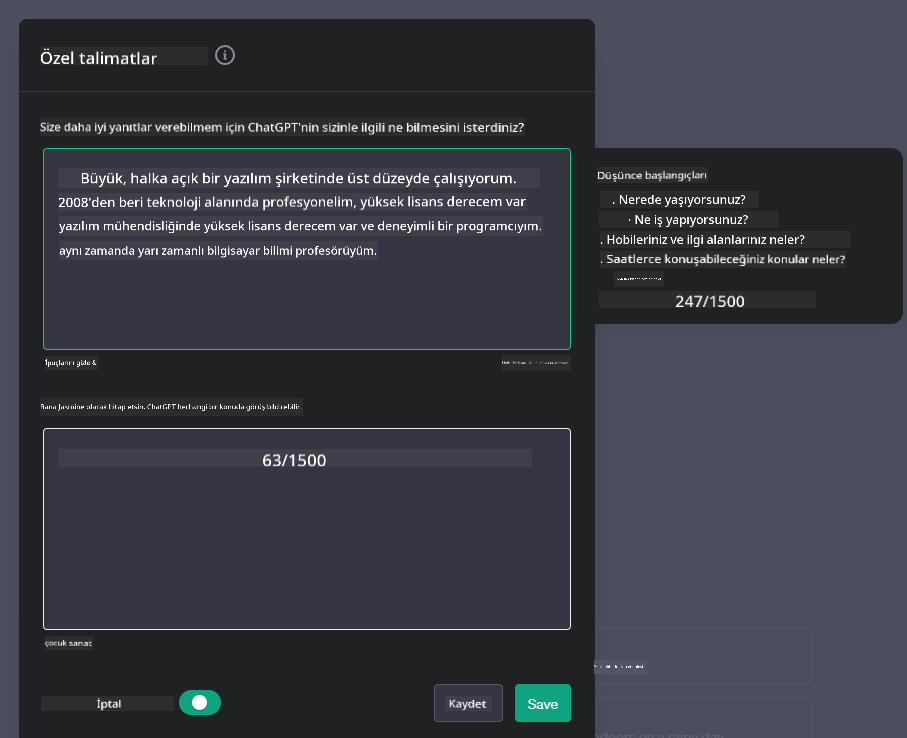
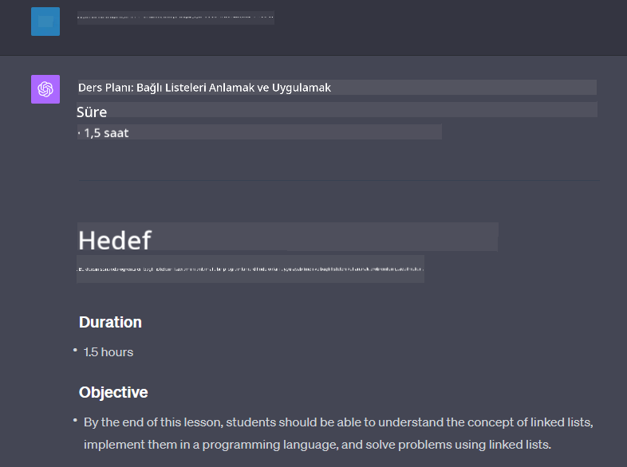

<!--
CO_OP_TRANSLATOR_METADATA:
{
  "original_hash": "ea4bbe640847aafbbba14dae4625e9af",
  "translation_date": "2025-05-19T17:48:42+00:00",
  "source_file": "07-building-chat-applications/README.md",
  "language_code": "tr"
}
-->
# Üretici Yapay Zeka Destekli Sohbet Uygulamaları Geliştirme

[](https://aka.ms/gen-ai-lessons7-gh?WT.mc_id=academic-105485-koreyst)

> _(Bu dersi izlemek için yukarıdaki resme tıklayın)_

Metin üretim uygulamalarını nasıl oluşturabileceğimizi gördüğümüze göre, şimdi sohbet uygulamalarına bakalım.

Sohbet uygulamaları günlük hayatımızın bir parçası haline geldi ve sadece gündelik konuşma aracı olmaktan fazlasını sunuyor. Müşteri hizmetleri, teknik destek ve hatta gelişmiş danışmanlık sistemlerinin ayrılmaz parçalarıdır. Muhtemelen yakın zamanda bir sohbet uygulamasından yardım almışsınızdır. Bu platformlara üretici yapay zeka gibi daha gelişmiş teknolojileri entegre ettikçe, karmaşıklık artıyor ve zorluklar da artıyor.

Cevaplanması gereken bazı sorular şunlardır:

- **Uygulamayı oluşturma**. Bu yapay zeka destekli uygulamaları belirli kullanım durumları için verimli bir şekilde nasıl oluşturur ve sorunsuz bir şekilde entegre ederiz?
- **İzleme**. Dağıtıldıktan sonra, uygulamaların hem işlevsellik açısından hem de [sorumlu yapay zeka ilkelerine](https://www.microsoft.com/ai/responsible-ai?WT.mc_id=academic-105485-koreyst) uygun olarak en yüksek kalite seviyesinde çalıştığını nasıl izleyebilir ve sağlayabiliriz?

Otomasyon ve sorunsuz insan-makine etkileşimleri ile tanımlanan bir çağa doğru ilerlerken, üretici yapay zekanın sohbet uygulamalarının kapsamını, derinliğini ve uyarlanabilirliğini nasıl dönüştürdüğünü anlamak önem kazanıyor. Bu ders, bu karmaşık sistemleri destekleyen mimari yönleri inceleyecek, alan odaklı görevler için ince ayar yapma metodolojilerini araştıracak ve sorumlu yapay zeka dağıtımını sağlamak için ilgili ölçütleri ve değerlendirmeleri değerlendirecektir.

## Giriş

Bu ders şunları kapsar:

- Sohbet uygulamalarını verimli bir şekilde oluşturma ve entegre etme teknikleri.
- Uygulamalara özelleştirme ve ince ayar uygulama yöntemleri.
- Sohbet uygulamalarını etkili bir şekilde izlemek için stratejiler ve değerlendirmeler.

## Öğrenme Hedefleri

Bu dersin sonunda:

- Mevcut sistemlere sohbet uygulamaları entegre etmek için dikkate alınması gereken hususları tanımlayabileceksiniz.
- Belirli kullanım durumları için sohbet uygulamalarını özelleştirebileceksiniz.
- Yapay zeka destekli sohbet uygulamalarının kalitesini etkili bir şekilde izlemek ve sürdürmek için önemli ölçütleri ve değerlendirmeleri tanımlayabileceksiniz.
- Sohbet uygulamalarının yapay zekayı sorumlu bir şekilde kullanmasını sağlayabileceksiniz.

## Üretici Yapay Zekayı Sohbet Uygulamalarına Entegre Etme

Üretici yapay zeka ile sohbet uygulamalarını geliştirmek sadece onları daha akıllı hale getirmekle ilgili değil; mimarilerini, performanslarını ve kullanıcı arayüzlerini optimize ederek kaliteli bir kullanıcı deneyimi sunmakla ilgilidir. Bu, mimari temelleri, API entegrasyonlarını ve kullanıcı arayüzü değerlendirmelerini incelemeyi içerir. Bu bölüm, ister mevcut sistemlere entegre ediyor olun, ister bağımsız platformlar olarak inşa ediyor olun, bu karmaşık alanlarda gezinmek için kapsamlı bir yol haritası sunmayı amaçlamaktadır.

Bu bölümün sonunda, sohbet uygulamalarını verimli bir şekilde oluşturmak ve entegre etmek için gereken uzmanlığa sahip olacaksınız.

### Sohbet Botu mu, Sohbet Uygulaması mı?

Sohbet uygulamaları oluşturmaya başlamadan önce, 'sohbet botları' ile 'yapay zeka destekli sohbet uygulamaları'nı karşılaştıralım; bunlar farklı roller ve işlevler sunar. Bir sohbet botunun ana amacı, sıkça sorulan soruları yanıtlamak veya bir paketi takip etmek gibi belirli konuşma görevlerini otomatikleştirmektir. Genellikle kural tabanlı mantık veya karmaşık yapay zeka algoritmaları tarafından yönetilir. Buna karşılık, yapay zeka destekli bir sohbet uygulaması, insan kullanıcılar arasında metin, ses ve video sohbetleri gibi çeşitli dijital iletişim biçimlerini kolaylaştırmak için tasarlanmış çok daha geniş bir ortamdır. Tanımlayıcı özelliği, geniş bir girdi ve bağlamsal ipuçları yelpazesine dayalı olarak yanıtlar üreten, insan benzeri konuşmaları simüle eden üretici bir yapay zeka modelinin entegrasyonudur. Üretici yapay zeka destekli bir sohbet uygulaması, açık alan tartışmalarına katılabilir, gelişen konuşma bağlamlarına uyum sağlayabilir ve hatta yaratıcı veya karmaşık diyaloglar üretebilir.

Aşağıdaki tablo, dijital iletişimdeki benzersiz rollerini anlamamıza yardımcı olmak için temel farkları ve benzerlikleri özetlemektedir.

| Sohbet Botu                         | Üretici Yapay Zeka Destekli Sohbet Uygulaması |
| ----------------------------------- | --------------------------------------------- |
| Görev Odaklı ve kural tabanlı       | Bağlam farkındalığı                           |
| Daha büyük sistemlere entegre edilebilir | Bir veya birden fazla sohbet botunu barındırabilir |
| Programlanmış işlevlerle sınırlı    | Üretici yapay zeka modellerini içerir         |
| Uzmanlaşmış ve yapılandırılmış etkileşimler | Açık alan tartışmalarına katılabilir          |

### SDK'lar ve API'ler ile önceden oluşturulmuş işlevleri kullanma

Bir sohbet uygulaması oluştururken, mevcut olanı değerlendirmek iyi bir ilk adımdır. Sohbet uygulamaları oluşturmak için SDK'lar ve API'ler kullanmak çeşitli nedenlerle avantajlı bir stratejidir. İyi belgelenmiş SDK'lar ve API'ler entegre ederek, uygulamanızı uzun vadeli başarı için stratejik olarak konumlandırıyorsunuz, ölçeklenebilirlik ve bakım endişelerini ele alıyorsunuz.

- **Geliştirme sürecini hızlandırır ve genel yükü azaltır**: Kendi başınıza oluşturma sürecinin pahalı olması yerine önceden oluşturulmuş işlevlere güvenmek, uygulamanızın daha önemli bulabileceğiniz diğer yönlerine odaklanmanıza olanak tanır, örneğin iş mantığı.
- **Daha iyi performans**: İşlevselliği sıfırdan oluştururken, sonunda kendinize "Nasıl ölçeklenir? Bu uygulama ani bir kullanıcı akışını karşılayabilir mi?" diye soracaksınız. İyi bakımı yapılan SDK ve API'ler genellikle bu endişeler için yerleşik çözümler sunar.
- **Daha kolay bakım**: Güncellemeler ve iyileştirmeler daha kolay yönetilir çünkü çoğu API ve SDK, yeni bir sürüm yayınlandığında kütüphanenin güncellenmesini gerektirir.
- **En son teknolojiye erişim**: Geniş veri setleri üzerinde ince ayar yapılmış ve eğitilmiş modellerden yararlanmak, uygulamanıza doğal dil yetenekleri sağlar.

Bir SDK veya API'nin işlevselliğine erişmek genellikle sağlanan hizmetleri kullanma izni almayı içerir, bu genellikle benzersiz bir anahtar veya kimlik doğrulama belirteci aracılığıyla olur. OpenAI Python Kütüphanesini kullanarak bunun nasıl göründüğünü keşfedeceğiz. Bu dersi kendiniz de [OpenAI not defterinde](../../../07-building-chat-applications/python/oai-assignment.ipynb) veya [Azure OpenAI Hizmetleri not defterinde](../../../07-building-chat-applications/python/aoai-assignment.ipynb) deneyebilirsiniz.

```python
import os
from openai import OpenAI

API_KEY = os.getenv("OPENAI_API_KEY","")

client = OpenAI(
    api_key=API_KEY
    )

chat_completion = client.chat.completions.create(model="gpt-3.5-turbo", messages=[{"role": "user", "content": "Suggest two titles for an instructional lesson on chat applications for generative AI."}])
```

Yukarıdaki örnek, istemi tamamlamak için GPT-3.5 Turbo modelini kullanır, ancak API anahtarının bunu yapmadan önce ayarlandığını fark edin. Anahtarı ayarlamazsanız bir hata alırsınız.

## Kullanıcı Deneyimi (UX)

Genel UX ilkeleri sohbet uygulamaları için geçerlidir, ancak makine öğrenimi bileşenleri nedeniyle özellikle önemli hale gelen bazı ek değerlendirmeler vardır.

- **Belirsizliği ele alma mekanizması**: Üretici yapay zeka modelleri bazen belirsiz yanıtlar üretebilir. Kullanıcıların bu sorunu yaşadıklarında açıklama istemelerine olanak tanıyan bir özellik yardımcı olabilir.
- **Bağlamın korunması**: Gelişmiş üretici yapay zeka modelleri, bir konuşma içinde bağlamı hatırlama yeteneğine sahiptir, bu da kullanıcı deneyimi için gerekli bir varlık olabilir. Kullanıcılara bağlamı kontrol etme ve yönetme yeteneği vermek, kullanıcı deneyimini geliştirir, ancak hassas kullanıcı bilgilerini saklama riskini de beraberinde getirir. Bu bilgilerin ne kadar süre saklandığına dair değerlendirmeler, örneğin bir saklama politikası tanıtmak, bağlam ihtiyacını gizlilikle dengeleyebilir.
- **Kişiselleştirme**: Öğrenme ve uyum sağlama yeteneği ile yapay zeka modelleri kullanıcı için bireyselleştirilmiş bir deneyim sunar. Kullanıcı profilleri gibi özelliklerle kullanıcı deneyimini kişiselleştirmek, kullanıcıyı anlaşıldığını hissettirmekle kalmaz, aynı zamanda belirli yanıtları bulma çabalarını da destekler, daha verimli ve tatmin edici bir etkileşim yaratır.

Kişiselleştirme örneklerinden biri, OpenAI'nin ChatGPT'sindeki "Özel talimatlar" ayarlarıdır. Bu, istemleriniz için önemli olabilecek bağlam hakkında kendinizle ilgili bilgi sağlamanıza olanak tanır. İşte özel bir talimat örneği.



Bu "profil", ChatGPT'yi bağlı listeler hakkında bir ders planı oluşturması için yönlendirir. ChatGPT'nin, kullanıcının deneyimine dayalı olarak daha derinlemesine bir ders planı isteyebileceğini dikkate aldığını fark edin.



### Microsoft'un Büyük Dil Modelleri için Sistem Mesajı Çerçevesi

[Microsoft,](https://learn.microsoft.com/azure/ai-services/openai/concepts/system-message#define-the-models-output-format?WT.mc_id=academic-105485-koreyst) LLM'lerden yanıtlar üretirken etkili sistem mesajları yazma konusunda dört alana ayrılmış rehberlik sağlamıştır:

1. Modelin kim için olduğunu, yeteneklerini ve sınırlamalarını tanımlamak.
2. Modelin çıktı formatını tanımlamak.
3. Modelin amaçlanan davranışını gösteren belirli örnekler sağlamak.
4. Ek davranışsal koruyucu önlemler sağlamak.

### Erişilebilirlik

Bir kullanıcının görsel, işitsel, motor veya bilişsel engelleri olsun, iyi tasarlanmış bir sohbet uygulaması herkes tarafından kullanılabilir olmalıdır. Aşağıdaki liste, çeşitli kullanıcı engelleri için erişilebilirliği artırmayı amaçlayan belirli özellikleri açıklar.

- **Görsel Engellilik için Özellikler**: Yüksek kontrastlı temalar ve yeniden boyutlandırılabilir metin, ekran okuyucu uyumluluğu.
- **İşitsel Engellilik için Özellikler**: Metin-okuma ve konuşma-metin işlevleri, sesli bildirimler için görsel ipuçları.
- **Motor Engellilik için Özellikler**: Klavye navigasyon desteği, sesli komutlar.
- **Bilişsel Engellilik için Özellikler**: Basitleştirilmiş dil seçenekleri.

## Alan Özel Dil Modelleri için Özelleştirme ve İnce Ayar

Şirketinizin jargonunu anlayan ve kullanıcı tabanının genellikle sahip olduğu belirli sorguları önceden tahmin eden bir sohbet uygulaması hayal edin. Bahsetmeye değer birkaç yaklaşım vardır:

- **DSL modellerinden yararlanma**. DSL, alan özel dil anlamına gelir. Belirli bir alanda eğitilmiş bir DSL modelinden yararlanarak, o alanın kavramlarını ve senaryolarını anlayabilirsiniz.
- **İnce ayar uygulama**. İnce ayar, modelinizi belirli verilerle daha fazla eğitme sürecidir.

## Özelleştirme: Bir DSL Kullanma

Alan özel dil modellerinden (DSL Modelleri) yararlanmak, kullanıcı etkileşimini artırabilir ve uzmanlaşmış, bağlamsal olarak alakalı etkileşimler sağlayabilir. Belirli bir alan, endüstri veya konu ile ilgili metinleri anlamak ve üretmek üzere eğitilmiş veya ince ayar yapılmış bir modeldir. Bir DSL modeli kullanma seçenekleri, birini sıfırdan eğitmekten, SDK'lar ve API'ler aracılığıyla önceden var olanları kullanmaya kadar değişebilir. Bir başka seçenek de ince ayar yapmaktır, bu, mevcut bir önceden eğitilmiş modeli belirli bir alan için uyarlamayı içerir.

## Özelleştirme: İnce Ayar Uygulama

Önceden eğitilmiş bir model, uzmanlaşmış bir alanda veya belirli bir görevde yetersiz kaldığında ince ayar genellikle dikkate alınır.

Örneğin, tıbbi sorgular karmaşıktır ve çok fazla bağlam gerektirir. Bir tıp uzmanı, bir hastayı teşhis ederken yaşam tarzı veya önceden var olan koşullar gibi çeşitli faktörlere dayanır ve teşhislerini doğrulamak için son tıbbi dergileri bile kullanabilir. Bu gibi karmaşık senaryolarda, genel amaçlı bir yapay zeka sohbet uygulaması güvenilir bir kaynak olamaz.

### Senaryo: Bir tıbbi uygulama

Tıp uzmanlarına tedavi kılavuzlarına, ilaç etkileşimlerine veya son araştırma bulgularına hızlı referanslar sağlayarak yardımcı olmak üzere tasarlanmış bir sohbet uygulamasını düşünün.

Genel amaçlı bir model, temel tıbbi soruları yanıtlamak veya genel tavsiyeler sağlamak için yeterli olabilir, ancak şu konularda zorlanabilir:

- **Çok özel veya karmaşık vakalar**. Örneğin, bir nörolog uygulamaya "Pediatrik hastalarda ilaca dirençli epilepsiyi yönetmek için mevcut en iyi uygulamalar nelerdir?" diye sorabilir.
- **Son gelişmelerin eksikliği**. Genel amaçlı bir model, nöroloji ve farmakolojideki en son gelişmeleri içeren güncel bir yanıt sağlamakta zorlanabilir.

Bu gibi durumlarda, modeli özel bir tıbbi veri seti ile ince ayar yapmak, bu karmaşık tıbbi sorguları daha doğru ve güvenilir bir şekilde ele alma yeteneğini önemli ölçüde artırabilir. Bu, ele alınması gereken alan özel zorlukları ve soruları temsil eden geniş ve ilgili bir veri setine erişimi gerektirir.

## Yüksek Kaliteli Yapay Zeka Destekli Sohbet Deneyimi İçin Değerlendirmeler

Bu bölüm, "yüksek kaliteli" sohbet uygulamaları için kriterleri özetler, bu kriterler arasında eyleme geçirilebilir metriklerin yakalanması ve yapay zeka teknolojisini sorumlu bir şekilde kullanmayı sağlayan bir çerçeveye uyum yer alır.

### Anahtar Metrikler

Bir uygulamanın yüksek kaliteli performansını sürdürmek için, anahtar metrikleri ve değerlendirmeleri izlemek önemlidir. Bu ölçümler, uygulamanın işlevselliğini sağlamakla kalmaz, aynı zamanda yapay zeka modelinin ve kullanıcı deneyiminin kalitesini de değerlendirir. Aşağıda, dikkate alınması gereken temel, yapay zeka ve kullanıcı deneyimi metriklerini kapsayan bir liste bulunmaktadır.

| Metrik                        | Tanım                                                                                                             | Sohbet Geliştiricisi İçin Değerlendirmeler                                         |
| ----------------------------- | ----------------------------------------------------------------------------------------------------------------- | ---------------------------------------------------------------------------------- |
| **Çalışma Süresi**            | Uygulamanın çalışır durumda olduğu ve kullanıcılar tarafından erişilebilir olduğu zamanı ölçer.                   | Kesinti süresini nasıl minimize edeceksiniz?                                       |
| **Yanıt Süresi**              | Uygulamanın bir kullanıcının sorgusuna yanıt verme süresi.                                                        | Sorgu işleme süresini optimize ederek yanıt süresini nasıl iyileştirebilirsiniz?   |
| **Doğruluk**                  | Gerçek pozitif tahminlerin toplam pozitif tahminlere oranı                                                        | Modelinizin doğruluğunu nasıl doğrulayacaksınız?                                   |
| **Hassasiyet (Recall)**       | Gerçek pozitif tahminlerin gerçek pozitif sayısına oranı                                                          | Hassasiyeti nasıl ölçer ve iyileştirirsiniz?                                       |
| **F1 Skoru**                  | Doğruluk ve hassasiyet arasındaki dengeyi sağlayan harmonik ortalama.                                             | Hedef F1 Skorunuz nedir? Doğruluk ve hassasiyeti nasıl dengeleyeceksiniz?          |
| **Karmaşıklık (Perplexity)** | Modelin tahmin ettiği olasılık dağılımının, verilerin gerçek dağılımıyla ne kadar iyi örtüştüğünü ölçer.            | Karmaşıklığı nasıl minimize edeceksiniz?                                           |
| **Kullanıcı Memnuniyeti Metrikleri** | Kullanıcının uygulama hakkındaki algısını ölçer. Genellikle anketlerle elde edilir.                               | Kullanıcı geri bildirimlerini

**Feragatname**:  
Bu belge, AI çeviri hizmeti [Co-op Translator](https://github.com/Azure/co-op-translator) kullanılarak çevrilmiştir. Doğruluk için çaba göstersek de, otomatik çevirilerin hata veya yanlışlık içerebileceğini lütfen unutmayın. Orijinal belgenin kendi dilindeki versiyonu, yetkili kaynak olarak kabul edilmelidir. Kritik bilgiler için profesyonel insan çevirisi önerilir. Bu çevirinin kullanımından kaynaklanan yanlış anlama veya yanlış yorumlamalardan sorumlu değiliz.