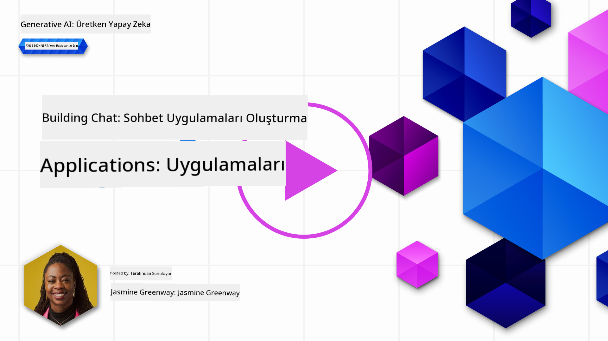
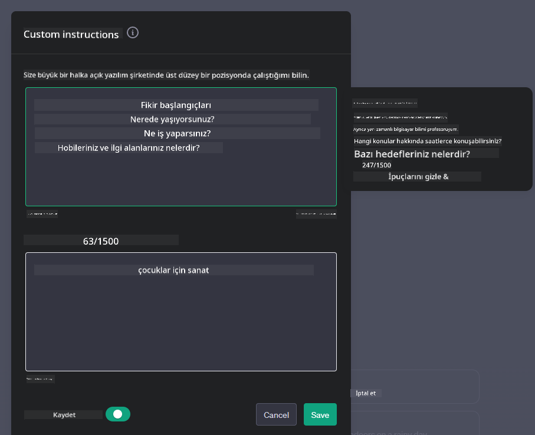
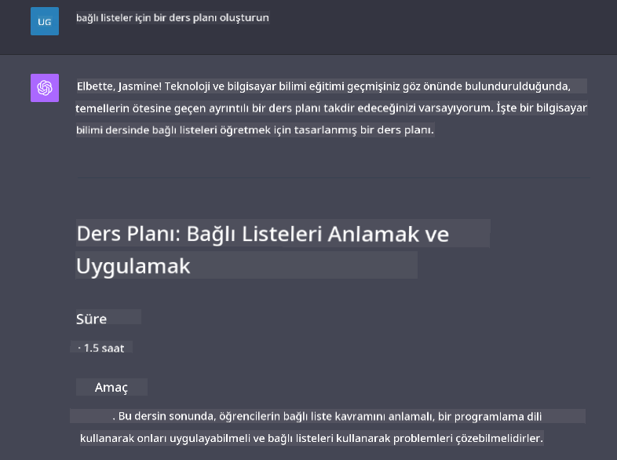

<!--
CO_OP_TRANSLATOR_METADATA:
{
  "original_hash": "ea4bbe640847aafbbba14dae4625e9af",
  "translation_date": "2025-06-25T15:31:39+00:00",
  "source_file": "07-building-chat-applications/README.md",
  "language_code": "tr"
}
-->
# Üretken AI Destekli Sohbet Uygulamaları Oluşturma

[](https://aka.ms/gen-ai-lessons7-gh?WT.mc_id=academic-105485-koreyst)

> _(Bu dersin videosunu izlemek için yukarıdaki resme tıklayın)_

Metin oluşturma uygulamalarını nasıl yapabileceğimizi gördüğümüze göre, şimdi sohbet uygulamalarına bakalım.

Sohbet uygulamaları günlük yaşamımıza entegre olmuş, sadece gündelik konuşma için bir araçtan fazlasını sunmaktadır. Müşteri hizmetleri, teknik destek ve hatta sofistike danışmanlık sistemlerinin ayrılmaz parçalarıdır. Yakın zamanda bir sohbet uygulamasından yardım almış olmanız muhtemeldir. Bu platformlara üretken AI gibi daha gelişmiş teknolojileri entegre ettikçe, karmaşıklık artar ve zorluklar da beraberinde gelir.

Cevaplanması gereken bazı sorular şunlardır:

- **Uygulamayı oluşturma**. Belirli kullanım senaryoları için bu AI destekli uygulamaları nasıl verimli bir şekilde oluşturur ve sorunsuz bir şekilde entegre ederiz?
- **İzleme**. Dağıtıldıktan sonra, uygulamaların hem işlevsellik açısından hem de [sorumlu AI'nın altı ilkesine](https://www.microsoft.com/ai/responsible-ai?WT.mc_id=academic-105485-koreyst) uygun olarak en yüksek kalite seviyesinde çalışmasını nasıl izler ve sağlarız?

Otomasyon ve sorunsuz insan-makine etkileşimleri ile tanımlanan bir çağa doğru ilerlerken, üretken AI'nın sohbet uygulamalarının kapsamını, derinliğini ve uyarlanabilirliğini nasıl dönüştürdüğünü anlamak önemlidir. Bu ders, bu karmaşık sistemleri destekleyen mimari yönleri inceleyecek, alanlara özgü görevler için ince ayar yapma yöntemlerini araştıracak ve sorumlu AI dağıtımını sağlamaya yönelik metrikleri ve dikkate alınması gereken hususları değerlendirecektir.

## Giriş

Bu ders şunları kapsar:

- Sohbet uygulamalarını verimli bir şekilde oluşturma ve entegre etme teknikleri.
- Uygulamalara özelleştirme ve ince ayar uygulama yöntemleri.
- Sohbet uygulamalarını etkili bir şekilde izleme stratejileri ve dikkate alınması gereken hususlar.

## Öğrenme Hedefleri

Bu dersin sonunda şunları yapabileceksiniz:

- Sohbet uygulamalarını mevcut sistemlere entegre etme ve oluşturma konusundaki dikkate alınması gereken hususları açıklayın.
- Belirli kullanım senaryoları için sohbet uygulamalarını özelleştirin.
- AI destekli sohbet uygulamalarının kalitesini etkili bir şekilde izlemek ve sürdürmek için önemli metrikleri ve dikkate alınması gereken hususları belirleyin.
- Sohbet uygulamalarının AI'yı sorumlu bir şekilde kullanmasını sağlayın.

## Üretken AI'yı Sohbet Uygulamalarına Entegre Etme

Üretken AI ile sohbet uygulamalarını geliştirmek, sadece onları daha akıllı hale getirmekle ilgili değil; mimari, performans ve kullanıcı arayüzünü optimize ederek kaliteli bir kullanıcı deneyimi sunmaktır. Bu, mimari temelleri, API entegrasyonlarını ve kullanıcı arayüzü dikkate alınması gereken hususları incelemeyi içerir. Bu bölüm, mevcut sistemlere entegre ederken veya bağımsız platformlar olarak oluştururken bu karmaşık manzaraları nasıl yönlendireceğinize dair kapsamlı bir yol haritası sunmayı amaçlamaktadır.

Bu bölümün sonunda, sohbet uygulamalarını verimli bir şekilde oluşturma ve entegre etme konusunda gerekli uzmanlığa sahip olacaksınız.

### Sohbet Botu mu Yoksa Sohbet Uygulaması mı?

Sohbet uygulamaları oluşturmaya başlamadan önce, 'sohbet botları' ile 'AI destekli sohbet uygulamaları' arasındaki farklı roller ve işlevleri karşılaştıralım. Bir sohbet botunun ana amacı, sıkça sorulan soruları yanıtlamak veya bir paketi takip etmek gibi belirli konuşma görevlerini otomatikleştirmektir. Genellikle kural tabanlı mantık veya karmaşık AI algoritmaları tarafından yönetilir. Buna karşılık, AI destekli bir sohbet uygulaması, insan kullanıcılar arasında metin, ses ve video sohbetleri gibi çeşitli dijital iletişim biçimlerini kolaylaştırmak için tasarlanmış çok daha geniş bir ortamdır. Tanımlayıcı özelliği, çeşitli girdi ve bağlamsal ipuçlarına dayalı olarak yanıtlar üreten, insan benzeri konuşmaları simüle eden üretken bir AI modelinin entegrasyonudur. Üretken AI destekli bir sohbet uygulaması, açık alan tartışmalarına katılabilir, gelişen konuşma bağlamlarına uyum sağlayabilir ve hatta yaratıcı veya karmaşık diyaloglar üretebilir.

Aşağıdaki tablo, dijital iletişimdeki benzersiz rollerini anlamamıza yardımcı olmak için temel farkları ve benzerlikleri ortaya koymaktadır.

| Sohbet Botu                           | Üretken AI Destekli Sohbet Uygulaması  |
| ------------------------------------- | -------------------------------------- |
| Görev Odaklı ve kural tabanlı         | Bağlam farkında                        |
| Genellikle daha büyük sistemlere entegre | Bir veya birden fazla sohbet botuna ev sahipliği yapabilir |
| Programlanmış işlevlerle sınırlı      | Üretken AI modelleri içerir            |
| Uzmanlaşmış & yapılandırılmış etkileşimler | Açık alan tartışmaları yapabilir       |

### SDK'lar ve API'lerle Önceden Oluşturulmuş İşlevleri Kullanma

Bir sohbet uygulaması oluştururken, ilk adım mevcut olanları değerlendirmek olabilir. SDK'lar ve API'ler kullanarak sohbet uygulamaları oluşturmak çeşitli nedenlerle avantajlı bir stratejidir. İyi belgelenmiş SDK'lar ve API'ler entegre ederek, uygulamanızı uzun vadeli başarı için stratejik olarak konumlandırmış olursunuz ve ölçeklenebilirlik ve bakım sorunlarını ele alırsınız.

- **Geliştirme sürecini hızlandırır ve genel masrafları azaltır**: Kendiniz oluşturmanın pahalı süreci yerine önceden oluşturulmuş işlevlere güvenmek, uygulamanızın diğer önemli yönlerine odaklanmanızı sağlar, örneğin iş mantığı.
- **Daha iyi performans**: İşlevselliği sıfırdan oluşturduğunuzda, sonunda "Nasıl ölçeklenir? Bu uygulama ani bir kullanıcı akışını kaldırabilir mi?" gibi sorular soracaksınız. İyi bakımlı SDK ve API'ler genellikle bu endişeler için yerleşik çözümler sunar.
- **Daha kolay bakım**: Güncellemeler ve iyileştirmeler, çoğu API ve SDK sadece yeni bir sürüm yayınlandığında bir kütüphanenin güncellenmesini gerektirdiği için daha kolay yönetilir.
- **Son teknolojiye erişim**: Geniş veri setleri üzerinde ince ayar yapılmış ve eğitilmiş modelleri kullanmak, uygulamanıza doğal dil yetenekleri sağlar.

Bir SDK veya API'nin işlevselliğine erişmek genellikle sağlanan hizmetleri kullanma izni almakla ilgilidir, bu genellikle benzersiz bir anahtar veya kimlik doğrulama belirteci kullanılarak yapılır. OpenAI Python Kütüphanesini kullanarak bunun nasıl göründüğünü keşfedeceğiz. Ayrıca bu dersi kendi başınıza deneyebileceğiniz [OpenAI için notebook](../../../07-building-chat-applications/python/oai-assignment.ipynb) veya [Azure OpenAI Hizmetleri için notebook](../../../07-building-chat-applications/python/aoai-assignment.ipynb) deneyebilirsiniz.

```python
import os
from openai import OpenAI

API_KEY = os.getenv("OPENAI_API_KEY","")

client = OpenAI(
    api_key=API_KEY
    )

chat_completion = client.chat.completions.create(model="gpt-3.5-turbo", messages=[{"role": "user", "content": "Suggest two titles for an instructional lesson on chat applications for generative AI."}])
```

Yukarıdaki örnek, GPT-3.5 Turbo modelini kullanarak istemi tamamlar, ancak API anahtarının bunu yapmadan önce ayarlandığını fark edin. Anahtarı ayarlamazsanız bir hata alırsınız.

## Kullanıcı Deneyimi (UX)

Genel UX prensipleri sohbet uygulamalarına uygulanır, ancak makine öğrenimi bileşenleri nedeniyle özellikle önemli hale gelen bazı ek hususlar vardır.

- **Belirsizliği ele alma mekanizması**: Üretken AI modelleri zaman zaman belirsiz yanıtlar üretebilir. Kullanıcıların bu sorunla karşılaştıklarında açıklama istemelerine olanak tanıyan bir özellik faydalı olabilir.
- **Bağlamı koruma**: Gelişmiş üretken AI modelleri, bir konuşma içinde bağlamı hatırlama yeteneğine sahiptir, bu da kullanıcı deneyimi için gerekli bir varlık olabilir. Kullanıcılara bağlamı kontrol etme ve yönetme yeteneği vermek kullanıcı deneyimini geliştirir, ancak hassas kullanıcı bilgilerini koruma riskini de beraberinde getirir. Bu bilginin ne kadar süre saklandığı gibi hususlar, bir saklama politikası tanıtmak gibi, bağlam ihtiyacını gizlilikle dengeleyebilir.
- **Kişiselleştirme**: Öğrenme ve uyum sağlama yeteneği ile AI modelleri kullanıcı için bireyselleştirilmiş bir deneyim sunar. Kullanıcı profilleri gibi özelliklerle kullanıcı deneyimini kişiselleştirmek, kullanıcıyı anlaşılmış hissettirmenin yanı sıra, belirli yanıtlar bulma arayışlarına yardımcı olur ve daha verimli ve tatmin edici bir etkileşim yaratır.

Kişiselleştirmeye bir örnek, OpenAI'nin ChatGPT'deki "Özel talimatlar" ayarlarıdır. İstemleriniz için önemli bağlam olabilecek bilgiler sağlamanıza olanak tanır. İşte özel bir talimat örneği.



Bu "profil", ChatGPT'yi bağlı listeler hakkında bir ders planı oluşturmaya yönlendirir. ChatGPT'nin kullanıcının deneyimine dayalı olarak daha derinlemesine bir ders planı isteyebileceğini dikkate aldığına dikkat edin.



### Microsoft'un Büyük Dil Modelleri için Sistem Mesajı Çerçevesi

[Microsoft, LLM'lerden yanıtlar oluştururken etkili sistem mesajları yazma konusunda](https://learn.microsoft.com/azure/ai-services/openai/concepts/system-message#define-the-models-output-format?WT.mc_id=academic-105485-koreyst) dört alana ayrılmış rehberlik sağlamıştır:

1. Modelin kimin için olduğunu ve yeteneklerini ve sınırlamalarını tanımlama.
2. Modelin çıktı formatını tanımlama.
3. Modelin amaçlanan davranışını gösteren belirli örnekler sağlama.
4. Ek davranışsal koruma önlemleri sağlama.

### Erişilebilirlik

Bir kullanıcının görsel, işitsel, motor veya bilişsel bozuklukları olsun, iyi tasarlanmış bir sohbet uygulaması herkes tarafından kullanılabilir olmalıdır. Aşağıdaki liste, çeşitli kullanıcı bozuklukları için erişilebilirliği artırmayı amaçlayan belirli özellikleri açıklamaktadır.

- **Görme Bozukluğu İçin Özellikler**: Yüksek kontrastlı temalar ve yeniden boyutlandırılabilir metin, ekran okuyucu uyumluluğu.
- **İşitme Bozukluğu İçin Özellikler**: Metinden konuşmaya ve konuşmadan metne işlevler, sesli bildirimler için görsel ipuçları.
- **Motor Bozukluğu İçin Özellikler**: Klavye navigasyon desteği, sesli komutlar.
- **Bilişsel Bozukluk İçin Özellikler**: Basitleştirilmiş dil seçenekleri.

## Alanlara Özgü Dil Modelleri için Özelleştirme ve İnce Ayar Yapma

Şirketinizin jargonunu anlayan ve kullanıcı tabanının sıkça karşılaştığı özel sorguları tahmin eden bir sohbet uygulaması hayal edin. Bahsedilmeye değer birkaç yaklaşım vardır:

- **DSL modellerinden yararlanma**. DSL, alanlara özgü dil anlamına gelir. Belirli bir alanda eğitilmiş bir DSL modelini, kavramlarını ve senaryolarını anlamak için kullanabilirsiniz.
- **İnce ayar uygulama**. İnce ayar, modelinizi belirli verilerle daha fazla eğitme sürecidir.

## Özelleştirme: Bir DSL Kullanma

Alanlara özgü dil modellerinden (DSL Modelleri) yararlanmak, kullanıcı etkileşimini artırabilir ve özel, bağlamsal olarak ilgili etkileşimler sağlayabilir. Belirli bir alan, endüstri veya konu ile ilgili metinleri anlamak ve üretmek için eğitilmiş veya ince ayar yapılmış bir modeldir. Bir DSL modelini kullanma seçenekleri, birini sıfırdan eğitmekten, SDK'lar ve API'ler aracılığıyla önceden var olanları kullanmaya kadar değişebilir. Başka bir seçenek, mevcut bir önceden eğitilmiş modeli alıp belirli bir alan için uyarlamayı içeren ince ayar yapmaktır.

## Özelleştirme: İnce Ayar Uygulama

İnce ayar, genellikle önceden eğitilmiş bir modelin özel bir alanda veya belirli bir görevde yetersiz kaldığında düşünülen bir yaklaşımdır.

Örneğin, tıbbi sorgular karmaşıktır ve çok fazla bağlam gerektirir. Bir tıp uzmanı bir hastayı teşhis ettiğinde, yaşam tarzı veya önceden var olan koşullar gibi çeşitli faktörlere dayanır ve teşhislerini doğrulamak için son tıbbi dergilere bile güvenebilir. Bu gibi karmaşık senaryolarda, genel amaçlı bir AI sohbet uygulaması güvenilir bir kaynak olamaz.

### Senaryo: bir tıbbi uygulama

Tıp pratisyenlerine tedavi yönergeleri, ilaç etkileşimleri veya son araştırma bulguları hakkında hızlı referanslar sağlayarak yardımcı olmak için tasarlanmış bir sohbet uygulamasını düşünün.

Genel amaçlı bir model, temel tıbbi soruları yanıtlamak veya genel tavsiyeler vermek için yeterli olabilir, ancak aşağıdaki konularda zorlanabilir:

- **Son derece özel veya karmaşık vakalar**. Örneğin, bir nörolog uygulamaya "Pediatrik hastalarda ilaca dirençli epilepsiyi yönetmek için en iyi uygulamalar nelerdir?" diye sorabilir.
- **Son gelişmelerin eksikliği**. Genel amaçlı bir model, nöroloji ve farmakolojideki en son gelişmeleri içeren güncel bir yanıt vermekte zorlanabilir.

Bu gibi durumlarda, modeli özel bir tıbbi veri setiyle ince ayar yapmak, bu karmaşık tıbbi sorguları daha doğru ve güvenilir bir şekilde ele alma yeteneğini önemli ölçüde artırabilir. Bu, ele alınması gereken alanlara özgü zorlukları ve soruları temsil eden büyük ve ilgili bir veri setine erişim gerektirir.

## Yüksek Kaliteli AI Destekli Sohbet Deneyimi için Dikkate Alınması Gereken Hususlar

Bu bölüm, "yüksek kaliteli" sohbet uygulamaları için ölçütleri, eyleme geçirilebilir metriklerin yakalanmasını ve AI teknolojisini sorumlu bir şekilde kullanmaya yönelik bir çerçeveye uyulmasını içerir.

### Anahtar Metrikler

Bir uygulamanın yüksek kaliteli performansını sürdürmek için, anahtar metrikleri ve dikkate alınması gereken hususları takip etmek önemlidir. Bu ölçümler, uygulamanın işlevselliğini sağlamanın yanı sıra AI modelinin ve kullanıcı deneyiminin kalitesini de değerlendirir. Aşağıda, dikkate alınması gereken temel, AI ve kullanıcı deneyimi metriklerini kapsayan bir liste bulunmaktadır.

| Metrik                        | Tanım                                                                                                                  | Sohbet Geliştirici İçin Dikkate Alınması Gereken Hususlar                  |
| ----------------------------- | ---------------------------------------------------------------------------------------------------------------------- | -------------------------------------------------------------------------- |
| **Çalışma Süresi**            | Uygulamanın çalışır durumda olduğu ve kullanıcılar tarafından erişilebilir olduğu zamanı ölçer.                        | Çalışma süresini nasıl en aza indireceksiniz?                              |
| **Yanıt Süresi**              | Uygulamanın bir kullanıcının sorgusuna yanıt vermesi için geçen süre.                                                 | Yanıt süresini iyileştirmek için sorgu işlemini nasıl optimize edebilirsiniz? |
| **Doğruluk**                  | Gerçek pozitif tahminlerin toplam pozitif tahminlere oranı.                                                            | Modelinizin doğruluğunu nasıl doğrulayacaksınız?                           |
| **Geri Çağırma (Duyarlılık)** | Gerçek pozitif tahminlerin gerçek pozitif sayısına oranı.                                                             | Geri çağırmayı nasıl ölçeceksiniz ve iyileştireceksiniz?                   |
| **F1 Skoru**                  | Doğruluk ve geri çağırmanın ticaretini dengeleyen, her ikisinin harmonik ortalaması.                                  | Hedef F1 Skorunuz nedir? Doğruluk ve geri çağırmayı nasıl dengeleyeceksiniz? |
| **Belirsizlik**               | Model tarafından tahmin edilen olasılık dağılımının, verilerin gerçek dağılımıyla ne kadar iyi hizalandığını ölçer.   | Belirsizliği nasıl en aza indireceksiniz?                                  |
| **Kullanıcı Memnuniyeti Metrikleri** | Kullanıcının uygulama algısını ölçer. Genellikle anketlerle yakalanır.                                      | Kullanıcı geri bildirimini ne sıklıkla toplayacaksınız? Buna dayanarak nasıl uyum sağlayacaksınız? |
| **Hata Oranı**                | Modelin anlamada veya çıktıda hata yapma oranı.                                                                       | Hata oranlarını azaltmak için ne tür stratejileriniz var

**Feragatname**:  
Bu belge, AI çeviri hizmeti [Co-op Translator](https://github.com/Azure/co-op-translator) kullanılarak çevrilmiştir. Doğruluk için çaba göstersek de, otomatik çevirilerin hata veya yanlışlıklar içerebileceğini lütfen unutmayın. Belgenin orijinal dili, yetkili kaynak olarak kabul edilmelidir. Kritik bilgiler için profesyonel insan çevirisi önerilir. Bu çevirinin kullanımından kaynaklanan yanlış anlamalar veya yanlış yorumlamalardan sorumlu değiliz.