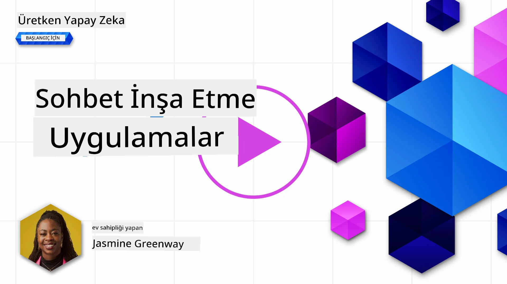
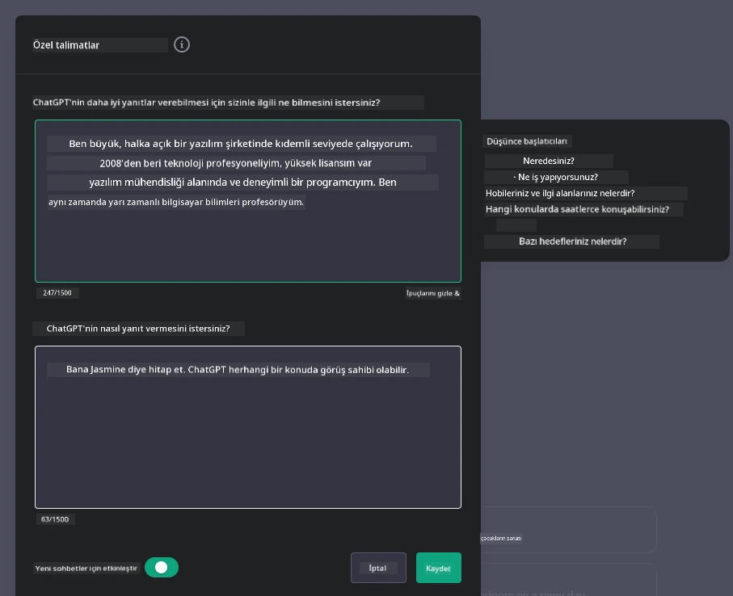

# Üretken Yapay Zeka Destekli Sohbet Uygulamaları Geliştirme

[](https://youtu.be/R9V0ZY1BEQo?si=IHuU-fS9YWT8s4sA)

> _(Dersi izlemek için yukarıdaki resme tıklayın)_

Artık metin üretme uygulamalarını nasıl yapabileceğimizi gördüğümüze göre, sohbet uygulamalarına bakalım.

Sohbet uygulamaları, günlük hayatımıza entegre oldu ve sadece sıradan sohbet aracı olmaktan çıktı. Müşteri hizmetleri, teknik destek ve hatta karmaşık danışmanlık sistemlerinin ayrılmaz parçaları haline geldiler. Muhtemelen yakın zamanda bir sohbet uygulamasından yardım aldınız. Üretken yapay zeka gibi daha gelişmiş teknolojileri bu platformlara entegre ettikçe, karmaşıklık artıyor ve zorluklar da birlikte geliyor.

Cevaplanması gereken bazı sorular şunlardır:

- **Uygulamayı inşa etmek**. Bu yapay zeka destekli uygulamaları belirli kullanım senaryoları için nasıl verimli bir şekilde inşa edip sorunsuz şekilde entegre edebiliriz?
- **İzleme**. Yayına aldıktan sonra uygulamaların hem işlevsellik hem de [sorumlu AI 6 ilkesine](https://www.microsoft.com/ai/responsible-ai?WT.mc_id=academic-105485-koreyst) uyum açısından en yüksek kalite düzeyinde çalıştığını nasıl izleyebilir ve sürdürebiliriz?

Otomasyonun ve insan-makine etkileşimlerinin sorunsuz olduğu bir çağda ilerlerken, üretken yapay zekanın sohbet uygulamalarının kapsamını, derinliğini ve uyarlanabilirliğini nasıl dönüştürdüğünü anlamak çok önemli hale geliyor. Bu ders, bu karmaşık sistemleri destekleyen mimari yönleri inceleyecek, alan-spesifik görevler için ince ayar metodolojilerini keşfedecek ve sorumlu yapay zeka dağıtımı için gerekli ölçütler ve değerlendirmeleri ele alacak.

## Giriş

Bu ders aşağıdaki konuları kapsar:

- Sohbet uygulamalarını verimli şekilde inşa etme ve entegre etme teknikleri.
- Uygulamalara özelleştirme ve ince ayar uygulama yöntemleri.
- Sohbet uygulamalarını etkin şekilde izlemek için stratejiler ve dikkate alınması gerekenler.

## Öğrenme Hedefleri

Bu dersin sonunda şunları yapabilecek duruma geleceksiniz:

- Sohbet uygulamalarını mevcut sistemlere entegre ederken dikkate alınması gereken hususları açıklamak.
- Sohbet uygulamalarını belirli kullanım durumlarına göre özelleştirmek.
- Yapay zeka destekli sohbet uygulamalarının kalitesini etkin biçimde izlemek ve sürdürmek için temel metrikleri ve dikkate alınacak noktaları belirlemek.
- Sohbet uygulamalarının yapay zekayı sorumlu şekilde kullanmasını sağlamak.

## Üretken Yapay Zekanın Sohbet Uygulamalarına Entegrasyonu

Sohbet uygulamalarını üretken yapay zeka ile geliştirmek yalnızca onları daha akıllı yapmakla ilgili değildir; mimarilerini, performanslarını ve kullanıcı ara yüzlerini optimize ederek kaliteli bir kullanıcı deneyimi sunmaktır. Bu bölüm mimari temel yapı taşlarını, API entegrasyonlarını ve kullanıcı arayüzü hususlarını inceler. Amacımız, ister mevcut sistemlere entegre edin ister bağımsız platformlar olarak inşa edin, bu karmaşık yapıları anlamanız için kapsamlı bir yol haritası sunmaktır.

Bu bölüm sonunda sohbet uygulamalarını verimli şekilde oluşturup entegre etmek için gerekli uzmanlığa sahip olacaksınız.

### Chatbot mu, Sohbet Uygulaması mı?

Sohbet uygulaması geliştirmeye başlamadan önce, 'chatbot' ile 'yapay zeka destekli sohbet uygulaması'nı karşılaştıralım; çünkü bunlar farklı roller ve işlevler taşır. Bir chatbot, sıkça sorulan soruları yanıtlamak veya bir paketin durumunu takip etmek gibi belirli konuşma görevlerini otomatikleştirmeye odaklanır. Genellikle kural tabanlı mantık veya karmaşık yapay zeka algoritmaları ile yönetilir. Buna karşın yapay zeka destekli sohbet uygulaması, insanlar arasında metin, ses ve video sohbetleri gibi çeşitli dijital iletişim biçimlerini kolaylaştıran çok daha geniş kapsamlı bir ortamdır. Onu ayıran özellik, üretken yapay zeka modelinin entegre edilmesi olup, bu model çok çeşitli girdilerden ve bağlamsal ipuçlarından yararlanarak insan benzeri ayrıntılı sohbetler oluşturur. Üretken yapay zeka destekli sohbet uygulaması açık alanlı tartışmalara girebilir, değişen konuşma durumlarına uyum sağlayabilir ve hatta yaratıcı veya karmaşık diyaloglar üretebilir.

Aşağıdaki tablo bu benzersiz dijital iletişim rollerini anlamamıza yardımcı olmak üzere temel fark ve benzerlikleri özetler.

| Chatbot                               | Üretken Yapay Zeka Destekli Sohbet Uygulaması   |
| ------------------------------------- | ---------------------------------------------- |
| Görev Odaklı ve kural tabanlı         | Bağlam farkındalıklı                           |
| Genellikle daha büyük sistemlere entegre | Bir veya daha fazla chatbot barındırabilir      |
| Programlanmış işlevlerle sınırlı       | Üretken yapay zeka modellerini içerir           |
| Uzmanlaşmış & yapılandırılmış etkileşimler | Açık alan tartışmalarına imkan tanır            |

### Önceden Oluşturulmuş Fonksiyonları SDK ve API'lerle Kullanmak

Bir sohbet uygulaması geliştirirken, mevcut olanları değerlendirmek iyi bir ilk adımdır. SDK ve API'ler kullanarak sohbet uygulamaları geliştirmek çeşitli sebeplerle avantajlıdır. İyi dokümante edilmiş SDK ve API'lerle entegrasyon yapmak, uygulamanızı uzun vadeli başarı için stratejik olarak konumlandırır, ölçeklenebilirlik ve bakım sorunlarını ele alır.

- **Geliştirme sürecini hızlandırır ve yükü azaltır**: Fonksiyonları kendi kendinize geliştirmek maliyetli olduğu için, önceden hazırlanmış fonksiyonları kullanmak, uygulamanızın diğer önemli kısımlarına, örneğin iş mantığına odaklanmanızı sağlar.
- **Daha iyi performans**: Fonksiyonları baştan yaparken, "Nasıl ölçeklenir? Ani kullanıcı artışlarını kaldırabilir mi?" gibi soruları sorarsınız. İyi bakımı yapılan SDK ve API'ler bu endişelere yönelik çözümler sunar.
- **Kolay bakım**: Güncellemeler ve iyileştirmeler, çoğu API ve SDK'nın yeni sürümleri çıktığında sadece kütüphane güncellemesi yapmayı gerektirir, bu da bakımı kolaylaştırır.
- **En son teknolojilere erişim**: İyi eğitilmiş ve ince ayar yapılmış modellerin kullanılması, uygulamanıza doğal dil yetenekleri kazandırır.

SDK veya API fonksiyonlarına erişim genellikle sağlanan servisleri kullanmak için izin almayı gerektirir; bu genellikle benzersiz bir anahtar veya kimlik doğrulama belirteciyle yapılır. Bunu görmek için OpenAI Python Kitaplığı'nı kullanacağız. Siz de aşağıdaki bu ders için hazırlanmış [OpenAI not defteri](./python/oai-assignment.ipynb?WT.mc_id=academic-105485-koreyst) veya [Azure OpenAI Hizmetleri not defteri](./python/aoai-assignment.ipynb?WT.mc_id=academic-105485-koreys) ile deneyebilirsiniz.

```python
import os
from openai import OpenAI

API_KEY = os.getenv("OPENAI_API_KEY","")

client = OpenAI(
    api_key=API_KEY
    )

response = client.responses.create(model="gpt-5-mini", input="Suggest two titles for an instructional lesson on chat applications for generative AI.", store=False)
print(response.output_text)
```

Yukarıdaki örnek, Promtu tamamlamak için Responses API ile GPT-5 mini modelini kullanıyor; ancak API anahtarının önceden ayarlandığına dikkat edin. Eğer anahtarı ayarlamazsanız hata alırsınız.

## Kullanıcı Deneyimi (UX)

Sohbet uygulamalarında genel UX prensipleri geçerli olsa da, makine öğrenmesi bileşenleri nedeniyle aşağıdaki ek hususlar özellikle önem kazanır.

- **Belirsizlikle başa çıkma mekanizması**: Üretken yapay zeka modelleri bazen belirsiz yanıtlar üretebilir. Kullanıcıların açıklama istemesine izin veren bir özellik faydalı olabilir.
- **Bağlamın korunması**: Gelişmiş üretken yapay zeka modelleri bir konuşma içindeki bağlamı hatırlayabilir; bu kullanıcı deneyimi için önemli bir özellik olabilir. Kullanıcılara bağlamı kontrol etme olanağı vermek deneyimi geliştirir ancak hassas kullanıcı bilgilerinin saklanma riski vardır. Bu bilgilerin ne kadar süre saklanacağına dair (örneğin saklama politikası uygulamak gibi) düzenlemeler gizlilikle bağlam ihtiyacını dengeler.
- **Kişiselleştirme**: Öğrenip uyum sağlama yeteneği sayesinde yapay zeka modelleri kullanıcıya bireysel deneyim sunar. Kullanıcı profilleri gibi özelliklerle deneyimin kişiselleştirilmesi, kullanıcının anlaşıldığını hissetmesini sağlar ve özel cevaplar bulmaya yardımcı olarak etkileşimi daha etkili ve tatmin edici kılar.

Kişiselleştirmeye bir örnek, OpenAI'nin ChatGPT'sindeki "Özel talimatlar" ayarlarıdır. Burada, istemleriniz için önemli olabilecek kendinizle ilgili bilgileri verebilirsiniz. İşte bir özel talimat örneği.



Bu "profil", ChatGPT'ye bağlı listeler üzerine bir ders planı oluşturması talimatını veriyor. ChatGPT'nin, kullanıcının deneyimine dayanarak daha ayrıntılı bir ders planı isteyebileceği hesap edilmiştir.


### Büyük Dil Modelleri için Microsoft’un Sistem Mesaj Çerçevesi

[Microsoft, LLM'lerden yanıt üretirken etkili sistem mesajları yazılması konusunda](https://learn.microsoft.com/azure/ai-foundry/openai/concepts/system-message#define-the-models-output-format?WT.mc_id=academic-105485-koreyst) şu dört alanda rehberlik sağlamıştır:

1. Modelin hedef kitlesi, yetenekleri ve sınırlamalarının tanımlanması.
2. Modelin çıktı formatının tanımlanması.
3. Modelin amaçlanan davranışını gösteren özel örnekler verilmesi.
4. Ek davranış koruyucularının sağlanması.

### Erişilebilirlik

Kullanıcı görsel, işitsel, motor veya bilişsel engellere sahip olsun, iyi tasarlanmış bir sohbet uygulaması herkes tarafından kullanılabilir olmalıdır. Aşağıdaki liste, farklı kullanıcı engelleri için erişilebilirliği artırmaya yönelik belirli özellikleri sıralar.

- **Görme Engelli Özellikleri**: Yüksek kontrast temalar ve metin boyutu ayarlanabilirliği, ekran okuyucu uyumluluğu.
- **İşitme Engelli Özellikleri**: Metinden sese ve sesten metne fonksiyonları, ses bildirimleri için görsel ipuçları.
- **Motor Engelli Özellikleri**: Klavye navigasyonu desteği, sesli komutlar.
- **Bilişsel Engelli Özellikleri**: Basitleştirilmiş dil seçenekleri.

## Alan-Spesifik Dil Modelleri için Özelleştirme ve İnce Ayar

Şirketinizin jargonunu anlayan ve kullanıcıların sıkça sorduğu özel soruları öngören bir sohbet uygulaması hayal edin. Bahsetmeye değer birkaç yaklaşım vardır:

- **DSL modellerinden faydalanmak**. DSL, alan-spesifik dil anlamına gelir. Belirli bir alana eğitimli bir DSL modeli kullanarak, kavramları ve senaryoları anlayabilirsiniz.
- **İnce ayar uygulamak**. İnce ayar, modelinizi belirli verilerle daha fazla eğitme sürecidir.

## Özelleştirme: DSL Kullanımı

Alan-spesifik dil modellerini (DSL Modelleri) kullanmak, uzmanlaşmış ve bağlama uygun etkileşimler sağlayarak kullanıcı katılımını artırabilir. Bu, belirli bir alan, sektör veya konu ile ilgili metni anlama ve üretmek için eğitilmiş ya da ince ayarlanmış bir modeldir. DSL modeli kullanma seçenekleri, bir modeli baştan eğitmekten SDK ve API'ler aracılığıyla önceden hazırlanmış modelleri kullanmaya kadar değişir. Diğer bir seçenek, önceden eğitilmiş mevcut bir modeli alıp belirli alana uyarlamak için ince ayar yapmaktır.

## Özelleştirme: İnce Ayar Uygulama

İnce ayar, önceden eğitilmiş bir model belirli bir alanda veya görevde yetersiz kaldığında sıklıkla düşünülür.

Örneğin, tıbbi sorular karmaşıktır ve çokçeşitli bağlam gerektirir. Bir sağlık profesyonelinin hasta teşhisi yaşam tarzı, mevcut hastalıklar gibi çeşitli faktörlere dayanır ve teşhislerini güncel tıp makaleleri ile doğrulayabilir. Böyle ince durumlarda genel amaçlı yapay zeka sohbet uygulamaları güvenilir değildir.

### Senaryo: Tıbbi bir uygulama

Tıbbi uygulayıcıların tedavi kılavuzlarına, ilaç etkileşimlerine veya güncel araştırma bulgularına hızlı erişim sağlamaya yönelik bir sohbet uygulamasını düşünün.

Genel amaçlı bir model basit tıbbi soruları cevaplamak ya da genel tavsiye vermek için yeterli olabilir, ancak şu konularda zorluk yaşayabilir:

- **Çok spesifik veya karmaşık durumlar**. Örneğin, bir nörolog uygulamaya “Pediyatrik hastalarda ilaç dirençli epilepsinin yönetiminde mevcut en iyi uygulamalar nelerdir?” sorusunu sorabilir.
- **Son gelişmelerin eksikliği**. Genel amaçlı model, nöroloji ve farmakolojideki en yeni gelişmeleri içeren güncel bir cevap vermekte zorlanabilir.

Bu gibi durumlarda, modeli uzmanlaşmış tıbbi veri setiyle ince ayar yapmak, karmaşık tıbbi soruları daha doğru ve güvenilir biçimde ele alma yeteneğini önemli ölçüde artırabilir. Bunun için alan-spesifik zorlukları ve ele alınması gereken soruları temsil eden büyük ve ilgili bir veri setine erişim gerekir.

## Yüksek Kaliteli Yapay Zeka Destekli Sohbet Deneyimi için Dikkat Edilmesi Gerekenler

Bu bölüm, "yüksek kaliteli" sohbet uygulamalarının kriterlerini özetlemektedir; bunlar arasında eyleme dönüştürülebilir metriklerin yakalanması ve yapay zeka teknolojisinin sorumlu biçimde kullanılması yer alır.

### Temel Metrikler

Uygulamanın yüksek performansını korumak için, temel metrikler ve dikkate alınması gereken noktaların takibi şarttır. Bu ölçümler sadece uygulamanın işlevselliğini değil, aynı zamanda yapay zeka modelinin kalitesini ve kullanıcı deneyimini değerlendirir. Aşağıda temel, yapay zeka ve kullanıcı deneyimi metriklerini içeren bir liste yer almaktadır.

| Metrik                       | Tanım                                                                                                                  | Sohbet Geliştiricisi için Dikkat Edilmesi Gerekenler                       |
| ---------------------------- | ----------------------------------------------------------------------------------------------------------------------- | ------------------------------------------------------------------------- |
| **Çalışma Süresi (Uptime)**  | Uygulamanın kullanıcılar tarafından erişilebilir ve çalışır halde olduğu süreyi ölçer.                                    | Kesinti süresini nasıl en aza indireceksiniz?                             |
| **Yanıt Süresi**             | Uygulamanın kullanıcı sorgusuna yanıt verme süresi.                                                                      | Yanıt süresini iyileştirmek için sorgu işleme nasıl optimize edilir?      |
| **Doğruluk (Precision)**     | Doğru pozitif tahminlerin toplam pozitif tahminlere oranı.                                                                | Modelinizin doğruluğunu nasıl doğrulayacaksınız?                          |
| **Duyarlılık (Recall)**      | Doğru pozitif tahminlerin gerçek pozitif sayısına oranı.                                                                  | Duyarlılığı nasıl ölçecek ve geliştireceksiniz?                           |
| **F1 Skoru**                | Doğruluk ve duyarlılığın harmonik ortalaması; ikisi arasındaki dengeyi sağlar.                                            | Hedef F1 skorunuz nedir? Doğruluk ve duyarlılığı nasıl dengelersiniz?     |
| **Perpleksite (Perplexity)**| Modelin tahmin ettiği olasılık dağılımının, gerçek veri dağılımı ile ne kadar uyumlu olduğunu ölçer.                      | Perpleksiteyi nasıl azaltacaksınız?                                      |
| **Kullanıcı Memnuniyeti Metrikleri** | Kullanıcının uygulamaya yönelik algısı, genellikle anketlerle ölçülür.                                              | Kullanıcı geri bildirimlerini ne sıklıkla toplayacaksınız? Buna göre nasıl uyum sağlarsınız? |
| **Hata Oranı**               | Modelin anlama veya çıktı verirken yaptığı hata oranı.                                                                    | Hata oranlarını azaltmak için hangi stratejilere sahipsiniz?              |
| **Tekrar Eğitim Döngüleri** | Modelin yeni veri ve bilgilerle güncellenme sıklığı.                                                                      | Modeli ne sıklıkla tekrar eğiteceksiniz? Tekrar eğitim döngüsünü ne tetikler? |

| **Anomali Tespiti**         | Beklenen davranışa uymayan olağandışı kalıpları tanımlamak için araçlar ve teknikler.                        | Anomalilere nasıl tepki vereceksiniz?                                        |

### Sohbet Uygulamalarında Sorumlu Yapay Zeka Uygulamalarının Yürütülmesi

Microsoft'un Sorumlu Yapay Zeka yaklaşımı, yapay zeka geliştirme ve kullanımını yönlendirmesi gereken altı ilkeyi belirlemiştir. Aşağıda ilkeler, tanımları ve bir sohbet geliştiricisinin göz önünde bulundurması gerekenler ile neden ciddiye almaları gerektiği yer almaktadır.

| İlkeler                | Microsoft'un Tanımı                                  | Sohbet Geliştiricisi İçin Dikkate Alınacaklar                           | Neden Önemlidir                                                                     |
| ---------------------- | --------------------------------------------------- | ---------------------------------------------------------------------- | ---------------------------------------------------------------------------------- |
| Adalet                 | Yapay zeka sistemleri bütün insanlara adil davranmalıdır. | Sohbet uygulamasının kullanıcı verilerine göre ayrımcılık yapmadığından emin olun. | Kullanıcılar arasında güven ve kapsayıcılık oluşturmak; yasal sonuçlardan kaçınmak. |
| Güvenilirlik ve Güvenlik | Yapay zeka sistemleri güvenilir ve güvenli şekilde çalışmalıdır. | Hataları ve riskleri en aza indirmek için testler ve emniyet önlemleri uygulayın. | Kullanıcı memnuniyetini sağlar ve potansiyel zararı önler.                         |
| Gizlilik ve Güvenlik   | Yapay zeka sistemleri güvenli olmalı ve gizliliğe saygı göstermelidir. | Güçlü şifreleme ve veri koruma önlemleri uygulayın.                     | Hassas kullanıcı verilerini korumak ve gizlilik yasalarına uymak için.             |
| Kapsayıcılık           | Yapay zeka sistemleri herkesi güçlendirmeli ve insanları dahil etmelidir. | Çeşitli kitleler için erişilebilir ve kullanımı kolay UI/UX tasarlayın. | Daha geniş bir insan kitlesinin uygulamayı etkin şekilde kullanmasını sağlar.       |
| Şeffaflık              | Yapay zeka sistemleri anlaşılır olmalıdır.          | Yapay zeka yanıtları için açık dokümantasyon ve gerekçe sunun.          | Kararların nasıl alındığını anlayan kullanıcılar sisteme daha çok güvenir.         |
| Hesap Verebilirlik     | İnsanlar yapay zeka sistemlerinden sorumlu olmalıdır. | Yapay zeka kararlarını denetleme ve iyileştirme için net bir süreç oluşturun. | Hatalar durumunda sürekli iyileştirme ve düzeltici önlemler alınmasını sağlar.       |

## Ödev

[assignment](../../../07-building-chat-applications/python) adresine bakın. Bu size ilk sohbet istemlerinizi çalıştırmaktan, metin sınıflandırmaya ve özetlemeye kadar bir dizi egzersiz yaptıracaktır. Ödevlerin farklı programlama dillerinde mevcut olduğunu fark edin!

## Harika İş! Yolculuğa Devam Et

Bu dersi tamamladıktan sonra, Bilgi Oluşturucu Yapay Zeka bilginizi artırmaya devam etmek için bizim [Generative AI Learning collection](https://aka.ms/genai-collection?WT.mc_id=academic-105485-koreyst) koleksiyonumuza göz atın!

Arama uygulamaları nasıl oluşturabileceğinizi görmek için Ders 8'e gidin: [building search applications](../08-building-search-applications/README.md?WT.mc_id=academic-105485-koreyst)!

---

<!-- CO-OP TRANSLATOR DISCLAIMER START -->
**Feragatname**:
Bu belge, AI çeviri hizmeti [Co-op Translator](https://github.com/Azure/co-op-translator) kullanılarak çevrilmiştir. Doğruluk için çaba sarf etsek de, otomatik çevirilerin hata veya yanlışlık içerebileceğini lütfen unutmayınız. Orijinal belge, kendi dilinde yetkili kaynak olarak kabul edilmelidir. Kritik bilgiler için profesyonel insan çevirisi önerilir. Bu çevirinin kullanımı sonucu ortaya çıkabilecek yanlış anlamalardan veya yanlış yorumlamalardan sorumlu değiliz.
<!-- CO-OP TRANSLATOR DISCLAIMER END -->