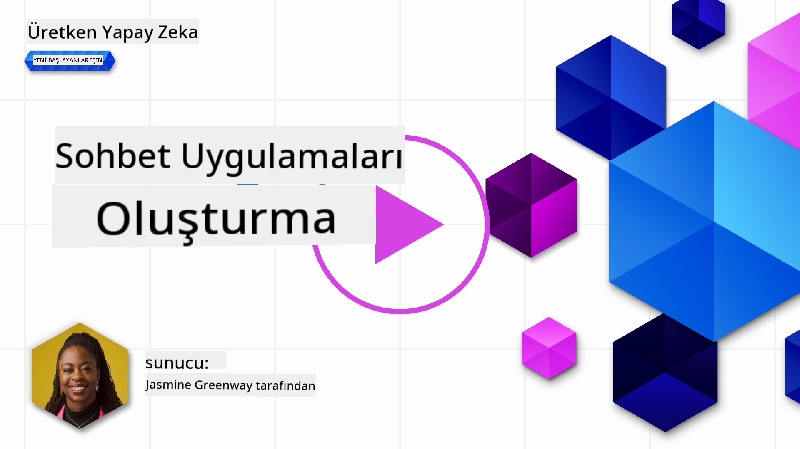
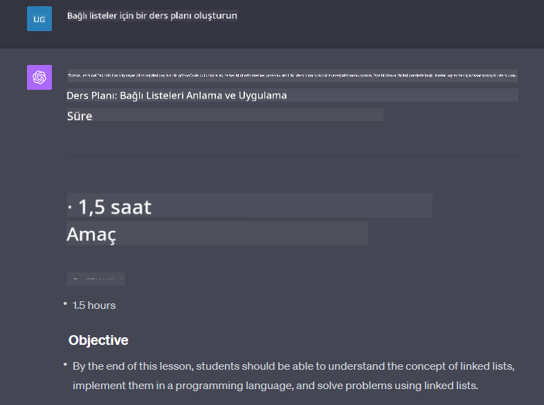

<!--
CO_OP_TRANSLATOR_METADATA:
{
  "original_hash": "a1f836db3d459bfd326b6fadca90866c",
  "translation_date": "2025-10-17T16:22:08+00:00",
  "source_file": "07-building-chat-applications/README.md",
  "language_code": "tr"
}
-->
# Üretken Yapay Zeka Destekli Sohbet Uygulamaları Oluşturma

[](https://youtu.be/R9V0ZY1BEQo?si=IHuU-fS9YWT8s4sA)

> _(Bu dersin videosunu izlemek için yukarıdaki görsele tıklayın)_

Metin üretimi uygulamalarını nasıl oluşturabileceğimizi gördükten sonra, şimdi sohbet uygulamalarına bir göz atalım.

Sohbet uygulamaları günlük hayatımızın bir parçası haline geldi ve artık sadece sıradan bir iletişim aracı olmaktan çok daha fazlasını sunuyor. Müşteri hizmetleri, teknik destek ve hatta karmaşık danışmanlık sistemlerinin ayrılmaz bir parçası haline geldiler. Muhtemelen kısa bir süre önce bir sohbet uygulamasından yardım almışsınızdır. Bu platformlara üretken yapay zeka gibi daha gelişmiş teknolojiler entegre ettikçe, karmaşıklık artıyor ve zorluklar da beraberinde geliyor.

Cevaplanması gereken bazı sorular şunlardır:

- **Uygulamayı oluşturma**. Bu yapay zeka destekli uygulamaları belirli kullanım senaryoları için nasıl verimli bir şekilde oluşturabilir ve sorunsuz bir şekilde entegre edebiliriz?
- **İzleme**. Uygulamalar devreye alındıktan sonra, işlevsellik açısından ve [sorumlu yapay zekanın altı ilkesi](https://www.microsoft.com/ai/responsible-ai?WT.mc_id=academic-105485-koreyst)'ne uygun olarak en yüksek kalite seviyesinde çalıştıklarından nasıl emin olabiliriz?

Otomasyon ve insan-makine etkileşimlerinin sorunsuz bir şekilde tanımlandığı bir çağa doğru ilerlerken, üretken yapay zekanın sohbet uygulamalarının kapsamını, derinliğini ve uyarlanabilirliğini nasıl dönüştürdüğünü anlamak hayati önem taşıyor. Bu ders, bu karmaşık sistemleri destekleyen mimari yönleri inceleyecek, alanlara özgü görevler için ince ayar yapma metodolojilerini ele alacak ve sorumlu yapay zeka dağıtımını sağlamak için ilgili metrikleri ve hususları değerlendirecek.

## Giriş

Bu ders şunları kapsar:

- Sohbet uygulamalarını verimli bir şekilde oluşturma ve entegre etme teknikleri.
- Uygulamaları özelleştirme ve ince ayar yapma yöntemleri.
- Sohbet uygulamalarını etkili bir şekilde izleme stratejileri ve hususları.

## Öğrenme Hedefleri

Bu dersin sonunda şunları yapabileceksiniz:

- Sohbet uygulamalarını mevcut sistemlere entegre etme ve oluşturma ile ilgili hususları açıklayın.
- Sohbet uygulamalarını belirli kullanım senaryoları için özelleştirin.
- Yapay zeka destekli sohbet uygulamalarının kalitesini etkili bir şekilde izlemek ve sürdürmek için temel metrikleri ve hususları belirleyin.
- Sohbet uygulamalarının yapay zekayı sorumlu bir şekilde kullandığından emin olun.

## Üretken Yapay Zekayı Sohbet Uygulamalarına Entegre Etme

Sohbet uygulamalarını üretken yapay zeka ile geliştirmek sadece onları daha akıllı hale getirmekle ilgili değil; aynı zamanda mimarilerini, performanslarını ve kullanıcı arayüzlerini optimize ederek kaliteli bir kullanıcı deneyimi sunmakla ilgilidir. Bu, mimari temelleri, API entegrasyonlarını ve kullanıcı arayüzü hususlarını araştırmayı içerir. Bu bölüm, bu karmaşık alanlarda gezinmek için kapsamlı bir yol haritası sunmayı amaçlar; ister mevcut sistemlere entegre ediyor olun, ister bağımsız platformlar olarak inşa ediyor olun.

Bu bölümün sonunda, sohbet uygulamalarını verimli bir şekilde oluşturmak ve entegre etmek için gereken uzmanlığa sahip olacaksınız.

### Sohbet Botu mu, Sohbet Uygulaması mı?

Sohbet uygulamaları oluşturmaya başlamadan önce, 'sohbet botları' ile 'yapay zeka destekli sohbet uygulamaları'nı karşılaştıralım. Bu iki kavram farklı roller ve işlevler sunar. Bir sohbet botunun ana amacı, sıkça sorulan soruları yanıtlamak veya bir paketi takip etmek gibi belirli konuşma görevlerini otomatikleştirmektir. Genellikle kural tabanlı mantık veya karmaşık yapay zeka algoritmaları tarafından yönetilir. Buna karşılık, yapay zeka destekli bir sohbet uygulaması, insan kullanıcılar arasında metin, ses ve video sohbetleri gibi çeşitli dijital iletişim biçimlerini kolaylaştırmak için tasarlanmış çok daha geniş bir ortamdır. Belirleyici özelliği, geniş bir giriş ve bağlamsal ipuçlarına dayalı olarak insan benzeri konuşmaları simüle eden üretken bir yapay zeka modelinin entegrasyonudur. Üretken yapay zeka destekli bir sohbet uygulaması, açık alanlı tartışmalara katılabilir, gelişen konuşma bağlamlarına uyum sağlayabilir ve hatta yaratıcı veya karmaşık diyaloglar üretebilir.

Aşağıdaki tablo, dijital iletişimdeki benzersiz rollerini anlamamıza yardımcı olmak için temel farkları ve benzerlikleri özetlemektedir.

| Sohbet Bot                          | Üretken Yapay Zeka Destekli Sohbet Uygulaması |
| ----------------------------------- | -------------------------------------------- |
| Görev odaklı ve kural tabanlı       | Bağlam farkındalığı                          |
| Genellikle daha büyük sistemlere entegre edilir | Bir veya birden fazla sohbet botu barındırabilir |
| Programlanmış işlevlerle sınırlıdır | Üretken yapay zeka modellerini içerir        |
| Uzmanlaşmış ve yapılandırılmış etkileşimler | Açık alanlı tartışmalara katılabilir         |

### SDK'lar ve API'lerle Hazır İşlevselliklerden Yararlanma

Bir sohbet uygulaması oluştururken, ilk adım mevcut olanları değerlendirmek olabilir. SDK'lar ve API'ler kullanarak sohbet uygulamaları oluşturmak, çeşitli nedenlerle avantajlı bir stratejidir. İyi belgelenmiş SDK'lar ve API'ler entegre ederek, uygulamanızı uzun vadeli başarı için stratejik olarak konumlandırır, ölçeklenebilirlik ve bakım endişelerini ele alırsınız.

- **Geliştirme sürecini hızlandırır ve maliyeti azaltır**: Hazır işlevselliklere güvenmek, bunları kendiniz oluşturmanın pahalı sürecinden kaçınmanızı sağlar ve uygulamanızın iş mantığı gibi daha önemli bulduğunuz diğer yönlerine odaklanmanıza olanak tanır.
- **Daha iyi performans**: İşlevselliği sıfırdan oluşturduğunuzda, sonunda kendinize "Bu nasıl ölçeklenir? Bu uygulama ani bir kullanıcı akışını kaldırabilir mi?" diye sorarsınız. İyi bakımı yapılan SDK ve API'ler genellikle bu endişeler için yerleşik çözümler sunar.
- **Daha kolay bakım**: Çoğu API ve SDK, yeni bir sürüm yayınlandığında bir kütüphaneyi güncellemek gerektirir, bu da güncellemeleri ve iyileştirmeleri yönetmeyi kolaylaştırır.
- **En son teknolojiye erişim**: Geniş veri setleri üzerinde ince ayar yapılmış ve eğitilmiş modellerden yararlanmak, uygulamanıza doğal dil yetenekleri sağlar.

Bir SDK veya API'nin işlevselliğine erişmek genellikle sağlanan hizmetleri kullanma izni almayı içerir ve bu genellikle benzersiz bir anahtar veya kimlik doğrulama belirteci kullanılarak yapılır. OpenAI Python Kütüphanesi'ni kullanarak bunun nasıl göründüğünü keşfedeceğiz. Ayrıca bu dersi kendi başınıza şu [OpenAI için notebook](./python/oai-assignment.ipynb?WT.mc_id=academic-105485-koreyst) veya [Azure OpenAI Hizmetleri için notebook](./python/aoai-assignment.ipynb?WT.mc_id=academic-105485-koreys) ile deneyebilirsiniz.

```python
import os
from openai import OpenAI

API_KEY = os.getenv("OPENAI_API_KEY","")

client = OpenAI(
    api_key=API_KEY
    )

chat_completion = client.chat.completions.create(model="gpt-3.5-turbo", messages=[{"role": "user", "content": "Suggest two titles for an instructional lesson on chat applications for generative AI."}])
```

Yukarıdaki örnek, GPT-3.5 Turbo modelini istemi tamamlamak için kullanıyor, ancak API anahtarının önceden ayarlandığına dikkat edin. Anahtarı ayarlamazsanız bir hata alırsınız.

## Kullanıcı Deneyimi (UX)

Genel UX prensipleri sohbet uygulamaları için geçerlidir, ancak makine öğrenimi bileşenleri nedeniyle özellikle önemli hale gelen bazı ek hususlar vardır.

- **Belirsizliği ele alma mekanizması**: Üretken yapay zeka modelleri bazen belirsiz cevaplar üretebilir. Kullanıcıların bu sorunu yaşadıklarında açıklama istemelerine olanak tanıyan bir özellik faydalı olabilir.
- **Bağlamın korunması**: Gelişmiş üretken yapay zeka modelleri, bir konuşma içindeki bağlamı hatırlama yeteneğine sahiptir, bu da kullanıcı deneyimi için gerekli bir varlık olabilir. Kullanıcılara bağlamı kontrol etme ve yönetme yeteneği vermek kullanıcı deneyimini geliştirir, ancak hassas kullanıcı bilgilerini saklama riskini de beraberinde getirir. Bu bilginin ne kadar süre saklandığına dair bir saklama politikası gibi hususlar, bağlam ihtiyacını gizlilikle dengeleyebilir.
- **Kişiselleştirme**: Öğrenme ve uyum sağlama yeteneği ile yapay zeka modelleri kullanıcıya bireyselleştirilmiş bir deneyim sunar. Kullanıcı profilleri gibi özellikler aracılığıyla kullanıcı deneyimini özelleştirmek, kullanıcıyı anlaşılmış hissettirmekle kalmaz, aynı zamanda belirli cevapları bulma çabalarına yardımcı olarak daha verimli ve tatmin edici bir etkileşim yaratır.

Kişiselleştirmeye bir örnek, OpenAI'nin ChatGPT'deki "Özel talimatlar" ayarlarıdır. Bu ayar, istemleriniz için önemli olabilecek kendinizle ilgili bilgileri sağlamanıza olanak tanır. İşte özel bir talimat örneği.


Bu "profil", ChatGPT'ye bağlı listeler hakkında bir ders planı oluşturmasını ister. ChatGPT'nin, kullanıcının deneyimine dayanarak daha ayrıntılı bir ders planı isteyebileceğini dikkate aldığına dikkat edin.



### Microsoft'un Büyük Dil Modelleri için Sistem Mesajı Çerçevesi

[Microsoft, LLM'lerden yanıtlar oluştururken etkili sistem mesajları yazma konusunda](https://learn.microsoft.com/azure/ai-services/openai/concepts/system-message#define-the-models-output-format?WT.mc_id=academic-105485-koreyst) 4 alana ayrılmış bir rehber sunmuştur:

1. Modelin kim için olduğunu, yeteneklerini ve sınırlamalarını tanımlama.
2. Modelin çıktı formatını tanımlama.
3. Modelin istenen davranışını gösteren belirli örnekler sağlama.
4. Ek davranışsal koruma önlemleri sağlama.

### Erişilebilirlik

Bir kullanıcının görsel, işitsel, motor veya bilişsel engelleri olsun, iyi tasarlanmış bir sohbet uygulaması herkes tarafından kullanılabilir olmalıdır. Aşağıdaki liste, çeşitli kullanıcı engelleri için erişilebilirliği artırmayı amaçlayan belirli özellikleri özetler.

- **Görme Engeli Olanlar için Özellikler**: Yüksek kontrastlı temalar ve yeniden boyutlandırılabilir metin, ekran okuyucu uyumluluğu.
- **İşitme Engeli Olanlar için Özellikler**: Metinden konuşmaya ve konuşmadan metne işlevler, sesli bildirimler için görsel ipuçları.
- **Motor Engeli Olanlar için Özellikler**: Klavye navigasyon desteği, sesli komutlar.
- **Bilişsel Engeli Olanlar için Özellikler**: Basitleştirilmiş dil seçenekleri.

## Alanlara Özgü Dil Modelleri için Özelleştirme ve İnce Ayar

Şirketinizin jargonunu anlayan ve kullanıcı kitlesinin sıkça karşılaştığı belirli soruları tahmin eden bir sohbet uygulaması hayal edin. Bahsedilmeye değer birkaç yaklaşım vardır:

- **DSL modellerinden yararlanma**. DSL, alanlara özgü dil anlamına gelir. Belirli bir alanın kavramlarını ve senaryolarını anlamak için eğitilmiş bir DSL modelinden yararlanabilirsiniz.
- **İnce ayar uygulama**. İnce ayar, modelinizi belirli verilerle daha fazla eğitme sürecidir.

## Özelleştirme: DSL Kullanımı

Alanlara özgü dil modellerinden (DSL Modelleri) yararlanmak, özel ve bağlamsal olarak alakalı etkileşimler sağlayarak kullanıcı katılımını artırabilir. Belirli bir alan, sektör veya konu ile ilgili metni anlamak ve üretmek için eğitilmiş veya ince ayar yapılmış bir modeldir. DSL modeli kullanma seçenekleri, bir modeli sıfırdan eğitmekten, SDK'lar ve API'ler aracılığıyla önceden var olan modelleri kullanmaya kadar değişebilir. Bir diğer seçenek ise, mevcut bir önceden eğitilmiş modeli belirli bir alan için uyarlamayı içeren ince ayardır.

## Özelleştirme: İnce Ayar Uygulama

Genellikle önceden eğitilmiş bir modelin özel bir alan veya belirli bir görevde yetersiz kaldığı durumlarda ince ayar yapılır.

Örneğin, tıbbi sorular karmaşıktır ve çok fazla bağlam gerektirir. Bir tıp uzmanı bir hastayı teşhis ederken yaşam tarzı veya önceden var olan koşullar gibi çeşitli faktörlere dayanır ve teşhislerini doğrulamak için son tıbbi dergilere bile güvenebilir. Bu kadar ayrıntılı senaryolarda, genel amaçlı bir yapay zeka sohbet uygulaması güvenilir bir kaynak olamaz.

### Senaryo: Tıbbi bir uygulama

Tedavi yönergelerine, ilaç etkileşimlerine veya son araştırma bulgularına hızlı referanslar sağlayarak tıp uzmanlarına yardımcı olmak için tasarlanmış bir sohbet uygulamasını düşünün.

Genel amaçlı bir model, temel tıbbi soruları yanıtlamak veya genel tavsiyeler vermek için yeterli olabilir, ancak aşağıdaki durumlarda zorlanabilir:

- **Son derece özel veya karmaşık vakalar**. Örneğin, bir nörolog uygulamaya "Pediatrik hastalarda ilaçlara dirençli epilepsiyi yönetmek için mevcut en iyi uygulamalar nelerdir?" diye sorabilir.
- **Son gelişmelerin eksikliği**. Genel amaçlı bir model, nöroloji ve farmakolojideki en son gelişmeleri içeren güncel bir yanıt vermekte zorlanabilir.

Bu gibi durumlarda, modeli özel bir tıbbi veri setiyle ince ayar yapmak, bu karmaşık tıbbi soruları daha doğru ve güvenilir bir şekilde ele alma yeteneğini önemli ölçüde artırabilir. Bu, alanla ilgili zorlukları ve ele alınması gereken soruları temsil eden büyük ve ilgili bir veri setine erişim gerektirir.

## Yapay Zeka Destekli Sohbet Deneyimi için Kalite Hususları

Bu bölüm, "yüksek kaliteli" sohbet uygulamaları için kriterleri, eyleme geçirilebilir metriklerin yakalanmasını ve yapay zeka teknolojisini sorumlu bir şekilde kullanan bir çerçeveye bağlı kalmayı içerir.

### Temel Metrikler

Bir uygulamanın yüksek kaliteli performansını sürdürmek için temel metrikleri ve hususları takip etmek önemlidir. Bu ölçümler, yalnızca uygulamanın işlevselliğini sağlamakla kalmaz, aynı zamanda yapay zeka modelinin ve kullanıcı deneyiminin kalitesini de değerlendirir. Aşağıda, dikkate alınması gereken temel, yapay zeka ve kullanıcı deneyimi metriklerini kapsayan bir liste bulunmaktadır.

| Metrik                        | Tanım                                                                                                                | Sohbet Geliştiricisi için Hususlar                                        |
| ----------------------------- | --------------------------------------------------------------------------------------------------------------------- | ------------------------------------------------------------------------- |
| **Çalışma Süresi**            | Uygulamanın kullanıcılar tarafından erişilebilir ve çalışır durumda olduğu süreyi ölçer.                              | Çalışma süresini nasıl en aza indireceksiniz?                             |
| **Yanıt Süresi**              | Uygulamanın bir kullanıcının sorgusuna yanıt verme süresi.                                                            | Sorgu işleme süresini optimize ederek yanıt süresini nasıl iyileştirebilirsiniz? |
| **Kesinlik**                  | Doğru pozitif tahminlerin toplam pozitif tahminlere oranı.                                                            | Modelinizin kesinliğini nasıl doğrulayacaksınız?                          |
| **Geri Çağırma (Duyarlılık)** | Doğru pozitif tahminlerin gerçek pozitiflerin toplamına oranı.                                                        | Geri çağırmayı nasıl ölçecek ve iyileştireceksiniz?                       |
| **F1 Skoru**                  | Kesinlik ve geri çağırmanın dengesi olan harmonik ortalama.                                                           | Hedef F1 skorunuz nedir? Kesinlik ve geri çağırmayı nasıl dengeleyeceksiniz? |
| **Belirsizlik**               | Modelin tahmin ettiği olasılık dağılımının, verilerin gerçek dağılımıyla ne kadar iyi uyum sağladığını ölçer.          | Belirsizliği nasıl en aza indireceksiniz?                                 |
| **Kullanıcı Memnuniyeti Metrikleri** | Kullanıcının uygulama hakkındaki algısını ölçer. Genellikle anketler aracılığıyla toplanır.                        | Kullanıcı geri bildirimlerini ne sıklıkla toplayacaksınız?
| **Anomali Tespiti**           | Beklenen davranışa uymayan alışılmadık kalıpları belirlemek için kullanılan araçlar ve teknikler.                      | Anomalilere nasıl yanıt vereceksiniz?                                                |

### Sohbet Uygulamalarında Sorumlu Yapay Zeka Uygulamalarını Hayata Geçirme

Microsoft'un Sorumlu Yapay Zeka yaklaşımı, yapay zeka geliştirme ve kullanımını yönlendirmesi gereken altı ilke belirlemiştir. Aşağıda bu ilkeler, tanımları ve bir sohbet uygulaması geliştiricisinin dikkate alması gereken noktalar ile neden bunları ciddiye alması gerektiği açıklanmıştır.

| İlkeler                | Microsoft'un Tanımı                                  | Sohbet Uygulaması Geliştiricisi için Dikkat Edilmesi Gerekenler         | Neden Önemli?                                                                       |
| ---------------------- | ---------------------------------------------------- | ---------------------------------------------------------------------- | ----------------------------------------------------------------------------------- |
| Adalet                 | Yapay zeka sistemleri tüm insanlara adil davranmalıdır. | Sohbet uygulamasının kullanıcı verilerine dayanarak ayrımcılık yapmamasını sağlayın. | Kullanıcılar arasında güven ve kapsayıcılık oluşturmak; yasal sorunlardan kaçınmak. |
| Güvenilirlik ve Güvenlik | Yapay zeka sistemleri güvenilir ve güvenli bir şekilde çalışmalıdır. | Hataları ve riskleri en aza indirmek için testler ve güvenlik önlemleri uygulayın. | Kullanıcı memnuniyetini sağlar ve potansiyel zararları önler.                      |
| Gizlilik ve Güvenlik   | Yapay zeka sistemleri güvenli olmalı ve gizliliğe saygı göstermelidir. | Güçlü şifreleme ve veri koruma önlemleri uygulayın.                    | Hassas kullanıcı verilerini korumak ve gizlilik yasalarına uymak için.              |
| Kapsayıcılık           | Yapay zeka sistemleri herkesi güçlendirmeli ve insanları dahil etmelidir. | Çeşitli kitleler için erişilebilir ve kullanımı kolay bir UI/UX tasarlayın. | Daha geniş bir kullanıcı kitlesinin uygulamayı etkili bir şekilde kullanmasını sağlar. |
| Şeffaflık              | Yapay zeka sistemleri anlaşılabilir olmalıdır.        | Yapay zeka yanıtları için net belgeler ve açıklamalar sağlayın.         | Kullanıcılar, kararların nasıl alındığını anlayabildiklerinde sisteme daha fazla güven duyar. |
| Hesap Verebilirlik     | Yapay zeka sistemlerinden insanlar sorumlu olmalıdır. | Yapay zeka kararlarını denetlemek ve iyileştirmek için net bir süreç oluşturun. | Hatalar durumunda sürekli iyileştirme ve düzeltici önlemler alınmasını sağlar.      |

## Ödev

[Ödeve](../../../07-building-chat-applications/python) göz atın; bu ödev sizi ilk sohbet istemlerinizi çalıştırmaktan metin sınıflandırma ve özetleme gibi bir dizi egzersizden geçirecek. Ödevlerin farklı programlama dillerinde mevcut olduğunu unutmayın!

## Harika İş! Yolculuğa Devam Edin

Bu dersi tamamladıktan sonra, [Üretken Yapay Zeka Öğrenme koleksiyonumuza](https://aka.ms/genai-collection?WT.mc_id=academic-105485-koreyst) göz atarak Üretken Yapay Zeka bilginizi geliştirmeye devam edin!

[Arama uygulamaları oluşturma](../08-building-search-applications/README.md?WT.mc_id=academic-105485-koreyst) konusuna başlamak için 8. Derse geçin!

---

**Feragatname**:  
Bu belge, AI çeviri hizmeti [Co-op Translator](https://github.com/Azure/co-op-translator) kullanılarak çevrilmiştir. Doğruluk için çaba göstersek de, otomatik çevirilerin hata veya yanlışlıklar içerebileceğini lütfen unutmayın. Belgenin orijinal dili, yetkili kaynak olarak kabul edilmelidir. Kritik bilgiler için profesyonel insan çevirisi önerilir. Bu çevirinin kullanımından kaynaklanan yanlış anlamalar veya yanlış yorumlamalar için sorumluluk kabul etmiyoruz.