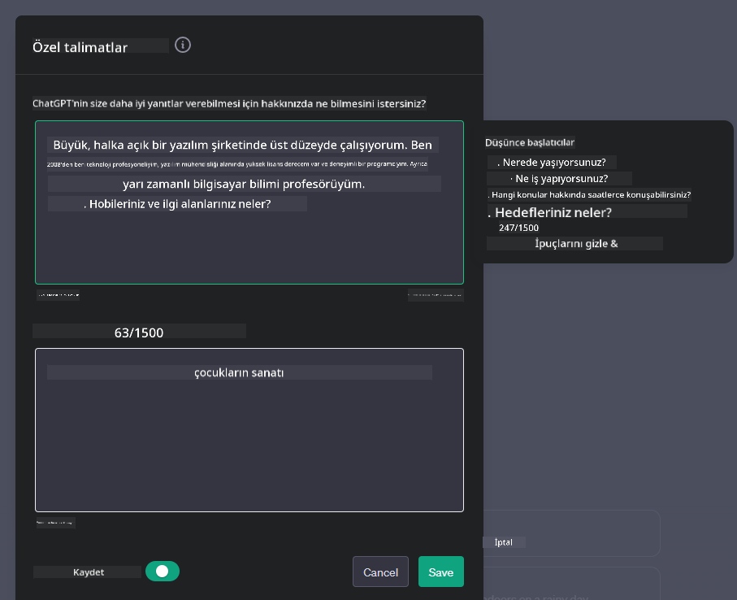

<!--
CO_OP_TRANSLATOR_METADATA:
{
  "original_hash": "ea4bbe640847aafbbba14dae4625e9af",
  "translation_date": "2025-07-09T12:27:41+00:00",
  "source_file": "07-building-chat-applications/README.md",
  "language_code": "tr"
}
-->
# Üretken Yapay Zeka Destekli Sohbet Uygulamaları Geliştirme

[](https://aka.ms/gen-ai-lessons7-gh?WT.mc_id=academic-105485-koreyst)

> _(Bu dersin videosunu izlemek için yukarıdaki görsele tıklayın)_

Metin üretimi uygulamalarını nasıl geliştirebileceğimizi gördüğümüze göre, şimdi sohbet uygulamalarına bakalım.

Sohbet uygulamaları günlük hayatımızın ayrılmaz bir parçası haline geldi ve sadece gündelik sohbet için bir araç olmanın ötesinde işlevler sunuyor. Müşteri hizmetleri, teknik destek ve hatta gelişmiş danışmanlık sistemlerinin temel bileşenleri haline geldiler. Muhtemelen yakın zamanda bir sohbet uygulamasından yardım aldınız. Üretken yapay zeka gibi daha gelişmiş teknolojileri bu platformlara entegre ettikçe, karmaşıklık ve zorluklar da artıyor.

Cevaplanması gereken bazı sorular şunlar:

- **Uygulamayı geliştirmek**. Bu yapay zeka destekli uygulamaları belirli kullanım senaryoları için nasıl verimli bir şekilde geliştirip sorunsuz entegre edebiliriz?
- **İzleme**. Yayına alındıktan sonra, uygulamaların işlevsellik ve [sorumlu yapay zekanın altı ilkesi](https://www.microsoft.com/ai/responsible-ai?WT.mc_id=academic-105485-koreyst) açısından en yüksek kalite seviyesinde çalıştığını nasıl izleyebilir ve garanti edebiliriz?

Otomasyonun ve insan-makine etkileşimlerinin sorunsuz hale geldiği bir çağda, üretken yapay zekanın sohbet uygulamalarının kapsamını, derinliğini ve uyarlanabilirliğini nasıl dönüştürdüğünü anlamak kritik hale geliyor. Bu ders, bu karmaşık sistemleri destekleyen mimari unsurları inceleyecek, alan spesifik görevler için ince ayar yöntemlerine değinecek ve sorumlu yapay zeka dağıtımını sağlamak için önemli metrikler ve değerlendirmeleri ele alacak.

## Giriş

Bu ders şunları kapsar:

- Sohbet uygulamalarını verimli bir şekilde geliştirme ve entegre etme teknikleri.
- Uygulamalara özelleştirme ve ince ayar uygulama yöntemleri.
- Sohbet uygulamalarını etkili bir şekilde izlemek için stratejiler ve dikkate alınması gerekenler.

## Öğrenme Hedefleri

Bu dersin sonunda şunları yapabileceksiniz:

- Sohbet uygulamalarını mevcut sistemlere entegre ederken göz önünde bulundurulması gerekenleri açıklamak.
- Sohbet uygulamalarını belirli kullanım senaryolarına göre özelleştirmek.
- Yapay zeka destekli sohbet uygulamalarının kalitesini etkili bir şekilde izlemek ve sürdürmek için önemli metrikleri ve dikkate alınması gerekenleri belirlemek.
- Sohbet uygulamalarının yapay zekayı sorumlu bir şekilde kullanmasını sağlamak.

## Üretken Yapay Zekayı Sohbet Uygulamalarına Entegre Etmek

Sohbet uygulamalarını üretken yapay zeka ile geliştirmek sadece onları daha akıllı yapmakla ilgili değil; aynı zamanda mimarilerini, performanslarını ve kullanıcı arayüzlerini optimize ederek kaliteli bir kullanıcı deneyimi sunmakla ilgilidir. Bu, mimari temelleri, API entegrasyonlarını ve kullanıcı arayüzü hususlarını araştırmayı içerir. Bu bölüm, ister mevcut sistemlere entegre ediyor olun ister bağımsız platformlar olarak geliştiriyor olun, bu karmaşık alanlarda size kapsamlı bir yol haritası sunmayı amaçlamaktadır.

Bu bölümün sonunda, sohbet uygulamalarını verimli bir şekilde oluşturmak ve entegre etmek için gereken uzmanlığa sahip olacaksınız.

### Chatbot mu, Sohbet Uygulaması mı?

Sohbet uygulamalarını geliştirmeye başlamadan önce, farklı roller ve işlevlere sahip olan 'chatbot'lar ile 'yapay zeka destekli sohbet uygulamaları'nı karşılaştıralım. Bir chatbot’un temel amacı, sıkça sorulan soruları yanıtlamak veya bir paketin takibini yapmak gibi belirli sohbet görevlerini otomatikleştirmektir. Genellikle kural tabanlı mantık veya karmaşık yapay zeka algoritmaları ile yönetilir. Buna karşılık, yapay zeka destekli sohbet uygulaması, insan kullanıcılar arasında metin, ses ve video sohbetleri gibi çeşitli dijital iletişim biçimlerini kolaylaştırmak için tasarlanmış çok daha geniş bir ortamdır. Onu tanımlayan özellik, çok çeşitli giriş ve bağlamsal ipuçlarına dayanarak yanıtlar üreten, insan benzeri, nüanslı sohbetleri simüle eden üretken yapay zeka modelinin entegrasyonudur. Üretken yapay zeka destekli sohbet uygulaması, açık alan tartışmalarına katılabilir, gelişen sohbet bağlamlarına uyum sağlayabilir ve hatta yaratıcı veya karmaşık diyaloglar oluşturabilir.

Aşağıdaki tablo, dijital iletişimdeki benzersiz rollerini anlamamıza yardımcı olmak için temel farkları ve benzerlikleri özetlemektedir.

| Chatbot                               | Üretken Yapay Zeka Destekli Sohbet Uygulaması |
| ------------------------------------- | ---------------------------------------------- |
| Görev odaklı ve kural tabanlı         | Bağlam farkındalığına sahip                    |
| Genellikle daha büyük sistemlere entegre | Bir veya birden fazla chatbot barındırabilir   |
| Programlanmış işlevlerle sınırlı       | Üretken yapay zeka modellerini içerir          |
| Uzmanlaşmış ve yapılandırılmış etkileşimler | Açık alan tartışmalarına olanak tanır           |

### SDK ve API’lerle Önceden Hazır İşlevselliklerden Yararlanma

Bir sohbet uygulaması geliştirirken, mevcut olanları değerlendirmek iyi bir ilk adımdır. SDK ve API kullanarak sohbet uygulamaları geliştirmek, çeşitli nedenlerle avantajlı bir stratejidir. İyi belgelenmiş SDK ve API’leri entegre ederek, uygulamanızı uzun vadeli başarı için stratejik olarak konumlandırmış olursunuz; ölçeklenebilirlik ve bakım konularını ele alırsınız.

- **Geliştirme sürecini hızlandırır ve yükü azaltır**: Kendi işlevselliğinizi sıfırdan oluşturmak yerine önceden hazırlanmış işlevleri kullanmak, uygulamanızın diğer önemli yönlerine, örneğin iş mantığına odaklanmanızı sağlar.
- **Daha iyi performans**: İşlevselliği sıfırdan geliştirirken, "Nasıl ölçeklenir? Bu uygulama ani kullanıcı artışlarını kaldırabilir mi?" gibi sorularla karşılaşırsınız. İyi bakımı yapılan SDK ve API’ler genellikle bu tür sorunlara yerleşik çözümler sunar.
- **Daha kolay bakım**: Güncellemeler ve iyileştirmeler, çoğu API ve SDK’nın yeni sürüm yayınlandığında sadece kütüphane güncellemesi gerektirmesi sayesinde daha kolay yönetilir.
- **En son teknolojilere erişim**: Geniş veri setleri üzerinde ince ayar yapılmış ve eğitilmiş modelleri kullanmak, uygulamanıza doğal dil yetenekleri kazandırır.

Bir SDK veya API işlevselliğine erişim genellikle sağlanan hizmetleri kullanmak için izin almak anlamına gelir; bu da genellikle benzersiz bir anahtar veya kimlik doğrulama belirteci ile yapılır. Bunu nasıl yapacağımızı görmek için OpenAI Python Kütüphanesi’ni kullanacağız. Ayrıca bu dersi destekleyen [OpenAI için not defterinde](python/oai-assignment.ipynb) veya [Azure OpenAI Hizmetleri için not defterinde](python/aoai-assignment.ipynb) kendiniz deneyebilirsiniz.

```python
import os
from openai import OpenAI

API_KEY = os.getenv("OPENAI_API_KEY","")

client = OpenAI(
    api_key=API_KEY
    )

chat_completion = client.chat.completions.create(model="gpt-3.5-turbo", messages=[{"role": "user", "content": "Suggest two titles for an instructional lesson on chat applications for generative AI."}])
```

Yukarıdaki örnek, GPT-3.5 Turbo modelini kullanarak istemi tamamlıyor, ancak API anahtarının önceden ayarlandığına dikkat edin. Anahtarı ayarlamazsanız hata alırsınız.

## Kullanıcı Deneyimi (UX)

Genel UX prensipleri sohbet uygulamalarına da uygulanır, ancak makine öğrenimi bileşenleri nedeniyle özellikle önemli hale gelen bazı ek hususlar vardır.

- **Belirsizliği giderme mekanizması**: Üretken yapay zeka modelleri bazen belirsiz yanıtlar üretebilir. Kullanıcıların açıklama istemesine olanak tanıyan bir özellik, bu tür durumlarda faydalı olabilir.
- **Bağlamın korunması**: Gelişmiş üretken yapay zeka modelleri, bir sohbet içindeki bağlamı hatırlama yeteneğine sahiptir; bu, kullanıcı deneyimi için önemli bir avantajdır. Kullanıcılara bağlamı kontrol etme ve yönetme imkanı vermek deneyimi iyileştirir, ancak hassas kullanıcı bilgilerinin saklanması riskini de beraberinde getirir. Bu bilgilerin ne kadar süre saklanacağına dair bir saklama politikası gibi düzenlemeler, bağlam ihtiyacı ile gizlilik arasında denge kurabilir.
- **Kişiselleştirme**: Öğrenme ve uyum sağlama yeteneği sayesinde, yapay zeka modelleri kullanıcılara bireyselleştirilmiş deneyimler sunar. Kullanıcı profilleri gibi özelliklerle deneyimi kişiselleştirmek, kullanıcının anlaşıldığını hissetmesini sağlar ve belirli cevapları bulma sürecini kolaylaştırarak daha verimli ve tatmin edici bir etkileşim yaratır.

Böyle bir kişiselleştirme örneği, OpenAI’nin ChatGPT’sindeki "Özel talimatlar" ayarlarıdır. Bu ayar, istemleriniz için önemli olabilecek kendinizle ilgili bilgileri sağlamanıza olanak tanır. İşte bir özel talimat örneği.



Bu "profil", ChatGPT’nin bağlı listeler hakkında bir ders planı oluşturmasını sağlar. ChatGPT, kullanıcının deneyimine dayanarak daha derinlemesine bir ders planı isteyebileceğini dikkate alır.


### Microsoft’un Büyük Dil Modelleri İçin Sistem Mesajı Çerçevesi

[Microsoft, LLM’lerden yanıt üretirken etkili sistem mesajları yazmak için](https://learn.microsoft.com/azure/ai-services/openai/concepts/system-message#define-the-models-output-format?WT.mc_id=academic-105485-koreyst) 4 alanda rehberlik sağlamıştır:

1. Modelin kim için olduğu, yetenekleri ve sınırlamalarının tanımlanması.
2. Modelin çıktı formatının belirlenmesi.
3. Modelin amaçlanan davranışını gösteren spesifik örneklerin verilmesi.
4. Ek davranışsal koruyucuların sağlanması.

### Erişilebilirlik

Kullanıcının görme, işitme, motor veya bilişsel engelleri olsun, iyi tasarlanmış bir sohbet uygulaması herkes tarafından kullanılabilir olmalıdır. Aşağıdaki liste, çeşitli kullanıcı engellerini desteklemek için tasarlanmış özellikleri özetlemektedir.

- **Görme Engelliler İçin Özellikler**: Yüksek kontrast temalar ve yeniden boyutlandırılabilir metin, ekran okuyucu uyumluluğu.
- **İşitme Engelliler İçin Özellikler**: Metinden sese ve sesten metne işlevleri, ses bildirimleri için görsel uyarılar.
- **Motor Engelliler İçin Özellikler**: Klavye navigasyon desteği, sesli komutlar.
- **Bilişsel Engelliler İçin Özellikler**: Basitleştirilmiş dil seçenekleri.

## Alan Spesifik Dil Modelleri İçin Özelleştirme ve İnce Ayar

Şirketinizin jargonunu anlayan ve kullanıcılarının sıkça sorduğu özel soruları önceden tahmin eden bir sohbet uygulaması hayal edin. Bahsetmeye değer birkaç yaklaşım vardır:

- **DSL modellerinden yararlanmak**. DSL, alan spesifik dil anlamına gelir. Belirli bir alanda eğitilmiş DSL modeli kullanarak o alanın kavramlarını ve senaryolarını anlayabilirsiniz.
- **İnce ayar uygulamak**. İnce ayar, modelinizi belirli verilerle daha fazla eğitme sürecidir.

## Özelleştirme: DSL Kullanımı

Alan spesifik dil modellerinden (DSL Modelleri) yararlanmak, kullanıcı etkileşimini artırabilir ve özel, bağlama uygun etkileşimler sunabilir. Bu, belirli bir alan, sektör veya konu ile ilgili metinleri anlamak ve üretmek üzere eğitilmiş veya ince ayar yapılmış bir modeldir. DSL modeli kullanma seçenekleri, sıfırdan bir model eğitmekten, SDK ve API’ler aracılığıyla önceden var olanları kullanmaya kadar değişebilir. Bir diğer seçenek ise, önceden eğitilmiş bir modeli alıp belirli bir alan için uyarlamak olan ince ayardır.

## Özelleştirme: İnce Ayar Uygulama

Önceden eğitilmiş bir model, özel bir alan veya belirli bir görevde yetersiz kaldığında ince ayar düşünülür.

Örneğin, tıbbi sorgular karmaşıktır ve çok fazla bağlam gerektirir. Bir sağlık uzmanı hastayı teşhis ederken yaşam tarzı veya önceden var olan hastalıklar gibi çeşitli faktörlere dayanır ve teşhisini doğrulamak için güncel tıbbi yayınlara başvurabilir. Böyle nüanslı durumlarda, genel amaçlı bir yapay zeka sohbet uygulaması güvenilir bir kaynak olamaz.

### Senaryo: Tıbbi bir uygulama

Tıbbi uygulayıcılara tedavi rehberleri, ilaç etkileşimleri veya güncel araştırma bulguları hakkında hızlı referanslar sağlayan bir sohbet uygulamasını düşünün.

Genel amaçlı bir model temel tıbbi soruları yanıtlamak veya genel tavsiye vermek için yeterli olabilir, ancak aşağıdaki durumlarda zorlanabilir:

- **Çok spesifik veya karmaşık vakalar**. Örneğin, bir nörolog uygulamaya, "Pediatrik hastalarda ilaç direnci gösteren epilepsi yönetiminde güncel en iyi uygulamalar nelerdir?" diye sorabilir.
- **Güncel gelişmelerin eksikliği**. Genel amaçlı bir model, nöroloji ve farmakolojideki en son gelişmeleri içeren güncel bir yanıt vermekte zorlanabilir.

Böyle durumlarda, modeli özel bir tıbbi veri setiyle ince ayar yapmak, bu karmaşık tıbbi soruları daha doğru ve güvenilir şekilde ele alma yeteneğini önemli ölçüde artırabilir. Bu, alan spesifik zorlukları ve soruları temsil eden büyük ve ilgili bir veri setine erişim gerektirir.

## Yüksek Kaliteli Yapay Zeka Destekli Sohbet Deneyimi İçin Dikkate Alınması Gerekenler

Bu bölüm, "yüksek kaliteli" sohbet uygulamaları için kriterleri, uygulanabilir metriklerin yakalanmasını ve yapay zeka teknolojisinin sorumlu kullanımını sağlayan bir çerçeveye uyumu özetler.

### Temel Metrikler

Bir uygulamanın yüksek kaliteli performansını sürdürmek için, önemli metrikleri ve dikkate alınması gerekenleri takip etmek esastır. Bu ölçümler, uygulamanın işlevselliğini sağlamakla kalmaz, aynı zamanda yapay zeka modelinin ve kullanıcı deneyiminin kalitesini değerlendirir. Aşağıda, temel, yapay zeka ve kullanıcı deneyimi metriklerini içeren bir liste bulunmaktadır.

| Metrik                        | Tanım                                                                                                                | Sohbet Geliştiricisi İçin Dikkat Edilmesi Gerekenler                      |
| ----------------------------- | -------------------------------------------------------------------------------------------------------------------- | ------------------------------------------------------------------------- |
| **Çalışma Süresi (Uptime)**   | Uygulamanın kullanıcılar tarafından erişilebilir ve çalışır durumda olduğu süreyi ölçer.                             | Kesinti süresini nasıl minimize edeceksiniz?                             |
| **Yanıt Süresi**              | Uygulamanın kullanıcının sorgusuna yanıt vermesi için geçen süre.                                                   | Yanıt süresini iyileştirmek için sorgu işleme nasıl optimize edilir?     |
| **Doğruluk (Precision)**      | Doğru pozitif tahminlerin, toplam pozitif tahminlere oranı.                                                         | Modelinizin doğruluğunu nasıl doğrulayacaksınız?                         |
| **Duyarlılık (Recall)**       | Doğru pozitif tahminlerin, gerçek pozitiflerin toplamına oranı.                                                     | Duyarlılığı nasıl ölçecek ve geliştireceksiniz?                          |
| **F1 Skoru**                 | Doğruluk ve duyarlılığın dengelenmiş harmonik ortalaması.                                                           | Hedef F1 skorunuz nedir? Doğruluk ve duyarlılık arasında nasıl denge kuracaksınız? |
| **Perpleksite**               | Modelin tahmin ettiği olasılık dağılımının, gerçek veri dağılımıyla ne kadar uyumlu olduğunu ölçer.                 | Perpleksiteyi nasıl minimize edeceksiniz?                               |
| **Kullanıcı Memnuniyeti Metrikleri** | Kullanıcının uygulama algısını ölçer. Genellikle anketlerle toplanır.                                            | Kullanıcı geri bildirimlerini ne sıklıkla toplayacaksınız? Buna göre nasıl uyum sağlayacaksınız? |
| **Hata Oranı**                | Modelin anlama veya çıktı üretme sırasında yaptığı hata oranı.                                                      | Hata oranlarını azaltmak için hangi stratejilere sahipsiniz?             |
| **Yeniden Eğitim Döngüleri**  | Modelin yeni veri ve içgörülerle güncellenme sı
| **Anomali Tespiti**         | Beklenen davranışa uymayan olağandışı kalıpları tanımlamak için araçlar ve teknikler.                        | Anomalilere nasıl yanıt vereceksiniz?                                        |

### Sohbet Uygulamalarında Sorumlu Yapay Zeka Uygulamalarını Hayata Geçirmek

Microsoft’un Sorumlu Yapay Zeka yaklaşımı, yapay zeka geliştirme ve kullanımını yönlendirmesi gereken altı ilke belirlemiştir. Aşağıda bu ilkeler, tanımları ve bir sohbet geliştiricisinin nelere dikkat etmesi gerektiği ile neden ciddiye almaları gerektiği yer almaktadır.

| İlkeler                | Microsoft’un Tanımı                                  | Sohbet Geliştiricisi İçin Dikkat Edilmesi Gerekenler                     | Neden Önemli                                                                        |
| ---------------------- | --------------------------------------------------- | ----------------------------------------------------------------------- | ----------------------------------------------------------------------------------- |
| Adalet                 | Yapay zeka sistemleri herkese adil davranmalıdır.  | Sohbet uygulamasının kullanıcı verilerine dayalı ayrımcılık yapmadığından emin olun. | Kullanıcılar arasında güven ve kapsayıcılık oluşturmak; yasal sorunları önlemek.    |
| Güvenilirlik ve Güvenlik | Yapay zeka sistemleri güvenilir ve güvenli çalışmalıdır. | Hataları ve riskleri en aza indirmek için testler ve güvenlik önlemleri uygulayın. | Kullanıcı memnuniyetini sağlar ve olası zararları önler.                            |
| Gizlilik ve Güvenlik   | Yapay zeka sistemleri güvenli olmalı ve gizliliğe saygı göstermelidir. | Güçlü şifreleme ve veri koruma önlemleri uygulayın.                      | Hassas kullanıcı verilerini korumak ve gizlilik yasalarına uymak için.              |
| Kapsayıcılık           | Yapay zeka sistemleri herkesi güçlendirmeli ve katılım sağlamalıdır. | Farklı kullanıcılar için erişilebilir ve kullanımı kolay UI/UX tasarlayın. | Daha geniş bir kullanıcı kitlesinin uygulamayı etkili şekilde kullanmasını sağlar.  |
| Şeffaflık              | Yapay zeka sistemleri anlaşılır olmalıdır.           | Yapay zeka yanıtları için açık dokümantasyon ve gerekçeler sunun.       | Kullanıcılar, kararların nasıl alındığını anlayabiliyorsa sisteme daha çok güvenir. |
| Hesap Verebilirlik     | İnsanlar yapay zeka sistemlerinden sorumlu olmalıdır. | Yapay zeka kararlarını denetlemek ve geliştirmek için net bir süreç oluşturun. | Hatalar durumunda sürekli iyileştirme ve düzeltici önlemler alınmasını sağlar.      |

## Ödev

[assignment](../../../07-building-chat-applications/python) bağlantısına göz atın; ilk sohbet komutlarınızı çalıştırmaktan metin sınıflandırma ve özetlemeye kadar bir dizi alıştırma yapmanızı sağlayacak. Ödevlerin farklı programlama dillerinde de mevcut olduğunu unutmayın!

## Harika İş! Yolculuğa Devam Et

Bu dersi tamamladıktan sonra, [Generative AI Learning collection](https://aka.ms/genai-collection?WT.mc_id=academic-105485-koreyst) koleksiyonumuza göz atarak Üretken Yapay Zeka bilginizi geliştirmeye devam edin!

Ardından, [arama uygulamaları geliştirmeye nasıl başlayabileceğinizi görmek için Ders 8’e](../08-building-search-applications/README.md?WT.mc_id=academic-105485-koreyst) geçin!

**Feragatname**:  
Bu belge, AI çeviri servisi [Co-op Translator](https://github.com/Azure/co-op-translator) kullanılarak çevrilmiştir. Doğruluk için çaba göstersek de, otomatik çevirilerin hatalar veya yanlışlıklar içerebileceğini lütfen unutmayınız. Orijinal belge, kendi dilinde yetkili kaynak olarak kabul edilmelidir. Kritik bilgiler için profesyonel insan çevirisi önerilir. Bu çevirinin kullanımı sonucu ortaya çıkabilecek yanlış anlamalar veya yorum hatalarından sorumlu değiliz.