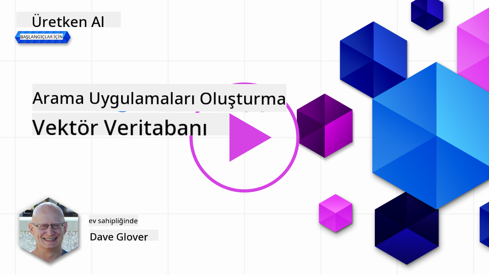
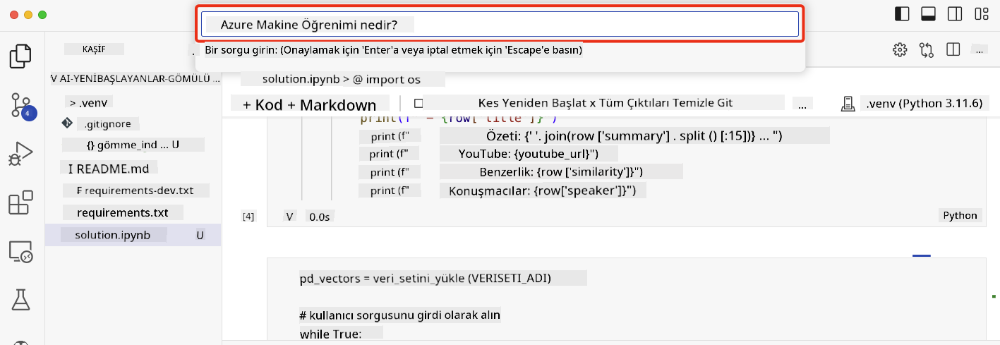

<!--
CO_OP_TRANSLATOR_METADATA:
{
  "original_hash": "d46aad0917a1a342d613e2c13d457da5",
  "translation_date": "2025-05-19T18:29:22+00:00",
  "source_file": "08-building-search-applications/README.md",
  "language_code": "tr"
}
-->
# Arama Uygulamaları Oluşturma

[](https://aka.ms/gen-ai-lesson8-gh?WT.mc_id=academic-105485-koreyst)

> > _Bu dersin videosunu izlemek için yukarıdaki görsele tıklayın_

LLM'ler, sohbet botları ve metin üretiminden daha fazlasını sunar. Embeddings kullanarak arama uygulamaları da oluşturmak mümkündür. Embeddings, vektörler olarak da bilinen veri sayısal temsilleridir ve veri için anlamsal arama yapmak için kullanılabilir.

Bu derste, eğitim girişimimiz için bir arama uygulaması geliştireceksiniz. Girişimimiz, gelişmekte olan ülkelerdeki öğrencilere ücretsiz eğitim sağlayan kar amacı gütmeyen bir organizasyondur. Öğrencilerin AI hakkında bilgi edinebileceği çok sayıda YouTube videomuz var. Girişimimiz, öğrencilerin bir soru yazarak YouTube videosu arayabilecekleri bir arama uygulaması oluşturmak istiyor.

Örneğin, bir öğrenci 'Jupyter Notebooks nedir?' veya 'Azure ML nedir?' yazabilir ve arama uygulaması soruya uygun YouTube videolarının bir listesini döndürecek ve daha da iyisi, arama uygulaması sorunun cevabının bulunduğu videodaki yere bir bağlantı döndürecektir.

## Giriş

Bu derste ele alacağımız konular:

- Anlamsal arama vs Anahtar kelime araması.
- Metin Embeddings nedir.
- Metin Embeddings İndeksi Oluşturma.
- Metin Embeddings İndeksinde Arama Yapma.

## Öğrenme Hedefleri

Bu dersi tamamladıktan sonra:

- Anlamsal ve anahtar kelime araması arasındaki farkı söyleyebileceksiniz.
- Metin Embeddings'in ne olduğunu açıklayabileceksiniz.
- Verileri aramak için Embeddings kullanarak bir uygulama oluşturabileceksiniz.

## Neden bir arama uygulaması oluşturmalıyız?

Bir arama uygulaması oluşturmak, Embeddings kullanarak verileri nasıl arayacağınızı anlamanıza yardımcı olacaktır. Ayrıca, öğrencilerin bilgileri hızlı bir şekilde bulabilmesi için kullanılabilecek bir arama uygulaması oluşturmayı öğreneceksiniz.

Ders, Microsoft [AI Show](https://www.youtube.com/playlist?list=PLlrxD0HtieHi0mwteKBOfEeOYf0LJU4O1) YouTube kanalının transkriptlerinin bir Embedding İndeksini içerir. AI Show, AI ve makine öğrenimi hakkında bilgi veren bir YouTube kanalıdır. Embedding İndeksi, Ekim 2023'e kadar olan her YouTube transkriptinin Embeddings'ini içerir. Girişimimiz için bir arama uygulaması oluşturmak için Embedding İndeksini kullanacaksınız. Arama uygulaması, sorunun cevabının bulunduğu videodaki yere bir bağlantı döndürecektir. Bu, öğrencilerin ihtiyaç duydukları bilgileri hızlı bir şekilde bulmaları için harika bir yoldur.

Aşağıda, 'rstudio'yu azure ml ile kullanabilir misiniz?' sorusu için bir anlamsal sorgu örneği verilmiştir. YouTube URL'sine göz atın, URL'nin sizi sorunun cevabının bulunduğu videodaki yere götüren bir zaman damgası içerdiğini göreceksiniz.


## Anlamsal arama nedir?

Şimdi merak ediyor olabilirsiniz, anlamsal arama nedir? Anlamsal arama, bir sorgudaki kelimelerin anlamını kullanarak ilgili sonuçları döndüren bir arama tekniğidir.

İşte bir anlamsal arama örneği. Diyelim ki bir araba satın almak istiyorsunuz, 'hayalimdeki araba' diye arama yapabilirsiniz, anlamsal arama sizin bir araba hakkında `dreaming` olmadığınızı, aksine hayalinizdeki `ideal` arabayı satın almak istediğinizi anlar. Anlamsal arama niyetinizi anlar ve ilgili sonuçları döndürür. Alternatifi ise `keyword search` olup, kelimenin tam anlamıyla arabalar hakkındaki rüyaları arar ve genellikle alakasız sonuçlar döndürür.

## Metin Embeddings nedir?

[Metin embeddings](https://en.wikipedia.org/wiki/Word_embedding?WT.mc_id=academic-105485-koreyst), [doğal dil işleme](https://en.wikipedia.org/wiki/Natural_language_processing?WT.mc_id=academic-105485-koreyst) kullanılan bir metin temsil tekniğidir. Metin embeddings, metnin anlamsal sayısal temsilleridir. Embeddings, verileri makinenin kolayca anlayabileceği bir şekilde temsil etmek için kullanılır. Metin embeddings oluşturmak için birçok model vardır, bu derste OpenAI Embedding Modeli kullanarak embeddings oluşturma üzerine odaklanacağız.

İşte bir örnek, AI Show YouTube kanalındaki bölümlerden birinin transkriptinde aşağıdaki metni hayal edin:

```text
Today we are going to learn about Azure Machine Learning.
```

Metni OpenAI Embedding API'sine iletiriz ve 1536 sayıyı yani bir vektörü içeren aşağıdaki embedding'i döndürür. Vektördeki her sayı, metnin farklı bir yönünü temsil eder. Kısalık adına, vektördeki ilk 10 sayı burada.

```python
[-0.006655829958617687, 0.0026128944009542465, 0.008792596869170666, -0.02446001023054123, -0.008540431968867779, 0.022071078419685364, -0.010703742504119873, 0.003311325330287218, -0.011632772162556648, -0.02187200076878071, ...]
```

## Embedding indeksi nasıl oluşturulur?

Bu ders için Embedding indeksi bir dizi Python betiği ile oluşturulmuştur. Betikleri ve talimatları bu dersin 'scripts' klasöründeki [README](./scripts/README.md?WT.mc_id=academic-105485-koreyst) dosyasında bulabilirsiniz. Bu dersi tamamlamak için bu betikleri çalıştırmanıza gerek yoktur çünkü Embedding İndeksi sizin için sağlanmıştır.

Betikler şu işlemleri gerçekleştirir:

1. [AI Show](https://www.youtube.com/playlist?list=PLlrxD0HtieHi0mwteKBOfEeOYf0LJU4O1) oynatma listesindeki her YouTube videosunun transkripti indirilir.
2. [OpenAI İşlevleri](https://learn.microsoft.com/azure/ai-services/openai/how-to/function-calling?WT.mc_id=academic-105485-koreyst) kullanılarak, YouTube transkriptinin ilk 3 dakikasından konuşmacı adını çıkarmaya çalışılır. Her video için konuşmacı adı `embedding_index_3m.json` adlı Embedding İndeksine kaydedilir.
3. Transkript metni daha sonra **3 dakikalık metin segmentlerine** bölünür. Segment, Embedding'in kesilmemesini sağlamak ve daha iyi arama bağlamı sağlamak için bir sonraki segmentten yaklaşık 20 kelime içerir.
4. Her metin segmenti daha sonra OpenAI Chat API'ye iletilir ve metni 60 kelimeye özetlemesi sağlanır. Özet de `embedding_index_3m.json` adlı Embedding İndeksine kaydedilir.
5. Son olarak, segment metni OpenAI Embedding API'ye iletilir. Embedding API, segmentin anlamsal anlamını temsil eden 1536 sayıdan oluşan bir vektör döndürür. Segment, OpenAI Embedding vektörü ile birlikte `embedding_index_3m.json` adlı Embedding İndeksine kaydedilir.

### Vektör Veritabanları

Dersin basitliği için, Embedding İndeksi `embedding_index_3m.json` adlı bir JSON dosyasında saklanır ve bir Pandas DataFrame'e yüklenir. Ancak, üretimde Embedding İndeksi [Azure Cognitive Search](https://learn.microsoft.com/training/modules/improve-search-results-vector-search?WT.mc_id=academic-105485-koreyst), [Redis](https://cookbook.openai.com/examples/vector_databases/redis/readme?WT.mc_id=academic-105485-koreyst), [Pinecone](https://cookbook.openai.com/examples/vector_databases/pinecone/readme?WT.mc_id=academic-105485-koreyst), [Weaviate](https://cookbook.openai.com/examples/vector_databases/weaviate/readme?WT.mc_id=academic-105485-koreyst) gibi vektör veritabanlarında saklanır.

## Kosinüs benzerliğini anlama

Metin embeddings hakkında bilgi edindik, bir sonraki adım metin embeddings kullanarak verileri nasıl arayacağımızı ve özellikle kosinüs benzerliğini kullanarak verilen bir sorguya en benzer embeddings'i nasıl bulacağımızı öğrenmektir.

### Kosinüs benzerliği nedir?

Kosinüs benzerliği, iki vektör arasındaki benzerliği ölçen bir ölçüttür, bu aynı zamanda `nearest neighbor search` olarak da adlandırılır. Bir kosinüs benzerliği araması yapmak için, OpenAI Embedding API kullanarak _sorgu_ metnini _vektörize_ etmeniz gerekir. Ardından, sorgu vektörü ile Embedding İndeksindeki her vektör arasındaki _kosinüs benzerliğini_ hesaplayın. Unutmayın, Embedding İndeksi her YouTube transkript metin segmenti için bir vektör içerir. Son olarak, sonuçları kosinüs benzerliğine göre sıralayın ve en yüksek kosinüs benzerliğine sahip metin segmentleri sorguya en benzer olanlardır.

Matematiksel bir perspektiften, kosinüs benzerliği, çok boyutlu bir uzayda iki vektör arasındaki açının kosinüsünü ölçer. Bu ölçüm faydalıdır çünkü boyut nedeniyle iki belge Öklid mesafesi ile uzakta olsa bile, aralarındaki açı daha küçük olabilir ve dolayısıyla daha yüksek kosinüs benzerliğine sahip olabilirler. Kosinüs benzerliği denklemleri hakkında daha fazla bilgi için [Kosinüs benzerliği](https://en.wikipedia.org/wiki/Cosine_similarity?WT.mc_id=academic-105485-koreyst) sayfasına bakın.

## İlk arama uygulamanızı oluşturma

Sırada, Embeddings kullanarak bir arama uygulaması nasıl oluşturulacağını öğreneceğiz. Arama uygulaması, öğrencilerin bir soru yazarak video aramalarına olanak tanır. Arama uygulaması, soruya uygun videoların bir listesini döndürecektir. Arama uygulaması ayrıca, sorunun cevabının bulunduğu videodaki yere bir bağlantı döndürecektir.

Bu çözüm, Windows 11, macOS ve Ubuntu 22.04 üzerinde Python 3.10 veya daha yeni bir sürüm kullanılarak oluşturulmuş ve test edilmiştir. Python'u [python.org](https://www.python.org/downloads/?WT.mc_id=academic-105485-koreyst) adresinden indirebilirsiniz.

## Ödev - öğrencilere olanak sağlamak için bir arama uygulaması oluşturma

Bu dersin başında girişimimizi tanıttık. Şimdi öğrencilerin değerlendirmeleri için bir arama uygulaması oluşturmalarına olanak sağlama zamanı.

Bu ödevde, arama uygulaması oluşturmak için kullanılacak Azure OpenAI Hizmetlerini oluşturacaksınız. Aşağıdaki Azure OpenAI Hizmetlerini oluşturacaksınız. Bu ödevi tamamlamak için bir Azure aboneliğine ihtiyacınız olacak.

### Azure Cloud Shell'i Başlatın

1. [Azure portalına](https://portal.azure.com/?WT.mc_id=academic-105485-koreyst) giriş yapın.
2. Azure portalının sağ üst köşesindeki Cloud Shell simgesini seçin.
3. Ortam türü olarak **Bash**'i seçin.

#### Bir kaynak grubu oluşturun

> Bu talimatlar için, East US'te "semantic-video-search" adlı kaynak grubunu kullanıyoruz.
> Kaynak grubunun adını değiştirebilirsiniz, ancak kaynakların konumunu değiştirirken,
> [model kullanılabilirlik tablosunu](https://aka.ms/oai/models?WT.mc_id=academic-105485-koreyst) kontrol edin.

```shell
az group create --name semantic-video-search --location eastus
```

#### Bir Azure OpenAI Hizmeti kaynağı oluşturun

Azure Cloud Shell'den, bir Azure OpenAI Hizmeti kaynağı oluşturmak için aşağıdaki komutu çalıştırın.

```shell
az cognitiveservices account create --name semantic-video-openai --resource-group semantic-video-search \
    --location eastus --kind OpenAI --sku s0
```

#### Bu uygulamada kullanım için uç nokta ve anahtarları alın

Azure Cloud Shell'den, Azure OpenAI Hizmeti kaynağı için uç nokta ve anahtarları almak için aşağıdaki komutları çalıştırın.

```shell
az cognitiveservices account show --name semantic-video-openai \
   --resource-group  semantic-video-search | jq -r .properties.endpoint
az cognitiveservices account keys list --name semantic-video-openai \
   --resource-group semantic-video-search | jq -r .key1
```

#### OpenAI Embedding modelini dağıtın

Azure Cloud Shell'den, OpenAI Embedding modelini dağıtmak için aşağıdaki komutu çalıştırın.

```shell
az cognitiveservices account deployment create \
    --name semantic-video-openai \
    --resource-group  semantic-video-search \
    --deployment-name text-embedding-ada-002 \
    --model-name text-embedding-ada-002 \
    --model-version "2"  \
    --model-format OpenAI \
    --sku-capacity 100 --sku-name "Standard"
```

## Çözüm

GitHub Codespaces'te [çözüm defterini](../../../08-building-search-applications/python/aoai-solution.ipynb) açın ve Jupyter Notebook'taki talimatları izleyin.

Defteri çalıştırdığınızda, bir sorgu girmeniz istenecektir. Giriş kutusu şöyle görünecektir:



## Harika İş! Öğrenmeye Devam Edin

Bu dersi tamamladıktan sonra, Yaratıcı AI bilginizi artırmaya devam etmek için [Yaratıcı AI Öğrenme koleksiyonumuza](https://aka.ms/genai-collection?WT.mc_id=academic-105485-koreyst) göz atın!

Ders 9'a geçin, burada [görüntü oluşturma uygulamaları](../09-building-image-applications/README.md?WT.mc_id=academic-105485-koreyst) nasıl oluşturulacağını inceleyeceğiz!

**Feragatname**:  
Bu belge, AI çeviri hizmeti [Co-op Translator](https://github.com/Azure/co-op-translator) kullanılarak çevrilmiştir. Doğruluk için çaba göstersek de, otomatik çevirilerin hata veya yanlışlıklar içerebileceğini lütfen unutmayın. Orijinal belge, kendi dilinde yetkili kaynak olarak kabul edilmelidir. Kritik bilgiler için profesyonel insan çevirisi önerilir. Bu çevirinin kullanımından kaynaklanan yanlış anlamalar veya yanlış yorumlamalardan sorumlu değiliz.