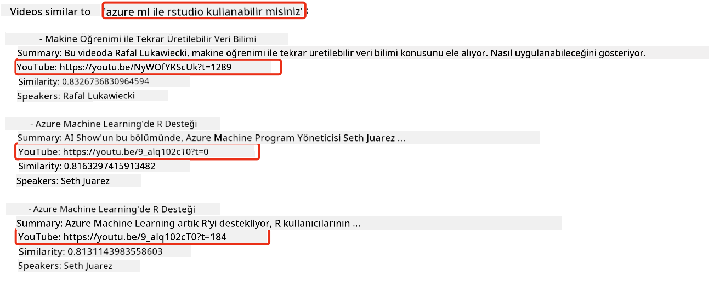

<!--
CO_OP_TRANSLATOR_METADATA:
{
  "original_hash": "d46aad0917a1a342d613e2c13d457da5",
  "translation_date": "2025-07-09T12:54:45+00:00",
  "source_file": "08-building-search-applications/README.md",
  "language_code": "tr"
}
-->
# Arama Uygulamaları Geliştirme

[](https://aka.ms/gen-ai-lesson8-gh?WT.mc_id=academic-105485-koreyst)

> > _Bu dersin videosunu izlemek için yukarıdaki görsele tıklayın_

LLM’ler sadece sohbet botları ve metin üretiminden ibaret değil. Embeddings kullanarak arama uygulamaları geliştirmek de mümkün. Embeddings, vektörler olarak da bilinen sayısal veri temsilleridir ve veriler için anlamsal arama yapmakta kullanılır.

Bu derste, eğitim girişimimiz için bir arama uygulaması geliştireceksiniz. Girişimimiz, gelişmekte olan ülkelerdeki öğrencilere ücretsiz eğitim sağlayan kar amacı gütmeyen bir organizasyondur. Girişimimizin, öğrencilerin yapay zeka hakkında öğrenebileceği çok sayıda YouTube videosu var. Öğrencilerin bir soruyu yazarak YouTube videosu arayabileceği bir arama uygulaması geliştirmek istiyoruz.

Örneğin, bir öğrenci 'Jupyter Notebooks nedir?' ya da 'Azure ML nedir?' diye yazabilir ve arama uygulaması, soruyla ilgili YouTube videolarının bir listesini döndürecek. Üstelik, arama uygulaması sorunun cevabının bulunduğu videodaki yere doğrudan bir bağlantı da verecek.

## Giriş

Bu derste şunları ele alacağız:

- Anlamsal arama ile anahtar kelime araması arasındaki fark.
- Metin Embeddings nedir.
- Metin Embeddings İndeksi oluşturma.
- Metin Embeddings İndeksinde arama yapma.

## Öğrenme Hedefleri

Bu dersi tamamladıktan sonra şunları yapabileceksiniz:

- Anlamsal arama ile anahtar kelime araması arasındaki farkı açıklamak.
- Metin Embeddings’in ne olduğunu anlatmak.
- Embeddings kullanarak veri arayan bir uygulama oluşturmak.

## Neden arama uygulaması geliştirmeli?

Bir arama uygulaması geliştirmek, Embeddings kullanarak veri aramanın nasıl yapıldığını anlamanıza yardımcı olur. Ayrıca, öğrencilerin bilgiyi hızlıca bulabilmesi için kullanılabilecek bir arama uygulaması geliştirmeyi öğreneceksiniz.

Ders kapsamında, Microsoft [AI Show](https://www.youtube.com/playlist?list=PLlrxD0HtieHi0mwteKBOfEeOYf0LJU4O1) YouTube kanalının transkriptleri için bir Embedding İndeksi yer alıyor. AI Show, yapay zeka ve makine öğrenimini öğreten bir YouTube kanalıdır. Embedding İndeksi, Ekim 2023’e kadar olan YouTube transkriptlerinin Embeddings’lerini içerir. Bu Embedding İndeksini kullanarak girişimimiz için bir arama uygulaması geliştireceksiniz. Arama uygulaması, sorunun cevabının bulunduğu videodaki yere doğrudan bir bağlantı döndürecek. Bu, öğrencilerin ihtiyaç duydukları bilgiyi hızlıca bulmaları için harika bir yöntemdir.

Aşağıda, 'rstudio’yu azure ml ile kullanabilir misiniz?' sorusuna yönelik bir anlamsal sorgu örneği var. YouTube URL’sine bakarsanız, URL’de sorunun cevabının bulunduğu videodaki zamana işaret eden bir zaman damgası olduğunu göreceksiniz.



## Anlamsal arama nedir?

Şimdi merak ediyor olabilirsiniz, anlamsal arama nedir? Anlamsal arama, sorgudaki kelimelerin anlamını kullanarak ilgili sonuçları döndüren bir arama tekniğidir.

İşte bir anlamsal arama örneği. Diyelim ki araba almak istiyorsunuz, 'hayalimdeki araba' diye arama yapabilirsiniz. Anlamsal arama, sizin araba hakkında `hayal kurduğunuzu` değil, `ideal` arabanızı satın almak istediğinizi anlar. Anlamsal arama niyetinizi kavrar ve ilgili sonuçları döndürür. Alternatif olarak, `anahtar kelime araması` kelimeleri tam olarak arar ve genellikle alakasız sonuçlar verir.

## Metin Embeddings nedir?

[Metin embeddings](https://en.wikipedia.org/wiki/Word_embedding?WT.mc_id=academic-105485-koreyst), [doğal dil işleme](https://en.wikipedia.org/wiki/Natural_language_processing?WT.mc_id=academic-105485-koreyst) alanında kullanılan bir metin temsil tekniğidir. Metin embeddings, metnin anlamsal sayısal temsilleridir. Embeddings, veriyi makinenin kolayca anlayabileceği şekilde temsil etmek için kullanılır. Metin embeddings oluşturmak için birçok model vardır; bu derste OpenAI Embedding Modeli kullanarak embeddings oluşturmayı öğreneceğiz.

Örneğin, AI Show YouTube kanalındaki bir bölümün transkriptinde aşağıdaki metin olduğunu varsayalım:

```text
Today we are going to learn about Azure Machine Learning.
```

Metni OpenAI Embedding API’sine göndeririz ve 1536 sayıdan oluşan bir embedding (vektör) döner. Vektördeki her sayı metnin farklı bir yönünü temsil eder. Kısalık açısından, işte vektörün ilk 10 sayısı:

```python
[-0.006655829958617687, 0.0026128944009542465, 0.008792596869170666, -0.02446001023054123, -0.008540431968867779, 0.022071078419685364, -0.010703742504119873, 0.003311325330287218, -0.011632772162556648, -0.02187200076878071, ...]
```

## Embedding indeksi nasıl oluşturulur?

Bu ders için Embedding indeksi bir dizi Python betiği ile oluşturuldu. Betikleri ve talimatları, bu dersin 'scripts' klasöründeki [README](./scripts/README.md?WT.mc_id=academic-105485-koreyst) dosyasında bulabilirsiniz. Bu betikleri çalıştırmanıza gerek yok, çünkü Embedding İndeksi size sağlanmıştır.

Betikler şu işlemleri yapar:

1. [AI Show](https://www.youtube.com/playlist?list=PLlrxD0HtieHi0mwteKBOfEeOYf0LJU4O1) oynatma listesindeki her YouTube videosunun transkripti indirilir.
2. [OpenAI Functions](https://learn.microsoft.com/azure/ai-services/openai/how-to/function-calling?WT.mc_id=academic-105485-koreyst) kullanılarak, YouTube transkriptinin ilk 3 dakikasından konuşmacı adı çıkarılmaya çalışılır. Her video için konuşmacı adı `embedding_index_3m.json` adlı Embedding İndeksinde saklanır.
3. Transkript metni, **3 dakikalık metin segmentlerine** bölünür. Segmentler arasında yaklaşık 20 kelimelik örtüşme olur; böylece segmentin embedding’i kesilmez ve arama bağlamı iyileşir.
4. Her metin segmenti OpenAI Chat API’ye gönderilerek 60 kelimelik özet oluşturulur. Özet de `embedding_index_3m.json` Embedding İndeksinde saklanır.
5. Son olarak, segment metni OpenAI Embedding API’ye gönderilir. Embedding API, segmentin anlamsal anlamını temsil eden 1536 sayılık bir vektör döner. Segment ve OpenAI Embedding vektörü `embedding_index_3m.json` Embedding İndeksinde saklanır.

### Vektör Veritabanları

Dersin basitliği için Embedding İndeksi `embedding_index_3m.json` adlı JSON dosyasında saklanır ve Pandas DataFrame’e yüklenir. Ancak, üretim ortamında Embedding İndeksi, [Azure Cognitive Search](https://learn.microsoft.com/training/modules/improve-search-results-vector-search?WT.mc_id=academic-105485-koreyst), [Redis](https://cookbook.openai.com/examples/vector_databases/redis/readme?WT.mc_id=academic-105485-koreyst), [Pinecone](https://cookbook.openai.com/examples/vector_databases/pinecone/readme?WT.mc_id=academic-105485-koreyst), [Weaviate](https://cookbook.openai.com/examples/vector_databases/weaviate/readme?WT.mc_id=academic-105485-koreyst) gibi vektör veritabanlarında saklanır.

## Kosinüs benzerliğini anlama

Metin embeddings’i öğrendik, şimdi metin embeddings’i kullanarak veri aramayı ve özellikle verilen bir sorguya en benzer embeddings’i kosinüs benzerliği ile bulmayı öğreneceğiz.

### Kosinüs benzerliği nedir?

Kosinüs benzerliği, iki vektör arasındaki benzerliği ölçer, buna `en yakın komşu araması` da denir. Kosinüs benzerliği araması yapmak için, sorgu metnini OpenAI Embedding API ile _vektörleştirmeniz_ gerekir. Sonra sorgu vektörü ile Embedding İndeksindeki her vektör arasındaki _kosinüs benzerliği_ hesaplanır. Unutmayın, Embedding İndeksinde her YouTube transkript metin segmenti için bir vektör vardır. Son olarak, sonuçlar kosinüs benzerliğine göre sıralanır ve en yüksek kosinüs benzerliğine sahip metin segmentleri sorguya en benzer olanlardır.

Matematiksel açıdan, kosinüs benzerliği, çok boyutlu uzayda projeksiyon yapılmış iki vektör arasındaki açının kosinüsünü ölçer. Bu ölçüm faydalıdır çünkü iki belge Euclidean mesafesiyle birbirinden uzak olsa da, aralarındaki açı küçük olabilir ve dolayısıyla kosinüs benzerliği yüksek olabilir. Kosinüs benzerliği denklemleri hakkında daha fazla bilgi için [Cosine similarity](https://en.wikipedia.org/wiki/Cosine_similarity?WT.mc_id=academic-105485-koreyst) sayfasına bakabilirsiniz.

## İlk arama uygulamanızı geliştirme

Şimdi, Embeddings kullanarak bir arama uygulaması geliştirmeyi öğreneceğiz. Arama uygulaması, öğrencilerin bir soruyu yazarak video aramasına olanak tanıyacak. Arama uygulaması, soruyla ilgili videoların bir listesini döndürecek. Ayrıca, sorunun cevabının bulunduğu videodaki yere doğrudan bir bağlantı da verecek.

Bu çözüm, Windows 11, macOS ve Ubuntu 22.04 üzerinde Python 3.10 veya daha yeni sürümleri kullanılarak geliştirilmiş ve test edilmiştir. Python’u [python.org](https://www.python.org/downloads/?WT.mc_id=academic-105485-koreyst) adresinden indirebilirsiniz.

## Ödev - öğrencilerin kullanması için arama uygulaması geliştirme

Dersin başında girişimimizi tanıttık. Şimdi öğrencilerin değerlendirmeleri için bir arama uygulaması geliştirmelerini sağlayacağız.

Bu ödevde, arama uygulamasını oluşturmak için kullanılacak Azure OpenAI Hizmetlerini oluşturacaksınız. Aşağıdaki Azure OpenAI Hizmetlerini oluşturacaksınız. Bu ödevi tamamlamak için bir Azure aboneliğinizin olması gerekir.

### Azure Cloud Shell’i başlatma

1. [Azure portal](https://portal.azure.com/?WT.mc_id=academic-105485-koreyst) adresine giriş yapın.
2. Azure portalın sağ üst köşesindeki Cloud Shell simgesini seçin.
3. Ortam türü olarak **Bash**’i seçin.

#### Bir kaynak grubu oluşturma

> Bu talimatlarda, Doğu ABD bölgesinde "semantic-video-search" adlı kaynak grubu kullanıyoruz.
> Kaynak grubunun adını değiştirebilirsiniz, ancak kaynakların konumunu değiştirirken
> [model kullanılabilirlik tablosunu](https://aka.ms/oai/models?WT.mc_id=academic-105485-koreyst) kontrol edin.

```shell
az group create --name semantic-video-search --location eastus
```

#### Azure OpenAI Hizmeti kaynağı oluşturma

Azure Cloud Shell’den aşağıdaki komutu çalıştırarak bir Azure OpenAI Hizmeti kaynağı oluşturun.

```shell
az cognitiveservices account create --name semantic-video-openai --resource-group semantic-video-search \
    --location eastus --kind OpenAI --sku s0
```

#### Uygulamada kullanılmak üzere uç nokta ve anahtarları alma

Azure Cloud Shell’den aşağıdaki komutları çalıştırarak Azure OpenAI Hizmeti kaynağı için uç nokta ve anahtarları alın.

```shell
az cognitiveservices account show --name semantic-video-openai \
   --resource-group  semantic-video-search | jq -r .properties.endpoint
az cognitiveservices account keys list --name semantic-video-openai \
   --resource-group semantic-video-search | jq -r .key1
```

#### OpenAI Embedding modelini dağıtma

Azure Cloud Shell’den aşağıdaki komutu çalıştırarak OpenAI Embedding modelini dağıtın.

```shell
az cognitiveservices account deployment create \
    --name semantic-video-openai \
    --resource-group  semantic-video-search \
    --deployment-name text-embedding-ada-002 \
    --model-name text-embedding-ada-002 \
    --model-version "2"  \
    --model-format OpenAI \
    --sku-capacity 100 --sku-name "Standard"
```

## Çözüm

GitHub Codespaces’teki [çözüm not defterini](../../../08-building-search-applications/python/aoai-solution.ipynb) açın ve Jupyter Notebook’taki talimatları izleyin.

Not defterini çalıştırdığınızda, bir sorgu girmeniz istenecek. Girdi kutusu şöyle görünecek:


## Harika İş! Öğrenmeye Devam Edin

Bu dersi tamamladıktan sonra, Generatif AI bilginizi geliştirmeye devam etmek için [Generative AI Öğrenme koleksiyonumuza](https://aka.ms/genai-collection?WT.mc_id=academic-105485-koreyst) göz atın!

Bir sonraki derse, [görüntü oluşturma uygulamaları geliştirmeye](../09-building-image-applications/README.md?WT.mc_id=academic-105485-koreyst) bakacağız!

**Feragatname**:  
Bu belge, AI çeviri servisi [Co-op Translator](https://github.com/Azure/co-op-translator) kullanılarak çevrilmiştir. Doğruluk için çaba göstersek de, otomatik çevirilerin hatalar veya yanlışlıklar içerebileceğini lütfen unutmayınız. Orijinal belge, kendi dilinde yetkili kaynak olarak kabul edilmelidir. Kritik bilgiler için profesyonel insan çevirisi önerilir. Bu çevirinin kullanımı sonucu oluşabilecek yanlış anlamalar veya yorum hatalarından sorumlu değiliz.