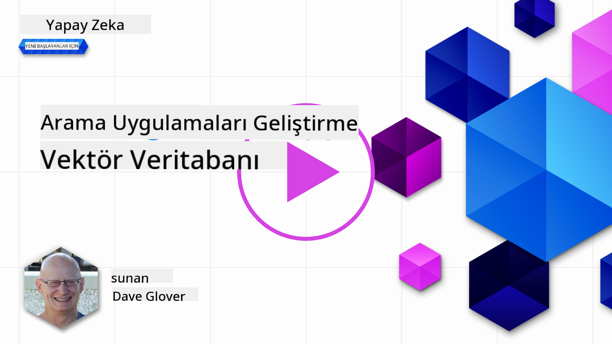
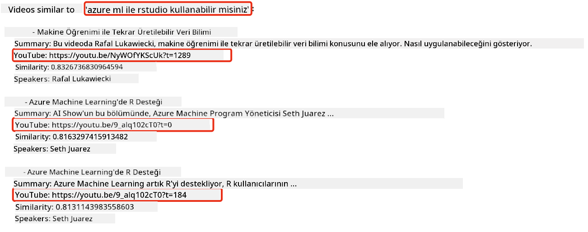
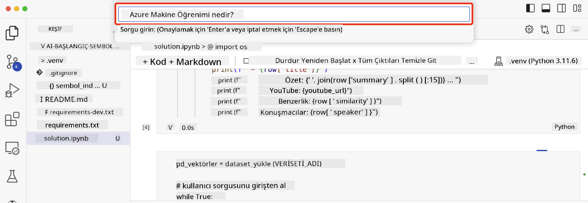

<!--
CO_OP_TRANSLATOR_METADATA:
{
  "original_hash": "d46aad0917a1a342d613e2c13d457da5",
  "translation_date": "2025-06-25T16:28:53+00:00",
  "source_file": "08-building-search-applications/README.md",
  "language_code": "tr"
}
-->
# Arama Uygulamaları Oluşturma

[](https://aka.ms/gen-ai-lesson8-gh?WT.mc_id=academic-105485-koreyst)

> > _Bu dersin videosunu izlemek için yukarıdaki resme tıklayın_

LLM'ler sadece sohbet botları ve metin üretimi ile sınırlı değildir. Embeddings kullanarak arama uygulamaları oluşturmak da mümkündür. Embeddings, verilerin sayısal temsilidir ve vektörler olarak da bilinir, verilerin anlamsal araması için kullanılabilir.

Bu derste, eğitim girişimimiz için bir arama uygulaması oluşturacaksınız. Girişimimiz, gelişmekte olan ülkelerdeki öğrencilere ücretsiz eğitim sağlayan kar amacı gütmeyen bir organizasyondur. Öğrencilerin yapay zeka hakkında öğrenmeleri için kullanabilecekleri çok sayıda YouTube videomuz var. Öğrencilerin bir soru yazarak YouTube videosu aramasına olanak tanıyan bir arama uygulaması oluşturmak istiyoruz.

Örneğin, bir öğrenci 'Jupyter Notebooks nedir?' veya 'Azure ML nedir?' yazabilir ve arama uygulaması, soruyla ilgili YouTube videolarının bir listesini döndürecektir ve daha da iyisi, arama uygulaması, sorunun cevabının bulunduğu videodaki yere bir bağlantı döndürecektir.

## Giriş

Bu derste ele alacağımız konular:

- Anlamsal vs Anahtar kelime araması.
- Metin Embeddings nedir.
- Metin Embeddings İndeksi Oluşturma.
- Metin Embeddings İndeksinde Arama Yapma.

## Öğrenme Hedefleri

Bu dersi tamamladıktan sonra:

- Anlamsal ve anahtar kelime araması arasındaki farkı anlatabileceksiniz.
- Metin Embeddings'in ne olduğunu açıklayabileceksiniz.
- Embeddings kullanarak veri araması yapmak için bir uygulama oluşturabileceksiniz.

## Neden bir arama uygulaması oluşturmalısınız?

Bir arama uygulaması oluşturmak, Embeddings kullanarak veri araması yapmayı anlamanıza yardımcı olacaktır. Ayrıca, öğrencilerin bilgileri hızlıca bulabilmesi için kullanılabilecek bir arama uygulaması nasıl oluşturulacağını öğreneceksiniz.

Ders, Microsoft [AI Show](https://www.youtube.com/playlist?list=PLlrxD0HtieHi0mwteKBOfEeOYf0LJU4O1) YouTube kanalının transkriptleri için bir Embedding İndeksi içerir. AI Show, yapay zeka ve makine öğrenimi hakkında bilgi veren bir YouTube kanalıdır. Embedding İndeksi, Ekim 2023'e kadar olan her YouTube transkriptinin Embeddings'ini içerir. Girişimimiz için bir arama uygulaması oluşturmak için Embedding İndeksi'ni kullanacaksınız. Arama uygulaması, sorunun cevabının bulunduğu videodaki yere bir bağlantı döndürür. Bu, öğrencilerin ihtiyaç duydukları bilgileri hızlıca bulmaları için harika bir yoldur.

'Azure ML ile rstudio kullanabilir misiniz?' sorusu için bir anlamsal sorgu örneği aşağıda verilmiştir. YouTube URL'sine göz atın, URL'nin sizi sorunun cevabının bulunduğu videodaki yere götüren bir zaman damgası içerdiğini göreceksiniz.



## Anlamsal arama nedir?

Şimdi merak ediyor olabilirsiniz, anlamsal arama nedir? Anlamsal arama, bir sorgudaki kelimelerin anlamını kullanarak ilgili sonuçları döndüren bir arama tekniğidir.

İşte bir anlamsal arama örneği. Diyelim ki bir araba satın almak istiyorsunuz, 'hayalimdeki araba' şeklinde arama yapabilirsiniz, anlamsal arama, bir araba hakkında `dreaming` değil, hayalinizdeki `ideal` arabayı satın almak istediğinizi anlar. Anlamsal arama niyetinizi anlar ve ilgili sonuçları döndürür. Alternatif `keyword search`, arabalar hakkında hayalleri arar ve genellikle alakasız sonuçlar döndürür.

## Metin Embeddings nedir?

[Metin embeddings](https://en.wikipedia.org/wiki/Word_embedding?WT.mc_id=academic-105485-koreyst), [doğal dil işleme](https://en.wikipedia.org/wiki/Natural_language_processing?WT.mc_id=academic-105485-koreyst) alanında kullanılan bir metin temsil tekniğidir. Metin embeddings, metnin anlamsal sayısal temsilidir. Embeddings, verileri bir makinenin kolayca anlayabileceği bir şekilde temsil etmek için kullanılır. Metin embeddings oluşturmak için birçok model vardır, bu derste OpenAI Embedding Modeli kullanarak embeddings oluşturmayı odaklanacağız.

İşte bir örnek, AI Show YouTube kanalındaki bölümlerden birinin transkriptinde aşağıdaki metni hayal edin:

```text
Today we are going to learn about Azure Machine Learning.
```

Metni OpenAI Embedding API'ye geçiririz ve 1536 sayıdan oluşan bir embedding, yani bir vektör döner. Vektördeki her sayı, metnin farklı bir yönünü temsil eder. Kısaca, vektördeki ilk 10 sayı burada verilmiştir.

```python
[-0.006655829958617687, 0.0026128944009542465, 0.008792596869170666, -0.02446001023054123, -0.008540431968867779, 0.022071078419685364, -0.010703742504119873, 0.003311325330287218, -0.011632772162556648, -0.02187200076878071, ...]
```

## Embedding indeksi nasıl oluşturulur?

Bu ders için Embedding indeksi bir dizi Python scripti ile oluşturuldu. Scriptleri ve talimatları bu dersin 'scripts' klasöründe bulunan [README](./scripts/README.md?WT.mc_id=academic-105485-koreyst) dosyasında bulabilirsiniz. Bu ders için scriptleri çalıştırmanız gerekmiyor çünkü Embedding İndeksi sizin için sağlanmıştır.

Scriptler aşağıdaki işlemleri gerçekleştirir:

1. [AI Show](https://www.youtube.com/playlist?list=PLlrxD0HtieHi0mwteKBOfEeOYf0LJU4O1) oynatma listesindeki her YouTube videosunun transkripti indirilir.
2. [OpenAI Fonksiyonları](https://learn.microsoft.com/azure/ai-services/openai/how-to/function-calling?WT.mc_id=academic-105485-koreyst) kullanılarak YouTube transkriptinin ilk 3 dakikasından konuşmacı adı çıkarılmaya çalışılır. Her video için konuşmacı adı, `embedding_index_3m.json` adlı Embedding İndeksi'nde saklanır.
3. Transkript metni **3 dakikalık metin segmentlerine** bölünür. Segment, Embedding'in kesilmemesini ve daha iyi arama bağlamı sağlamasını sağlamak için bir sonraki segmentten yaklaşık 20 kelime içerir.
4. Her metin segmenti, metni 60 kelimeye özetlemek için OpenAI Chat API'ye geçirilir. Özet, `embedding_index_3m.json` adlı Embedding İndeksi'nde de saklanır.
5. Son olarak, segment metni OpenAI Embedding API'ye geçirilir. Embedding API, segmentin anlamsal anlamını temsil eden 1536 sayıdan oluşan bir vektör döndürür. Segment, OpenAI Embedding vektörü ile birlikte `embedding_index_3m.json` adlı Embedding İndeksi'nde saklanır.

### Vektör Veritabanları

Dersin basitliği için Embedding İndeksi, `embedding_index_3m.json` adlı bir JSON dosyasında saklanır ve Pandas DataFrame'e yüklenir. Ancak, üretimde Embedding İndeksi, [Azure Cognitive Search](https://learn.microsoft.com/training/modules/improve-search-results-vector-search?WT.mc_id=academic-105485-koreyst), [Redis](https://cookbook.openai.com/examples/vector_databases/redis/readme?WT.mc_id=academic-105485-koreyst), [Pinecone](https://cookbook.openai.com/examples/vector_databases/pinecone/readme?WT.mc_id=academic-105485-koreyst), [Weaviate](https://cookbook.openai.com/examples/vector_databases/weaviate/readme?WT.mc_id=academic-105485-koreyst) gibi bir vektör veritabanında saklanır, sadece birkaçını belirtmek gerekirse.

## Kosinüs benzerliğini anlama

Metin embeddings hakkında bilgi edindik, bir sonraki adım metin embeddings kullanarak veri araması yapmayı ve özellikle verilen bir sorguya en benzer embeddings'i bulmayı kosinüs benzerliği kullanarak öğrenmektir.

### Kosinüs benzerliği nedir?

Kosinüs benzerliği, iki vektör arasındaki benzerliği ölçen bir ölçüdür, aynı zamanda `nearest neighbor search` olarak da duyabilirsiniz. Kosinüs benzerliği araması yapmak için OpenAI Embedding API kullanarak _sorgu_ metnini _vektörleştirmek_ gerekir. Ardından, sorgu vektörü ile Embedding İndeksi'ndeki her vektör arasındaki _kosinüs benzerliğini_ hesaplayın. Unutmayın, Embedding İndeksi, her YouTube transkript metin segmenti için bir vektör içerir. Son olarak, sonuçları kosinüs benzerliğine göre sıralayın ve en yüksek kosinüs benzerliğine sahip metin segmentleri sorguya en benzer olanlardır.

Matematiksel açıdan bakıldığında, kosinüs benzerliği, çok boyutlu bir uzayda iki vektör arasındaki açının kosinüsünü ölçer. Bu ölçüm faydalıdır, çünkü boyut nedeniyle iki belge Öklid mesafesiyle birbirinden uzak olabilir, ancak yine de aralarında daha küçük bir açı olabilir ve dolayısıyla daha yüksek kosinüs benzerliği olabilir. Kosinüs benzerliği denklemleri hakkında daha fazla bilgi için [Kosinüs benzerliği](https://en.wikipedia.org/wiki/Cosine_similarity?WT.mc_id=academic-105485-koreyst) bölümüne bakın.

## İlk arama uygulamanızı oluşturma

Sonraki adımda, Embeddings kullanarak bir arama uygulaması nasıl oluşturulacağını öğreneceğiz. Arama uygulaması, öğrencilerin bir soru yazarak video aramasına olanak tanır. Arama uygulaması, soruyla ilgili videoların bir listesini döndürecektir. Arama uygulaması ayrıca, sorunun cevabının bulunduğu videodaki yere bir bağlantı döndürecektir.

Bu çözüm Windows 11, macOS ve Ubuntu 22.04 üzerinde Python 3.10 veya daha sonraki sürümler kullanılarak oluşturulmuş ve test edilmiştir. Python'u [python.org](https://www.python.org/downloads/?WT.mc_id=academic-105485-koreyst) adresinden indirebilirsiniz.

## Ödev - öğrencilere olanak tanıyan bir arama uygulaması oluşturma

Bu dersin başında girişimimizi tanıttık. Şimdi öğrencilerin değerlendirmeleri için bir arama uygulaması oluşturmalarına olanak tanımanın zamanı geldi.

Bu ödevde, arama uygulamasını oluşturmak için kullanılacak Azure OpenAI Hizmetlerini oluşturacaksınız. Aşağıdaki Azure OpenAI Hizmetlerini oluşturacaksınız. Bu ödevi tamamlamak için bir Azure aboneliğine ihtiyacınız olacak.

### Azure Cloud Shell'i başlatın

1. [Azure portalına](https://portal.azure.com/?WT.mc_id=academic-105485-koreyst) giriş yapın.
2. Azure portalının sağ üst köşesindeki Cloud Shell simgesini seçin.
3. Ortam türü olarak **Bash**'i seçin.

#### Bir kaynak grubu oluşturun

> Bu talimatlar için, Doğu ABD'de "semantic-video-search" adlı kaynak grubunu kullanıyoruz.
> Kaynak grubunun adını değiştirebilirsiniz, ancak kaynakların yerini değiştirirken,
> [model kullanılabilirlik tablosunu](https://aka.ms/oai/models?WT.mc_id=academic-105485-koreyst) kontrol edin.

```shell
az group create --name semantic-video-search --location eastus
```

#### Bir Azure OpenAI Hizmet kaynağı oluşturun

Azure Cloud Shell'den aşağıdaki komutu çalıştırarak bir Azure OpenAI Hizmet kaynağı oluşturun.

```shell
az cognitiveservices account create --name semantic-video-openai --resource-group semantic-video-search \
    --location eastus --kind OpenAI --sku s0
```

#### Bu uygulamada kullanım için uç nokta ve anahtarları alın

Azure Cloud Shell'den aşağıdaki komutları çalıştırarak Azure OpenAI Hizmet kaynağı için uç nokta ve anahtarları alın.

```shell
az cognitiveservices account show --name semantic-video-openai \
   --resource-group  semantic-video-search | jq -r .properties.endpoint
az cognitiveservices account keys list --name semantic-video-openai \
   --resource-group semantic-video-search | jq -r .key1
```

#### OpenAI Embedding modelini dağıtın

Azure Cloud Shell'den aşağıdaki komutu çalıştırarak OpenAI Embedding modelini dağıtın.

```shell
az cognitiveservices account deployment create \
    --name semantic-video-openai \
    --resource-group  semantic-video-search \
    --deployment-name text-embedding-ada-002 \
    --model-name text-embedding-ada-002 \
    --model-version "2"  \
    --model-format OpenAI \
    --sku-capacity 100 --sku-name "Standard"
```

## Çözüm

GitHub Codespaces'te [çözüm not defterini](../../../08-building-search-applications/python/aoai-solution.ipynb) açın ve Jupyter Not Defteri'ndeki talimatları izleyin.

Not defterini çalıştırdığınızda, bir sorgu girmeniz istenecektir. Giriş kutusu şöyle görünecektir:



## Harika Çalışma! Öğrenmeye Devam Edin

Bu dersi tamamladıktan sonra, [Üretken Yapay Zeka Öğrenme koleksiyonumuza](https://aka.ms/genai-collection?WT.mc_id=academic-105485-koreyst) göz atın ve Üretken Yapay Zeka bilginizi geliştirmeye devam edin!

9. Derse gidin ve [görüntü oluşturma uygulamaları nasıl yapılır](../09-building-image-applications/README.md?WT.mc_id=academic-105485-koreyst) konusunu inceleyin!

**Feragatname**: 
Bu belge, AI çeviri hizmeti [Co-op Translator](https://github.com/Azure/co-op-translator) kullanılarak çevrilmiştir. Doğruluk için çaba göstersek de, otomatik çevirilerin hata veya yanlışlıklar içerebileceğini lütfen unutmayın. Orijinal belgenin kendi dilindeki hali yetkili kaynak olarak kabul edilmelidir. Kritik bilgiler için, profesyonel insan çevirisi önerilmektedir. Bu çevirinin kullanımından kaynaklanan yanlış anlama veya yanlış yorumlamalardan dolayı sorumluluk kabul etmiyoruz.