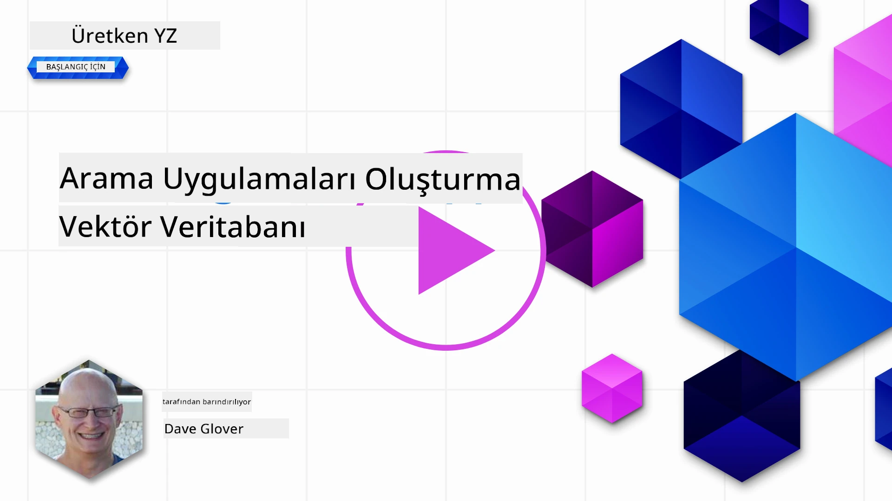
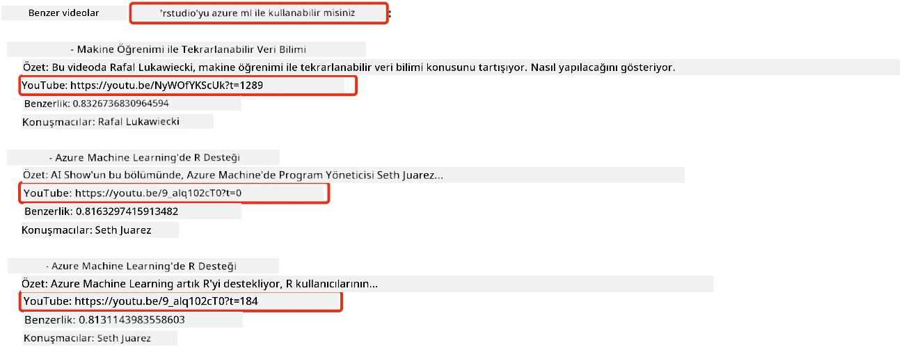
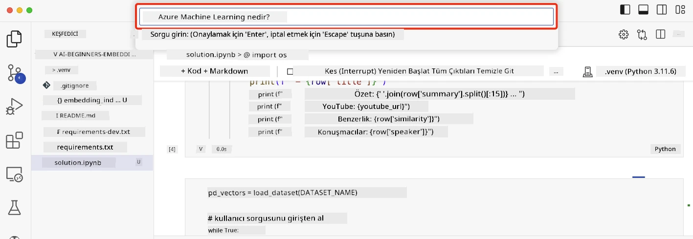

# Arama Uygulamaları Oluşturma

[](https://youtu.be/W0-nzXjOjr0?si=GcsqiTTvd7RKbo7V)

> > _Bu dersin videosunu izlemek için yukarıdaki görsele tıklayın_

Büyük Dil Modelleri sadece sohbet botları ve metin üretiminden ibaret değildir. Gömmeler (Embeddings) kullanarak arama uygulamaları oluşturmak da mümkündür. Gömmeler, verinin sayısal temsilleri yani vektörler olarak bilinir ve veri için anlamsal arama yapmakta kullanılabilir.

Bu derste, eğitim girişimimiz için bir arama uygulaması oluşturacaksınız. Girişimimiz, gelişmekte olan ülkelerdeki öğrencilere ücretsiz eğitim sağlayan kar amacı gütmeyen bir organizasyondur. Girişimimizin, öğrencilerin AI hakkında öğrenebilmesi için kullanabileceği çok sayıda YouTube videosu vardır. Girişimimiz, öğrencilerin bir soruyu yazarak YouTube videosu arayabileceği bir arama uygulaması oluşturmak istiyor.

Örneğin, bir öğrenci 'Jupyter Defterleri nedir?' veya 'Azure ML nedir?' gibi bir soru yazabilir ve arama uygulaması, soruyla ilgili YouTube videolarının bir listesini döndürecektir, dahası arama uygulaması videodaki sorunun cevabının bulunduğu yere doğrudan bir bağlantı da döndürecektir.

## Giriş

Bu derste şunları ele alacağız:

- Anlamsal ve Anahtar Kelime araması arasındaki farklar.
- Metin Gömme (Text Embeddings) nedir.
- Metin Gömmeleri İndeksi oluşturma.
- Metin Gömmeleri İndeksinde arama yapma.

## Öğrenme Hedefleri

Bu dersi tamamladıktan sonra şunları yapabileceksiniz:

- Anlamsal arama ile anahtar kelime araması arasındaki farkı söylemek.
- Metin Gömmeleri’nin ne olduğunu açıklamak.
- Gömmeleri kullanarak veri aramak için bir uygulama oluşturmak.

## Neden arama uygulaması yapmak gerekiyor?

Bir arama uygulaması oluşturmak, Gömmeleri kullanarak veri aramanın nasıl yapıldığını anlamanıza yardımcı olacaktır. Ayrıca öğrencilerin bilgiye hızlı erişim sağlayabilmesi için bir arama uygulaması geliştirmeyi öğreneceksiniz.

Ders, Microsoft [AI Show](https://www.youtube.com/playlist?list=PLlrxD0HtieHi0mwteKBOfEeOYf0LJU4O1) YouTube kanalının videolarına ait transkriptlerin Gömme İndeksini içermektedir. AI Show, yapay zeka ve makine öğrenimini öğreten bir YouTube kanalıdır. Gömme İndeksi, Ekim 2023’e kadar olan tüm YouTube transkriptleri için gömmeleri içerir. Bu Gömme İndeksini kullanarak girişimimiz için bir arama uygulaması oluşturacaksınız. Arama uygulaması, sorunun cevabının bulunduğu video içi noktaya bağlantı döndürecektir. Bu, öğrencilerin ihtiyaç duydukları bilgiyi hızlıca bulmaları için harika bir yöntemdir.

Aşağıda, 'rstudio'yu Azure ML ile kullanabilir misiniz?' sorusuna yönelik örnek bir anlamsal sorgu bulunmaktadır. YouTube URL’sine bakarsanız, URL’nin sorunun cevabının bulunduğu video bölümüne götüren bir zaman damgası içerdiğini göreceksiniz.



## Anlamsal arama nedir?

Şimdi, anlamsal arama nedir diye merak ediyor olabilirsiniz. Anlamsal arama, sorgudaki kelimelerin anlamını kullanarak ilgili sonuçları döndüren bir arama tekniğidir.

İşte bir anlamsal arama örneği. Diyelim ki araba almak istiyorsunuz, 'hayalimdeki araba' diye arayabilirsiniz, anlamsal arama burada `rüya` kelimesinin gerçek anlamını değil, sizin `ideal` arabanızı bulmaya çalıştığınızı anlar. Anlamsal arama niyetinizi anlar ve ilgili sonuçları gösterir. Alternatifi olan `anahtar kelime araması` ise kelimesi kelimesine 'araba hayalleri'ni arar ve genellikle alakasız sonuçlar döner.

## Metin Gömmeleri nedir?

[Metin gömmeleri](https://en.wikipedia.org/wiki/Word_embedding?WT.mc_id=academic-105485-koreyst), [doğal dil işleme](https://en.wikipedia.org/wiki/Natural_language_processing?WT.mc_id=academic-105485-koreyst) alanında kullanılan bir metin temsil teknikleridir. Metin gömmeleri, metnin anlamsal sayısal temsilleridir. Gömmeler, veriyi makinenin kolayca anlayabileceği şekilde temsil etmekte kullanılır. Metin gömmeleri oluşturmak için birçok model vardır; bu derste OpenAI Gömme Modeli kullanarak gömme oluşturma üzerine yoğunlaşacağız.

İşte bir örnek, AI Show YouTube kanalının bölümlerinden birinin transkriptinde aşağıdaki metin olduğunu hayal edin:

```text
Today we are going to learn about Azure Machine Learning.
```

Metni OpenAI Gömme API'sine gönderirsek, 1536 sayıdan oluşan yani bir vektör olan aşağıdaki gömmeyi döndürür. Vektördeki her sayı metnin farklı bir yönünü temsil eder. Kısalık açısından, vektörün ilk 10 sayısı şunlardır.

```python
[-0.006655829958617687, 0.0026128944009542465, 0.008792596869170666, -0.02446001023054123, -0.008540431968867779, 0.022071078419685364, -0.010703742504119873, 0.003311325330287218, -0.011632772162556648, -0.02187200076878071, ...]
```

## Gömme indeksi nasıl oluşturulur?

Bu ders için Gömme indeksi bir dizi Python betiği ile oluşturuldu. Betikler ve talimatları, bu dersin 'scripts' klasöründeki [README](./scripts/README.md?WT.mc_id=academic-105485-koreyst) dosyasında bulabilirsiniz. Bu dersi tamamlamak için bu betikleri çalıştırmanıza gerek yoktur, çünkü Gömme İndeksi size sunulmuştur.

Betikler şu işlemleri gerçekleştirir:

1. [AI Show](https://www.youtube.com/playlist?list=PLlrxD0HtieHi0mwteKBOfEeOYf0LJU4O1) oynatma listesinde yer alan her YouTube videosunun transkripti indirilir.
2. [OpenAI Fonksiyonları](https://learn.microsoft.com/azure/ai-foundry/openai/how-to/function-calling?WT.mc_id=academic-105485-koreyst) kullanılarak, YouTube transkriptinin ilk 3 dakikasından konuşmacı ismi çıkarılmaya çalışılır. Her video için konuşmacı ismi `embedding_index_3m.json` adlı Gömme İndeksine kaydedilir.
3. Transkript metni daha sonra **3 dakikalık metin segmentlerine** bölünür. Segment, üst üste binen yaklaşık 20 kelime içerir, böylece segmentin gömmesi eksik olmaz ve daha iyi arama bağlamı sağlanır.
4. Her metin segmenti OpenAI Chat API'sine özetlenmek üzere iletilir; metin 60 kelimeye özetlenir ve bu özet de `embedding_index_3m.json` adlı Gömme İndeksine kaydedilir.
5. Son olarak, segment metni OpenAI Gömme API'sine gönderilir. Gömme API'si segmentin anlamsal anlamını temsil eden 1536 sayıdan oluşan bir vektör döndürür. Segment ve OpenAI Gömme vektörü birlikte `embedding_index_3m.json` adlı Gömme İndeksine kaydedilir.

### Vektör Veritabanları

Dersin basitliği açısından, Gömme İndeksi `embedding_index_3m.json` adlı JSON dosyasında saklanıp Pandas DataFrame'e yüklenir. Ancak, üretimde, Gömme İndeksi [Azure Cognitive Search](https://learn.microsoft.com/training/modules/improve-search-results-vector-search?WT.mc_id=academic-105485-koreyst), [Redis](https://cookbook.openai.com/examples/vector_databases/redis/readme?WT.mc_id=academic-105485-koreyst), [Pinecone](https://cookbook.openai.com/examples/vector_databases/pinecone/readme?WT.mc_id=academic-105485-koreyst), [Weaviate](https://cookbook.openai.com/examples/vector_databases/weaviate/readme?WT.mc_id=academic-105485-koreyst) gibi bir vektör veritabanında saklanır.

## Kosinüs benzerliği kavramı

Metin gömmelerini öğrendik, şimdi veride arama yapmak ve özellikle verilen bir sorguya en benzer gömmeleri bulmak için kosinüs benzerliğini nasıl kullanacağımızı öğreneceğiz.

### Kosinüs benzerliği nedir?

Kosinüs benzerliği, iki vektör arasındaki benzerliği ölçen bir yöntemdir, buna `en yakın komşu araması` da denir. Kosinüs benzerliği araması yapmak için, OpenAI Gömme API'sini kullanarak _sorgu_ metni için bir vektör oluşturmalısınız. Sonra sorgu vektörü ile Gömme İndeksindeki her vektör arasındaki _kosinüs benzerliği_ hesaplanır. Unutmayın, Gömme İndeksinde her YouTube transkript metin segmenti için bir vektör vardır. Son olarak sonuçlar kosinüs benzerliğine göre sıralanır ve en yüksek benzerliğe sahip metin segmentleri sorguya en benzer olanlardır.

Matematiksel açıdan, kosinüs benzerliği, çok boyutlu bir uzayda iki vektörün arasındaki açının kosinüsünü ölçer. Bu ölçüm faydalıdır, çünkü iki belge Öklid uzaklığına göre çok uzakta olsa da (örneğin boyut farkı nedeniyle) aralarında daha küçük bir açı olabilir ve bu nedenle daha yüksek kosinüs benzerliği elde edilir. Kosinüs benzerliği denklemleri hakkında daha fazla bilgi için [Cosine similarity](https://en.wikipedia.org/wiki/Cosine_similarity?WT.mc_id=academic-105485-koreyst) sayfasını ziyaret edin.

## İlk arama uygulamanızı oluşturma

Şimdi, Gömmeleri kullanarak bir arama uygulaması oluşturmaya başlayacağız. Arama uygulaması, öğrencilerin sorularını yazarak video araması yapmasına olanak tanıyacak. Arama uygulaması, soruyla ilgili videoların listesini döndürecek. Ayrıca sorunun cevabının bulunduğu video bölümünün bağlantısı da döndürülecek.

Bu çözüm, Windows 11, macOS ve Ubuntu 22.04 üzerinde Python 3.10 veya daha sonraki sürümleri kullanılarak oluşturulmuş ve test edilmiştir. Python’u [python.org](https://www.python.org/downloads/?WT.mc_id=academic-105485-koreyst) üzerinden indirebilirsiniz.

## Ödev – Öğrenciler için arama uygulaması oluşturma

Bu dersin başında girişimimizi tanıttık. Şimdi öğrencilere kendi değerlendirmeleri için arama uygulaması oluşturma imkanı vereceğiz.

Bu ödevde, arama uygulamasını oluşturmak için kullanılacak Azure OpenAI Hizmetlerini oluşturacaksınız. Aşağıdaki Azure OpenAI Hizmetlerini oluşturacaksınız. Bu ödevi tamamlamak için bir Azure aboneliğine ihtiyacınız olacak.

### Azure Cloud Shell’i başlatın

1. [Azure portalına](https://portal.azure.com/?WT.mc_id=academic-105485-koreyst) giriş yapın.
2. Azure portalının sağ üst köşesindeki Cloud Shell simgesini seçin.
3. Ortam türü olarak **Bash**'i seçin.

#### Bir kaynak grubu oluşturun

> Bu talimatlarda, Doğu ABD’de "semantic-video-search" adlı kaynak grubu kullanılmaktadır.
> Kaynak grubunun adını değiştirebilirsiniz, ancak kaynakların konumunu değiştirirken,
> [model kullanılabilirlik tablosunu](https://aka.ms/oai/models?WT.mc_id=academic-105485-koreyst) kontrol edin.

```shell
az group create --name semantic-video-search --location eastus
```

#### Bir Azure OpenAI Hizmeti kaynağı oluşturun

Azure Cloud Shell’den aşağıdaki komutu çalıştırarak bir Azure OpenAI Hizmeti kaynağı oluşturun.

```shell
az cognitiveservices account create --name semantic-video-openai --resource-group semantic-video-search \
    --location eastus --kind OpenAI --sku s0
```

#### Bu uygulamada kullanılmak üzere uç noktayı ve anahtarları alın

Azure Cloud Shell’den aşağıdaki komutları çalıştırarak Azure OpenAI Hizmeti kaynağı için uç noktayı ve anahtarları alın.

```shell
az cognitiveservices account show --name semantic-video-openai \
   --resource-group  semantic-video-search | jq -r .properties.endpoint
az cognitiveservices account keys list --name semantic-video-openai \
   --resource-group semantic-video-search | jq -r .key1
```

#### OpenAI Gömme modelini dağıtın

Azure Cloud Shell’den aşağıdaki komutu çalıştırarak OpenAI Gömme modelini dağıtın.

```shell
az cognitiveservices account deployment create \
    --name semantic-video-openai \
    --resource-group  semantic-video-search \
    --deployment-name text-embedding-ada-002 \
    --model-name text-embedding-ada-002 \
    --model-version "2"  \
    --model-format OpenAI \
    --sku-capacity 100 --sku-name "Standard"
```

## Çözüm

GitHub Codespaces’deki [çözüm not defterini](./python/aoai-solution.ipynb?WT.mc_id=academic-105485-koreyst) açın ve Jupyter Not Defterindeki talimatları izleyin.

Not defterini çalıştırdığınızda, sizden bir sorgu girmeniz istenecek. Girdi kutusu şöyle görünecek:



## Harika İş! Öğrenmeye Devam Edin

Bu dersi tamamladıktan sonra, [Üretken AI Öğrenme koleksiyonumuza](https://aka.ms/genai-collection?WT.mc_id=academic-105485-koreyst) göz atarak Üretken AI bilginizi geliştirmeye devam edin!

Ders 9'a geçin; burada [görüntü üretim uygulamaları oluşturmayı](../09-building-image-applications/README.md?WT.mc_id=academic-105485-koreyst) öğreneceğiz!

---

<!-- CO-OP TRANSLATOR DISCLAIMER START -->
**Feragatname**:
Bu belge, AI çeviri hizmeti [Co-op Translator](https://github.com/Azure/co-op-translator) kullanılarak çevrilmiştir. Doğruluk için çaba sarf etsek de, otomatik çevirilerin hata veya yanlışlık içerebileceğini lütfen unutmayınız. Orijinal belge, kendi dilinde yetkili kaynak olarak kabul edilmelidir. Kritik bilgiler için profesyonel insan çevirisi önerilir. Bu çevirinin kullanımı sonucu ortaya çıkabilecek yanlış anlamalardan veya yanlış yorumlamalardan sorumlu değiliz.
<!-- CO-OP TRANSLATOR DISCLAIMER END -->