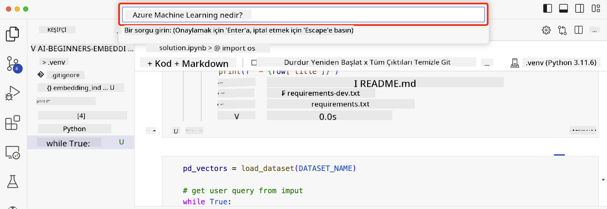

<!--
CO_OP_TRANSLATOR_METADATA:
{
  "original_hash": "58953c08b8ba7073b836d4270ea0fe86",
  "translation_date": "2025-10-17T16:16:36+00:00",
  "source_file": "08-building-search-applications/README.md",
  "language_code": "tr"
}
-->
# Arama Uygulamaları Oluşturma

[](https://youtu.be/W0-nzXjOjr0?si=GcsqiTTvd7RKbo7V)

> > _Bu dersin videosunu izlemek için yukarıdaki görsele tıklayın_

Büyük Dil Modelleri (LLM'ler) sadece sohbet botları ve metin üretiminden ibaret değildir. Gömülü temsiller (Embeddings) kullanarak arama uygulamaları oluşturmak da mümkündür. Gömülü temsiller, vektörler olarak da bilinen verilerin sayısal temsilleridir ve veriler için anlamsal arama yapmak amacıyla kullanılabilir.

Bu derste, eğitim alanında faaliyet gösteren bir girişim için bir arama uygulaması oluşturacaksınız. Girişimimiz, gelişmekte olan ülkelerdeki öğrencilere ücretsiz eğitim sağlayan kar amacı gütmeyen bir organizasyondur. Girişimimizin, öğrencilerin yapay zeka hakkında bilgi edinmek için kullanabileceği çok sayıda YouTube videosu bulunmaktadır. Girişimimiz, öğrencilerin bir soru yazarak YouTube videosu aramasına olanak tanıyan bir arama uygulaması oluşturmak istiyor.

Örneğin, bir öğrenci 'Jupyter Notebooks nedir?' veya 'Azure ML nedir?' gibi bir soru yazabilir ve arama uygulaması, soruyla ilgili YouTube videolarının bir listesini döndürebilir. Daha da iyisi, arama uygulaması, sorunun cevabının bulunduğu videodaki yere bir bağlantı döndürecektir.

## Giriş

Bu derste şunları ele alacağız:

- Anlamsal arama ve Anahtar Kelime araması arasındaki farklar.
- Metin Gömülü Temsilleri nedir?
- Metin Gömülü Temsilleri İndeksi oluşturma.
- Metin Gömülü Temsilleri İndeksinde arama yapma.

## Öğrenme Hedefleri

Bu dersi tamamladıktan sonra:

- Anlamsal arama ile anahtar kelime araması arasındaki farkı ayırt edebileceksiniz.
- Metin Gömülü Temsillerinin ne olduğunu açıklayabileceksiniz.
- Verileri aramak için Gömülü Temsiller kullanan bir uygulama oluşturabileceksiniz.

## Neden bir arama uygulaması oluşturmalıyız?

Bir arama uygulaması oluşturmak, Gömülü Temsilleri kullanarak veri aramayı nasıl yapacağınızı anlamanıza yardımcı olacaktır. Ayrıca, öğrencilerin bilgiyi hızlı bir şekilde bulmalarına yardımcı olabilecek bir arama uygulaması oluşturmayı öğreneceksiniz.

Ders, Microsoft [AI Show](https://www.youtube.com/playlist?list=PLlrxD0HtieHi0mwteKBOfEeOYf0LJU4O1) YouTube kanalındaki YouTube transkriptlerinin bir Gömülü Temsiller İndeksini içermektedir. AI Show, yapay zeka ve makine öğrenimi hakkında bilgi veren bir YouTube kanalıdır. Gömülü Temsiller İndeksi, Ekim 2023'e kadar olan her bir YouTube transkriptinin gömülü temsillerini içerir. Girişimimiz için bir arama uygulaması oluşturmak için Gömülü Temsiller İndeksini kullanacaksınız. Arama uygulaması, sorunun cevabının bulunduğu videodaki yere bir bağlantı döndürecektir. Bu, öğrencilerin ihtiyaç duydukları bilgiyi hızlı bir şekilde bulmaları için harika bir yöntemdir.

Aşağıda 'Azure ML ile rstudio kullanabilir misiniz?' sorusu için bir anlamsal sorgu örneği verilmiştir. YouTube URL'sine göz atın, URL'nin sorunun cevabının bulunduğu videodaki bir zaman damgasını içerdiğini göreceksiniz.


## Anlamsal arama nedir?

Şimdi, anlamsal aramanın ne olduğunu merak ediyor olabilirsiniz. Anlamsal arama, bir sorgudaki kelimelerin anlamını kullanarak ilgili sonuçları döndüren bir arama tekniğidir.

İşte bir anlamsal arama örneği. Diyelim ki bir araba satın almak istiyorsunuz, 'hayalimdeki araba' diye arama yapabilirsiniz. Anlamsal arama, bir araba hakkında `hayal kurmadığınızı`, aksine `ideal` bir araba satın almak istediğinizi anlar. Anlamsal arama niyetinizi anlar ve ilgili sonuçları döndürür. Alternatif olarak, `anahtar kelime araması` kelimenin tam anlamıyla arabalar hakkında hayalleri arar ve genellikle alakasız sonuçlar döndürür.

## Metin Gömülü Temsilleri nedir?

[Metin gömülü temsilleri](https://en.wikipedia.org/wiki/Word_embedding?WT.mc_id=academic-105485-koreyst), [doğal dil işleme](https://en.wikipedia.org/wiki/Natural_language_processing?WT.mc_id=academic-105485-koreyst) alanında kullanılan bir metin temsil tekniğidir. Metin gömülü temsilleri, metnin anlamsal sayısal temsilleridir. Gömülü temsiller, verileri bir makinenin kolayca anlayabileceği bir şekilde temsil etmek için kullanılır. Metin gömülü temsilleri oluşturmak için birçok model bulunmaktadır, bu derste OpenAI Gömülü Temsil Modeli kullanılarak gömülü temsiller oluşturulmasına odaklanacağız.

İşte bir örnek, AI Show YouTube kanalındaki bölümlerden birinin transkriptinde aşağıdaki metnin yer aldığını hayal edin:

```text
Today we are going to learn about Azure Machine Learning.
```

Metni OpenAI Gömülü Temsil API'sine göndeririz ve API, 1536 sayıdan oluşan bir gömülü temsil (vektör) döndürür. Vektördeki her bir sayı, metnin farklı bir yönünü temsil eder. Kısalık açısından, vektördeki ilk 10 sayı aşağıda verilmiştir.

```python
[-0.006655829958617687, 0.0026128944009542465, 0.008792596869170666, -0.02446001023054123, -0.008540431968867779, 0.022071078419685364, -0.010703742504119873, 0.003311325330287218, -0.011632772162556648, -0.02187200076878071, ...]
```

## Gömülü Temsil İndeksi nasıl oluşturulur?

Bu ders için Gömülü Temsil İndeksi bir dizi Python betiği ile oluşturulmuştur. Betikleri ve talimatları, bu dersin 'scripts' klasöründeki [README](./scripts/README.md?WT.mc_id=academic-105485-koreyst) dosyasında bulabilirsiniz. Bu dersi tamamlamak için bu betikleri çalıştırmanız gerekmiyor çünkü Gömülü Temsil İndeksi size sağlanmıştır.

Betikler şu işlemleri gerçekleştirir:

1. [AI Show](https://www.youtube.com/playlist?list=PLlrxD0HtieHi0mwteKBOfEeOYf0LJU4O1) oynatma listesindeki her bir YouTube videosunun transkripti indirilir.
2. [OpenAI Fonksiyonları](https://learn.microsoft.com/azure/ai-services/openai/how-to/function-calling?WT.mc_id=academic-105485-koreyst) kullanılarak, YouTube transkriptinin ilk 3 dakikasından konuşmacı adı çıkarılmaya çalışılır. Her video için konuşmacı adı `embedding_index_3m.json` adlı Gömülü Temsil İndeksinde saklanır.
3. Transkript metni **3 dakikalık metin segmentlerine** bölünür. Segment, bir sonraki segmentten yaklaşık 20 kelimeyi içerecek şekilde üst üste gelir, böylece segmentin gömülü temsili kesilmez ve daha iyi bir arama bağlamı sağlanır.
4. Her bir metin segmenti, OpenAI Chat API'ye gönderilerek metin 60 kelimeye özetlenir. Özet, `embedding_index_3m.json` adlı Gömülü Temsil İndeksinde saklanır.
5. Son olarak, segment metni OpenAI Gömülü Temsil API'sine gönderilir. Gömülü Temsil API'si, segmentin anlamsal anlamını temsil eden 1536 sayıdan oluşan bir vektör döndürür. Segment ve OpenAI Gömülü Temsil vektörü, `embedding_index_3m.json` adlı Gömülü Temsil İndeksinde saklanır.

### Vektör Veritabanları

Dersin basitliği için Gömülü Temsil İndeksi, `embedding_index_3m.json` adlı bir JSON dosyasında saklanır ve bir Pandas DataFrame'e yüklenir. Ancak, üretim ortamında Gömülü Temsil İndeksi [Azure Cognitive Search](https://learn.microsoft.com/training/modules/improve-search-results-vector-search?WT.mc_id=academic-105485-koreyst), [Redis](https://cookbook.openai.com/examples/vector_databases/redis/readme?WT.mc_id=academic-105485-koreyst), [Pinecone](https://cookbook.openai.com/examples/vector_databases/pinecone/readme?WT.mc_id=academic-105485-koreyst), [Weaviate](https://cookbook.openai.com/examples/vector_databases/weaviate/readme?WT.mc_id=academic-105485-koreyst) gibi bir vektör veritabanında saklanabilir.

## Kosinüs Benzerliğini Anlama

Metin gömülü temsilleri hakkında bilgi edindik, bir sonraki adım metin gömülü temsillerini kullanarak veri arama ve özellikle bir sorguya en benzer gömülü temsilleri kosinüs benzerliği kullanarak bulmayı öğrenmektir.

### Kosinüs Benzerliği nedir?

Kosinüs benzerliği, iki vektör arasındaki benzerliği ölçen bir metriktir, bu aynı zamanda `en yakın komşu arama` olarak da adlandırılır. Kosinüs benzerliği araması yapmak için OpenAI Gömülü Temsil API'sini kullanarak _sorgu_ metnini _vektörleştirmek_ gerekir. Daha sonra sorgu vektörü ile Gömülü Temsil İndeksindeki her bir vektör arasındaki _kosinüs benzerliği_ hesaplanır. Unutmayın, Gömülü Temsil İndeksi, her bir YouTube transkript metin segmenti için bir vektöre sahiptir. Son olarak, sonuçlar kosinüs benzerliğine göre sıralanır ve en yüksek kosinüs benzerliğine sahip metin segmentleri sorguya en benzer olanlardır.

Matematiksel açıdan, kosinüs benzerliği, çok boyutlu bir uzayda iki vektör arasındaki açının kosinüsünü ölçer. Bu ölçüm faydalıdır çünkü iki belge boyut nedeniyle Öklid mesafesiyle birbirinden uzak olsa bile, aralarındaki açı daha küçük olabilir ve dolayısıyla daha yüksek bir kosinüs benzerliği gösterebilir. Kosinüs benzerliği denklemleri hakkında daha fazla bilgi için [Kosinüs benzerliği](https://en.wikipedia.org/wiki/Cosine_similarity?WT.mc_id=academic-105485-koreyst) sayfasına bakabilirsiniz.

## İlk arama uygulamanızı oluşturma

Şimdi, Gömülü Temsilleri kullanarak bir arama uygulaması oluşturmayı öğreneceğiz. Arama uygulaması, öğrencilerin bir soru yazarak bir video aramasına olanak tanıyacaktır. Arama uygulaması, soruyla ilgili videoların bir listesini döndürecektir. Ayrıca, arama uygulaması, sorunun cevabının bulunduğu videodaki yere bir bağlantı döndürecektir.

Bu çözüm, Windows 11, macOS ve Ubuntu 22.04 üzerinde Python 3.10 veya daha yeni bir sürüm kullanılarak oluşturulmuş ve test edilmiştir. Python'u [python.org](https://www.python.org/downloads/?WT.mc_id=academic-105485-koreyst) adresinden indirebilirsiniz.

## Ödev - Öğrencilerin arama uygulaması oluşturmasını sağlama

Bu dersin başında girişimimizi tanıttık. Şimdi öğrencilerin değerlendirmeleri için bir arama uygulaması oluşturmalarını sağlama zamanı.

Bu ödevde, arama uygulamasını oluşturmak için kullanılacak Azure OpenAI Hizmetlerini oluşturacaksınız. Aşağıdaki Azure OpenAI Hizmetlerini oluşturacaksınız. Bu ödevi tamamlamak için bir Azure aboneliğine ihtiyacınız olacak.

### Azure Cloud Shell'i başlatma

1. [Azure portalına](https://portal.azure.com/?WT.mc_id=academic-105485-koreyst) giriş yapın.
2. Azure portalının sağ üst köşesindeki Cloud Shell simgesini seçin.
3. Ortam türü olarak **Bash**'i seçin.

#### Bir kaynak grubu oluşturma

> Bu talimatlar için, East US bölgesinde "semantic-video-search" adlı kaynak grubunu kullanıyoruz.
> Kaynak grubunun adını değiştirebilirsiniz, ancak kaynakların konumunu değiştirirken,
> [model kullanılabilirlik tablosunu](https://aka.ms/oai/models?WT.mc_id=academic-105485-koreyst) kontrol edin.

```shell
az group create --name semantic-video-search --location eastus
```

#### Azure OpenAI Hizmeti kaynağı oluşturma

Azure Cloud Shell'den aşağıdaki komutu çalıştırarak bir Azure OpenAI Hizmeti kaynağı oluşturun.

```shell
az cognitiveservices account create --name semantic-video-openai --resource-group semantic-video-search \
    --location eastus --kind OpenAI --sku s0
```

#### Bu uygulamada kullanım için uç nokta ve anahtarları alma

Azure Cloud Shell'den aşağıdaki komutları çalıştırarak Azure OpenAI Hizmeti kaynağı için uç nokta ve anahtarları alın.

```shell
az cognitiveservices account show --name semantic-video-openai \
   --resource-group  semantic-video-search | jq -r .properties.endpoint
az cognitiveservices account keys list --name semantic-video-openai \
   --resource-group semantic-video-search | jq -r .key1
```

#### OpenAI Gömülü Temsil modelini dağıtma

Azure Cloud Shell'den aşağıdaki komutu çalıştırarak OpenAI Gömülü Temsil modelini dağıtın.

```shell
az cognitiveservices account deployment create \
    --name semantic-video-openai \
    --resource-group  semantic-video-search \
    --deployment-name text-embedding-ada-002 \
    --model-name text-embedding-ada-002 \
    --model-version "2"  \
    --model-format OpenAI \
    --sku-capacity 100 --sku-name "Standard"
```

## Çözüm

GitHub Codespaces'te [çözüm not defterini](./python/aoai-solution.ipynb?WT.mc_id=academic-105485-koreyst) açın ve Jupyter Notebook'taki talimatları takip edin.

Not defterini çalıştırdığınızda, bir sorgu girmeniz istenecektir. Giriş kutusu şu şekilde görünecektir:



## Harika İş! Öğrenmeye Devam Edin

Bu dersi tamamladıktan sonra, Generatif AI bilginizi geliştirmek için [Generatif AI Öğrenme koleksiyonumuza](https://aka.ms/genai-collection?WT.mc_id=academic-105485-koreyst) göz atın!

9. Derse geçin, burada [görüntü oluşturma uygulamaları](../09-building-image-applications/README.md?WT.mc_id=academic-105485-koreyst) nasıl oluşturulur inceleyeceğiz!

---

**Feragatname**:  
Bu belge, AI çeviri hizmeti [Co-op Translator](https://github.com/Azure/co-op-translator) kullanılarak çevrilmiştir. Doğruluk için çaba göstersek de, otomatik çeviriler hata veya yanlışlıklar içerebilir. Belgenin orijinal dili, yetkili kaynak olarak kabul edilmelidir. Kritik bilgiler için profesyonel insan çevirisi önerilir. Bu çevirinin kullanımından kaynaklanan yanlış anlamalar veya yanlış yorumlamalardan sorumlu değiliz.