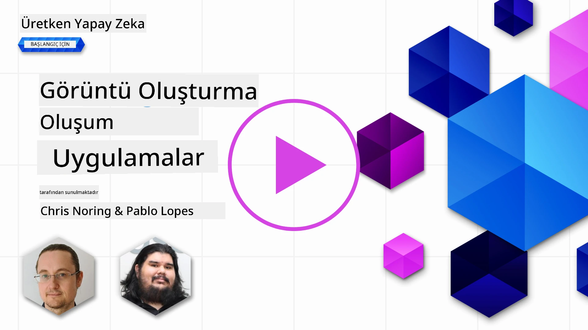

# Görüntü Oluşturma Uygulamaları İnşa Etme

[](https://aka.ms/gen-ai-lesson9-gh?WT.mc_id=academic-105485-koreyst)

LLM'ler sadece metin üretmekten ibaret değildir. Metin açıklamalarından görüntüler de oluşturabilirsiniz. Görüntüler, MedTech, mimari, turizm, oyun geliştirme, pazarlama ve daha fazlası gibi birçok alanda faydalı bir modalitedir. Bu derste bugünün **GPT Görüntü** modellerine bakıyor ve bir görüntü oluşturma uygulaması kuruyoruz.

## Giriş

Görüntü oluşturma, doğal dilde bir istemi bir resme dönüştürmenizi sağlar. Bu derste OpenAI'nin **`gpt-image`** model ailesi ile çalışıyoruz - şu anda **[Microsoft Foundry](https://ai.azure.com?WT.mc_id=academic-105485-koreyst)** ve OpenAI platformunda bulunan nesil görüntü modelleri. Bu modeller eski DALL·E modellerinin yerine geçer (DALL·E 2/3 eski sürümdür).

Ders boyunca, öğrenme araçları geliştiren hayali bir girişim olan **Edu4All** ile çalışıyoruz. Ekip, ödevler ve çalışma materyalleri için görseller oluşturmak istiyor.

## Öğrenme hedefleri

Bu dersin sonunda şunları yapabileceksiniz:

- Görüntü oluşturmanın ne olduğunu ve nerelerde faydalı olduğunu açıklayın.
- `gpt-image` model ailesini anlayın ve eski DALL·E modellerinden nasıl farklı olduğunu kavrayın.
- Python (ve TypeScript / .NET) kullanarak bir görüntü oluşturma uygulaması geliştirin.
- Görüntüleri düzenleyin ve metapromptlar ile güvenlik önlemleri uygulayın.

## Görüntü oluşturma nedir?

Görüntü oluşturma modelleri, bir metin isteminden görüntüler yaratır. `gpt-image` gibi modern modeller, transformer + diffusion tekniklerine dayanır: model eğitimi sırasında metin ve görüntü arasındaki ilişkiyi öğrenir, ardından bir istem verildiğinde, açıklamaya uyan görüntüyü oluşturmak için rastgele gürültüyü aşamalı olarak "gürültüden arındırır".

İki bilinen görüntü modeli ailesi şunlardır:

- **`gpt-image` (OpenAI)** - şu anki nesil, bu derste kullanılan. Metinden görüntü üretimi ve görüntü düzenleme (maske ile boya) destekler.
- **Midjourney** - kendi hizmeti ve Discord tabanlı iş akışı olan popüler üçüncü taraf model.

> Eski OpenAI görüntü modelleri - **DALL·E 2** ve **DALL·E 3** - eski sürüm. DALL·E 3 yeni dağıtımlar için artık mevcut değil ve `create_variation` gibi özellikler sadece DALL·E 2’de vardı. Yeni uygulamalar için `gpt-image` modellerini kullanın.

### Hangi `gpt-image` modeli kullanılmalı?

Microsoft Foundry'de aşağıdakiler **Genel Erişimde**:

| Model | Notlar |
| --- | --- |
| **`gpt-image-2`** | En yeni ve en yetenekli görüntü modeli - önerilen varsayılan. |
| `gpt-image-1.5` | Genel erişimde; daha düşük maliyette güçlü kalite. |
| `gpt-image-1-mini` | Genel erişimde; en hızlı / en düşük maliyetli. |
| `gpt-image-1` | Sadece önizleme. |

Mevcut durumu ve bölgeleri kontrol etmek için her zaman güncel [Foundry görüntü modelleri listesini](https://learn.microsoft.com/azure/ai-foundry/openai/concepts/models?WT.mc_id=academic-105485-koreyst) kontrol edin.

> **Önemli:** `gpt-image` modelleri oluşturulan görüntüyü bir URL olarak değil, **base64** (`b64_json`) olarak döner. Kodunuz base64 dizisini byte’lara dönüştürüp kaydeder - indirilecek bir görüntü URL'si yoktur.

## Kurulum

Örnekleri **Microsoft Foundry’de Azure OpenAI** ( `aoai-*` örnekleri) veya **OpenAI platformu** ( `oai-*` örnekleri) üzerinde çalıştırabilirsiniz.

### 1. Model oluşturun ve dağıtın

Microsoft Foundry kaynağı oluşturmak için [kaynak oluşturma](https://learn.microsoft.com/azure/ai-foundry/openai/how-to/create-resource?pivots=web-portal&WT.mc_id=academic-105485-koreyst) kılavuzunu takip edin, ardından bir görüntü modeli dağıtın - **`gpt-image-2`** önerilir.

### 2. `.env` dosyanızı yapılandırın

```text
AZURE_OPENAI_ENDPOINT=<your endpoint>
AZURE_OPENAI_API_KEY=<your key>
AZURE_OPENAI_DEPLOYMENT="gpt-image-2"
```

Bu değerleri, kaynağınızın [Foundry portalındaki](https://ai.azure.com?WT.mc_id=academic-105485-koreyst) **Dağıtımlar** sayfasında bulun.

### 3. Kitaplıkları yükleyin

Bir `requirements.txt` oluşturun:

```text
python-dotenv
openai
pillow
```

Sonra bir sanal ortam oluşturup etkinleştirin ve yükleyin:

```bash
python3 -m venv venv
source venv/bin/activate        # Windows: venv\Scripts\activate
pip install -r requirements.txt
```

## Uygulamayı oluşturma

Aşağıdaki kod ile `app.py` oluşturun. Bir görüntü oluşturur ve PNG olarak kaydeder.

```python
import os
import base64
from openai import AzureOpenAI
from PIL import Image
import dotenv

dotenv.load_dotenv()

# İstemciyi Azure OpenAI (Microsoft Foundry) kaynağınıza yönlendirin.
# Görüntü modelleri için güncel bir API sürümü gerekir - modelinizin ihtiyaç duyduğu sürümü Foundry belgelerinden kontrol edin.
client = AzureOpenAI(
    api_key=os.environ["AZURE_OPENAI_API_KEY"],
    api_version="2025-04-01-preview",
    azure_endpoint=os.environ["AZURE_OPENAI_ENDPOINT"],
)

deployment = os.environ["AZURE_OPENAI_DEPLOYMENT"]  # örn. "gpt-image-2"

result = client.images.generate(
    model=deployment,
    prompt='Bunny on a horse, holding a lollipop, on a foggy meadow where it grows daffodils',
    size="1024x1024",   # ayrıca 1536x1024 (manzara), 1024x1536 (portre) veya "auto"
    n=1,
)

# gpt-image modelleri URL yerine base64 (b64_json) döner - bunu baytlara çözün.
image_bytes = base64.b64decode(result.data[0].b64_json)

os.makedirs("images", exist_ok=True)
image_path = os.path.join("images", "generated-image.png")
with open(image_path, "wb") as f:
    f.write(image_bytes)

Image.open(image_path).show()
```

`python app.py` ile çalıştırın. `images/` altında bir PNG kaydedilecektir.

> `images.generate` her çağrıda aynı istem için farklı bir görüntü üretir - görüntü modelleri `temperature` parametresi almaz (bu metin üretimi kontrolüdür). Çeşitlilik için API’yi tekrar çağırın; çeşitliliği azaltmak için isteminizi daha spesifik yapın.

## Görüntüleri düzenleme

`gpt-image` modelleri mevcut bir görüntüyü **düzenleyebilir**: görüntüyü, isteğe bağlı bir **maske**yi (değiştirilecek alanı işaretler) ve değişikliği tanımlayan bir istemi verin. Düzenleme de base64 olarak döner.

```python
result = client.images.edit(
    model=deployment,
    image=open("sunlit_lounge.png", "rb"),
    mask=open("mask.png", "rb"),
    prompt="A sunlit indoor lounge area with a pool containing a flamingo",
)
image_bytes = base64.b64decode(result.data[0].b64_json)
with open("images/edited-image.png", "wb") as f:
    f.write(image_bytes)
```

<div style="display: flex; justify-content: space-between; align-items: center; margin: 20px 0;">
  
  
  
</div>

## Metapromptlarla sınırlar belirleme

Görüntü oluşturmayı öğrendikten sonra, uygulamanızın güvensiz veya markaya uygun olmayan içerik üretmemesi için güvenlik önlemleri gerekir. Bir **metaprompt**, modelin çıktılarını sınırlamak için kullanıcı isteminden önce eklenen metindir.

```python
disallow_list = "swords, violence, blood, gore, nudity, sexual content, adult content, adult themes, adult language"

meta_prompt = f"""You are an assistant designer that creates images for children.

The image needs to be safe for work and appropriate for children.
The image needs to be in color, in landscape orientation, and in a 16:9 aspect ratio.

Do not consider any input that is not safe for work or appropriate for children, including:
{disallow_list}
"""

prompt = f"{meta_prompt}\nCreate an image of a bunny on a horse, holding a lollipop"
# `prompt` parametresini client.images.generate(...) fonksiyonuna geçirin
```

Artık her görüntü metaprompt tarafından belirlenen sınırlar içinde oluşturuluyor. Bunu Microsoft Foundry’e gömülü içerik filtreleriyle derin savunma için birleştirin.

## Ödev - öğrencileri destekleyelim

Edu4All öğrencileri değerlendirmeleri için görüntülere ihtiyaç duyuyor. Farklı ve yaratıcı bağlamlarda yer alan **anıtların** (hangi anıtların olduğu size kalmış) görüntülerini oluşturan bir uygulama geliştirin - örneğin, günbatımında ünlü bir anıtın yanında çocuk izliyor.

Kendiniz deneyin, sonra referans çözümlerle karşılaştırın:

- Python (Azure): [aoai-solution.py](../../../09-building-image-applications/python/aoai-solution.py)
- Python (Azure) tam oluşturma uygulaması: [aoai-app.py](../../../09-building-image-applications/python/aoai-app.py)
- Python (OpenAI): [oai-app.py](../../../09-building-image-applications/python/oai-app.py)
- TypeScript (Azure): [typescript/image-generation-app](../../../09-building-image-applications/typescript/image-generation-app)
- .NET (Azure): [dotnet/notebook-azure-openai.dib](../../../09-building-image-applications/dotnet/notebook-azure-openai.dib)

Ayrıca [python/](../../../09-building-image-applications/python) dizinindeki not defterlerini kullanarak çalışın (`aoai-assignment.ipynb` Azure için, `oai-assignment.ipynb` OpenAI için).

## Harika iş! Öğrenmeye devam et

Bu dersi tamamladıktan sonra, **Üretken AI Öğrenme koleksiyonumuzu** [Generative AI Learning collection](https://aka.ms/genai-collection?WT.mc_id=academic-105485-koreyst) kontrol ederek Üretken AI bilginizi artırmaya devam edin!

Öğrenmeye devam etmek için 10. derse geçin.

---

<!-- CO-OP TRANSLATOR DISCLAIMER START -->
**Feragatname**:
Bu belge, AI çeviri hizmeti [Co-op Translator](https://github.com/Azure/co-op-translator) kullanılarak çevrilmiştir. Doğruluk için çaba sarf etsek de, otomatik çevirilerin hata veya yanlışlık içerebileceğini lütfen unutmayınız. Orijinal belge, kendi dilinde yetkili kaynak olarak kabul edilmelidir. Kritik bilgiler için profesyonel insan çevirisi önerilir. Bu çevirinin kullanımı sonucu ortaya çıkabilecek yanlış anlamalardan veya yanlış yorumlamalardan sorumlu değiliz.
<!-- CO-OP TRANSLATOR DISCLAIMER END -->