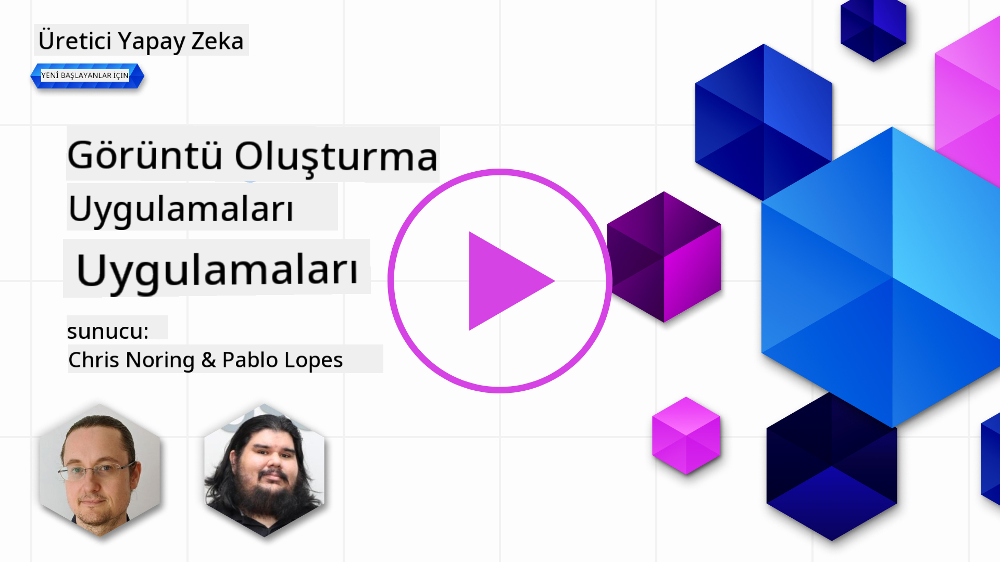

<!--
CO_OP_TRANSLATOR_METADATA:
{
  "original_hash": "1a7fd0f95f9eb673b79da47c0814f4d4",
  "translation_date": "2025-07-09T13:25:12+00:00",
  "source_file": "09-building-image-applications/README.md",
  "language_code": "tr"
}
-->
# Görüntü Üretim Uygulamaları Geliştirme

[](https://aka.ms/gen-ai-lesson9-gh?WT.mc_id=academic-105485-koreyst)

LLM’ler sadece metin üretmekle kalmaz. Metin açıklamalarından görüntü üretmek de mümkündür. Görüntülerin bir modalite olarak kullanılması, MedTech, mimarlık, turizm, oyun geliştirme ve daha birçok alanda oldukça faydalı olabilir. Bu bölümde, en popüler iki görüntü üretim modeli olan DALL-E ve Midjourney’e göz atacağız.

## Giriş

Bu derste şunları ele alacağız:

- Görüntü üretimi ve neden faydalı olduğu.
- DALL-E ve Midjourney nedir, nasıl çalışırlar.
- Bir görüntü üretim uygulaması nasıl geliştirilir.

## Öğrenme Hedefleri

Bu dersi tamamladıktan sonra şunları yapabileceksiniz:

- Bir görüntü üretim uygulaması geliştirmek.
- Meta promptlarla uygulamanız için sınırlar belirlemek.
- DALL-E ve Midjourney ile çalışmak.

## Neden görüntü üretim uygulaması geliştirmeli?

Görüntü üretim uygulamaları, Üretken Yapay Zeka’nın yeteneklerini keşfetmek için harika bir yoldur. Örneğin, şu amaçlarla kullanılabilirler:

- **Görüntü düzenleme ve sentezi**. Görüntü düzenleme ve sentez gibi çeşitli kullanım senaryoları için görüntüler oluşturabilirsiniz.

- **Çeşitli sektörlerde uygulanabilir**. Medtech, turizm, oyun geliştirme gibi birçok sektörde görüntü üretmek için kullanılabilirler.

## Senaryo: Edu4All

Bu dersin bir parçası olarak, girişimimiz Edu4All ile çalışmaya devam edeceğiz. Öğrenciler değerlendirmeleri için görüntüler oluşturacaklar, hangi görüntülerin olacağı tamamen öğrencilere kalmış; kendi masalları için illüstrasyonlar yapabilir, hikayeleri için yeni karakterler yaratabilir veya fikirlerini ve kavramlarını görselleştirmelerine yardımcı olabilirler.

Örneğin, Edu4All öğrencileri sınıfta anıtlar üzerinde çalışıyorlarsa şu görüntüyü oluşturabilirler:


şöyle bir prompt kullanarak

> "Sabah erken güneş ışığında Eyfel Kulesi yanında köpek"

## DALL-E ve Midjourney nedir?

[DALL-E](https://openai.com/dall-e-2?WT.mc_id=academic-105485-koreyst) ve [Midjourney](https://www.midjourney.com/?WT.mc_id=academic-105485-koreyst), en popüler iki görüntü üretim modelidir; promptlar kullanarak görüntü oluşturmanıza olanak tanırlar.

### DALL-E

DALL-E ile başlayalım, bu, metin açıklamalarından görüntü üreten bir Üretken Yapay Zeka modelidir.

> [DALL-E, CLIP ve diffused attention adlı iki modelin birleşimidir](https://towardsdatascience.com/openais-dall-e-and-clip-101-a-brief-introduction-3a4367280d4e?WT.mc_id=academic-105485-koreyst).

- **CLIP**, görüntülerden ve metinlerden sayısal temsiller (embedding) oluşturan bir modeldir.

- **Diffused attention**, embeddinglerden görüntü üreten bir modeldir. DALL-E, görüntü ve metinlerden oluşan bir veri seti üzerinde eğitilmiştir ve metin açıklamalarından görüntü oluşturmak için kullanılabilir. Örneğin, DALL-E şapkalı bir kedi veya mohawk saçlı bir köpek görüntüsü oluşturabilir.

### Midjourney

Midjourney, DALL-E’ye benzer şekilde çalışır; metin promptlarından görüntü üretir. Midjourney, “şapkalı kedi” veya “mohawk saçlı köpek” gibi promptlarla görüntü oluşturmak için de kullanılabilir.


_Wikipedia kaynaklı, Midjourney tarafından oluşturulan görüntü_

## DALL-E ve Midjourney nasıl çalışır?

Öncelikle, [DALL-E](https://arxiv.org/pdf/2102.12092.pdf?WT.mc_id=academic-105485-koreyst). DALL-E, _autoregressive transformer_ mimarisi üzerine kurulmuş bir Üretken Yapay Zeka modelidir.

Bir _autoregressive transformer_, modelin metin açıklamalarından görüntü üretme şeklini tanımlar; görüntüyü birer piksel olarak sırayla üretir ve üretilen pikselleri kullanarak bir sonraki pikseli oluşturur. Bu süreç, görüntü tamamlanana kadar sinir ağı katmanlarından geçer.

Bu yöntemle DALL-E, ürettiği görüntüdeki özellikleri, nesneleri, karakteristikleri ve daha fazlasını kontrol eder. Ancak DALL-E 2 ve 3, üretilen görüntü üzerinde daha fazla kontrol sağlar.

## İlk görüntü üretim uygulamanızı geliştirme

Peki, bir görüntü üretim uygulaması geliştirmek için ne gerekir? Aşağıdaki kütüphanelere ihtiyacınız var:

- **python-dotenv**, gizli bilgilerinizi koddan ayrı tutmak için _.env_ dosyasında saklamak üzere bu kütüphaneyi kullanmanız şiddetle tavsiye edilir.
- **openai**, OpenAI API ile etkileşim kurmak için kullanacağınız kütüphane.
- **pillow**, Python’da görüntülerle çalışmak için.
- **requests**, HTTP istekleri yapmak için.

1. Aşağıdaki içeriğe sahip bir _.env_ dosyası oluşturun:

   ```text
   AZURE_OPENAI_ENDPOINT=<your endpoint>
   AZURE_OPENAI_API_KEY=<your key>
   ```

   Bu bilgileri Azure Portal’da kaynaklarınızın "Keys and Endpoint" bölümünde bulabilirsiniz.

1. Yukarıdaki kütüphaneleri _requirements.txt_ adlı bir dosyada toplayın:

   ```text
   python-dotenv
   openai
   pillow
   requests
   ```

1. Sonra, sanal ortam oluşturup kütüphaneleri yükleyin:

   ```bash
   python3 -m venv venv
   source venv/bin/activate
   pip install -r requirements.txt
   ```

   Windows için sanal ortam oluşturma ve etkinleştirme komutları:

   ```bash
   python3 -m venv venv
   venv\Scripts\activate.bat
   ```

1. _app.py_ adlı dosyaya aşağıdaki kodu ekleyin:

   ```python
   import openai
   import os
   import requests
   from PIL import Image
   import dotenv

   # import dotenv
   dotenv.load_dotenv()

   # Get endpoint and key from environment variables
   openai.api_base = os.environ['AZURE_OPENAI_ENDPOINT']
   openai.api_key = os.environ['AZURE_OPENAI_API_KEY']

   # Assign the API version (DALL-E is currently supported for the 2023-06-01-preview API version only)
   openai.api_version = '2023-06-01-preview'
   openai.api_type = 'azure'


   try:
       # Create an image by using the image generation API
       generation_response = openai.Image.create(
           prompt='Bunny on horse, holding a lollipop, on a foggy meadow where it grows daffodils',    # Enter your prompt text here
           size='1024x1024',
           n=2,
           temperature=0,
       )
       # Set the directory for the stored image
       image_dir = os.path.join(os.curdir, 'images')

       # If the directory doesn't exist, create it
       if not os.path.isdir(image_dir):
           os.mkdir(image_dir)

       # Initialize the image path (note the filetype should be png)
       image_path = os.path.join(image_dir, 'generated-image.png')

       # Retrieve the generated image
       image_url = generation_response["data"][0]["url"]  # extract image URL from response
       generated_image = requests.get(image_url).content  # download the image
       with open(image_path, "wb") as image_file:
           image_file.write(generated_image)

       # Display the image in the default image viewer
       image = Image.open(image_path)
       image.show()

   # catch exceptions
   except openai.InvalidRequestError as err:
       print(err)

   ```

Bu kodu açıklayalım:

- Öncelikle, OpenAI, dotenv, requests ve Pillow kütüphaneleri dahil olmak üzere ihtiyacımız olan kütüphaneleri içe aktarıyoruz.

  ```python
  import openai
  import os
  import requests
  from PIL import Image
  import dotenv
  ```

- Ardından, ortam değişkenlerini _.env_ dosyasından yüklüyoruz.

  ```python
  # import dotenv
  dotenv.load_dotenv()
  ```

- Sonra, OpenAI API için endpoint, anahtar, sürüm ve tür ayarlarını yapıyoruz.

  ```python
  # Get endpoint and key from environment variables
  openai.api_base = os.environ['AZURE_OPENAI_ENDPOINT']
  openai.api_key = os.environ['AZURE_OPENAI_API_KEY']

  # add version and type, Azure specific
  openai.api_version = '2023-06-01-preview'
  openai.api_type = 'azure'
  ```

- Sonrasında, görüntüyü oluşturuyoruz:

  ```python
  # Create an image by using the image generation API
  generation_response = openai.Image.create(
      prompt='Bunny on horse, holding a lollipop, on a foggy meadow where it grows daffodils',    # Enter your prompt text here
      size='1024x1024',
      n=2,
      temperature=0,
  )
  ```

  Yukarıdaki kod, oluşturulan görüntünün URL’sini içeren bir JSON nesnesi ile yanıt verir. Bu URL’yi kullanarak görüntüyü indirip dosyaya kaydedebiliriz.

- Son olarak, görüntüyü açıp standart görüntüleyici ile gösteriyoruz:

  ```python
  image = Image.open(image_path)
  image.show()
  ```

### Görüntü oluşturma kodunu daha detaylı inceleyelim

```python
generation_response = openai.Image.create(
        prompt='Bunny on horse, holding a lollipop, on a foggy meadow where it grows daffodils',    # Enter your prompt text here
        size='1024x1024',
        n=2,
        temperature=0,
    )
```

- **prompt**, görüntüyü oluşturmak için kullanılan metin promptudur. Bu örnekte, "Bunny on horse, holding a lollipop, on a foggy meadow where it grows daffodils" kullanıyoruz.
- **size**, oluşturulan görüntünün boyutudur. Bu örnekte 1024x1024 piksel.
- **n**, oluşturulan görüntü sayısıdır. Bu örnekte iki görüntü oluşturuyoruz.
- **temperature**, Üretken Yapay Zeka modelinin çıktısının rastgeleliğini kontrol eden bir parametredir. 0 ile 1 arasında bir değerdir; 0 çıktının deterministik (kesin) olduğunu, 1 ise tamamen rastgele olduğunu gösterir. Varsayılan değer 0.7’dir.

Görüntülerle yapabileceğiniz daha birçok şey var, bunları sonraki bölümde ele alacağız.

## Görüntü üretiminin ek yetenekleri

Şimdiye kadar Python’da birkaç satır kodla nasıl görüntü oluşturduğumuzu gördünüz. Ancak görüntülerle yapabileceğiniz daha fazla şey var.

Ayrıca şunları yapabilirsiniz:

- **Düzenlemeler yapmak**. Var olan bir görüntüye maske ve prompt sağlayarak görüntüyü değiştirebilirsiniz. Örneğin, görüntünün bir bölümüne bir şey ekleyebilirsiniz. Tavşan görüntümüzü düşünün, tavşana şapka ekleyebilirsiniz. Bunu yapmak için görüntüyü, değişiklik yapılacak alanı belirten bir maskeyi ve ne yapılacağını belirten bir metin promptunu sağlamanız gerekir.

  ```python
  response = openai.Image.create_edit(
    image=open("base_image.png", "rb"),
    mask=open("mask.png", "rb"),
    prompt="An image of a rabbit with a hat on its head.",
    n=1,
    size="1024x1024"
  )
  image_url = response['data'][0]['url']
  ```

  Temel görüntü sadece tavşanı içerirken, son görüntü tavşanın üzerinde şapka olacaktır.

- **Varyasyonlar oluşturmak**. Var olan bir görüntüyü alıp varyasyonlarının oluşturulmasını isteyebilirsiniz. Varyasyon oluşturmak için bir görüntü ve metin promptu sağlarsınız, kod şöyle olur:

  ```python
  response = openai.Image.create_variation(
    image=open("bunny-lollipop.png", "rb"),
    n=1,
    size="1024x1024"
  )
  image_url = response['data'][0]['url']
  ```

  > Not: Bu özellik sadece OpenAI’da desteklenmektedir.

## Temperature (Sıcaklık)

Temperature, Üretken Yapay Zeka modelinin çıktısının rastgeleliğini kontrol eden bir parametredir. 0 ile 1 arasında bir değerdir; 0 çıktının deterministik (kesin) olduğunu, 1 ise tamamen rastgele olduğunu gösterir. Varsayılan değer 0.7’dir.

Temperature’ın nasıl çalıştığını görmek için aynı promptu iki kez çalıştıralım:

> Prompt: "Bunny on horse, holding a lollipop, on a foggy meadow where it grows daffodils"


Şimdi aynı promptu tekrar çalıştıralım, böylece aynı görüntüyü iki kez almayacağımızı göreceğiz:


Gördüğünüz gibi, görüntüler benzer ama aynı değil. Şimdi temperature değerini 0.1 yapalım ve ne olacağını görelim:

```python
 generation_response = openai.Image.create(
        prompt='Bunny on horse, holding a lollipop, on a foggy meadow where it grows daffodils',    # Enter your prompt text here
        size='1024x1024',
        n=2
    )
```

### Temperature değerini değiştirmek

Yanıtı daha deterministik yapmak için deneyelim. Oluşturduğumuz iki görüntüden birinde tavşan, diğerinde at olduğunu gördük, yani görüntüler oldukça farklı.

Bu yüzden kodumuzu değiştirip temperature değerini 0 yapalım:

```python
generation_response = openai.Image.create(
        prompt='Bunny on horse, holding a lollipop, on a foggy meadow where it grows daffodils',    # Enter your prompt text here
        size='1024x1024',
        n=2,
        temperature=0
    )
```

Bu kodu çalıştırdığınızda şu iki görüntüyü alırsınız:

- 
- 

Burada görüntülerin birbirine daha çok benzediğini açıkça görebilirsiniz.

## Uygulamanız için sınırları metapromptlarla nasıl belirlersiniz?

Demo ile müşterilerimiz için görüntüler oluşturabiliyoruz. Ancak uygulamamız için bazı sınırlar koymamız gerekiyor.

Örneğin, iş için uygun olmayan veya çocuklar için uygun olmayan görüntüler üretmek istemeyiz.

Bunu _metapromptlar_ ile yapabiliriz. Metapromptlar, Üretken Yapay Zeka modelinin çıktısını kontrol etmek için kullanılan metin promptlarıdır. Örneğin, metapromptlar kullanarak çıktıyı kontrol edebilir ve oluşturulan görüntülerin iş için uygun veya çocuklar için güvenli olmasını sağlayabiliriz.

### Nasıl çalışır?

Peki, metapromptlar nasıl çalışır?

Metapromptlar, Üretken Yapay Zeka modelinin çıktısını kontrol etmek için kullanılan metin promptlarıdır; metin promptundan önce konumlandırılırlar ve modelin çıktısını kontrol etmek için kullanılırlar. Uygulamalara gömülürler ve prompt girdisi ile metaprompt girdisini tek bir metin promptu içinde kapsarlar.

Bir metaprompt örneği şöyle olabilir:

```text
You are an assistant designer that creates images for children.

The image needs to be safe for work and appropriate for children.

The image needs to be in color.

The image needs to be in landscape orientation.

The image needs to be in a 16:9 aspect ratio.

Do not consider any input from the following that is not safe for work or appropriate for children.

(Input)

```

Şimdi, demo uygulamamızda metapromptları nasıl kullanabileceğimize bakalım.

```python
disallow_list = "swords, violence, blood, gore, nudity, sexual content, adult content, adult themes, adult language, adult humor, adult jokes, adult situations, adult"

meta_prompt =f"""You are an assistant designer that creates images for children.

The image needs to be safe for work and appropriate for children.

The image needs to be in color.

The image needs to be in landscape orientation.

The image needs to be in a 16:9 aspect ratio.

Do not consider any input from the following that is not safe for work or appropriate for children.
{disallow_list}
"""

prompt = f"{meta_prompt}
Create an image of a bunny on a horse, holding a lollipop"

# TODO add request to generate image
```

Yukarıdaki prompttan, oluşturulan tüm görüntülerin metapromptu dikkate aldığını görebilirsiniz.

## Ödev - öğrencileri yetkilendirelim

Bu dersin başında Edu4All’ı tanıttık. Şimdi öğrencilerin değerlendirmeleri için görüntü oluşturmalarını sağlayalım.

Öğrenciler, değerlendirmeleri için anıtlar içeren görüntüler oluşturacaklar; hangi anıtların olacağı tamamen öğrencilere kalmış. Bu görevde yaratıcılıklarını kullanmaları isteniyor, anıtları farklı bağlamlarda konumlandırabilirler.

## Çözüm

İşte olası bir çözüm:

```python
import openai
import os
import requests
from PIL import Image
import dotenv

# import dotenv
dotenv.load_dotenv()

# Get endpoint and key from environment variables
openai.api_base = "<replace with endpoint>"
openai.api_key = "<replace with api key>"

# Assign the API version (DALL-E is currently supported for the 2023-06-01-preview API version only)
openai.api_version = '2023-06-01-preview'
openai.api_type = 'azure'

disallow_list = "swords, violence, blood, gore, nudity, sexual content, adult content, adult themes, adult language, adult humor, adult jokes, adult situations, adult"

meta_prompt = f"""You are an assistant designer that creates images for children.

The image needs to be safe for work and appropriate for children.

The image needs to be in color.

The image needs to be in landscape orientation.

The image needs to be in a 16:9 aspect ratio.

Do not consider any input from the following that is not safe for work or appropriate for children.
{disallow_list}"""

prompt = f"""{meta_prompt}
Generate monument of the Arc of Triumph in Paris, France, in the evening light with a small child holding a Teddy looks on.
""""

try:
    # Create an image by using the image generation API
    generation_response = openai.Image.create(
        prompt=prompt,    # Enter your prompt text here
        size='1024x1024',
        n=2,
        temperature=0,
    )
    # Set the directory for the stored image
    image_dir = os.path.join(os.curdir, 'images')

    # If the directory doesn't exist, create it
    if not os.path.isdir(image_dir):
        os.mkdir(image_dir)

    # Initialize the image path (note the filetype should be png)
    image_path = os.path.join(image_dir, 'generated-image.png')

    # Retrieve the generated image
    image_url = generation_response["data"][0]["url"]  # extract image URL from response
    generated_image = requests.get(image_url).content  # download the image
    with open(image_path, "wb") as image_file:
        image_file.write(generated_image)

    # Display the image in the default image viewer
    image = Image.open(image_path)
    image.show()

# catch exceptions
except openai.InvalidRequestError as err:
    print(err)
```

## Harika İş! Öğrenmeye Devam Edin

Bu dersi tamamladıktan sonra, Üretken Yapay Zeka bilginizi geliştirmeye devam etmek için [Generative AI Learning koleksiyonumuza](https://aka.ms/genai-collection?WT.mc_id=academic-105485-koreyst) göz atın!

Bir sonraki derse, [düşük kodla AI uygulamaları geliştirmeye](../10-building-low-code-ai-applications/README.md?WT.mc_id=academic-105485-koreyst) bakacağımız Ders 10’a geçin.

**Feragatname**:  
Bu belge, AI çeviri servisi [Co-op Translator](https://github.com/Azure/co-op-translator) kullanılarak çevrilmiştir. Doğruluk için çaba göstersek de, otomatik çevirilerin hatalar veya yanlışlıklar içerebileceğini lütfen unutmayın. Orijinal belge, kendi dilinde yetkili kaynak olarak kabul edilmelidir. Kritik bilgiler için profesyonel insan çevirisi önerilir. Bu çevirinin kullanımı sonucu ortaya çıkabilecek yanlış anlamalar veya yorum hatalarından sorumlu değiliz.