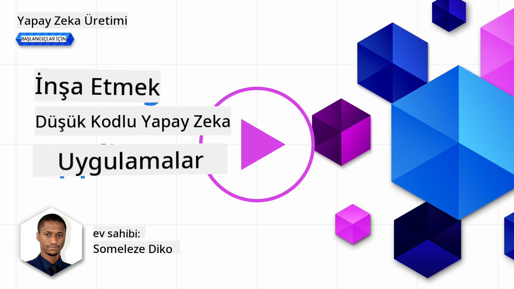
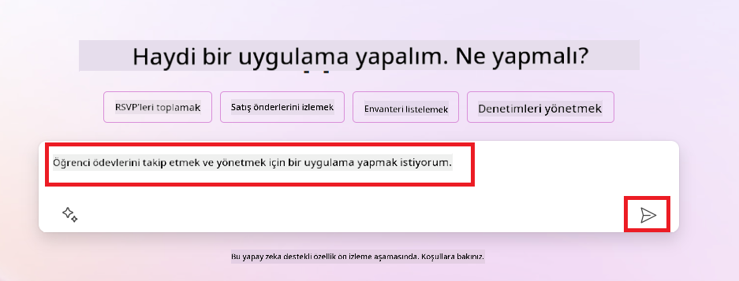
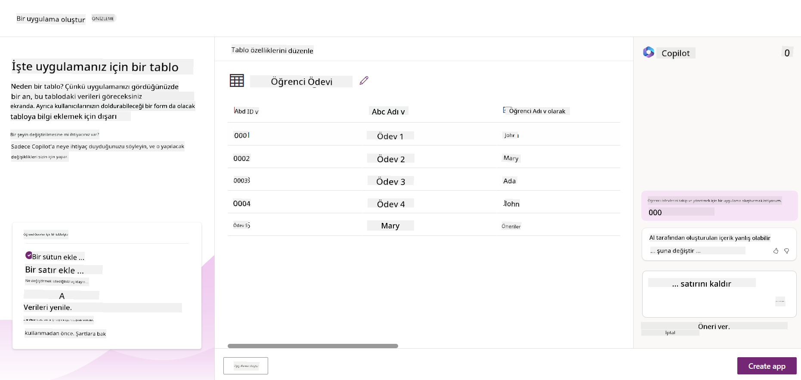
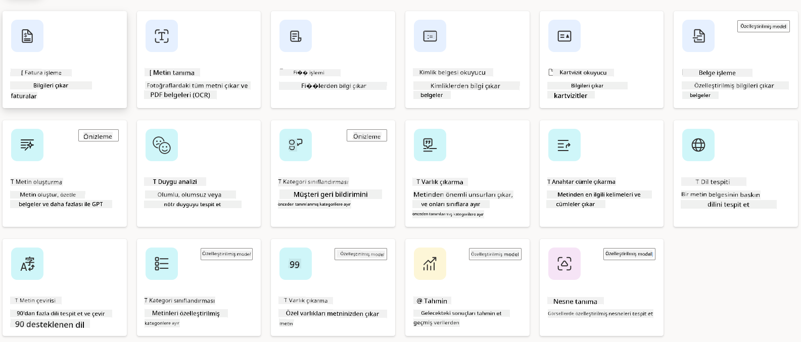
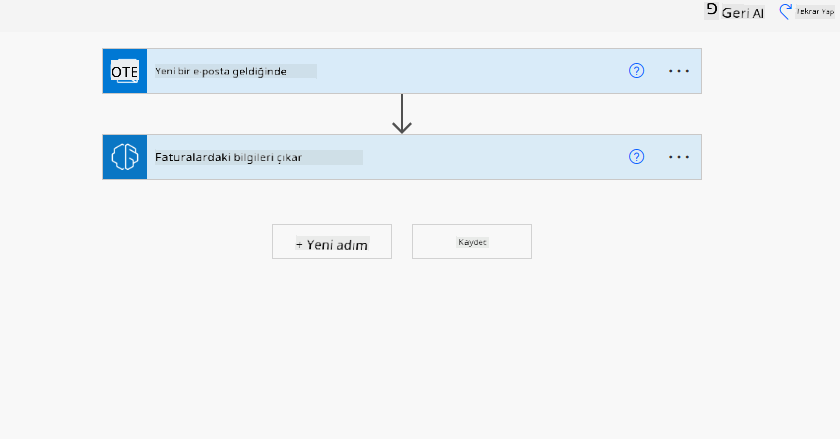
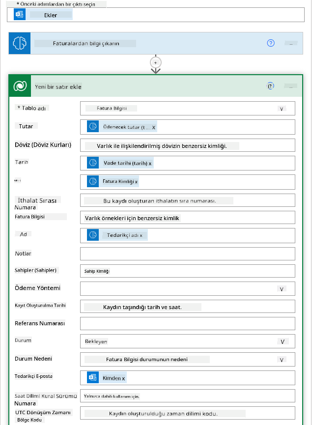
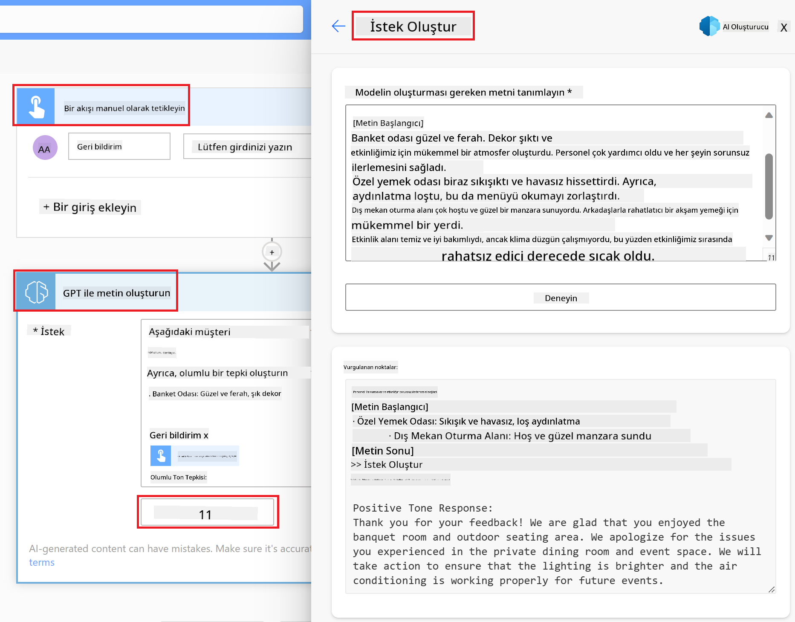

<!--
CO_OP_TRANSLATOR_METADATA:
{
  "original_hash": "f5ff3b6204a695a117d6f452403c95f7",
  "translation_date": "2025-05-19T20:19:47+00:00",
  "source_file": "10-building-low-code-ai-applications/README.md",
  "language_code": "tr"
}
-->
# Düşük Kodlu AI Uygulamaları Oluşturma

> _(Bu dersin videosunu izlemek için yukarıdaki resme tıklayın)_

## Giriş

Artık görüntü üreten uygulamalar nasıl oluşturulur öğrendiğimize göre, düşük koddan bahsedelim. Üretken AI, düşük kod dahil olmak üzere çeşitli alanlarda kullanılabilir, ancak düşük kod nedir ve AI'yi buna nasıl ekleyebiliriz?

Düşük Kod Geliştirme Platformları sayesinde geleneksel geliştiriciler ve geliştirici olmayanlar için uygulama ve çözümler oluşturmak daha kolay hale geldi. Düşük Kod Geliştirme Platformları, az veya hiç kod kullanmadan uygulama ve çözümler oluşturmanıza olanak tanır. Bu, bileşenleri sürükleyip bırakarak uygulama ve çözümler oluşturmanızı sağlayan görsel bir geliştirme ortamı sunarak sağlanır. Bu, uygulama ve çözümleri daha hızlı ve daha az kaynakla oluşturmanıza olanak tanır. Bu derste, Düşük Kod'u nasıl kullanacağımızı ve AI ile düşük kod geliştirmeyi Power Platform kullanarak nasıl geliştireceğimizi derinlemesine inceleyeceğiz.

Power Platform, kuruluşlara ekiplerini kendi çözümlerini sezgisel bir düşük kod veya kodsuz ortamda oluşturmaları için güçlendirme fırsatı sunar. Bu ortam, çözümler oluşturma sürecini basitleştirmeye yardımcı olur. Power Platform ile çözümler aylar veya yıllar yerine günler veya haftalar içinde oluşturulabilir. Power Platform beş ana üründen oluşur: Power Apps, Power Automate, Power BI, Power Pages ve Copilot Studio.

Bu ders şunları kapsar:

- Power Platform'da Üretken AI'ye Giriş
- Copilot'a Giriş ve nasıl kullanılacağı
- Power Platform'da uygulama ve akışlar oluşturmak için Üretken AI kullanma
- AI Builder ile Power Platform'daki AI Modellerini Anlama

## Öğrenme Hedefleri

Bu dersin sonunda:

- Power Platform'da Copilot'un nasıl çalıştığını anlayabileceksiniz.

- Eğitim girişimimiz için bir Öğrenci Görev İzleyici Uygulaması oluşturabileceksiniz.

- Faturalardan bilgi çıkarmak için AI kullanan bir Fatura İşleme Akışı oluşturabileceksiniz.

- GPT AI Modeli ile Metin Oluşturma kullanırken en iyi uygulamaları uygulayabileceksiniz.

Bu derste kullanacağınız araçlar ve teknolojiler şunlardır:

- **Power Apps**, öğrenci görev izleyici uygulaması için, veri izleme, yönetme ve etkileşim kurma uygulamaları oluşturmak için düşük kodlu bir geliştirme ortamı sağlar.

- **Dataverse**, öğrenci görev izleyici uygulamasının verilerini saklamak için, uygulamanın verilerini saklamak için düşük kodlu bir veri platformu sağlayacak.

- **Power Automate**, fatura işleme sürecini otomatikleştirmek için iş akışları oluşturmak için düşük kodlu bir geliştirme ortamı sağlayacak.

- **AI Builder**, girişimimiz için faturaları işlemek için önceden oluşturulmuş AI Modellerini kullanacağınız Fatura İşleme AI Modeli için.

## Power Platform'da Üretken AI

Düşük kod geliştirme ve uygulamayı üretken AI ile geliştirmek, Power Platform için önemli bir odak alanıdır. Amaç, _herhangi bir veri bilimi uzmanlığı gerektirmeden_ AI destekli uygulamalar, siteler, panolar oluşturmak ve süreçleri otomatikleştirmek için herkesi yetkilendirmektir. Bu amaç, Power Platform'daki düşük kod geliştirme deneyimine Copilot ve AI Builder şeklinde üretken AI entegrasyonu ile sağlanır.

### Bu nasıl çalışır?

Copilot, doğal dil kullanarak bir dizi konuşma adımı ile gereksinimlerinizi tanımlayarak Power Platform çözümleri oluşturmanıza olanak tanıyan bir AI asistanıdır. Örneğin, AI asistanınıza uygulamanızın hangi alanları kullanacağını belirtebilir ve hem uygulamayı hem de temel veri modelini oluşturabilir veya Power Automate'de bir akışın nasıl kurulacağını belirtebilirsiniz.

Copilot destekli işlevleri, kullanıcıların konuşma etkileşimleri yoluyla içgörüleri ortaya çıkarmasını sağlamak için uygulama ekranlarınızdaki bir özellik olarak kullanabilirsiniz.

AI Builder, Power Platform'da mevcut olan düşük kodlu bir AI yeteneğidir ve süreçleri otomatikleştirmenize ve sonuçları tahmin etmenize yardımcı olmak için AI Modelleri kullanmanıza olanak tanır. AI Builder ile Dataverse'teki veya SharePoint, OneDrive veya Azure gibi çeşitli bulut veri kaynaklarındaki verilerinize bağlanan uygulamalarınıza ve akışlarınıza AI getirebilirsiniz.

Copilot, Power Platform'un tüm ürünlerinde mevcuttur: Power Apps, Power Automate, Power BI, Power Pages ve Power Virtual Agents. AI Builder, Power Apps ve Power Automate'de mevcuttur. Bu derste, eğitim girişimimiz için bir çözüm oluşturmak amacıyla Power Apps ve Power Automate'de Copilot ve AI Builder'ı nasıl kullanacağımıza odaklanacağız.

### Power Apps'te Copilot

Power Platform'un bir parçası olan Power Apps, veri izleme, yönetme ve etkileşim kurma uygulamaları oluşturmak için düşük kodlu bir geliştirme ortamı sağlar. Tarayıcılarda, tabletlerde ve telefonlarda çalışan ve iş arkadaşlarınızla paylaşılabilen uygulamalar oluşturmanıza olanak tanır. Power Apps, her iş kullanıcısı veya profesyonel geliştiricinin özel uygulamalar oluşturabilmesi için basit bir arayüzle kullanıcıları uygulama geliştirmeye yönlendirir. Uygulama geliştirme deneyimi, Copilot aracılığıyla Üretken AI ile de geliştirilmiştir.

Power Apps'teki Copilot AI asistanı özelliği, ne tür bir uygulamaya ihtiyacınız olduğunu ve uygulamanızın ne tür bilgileri izlemesi, toplaması veya göstermesi gerektiğini tanımlamanıza olanak tanır. Copilot daha sonra tanımınıza dayalı olarak duyarlı bir Canvas uygulaması oluşturur. Ardından uygulamayı ihtiyaçlarınıza göre özelleştirebilirsiniz. AI Copilot ayrıca izlemek istediğiniz verileri depolamak için ihtiyaç duyduğunuz alanlarla bir Dataverse Tablosu önerir ve bazı örnek veriler sağlar. Dataverse'in ne olduğunu ve Power Apps'te nasıl kullanabileceğinizi bu derste daha sonra inceleyeceğiz. Ardından, AI Copilot asistan özelliğini kullanarak tablonuzu konuşma adımlarıyla ihtiyaçlarınıza göre özelleştirebilirsiniz. Bu özellik, Power Apps ana ekranından kolayca erişilebilir.

### Power Automate'te Copilot

Power Platform'un bir parçası olan Power Automate, kullanıcıların uygulamalar ve hizmetler arasında otomatik iş akışları oluşturmasına olanak tanır. İletişim, veri toplama ve karar onayları gibi tekrarlayan iş süreçlerini otomatikleştirmeye yardımcı olur. Basit arayüzü, her teknik yeterlilikteki kullanıcıların (başlangıç seviyesinden deneyimli geliştiricilere kadar) iş görevlerini otomatikleştirmesine olanak tanır. İş akışı geliştirme deneyimi, Copilot aracılığıyla Üretken AI ile de geliştirilmiştir.

Power Automate'teki Copilot AI asistanı özelliği, ne tür bir akışa ihtiyacınız olduğunu ve akışınızın hangi işlemleri gerçekleştirmesini istediğinizi tanımlamanıza olanak tanır. Copilot daha sonra tanımınıza dayalı olarak bir akış oluşturur. Ardından akışı ihtiyaçlarınıza göre özelleştirebilirsiniz. AI Copilot ayrıca otomatikleştirmek istediğiniz görevi gerçekleştirmek için ihtiyaç duyduğunuz işlemleri önerir ve oluşturur. Bu derste daha sonra akışların ne olduğunu ve Power Automate'te nasıl kullanabileceğinizi inceleyeceğiz. Ardından, AI Copilot asistan özelliğini kullanarak işlemleri ihtiyaçlarınıza göre özelleştirebilirsiniz. Bu özellik, Power Automate ana ekranından kolayca erişilebilir.

## Görev: Eğitim girişimimizin öğrenci görevlerini ve faturalarını Copilot kullanarak yönetin

Girişimimiz öğrencilere çevrimiçi kurslar sunmaktadır. Girişim hızla büyüdü ve şimdi kurslarına olan talebe yetişmekte zorlanıyor. Girişim, öğrenci görevlerini ve faturalarını yönetmelerine yardımcı olacak düşük kodlu bir çözüm oluşturmak için sizi Power Platform geliştiricisi olarak işe aldı. Çözüm, öğrenci görevlerini bir uygulama aracılığıyla izleyip yönetmelerine ve fatura işleme sürecini bir iş akışı aracılığıyla otomatikleştirmelerine yardımcı olmalıdır. Çözümü geliştirmek için Üretken AI kullanmanız istendi.

Copilot'u kullanmaya başlarken, [Power Platform Copilot Prompt Library](https://github.com/pnp/powerplatform-prompts?WT.mc_id=academic-109639-somelezediko) ile başlayabilirsiniz. Bu kütüphane, Copilot ile uygulamalar ve akışlar oluşturmak için kullanabileceğiniz istemlerin bir listesini içerir. Ayrıca kütüphanedeki istemleri kullanarak Copilot'a gereksinimlerinizi nasıl tanımlayacağınız konusunda bir fikir edinebilirsiniz.

### Girişimimiz için Bir Öğrenci Görev İzleyici Uygulaması Oluşturun

Girişimimizdeki eğitimciler, öğrenci görevlerini izlemekte zorlanıyor. Görevleri izlemek için bir elektronik tablo kullanıyorlardı, ancak öğrenci sayısı arttıkça bu yönetilmesi zor hale geldi. Sizden, öğrenci görevlerini izlemelerine ve yönetmelerine yardımcı olacak bir uygulama oluşturmanızı istediler. Uygulama, onlara yeni görevler ekleme, görevleri görüntüleme, görevleri güncelleme ve görevleri silme olanağı sağlamalıdır. Uygulama ayrıca eğitimcilerin ve öğrencilerin derecelendirilen ve derecelendirilmeyen görevleri görüntülemelerine olanak tanımalıdır.

Uygulamayı, aşağıdaki adımları izleyerek Power Apps'te Copilot kullanarak oluşturacaksınız:

1. [Power Apps](https://make.powerapps.com?WT.mc_id=academic-105485-koreyst) ana ekranına gidin.

2. Ana ekrandaki metin alanını kullanarak oluşturmak istediğiniz uygulamayı tanımlayın. Örneğin, **_Öğrenci görevlerini izlemek ve yönetmek için bir uygulama oluşturmak istiyorum_**. İstemi AI Copilot'a göndermek için **Gönder** düğmesine tıklayın.

3. AI Copilot, izlemek istediğiniz verileri depolamak için ihtiyaç duyduğunuz alanlarla bir Dataverse Tablosu önerir ve bazı örnek veriler sağlar. Ardından, AI Copilot asistan özelliğini kullanarak tablonuzu konuşma adımlarıyla ihtiyaçlarınıza göre özelleştirebilirsiniz.

   > **Önemli**: Dataverse, Power Platform'un temel veri platformudur. Uygulamanın verilerini saklamak için düşük kodlu bir veri platformudur. Microsoft Cloud'da güvenli bir şekilde veri depolayan ve Power Platform ortamınızda sağlanan tam yönetilen bir hizmettir. Veri sınıflandırması, veri soy ağacı, ince ayarlı erişim kontrolü ve daha fazlası gibi yerleşik veri yönetimi yetenekleri ile birlikte gelir. Dataverse hakkında daha fazla bilgi edinebilirsiniz [buradan](https://docs.microsoft.com/powerapps/maker/data-platform/data-platform-intro?WT.mc_id=academic-109639-somelezediko).

   

4. Eğitimciler, görevlerini teslim eden öğrencilere e-posta göndermek ve görevlerinin ilerleyişi hakkında onları bilgilendirmek istiyor. Tabloda öğrenci e-postasını saklamak için yeni bir alan eklemek üzere Copilot'u kullanabilirsiniz. Örneğin, tabloya yeni bir alan eklemek için şu istemi kullanabilirsiniz: **_Öğrenci e-postasını saklamak için bir sütun eklemek istiyorum_**. İstemi AI Copilot'a göndermek için **Gönder** düğmesine tıklayın.

5. AI Copilot yeni bir alan oluşturacak ve ardından alanı ihtiyaçlarınıza göre özelleştirebilirsiniz.

6. Tabloyu tamamladığınızda, uygulamayı oluşturmak için **Uygulama oluştur** düğmesine tıklayın.

7. AI Copilot, tanımınıza dayalı olarak duyarlı bir Canvas uygulaması oluşturur. Ardından uygulamayı ihtiyaçlarınıza göre özelleştirebilirsiniz.

8. Eğitimcilerin öğrencilere e-posta göndermesi için uygulamaya yeni bir ekran eklemek üzere Copilot'u kullanabilirsiniz. Örneğin, uygulamaya yeni bir ekran eklemek için şu istemi kullanabilirsiniz: **_Öğrencilere e-posta göndermek için bir ekran eklemek istiyorum_**. İstemi AI Copilot'a göndermek için **Gönder** düğmesine tıklayın.

9. AI Copilot yeni bir ekran oluşturacak ve ardından ekranı ihtiyaçlarınıza göre özelleştirebilirsiniz.

10. Uygulamayı tamamladığınızda, uygulamayı kaydetmek için **Kaydet** düğmesine tıklayın.

11. Uygulamayı eğitimcilerle paylaşmak için **Paylaş** düğmesine ve ardından tekrar **Paylaş** düğmesine tıklayın. Ardından eğitimcilerin e-posta adreslerini girerek uygulamayı onlarla paylaşabilirsiniz.

> **Ödeviniz**: Yeni oluşturduğunuz uygulama iyi bir başlangıç ama geliştirilebilir. E-posta özelliği ile eğitimciler, öğrencilere e-postaları manuel olarak yazmak zorunda kalarak gönderebilir. Eğitimcilerin, öğrenciler görevlerini teslim ettiklerinde otomatik olarak e-posta göndermelerini sağlayacak bir otomasyon oluşturmak için Copilot'u kullanabilir misiniz? İpucunuz, doğru istemle Power Automate'te Copilot'u kullanarak bunu oluşturabileceğinizdir.

### Girişimimiz için Bir Fatura Bilgi Tablosu Oluşturun

Girişimimizin finans ekibi, faturaları takip etmekte zorlanıyor. Faturaları izlemek için bir elektronik tablo kullanıyorlardı, ancak fatura sayısı arttıkça bu yönetilmesi zor hale geldi. Sizden, aldıkları faturaların bilgilerini saklamak, izlemek ve yönetmek için bir tablo oluşturmanızı istediler. Tablo, tüm fatura bilgilerini çıkarmak ve tabloya kaydetmek için bir otomasyon oluşturmak için kullanılmalıdır. Tablo ayrıca finans ekibinin ödenmiş ve ödenmemiş faturaları görüntülemesine olanak tanımalıdır.

Power Platform'un, uygulamalarınız ve çözümleriniz için verileri saklamanıza olanak tanıyan bir temel veri platformu olan Dataverse vardır. Dataverse, uygulamanızın verilerini saklamak için düşük kodlu bir veri platformu sağlar. Microsoft Cloud'da güvenli bir şekilde veri depolayan ve Power Platform ortamınızda sağlanan tam yönetilen bir hizmettir. Veri sınıflandırması, veri soy ağacı, ince ayarlı erişim kontrolü ve daha fazlası gibi yerleşik veri yönetimi yetenekleri ile birlikte gelir. [Dataverse hakkında daha fazla bilgiyi buradan](https://docs.microsoft.com/powerapps/maker/data-platform/data-platform-intro?WT.mc_id=academic-109639-somelezediko) öğrenebilirsiniz.

Girişimimiz için neden Dataverse kullanmalıyız? Dataverse içindeki standart ve özel tablolar, verileriniz için güvenli ve bulut tabanlı bir depolama seçeneği sunar. Tablolar, tek bir Excel çalışma kitabındaki birden fazla çalışma sayfasını nasıl kullanıyorsanız, farklı türde verileri saklamanıza olanak tanır. Tabloları, kuruluşunuz veya iş ihtiyaçlarınıza özel verileri saklamak için kullanabilirsiniz. Girişimimizin Dataverse kullanmaktan elde edeceği bazı faydalar şunlardır, ancak bunlarla sınırlı değildir:

- **Kolay yönetim**: Hem meta veriler hem de veriler bulutta saklanır, bu nedenle nasıl saklandıkları veya yönetildikleri konusunda endişelenmenize gerek yoktur. Uygulamalarınızı ve çözümlerinizi oluşturmaya odaklanabilirsiniz.

- **Güvenli**: Dataverse, verileriniz için güvenli ve bulut tabanlı bir depolama seçeneği sunar. Tablolarınızdaki verilere kimin erişebileceğini ve nasıl erişebileceğini rol tabanlı güvenlik kullanarak kontrol edebilirsiniz.

- **Zengin meta veriler**: Veri türleri ve ilişkiler doğrudan Power Apps içinde kullanılır.

- **Mantık ve doğrulama**: İş kuralları, hesaplanmış alanlar ve doğrulama kuralları kullanarak iş mantığını uygulayabilir ve veri doğruluğunu koruyabilirsiniz.

Artık Dataverse'in ne olduğunu ve neden kullanmanız gerektiğini bildiğinize göre, finans ekibimizin gereksinimlerini karşılamak için Dataverse'de bir tablo oluşturmak üzere Copilot'u nasıl kullanabileceğinize bir göz atalım.

> **Not**: Bu tabloyu, bir sonraki bölümde tüm fatura bilgilerini çıkarmak ve tabloya kaydetmek için bir otomasyon oluşturmak için kullanacaksınız.
Dataverse'de Copilot kullanarak bir tablo oluşturmak için aşağıdaki adımları izleyin: 1. [Power Apps](https://make.powerapps.com?WT.mc_id=academic-105485-koreyst) ana ekranına gidin. 2. Sol navigasyon ç
a metin. - **Duygu Analizi**: Bu model metindeki olumlu, olumsuz, nötr veya karışık duyguları algılar. - **Kartvizit Okuyucu**: Bu model kartvizitlerden bilgi çıkarır. - **Metin Tanıma**: Bu model görüntülerden metin çıkarır. - **Nesne Tespiti**: Bu model görüntülerden nesneleri tespit eder ve çıkarır. - **Belge İşleme**: Bu model formlardan bilgi çıkarır. - **Fatura İşleme**: Bu model faturadan bilgi çıkarır. Kendi AI Modellerinizle, kendi modelinizi AI Builder'a getirebilir ve herhangi bir AI Builder özel modeli gibi çalışmasını sağlayabilirsiniz; böylece modeli kendi verilerinizle eğitebilirsiniz. Bu modelleri, Power Apps ve Power Automate'te süreçleri otomatikleştirmek ve sonuçları tahmin etmek için kullanabilirsiniz. Kendi modelinizi kullanırken geçerli olan sınırlamalar vardır. Bu [sınırlamalar](https://learn.microsoft.com/ai-builder/byo-model#limitations?WT.mc_id=academic-105485-koreyst) hakkında daha fazla bilgi edinin.  ## Görev #2 - Girişimimiz için Bir Fatura İşleme Akışı Oluşturun Finans ekibi faturaları işlemekle zorlanıyor. Faturaları takip etmek için bir elektronik tablo kullanıyorlardı ancak fatura sayısı arttıkça bu yönetilmesi zor hale geldi. Sizden, faturaları AI kullanarak işlemelerine yardımcı olacak bir iş akışı oluşturmanızı istediler. İş akışı, faturadan bilgi çıkarmalarına ve bilgiyi bir Dataverse tablosunda saklamalarına olanak tanımalıdır. İş akışı ayrıca çıkarılan bilgileri finans ekibine e-posta ile göndermelerine de olanak tanımalıdır. Artık AI Builder'ın ne olduğunu ve neden kullanmanız gerektiğini bildiğinize göre, daha önce ele aldığımız AI Builder'daki Fatura İşleme AI Modelini kullanarak finans ekibinin faturaları işlemesine yardımcı olacak bir iş akışı nasıl oluşturabileceğinize bir göz atalım. AI Builder'daki Fatura İşleme AI Modelini kullanarak finans ekibinin faturaları işlemesine yardımcı olacak bir iş akışı oluşturmak için aşağıdaki adımları izleyin: 1. [Power Automate](https://make.powerautomate.com?WT.mc_id=academic-105485-koreyst) ana ekranına gidin. 2. Ana ekrandaki metin alanını, oluşturmak istediğiniz iş akışını tanımlamak için kullanın. Örneğin, **_Fatura posta kutuma ulaştığında işle_**. İsteği AI Copilot'a göndermek için **Gönder** düğmesine tıklayın.  3. AI Copilot, otomatikleştirmek istediğiniz görevi gerçekleştirmek için yapmanız gereken eylemleri önerecektir. Sonraki adımları görmek için **İleri** düğmesine tıklayabilirsiniz. 4. Sonraki adımda, Power Automate size akış için gerekli bağlantıları kurmanızı isteyecektir. İşiniz bittiğinde, akışı oluşturmak için **Akış oluştur** düğmesine tıklayın. 5. AI Copilot bir akış oluşturacak ve ardından akışı ihtiyaçlarınıza göre özelleştirebilirsiniz. 6. Akışın tetikleyicisini güncelleyin ve **Klasör**ü faturaların saklanacağı klasöre ayarlayın. Örneğin, klasörü **Gelen Kutusu** olarak ayarlayabilirsiniz. **Gelişmiş seçenekleri göster**e tıklayın ve **Yalnızca Eklerle**yi **Evet** olarak ayarlayın. Bu, yalnızca ekli bir e-posta klasöre ulaştığında akışın çalışmasını sağlar. 7. Akıştan şu eylemleri kaldırın: **HTML'den metne**, **Oluştur**, **Oluştur 2**, **Oluştur 3** ve **Oluştur 4** çünkü bunları kullanmayacaksınız. 8. **Koşul** eylemini akıştan kaldırın çünkü kullanmayacaksınız. Aşağıdaki ekran görüntüsüne benzemelidir:  9. **Bir eylem ekle** düğmesine tıklayın ve **Dataverse** arayın. **Yeni bir satır ekle** eylemini seçin. 10. **Faturalardan Bilgi Çıkar** eyleminde, **Fatura Dosyası**nı e-postadaki **Ek İçeriği**ne yönlendirmek için güncelleyin. Bu, akışın fatura ekinden bilgi çıkarmasını sağlar. 11. Daha önce oluşturduğunuz **Tablo**yu seçin. Örneğin, **Fatura Bilgisi** tablosunu seçebilirsiniz. Aşağıdaki alanları doldurmak için önceki eylemden dinamik içeriği seçin: - ID - Tutar - Tarih - İsim - Durum - **Durumu** **Beklemede** olarak ayarlayın. - Tedarikçi E-posta - **Yeni bir e-posta geldiğinde** tetikleyicisinden **Gönderen** dinamik içeriğini kullanın.  12. Akışla işiniz bittiğinde, akışı kaydetmek için **Kaydet** düğmesine tıklayın. Ardından, tetikleyicide belirttiğiniz klasöre bir fatura içeren e-posta göndererek akışı test edebilirsiniz. > **Ödeviniz**: Yeni oluşturduğunuz akış iyi bir başlangıç, şimdi finans ekibimizin tedarikçiye faturalarının güncel durumu hakkında bilgi veren bir e-posta göndermelerini sağlayacak bir otomasyon nasıl oluşturabileceğinizi düşünmeniz gerekiyor. İpucunuz: akış, fatura durumu değiştiğinde çalışmalıdır.

## Power Automate'te Bir Metin Üretme AI Modeli Kullanın

AI Builder'daki GPT AI Modeli ile Metin Oluşturma, bir isteme dayalı metin oluşturmanıza olanak tanır ve Microsoft Azure OpenAI Hizmeti tarafından desteklenir. Bu yetenekle, GPT (Üretken Önceden Eğitilmiş Dönüştürücü) teknolojisini uygulamalarınıza ve akışlarınıza entegre ederek çeşitli otomatik akışlar ve içgörülü uygulamalar oluşturabilirsiniz.

GPT modelleri, geniş veri kümeleri üzerinde yoğun eğitim alır ve bu sayede bir istem verildiğinde insan diline yakın metinler üretebilir. İş akışı otomasyonu ile entegre edildiğinde, GPT gibi AI modelleri, çok çeşitli görevleri kolaylaştırmak ve otomatikleştirmek için kullanılabilir.

Örneğin, e-posta taslakları, ürün açıklamaları ve daha fazlası gibi çeşitli kullanım durumları için otomatik olarak metin oluşturacak akışlar oluşturabilirsiniz. Ayrıca, müşteri hizmetleri temsilcilerinin müşteri taleplerine etkili ve verimli bir şekilde yanıt vermelerini sağlayan sohbet botları ve müşteri hizmetleri uygulamaları gibi çeşitli uygulamalar için modelden metin oluşturmak için de kullanabilirsiniz.

Bu AI Modelini Power Automate'te nasıl kullanacağınızı öğrenmek için [AI Builder ve GPT ile Zeka Ekleyin](https://learn.microsoft.com/training/modules/ai-builder-text-generation/?WT.mc_id=academic-109639-somelezediko) modülünü inceleyin.

## Harika İş! Öğrenmeye Devam Edin

Bu dersi tamamladıktan sonra, Generative AI bilginizi artırmaya devam etmek için [Generative AI Öğrenme koleksiyonumuza](https://aka.ms/genai-collection?WT.mc_id=academic-105485-koreyst) göz atın!

Generative AI'yi Fonksiyon Çağırma ile nasıl entegre edeceğimizi inceleyeceğimiz 11. Derse geçin!

**Feragatname**:  
Bu belge, AI çeviri hizmeti [Co-op Translator](https://github.com/Azure/co-op-translator) kullanılarak çevrilmiştir. Doğruluk için çaba göstersek de, otomatik çevirilerin hata veya yanlışlıklar içerebileceğini lütfen unutmayın. Orijinal belgenin kendi dilindeki hali yetkili kaynak olarak kabul edilmelidir. Kritik bilgiler için profesyonel insan çevirisi önerilir. Bu çevirinin kullanımından kaynaklanan yanlış anlama veya yanlış yorumlamalardan sorumlu değiliz.