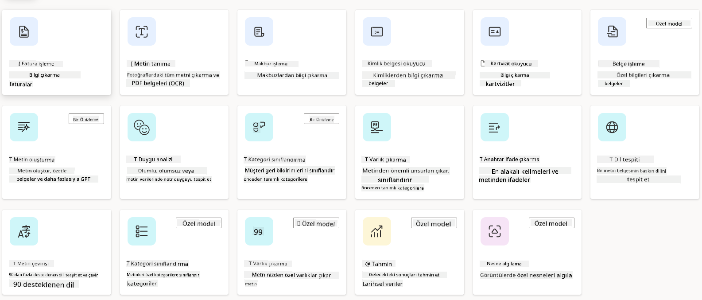
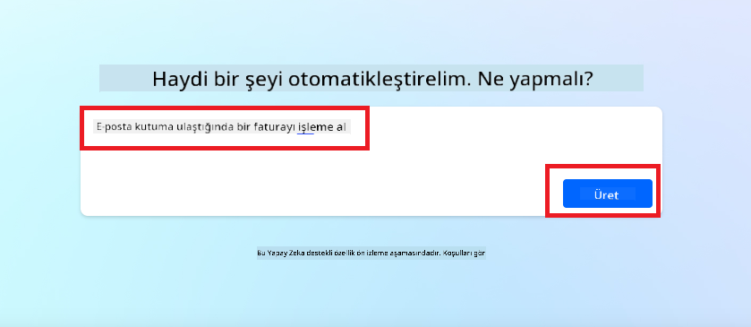
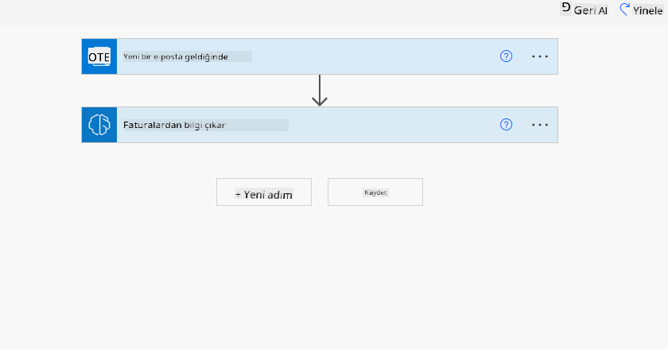
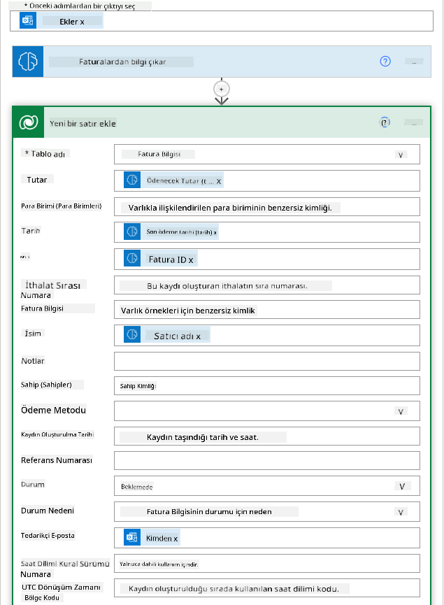
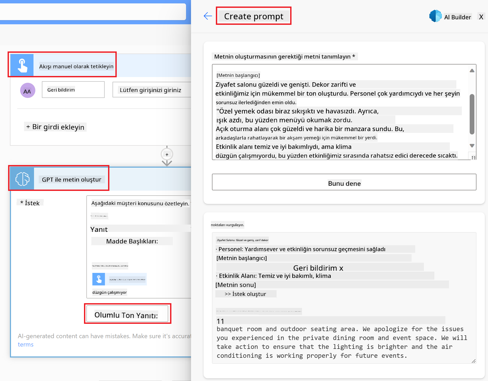

<!--
CO_OP_TRANSLATOR_METADATA:
{
  "original_hash": "f5ff3b6204a695a117d6f452403c95f7",
  "translation_date": "2025-06-25T18:41:15+00:00",
  "source_file": "10-building-low-code-ai-applications/README.md",
  "language_code": "tr"
}
-->
# Düşük Kodlu AI Uygulamaları Oluşturma

## Giriş

Artık görüntü üreten uygulamalar oluşturmayı öğrendiğimize göre, düşük kod hakkında konuşalım. Üretken AI, düşük kod dahil olmak üzere çeşitli alanlarda kullanılabilir, ancak düşük kod nedir ve AI'yı buna nasıl ekleyebiliriz?

Düşük Kod Geliştirme Platformları kullanarak geleneksel geliştiriciler ve geliştirici olmayanlar için uygulama ve çözümler oluşturmak daha kolay hale geldi. Düşük Kod Geliştirme Platformları, az veya hiç kod kullanmadan uygulama ve çözümler oluşturmanıza olanak tanır. Bu, uygulama ve çözümleri daha hızlı ve daha az kaynakla oluşturmanıza olanak tanıyan bileşenleri sürükleyip bırakarak uygulama ve çözümler oluşturmanıza olanak tanıyan görsel bir geliştirme ortamı sağlayarak gerçekleştirilir. Bu derste, Düşük Kod'un nasıl kullanılacağını ve AI ile düşük kod geliştirmeyi Power Platform kullanarak nasıl geliştirileceğini derinlemesine inceleyeceğiz.

Power Platform, kuruluşlara ekiplerini kendi çözümlerini oluşturma yetkisi veren sezgisel düşük kodlu veya kodsuz bir ortam sunar. Bu ortam, çözüm oluşturma sürecini basitleştirir. Power Platform ile çözümler aylar veya yıllar yerine günler veya haftalar içinde oluşturulabilir. Power Platform beş ana üründen oluşur: Power Apps, Power Automate, Power BI, Power Pages ve Copilot Studio.

Bu ders şunları kapsar:

- Power Platform'da Üretken AI'ya giriş
- Copilot'a giriş ve nasıl kullanılacağı
- Power Platform'da uygulamalar ve akışlar oluşturmak için Üretken AI kullanma
- AI Builder ile Power Platform'daki AI Modellerini anlama

## Öğrenme Hedefleri

Bu dersin sonunda şunları yapabileceksiniz:

- Power Platform'da Copilot'un nasıl çalıştığını anlayın.

- Eğitim girişimimiz için bir Öğrenci Görev İzleyici Uygulaması oluşturun.

- Faturalardan bilgi çıkarmak için AI kullanan bir Fatura İşleme Akışı oluşturun.

- GPT AI Modeli ile Metin Oluşturma kullanırken en iyi uygulamaları uygulayın.

Bu derste kullanacağınız araçlar ve teknolojiler şunlardır:

- **Power Apps**, Öğrenci Görev İzleyici uygulaması için, verileri izlemek, yönetmek ve etkileşimde bulunmak için uygulama oluşturmak için düşük kodlu bir geliştirme ortamı sağlar.

- **Dataverse**, Öğrenci Görev İzleyici uygulamasının verilerini depolamak için Dataverse, uygulamanın verilerini depolamak için düşük kodlu bir veri platformu sağlar.

- **Power Automate**, Fatura İşleme akışı için, fatura işleme sürecini otomatikleştirmek için iş akışları oluşturmak için düşük kodlu bir geliştirme ortamı sağlayacaktır.

- **AI Builder**, Fatura İşleme AI Modeli için, girişimimiz için faturaları işlemek için önceden oluşturulmuş AI Modellerini kullanacaksınız.

## Power Platform'da Üretken AI

Düşük kod geliştirme ve uygulamayı üretken AI ile geliştirmek, Power Platform için önemli bir odak alanıdır. Amaç, herkesin AI destekli uygulamalar, siteler, panolar oluşturmasını ve AI ile süreçleri otomatikleştirmesini _herhangi bir veri bilimi uzmanlığı gerektirmeden_ sağlamaktır. Bu hedef, Copilot ve AI Builder biçiminde Power Platform'daki düşük kodlu geliştirme deneyimine üretken AI entegre edilerek gerçekleştirilir.

### Bu nasıl çalışır?

Copilot, gereksinimlerinizi doğal dil kullanarak bir dizi konuşma adımıyla tanımlayarak Power Platform çözümleri oluşturmanıza olanak tanıyan bir AI asistanıdır. Örneğin, AI asistanınıza uygulamanızın hangi alanları kullanacağını belirtebilir ve hem uygulamayı hem de altta yatan veri modelini oluşturabilir veya Power Automate'de bir akışın nasıl ayarlanacağını belirtebilirsiniz.

Copilot destekli işlevleri uygulama ekranlarınızda bir özellik olarak kullanarak kullanıcıların konuşma etkileşimleri aracılığıyla içgörüleri ortaya çıkarmasını sağlayabilirsiniz.

AI Builder, Power Platform'da bulunan ve süreçleri otomatikleştirmenize ve sonuçları tahmin etmenize yardımcı olmak için AI Modellerini kullanmanıza olanak tanıyan düşük kodlu bir AI yeteneğidir. AI Builder ile Dataverse veya SharePoint, OneDrive veya Azure gibi çeşitli bulut veri kaynaklarındaki verilerinize bağlanan uygulamalarınıza ve akışlarınıza AI getirebilirsiniz.

Copilot, Power Platform ürünlerinin tamamında kullanılabilir: Power Apps, Power Automate, Power BI, Power Pages ve Power Virtual Agents. AI Builder, Power Apps ve Power Automate'de kullanılabilir. Bu derste, eğitim girişimimiz için bir çözüm oluşturmak amacıyla Power Apps ve Power Automate'de Copilot ve AI Builder'ı nasıl kullanacağımıza odaklanacağız.

### Power Apps'te Copilot

Power Platform'un bir parçası olarak Power Apps, verileri izlemek, yönetmek ve etkileşimde bulunmak için uygulama oluşturmak için düşük kodlu bir geliştirme ortamı sağlar. Tarayıcılar, tabletler ve telefonlarda çalışan ve iş arkadaşlarınızla paylaşılabilen uygulamalar oluşturmanıza olanak tanıyan ölçeklenebilir bir veri platformu ve bulut hizmetlerine ve yerinde verilere bağlanma yeteneği ile bir uygulama geliştirme hizmetleri paketidir. Power Apps, her iş kullanıcısının veya profesyonel geliştiricinin özel uygulamalar oluşturabileceği basit bir arayüzle kullanıcıları uygulama geliştirmeye yönlendirir. Uygulama geliştirme deneyimi, Copilot aracılığıyla Üretken AI ile de geliştirilmiştir.

Power Apps'teki copilot AI asistanı özelliği, ne tür bir uygulamaya ihtiyacınız olduğunu ve uygulamanızın hangi bilgileri izlemesini, toplamasını veya göstermesini istediğinizi tanımlamanıza olanak tanır. Copilot, açıklamanıza dayanarak duyarlı bir Canvas uygulaması oluşturur. Ardından uygulamayı ihtiyaçlarınıza göre özelleştirebilirsiniz. AI Copilot ayrıca izlemek istediğiniz verileri depolamak için gereken alanlarla bir Dataverse Tablosu oluşturur ve bazı örnek veriler önerir. Bu derste daha sonra Dataverse'in ne olduğunu ve Power Apps'te nasıl kullanabileceğinizi inceleyeceğiz. Ardından, AI Copilot asistanı özelliğini kullanarak konuşma adımları aracılığıyla tabloyu ihtiyaçlarınıza göre özelleştirebilirsiniz. Bu özellik Power Apps ana ekranından kolayca erişilebilir.

### Power Automate'te Copilot

Power Platform'un bir parçası olarak Power Automate, kullanıcıların uygulamalar ve hizmetler arasında otomatik iş akışları oluşturmasına olanak tanır. İletişim, veri toplama ve karar onayları gibi tekrarlayan iş süreçlerini otomatikleştirmeye yardımcı olur. Basit arayüzü, her teknik yetkinliğe sahip kullanıcıların (başlangıç seviyesinden deneyimli geliştiricilere kadar) iş görevlerini otomatikleştirmesine olanak tanır. İş akışı geliştirme deneyimi, Copilot aracılığıyla Üretken AI ile de geliştirilmiştir.

Power Automate'teki copilot AI asistanı özelliği, ne tür bir akışa ihtiyacınız olduğunu ve akışınızın hangi eylemleri gerçekleştirmesini istediğinizi tanımlamanıza olanak tanır. Copilot, açıklamanıza dayanarak bir akış oluşturur. Ardından akışı ihtiyaçlarınıza göre özelleştirebilirsiniz. AI Copilot ayrıca otomatikleştirmek istediğiniz görevi gerçekleştirmek için gereken eylemleri önerir ve oluşturur. Bu derste daha sonra akışların ne olduğunu ve Power Automate'te nasıl kullanabileceğinizi inceleyeceğiz. Ardından, AI Copilot asistanı özelliğini kullanarak konuşma adımları aracılığıyla eylemleri ihtiyaçlarınıza göre özelleştirebilirsiniz. Bu özellik Power Automate ana ekranından kolayca erişilebilir.

## Görev: Öğrenci görevlerini ve faturaları girişimimiz için Copilot kullanarak yönetin

Girişimimiz öğrencilere çevrimiçi kurslar sunmaktadır. Girişim hızla büyüdü ve artık kurslarına olan talebi karşılamakta zorlanıyor. Girişim, öğrenci görevlerini ve faturalarını yönetmelerine yardımcı olacak düşük kodlu bir çözüm oluşturmaları için sizi bir Power Platform geliştiricisi olarak işe aldı. Çözüm, bir uygulama aracılığıyla öğrenci görevlerini izlemelerine ve yönetmelerine ve bir iş akışı aracılığıyla fatura işleme sürecini otomatikleştirmelerine yardımcı olmalıdır. Çözümü geliştirmek için Üretken AI kullanmanız istendi.

Copilot'u kullanmaya başladığınızda, [Power Platform Copilot Prompt Library](https://github.com/pnp/powerplatform-prompts?WT.mc_id=academic-109639-somelezediko) ile başlamak için istemleri kullanabilirsiniz. Bu kütüphane, Copilot ile uygulama ve akışlar oluşturmak için kullanabileceğiniz istemlerin bir listesini içerir. İhtiyaçlarınızı Copilot'a nasıl tanımlayacağınız hakkında fikir edinmek için kütüphanedeki istemleri de kullanabilirsiniz.

### Girişimimiz için bir Öğrenci Görev İzleyici Uygulaması Oluşturun

Girişimimizdeki eğitimciler, öğrenci görevlerini takip etmekte zorlanıyorlar. Görevleri takip etmek için bir elektronik tablo kullanıyorlar ancak öğrenci sayısı arttıkça bu yönetmek zor hale geldi. Sizden, öğrenci görevlerini takip etmelerine ve yönetmelerine yardımcı olacak bir uygulama oluşturmanız istendi. Uygulama, yeni görevler eklemelerine, görevleri görüntülemelerine, güncellemelerine ve silmelerine olanak tanımalıdır. Uygulama ayrıca eğitimcilerin ve öğrencilerin notlandırılmış ve notlandırılmamış görevleri görüntülemelerine olanak tanımalıdır.

Uygulamayı Power Apps'te Copilot kullanarak aşağıdaki adımları izleyerek oluşturacaksınız:

1. [Power Apps](https://make.powerapps.com?WT.mc_id=academic-105485-koreyst) ana ekranına gidin.

1. Ana ekrandaki metin alanını kullanarak oluşturmak istediğiniz uygulamayı tanımlayın. Örneğin, **_Öğrenci görevlerini izlemek ve yönetmek için bir uygulama oluşturmak istiyorum_**. İstemi AI Copilot'a göndermek için **Gönder** düğmesine tıklayın.

1. AI Copilot, izlemek istediğiniz verileri depolamak için gereken alanlarla bir Dataverse Tablosu ve bazı örnek veriler önerir. Ardından, AI Copilot asistanı özelliğini kullanarak konuşma adımları aracılığıyla tabloyu ihtiyaçlarınıza göre özelleştirebilirsiniz.

   > **Önemli**: Dataverse, Power Platform'un altında yatan veri platformudur. Uygulamanın verilerini depolamak için düşük kodlu bir veri platformudur. Microsoft Cloud'da verileri güvenli bir şekilde depolayan ve Power Platform ortamınızda sağlanan tam yönetilen bir hizmettir. Veri sınıflandırması, veri soyutlaması, ince ayarlı erişim kontrolü ve daha fazlası gibi yerleşik veri yönetimi yetenekleriyle birlikte gelir. Dataverse hakkında daha fazla bilgiyi [buradan](https://docs.microsoft.com/powerapps/maker/data-platform/data-platform-intro?WT.mc_id=academic-109639-somelezediko) öğrenebilirsiniz.

1. Eğitimciler, görevlerini gönderen öğrencilere görevlerinin ilerlemesi hakkında güncellemeler göndermek için e-posta göndermek istiyorlar. Öğrenci e-posta adresini depolamak için tabloya yeni bir alan eklemek üzere Copilot'u kullanabilirsiniz. Örneğin, tabloya yeni bir alan eklemek için şu istemi kullanabilirsiniz: **_Öğrenci e-posta adresini depolamak için bir sütun eklemek istiyorum_**. İstemi AI Copilot'a göndermek için **Gönder** düğmesine tıklayın.

1. AI Copilot, yeni bir alan oluşturacak ve ardından alanı ihtiyaçlarınıza göre özelleştirebilirsiniz.

1. Tabloyu tamamladıktan sonra, uygulamayı oluşturmak için **Uygulama oluştur** düğmesine tıklayın.

1. AI Copilot, açıklamanıza dayanarak duyarlı bir Canvas uygulaması oluşturacak. Ardından uygulamayı ihtiyaçlarınıza göre özelleştirebilirsiniz.

1. Eğitimcilerin öğrencilere e-posta göndermesi için uygulamaya yeni bir ekran eklemek üzere Copilot'u kullanabilirsiniz. Örneğin, uygulamaya yeni bir ekran eklemek için şu istemi kullanabilirsiniz: **_Öğrencilere e-posta göndermek için bir ekran eklemek istiyorum_**. İstemi AI Copilot'a göndermek için **Gönder** düğmesine tıklayın.

1. AI Copilot, yeni bir ekran oluşturacak ve ardından ekranı ihtiyaçlarınıza göre özelleştirebilirsiniz.

1. Uygulamayı tamamladıktan sonra, uygulamayı kaydetmek için **Kaydet** düğmesine tıklayın.

1. Uygulamayı eğitimcilerle paylaşmak için **Paylaş** düğmesine ve ardından tekrar **Paylaş** düğmesine tıklayın. Ardından, eğitimcilerin e-posta adreslerini girerek uygulamayı paylaşabilirsiniz.

> **Ödeviniz**: Az önce oluşturduğunuz uygulama iyi bir başlangıç ancak geliştirilebilir. E-posta özelliği ile eğitimciler yalnızca öğrencilere e-posta göndermek için manuel olarak e-posta adreslerini yazmak zorunda kalır. Eğitimcilerin görevlerini gönderdiklerinde öğrencilere otomatik olarak e-posta göndermelerini sağlayacak bir otomasyon oluşturmak için Copilot'u kullanabilir misiniz? İpucunuz, doğru istemle Power Automate'de Copilot'u kullanarak bunu oluşturabileceğinizdir.

### Girişimimiz için Fatura Bilgi Tablosu Oluşturun

Girişimimizin finans ekibi, faturaları takip etmekte zorlanıyor. Faturaları takip etmek için bir elektronik tablo kullanıyorlar ancak fatura sayısı arttıkça bu yönetmek zor hale geldi. Sizden, aldıkları faturaların bilgilerini depolamalarına, takip etmelerine ve yönetmelerine yardımcı olacak bir tablo oluşturmanız istendi. Tablo, tüm fatura bilgilerini çıkaracak ve tabloya kaydedecek bir otomasyon oluşturmak için kullanılmalıdır. Tablo ayrıca finans ekibinin ödenmiş ve ödenmemiş faturaları görüntülemesine olanak tanımalıdır.

Power Platform'un altında yatan veri platformu olan Dataverse, uygulamalarınız ve çözümleriniz için verileri depolamanıza olanak tanır. Dataverse, uygulamanın verilerini depolamak için düşük kodlu bir veri platformu sağlar. Microsoft Cloud'da verileri güvenli bir şekilde depolayan ve Power Platform ortamınızda sağlanan tam yönetilen bir hizmettir. Veri sınıflandırması, veri soyutlaması, ince ayarlı erişim kontrolü ve daha fazlası gibi yerleşik veri yönetimi yetenekleriyle birlikte gelir. [Dataverse hakkında daha fazla bilgiyi buradan](https://docs.microsoft.com/powerapps/maker/data-platform/data-platform-intro?WT.mc_id=academic-109639-somelezediko) öğrenebilirsiniz.

Girişimimiz için neden Dataverse kullanmalıyız? Dataverse'deki standart ve özel tablolar, verileriniz için güvenli ve bulut tabanlı bir depolama seçeneği sunar. Tablolar, tek bir Excel çalışma kitabında birden fazla çalışma sayfası kullanmanız gibi farklı veri türlerini depolamanıza olanak tanır. Tabloları, kuruluşunuz veya iş ihtiyaçlarınıza özel verileri depolamak için kullanabilirsiniz. Girişimimiz Dataverse kullanarak aşağıdaki avantajlardan yararlanacaktır:

- **Kolay yönetim**: Hem meta veriler hem de veriler bulutta depolanır, bu nedenle nasıl depolandıkları veya yönetildikleriyle ilgili ayrıntılar hakkında endişelenmenize gerek yoktur. Uygulamalarınızı ve çözümlerinizi oluşturmaya odaklanabilirsiniz.

- **Güvenli**: Dataverse, verileriniz için güvenli ve bulut tabanlı bir depolama seçeneği sunar. Tablolarınızdaki verilere kimlerin erişebileceğini ve nasıl erişebileceğini rol tabanlı güvenlik kullanarak kontrol edebilirsiniz.

- **Zengin meta veriler**: Veri türleri ve ilişkiler doğrudan Power Apps içinde kullanılır.

- **Mantık ve doğrulama**: İş kurallarını, hesaplanmış alanları ve doğrulama kurallarını kullanarak iş mantığını uygulayabilir ve veri doğruluğunu koruyabilirsiniz.

Artık Dataverse'in ne olduğunu ve neden kullanmanız gerektiğini bildiğinize göre, finans ekibimizin gereksinimlerini karşılamak için Dataverse'te bir tablo oluşturmak üzere Copilot'u nasıl kullanabileceğinizi inceleyelim.

> **Not**: Bu tabloyu, bir sonraki bölümde tüm fatura bilgilerini çıkaracak ve tabloya kaydedecek bir otomasyon oluşturmak için kullanacaksınız.

Dataverse'te Copilot kullanarak bir tablo oluşturmak için aşağıdaki adımları izleyin:

1. [Power Apps](https://make.powerapps.com?WT.mc_id=academic-105485-koreyst) ana ekranına gidin.

2. Sol navigasyon çubuğunda **Tablolar** seçeneğini seçin ve ardından **Yeni Tabloyu Tanımla** üzerine tıklayın.

1. **Yeni Tabloyu Tanımla** ekranında, oluşturmak istediğiniz tabloyu tanımlamak için metin alanını kullanın. Örneğin, **_Fatura bilgilerini depolamak için bir tablo oluşturmak istiyorum_**. İstemi AI Copilot'a göndermek için **Gönder** düğmesine tıklayın.

1. AI Copilot, izlemek istediğiniz verileri depolamak için gereken alanlarla bir Dataverse Tablosu ve bazı örnek veriler önerir. Ardından, AI Copilot asistanı özelliğini kullanarak konuşma adımları aracılığıyla tabloyu ihtiyaçlarınıza
bir metin. - **Duygu Analizi**: Bu model, metindeki olumlu, olumsuz, nötr veya karışık duyguları algılar. - **Kartvizit Okuyucu**: Bu model kartvizitlerden bilgi çıkarır. - **Metin Tanıma**: Bu model, görüntülerden metin çıkarır. - **Nesne Algılama**: Bu model, görüntülerden nesneleri algılar ve çıkarır. - **Belge İşleme**: Bu model, formlardan bilgi çıkarır. - **Fatura İşleme**: Bu model, faturalardan bilgi çıkarır. Özel AI Modelleri ile kendi modelinizi AI Builder'a getirerek, modelinizi kendi verilerinizle eğitmenize olanak tanıyan herhangi bir AI Builder özel modeli gibi çalışmasını sağlayabilirsiniz. Bu modelleri Power Apps ve Power Automate'te süreçleri otomatikleştirmek ve sonuçları tahmin etmek için kullanabilirsiniz. Kendi modelinizi kullanırken geçerli olan sınırlamalar vardır. Bu [sınırlamalar](https://learn.microsoft.com/ai-builder/byo-model#limitations?WT.mc_id=academic-105485-koreyst) hakkında daha fazla bilgi edinin.  ## Görev #2 - Girişimimiz için Fatura İşleme Akışı Oluşturma Finans ekibi faturaları işlemekle mücadele ediyor. Faturaları takip etmek için bir elektronik tablo kullanıyorlar, ancak faturaların sayısı arttıkça bunu yönetmek zorlaştı. Sizden, AI kullanarak faturaları işlemelerine yardımcı olacak bir iş akışı oluşturmanızı istediler. İş akışı, faturaların bilgilerini çıkarmalarına ve bilgileri bir Dataverse tablosuna kaydetmelerine olanak tanımalıdır. İş akışı ayrıca, çıkarılan bilgilerle finans ekibine bir e-posta göndermelerine olanak tanımalıdır. Artık AI Builder'ın ne olduğunu ve neden kullanmanız gerektiğini bildiğinize göre, daha önce ele aldığımız Fatura İşleme AI Modelini kullanarak finans ekibinin faturaları işlemesine yardımcı olacak bir iş akışı nasıl oluşturabileceğinizi inceleyelim. AI Builder'daki Fatura İşleme AI Modelini kullanarak finans ekibinin faturaları işlemesine yardımcı olacak bir iş akışı oluşturmak için aşağıdaki adımları izleyin: 1. [Power Automate](https://make.powerautomate.com?WT.mc_id=academic-105485-koreyst) ana ekranına gidin. 2. Ana ekrandaki metin alanını kullanarak oluşturmak istediğiniz iş akışını tanımlayın. Örneğin, **_Faturayı posta kutuma geldiğinde işle_**. AI Copilot'a isteği göndermek için **Gönder** düğmesine tıklayın.  3. AI Copilot, otomatikleştirmek istediğiniz görevi gerçekleştirmek için yapmanız gereken eylemleri önerecektir. Sonraki adımları geçmek için **Sonraki** düğmesine tıklayabilirsiniz. 4. Sonraki adımda, Power Automate akış için gerekli bağlantıları kurmanızı isteyecektir. İşiniz bittiğinde, akışı oluşturmak için **Akış oluştur** düğmesine tıklayın. 5. AI Copilot bir akış oluşturacak ve ardından ihtiyaçlarınıza uygun şekilde akışı özelleştirebilirsiniz. 6. Akışın tetikleyicisini güncelleyin ve faturaların saklanacağı klasörü **Klasör** olarak ayarlayın. Örneğin, klasörü **Gelen Kutusu** olarak ayarlayabilirsiniz. **Gelişmiş seçenekleri göster** üzerine tıklayın ve **Yalnızca Ekli** seçeneğini **Evet** olarak ayarlayın. Bu, klasörde ekli bir e-posta alındığında akışın çalışmasını sağlar. 7. Akıştan şu eylemleri kaldırın: **HTML'den metne**, **Bileşen**, **Bileşen 2**, **Bileşen 3** ve **Bileşen 4** çünkü bunları kullanmayacaksınız. 8. Akıştan **Koşul** eylemini kaldırın çünkü bunu kullanmayacaksınız. Şu ekran görüntüsüne benzemelidir:  9. **Bir eylem ekle** düğmesine tıklayın ve **Dataverse** arayın. **Yeni bir satır ekle** eylemini seçin. 10. **Faturalardan Bilgi Çıkarma** eyleminde, **Fatura Dosyası**nı e-postadan **Ek İçeriği** gösterecek şekilde güncelleyin. Bu, akışın fatura ekinden bilgi çıkarmasını sağlar. 11. Daha önce oluşturduğunuz **Tablo**yu seçin. Örneğin, **Fatura Bilgileri** tablosunu seçebilirsiniz. Dinamik içeriği önceki eylemden alarak aşağıdaki alanları doldurun: - ID - Tutar - Tarih - İsim - Durum - **Durum**u **Beklemede** olarak ayarlayın. - Tedarikçi E-postası - **Yeni bir e-posta geldiğinde** tetikleyicisinden **Kimden** dinamik içeriği kullanın.  12. Akışla işiniz bittiğinde, akışı kaydetmek için **Kaydet** düğmesine tıklayın. Ardından, tetikleyicide belirttiğiniz klasöre bir faturayla e-posta göndererek akışı test edebilirsiniz. > **Ödeviniz**: Az önce oluşturduğunuz akış iyi bir başlangıç, şimdi finans ekibimizin tedarikçiye faturalarının mevcut durumu hakkında güncelleme göndermelerini sağlayacak bir otomasyon nasıl oluşturabileceğinizi düşünmelisiniz. İpucunuz: akış, faturanın durumu değiştiğinde çalışmalıdır.

## Power Automate'te Metin Üretim AI Modeli Kullanma

AI Builder'daki GPT AI Modeli ile Metin Oluşturma, bir isteme dayalı olarak metin oluşturmanıza olanak tanır ve Microsoft Azure OpenAI Hizmeti tarafından desteklenir. Bu yetenekle, GPT (Generative Pre-Trained Transformer) teknolojisini uygulamalarınıza ve akışlarınıza entegre ederek çeşitli otomatik akışlar ve bilgilendirici uygulamalar oluşturabilirsiniz.

GPT modelleri, geniş veri kümeleri üzerinde kapsamlı bir şekilde eğitilir, böylece bir istem verildiğinde insan diline çok benzer metinler üretebilirler. İş akışı otomasyonu ile entegre edildiğinde, GPT gibi AI modelleri, çok çeşitli görevleri kolaylaştırmak ve otomatikleştirmek için kullanılabilir.

Örneğin, çeşitli kullanım senaryoları için metin otomatik olarak oluşturacak akışlar oluşturabilirsiniz: e-posta taslakları, ürün açıklamaları ve daha fazlası. Ayrıca, müşteri hizmeti temsilcilerinin müşteri taleplerine etkili ve verimli bir şekilde yanıt vermelerini sağlayan sohbet botları ve müşteri hizmeti uygulamaları gibi çeşitli uygulamalar için metin oluşturmak üzere modeli kullanabilirsiniz.

Bu AI Modelini Power Automate'te nasıl kullanacağınızı öğrenmek için [AI Builder ve GPT ile zeka ekleme](https://learn.microsoft.com/training/modules/ai-builder-text-generation/?WT.mc_id=academic-109639-somelezediko) modülüne göz atın.

## Harika İş! Öğrenmeye Devam Edin

Bu dersi tamamladıktan sonra, Generative AI bilginizi artırmaya devam etmek için [Generative AI Öğrenme koleksiyonumuzu](https://aka.ms/genai-collection?WT.mc_id=academic-105485-koreyst) inceleyin!

11. Derse gidin, burada [Generative AI'ı İşlev Çağırma ile entegre etmeyi](../11-integrating-with-function-calling/README.md?WT.mc_id=academic-105485-koreyst) inceleyeceğiz!

**Feragatname**: 
Bu belge, AI çeviri hizmeti [Co-op Translator](https://github.com/Azure/co-op-translator) kullanılarak çevrilmiştir. Doğruluk için çaba göstersek de, otomatik çevirilerin hata veya yanlışlıklar içerebileceğini lütfen unutmayın. Belgenin orijinal dili, yetkili kaynak olarak kabul edilmelidir. Kritik bilgiler için profesyonel insan çevirisi önerilir. Bu çevirinin kullanımından kaynaklanan yanlış anlamalar veya yanlış yorumlamalardan dolayı sorumlu değiliz.