# Düşük Kodlu Yapay Zeka Uygulamaları Geliştirme

[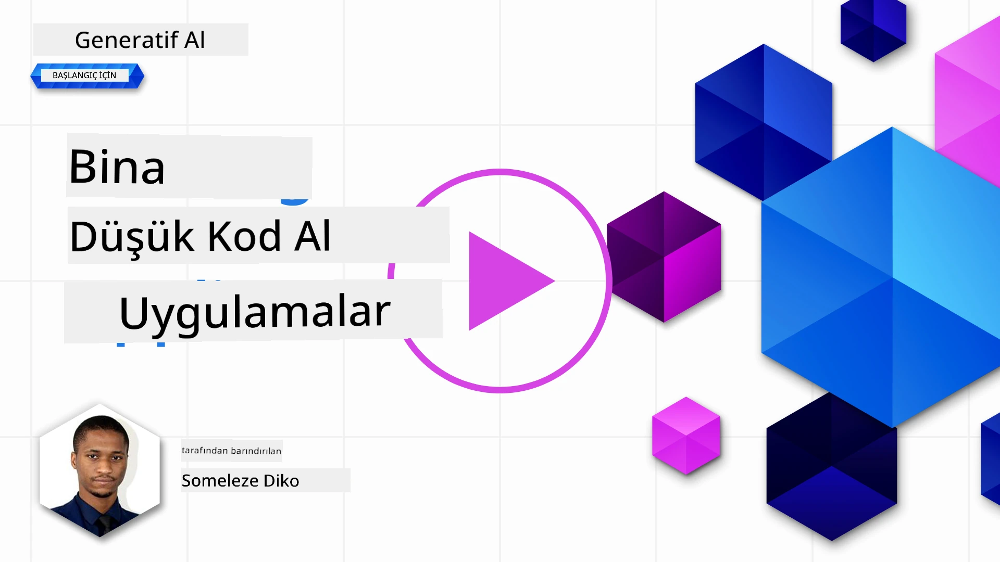](https://youtu.be/1vzq3Nd8GBA?si=h6LHWJXdmqf6mhDg)

> _(Bu dersin videosunu izlemek için yukarıdaki resme tıklayın)_

## Giriş

Artık görüntü üreten uygulamaların nasıl oluşturulacağını öğrendiğimize göre, düşük koddan bahsedelim. Üretken Yapay Zeka, düşük kod dahil olmak üzere çeşitli farklı alanlarda kullanılabilir, peki düşük kod nedir ve ona nasıl yapay zeka ekleyebiliriz?

Uygulama ve çözümler oluşturmak, Düşük Kod Geliştirme Platformları sayesinde geleneksel geliştiriciler ve geliştirici olmayanlar için daha kolay hale geldi. Düşük Kod Geliştirme Platformları, az ya da hiç kod yazmadan uygulama ve çözümler oluşturmanızı sağlar. Bu, uygulama ve çözümleri oluşturmak için bileşenleri sürükleyip bırakmanıza olanak tanıyan görsel bir geliştirme ortamı sunarak gerçekleştirilir. Bu sayede uygulama ve çözümleri daha hızlı ve daha az kaynakla oluşturabilirsiniz. Bu derste, Düşük Kodu nasıl kullanacağımızı ve Power Platform kullanarak düşük kod geliştirmeyi yapay zeka ile nasıl geliştireceğimizi derinlemesine inceleyeceğiz.

Power Platform, kuruluşlara ekiplerini sezgisel bir düşük kodlu ya da kodsuz ortam aracılığıyla kendi çözümlerini oluşturma yetkisi verme fırsatı sunar. Bu ortam, çözüm oluşturma sürecini basitleştirmeye yardımcı olur. Power Platform ile çözümler aylar ya da yıllar yerine günler veya haftalar içinde oluşturulabilir. Power Platform beş temel üründen oluşur: Power Apps, Power Automate, Power BI, Power Pages ve Copilot Studio.

Bu ders şunları kapsar:

- Power Platform'da Üretken Yapay Zekaya Giriş
- Copilot'a giriş ve nasıl kullanılacağı
- Power Platform'da Üretken Yapay Zeka kullanarak uygulama ve akış oluşturma
- AI Builder ile Power Platform'daki Yapay Zeka Modellerini Anlama
- Microsoft Copilot Studio ile akıllı ajanlar oluşturma

## Öğrenme Hedefleri

Bu dersin sonunda şunları yapabileceksiniz:

- Power Platform'da Copilot'un nasıl çalıştığını anlamak.

- Eğitim girişimimiz için bir Öğrenci Ödev Takipçisi Uygulaması oluşturmak.

- Faturalardan bilgi çıkarmak için yapay zeka kullanan bir Fatura İşleme Akışı oluşturmak.

- Create Text with GPT Yapay Zeka Modeli kullanırken en iyi uygulamaları uygulamak.

- Microsoft Copilot Studio'nun ne olduğunu ve onunla nasıl akıllı ajanlar oluşturabileceğinizi anlamak.

Bu derste kullanacağınız araçlar ve teknolojiler şunlardır:

- **Power Apps**, öğrenci ödev takip uygulaması için; verileri izlemek, yönetmek ve etkileşimde bulunmak için düşük kodlu bir geliştirme ortamı sağlar.

- **Dataverse**, öğrenci ödev takip uygulamasının verilerini depolamak için; uygulamanın verilerini depolamak için düşük kodlu bir veri platformu sağlar.

- **Power Automate**, fatura işleme akışı için; fatura işleme sürecini otomatikleştirmek için düşük kodlu çalışma akışları oluşturma ortamı sağlar.

- **AI Builder**, fatura işleme yapay zeka modeli için; önceden hazırlanmış yapay zeka modellerini kullanarak faturaları işlemenize yardımcı olur.

## Power Platform'da Üretken Yapay Zeka

Düşük kodlu geliştirmeyi ve uygulamayı üretken yapay zeka ile geliştirmek, Power Platform'un önemli bir odak alanıdır. Hedef, herkesin veri bilimi uzmanlığı gerektirmeden AI güdümlü uygulamalar, siteler, gösterge panoları oluşturmasını ve süreçleri yapay zeka ile otomatikleştirmesini sağlamaktır. Bu hedef, Copilot ve AI Builder biçiminde üretken yapay zekanın Power Platform'daki düşük kodlu geliştirme deneyimine entegre edilmesiyle gerçekleştirilir.

### Bu nasıl çalışır?

Copilot, gereksinimlerinizi doğal dil kullanarak bir dizi sohbet adımıyla tanımlayarak Power Platform çözümleri oluşturmanızı sağlayan yapay zeka asistanıdır. Örneğin AI asistanınıza uygulamanızın hangi alanları kullanacağını söyleyebilir, böylece uygulamayı ve temel veri modelini oluşturabilir veya Power Automate’te bir akışın nasıl ayarlanacağını belirtebilirsiniz.

Copilot tarafından yönlendirilen işlevleri, kullanıcıların sohbet yoluyla içgörü keşfetmesine izin vermek için uygulama ekranlarınıza bir özellik olarak ekleyebilirsiniz.

AI Builder, Power Platform'da kullanabileceğiniz düşük kodlu bir yapay zeka yeteneğidir; yapay zeka modellerini kullanarak süreçleri otomatikleştirmenize ve sonuçları tahmin etmenize yardımcı olur. AI Builder ile Dataverse'teki veya SharePoint, OneDrive veya Azure gibi çeşitli bulut veri kaynaklarına bağlanan uygulamalarınıza ve akışlarınıza yapay zeka ekleyebilirsiniz.

Copilot, Power Platform ürünlerinin tamamında mevcuttur: Power Apps, Power Automate, Power BI, Power Pages ve Copilot Studio (eski adıyla Power Virtual Agents). AI Builder ise Power Apps ve Power Automate'te bulunur. Bu derste, eğitim girişimimiz için bir çözüm oluşturmak amacıyla Power Apps ve Power Automate'te Copilot ve AI Builder'ın nasıl kullanılacağına odaklanacağız.

### Power Apps'te Copilot

Power Platform'un bir parçası olarak Power Apps, verileri izlemek, yönetmek ve etkileşimde bulunmak için uygulamalar oluşturabileceğiniz düşük kodlu bir geliştirme ortamı sağlar. Bulut hizmetlerine ve yerinde veri kaynaklarına bağlanabilen ölçeklenebilir bir veri platformuna sahip uygulama geliştirme hizmetleri paketidir. Power Apps, uygulamaları tarayıcılarda, tabletlerde ve telefonlarda çalıştırmanızı sağlar ve iş arkadaşlarınızla paylaşabilirsiniz. Power Apps, her iş kullanıcısı veya profesyonel geliştiricinin özel uygulamalar oluşturabilmesi için basit bir arayüzle uygulama geliştirmeyi kolaylaştırır. Ayrıca uygulama geliştirme deneyimi, Copilot aracılığıyla Üretken Yapay Zeka ile geliştirilmiştir.

Power Apps'teki copilot yapay zeka asistanı özelliği, ne tür bir uygulamaya ihtiyacınız olduğunu ve uygulamanızın hangi bilgileri takip, toplama veya gösterme istediğinizi tarif etmenize olanak tanır. Copilot ardından açıklamanıza dayanarak duyarlı bir Canvas uygulaması oluşturur. Sonra bu uygulamayı ihtiyaçlarınıza göre özelleştirebilirsiniz. Yapay Zeka Copilot, ayrıca takip etmek istediğiniz verileri depolamak için gerekli alanlarla birlikte örnek veriler içeren bir Dataverse Tablosu da oluşturur ve önerir. Bu derste daha sonra Dataverse'in ne olduğu ve Power Apps'te nasıl kullanılacağına bakacağız. Bu tabloyu sonra sohbet adımları yoluyla AI Copilot asistanı özelliğini kullanarak ihtiyaçlarınıza göre özelleştirebilirsiniz. Bu özellik Power Apps ana ekranından kolayca erişilebilir.

### Power Automate'te Copilot

Power Platform'un bir parçası olarak Power Automate, kullanıcıların uygulamalar ve hizmetler arasında otomatikleştirilmiş iş akışları oluşturmasını sağlar. İletişim, veri toplama ve karar onayları gibi tekrarlayan iş süreçlerini otomatikleştirmeye yardımcı olur. Basit arayüzü, her teknik seviyedeki kullanıcının (başlangıçtan deneyimli geliştiriciye kadar) görevleri otomatikleştirmesine olanak tanır. Akış geliştirme deneyimi, Copilot aracılığıyla Üretken Yapay Zeka ile geliştirilmiştir.

Power Automate'teki copilot yapay zeka asistanı özelliği, ne tür bir akışa ihtiyacınız olduğunu ve akışınızın hangi eylemleri gerçekleştirmesini istediğinizi tarif etmenize olanak tanır. Copilot, açıklamanıza dayalı bir akış oluşturur. Sonra akışı ihtiyaçlarınıza göre özelleştirebilirsiniz. Yapay Zeka Copilot ayrıca otomatikleştirmek istediğiniz görev için gerçekleştirmeniz gereken eylemleri oluşturur ve önerir. Bu derste daha sonra akışların ne olduğunu ve Power Automate'te nasıl kullanılacağını inceleyeceğiz. Siz de bu eylemleri AI Copilot asistanı özelliğini kullanarak sohbet adımları yoluyla ihtiyaçlarınıza göre özelleştirebilirsiniz. Bu özellik Power Automate ana ekranından kolayca erişilebilir.

## Microsoft Copilot Studio ile Akıllı Ajanlar Oluşturma

[Microsoft Copilot Studio](https://learn.microsoft.com/microsoft-copilot-studio/fundamentals-what-is-copilot-studio?WT.mc_id=academic-105485-koreyst) (önceden Power Virtual Agents), kullanıcılar adına soruları yanıtlayabilen, eylemler alabilen ve görevleri otomatikleştirebilen **Yapay Zeka ajanları** — sohbet yardımcıları oluşturmak için Power Platform'un düşük kodlu üyesidir. Diğer Power Platform bileşenleri gibi, bu ajanları görsel, doğal dil odaklı bir deneyimle oluşturursunuz: ajanın ne yapmasını istediğinizi tanımlarsınız ve Copilot Studio, yönergelerini, bilgisini ve eylemlerini yapılandırmanıza yardımcı olur.

Eğitim girişimimiz için, öğrenci sorularını yanıtlayan, ödev teslim tarihlerini kontrol eden ve hatta eğitmene e-posta gönderen (hepsi kod yazmadan) bir ajan oluşturabilirsiniz.

İşte Copilot Studio’yu güçlü kılan en son özelliklerden bazıları:

- **Bilginizden üretken yanıtlar**. Her sohbeti el ile yazmak yerine, **bilgi kaynaklarını** — genel web siteleri, SharePoint, OneDrive, Dataverse, yüklenen dosyalar veya bağlayıcılar yoluyla kurumsal veriler — bağlayabilirsiniz ve ajan bu kaynaklardan temel alan yanıtlar üretir.

- **Üretken orkestrasyon**. Katı tetikleyici ifadelerine bağlı kalmayarak, ajan bir isteği AI ile anlayıp yerine getirmek için hangi bilgi, konu ve eylemleri birleştireceğine dinamik olarak karar verir; birden çok adımı zincirleme dahil.

- **Eylemler ve bağlayıcılar**. Ajanlar sadece sohbet etmekle kalmaz, aynı zamanda *işleri de yapabilir*. Ajanlara 1500'den fazla önceden yapılmış Power Platform bağlayıcısı, Power Automate akışları, özel REST API’leri, istemler veya **Model Context Protocol (MCP)** sunucuları tarafından desteklenen eylemler verebilirsiniz.

- **Otonom ajanlar**. Ajanlar sadece sohbet penceresinde yanıt vermekle sınırlı değildir. Yeni e-posta, Dataverse'de yeni kayıt veya dosya yüklenmesi gibi olaylarla tetiklenen **otonom ajanlar** oluşturabilir ve sonra görevi tamamlamak için arka planda hareket edebilir.

- **Çoklu ajan orkestrasyonu**. Ajanlar başka ajanları çağırabilir. Bir Copilot Studio ajanı, Microsoft 365 Copilot'ta yayımlanan veya Microsoft Foundry'de oluşturulan diğer ajanlar tarafından devralınabilir veya genişletilebilir.

- **Model seçimi**. Dahili modellerin ötesinde, ajanınızın mantık yürütme ve yanıt verme şeklini özelleştirmek için Microsoft Foundry model kataloğundan modeller getirebilirsiniz.

- **Her yere yayınlama**. Oluşturulduktan sonra bir ajan, Microsoft Teams, Microsoft 365 Copilot, bir web sitesi ya da özel uygulama gibi birden fazla kanala yayımlanabilir; güvenlik, kimlik doğrulama ve analiz Power Platform yönetici deneyimiyle yönetilir.

İlk ajanınızı [copilotstudio.microsoft.com](https://copilotstudio.microsoft.com?WT.mc_id=academic-105485-koreyst) adresinde oluşturmaya başlayabilir ve daha fazlasını [Microsoft Copilot Studio dokümanlarında](https://learn.microsoft.com/microsoft-copilot-studio/?WT.mc_id=academic-105485-koreyst) öğrenebilirsiniz.

## Ödev: Girişimimiz için öğrenci ödevleri ve faturalarını Copilot kullanarak yönetin

Girişimimiz öğrencilere çevrimiçi kurslar sağlar. Girişim hızla büyüdü ve kurslara olan talebi karşılamakta zorlanıyor. Girişim sizi, öğrenci ödevlerini ve faturalarını yönetmelerine yardımcı olacak düşük kodlu bir çözüm oluşturmak için Power Platform geliştiricisi olarak işe aldı. Çözümümüz, öğrencilerin ödevlerini bir uygulama aracılığıyla takip edip yönetmelerine ve fatura işleme sürecini bir iş akışıyla otomatikleştirmelerine yardım etmeli. Çözüm için Üretken Yapay Zeka kullanmanız istendi.

Copilot kullanmaya başlarken, başlangıç için istemleri alabileceğiniz [Power Platform Copilot Prompt Library](https://github.com/pnp/powerplatform-prompts?WT.mc_id=academic-109639-somelezediko) kütüphanesini kullanabilirsiniz. Bu kütüphane, Copilot ile uygulama ve akış oluşturmak için kullanabileceğiniz istemlerin bir listesini içerir. Ayrıca bu kütüphanedeki istemleri, gereksinimlerinizi Copilot'a nasıl tarif edeceğiniz konusunda fikir edinmek için de kullanabilirsiniz.

### Girişimimiz için Bir Öğrenci Ödev Takip Uygulaması Oluşturun

Girişimimizdeki eğitimciler öğrenci ödevlerini takip etmekte zorlanıyorlar. Ödevleri takip etmek için bir tablo kullandılar ama öğrenci sayısı arttıkça yönetmesi zorlaştı. Sizden, öğrenci ödevlerini takip ve yönetmelerine yardımcı olacak bir uygulama oluşturmanız istendi. Uygulama, yeni ödev eklemeye, ödevleri görüntülemeye, güncellemeye ve silmeye izin vermeli. Ayrıca eğitimciler ve öğrenciler, notlandırılan ve notlandırılmayan ödevleri görebilmelidir.

Uygulamayı Power Apps'te Copilot kullanarak aşağıdaki adımları izleyerek oluşturacaksınız:

1. [Power Apps](https://make.powerapps.com?WT.mc_id=academic-105485-koreyst) ana ekranına gidin.

1. Ana ekranda yer alan metin alanını kullanarak oluşturmak istediğiniz uygulamayı tanımlayın. Örneğin, **_Öğrenci ödevlerini takip ve yönetmek için bir uygulama oluşturmak istiyorum_** yazın. İstem gönderme butonuna tıklayarak istemi AI Copilot'a gönderin.

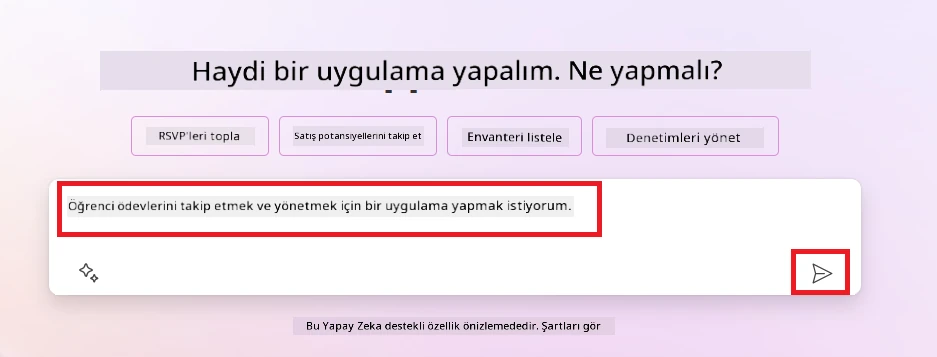

1. AI Copilot, takip etmek istediğiniz verileri depolamak için gerekli alanlarla ve örnek verilerle bir Dataverse Tablosu önerir. Sohbet adımları yoluyla AI Copilot asistan özelliğini kullanarak tabloyu ihtiyaçlarınıza göre özelleştirebilirsiniz.

   > **Önemli**: Dataverse, Power Platform’un altında yatan veri platformudur. Uygulamanın verilerini depolamak için düşük kodlu bir veri platformudur. Microsoft Bulutu'nda güvenli bir şekilde veri depolayan tamamen yönetilen bir hizmettir ve Power Platform ortamınız içinde sağlanır. Veri sınıflandırması, veri kökeni, ayrıntılı erişim kontrolü gibi yerleşik veri yönetim yetenekleri ile birlikte gelir. Dataverse hakkında daha fazla bilgiyi [buradan](https://docs.microsoft.com/powerapps/maker/data-platform/data-platform-intro?WT.mc_id=academic-109639-somelezediko) öğrenebilirsiniz.

   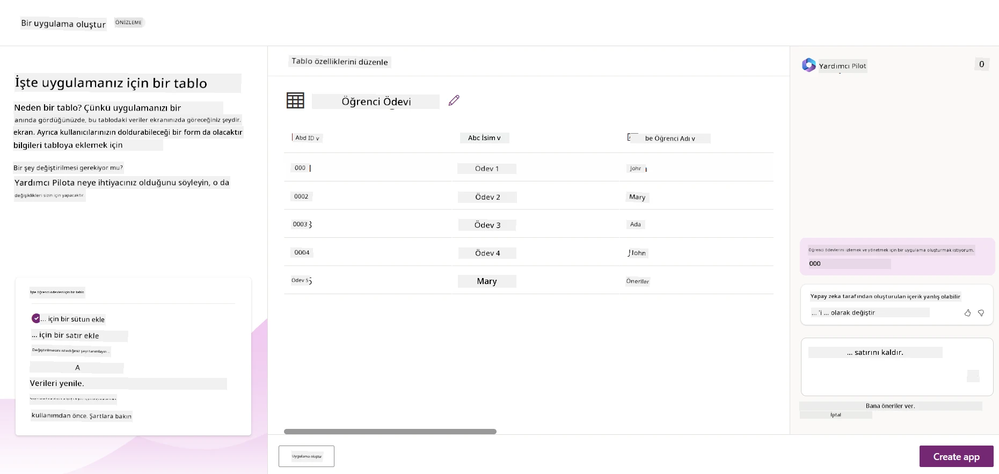

1. Eğitimciler, ödevlerini gönderen öğrencilere e-posta gönderip onları ödev ilerlemeleri hakkında bilgilendirmek istiyor. Copilot’u kullanarak öğrenci e-postasını depolamak için tabloya yeni bir alan ekleyebilirsiniz. Örneğin, tabloya yeni bir alan eklemek için şu istemi kullanabilirsiniz: **_Öğrenci e-postasını depolamak için bir sütun eklemek istiyorum_**. İstem gönderme butonuna tıklayarak istemi AI Copilot'a gönderin.

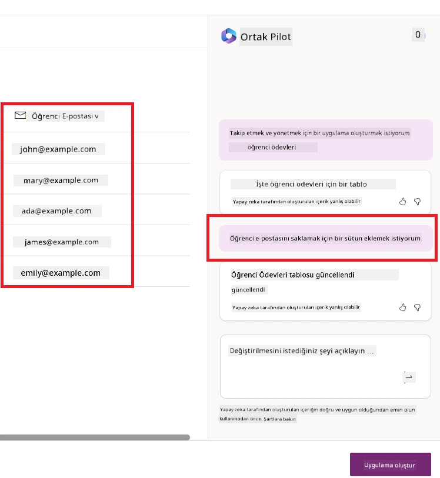

1. AI Copilot yeni bir alan oluşturur ve ardından bu alanı ihtiyaçlarınıza göre özelleştirebilirsiniz.

1. Tablonun işi bittikten sonra, uygulamayı oluşturmak için **Uygulama oluştur** düğmesine tıklayın.

1. AI Copilot tanımınıza dayalı olarak duyarlı bir Canvas uygulaması oluşturacaktır. Ardından uygulamayı ihtiyaçlarınıza göre özelleştirebilirsiniz.

1. Öğretmenlerin öğrencilere e-posta gönderebilmesi için, uygulamaya yeni bir ekran eklemek üzere Copilot'u kullanabilirsiniz. Örneğin, uygulamaya yeni bir ekran eklemek için aşağıdaki istemi kullanabilirsiniz: **_Öğrencilere e-posta göndermek için bir ekran eklemek istiyorum_**. İstemi AI Copilot'a göndermek için **Gönder** düğmesine tıklayın.

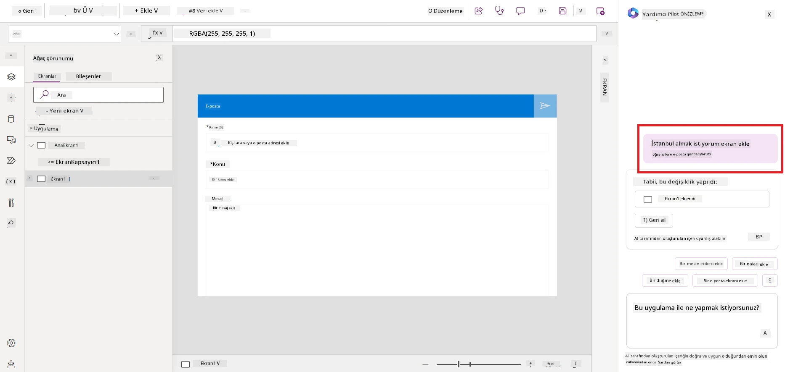

1. AI Copilot yeni bir ekran oluşturacak ve ardından ekranı ihtiyaçlarınıza göre özelleştirebilirsiniz.

1. Uygulama işi bittikten sonra, uygulamayı kaydetmek için **Kaydet** düğmesine tıklayın.

1. Uygulamayı öğretmenlerle paylaşmak için **Paylaş** düğmesine, ardından tekrar **Paylaş** düğmesine tıklayın. Ardından, uygulamayı öğretmenlerle e-posta adreslerini girerek paylaşabilirsiniz.

> **Ödeviniz**: Şimdi oluşturduğunuz uygulama iyi bir başlangıçtır ancak geliştirilebilir. E-posta özelliğiyle öğretmenler, öğrencilere e-postaları elle yazmak zorunda olarak gönderebiliyorlar. Copilot'u kullanarak, öğretmenlerin teslim ettikleri ödevler üzerinden öğrencilere otomatik olarak e-posta gönderebilmesini sağlayacak bir otomasyon oluşturabilir misiniz? İpucunuz: doğru istemle Copilot'u Power Automate'te kullanabilirsiniz.

### Startup'ımız için Fatura Bilgileri Tablosu Oluşturma

Startup'ımızın finans ekibi, faturaları takip etmekte zorlanıyordu. Faturaları takip etmek için bir tablo kullanıyorlardı ama fatura sayısının artmasıyla yönetmek zorlaştı. Onlar, aldıkları faturaların bilgilerini depolayıp, takip edip, yönetmelerine yardımcı olacak bir tablo oluşturmanızı istedi. Tablo, tüm fatura bilgilerini çıkaracak bir otomasyon oluşturmak için kullanılacak. Ayrıca tablo, finans ekibinin ödenen ve ödenmeyen faturaları görmesini sağlayacak.

Power Platform'un altında, uygulamalarınız ve çözümleriniz için verileri saklamanıza olanak veren Dataverse adında bir veri platformu vardır. Dataverse, uygulamanın verilerini depolamak için düşük kodlu bir veri platformu sağlar. Microsoft Bulutunda verileri güvenli bir şekilde saklayan ve Power Platform ortamınızda sağlanan tam yönetilen bir hizmettir. Veri sınıflandırması, veri kaynağı belirtme, ince taneli erişim kontrolü gibi yerleşik veri yönetişimi özellikleriyle birlikte gelir. Dataverse hakkında daha fazla bilgiyi [buradan öğrenebilirsiniz](https://docs.microsoft.com/powerapps/maker/data-platform/data-platform-intro?WT.mc_id=academic-109639-somelezediko).

Startup'ımız için neden Dataverse kullanmalıyız? Dataverse'teki standart ve özel tablolar, verileriniz için güvenli ve bulut tabanlı bir depolama seçeneği sunar. Tablolar, bir Excel çalışma kitabında birden fazla çalışma sayfası kullanmanıza benzer şekilde farklı veri türlerini depolamanıza olanak sağlar. Tabloları, organizasyonunuzun ya da işletmenizin özel veri ihtiyaçları için kullanabilirsiniz. Startup'ımızın Dataverse kullanarak elde edeceği bazı avantajlar şunlardır:

- **Kolay yönetim**: Hem meta veriler hem de veriler bulutta saklanır, böylece nasıl saklandıklarını ya da yönetildiklerini düşünmek zorunda kalmazsınız. Uygulamalarınızı ve çözümlerinizi geliştirmeye odaklanabilirsiniz.

- **Güvenli**: Dataverse, verileriniz için güvenli ve bulut tabanlı bir depolama seçeneği sunar. Tablo verilerine kimin erişeceğini ve nasıl erişeceğini rol tabanlı güvenlikle kontrol edebilirsiniz.

- **Zengin meta veri**: Veri türleri ve ilişkiler doğrudan Power Apps içinde kullanılır.

- **Mantık ve doğrulama**: İş kurallarını, hesaplanmış alanları ve doğrulama kurallarını kullanarak iş mantığını uygulayabilir ve veri doğruluğunu sürdürebilirsiniz.

Artık Dataverse'in ne olduğunu ve neden kullanmanız gerektiğini bildiğinize göre, finans ekibimizin ihtiyaçlarını karşılamak üzere Dataverse'te bir tablo oluşturmak için Copilot'u nasıl kullanabileceğinize bakalım.

> **Not**: Bir sonraki bölümde, tüm fatura bilgilerini çıkarıp tabloya depolayacak bir otomasyon oluşturmak için bu tabloyu kullanacaksınız.

Copilot kullanarak Dataverse'te tablo oluşturmak için aşağıdaki adımları izleyin:

1. [Power Apps](https://make.powerapps.com?WT.mc_id=academic-105485-koreyst) ana ekranına gidin.

2. Sol gezinti çubuğunda **Tablolar** kısmını seçin ve ardından **Yeni Tabloyu Tanımla** seçeneğine tıklayın.

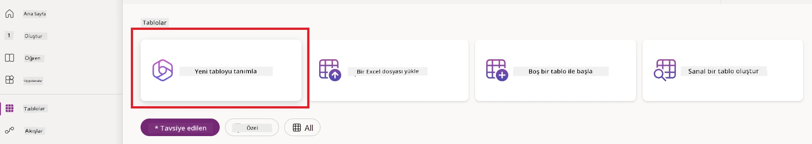

1. **Yeni Tabloyu Tanımla** ekranında, oluşturmak istediğiniz tabloyu tanımlamak için metin alanını kullanın. Örneğin, **_Fatura bilgilerini depolamak için tablo oluşturmak istiyorum_**. İstemi AI Copilot'a göndermek için **Gönder** düğmesine tıklayın.

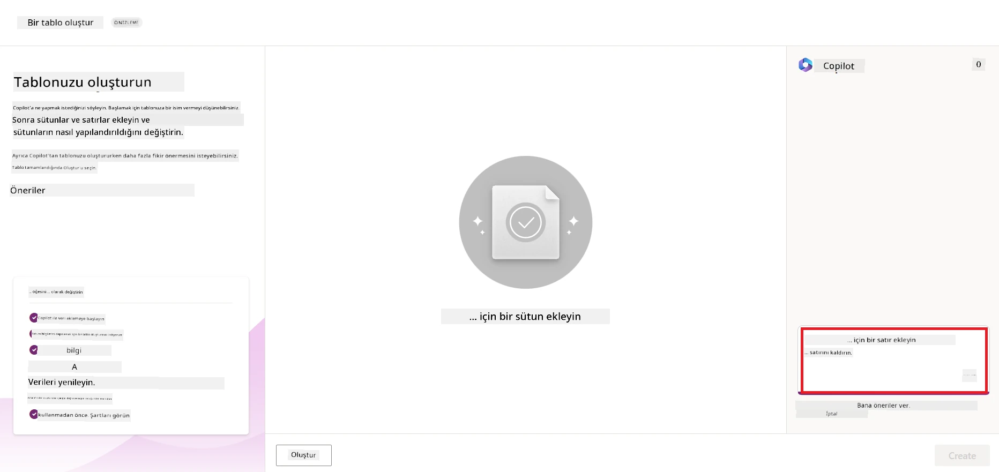

1. AI Copilot, takip etmek istediğiniz verileri depolamak için alanları olan ve bazı örnek verilere sahip bir Dataverse Tablosu önerecektir. Ardından, AI Copilot yardımcısı özelliğini kullanarak diyalog adımlarıyla tabloyu ihtiyaçlarınıza göre özelleştirebilirsiniz.

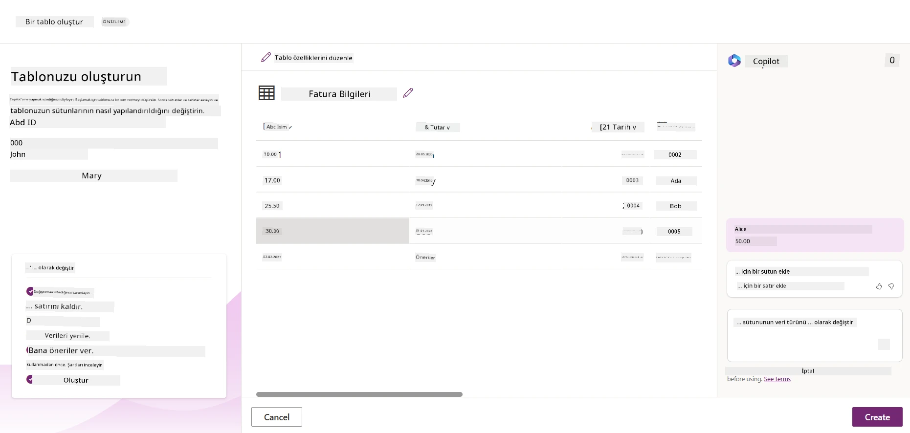

1. Finans ekibi, tedarikçiye faturasının mevcut durumu hakkında güncelleme e-postası göndermek istiyor. Tabloda tedarikçi e-posta adresini depolamak için Copilot'u yeni bir alan eklemek üzere kullanabilirsiniz. Örneğin, tabloya yeni bir alan eklemek için aşağıdaki istemi kullanabilirsiniz: **_Tedarikçi e-postasını depolamak için bir sütun eklemek istiyorum_**. İstemi AI Copilot'a göndermek için **Gönder** düğmesine tıklayın.

1. AI Copilot yeni bir alan oluşturacak ve ardından alanı ihtiyaçlarınıza göre özelleştirebilirsiniz.

1. Tablonun işi bittikten sonra, tabloyu oluşturmak için **Oluştur** düğmesine tıklayın.

## Power Platform'da AI Builder ile AI Modelleri

AI Builder, Power Platform'da bulunan düşük kodlu bir AI yeteneğidir ve AI Modellerini kullanarak süreçleri otomatikleştirmenize ve sonuçları tahmin etmenize olanak sağlar. AI Builder ile Dataverse veya SharePoint, OneDrive veya Azure gibi çeşitli bulut veri kaynaklarına bağlanan uygulamalarınıza ve akışlarınıza AI getirebilirsiniz.

## Önceden Oluşturulmuş AI Modelleri ve Özel AI Modelleri

AI Builder iki tür AI Modeli sunar: Önceden Oluşturulmuş AI Modelleri ve Özel AI Modelleri. Önceden Oluşturulmuş AI Modelleri, Microsoft tarafından eğitilmiş ve Power Platform'da kullanıma hazır AI modelleridir. Bunlar size veri toplama, model oluşturma, eğitme ve yayınlama işlemleri olmadan uygulamalarınıza ve akışlarınıza zeka eklemenizde yardımcı olur. Bu modelleri süreçleri otomatikleştirmek ve sonuçları tahmin etmek için kullanabilirsiniz.

Power Platform'da bulunan bazı Önceden Oluşturulmuş AI Modelleri şunlardır:

- **Anahtar İfade Çıkartma**: Metinden anahtar ifadeleri çıkarır.
- **Dil Tespiti**: Bir metnin dilini tespit eder.
- **Duygu Analizi**: Metindeki olumlu, olumsuz, nötr veya karışık duyguları tespit eder.
- **Kartvizit Okuyucu**: Kartvizitlerden bilgileri çıkarır.
- **Metin Tanıma**: Görsellerden metin çıkarır.
- **Nesne Tespiti**: Görsellerden nesneleri tespit eder ve çıkarır.
- **Belge İşleme**: Formlardan bilgileri çıkarır.
- **Fatura İşleme**: Faturalardan bilgileri çıkarır.

Özel AI Modelleri ile, kendi modelinizi AI Builder'a getirebilir ve kendi verilerinizle modelinizi eğitebilirsiniz. Bu modelleri hem Power Apps hem de Power Automate'te kullanarak süreçleri otomatikleştirebilir ve sonuçları tahmin edebilirsiniz. Kendi modelinizi kullanırken bazı kısıtlamalar geçerlidir. Bu kısıtlamalar hakkında daha fazla bilgi almak için [burayı okuyabilirsiniz](https://learn.microsoft.com/ai-builder/byo-model#limitations?WT.mc_id=academic-105485-koreyst).

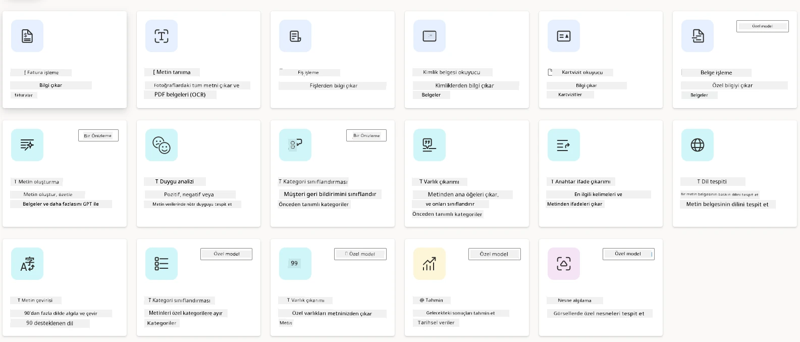

## Ödev #2 - Startup'ımız için Fatura İşleme Akışı Oluşturma

Finans ekibi, faturaları işlemekte zorlanıyor. Faturaları takip etmek için bir tablo kullanıyorlardı ancak fatura sayısı arttıkça yönetmek zorlaştı. AI kullanarak faturaları işlemelerine yardımcı olacak bir iş akışı oluşturmanızı istediler. İş akışı, faturalardan bilgileri çıkarmalı ve bu bilgileri bir Dataverse tablosuna kaydetmelidir. Ayrıca, çıkarılan bilgiyle finans ekibine e-posta göndermeye de olanak sağlamalıdır.

AI Builder'ın ne olduğunu ve neden kullanmanız gerektiğini bildiğinize göre, önceden incelediğimiz Fatura İşleme AI Modelini kullanarak finans ekibinin faturaları işlemesine yardımcı olacak bir iş akışı oluşturmaya bakalım.

Fatura İşleme AI Modelini kullanarak finans ekibinin faturaları işlemesine yardımcı olacak bir iş akışı oluşturmak için aşağıdaki adımları izleyin:

1. [Power Automate](https://make.powerautomate.com?WT.mc_id=academic-105485-koreyst) ana ekranına gidin.

2. Ana ekrandaki metin alanını kullanarak oluşturmak istediğiniz iş akışını tanımlayın. Örneğin, **_Posta kutuma gelen fatura için işlem yap_**. İstemi AI Copilot'a göndermek için **Gönder** düğmesine tıklayın.

   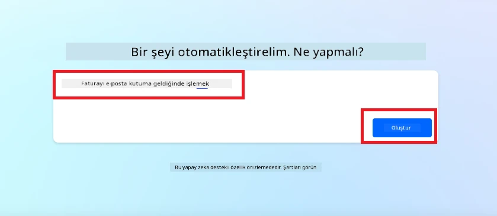

3. AI Copilot, otomatikleştirmek istediğiniz görevi gerçekleştirmek için yapmanız gereken işlemleri önerecektir. Sonraki adımlara geçmek için **İleri** düğmesine tıklayabilirsiniz.

4. Bir sonraki adımda, Power Automate akış için gerekli bağlantıları kurmanızı isteyecektir. İşiniz bittiğinde, akışı oluşturmak için **Akış oluştur** düğmesine tıklayın.

5. AI Copilot bir akış oluşturacaktır ve ardından akışı ihtiyaçlarınıza göre özelleştirebilirsiniz.

6. Akışın tetikleyicisini güncelleyin ve **Klasör**ü faturaların saklanacağı klasöre ayarlayın. Örneğin, klasörü **Gelen Kutusu** yapabilirsiniz. **Gelişmiş seçenekleri göster** seçeneğine tıklayın ve **Sadece ekleri olanlar** değerini **Evet** olarak belirleyin. Bu, yalnızca ekli e-posta alındığında akışın çalışmasını sağlar.

7. Akıştan aşağıdaki işlemleri kaldırın: **HTML'den metine**, **Compose**, **Compose 2**, **Compose 3** ve **Compose 4** çünkü bunları kullanmayacaksınız.

8. Akıştan **Koşul** işlemini kaldırın çünkü onu da kullanmayacaksınız. Görüntü aşağıdaki gibi olmalıdır:

   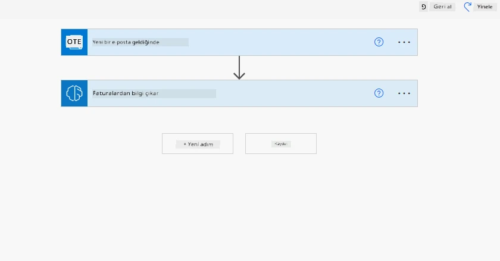

9. **Bir işlem ekle** düğmesine tıklayın ve **Dataverse** arayın. **Yeni bir satır ekle** işlemini seçin.

10. **Faturalardan Bilgi Çıkar** işleminde, **Fatura Dosyası** alanını e-postadan gelen **Ek İçeriği**ne yönlendirin. Bu, akışın fatura ekinden bilgi çıkarmasını sağlar.

11. Daha önce oluşturduğunuz **Tablo**yu seçin. Örneğin, **Fatura Bilgileri** tablosunu seçebilirsiniz. Aşağıdaki alanları doldurmak için önceki işlemden dinamik içeriği seçin:

    - ID
    - Tutar
    - Tarih
    - İsim
    - Durum - **Durum** alanını **Beklemede** olarak ayarlayın.
    - Tedarikçi E-Postası - **Yeni bir e-posta geldiğinde** tetikleyicisinden **Kimden** dinamik içeriğini kullanın.

    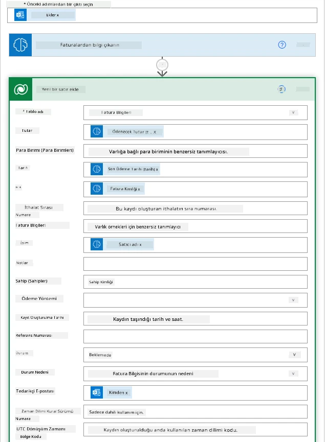

12. Akış işi bittikten sonra, akışı kaydetmek için **Kaydet** düğmesine tıklayın. Ardından, tetikleyicide belirttiğiniz klasöre bir fatura içeren e-posta göndererek akışı test edebilirsiniz.

> **Ödeviniz**: Oluşturduğunuz akış iyi bir başlangıçtır, şimdi finans ekibimizin tedarikçiye faturasının mevcut durumu hakkında e-posta göndermesini sağlayacak bir otomasyon oluşturmayı düşünmelisiniz. İpucunuz: akış, fatura durumu değiştiğinde çalışmalıdır.

## Power Automate'te Metin Üretme AI Modeli Kullanma

AI Builder'daki GPT ile Metin Oluşturma AI Modeli, bir isteme göre metin üretebilmenizi sağlar ve Microsoft Azure OpenAI Servisi tarafından desteklenir. Bu özellik ile GPT (Üretici Önceden Eğitilmiş Dönüştürücü) teknolojisini uygulamalarınıza ve akışlarınıza entegre ederek çeşitli otomatik akışlar ve içgörülü uygulamalar oluşturabilirsiniz.

GPT modelleri, çok büyük veri kümeleri üzerinde kapsamlı eğitimden geçirilmiş olup, kendilerine verilen bir isteme göre insan diline çok yakın metinler üretebilir. İş akışı otomasyonuyla entegre edildiğinde GPT gibi AI modelleri, çok çeşitli görevleri kolaylaştırmak ve otomatikleştirmek için kullanılabilir.

Örneğin, e-postaların taslaklarını, ürün açıklamalarını ve daha fazlasını otomatik olarak oluşturmak için akışlar yapabilirsiniz. Ayrıca, müşteri hizmetleri temsilcilerinin müşteri taleplerine etkili ve verimli yanıt vermesini sağlayan sohbet botları ve müşteri hizmetleri uygulamaları gibi çeşitli uygulamalarda metin üretmek için modeli kullanabilirsiniz.

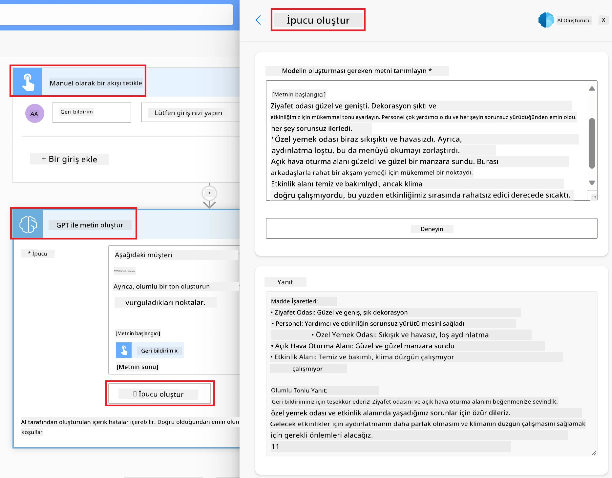

Power Automate'ta bu AI Modelini nasıl kullanacağınızı öğrenmek için [AI Builder ve GPT ile zekayı artırma](https://learn.microsoft.com/training/modules/ai-builder-text-generation/?WT.mc_id=academic-109639-somelezediko) modülüne göz atın.

## Harika İş! Öğrenmeye Devam Et

Bu dersi tamamladıktan sonra, Generatif AI bilginizi artırmaya devam etmek için [Generative AI Öğrenme koleksiyonumuza](https://aka.ms/genai-collection?WT.mc_id=academic-105485-koreyst) göz atın!

Copilot'u kişiselleştirmek ve daha fazlasını elde etmek ister misiniz? GitHub Copilot'tan en iyi şekilde yararlanmanıza yardımcı olmak için topluluk tarafından oluşturulan talimatlar, ajanlar, beceriler ve yapılandırmalardan oluşan [Harika Copilot](https://github.com/github/awesome-copilot?WT.mc_id=academic-105485-koreyst) koleksiyonunu keşfedin.

Generatif AI'yı Fonksiyon Çağrısı ile nasıl entegre edeceğimizi göreceğimiz 11. Derse gidin! (../11-integrating-with-function-calling/README.md?WT.mc_id=academic-105485-koreyst)

---

<!-- CO-OP TRANSLATOR DISCLAIMER START -->
**Feragatname**:
Bu belge, AI çeviri hizmeti [Co-op Translator](https://github.com/Azure/co-op-translator) kullanılarak çevrilmiştir. Doğruluk için çaba sarf etsek de, otomatik çevirilerin hata veya yanlışlık içerebileceğini lütfen unutmayınız. Orijinal belge, kendi dilinde yetkili kaynak olarak kabul edilmelidir. Kritik bilgiler için profesyonel insan çevirisi önerilir. Bu çevirinin kullanımı sonucu ortaya çıkabilecek yanlış anlamalardan veya yanlış yorumlamalardan sorumlu değiliz.
<!-- CO-OP TRANSLATOR DISCLAIMER END -->