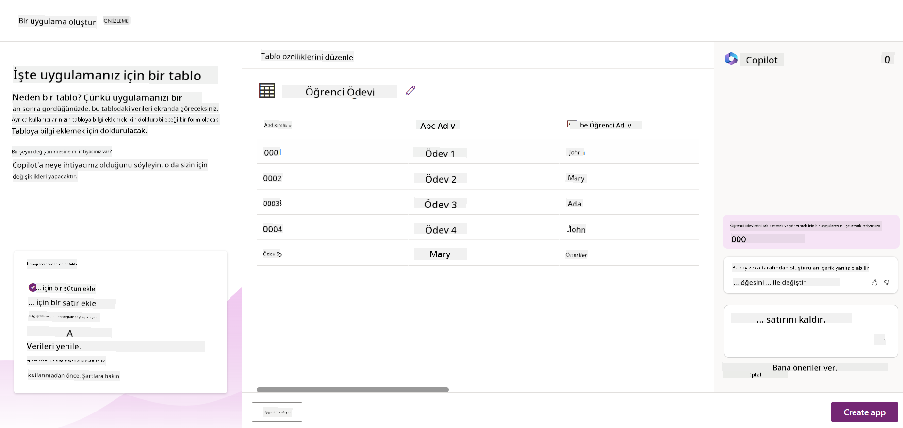
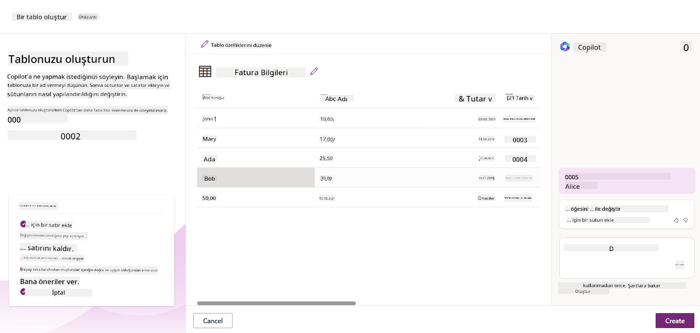
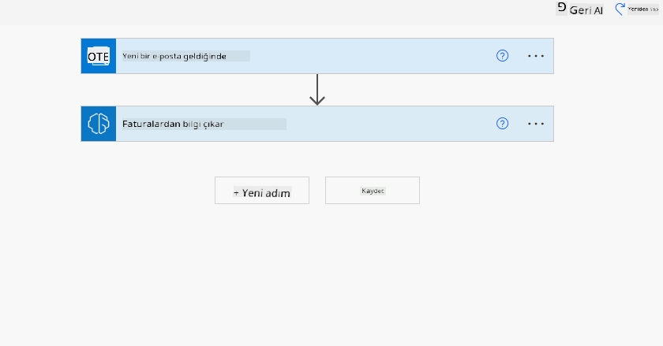

<!--
CO_OP_TRANSLATOR_METADATA:
{
  "original_hash": "846ac8e3b7dcfb697d3309fec05f0fea",
  "translation_date": "2025-10-17T16:20:02+00:00",
  "source_file": "10-building-low-code-ai-applications/README.md",
  "language_code": "tr"
}
-->
# Düşük Kodlu Yapay Zeka Uygulamaları Oluşturma

> _(Bu dersin videosunu izlemek için yukarıdaki görsele tıklayın)_

## Giriş

Artık görüntü üreten uygulamalar oluşturmayı öğrendiğimize göre, düşük kod konusunu konuşalım. Üretken yapay zeka, düşük kod dahil olmak üzere birçok farklı alanda kullanılabilir, ancak düşük kod nedir ve yapay zekayı buna nasıl ekleyebiliriz?

Düşük Kod Geliştirme Platformları sayesinde geleneksel geliştiriciler ve geliştirici olmayanlar için uygulama ve çözümler oluşturmak daha kolay hale geldi. Düşük Kod Geliştirme Platformları, az kod veya hiç kod kullanmadan uygulamalar ve çözümler oluşturmanıza olanak tanır. Bu, uygulamalar ve çözümler oluşturmak için bileşenleri sürükleyip bırakmanıza olanak tanıyan görsel bir geliştirme ortamı sağlayarak gerçekleştirilir. Bu, uygulamaları ve çözümleri daha hızlı ve daha az kaynakla oluşturmanıza olanak tanır. Bu derste, Düşük Kod'u nasıl kullanacağımızı ve Power Platform'u kullanarak düşük kod geliştirmeyi yapay zeka ile nasıl geliştirebileceğimizi derinlemesine inceleyeceğiz.

Power Platform, ekiplerin kendi çözümlerini sezgisel bir düşük kodlu veya kodsuz ortamda oluşturmalarını sağlayarak kuruluşlara güç verir. Bu ortam, çözüm oluşturma sürecini basitleştirmeye yardımcı olur. Power Platform ile çözümler aylar veya yıllar yerine günler veya haftalar içinde oluşturulabilir. Power Platform beş ana üründen oluşur: Power Apps, Power Automate, Power BI, Power Pages ve Copilot Studio.

Bu derste şunlar ele alınacaktır:

- Power Platform'da Üretken Yapay Zekaya Giriş
- Copilot'a giriş ve nasıl kullanılacağı
- Power Platform'da uygulamalar ve akışlar oluşturmak için Üretken Yapay Zeka kullanımı
- AI Builder ile Power Platform'daki Yapay Zeka Modellerini Anlama

## Öğrenme Hedefleri

Bu dersin sonunda şunları yapabileceksiniz:

- Power Platform'da Copilot'un nasıl çalıştığını anlayın.

- Eğitim girişimimiz için bir Öğrenci Ödev Takip Uygulaması oluşturun.

- Faturalardan bilgi çıkarmak için yapay zeka kullanan bir Fatura İşleme Akışı oluşturun.

- GPT Yapay Zeka Modeli ile Metin Oluşturma kullanırken en iyi uygulamaları uygulayın.

Bu derste kullanacağınız araçlar ve teknolojiler şunlardır:

- **Power Apps**, eğitim girişimimiz için Öğrenci Ödev Takip uygulaması oluşturmak için düşük kodlu bir geliştirme ortamı sağlar. Bu araç, verileri takip etmek, yönetmek ve etkileşimde bulunmak için uygulamalar oluşturmanıza olanak tanır.

- **Dataverse**, Öğrenci Ödev Takip uygulaması için verileri depolamak amacıyla düşük kodlu bir veri platformu sağlar.

- **Power Automate**, Fatura İşleme akışı için düşük kodlu bir geliştirme ortamı sunar. Bu araç, fatura işleme sürecini otomatikleştirmek için iş akışları oluşturmanıza olanak tanır.

- **AI Builder**, Fatura İşleme Yapay Zeka Modeli için önceden oluşturulmuş yapay zeka modellerini kullanarak girişimimiz için faturaları işlemek amacıyla yapay zeka kullanmanıza olanak tanır.

## Power Platform'da Üretken Yapay Zeka

Düşük kod geliştirme ve uygulamaları üretken yapay zeka ile geliştirmek, Power Platform'un odaklandığı önemli bir alan. Amaç, herkesin veri bilimi uzmanlığı gerektirmeden yapay zeka destekli uygulamalar, siteler, panolar oluşturmasını ve süreçleri otomatikleştirmesini sağlamaktır. Bu hedef, Power Platform'daki düşük kod geliştirme deneyimine Copilot ve AI Builder şeklinde üretken yapay zekanın entegre edilmesiyle gerçekleştirilir.

### Bu nasıl çalışır?

Copilot, doğal dil kullanarak gereksinimlerinizi bir dizi konuşma adımıyla açıklayarak Power Platform çözümleri oluşturmanıza olanak tanıyan bir yapay zeka asistanıdır. Örneğin, yapay zeka asistanınıza uygulamanızın hangi alanları kullanacağını söyleyebilir ve hem uygulamayı hem de temel veri modelini oluşturmasını sağlayabilirsiniz. Ya da Power Automate'de bir akışın nasıl ayarlanacağını belirtebilirsiniz.

Copilot destekli işlevleri, kullanıcıların konuşma etkileşimleri yoluyla içgörüler elde etmelerini sağlamak için uygulama ekranlarınızda bir özellik olarak kullanabilirsiniz.

AI Builder, Power Platform'da mevcut olan düşük kodlu bir yapay zeka yeteneğidir ve süreçleri otomatikleştirmenize ve sonuçları tahmin etmenize yardımcı olmak için yapay zeka modelleri kullanmanıza olanak tanır. AI Builder ile Dataverse veya SharePoint, OneDrive veya Azure gibi çeşitli bulut veri kaynaklarınıza bağlanan uygulamalarınıza ve akışlarınıza yapay zeka ekleyebilirsiniz.

Copilot, Power Platform ürünlerinin tümünde mevcuttur: Power Apps, Power Automate, Power BI, Power Pages ve Power Virtual Agents. AI Builder ise Power Apps ve Power Automate'de mevcuttur. Bu derste, eğitim girişimimiz için bir çözüm oluşturmak amacıyla Power Apps ve Power Automate'de Copilot ve AI Builder'ın nasıl kullanılacağını inceleyeceğiz.

### Power Apps'te Copilot

Power Platform'un bir parçası olarak Power Apps, verileri takip etmek, yönetmek ve etkileşimde bulunmak için uygulamalar oluşturmanıza olanak tanıyan düşük kodlu bir geliştirme ortamı sağlar. Tarayıcılar, tabletler ve telefonlarda çalışan ve iş arkadaşlarınızla paylaşılabilen uygulamalar oluşturmanıza olanak tanıyan bir uygulama geliştirme hizmetleri paketidir. Power Apps, kullanıcıları basit bir arayüzle uygulama geliştirmeye yönlendirir, böylece her iş kullanıcısı veya profesyonel geliştirici özel uygulamalar oluşturabilir. Uygulama geliştirme deneyimi, Copilot aracılığıyla Üretken Yapay Zeka ile de geliştirilmiştir.

Power Apps'teki Copilot yapay zeka asistanı özelliği, ne tür bir uygulamaya ihtiyacınız olduğunu ve uygulamanızın ne tür bilgileri takip edeceğini, toplayacağını veya göstereceğini açıklamanıza olanak tanır. Copilot, açıklamanıza dayanarak duyarlı bir Canvas uygulaması oluşturur. Daha sonra uygulamayı ihtiyaçlarınıza göre özelleştirebilirsiniz. Yapay Zeka Copilot ayrıca, takip etmek istediğiniz verileri depolamak için ihtiyaç duyduğunuz alanlarla bir Dataverse Tablosu ve bazı örnek veriler oluşturur ve önerir. Bu derste Dataverse'in ne olduğunu ve Power Apps'te nasıl kullanılabileceğini daha sonra inceleyeceğiz. Daha sonra bu tabloyu, AI Copilot asistan özelliğini kullanarak konuşma adımlarıyla ihtiyaçlarınıza göre özelleştirebilirsiniz. Bu özellik, Power Apps ana ekranından kolayca erişilebilir.

### Power Automate'te Copilot

Power Platform'un bir parçası olarak Power Automate, kullanıcıların uygulamalar ve hizmetler arasında otomatik iş akışları oluşturmasına olanak tanır. İletişim, veri toplama ve karar onayları gibi tekrarlayan iş süreçlerini otomatikleştirmeye yardımcı olur. Basit arayüzü, her teknik yeterlilik seviyesindeki kullanıcıların (başlangıç seviyesinden deneyimli geliştiricilere kadar) iş görevlerini otomatikleştirmesine olanak tanır. İş akışı geliştirme deneyimi, Copilot aracılığıyla Üretken Yapay Zeka ile de geliştirilmiştir.

Power Automate'teki Copilot yapay zeka asistanı özelliği, ne tür bir akışa ihtiyacınız olduğunu ve akışınızın hangi işlemleri gerçekleştirmesini istediğinizi açıklamanıza olanak tanır. Copilot, açıklamanıza dayanarak bir akış oluşturur. Daha sonra akışı ihtiyaçlarınıza göre özelleştirebilirsiniz. Yapay Zeka Copilot ayrıca, otomatikleştirmek istediğiniz görevi gerçekleştirmek için ihtiyaç duyduğunuz işlemleri oluşturur ve önerir. Bu derste akışların ne olduğunu ve Power Automate'te nasıl kullanılabileceğini daha sonra inceleyeceğiz. Daha sonra bu işlemleri, AI Copilot asistan özelliğini kullanarak konuşma adımlarıyla ihtiyaçlarınıza göre özelleştirebilirsiniz. Bu özellik, Power Automate ana ekranından kolayca erişilebilir.

## Görev: Girişimimiz için öğrenci ödevlerini ve faturaları yönetin, Copilot kullanarak

Girişimimiz öğrencilere çevrimiçi kurslar sunuyor. Girişim hızla büyüdü ve artık kurslarına olan talebi karşılamakta zorlanıyor. Girişim, öğrenci ödevlerini ve faturalarını yönetmelerine yardımcı olacak düşük kodlu bir çözüm oluşturmanız için sizi bir Power Platform geliştiricisi olarak işe aldı. Çözüm, bir uygulama aracılığıyla öğrenci ödevlerini takip etmelerine ve yönetmelerine, bir iş akışı aracılığıyla fatura işleme sürecini otomatikleştirmelerine yardımcı olmalıdır. Çözümü geliştirmek için Üretken Yapay Zeka kullanmanız istendi.

Copilot kullanmaya başlarken, [Power Platform Copilot Prompt Library](https://github.com/pnp/powerplatform-prompts?WT.mc_id=academic-109639-somelezediko) ile başlayabilirsiniz. Bu kütüphane, Copilot ile uygulamalar ve akışlar oluşturmak için kullanabileceğiniz bir dizi istem içerir. Ayrıca, gereksinimlerinizi Copilot'a nasıl açıklayacağınız konusunda fikir edinmek için kütüphanedeki istemleri kullanabilirsiniz.

### Girişimimiz için Öğrenci Ödev Takip Uygulaması Oluşturun

Girişimimizdeki eğitimciler, öğrenci ödevlerini takip etmekte zorlanıyor. Ödevleri takip etmek için bir elektronik tablo kullanıyorlar ancak öğrenci sayısı arttıkça bu yönetmek zor hale geldi. Sizden, ödevleri takip etmelerine ve yönetmelerine yardımcı olacak bir uygulama oluşturmanız istendi. Uygulama, yeni ödevler eklemelerine, ödevleri görüntülemelerine, güncellemelerine ve silmelerine olanak tanımalıdır. Ayrıca eğitimciler ve öğrenciler, notlandırılmış ve notlandırılmamış ödevleri görüntüleyebilmelidir.

Uygulamayı Power Apps'te Copilot kullanarak aşağıdaki adımları izleyerek oluşturacaksınız:

1. [Power Apps](https://make.powerapps.com?WT.mc_id=academic-105485-koreyst) ana ekranına gidin.

1. Ana ekrandaki metin alanını kullanarak oluşturmak istediğiniz uygulamayı tanımlayın. Örneğin, **_Öğrenci ödevlerini takip etmek ve yönetmek için bir uygulama oluşturmak istiyorum_**. İstemi yapay zeka Copilot'a göndermek için **Gönder** düğmesine tıklayın.

1. Yapay zeka Copilot, takip etmek istediğiniz verileri depolamak için ihtiyaç duyduğunuz alanlarla bir Dataverse Tablosu ve bazı örnek veriler önerir. Daha sonra bu tabloyu, AI Copilot asistan özelliğini kullanarak konuşma adımlarıyla ihtiyaçlarınıza göre özelleştirebilirsiniz.

   > **Önemli**: Dataverse, Power Platform'un temel veri platformudur. Uygulamanın verilerini depolamak için düşük kodlu bir veri platformudur. Microsoft Bulut'ta verileri güvenli bir şekilde depolayan ve Power Platform ortamınızda sağlanan tamamen yönetilen bir hizmettir. Veri sınıflandırması, veri kökeni, ince ayarlı erişim kontrolü ve daha fazlası gibi yerleşik veri yönetimi yetenekleriyle birlikte gelir. Dataverse hakkında daha fazla bilgi edinebilirsiniz [buradan](https://docs.microsoft.com/powerapps/maker/data-platform/data-platform-intro?WT.mc_id=academic-109639-somelezediko).

   

1. Eğitimciler, ödevlerini gönderen öğrencilere ödevlerinin ilerleyişi hakkında bilgi vermek için e-posta göndermek istiyor. Tabloya öğrenci e-posta adresini depolamak için yeni bir alan eklemek üzere Copilot'u kullanabilirsiniz. Örneğin, tabloya yeni bir alan eklemek için şu istemi kullanabilirsiniz: **_Öğrenci e-posta adresini depolamak için bir sütun eklemek istiyorum_**. İstemi yapay zeka Copilot'a göndermek için **Gönder** düğmesine tıklayın.

1. Yapay zeka Copilot yeni bir alan oluşturacak ve daha sonra bu alanı ihtiyaçlarınıza göre özelleştirebilirsiniz.

1. Tabloyu tamamladıktan sonra, uygulamayı oluşturmak için **Uygulama oluştur** düğmesine tıklayın.

1. Yapay zeka Copilot, açıklamanıza dayanarak duyarlı bir Canvas uygulaması oluşturur. Daha sonra uygulamayı ihtiyaçlarınıza göre özelleştirebilirsiniz.

1. Eğitimcilerin öğrencilere e-posta göndermesi için uygulamaya yeni bir ekran eklemek üzere Copilot'u kullanabilirsiniz. Örneğin, uygulamaya yeni bir ekran eklemek için şu istemi kullanabilirsiniz: **_Öğrencilere e-posta göndermek için bir ekran eklemek istiyorum_**. İstemi yapay zeka Copilot'a göndermek için **Gönder** düğmesine tıklayın.

1. Yapay zeka Copilot yeni bir ekran oluşturacak ve daha sonra bu ekranı ihtiyaçlarınıza göre özelleştirebilirsiniz.

1. Uygulamayı tamamladıktan sonra, uygulamayı kaydetmek için **Kaydet** düğmesine tıklayın.

1. Uygulamayı eğitimcilerle paylaşmak için **Paylaş** düğmesine ve ardından tekrar **Paylaş** düğmesine tıklayın. Daha sonra eğitimcilerin e-posta adreslerini girerek uygulamayı onlarla paylaşabilirsiniz.

> **Ödeviniz**: Az önce oluşturduğunuz uygulama iyi bir başlangıç ancak geliştirilebilir. E-posta özelliği ile eğitimciler yalnızca öğrencilere manuel olarak e-posta gönderebilir, yani e-posta adreslerini yazmaları gerekir. Ödevlerini gönderdiklerinde öğrencilere otomatik olarak e-posta göndermelerini sağlayacak bir otomasyon oluşturmak için Copilot'u kullanabilir misiniz? İpucu: Doğru istemle Copilot'u Power Automate'te kullanarak bunu oluşturabilirsiniz.

### Girişimimiz için Fatura Bilgi Tablosu Oluşturun

Girişimimizin finans ekibi, faturaları takip etmekte zorlanıyor. Faturaları takip etmek için bir elektronik tablo kullanıyorlar ancak fatura sayısı arttıkça bu yönetmek zor hale geldi. Sizden, aldıkları faturaların bilgilerini depolamalarına, takip etmelerine ve yönetmelerine yardımcı olacak bir tablo oluşturmanız istendi. Tablo, tüm fatura bilgilerini çıkarıp tabloya kaydedecek bir otomasyon oluşturmak için kullanılmalıdır. Tablo ayrıca finans ekibinin ödenmiş ve ödenmemiş faturaları görüntülemesine olanak tanımalıdır.

Power Platform'un Dataverse adlı bir temel veri platformu vardır ve bu platform, uygulamalarınız ve çözümleriniz için verileri depolamanıza olanak tanır. Dataverse, uygulamanın verilerini depolamak için düşük kodlu bir veri platformu sağlar. Microsoft Bulut'ta verileri güvenli bir şekilde depolayan ve Power Platform ortamınızda sağlanan tamamen yönetilen bir hizmettir. Veri sınıflandırması, veri kökeni, ince ayarlı erişim kontrolü ve daha fazlası gibi yerleşik veri yönetimi yetenekleriyle birlikte gelir. Dataverse hakkında daha fazla bilgi edinebilirsiniz [buradan](https://docs.microsoft.com/powerapps/maker/data-platform/data-platform-intro?WT.mc_id=academic-109639-somelezediko).
Neden girişimimiz için Dataverse kullanmalıyız? Dataverse içindeki standart ve özel tablolar, verileriniz için güvenli ve bulut tabanlı bir depolama seçeneği sunar. Tablolar, bir Excel çalışma kitabındaki birden fazla çalışma sayfasını kullanmanıza benzer şekilde, farklı türdeki verileri depolamanıza olanak tanır. Tabloları, kuruluşunuzun veya iş ihtiyaçlarınıza özel verileri depolamak için kullanabilirsiniz. Girişimimizin Dataverse kullanarak elde edeceği bazı faydalar şunlardır:

- **Kolay yönetim**: Hem meta veriler hem de veriler bulutta depolanır, bu nedenle bunların nasıl depolandığı veya yönetildiği konusunda endişelenmenize gerek yoktur. Uygulamalarınızı ve çözümlerinizi oluşturmaya odaklanabilirsiniz.

- **Güvenli**: Dataverse, verileriniz için güvenli ve bulut tabanlı bir depolama seçeneği sunar. Tablolarınızdaki verilere kimlerin erişebileceğini ve nasıl erişebileceğini rol tabanlı güvenlik kullanarak kontrol edebilirsiniz.

- **Zengin meta veriler**: Veri türleri ve ilişkiler doğrudan Power Apps içinde kullanılır.

- **Mantık ve doğrulama**: İş kuralları, hesaplanmış alanlar ve doğrulama kuralları kullanarak iş mantığını uygulayabilir ve veri doğruluğunu koruyabilirsiniz.

Artık Dataverse'in ne olduğunu ve neden kullanmanız gerektiğini bildiğinize göre, finans ekibimizin gereksinimlerini karşılamak için Dataverse'de bir tablo oluşturmak üzere Copilot'u nasıl kullanabileceğinize bir göz atalım.

> **Not**: Bu tabloyu bir sonraki bölümde tüm fatura bilgilerini çıkarmak ve tabloya kaydetmek için bir otomasyon oluşturmak üzere kullanacaksınız.

Copilot kullanarak Dataverse'de bir tablo oluşturmak için aşağıdaki adımları izleyin:

1. [Power Apps](https://make.powerapps.com?WT.mc_id=academic-105485-koreyst) ana ekranına gidin.

2. Sol navigasyon çubuğunda **Tablolar** seçeneğini seçin ve ardından **Yeni Tabloyu Tanımla** seçeneğine tıklayın.

3. **Yeni Tabloyu Tanımla** ekranında, oluşturmak istediğiniz tabloyu açıklamak için metin alanını kullanın. Örneğin, **_Fatura bilgilerini depolamak için bir tablo oluşturmak istiyorum_** yazabilirsiniz. AI Copilot'a isteği göndermek için **Gönder** düğmesine tıklayın.

4. AI Copilot, izlemek istediğiniz verileri depolamak için gerekli alanlarla bir Dataverse Tablosu önerir ve bazı örnek veriler sağlar. Daha sonra AI Copilot asistan özelliğini kullanarak tabloyu konuşma adımlarıyla ihtiyaçlarınıza göre özelleştirebilirsiniz.

5. Finans ekibi, faturalarının mevcut durumu hakkında tedarikçiye e-posta göndermek istiyor. Tabloya tedarikçi e-posta adresini depolamak için yeni bir alan eklemek üzere Copilot'u kullanabilirsiniz. Örneğin, şu isteği kullanabilirsiniz: **_Tedarikçi e-posta adresini depolamak için bir sütun eklemek istiyorum_**. AI Copilot'a isteği göndermek için **Gönder** düğmesine tıklayın.

6. AI Copilot yeni bir alan oluşturacak ve ardından bu alanı ihtiyaçlarınıza göre özelleştirebilirsiniz.

7. Tabloyu tamamladıktan sonra, tabloyu oluşturmak için **Oluştur** düğmesine tıklayın.

## AI Builder ile Power Platform'da AI Modelleri

AI Builder, Power Platform'da mevcut olan düşük kodlu bir yapay zeka özelliğidir ve süreçleri otomatikleştirmenize ve sonuçları tahmin etmenize yardımcı olan AI Modelleri kullanmanıza olanak tanır. AI Builder ile Dataverse'deki veya SharePoint, OneDrive veya Azure gibi çeşitli bulut veri kaynaklarındaki verilerinize bağlanan uygulamalarınıza ve akışlarınıza yapay zeka ekleyebilirsiniz.

## Hazır AI Modelleri ve Özel AI Modelleri

AI Builder, iki tür AI Modeli sunar: Hazır AI Modelleri ve Özel AI Modelleri. Hazır AI Modelleri, Microsoft tarafından eğitilmiş ve Power Platform'da kullanılabilir olan, kullanıma hazır AI Modelleridir. Bu modeller, kendi verilerinizi toplamanıza, model oluşturmanıza, eğitmenize ve yayınlamanıza gerek kalmadan uygulamalarınıza ve akışlarınıza zeka eklemenize yardımcı olur. Bu modelleri süreçleri otomatikleştirmek ve sonuçları tahmin etmek için kullanabilirsiniz.

Power Platform'da mevcut olan bazı Hazır AI Modelleri şunlardır:

- **Anahtar Kelime Çıkarımı**: Bu model metinden anahtar kelimeleri çıkarır.
- **Dil Algılama**: Bu model bir metnin dilini algılar.
- **Duygu Analizi**: Bu model metindeki olumlu, olumsuz, nötr veya karma duyguları algılar.
- **Kartvizit Okuyucu**: Bu model kartvizitlerden bilgi çıkarır.
- **Metin Tanıma**: Bu model görüntülerden metin çıkarır.
- **Nesne Algılama**: Bu model görüntülerden nesneleri algılar ve çıkarır.
- **Belge İşleme**: Bu model formlardan bilgi çıkarır.
- **Fatura İşleme**: Bu model faturalardan bilgi çıkarır.

Özel AI Modelleri ile kendi modelinizi AI Builder'a getirebilir ve bu modelin herhangi bir AI Builder özel modeli gibi çalışmasını sağlayabilirsiniz. Modeli kendi verilerinizle eğiterek kullanabilirsiniz. Bu modelleri hem Power Apps hem de Power Automate'de süreçleri otomatikleştirmek ve sonuçları tahmin etmek için kullanabilirsiniz. Kendi modelinizi kullanırken geçerli olan sınırlamalar vardır. Bu sınırlamalar hakkında daha fazla bilgi için [buraya](https://learn.microsoft.com/ai-builder/byo-model#limitations?WT.mc_id=academic-105485-koreyst) göz atabilirsiniz.

## Görev #2 - Girişimimiz için Fatura İşleme Akışı Oluşturun

Finans ekibi, faturaları işlemek konusunda zorluk yaşıyor. Faturaları takip etmek için bir elektronik tablo kullanıyorlar, ancak fatura sayısı arttıkça bu yönetmek zor hale geldi. Sizden, AI kullanarak faturaları işlemek için bir iş akışı oluşturmanız istendi. İş akışı, faturadan bilgi çıkarmayı ve bu bilgiyi bir Dataverse tablosunda depolamayı sağlamalıdır. Ayrıca, iş akışı finans ekibine çıkarılan bilgileri içeren bir e-posta göndermeyi de sağlamalıdır.

Artık AI Builder'ın ne olduğunu ve neden kullanmanız gerektiğini bildiğinize göre, daha önce ele aldığımız AI Builder'daki Fatura İşleme AI Modelini kullanarak finans ekibinin faturaları işlemesine yardımcı olacak bir iş akışı oluşturmayı inceleyelim.

AI Builder'daki Fatura İşleme AI Modelini kullanarak finans ekibinin faturaları işlemesine yardımcı olacak bir iş akışı oluşturmak için aşağıdaki adımları izleyin:

1. [Power Automate](https://make.powerautomate.com?WT.mc_id=academic-105485-koreyst) ana ekranına gidin.

2. Ana ekrandaki metin alanını kullanarak oluşturmak istediğiniz iş akışını açıklayın. Örneğin, **_Posta kutuma bir fatura geldiğinde işle_** yazabilirsiniz. AI Copilot'a isteği göndermek için **Gönder** düğmesine tıklayın.

   

3. AI Copilot, otomatikleştirmek istediğiniz görevi gerçekleştirmek için gereken adımları önerecektir. Sonraki adımları görmek için **İleri** düğmesine tıklayabilirsiniz.

4. Bir sonraki adımda, Power Automate akış için gerekli bağlantıları ayarlamanızı isteyecektir. İşlemi tamamladıktan sonra **Akışı oluştur** düğmesine tıklayarak akışı oluşturabilirsiniz.

5. AI Copilot bir akış oluşturacak ve ardından akışı ihtiyaçlarınıza göre özelleştirebilirsiniz.

6. Akışın tetikleyicisini güncelleyin ve **Klasör**ü faturaların depolanacağı klasöre ayarlayın. Örneğin, klasörü **Gelen Kutusu** olarak ayarlayabilirsiniz. **Gelişmiş seçenekleri göster** seçeneğine tıklayın ve **Sadece Eklerle** seçeneğini **Evet** olarak ayarlayın. Bu, akışın yalnızca bir e-posta eki alındığında çalışmasını sağlar.

7. Akıştan şu eylemleri kaldırın: **HTML'den metne**, **Birleştir**, **Birleştir 2**, **Birleştir 3** ve **Birleştir 4** çünkü bunları kullanmayacaksınız.

8. Akıştan **Koşul** eylemini kaldırın çünkü bunu kullanmayacaksınız. Şu ekran görüntüsüne benzemelidir:

   

9. **Bir eylem ekle** düğmesine tıklayın ve **Dataverse** arayın. **Yeni bir satır ekle** eylemini seçin.

10. **Faturalardan Bilgi Çıkar** eyleminde, **Fatura Dosyası**nı e-postadan **Ek İçeriği** işaret edecek şekilde güncelleyin. Bu, akışın fatura ekinden bilgi çıkarmasını sağlar.

11. Daha önce oluşturduğunuz **Tablo**yu seçin. Örneğin, **Fatura Bilgileri** tablosunu seçebilirsiniz. Önceki eylemden dinamik içeriği seçerek aşağıdaki alanları doldurun:

    - ID
    - Tutar
    - Tarih
    - İsim
    - Durum - **Durum**u **Beklemede** olarak ayarlayın.
    - Tedarikçi E-posta - **Yeni bir e-posta geldiğinde** tetikleyicisinden **Kimden** dinamik içeriğini kullanın.

    

12. Akışı tamamladıktan sonra, **Kaydet** düğmesine tıklayarak akışı kaydedin. Daha sonra tetikleyicide belirttiğiniz klasöre bir fatura içeren e-posta göndererek akışı test edebilirsiniz.

> **Ödeviniz**: Az önce oluşturduğunuz akış iyi bir başlangıçtır, şimdi finans ekibimizin faturalarının mevcut durumu hakkında tedarikçiye e-posta göndermesini sağlayacak bir otomasyon oluşturmayı düşünmelisiniz. İpucu: Akış, fatura durumu değiştiğinde çalışmalıdır.

## Power Automate'de Metin Üretimi AI Modeli Kullanımı

AI Builder'daki GPT ile Metin Oluşturma AI Modeli, bir isteme dayalı olarak metin oluşturmanıza olanak tanır ve Microsoft Azure OpenAI Hizmeti tarafından desteklenir. Bu özellik sayesinde, GPT (Generative Pre-Trained Transformer) teknolojisini uygulamalarınıza ve akışlarınıza entegre ederek çeşitli otomatik akışlar ve içgörülü uygulamalar oluşturabilirsiniz.

GPT modelleri, büyük miktarda veri üzerinde kapsamlı bir şekilde eğitilir ve bir istem verildiğinde insan diline oldukça benzeyen metinler üretebilir. İş akışı otomasyonu ile entegre edildiğinde, GPT gibi AI modelleri, çok çeşitli görevleri kolaylaştırmak ve otomatikleştirmek için kullanılabilir.

Örneğin, e-postaların taslaklarını, ürün açıklamalarını ve daha fazlasını otomatik olarak oluşturmak için akışlar oluşturabilirsiniz. Ayrıca, müşteri hizmetleri temsilcilerinin müşteri taleplerine etkili ve verimli bir şekilde yanıt vermesini sağlayan sohbet robotları ve müşteri hizmetleri uygulamaları gibi çeşitli uygulamalar için metin oluşturmak amacıyla modeli kullanabilirsiniz.

Bu AI Modelini Power Automate'de nasıl kullanacağınızı öğrenmek için [AI Builder ve GPT ile Zeka Ekleyin](https://learn.microsoft.com/training/modules/ai-builder-text-generation/?WT.mc_id=academic-109639-somelezediko) modülünü inceleyin.

## Harika İş! Öğrenmeye Devam Edin

Bu dersi tamamladıktan sonra, Generative AI bilginizi geliştirmeye devam etmek için [Generative AI Öğrenme koleksiyonumuza](https://aka.ms/genai-collection?WT.mc_id=academic-105485-koreyst) göz atın!

11. Derse geçin ve [Generative AI'yi Fonksiyon Çağrısı ile Entegre Etme](../11-integrating-with-function-calling/README.md?WT.mc_id=academic-105485-koreyst) konusunu inceleyin!

---

**Feragatname**:  
Bu belge, AI çeviri hizmeti [Co-op Translator](https://github.com/Azure/co-op-translator) kullanılarak çevrilmiştir. Doğruluk için çaba göstersek de, otomatik çeviriler hata veya yanlışlıklar içerebilir. Belgenin orijinal dili, yetkili kaynak olarak kabul edilmelidir. Kritik bilgiler için profesyonel insan çevirisi önerilir. Bu çevirinin kullanımından kaynaklanan yanlış anlamalar veya yanlış yorumlamalardan sorumlu değiliz.