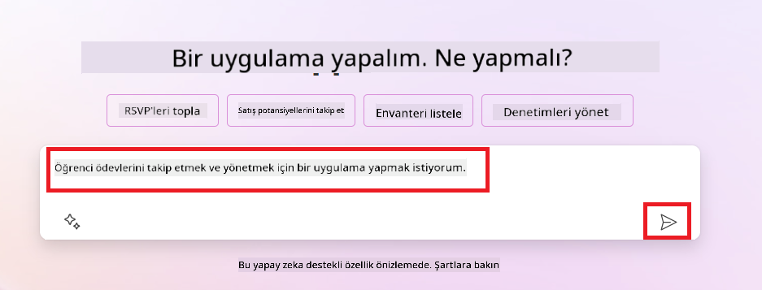
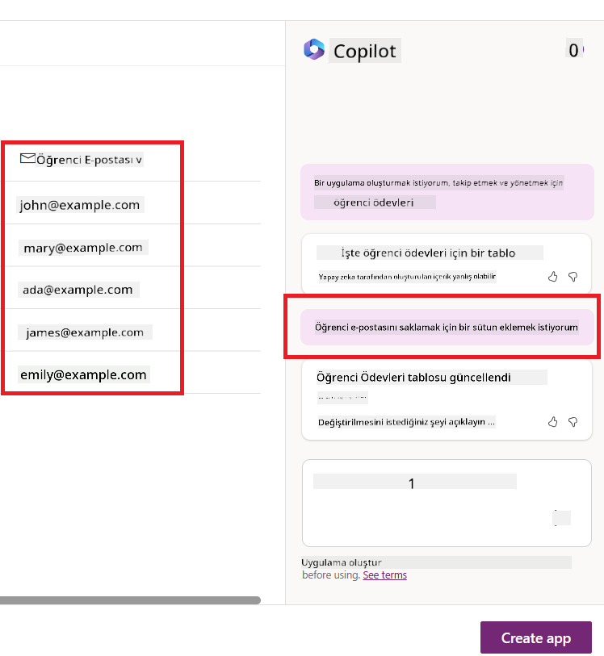
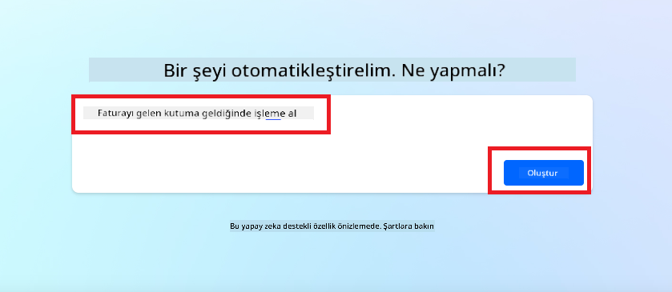
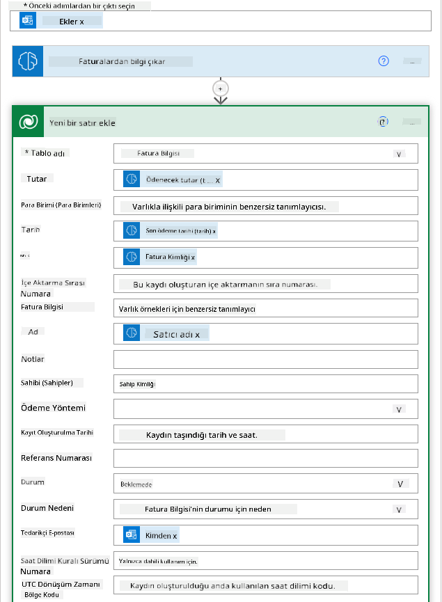
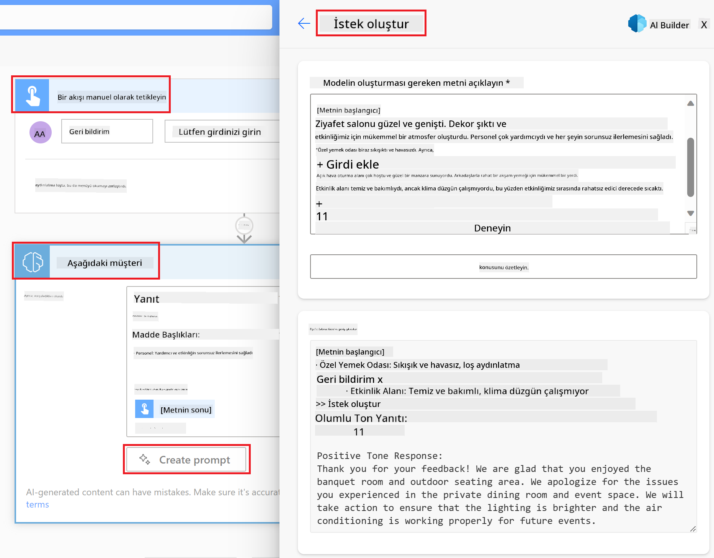

<!--
CO_OP_TRANSLATOR_METADATA:
{
  "original_hash": "f5ff3b6204a695a117d6f452403c95f7",
  "translation_date": "2025-07-09T13:58:34+00:00",
  "source_file": "10-building-low-code-ai-applications/README.md",
  "language_code": "tr"
}
-->
# Düşük Kodlu AI Uygulamaları Geliştirme

> _(Bu dersin videosunu izlemek için yukarıdaki görsele tıklayın)_

## Giriş

Artık görüntü oluşturma uygulamaları geliştirmeyi öğrendiğimize göre, düşük kod konusuna geçelim. Üretken AI, düşük kod da dahil olmak üzere birçok farklı alanda kullanılabilir, peki düşük kod nedir ve AI’yı buna nasıl entegre edebiliriz?

Düşük Kod Geliştirme Platformları sayesinde, geleneksel geliştiriciler ve geliştirici olmayanlar için uygulama ve çözümler oluşturmak daha kolay hale geldi. Düşük Kod Geliştirme Platformları, az veya hiç kod yazmadan uygulama ve çözümler oluşturmanızı sağlar. Bu, uygulama ve çözümleri oluşturmak için bileşenleri sürükleyip bırakabileceğiniz görsel bir geliştirme ortamı sunarak mümkün olur. Böylece uygulamalar ve çözümler daha hızlı ve daha az kaynakla geliştirilebilir. Bu derste, Düşük Kod kullanımı ve Power Platform ile AI’yı kullanarak düşük kod geliştirmeyi nasıl geliştirebileceğimizi derinlemesine inceleyeceğiz.

Power Platform, organizasyonlara ekiplerini sezgisel bir düşük kod veya kodsuz ortamda kendi çözümlerini geliştirmeleri için güçlendirme fırsatı sunar. Bu ortam, çözüm oluşturma sürecini basitleştirir. Power Platform ile çözümler aylar veya yıllar yerine günler veya haftalar içinde oluşturulabilir. Power Platform beş temel üründen oluşur: Power Apps, Power Automate, Power BI, Power Pages ve Copilot Studio.

Bu ders şunları kapsar:

- Power Platform’da Üretken AI’ya Giriş  
- Copilot’a Giriş ve nasıl kullanılır  
- Power Platform’da Üretken AI kullanarak uygulama ve akışlar oluşturma  
- AI Builder ile Power Platform’daki AI Modellerini anlama  

## Öğrenme Hedefleri

Bu dersin sonunda şunları yapabileceksiniz:

- Power Platform’da Copilot’un nasıl çalıştığını anlamak.

- Eğitim girişimimiz için Öğrenci Ödev Takip Uygulaması geliştirmek.

- Faturalardan bilgi çıkarmak için AI kullanan Fatura İşleme Akışı oluşturmak.

- Create Text with GPT AI Model kullanırken en iyi uygulamaları uygulamak.

Bu derste kullanacağınız araçlar ve teknolojiler:

- **Power Apps**, Öğrenci Ödev Takip uygulaması için, verileri takip etmek, yönetmek ve etkileşimde bulunmak için düşük kodlu bir geliştirme ortamı sağlar.

- **Dataverse**, Öğrenci Ödev Takip uygulamasının verilerini depolamak için, uygulamanın verilerini saklamak üzere düşük kodlu bir veri platformu sunar.

- **Power Automate**, Fatura İşleme akışı için, Fatura İşleme sürecini otomatikleştirmek için iş akışları oluşturabileceğiniz düşük kodlu geliştirme ortamı sağlar.

- **AI Builder**, Fatura İşleme AI Modeli için, önceden oluşturulmuş AI Modellerini kullanarak faturaları işlemek için kullanılır.

## Power Platform’da Üretken AI

Üretken AI ile düşük kod geliştirme ve uygulama geliştirmeyi güçlendirmek, Power Platform’un önemli odak alanlarından biridir. Amaç, herkesin veri bilimi uzmanlığı gerektirmeden AI destekli uygulamalar, siteler, panolar oluşturmasını ve süreçleri AI ile otomatikleştirmesini sağlamaktır. Bu hedef, Copilot ve AI Builder şeklinde üretken AI’yı Power Platform’daki düşük kod geliştirme deneyimine entegre ederek gerçekleştirilir.

### Bu nasıl çalışır?

Copilot, doğal dil kullanarak gereksinimlerinizi bir dizi sohbet adımıyla tanımlayarak Power Platform çözümleri oluşturmanızı sağlayan bir AI asistanıdır. Örneğin, AI asistanınıza uygulamanızın hangi alanları kullanacağını söyleyebilir ve o hem uygulamayı hem de temel veri modelini oluşturabilir ya da Power Automate’te bir akışın nasıl kurulacağını belirtebilirsiniz.

Copilot destekli işlevleri, kullanıcıların sohbet yoluyla içgörüler keşfetmesini sağlamak için uygulama ekranlarınızda bir özellik olarak kullanabilirsiniz.

AI Builder, Power Platform’da bulunan düşük kodlu bir AI yeteneğidir ve AI Modellerini kullanarak süreçleri otomatikleştirmenize ve sonuçları tahmin etmenize yardımcı olur. AI Builder ile Dataverse veya SharePoint, OneDrive, Azure gibi çeşitli bulut veri kaynaklarına bağlanan uygulamalarınıza ve akışlarınıza AI katabilirsiniz.

Copilot, Power Apps, Power Automate, Power BI, Power Pages ve Power Virtual Agents dahil tüm Power Platform ürünlerinde mevcuttur. AI Builder ise Power Apps ve Power Automate’te bulunur. Bu derste, eğitim girişimimiz için bir çözüm oluşturmak üzere Power Apps ve Power Automate’te Copilot ve AI Builder kullanmaya odaklanacağız.

### Power Apps’te Copilot

Power Platform’un bir parçası olarak Power Apps, verileri takip etmek, yönetmek ve etkileşimde bulunmak için uygulamalar oluşturabileceğiniz düşük kodlu bir geliştirme ortamı sunar. Bulut hizmetlerine ve kurum içi verilere bağlanabilen ölçeklenebilir bir veri platformu ve uygulama geliştirme hizmetleri paketidir. Power Apps, tarayıcılar, tabletler ve telefonlarda çalışan uygulamalar oluşturmanıza ve bunları iş arkadaşlarınızla paylaşmanıza olanak tanır. Power Apps, basit arayüzü sayesinde her iş kullanıcısının veya profesyonel geliştiricinin özel uygulamalar oluşturmasını kolaylaştırır. Uygulama geliştirme deneyimi, Copilot aracılığıyla Üretken AI ile de geliştirilmiştir.

Power Apps’teki copilot AI asistan özelliği, ne tür bir uygulamaya ihtiyacınız olduğunu ve uygulamanızın hangi bilgileri takip, toplamak veya göstermek istediğini tanımlamanızı sağlar. Copilot, açıklamanıza dayanarak duyarlı bir Canvas uygulaması oluşturur. Ardından uygulamayı ihtiyaçlarınıza göre özelleştirebilirsiniz. AI Copilot ayrıca, takip etmek istediğiniz verileri depolamak için gereken alanlarla birlikte bir Dataverse Tablosu oluşturur ve örnek veriler sunar. Bu derste daha sonra Dataverse’in ne olduğunu ve Power Apps’te nasıl kullanılacağını inceleyeceğiz. AI Copilot asistan özelliğiyle sohbet adımları aracılığıyla tabloyu ihtiyaçlarınıza göre özelleştirebilirsiniz. Bu özellik Power Apps ana ekranından kolayca erişilebilir.

### Power Automate’te Copilot

Power Platform’un bir parçası olarak Power Automate, kullanıcıların uygulamalar ve hizmetler arasında otomatik iş akışları oluşturmasını sağlar. İletişim, veri toplama ve karar onayları gibi tekrarlayan iş süreçlerini otomatikleştirmeye yardımcı olur. Basit arayüzü sayesinde her teknik seviyeden kullanıcı (yeni başlayanlardan deneyimli geliştiricilere kadar) iş görevlerini otomatikleştirebilir. İş akışı geliştirme deneyimi, Copilot aracılığıyla Üretken AI ile de geliştirilmiştir.

Power Automate’teki copilot AI asistan özelliği, ne tür bir akışa ihtiyacınız olduğunu ve akışınızın hangi işlemleri yapmasını istediğinizi tanımlamanızı sağlar. Copilot, açıklamanıza dayanarak bir akış oluşturur. Ardından akışı ihtiyaçlarınıza göre özelleştirebilirsiniz. AI Copilot ayrıca, otomatikleştirmek istediğiniz görevi gerçekleştirmek için gereken işlemleri oluşturur ve önerir. Bu derste daha sonra akışların ne olduğunu ve Power Automate’te nasıl kullanılacağını inceleyeceğiz. AI Copilot asistan özelliğiyle sohbet adımları aracılığıyla işlemleri ihtiyaçlarınıza göre özelleştirebilirsiniz. Bu özellik Power Automate ana ekranından kolayca erişilebilir.

## Ödev: Copilot kullanarak girişimimiz için öğrenci ödevleri ve faturaları yönetin

Girişimimiz öğrencilere çevrimiçi kurslar sunuyor. Girişim hızla büyüdü ve artık kurslara olan talebi karşılamakta zorlanıyor. Girişim, öğrenci ödevlerini ve faturalarını yönetmelerine yardımcı olacak düşük kodlu bir çözüm geliştirmek için sizi Power Platform geliştiricisi olarak işe aldı. Çözüm, öğrenci ödevlerini bir uygulama aracılığıyla takip edip yönetmelerine ve fatura işleme sürecini bir iş akışıyla otomatikleştirmelerine yardımcı olmalıdır. Çözümü geliştirmek için Üretken AI kullanmanız istendi.

Copilot kullanmaya başlarken, [Power Platform Copilot Prompt Library](https://github.com/pnp/powerplatform-prompts?WT.mc_id=academic-109639-somelezediko) kütüphanesini kullanarak promptlarla başlayabilirsiniz. Bu kütüphane, Copilot ile uygulama ve akışlar oluşturmak için kullanabileceğiniz promptların bir listesini içerir. Ayrıca, gereksinimlerinizi Copilot’a nasıl tanımlayacağınız konusunda fikir edinmek için de kullanabilirsiniz.

### Girişimimiz için Öğrenci Ödev Takip Uygulaması Oluşturun

Girişimimizdeki eğitimciler, öğrenci ödevlerini takip etmekte zorlanıyorlar. Ödevleri takip etmek için bir elektronik tablo kullanıyorlardı ancak öğrenci sayısı arttıkça bu yönetilmesi zor hale geldi. Size, öğrenci ödevlerini takip edip yönetmelerine yardımcı olacak bir uygulama oluşturmanız istendi. Uygulama, yeni ödev eklemeye, ödevleri görüntülemeye, güncellemeye ve silmeye olanak tanımalıdır. Ayrıca eğitimciler ve öğrenciler, notlandırılmış ve notlandırılmamış ödevleri görebilmelidir.

Uygulamayı Power Apps’te Copilot kullanarak aşağıdaki adımlarla oluşturacaksınız:

1. [Power Apps](https://make.powerapps.com?WT.mc_id=academic-105485-koreyst) ana ekranına gidin.

1. Ana ekrandaki metin alanını kullanarak oluşturmak istediğiniz uygulamayı tanımlayın. Örneğin, **_Öğrenci ödevlerini takip ve yönetmek için bir uygulama oluşturmak istiyorum_**. AI Copilot’a promptu göndermek için **Gönder** butonuna tıklayın.

1. AI Copilot, takip etmek istediğiniz verileri depolamak için gereken alanlarla birlikte bir Dataverse Tablosu ve örnek veriler önerir. Ardından AI Copilot asistan özelliğiyle sohbet adımları aracılığıyla tabloyu ihtiyaçlarınıza göre özelleştirebilirsiniz.

   > **Önemli**: Dataverse, Power Platform’un temel veri platformudur. Uygulamanın verilerini depolamak için düşük kodlu bir veri platformudur. Microsoft Bulutu’nda güvenli bir şekilde veri depolayan ve Power Platform ortamınızda sağlanan tam yönetilen bir hizmettir. Veri sınıflandırması, veri kökeni, ayrıntılı erişim kontrolü gibi yerleşik veri yönetişimi özellikleriyle birlikte gelir. Dataverse hakkında daha fazla bilgiye [buradan](https://docs.microsoft.com/powerapps/maker/data-platform/data-platform-intro?WT.mc_id=academic-109639-somelezediko) ulaşabilirsiniz.

   

1. Eğitimciler, ödevlerini teslim eden öğrencilere ödevlerin durumu hakkında bilgi vermek için e-posta göndermek istiyorlar. Tabloya öğrenci e-posta adresini depolamak için yeni bir alan eklemek üzere Copilot’u kullanabilirsiniz. Örneğin, tabloya yeni bir alan eklemek için şu promptu kullanabilirsiniz: **_Öğrenci e-postasını depolamak için bir sütun eklemek istiyorum_**. AI Copilot’a promptu göndermek için **Gönder** butonuna tıklayın.

1. AI Copilot yeni bir alan oluşturacak ve ardından bu alanı ihtiyaçlarınıza göre özelleştirebilirsiniz.

1. Tabloyu tamamladıktan sonra, uygulamayı oluşturmak için **Uygulama oluştur** butonuna tıklayın.

1. AI Copilot, açıklamanıza dayanarak duyarlı bir Canvas uygulaması oluşturacak. Ardından uygulamayı ihtiyaçlarınıza göre özelleştirebilirsiniz.

1. Eğitimcilerin öğrencilere e-posta gönderebilmesi için uygulamaya yeni bir ekran eklemek üzere Copilot’u kullanabilirsiniz. Örneğin, uygulamaya yeni bir ekran eklemek için şu promptu kullanabilirsiniz: **_Öğrencilere e-posta göndermek için bir ekran eklemek istiyorum_**. AI Copilot’a promptu göndermek için **Gönder** butonuna tıklayın.

1. AI Copilot yeni bir ekran oluşturacak ve ardından bu ekranı ihtiyaçlarınıza göre özelleştirebilirsiniz.

1. Uygulamayı tamamladıktan sonra, uygulamayı kaydetmek için **Kaydet** butonuna tıklayın.

1. Uygulamayı eğitimcilerle paylaşmak için **Paylaş** butonuna tıklayın ve ardından tekrar **Paylaş** butonuna tıklayın. Eğitimcilerin e-posta adreslerini girerek uygulamayı onlarla paylaşabilirsiniz.

> **Ödeviniz**: Az önce oluşturduğunuz uygulama iyi bir başlangıç ancak geliştirilebilir. E-posta özelliği ile eğitimciler sadece e-postaları manuel olarak yazarak öğrencilere e-posta gönderebiliyor. Copilot’u kullanarak, eğitimcilerin ödev teslim ettiklerinde öğrencilere otomatik olarak e-posta göndermesini sağlayacak bir otomasyon oluşturabilir misiniz? İpucunuz, doğru prompt ile Power Automate’te Copilot’u kullanarak bunu yapabilirsiniz.

### Girişimimiz için Fatura Bilgi Tablosu Oluşturun

Girişimimizin finans ekibi, faturaları takip etmekte zorlanıyor. Faturaları takip etmek için bir elektronik tablo kullanıyorlardı ancak fatura sayısı arttıkça bu yönetilmesi zor hale geldi. Size, aldıkları faturaların bilgilerini depolamalarına, takip etmelerine ve yönetmelerine yardımcı olacak bir tablo oluşturmanız istendi. Bu tablo, tüm fatura bilgilerini çıkaracak ve tabloya kaydedecek bir otomasyon oluşturmak için kullanılacaktır. Tablo ayrıca finans ekibinin ödenmiş ve ödenmemiş faturaları görmesini sağlamalıdır.

Power Platform’un altında yatan veri platformu Dataverse, uygulamalarınız ve çözümleriniz için veri depolamanıza olanak tanır. Dataverse, uygulamanın verilerini depolamak için düşük kodlu bir veri platformudur. Microsoft Bulutu’nda güvenli bir şekilde veri depolayan ve Power Platform ortamınızda sağlanan tam yönetilen bir hizmettir. Veri sınıflandırması, veri kökeni, ayrıntılı erişim kontrolü gibi yerleşik veri yönetişimi özellikleriyle birlikte gelir. Dataverse hakkında daha fazla bilgiye [buradan](https://docs.microsoft.com/powerapps/maker/data-platform/data-platform-intro?WT.mc_id=academic-109639-somelezediko) ulaşabilirsiniz.

Neden girişimimiz için Dataverse kullanmalıyız? Dataverse içindeki standart ve özel tablolar, verileriniz için güvenli ve bulut tabanlı bir depolama seçeneği sunar. Tablolar, bir Excel çalışma kitabındaki birden fazla çalışma sayfası gibi farklı türde verileri depolamanıza olanak tanır. Tabloları, organizasyonunuza veya iş ihtiyaçlarınıza özgü verileri depolamak için kullanabilirsiniz. Girişimimizin Dataverse kullanarak elde edeceği bazı avantajlar şunlardır ancak bunlarla sınırlı değildir:
- **Kolay yönetim**: Hem meta veriler hem de veriler bulutta saklanır, bu yüzden nasıl saklandıkları veya yönetildikleriyle ilgili detaylarla uğraşmanıza gerek yoktur. Uygulamalarınızı ve çözümlerinizi geliştirmeye odaklanabilirsiniz.

- **Güvenli**: Dataverse, verileriniz için güvenli ve bulut tabanlı bir depolama seçeneği sunar. Tablo verilerinize kimlerin erişebileceğini ve nasıl erişebileceğini rol tabanlı güvenlik ile kontrol edebilirsiniz.

- **Zengin meta veri**: Veri türleri ve ilişkiler doğrudan Power Apps içinde kullanılır.

- **Mantık ve doğrulama**: İş kurallarını, hesaplanmış alanları ve doğrulama kurallarını kullanarak iş mantığını uygulayabilir ve veri doğruluğunu koruyabilirsiniz.

Artık Dataverse’in ne olduğunu ve neden kullanmanız gerektiğini bildiğinize göre, finans ekibimizin gereksinimlerini karşılamak için Dataverse’te bir tablo oluşturmak üzere Copilot’u nasıl kullanabileceğinize bakalım.

> **Note** : Bu tabloyu, sonraki bölümde tüm fatura bilgilerini çıkaracak ve tabloya kaydedecek bir otomasyon oluşturmak için kullanacaksınız.

Copilot kullanarak Dataverse’te tablo oluşturmak için aşağıdaki adımları izleyin:

1. [Power Apps](https://make.powerapps.com?WT.mc_id=academic-105485-koreyst) ana ekranına gidin.

2. Sol gezinme çubuğunda **Tables** seçeneğine tıklayın ve ardından **Describe the new Table** seçeneğine tıklayın.

3. **Describe the new Table** ekranında, oluşturmak istediğiniz tabloyu açıklamak için metin alanını kullanın. Örneğin, **_Fatura bilgilerini saklamak için bir tablo oluşturmak istiyorum_**. İsteği AI Copilot’a göndermek için **Send** düğmesine tıklayın.

4. AI Copilot, takip etmek istediğiniz verileri saklamak için gereken alanlarla birlikte bir Dataverse Tablosu ve bazı örnek veriler önerecektir. Daha sonra AI Copilot asistan özelliğini kullanarak sohbet adımlarıyla tabloyu ihtiyaçlarınıza göre özelleştirebilirsiniz.

5. Finans ekibi, tedarikçiye faturalarının mevcut durumu hakkında bilgi vermek için bir e-posta göndermek istiyor. Tedarikçi e-postasını saklamak için tabloya yeni bir alan eklemek üzere Copilot’u kullanabilirsiniz. Örneğin, tabloya yeni bir alan eklemek için şu isteği kullanabilirsiniz: **_Tedarikçi e-postasını saklamak için bir sütun eklemek istiyorum_**. İsteği AI Copilot’a göndermek için **Send** düğmesine tıklayın.

6. AI Copilot yeni bir alan oluşturacak ve ardından alanı ihtiyaçlarınıza göre özelleştirebilirsiniz.

7. Tabloyu tamamladıktan sonra, tabloyu oluşturmak için **Create** düğmesine tıklayın.

## Power Platform’da AI Modelleri ve AI Builder

AI Builder, Power Platform’da bulunan düşük kodlu bir yapay zeka yeteneğidir ve AI Modellerini kullanarak süreçleri otomatikleştirmenize ve sonuçları tahmin etmenize olanak tanır. AI Builder ile Dataverse veya SharePoint, OneDrive ya da Azure gibi çeşitli bulut veri kaynaklarına bağlanan uygulamalarınıza ve akışlarınıza yapay zekayı entegre edebilirsiniz.

## Önceden Oluşturulmuş AI Modelleri ve Özel AI Modelleri

AI Builder, iki tür AI Modeli sunar: Önceden Oluşturulmuş AI Modelleri ve Özel AI Modelleri. Önceden Oluşturulmuş AI Modelleri, Microsoft tarafından eğitilmiş ve Power Platform’da kullanıma hazır modellerdir. Bu modeller, kendi verilerinizi toplamak, model oluşturmak, eğitmek ve yayınlamak zorunda kalmadan uygulamalarınıza ve akışlarınıza zeka katmanıza yardımcı olur. Bu modelleri süreçleri otomatikleştirmek ve sonuçları tahmin etmek için kullanabilirsiniz.

Power Platform’da bulunan bazı Önceden Oluşturulmuş AI Modelleri şunlardır:

- **Key Phrase Extraction**: Metinden anahtar ifadeleri çıkarır.
- **Language Detection**: Metnin dilini tespit eder.
- **Sentiment Analysis**: Metindeki olumlu, olumsuz, nötr veya karışık duyguyu belirler.
- **Business Card Reader**: Kartvizitlerden bilgi çıkarır.
- **Text Recognition**: Görsellerden metin çıkarır.
- **Object Detection**: Görsellerden nesneleri tespit eder ve çıkarır.
- **Document processing**: Formlardan bilgi çıkarır.
- **Invoice Processing**: Faturalardan bilgi çıkarır.

Özel AI Modelleri ile kendi modelinizi AI Builder’a getirebilir ve kendi verilerinizle eğiterek AI Builder özel modeli gibi çalışmasını sağlayabilirsiniz. Bu modelleri hem Power Apps hem de Power Automate içinde süreçleri otomatikleştirmek ve sonuçları tahmin etmek için kullanabilirsiniz. Kendi modelinizi kullanırken bazı sınırlamalar geçerlidir. Bu sınırlamalar hakkında daha fazla bilgi için [buraya](https://learn.microsoft.com/ai-builder/byo-model#limitations?WT.mc_id=academic-105485-koreyst) bakabilirsiniz.

## Ödev #2 - Startup’ımız için Fatura İşleme Akışı Oluşturun

Finans ekibi, faturaları işlemek konusunda zorlanıyor. Faturaları takip etmek için bir elektronik tablo kullanıyorlardı ancak fatura sayısı arttıkça yönetmek zorlaştı. Sizden, AI kullanarak faturaları işlemelerine yardımcı olacak bir iş akışı oluşturmanızı istediler. İş akışı, faturalar üzerindeki bilgileri çıkarıp bu bilgileri bir Dataverse tablosuna kaydetmeli. Ayrıca, çıkarılan bilgilerle finans ekibine e-posta göndermelerini sağlamalı.

Artık AI Builder’ın ne olduğunu ve neden kullanmanız gerektiğini bildiğinize göre, daha önce incelediğimiz Invoice Processing AI Modelini kullanarak finans ekibinin faturaları işlemesine yardımcı olacak bir iş akışı nasıl oluşturulur, buna bakalım.

Invoice Processing AI Modelini kullanarak finans ekibinin faturaları işlemesine yardımcı olacak bir iş akışı oluşturmak için aşağıdaki adımları izleyin:

1. [Power Automate](https://make.powerautomate.com?WT.mc_id=academic-105485-koreyst) ana ekranına gidin.

2. Ana ekrandaki metin alanını kullanarak oluşturmak istediğiniz iş akışını açıklayın. Örneğin, **_Posta kutuma gelen faturayı işleme al_**. İsteği AI Copilot’a göndermek için **Send** düğmesine tıklayın.

   

3. AI Copilot, otomatikleştirmek istediğiniz görevi gerçekleştirmek için yapmanız gereken eylemleri önerecektir. Sonraki adımlara geçmek için **Next** düğmesine tıklayabilirsiniz.

4. Sonraki adımda, Power Automate iş akışı için gerekli bağlantıları kurmanızı isteyecektir. İşlemi tamamladıktan sonra iş akışını oluşturmak için **Create flow** düğmesine tıklayın.

5. AI Copilot bir iş akışı oluşturacak ve ardından iş akışını ihtiyaçlarınıza göre özelleştirebilirsiniz.

6. İş akışının tetikleyicisini güncelleyin ve **Folder** (Klasör) ayarını faturaların saklanacağı klasöre ayarlayın. Örneğin, klasörü **Inbox** olarak belirleyebilirsiniz. **Show advanced options** (Gelişmiş seçenekleri göster) seçeneğine tıklayın ve **Only with Attachments** (Sadece ekli olanlar) seçeneğini **Yes** (Evet) olarak ayarlayın. Bu, iş akışının yalnızca ekli e-posta alındığında çalışmasını sağlar.

7. İş akışından şu eylemleri kaldırın: **HTML to text**, **Compose**, **Compose 2**, **Compose 3** ve **Compose 4** çünkü bunları kullanmayacaksınız.

8. İş akışından **Condition** (Koşul) eylemini kaldırın çünkü bunu kullanmayacaksınız. İş akışınız aşağıdaki ekran görüntüsündeki gibi görünmelidir:

   

9. **Add an action** (Eylem ekle) düğmesine tıklayın ve **Dataverse** araması yapın. **Add a new row** (Yeni satır ekle) eylemini seçin.

10. **Extract Information from invoices** (Faturalardan bilgi çıkar) eyleminde, **Invoice File** (Fatura Dosyası) alanını e-postadan gelen **Attachment Content** (Ek İçeriği) olarak ayarlayın. Bu, iş akışının fatura ekinden bilgi çıkarmasını sağlar.

11. Daha önce oluşturduğunuz **Table** (Tablo)yu seçin. Örneğin, **Invoice Information** (Fatura Bilgileri) tablosunu seçebilirsiniz. Önceki eylemden dinamik içeriği kullanarak aşağıdaki alanları doldurun:

    - ID
    - Amount (Tutar)
    - Date (Tarih)
    - Name (İsim)
    - Status (Durum) - **Status** alanını **Pending** (Beklemede) olarak ayarlayın.
    - Supplier Email (Tedarikçi E-postası) - **When a new email arrives** (Yeni e-posta geldiğinde) tetikleyicisinden **From** (Kimden) dinamik içeriğini kullanın.

    

12. İş akışını tamamladıktan sonra, iş akışını kaydetmek için **Save** düğmesine tıklayın. Ardından, tetikleyicide belirttiğiniz klasöre bir fatura içeren e-posta göndererek iş akışını test edebilirsiniz.

> **Ödeviniz**: Az önce oluşturduğunuz iş akışı iyi bir başlangıç, şimdi finans ekibimizin tedarikçiye faturalarının mevcut durumu hakkında bilgi vermek için e-posta göndermesini sağlayacak bir otomasyon nasıl oluşturabileceğinizi düşünmelisiniz. İpucunuz: İş akışı, faturanın durumu değiştiğinde çalışmalıdır.

## Power Automate’te Metin Üretimi AI Modeli Kullanımı

AI Builder’daki Create Text with GPT AI Modeli, bir isteme (prompt) dayalı metin üretmenizi sağlar ve Microsoft Azure OpenAI Servisi tarafından desteklenir. Bu özellik sayesinde, GPT (Generative Pre-Trained Transformer) teknolojisini uygulamalarınıza ve akışlarınıza entegre ederek çeşitli otomatik akışlar ve bilgi sağlayan uygulamalar oluşturabilirsiniz.

GPT modelleri, çok büyük veri setleri üzerinde kapsamlı eğitim alır ve verilen bir isteme karşılık insan diline çok benzeyen metinler üretebilir. İş akışı otomasyonuyla entegre edildiğinde, GPT gibi AI modelleri çok çeşitli görevleri kolaylaştırmak ve otomatikleştirmek için kullanılabilir.

Örneğin, e-posta taslakları, ürün açıklamaları gibi çeşitli kullanım senaryoları için otomatik metin oluşturmak üzere akışlar oluşturabilirsiniz. Ayrıca, müşteri hizmetleri temsilcilerinin müşteri taleplerine etkili ve verimli yanıt vermesini sağlayan sohbet botları ve müşteri hizmetleri uygulamaları gibi uygulamalar için de metin üretmek üzere modeli kullanabilirsiniz.

Power Automate’te bu AI Modelini nasıl kullanacağınızı öğrenmek için [Add intelligence with AI Builder and GPT](https://learn.microsoft.com/training/modules/ai-builder-text-generation/?WT.mc_id=academic-109639-somelezediko) modülünü inceleyin.

## Harika İş! Öğrenmeye Devam Edin

Bu dersi tamamladıktan sonra, Generative AI bilginizi geliştirmeye devam etmek için [Generative AI Learning collection](https://aka.ms/genai-collection?WT.mc_id=academic-105485-koreyst) koleksiyonumuza göz atın!

Bir sonraki ders olan Ders 11’e geçin; burada [Generative AI’nin Function Calling ile entegrasyonunu](../11-integrating-with-function-calling/README.md?WT.mc_id=academic-105485-koreyst) inceleyeceğiz!

**Feragatname**:  
Bu belge, AI çeviri servisi [Co-op Translator](https://github.com/Azure/co-op-translator) kullanılarak çevrilmiştir. Doğruluk için çaba göstersek de, otomatik çevirilerin hatalar veya yanlışlıklar içerebileceğini lütfen unutmayınız. Orijinal belge, kendi dilinde yetkili kaynak olarak kabul edilmelidir. Kritik bilgiler için profesyonel insan çevirisi önerilir. Bu çevirinin kullanımı sonucu ortaya çıkabilecek yanlış anlamalar veya yorum hatalarından sorumlu değiliz.