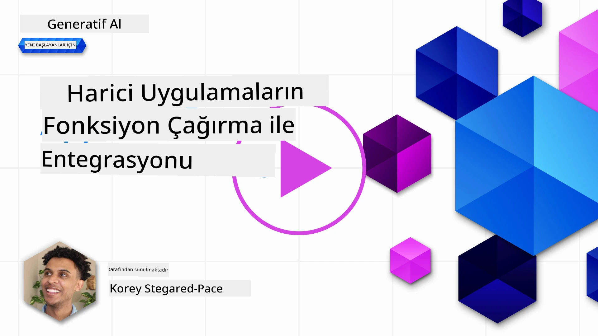
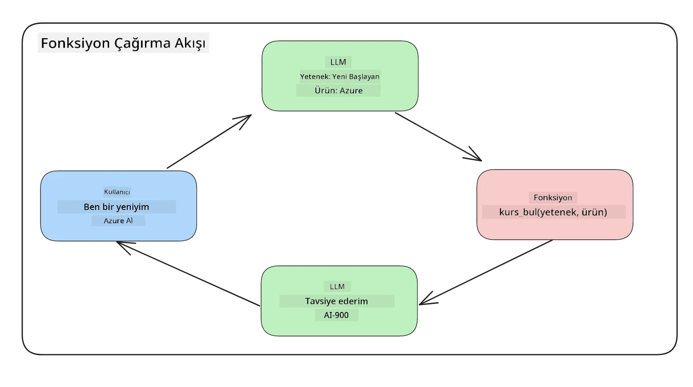
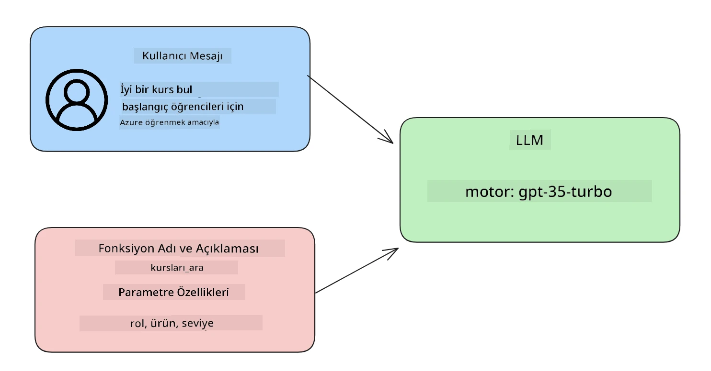

# Fonksiyon çağrısı ile entegrasyon

[](https://youtu.be/DgUdCLX8qYQ?si=f1ouQU5HQx6F8Gl2)

Önceki derslerde oldukça fazla şey öğrendiniz. Ancak, daha da iyileştirebiliriz. Ele alabileceğimiz bazı konular, yanıtı daha tutarlı bir formatta alarak yanıta downstream işlemek için kolaylık sağlamaktır. Ayrıca, uygulamamızı daha da zenginleştirmek için diğer kaynaklardan veri eklemek isteyebiliriz.

Yukarıda bahsedilen sorunlar bu bölümün çözmeye çalıştığı konulardır.

## Giriş

Bu ders şunları kapsayacak:

- Fonksiyon çağrısının ne olduğunu ve kullanım alanlarını açıklamak.
- Azure OpenAI kullanarak fonksiyon çağrısı oluşturmak.
- Bir uygulamaya fonksiyon çağrısını nasıl entegre edeceğimizi göstermek.

## Öğrenme Hedefleri

Bu dersin sonunda şunları yapabileceksiniz:

- Fonksiyon çağrısı kullanım amacını açıklamak.
- Azure OpenAI Servisi kullanarak Fonksiyon Çağrısı kurmak.
- Uygulamanızın kullanım durumu için etkili fonksiyon çağrıları tasarlamak.

## Senaryo: Fonksiyonlarla chatbot’umuzu geliştirmek

Bu ders için, kullanıcıların teknik kurslar bulmak amacıyla bir chatbot kullanabileceği bir özellik geliştirmek istiyoruz. Kullanıcının beceri seviyesi, mevcut rolü ve ilgilendiği teknolojilere uygun kursları önereceğiz.

Bu senaryoyu tamamlamak için aşağıdaki kombinasyonu kullanacağız:

- Kullanıcı için sohbet deneyimi oluşturmak amacıyla `Azure OpenAI`.
- Kullanıcının talebine göre kurs bulmaya yardımcı olmak için `Microsoft Learn Catalog API`.
- Kullanıcının sorgusunu alıp bir fonksiyona API isteği yapmak üzere göndermek için `Fonksiyon Çağrısı`.

Başlamak için, neden öncelikle fonksiyon çağrısı kullanmak istediğimize bakalım:

## Neden Fonksiyon Çağrısı

Fonksiyon çağrısı öncesinde, bir LLM’den gelen yanıtlar yapısız ve tutarsızdı. Geliştiriciler, yanıtların her bir varyasyonunu işleyebilmek için karmaşık doğrulama kodları yazmak zorundaydı. Kullanıcılar “Stockholm’daki güncel hava durumu nedir?” gibi sorulara cevap alamıyordu. Çünkü modeller, eğitildikleri veri zamanına kadar sınırlıydı.

Fonksiyon Çağrısı, Azure OpenAI Servisi’nin aşağıdaki sınırlamaları aşmak için sunduğu bir özelliktir:

- **Tutarlı yanıt formatı**. Yanıt formatını daha iyi kontrol edebilirsek, yanıtı downstream diğer sistemlere entegre etmek daha kolay olur.
- **Dış veri**. Uygulamanın diğer kaynaklarından gelen verileri sohbet bağlamında kullanabilme yeteneği.

## Sorunu bir senaryo ile göstermek

> Aşağıdaki senaryoyu çalıştırmak istiyorsanız, [ekli not defterini](./python/aoai-assignment.ipynb?WT.mc_id=academic-105485-koreyst) kullanmanızı öneririz. Ayrıca sadece okuyarak fonksiyonların sorunu nasıl çözdüğünü anlamaya çalışabilirsiniz.

Yanıt formatı sorununu gösteren örneğe bakalım:

Diyelim ki, öğrencilere uygun kurslar önerebilmek için öğrenci verilerinden oluşan bir veritabanı oluşturmak istiyoruz. Aşağıda, içerdikleri veri bakımından çok benzer olan iki öğrenci açıklaması bulunmaktadır.

1. Azure OpenAI kaynağımıza bağlantı oluşturalım:

   ```python
   import os
   import json
   from openai import OpenAI
   from dotenv import load_dotenv
   load_dotenv()

   # Yanıtlar API'si Azure OpenAI (Microsoft Foundry) v1 uç noktasından sağlanır
   # bu yüzden OpenAI istemcisini <your-endpoint>/openai/v1/ adresine yönlendiriyoruz.
   endpoint = os.environ['AZURE_OPENAI_ENDPOINT']
   client = OpenAI(
   api_key=os.environ['AZURE_OPENAI_API_KEY'],
   base_url=f"{endpoint.rstrip('/')}/openai/v1/",
   )

   deployment=os.environ['AZURE_OPENAI_DEPLOYMENT']
   ```

   Aşağıda, Azure OpenAI bağlantımızı yapılandırmak için bazı Python kodları vardır. V1 uç noktası kullandığımız için sadece `api_key` ve `base_url` ayarlamamız yeterlidir ( `api_version` gerekmez).

1. `student_1_description` ve `student_2_description` değişkenlerini kullanarak iki öğrenci açıklaması oluşturmak.

   ```python
   student_1_description="Emily Johnson is a sophomore majoring in computer science at Duke University. She has a 3.7 GPA. Emily is an active member of the university's Chess Club and Debate Team. She hopes to pursue a career in software engineering after graduating."

   student_2_description = "Michael Lee is a sophomore majoring in computer science at Stanford University. He has a 3.8 GPA. Michael is known for his programming skills and is an active member of the university's Robotics Club. He hopes to pursue a career in artificial intelligence after finishing his studies."
   ```

   Yukarıdaki öğrenci açıklamalarını veriyi ayrıştırmak için bir LLM’ye göndermek istiyoruz. Bu veriler daha sonra uygulamamızda kullanılabilir, bir API’ye gönderilebilir veya veritabanında saklanabilir.

1. LLM’ye hangi bilgileri istediğimizi belirtmek için iki özdeş istem (prompt) oluşturalım:

   ```python
   prompt1 = f'''
   Please extract the following information from the given text and return it as a JSON object:

   name
   major
   school
   grades
   club

   This is the body of text to extract the information from:
   {student_1_description}
   '''

   prompt2 = f'''
   Please extract the following information from the given text and return it as a JSON object:

   name
   major
   school
   grades
   club

   This is the body of text to extract the information from:
   {student_2_description}
   '''
   ```

   Yukarıdaki istemler, LLM’ye bilgileri çıkarıp JSON formatında yanıt vermesini belirtiyor.

1. İstemleri ve Azure OpenAI bağlantısını ayarladıktan sonra, `client.responses.create` kullanarak istemleri LLM’ye göndereceğiz. İstemi `input` değişkenine koyuyoruz ve rolü `user` olarak belirliyoruz. Bu, kullanıcının chatbot’a yazdığı mesajı taklit eder.

   ```python
   # istem birden gelen yanıt
   openai_response1 = client.responses.create(
   model=deployment,
   input = [{'role': 'user', 'content': prompt1}],
   store=False,
   )
   openai_response1.output_text

   # istem ikiden gelen yanıt
   openai_response2 = client.responses.create(
   model=deployment,
   input = [{'role': 'user', 'content': prompt2}],
   store=False,
   )
   openai_response2.output_text
   ```

Şimdi her iki isteği LLM’ye gönderebilir ve `openai_response1.output_text` gibi ifadelerle yanıtları inceleyebiliriz.

1. Son olarak, yanıtı JSON formatına çevirmek için `json.loads` fonksiyonunu kullanalım:

   ```python
   # Yanıt JSON nesnesi olarak yükleniyor
   json_response1 = json.loads(openai_response1.output_text)
   json_response1
   ```

   Yanıt 1:

   ```json
   {
     "name": "Emily Johnson",
     "major": "computer science",
     "school": "Duke University",
     "grades": "3.7",
     "club": "Chess Club"
   }
   ```

   Yanıt 2:

   ```json
   {
     "name": "Michael Lee",
     "major": "computer science",
     "school": "Stanford University",
     "grades": "3.8 GPA",
     "club": "Robotics Club"
   }
   ```

   İstemler aynı ve açıklamalar benzer olmasına rağmen, `Grades` özelliğinin değerlerini farklı formatlarda görüyoruz. Örneğin bazen `3.7`, bazen `3.7 GPA` formatı alınabiliyor.

   Bu sonuç, LLM’nin yazılı istem şeklindeki yapısız veriyi alıp yine yapısız veri döndürmesindendir. Bu veriyi saklarken veya kullanırken ne bekleyeceğimizi bilmek için yapılandırılmış bir formata ihtiyacımız vardır.

Peki, biçimlendirme sorununu nasıl çözeceğiz? Fonksiyon çağrısı kullanarak, yapılandırılmış veri almamızı sağlayabiliriz. Fonksiyon çağrısı kullanıldığında LLM aslında herhangi bir fonksiyonu çağırmaz veya çalıştırmaz. Bunun yerine yanıtları için takip edilecek bir yapı oluştururuz. Bu yapılandırılmış yanıtları uygulamalarımızda hangi fonksiyonun çalıştırılacağına karar vermek için kullanırız.



Daha sonra fonksiyondan dönen bilgiyi tekrar LLM’ye gönderebiliriz. LLM, kullanıcının sorgusuna doğal dilde yanıt verir.

## Fonksiyon çağrıları için kullanım alanları

Fonksiyon çağrılarının uygulamanızı geliştirebileceği birçok farklı kullanım alanı vardır:

- **Dış Araçları Çağırma**. Chatbotlar, kullanıcılardan gelen sorulara cevap vermede iyidir. Fonksiyon çağrısı kullanarak, sohbet botları kullanıcı mesajlarını bazı görevleri tamamlamak için kullanabilir. Örneğin, bir öğrenci chatbot’a "Bu konuda daha fazla yardıma ihtiyacım olduğunu öğretmenime söyleyen bir e-posta gönder" diyor. Bu `send_email(to: string, body: string)` fonksiyon çağrısı yapabilir.

- **API veya Veritabanı Sorguları Oluşturma**. Kullanıcılar doğal dil kullanarak bilgi bulabilir ve bu istek formatlanmış sorgu veya API isteğine dönüştürülür. Örneğin, "Son görevi tamamlayan öğrenciler kimler?" diye sorduklarında `get_completed(student_name: string, assignment: int, current_status: string)` isimli fonksiyon çağrılır.

- **Yapılandırılmış Veri Oluşturma**. Kullanıcılar bir metin bloğu veya CSV’yi kullanarak LLM’den önemli bilgileri çıkarabilir. Örneğin bir öğrenci barış anlaşmalarıyla ilgili bir Wikipedia makalesini yapay zeka flash kartları oluşturmak için dönüştürebilir. Bu, `get_important_facts(agreement_name: string, date_signed: string, parties_involved: list)` adında bir fonksiyon kullanılarak yapılabilir.

## İlk Fonksiyon Çağrınızı Oluşturma

Fonksiyon çağrısı oluşturma işlemi 3 ana adımdan oluşur:

1. Fonksiyonlarınızın (araçların) listesini ve kullanıcı mesajını kullanarak Responses API'yi **çağırmak**.
2. Modelin yanıtını okuyup bir eylem yapmak, yani bir fonksiyon veya API çağrısı **yapmak**.
3. Fonksiyonunuzun yanıtı ile Responses API’ye tekrar bir çağrı yapıp bu bilgiyi kullanarak kullanıcıya cevap oluşturmak.



### 1. Adım - mesajları oluşturma

İlk adım, bir kullanıcı mesajı oluşturmaktır. Bu, bir metin girdi değerini alarak dinamik atanabilir veya burada bir değer atanabilir. Eğer Responses API ile ilk kez çalışıyorsanız, mesajın `role` ve `content` alanlarını tanımlamanız gerekir.

`role`, `system` (kuralları oluşturma), `assistant` (model) veya `user` (son kullanıcı) olabilir. Fonksiyon çağrısı için bunu `user` olarak atayacağız ve örnek bir soru belirteceğiz.

```python
messages= [ {"role": "user", "content": "Find me a good course for a beginner student to learn Azure."} ]
```

Farklı roller atayarak, LLM’ye bunların sistemden mi yoksa kullanıcıdan mı geldiği açıklanmış olur ve LLM üzerine inşa edebileceği bir sohbet geçmişi oluşturabilir.

### 2. Adım - fonksiyonları oluşturma

Sonraki olarak, bir fonksiyonu ve fonksiyon parametrelerini tanımlayacağız. Burada sadece `search_courses` adında bir fonksiyon kullanacağız ama birden fazla fonksiyon da oluşturabilirsiniz.

> **Önemli**: Fonksiyonlar sistem mesajında LLM’ye dahil edilir ve kullanılabilir token sayınıza dahil olur.

Aşağıda, fonksiyonları bir dizi nesne olarak oluşturuyoruz. Her bir nesne, `type`, `name`, `description` ve `parameters` özelliklerine sahip, düz Responses API formatında bir araçtır:

```python
functions = [
   {
      "type":"function",
      "name":"search_courses",
      "description":"Retrieves courses from the search index based on the parameters provided",
      "parameters":{
         "type":"object",
         "properties":{
            "role":{
               "type":"string",
               "description":"The role of the learner (i.e. developer, data scientist, student, etc.)"
            },
            "product":{
               "type":"string",
               "description":"The product that the lesson is covering (i.e. Azure, Power BI, etc.)"
            },
            "level":{
               "type":"string",
               "description":"The level of experience the learner has prior to taking the course (i.e. beginner, intermediate, advanced)"
            }
         },
         "required":[
            "role"
         ]
      }
   }
]
```

Her bir fonksiyon örneğini aşağıda daha ayrıntılı tanımlayalım:

- `name` - Çağrılmasını istediğimiz fonksiyonun adı.
- `description` - Fonksiyonun nasıl çalıştığını açıklayan açıklama. Burada spesifik ve net olmak önemlidir.
- `parameters` - Modelin yanıtında üretmesini istediğiniz değerler ve formattan oluşan liste. `parameters` dizisi aşağıdaki özelliklere sahip öğelerden oluşur:
  1. `type` - Özelliklerin saklanacağı veri tipi.
  1. `properties` - Modelin yanıtında kullanacağı belirli değerlerin listesi
      1. `name` - Anahtar, modelin biçimlendirilmiş yanıtında kullanacağı özellik adı, örneğin `product`.
      1. `type` - Bu özelliğin veri tipi, örneğin `string`.
      1. `description` - Belirli özelliğin açıklaması.

Ayrıca isteğe bağlı `required` özelliği vardır - fonksiyon çağrısının tamamlanması için gerekli alan.

### 3. Adım - fonksiyon çağrısı yapmak

Fonksiyon tanımlandıktan sonra bunu Responses API çağrısına dahil etmek gerekiyor. Bunu istek parametrelerine `tools` ekleyerek yaparız. Bu durumda `tools=functions` olur.

Ayrıca `tool_choice` değerini `auto` olarak ayarlamak mümkündür. Bu, fonksiyon çağrısını kendimizin atamak yerine LLM’nin kullanıcı mesajına göre hangi fonksiyonu çağıracağını kendisinin belirlemesi demektir.

Aşağıda, `client.responses.create` çağırdığımız kod örneği vardır. `tools=functions` ve `tool_choice="auto"` ayarlandığını görebilirsiniz; böylece LLM’ye hangi fonksiyonu ne zaman çağıracağına karar verme seçeneği verilmiş olur:

```python
response = client.responses.create(model=deployment,
                                        input=messages,
                                        tools=functions,
                                        tool_choice="auto",
                                        store=False)

print(response.output)
```

Dönen yanıtta `response.output` içinde şöyle görünen bir `function_call` öğesi vardır:

```json
{
  "type": "function_call",
  "name": "search_courses",
  "call_id": "call_abc123",
  "arguments": "{\n  \"role\": \"student\",\n  \"product\": \"Azure\",\n  \"level\": \"beginner\"\n}"
}
```

Burada `search_courses` fonksiyonunun hangi argümanlarla çağrıldığı, JSON yanıtındaki `arguments` özelliğinde listelenmiştir.

LLM, `input` parametresine verilen değerden veriyi çıkardığı için fonksiyonun argümanlarına uyacak veriyi bulabilmiştir. Aşağıda `messages` değerinin hatırlatması bulunmaktadır:

```python
messages= [ {"role": "user", "content": "Find me a good course for a beginner student to learn Azure."} ]
```

Gördüğünüz gibi `student`, `Azure` ve `beginner` `messages`’tan çıkarılmış ve fonksiyon girdisi olarak ayarlanmıştır. Fonksiyonları bu şekilde kullanmak, hem bir istemciyi bilgi çıkarmak hem de LLM’ye yapı sağlamak ve yeniden kullanılabilir fonksiyonellik oluşturmak için harika bir yoldur.

Şimdi, bunu uygulamamızda nasıl kullanacağımızı görelim.

## Fonksiyon Çağrılarının Bir Uygulamaya Entegrasyonu

LLM’den yapılandırılmış yanıtı test ettikten sonra, bunu bir uygulamaya entegre edebiliriz.

### Akışı yönetmek

Uygulamamıza entegre etmek için şu adımları izleyelim:

1. Önce OpenAI servislerine çağrı yapalım ve yanıtın `output` içinden fonksiyon çağrısı öğelerini çıkaralım.

   ```python
   response_items = response.output
   tool_calls = [item for item in response_items if item.type == "function_call"]
   ```

1. Şimdi Microsoft Learn API’yi çağırıp kurs listesini alacak fonksiyonu tanımlayalım:

   ```python
   import requests

   def search_courses(role, product, level):
     url = "https://learn.microsoft.com/api/catalog/"
     params = {
        "role": role,
        "product": product,
        "level": level
     }
     response = requests.get(url, params=params)
     modules = response.json()["modules"]
     results = []
     for module in modules[:5]:
        title = module["title"]
        url = module["url"]
        results.append({"title": title, "url": url})
     return str(results)
   ```

   Şimdi `functions` değişkeninde tanımlı fonksiyon isimlerine eşleşen gerçek bir Python fonksiyonu oluşturduğumuza dikkat edin. Ayrıca dış API çağrıları ile gerekli veriyi çekiyoruz. Bu örnekte Microsoft Learn API’sini kullanarak eğitim modülleri aranıyor.

Tamam, `functions` değişkenlerini ve karşılık gelen Python fonksiyonunu oluşturduk, LLM’ye bu ikisini nasıl eşleştireceğimizi nasıl söyleriz ki Python fonksiyonumuz çağrılabilsin?

1. Python fonksiyonunu çağırmamız gerekip gerekmediğini anlamak için LLM yanıtına bakıp `function_call` öğesinin olup olmadığını kontrol etmeli ve işaret edilen fonksiyonu çağırmalıyız. Aşağıda bu kontrolü nasıl yapabileceğiniz gösterilmiştir:

   ```python
   # Modelin bir fonksiyonu çağırmak isteyip istemediğini kontrol et
   if tool_calls:
    for tool_call in tool_calls:
     print("Recommended Function call:")
     print(tool_call.name)
     print()

     # Fonksiyonu çağır.
     function_name = tool_call.name

     available_functions = {
             "search_courses": search_courses,
     }
     function_to_call = available_functions[function_name]

     function_args = json.loads(tool_call.arguments)
     function_response = function_to_call(**function_args)

     print("Output of function call:")
     print(function_response)
     print(type(function_response))

     # Fonksiyon çağrısını ve sonucunu konuşmaya tekrar ekle.
     # Modelin function_call öğesi çıktısından önce eklenmelidir.
     messages.append(tool_call)  # asistanın function_call öğesi
     messages.append( # fonksiyon sonucu
         {
             "type": "function_call_output",
             "call_id": tool_call.call_id,
             "output": function_response,
         }
     )
   ```

   Bu üç satır fonksiyonun adını çıkarır, argümanları alır ve çağrıyı yapar:

   ```python
   function_to_call = available_functions[function_name]

   function_args = json.loads(tool_call.arguments)
   function_response = function_to_call(**function_args)
   ```

   Aşağıda kodumuzun çıktısı bulunmaktadır:

   **Çıktı**

   ```Recommended Function call:
   {
     "name": "search_courses",
     "arguments": "{\n  \"role\": \"student\",\n  \"product\": \"Azure\",\n  \"level\": \"beginner\"\n}"
   }

   Output of function call:
   [{'title': 'Describe concepts of cryptography', 'url': 'https://learn.microsoft.com/training/modules/describe-concepts-of-cryptography/?
   WT.mc_id=api_CatalogApi'}, {'title': 'Introduction to audio classification with TensorFlow', 'url': 'https://learn.microsoft.com/en-
   us/training/modules/intro-audio-classification-tensorflow/?WT.mc_id=api_CatalogApi'}, {'title': 'Design a Performant Data Model in Azure SQL
   Database with Azure Data Studio', 'url': 'https://learn.microsoft.com/training/modules/design-a-data-model-with-ads/?
   WT.mc_id=api_CatalogApi'}, {'title': 'Getting started with the Microsoft Cloud Adoption Framework for Azure', 'url':
   'https://learn.microsoft.com/training/modules/cloud-adoption-framework-getting-started/?WT.mc_id=api_CatalogApi'}, {'title': 'Set up the
   Rust development environment', 'url': 'https://learn.microsoft.com/training/modules/rust-set-up-environment/?WT.mc_id=api_CatalogApi'}]
   <class 'str'>
   ```

1. Güncellenen mesaj `messages` ile LLM’ye tekrar gönderim yapalım böylece doğal dil yanıtı alalım, API JSON formatında yanıt yerine.

   ```python
   print("Messages in next request:")
   print(messages)
   print()

   second_response = client.responses.create(
      input=messages,
      model=deployment,
      tool_choice="auto",
      tools=functions,
      temperature=0,
      store=False,
         )  # fonksiyon yanıtını görebildiği modelden yeni bir yanıt alın


   print(second_response.output_text)
   ```

   **Çıktı**

   ```text
   I found some good courses for beginner students to learn Azure:

   1. [Describe concepts of cryptography](https://learn.microsoft.com/training/modules/describe-concepts-of-cryptography/?WT.mc_id=api_CatalogApi)
   2. [Introduction to audio classification with TensorFlow](https://learn.microsoft.com/training/modules/intro-audio-classification-tensorflow/?WT.mc_id=api_CatalogApi)
   3. [Design a Performant Data Model in Azure SQL Database with Azure Data Studio](https://learn.microsoft.com/training/modules/design-a-data-model-with-ads/?WT.mc_id=api_CatalogApi)
   4. [Getting started with the Microsoft Cloud Adoption Framework for Azure](https://learn.microsoft.com/training/modules/cloud-adoption-framework-getting-started/?WT.mc_id=api_CatalogApi)
   5. [Set up the Rust development environment](https://learn.microsoft.com/training/modules/rust-set-up-environment/?WT.mc_id=api_CatalogApi)

   You can click on the links to access the courses.
   ```

## Ödev

Azure OpenAI Fonksiyon Çağrısı öğrenmenize devam etmek için şu geliştirmeleri yapabilirsiniz:

- Öğrencilerin daha fazla kurs bulmasına yardımcı olabilecek fonksiyonun daha fazla parametresi.

- Öğrencinin ana dili gibi daha fazla bilgi alan başka bir fonksiyon çağrısı oluşturun
- Fonksiyon çağrısı ve/veya API çağrısı uygun kursları döndürmediğinde hata işleme oluşturun

İpucu: Bu verilerin nasıl ve nerede mevcut olduğunu görmek için [Learn API referans dokümantasyonunu](https://learn.microsoft.com/training/support/catalog-api-developer-reference?WT.mc_id=academic-105485-koreyst) takip edin.

## Harika İş! Yolculuğa Devam Et

Bu dersi tamamladıktan sonra, Generative AI bilginizi artırmaya devam etmek için [Generative AI Öğrenme koleksiyonumuza](https://aka.ms/genai-collection?WT.mc_id=academic-105485-koreyst) göz atın!

AI uygulamaları için [UX tasarlamaya nasıl bakacağımızı](../12-designing-ux-for-ai-applications/README.md?WT.mc_id=academic-105485-koreyst) göreceğimiz 12. Dersi ziyaret edin!

---

<!-- CO-OP TRANSLATOR DISCLAIMER START -->
**Feragatname**:
Bu belge, AI çeviri hizmeti [Co-op Translator](https://github.com/Azure/co-op-translator) kullanılarak çevrilmiştir. Doğruluk için çaba sarf etsek de, otomatik çevirilerin hata veya yanlışlık içerebileceğini lütfen unutmayınız. Orijinal belge, kendi dilinde yetkili kaynak olarak kabul edilmelidir. Kritik bilgiler için profesyonel insan çevirisi önerilir. Bu çevirinin kullanımı sonucu ortaya çıkabilecek yanlış anlamalardan veya yanlış yorumlamalardan sorumlu değiliz.
<!-- CO-OP TRANSLATOR DISCLAIMER END -->