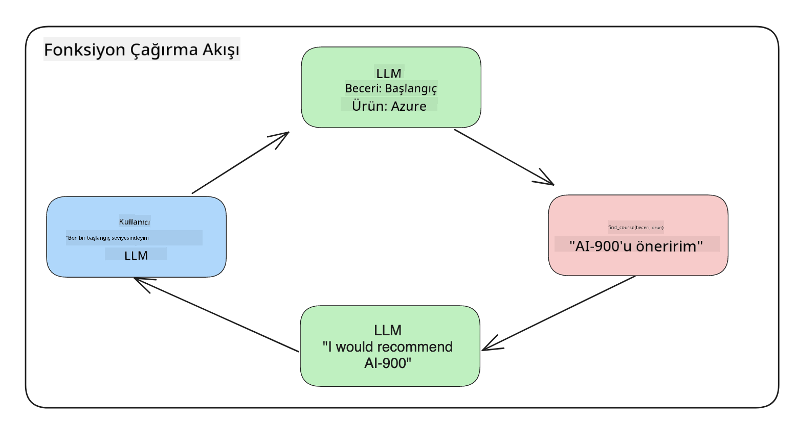

<!--
CO_OP_TRANSLATOR_METADATA:
{
  "original_hash": "f6f84f9ef2d066cd25850cab93580a50",
  "translation_date": "2025-10-17T16:17:01+00:00",
  "source_file": "11-integrating-with-function-calling/README.md",
  "language_code": "tr"
}
-->
# Fonksiyon Çağrımı ile Entegrasyon

[](https://youtu.be/DgUdCLX8qYQ?si=f1ouQU5HQx6F8Gl2)

Önceki derslerde oldukça fazla şey öğrendiniz. Ancak daha da geliştirebiliriz. Ele alabileceğimiz bazı konular, yanıt formatını daha tutarlı hale getirerek yanıtı daha kolay işlenebilir hale getirmek ve uygulamamızı daha da zenginleştirmek için diğer kaynaklardan veri eklemek olabilir.

Bu bölümde yukarıda belirtilen sorunları ele alacağız.

## Giriş

Bu derste şunlar ele alınacak:

- Fonksiyon çağrımının ne olduğunu ve kullanım alanlarını açıklamak.
- Azure OpenAI kullanarak bir fonksiyon çağrımı oluşturmak.
- Bir uygulamaya fonksiyon çağrımını entegre etmek.

## Öğrenme Hedefleri

Bu dersin sonunda şunları yapabileceksiniz:

- Fonksiyon çağrımı kullanmanın amacını açıklamak.
- Azure OpenAI Hizmeti kullanarak Fonksiyon Çağrımı kurmak.
- Uygulamanızın kullanım senaryosu için etkili fonksiyon çağrımları tasarlamak.

## Senaryo: Sohbet botumuzu fonksiyonlarla geliştirmek

Bu derste, kullanıcıların teknik kurslar bulmasına olanak tanıyan bir sohbet botu özelliği oluşturmak istiyoruz. Kullanıcıların beceri seviyelerine, mevcut rollerine ve ilgilendikleri teknolojiye uygun kurslar önereceğiz.

Bu senaryoyu tamamlamak için aşağıdaki kombinasyonu kullanacağız:

- Kullanıcı için bir sohbet deneyimi oluşturmak için `Azure OpenAI`.
- Kullanıcıların isteklerine göre kurs bulmalarına yardımcı olmak için `Microsoft Learn Catalog API`.
- Kullanıcının sorgusunu alıp bir API isteği yapmak için bir fonksiyona göndermek için `Fonksiyon Çağrımı`.

Başlamak için, neden ilk etapta fonksiyon çağrımı kullanmak isteyebileceğimize bakalım:

## Neden Fonksiyon Çağrımı

Fonksiyon çağrımından önce, bir LLM'den gelen yanıtlar yapılandırılmamış ve tutarsızdı. Geliştiriciler, her yanıt varyasyonunu işleyebildiklerinden emin olmak için karmaşık doğrulama kodları yazmak zorundaydı. Kullanıcılar "Stockholm'deki hava durumu nedir?" gibi sorulara yanıt alamıyordu. Bunun nedeni, modellerin yalnızca eğitildikleri zamandaki verilere sınırlı olmasıydı.

Fonksiyon Çağrımı, Azure OpenAI Hizmeti'nin aşağıdaki sınırlamaları aşmak için sunduğu bir özelliktir:

- **Tutarlı yanıt formatı**. Yanıt formatını daha iyi kontrol edebilirsek, yanıtı diğer sistemlere entegre etmek daha kolay olur.
- **Harici veri**. Bir uygulamanın diğer kaynaklarından gelen verileri bir sohbet bağlamında kullanma yeteneği.

## Sorunu bir senaryo ile açıklamak

> Aşağıdaki senaryoyu çalıştırmak istiyorsanız, [dahil edilen notebook'u](./python/aoai-assignment.ipynb?WT.mc_id=academic-105485-koreyst) kullanmanızı öneririz. Ayrıca sadece okuyarak da devam edebilirsiniz, çünkü burada fonksiyonların sorunu nasıl çözebileceğini açıklamaya çalışıyoruz.

Yanıt formatı sorununu açıklayan bir örneğe bakalım:

Diyelim ki öğrenci verilerinden oluşan bir veritabanı oluşturmak istiyoruz, böylece onlara doğru kursu önerebiliriz. Aşağıda, içerdiği veriler açısından çok benzer olan iki öğrenci tanımı var.

1. Azure OpenAI kaynağımıza bir bağlantı oluşturun:

   ```python
   import os
   import json
   from openai import AzureOpenAI
   from dotenv import load_dotenv
   load_dotenv()

   client = AzureOpenAI(
   api_key=os.environ['AZURE_OPENAI_API_KEY'],  # this is also the default, it can be omitted
   api_version = "2023-07-01-preview"
   )

   deployment=os.environ['AZURE_OPENAI_DEPLOYMENT']
   ```

   Aşağıda, `api_type`, `api_base`, `api_version` ve `api_key` ayarlarını yaptığımız Azure OpenAI bağlantımızı yapılandırmak için bazı Python kodları bulunmaktadır.

1. `student_1_description` ve `student_2_description` değişkenlerini kullanarak iki öğrenci tanımı oluşturma.

   ```python
   student_1_description="Emily Johnson is a sophomore majoring in computer science at Duke University. She has a 3.7 GPA. Emily is an active member of the university's Chess Club and Debate Team. She hopes to pursue a career in software engineering after graduating."

   student_2_description = "Michael Lee is a sophomore majoring in computer science at Stanford University. He has a 3.8 GPA. Michael is known for his programming skills and is an active member of the university's Robotics Club. He hopes to pursue a career in artificial intelligence after finishing his studies."
   ```

   Yukarıdaki öğrenci tanımlarını bir LLM'e gönderip verileri ayrıştırmasını istiyoruz. Bu veriler daha sonra uygulamamızda kullanılabilir ve bir API'ye gönderilebilir veya bir veritabanında saklanabilir.

1. LLM'e hangi bilgileri istediğimizi belirttiğimiz iki özdeş istem oluşturun:

   ```python
   prompt1 = f'''
   Please extract the following information from the given text and return it as a JSON object:

   name
   major
   school
   grades
   club

   This is the body of text to extract the information from:
   {student_1_description}
   '''

   prompt2 = f'''
   Please extract the following information from the given text and return it as a JSON object:

   name
   major
   school
   grades
   club

   This is the body of text to extract the information from:
   {student_2_description}
   '''
   ```

   Yukarıdaki istemler, LLM'e bilgileri çıkarmasını ve yanıtı JSON formatında döndürmesini talimat verir.

1. İstemleri ve Azure OpenAI bağlantısını ayarladıktan sonra, istemleri `openai.ChatCompletion` kullanarak LLM'e göndereceğiz. İstemi `messages` değişkeninde saklayıp role `user` atayacağız. Bu, bir kullanıcının bir sohbet botuna yazdığı bir mesajı taklit etmek içindir.

   ```python
   # response from prompt one
   openai_response1 = client.chat.completions.create(
   model=deployment,
   messages = [{'role': 'user', 'content': prompt1}]
   )
   openai_response1.choices[0].message.content

   # response from prompt two
   openai_response2 = client.chat.completions.create(
   model=deployment,
   messages = [{'role': 'user', 'content': prompt2}]
   )
   openai_response2.choices[0].message.content
   ```

Şimdi her iki isteği LLM'e gönderebilir ve aldığımız yanıtı `openai_response1['choices'][0]['message']['content']` gibi bulabiliriz.

1. Son olarak, yanıtı JSON formatına dönüştürmek için `json.loads` çağırabiliriz:

   ```python
   # Loading the response as a JSON object
   json_response1 = json.loads(openai_response1.choices[0].message.content)
   json_response1
   ```

   Yanıt 1:

   ```json
   {
     "name": "Emily Johnson",
     "major": "computer science",
     "school": "Duke University",
     "grades": "3.7",
     "club": "Chess Club"
   }
   ```

   Yanıt 2:

   ```json
   {
     "name": "Michael Lee",
     "major": "computer science",
     "school": "Stanford University",
     "grades": "3.8 GPA",
     "club": "Robotics Club"
   }
   ```

   İstemler aynı ve tanımlar benzer olmasına rağmen, `Grades` özelliğinin değerlerinin farklı formatlarda olduğunu görüyoruz; bazen `3.7` veya `3.7 GPA` formatında olabiliyor.

   Bu sonuç, LLM'in yazılı istem şeklindeki yapılandırılmamış verileri alması ve yapılandırılmamış veriler döndürmesi nedeniyle oluşur. Bu verileri saklarken veya kullanırken ne bekleyeceğimizi bilmek için yapılandırılmış bir formata sahip olmamız gerekir.

Peki formatlama sorununu nasıl çözeriz? Fonksiyonel çağrımı kullanarak yapılandırılmış veriler alacağımızdan emin olabiliriz. Fonksiyon çağrımı kullanıldığında, LLM aslında herhangi bir fonksiyonu çağırmaz veya çalıştırmaz. Bunun yerine, LLM'in yanıtları için takip edeceği bir yapı oluştururuz. Daha sonra bu yapılandırılmış yanıtları kullanarak uygulamalarımızda hangi fonksiyonun çalıştırılacağını biliriz.



Fonksiyondan dönen verileri alıp bunu LLM'e geri gönderebiliriz. LLM daha sonra kullanıcının sorgusuna yanıt vermek için doğal dil kullanarak yanıt verir.

## Fonksiyon çağrımı kullanımı için senaryolar

Fonksiyon çağrımının uygulamanızı geliştirebileceği birçok farklı kullanım alanı vardır, örneğin:

- **Harici Araçları Çağırma**. Sohbet botları, kullanıcılardan gelen sorulara yanıt vermede harikadır. Fonksiyon çağrımı kullanarak, sohbet botları kullanıcıların mesajlarını belirli görevleri tamamlamak için kullanabilir. Örneğin, bir öğrenci sohbet botuna "Bu konuda daha fazla yardıma ihtiyacım olduğunu söyleyen bir e-posta gönder" diyebilir. Bu, `send_email(to: string, body: string)` adlı bir fonksiyon çağrısı yapabilir.

- **API veya Veritabanı Sorguları Oluşturma**. Kullanıcılar, doğal dili kullanarak biçimlendirilmiş bir sorguya veya API isteğine dönüştürülen bilgileri bulabilir. Örneğin, bir öğretmen "Son ödevi tamamlayan öğrenciler kimler?" diye sorabilir ve bu `get_completed(student_name: string, assignment: int, current_status: string)` adlı bir fonksiyonu çağırabilir.

- **Yapılandırılmış Veri Oluşturma**. Kullanıcılar bir metin bloğunu veya CSV'yi alabilir ve LLM'i kullanarak önemli bilgileri çıkarabilir. Örneğin, bir öğrenci bir Wikipedia makalesini barış anlaşmaları hakkında AI flash kartları oluşturmak için dönüştürebilir. Bu, `get_important_facts(agreement_name: string, date_signed: string, parties_involved: list)` adlı bir fonksiyon kullanılarak yapılabilir.

## İlk Fonksiyon Çağrınızı Oluşturma

Bir fonksiyon çağrısı oluşturma süreci 3 ana adımdan oluşur:

1. **Çağırma**: Fonksiyonlarınızın bir listesini ve bir kullanıcı mesajını içeren Chat Completions API'sini çağırma.
2. **Okuma**: Modelin yanıtını bir işlem gerçekleştirmek için okuma, yani bir fonksiyon veya API çağrısı yürütme.
3. **Yapma**: Fonksiyondan gelen yanıtla Chat Completions API'sine başka bir çağrı yaparak bu bilgiyi kullanıcının sorgusuna yanıt oluşturmak için kullanma.


### Adım 1 - mesajlar oluşturma

İlk adım bir kullanıcı mesajı oluşturmaktır. Bu, bir metin girişinin değerini dinamik olarak alarak atanabilir veya buraya bir değer atanabilir. Chat Completions API'si ile ilk kez çalışıyorsanız, mesajın `role` ve `content` değerlerini tanımlamanız gerekir.

`role` ya `system` (kurallar oluşturma), `assistant` (model) ya da `user` (son kullanıcı) olabilir. Fonksiyon çağrımı için bunu `user` olarak atayacağız ve örnek bir soru ekleyeceğiz.

```python
messages= [ {"role": "user", "content": "Find me a good course for a beginner student to learn Azure."} ]
```

Farklı roller atayarak, LLM'e sistemin mi yoksa kullanıcının mı bir şey söylediği açıkça belirtilir, bu da LLM'in üzerine inşa edebileceği bir konuşma geçmişi oluşturmasına yardımcı olur.

### Adım 2 - fonksiyonlar oluşturma

Sonraki adımda bir fonksiyon ve bu fonksiyonun parametrelerini tanımlayacağız. Burada sadece `search_courses` adlı bir fonksiyon kullanacağız, ancak birden fazla fonksiyon oluşturabilirsiniz.

> **Önemli**: Fonksiyonlar, LLM'e gönderilen sistem mesajına dahil edilir ve kullanılabilir token miktarınıza dahil edilir.

Aşağıda, fonksiyonları bir öğe dizisi olarak oluşturuyoruz. Her öğe bir fonksiyondur ve `name`, `description` ve `parameters` özelliklerine sahiptir:

```python
functions = [
   {
      "name":"search_courses",
      "description":"Retrieves courses from the search index based on the parameters provided",
      "parameters":{
         "type":"object",
         "properties":{
            "role":{
               "type":"string",
               "description":"The role of the learner (i.e. developer, data scientist, student, etc.)"
            },
            "product":{
               "type":"string",
               "description":"The product that the lesson is covering (i.e. Azure, Power BI, etc.)"
            },
            "level":{
               "type":"string",
               "description":"The level of experience the learner has prior to taking the course (i.e. beginner, intermediate, advanced)"
            }
         },
         "required":[
            "role"
         ]
      }
   }
]
```

Her bir fonksiyon örneğini daha ayrıntılı olarak açıklayalım:

- `name` - Çağrılmasını istediğimiz fonksiyonun adı.
- `description` - Fonksiyonun nasıl çalıştığını açıklayan açıklama. Burada spesifik ve net olmak önemlidir.
- `parameters` - Modelin yanıtında üretmesini istediğiniz değerlerin ve formatın bir listesi. Parametreler dizisi, öğelerin aşağıdaki özelliklere sahip olduğu öğelerden oluşur:
  1.  `type` - Özelliklerin saklanacağı veri türü.
  1.  `properties` - Modelin yanıtı için kullanacağı belirli değerlerin listesi.
      1. `name` - Modelin biçimlendirilmiş yanıtında kullanacağı özelliğin adı, örneğin `product`.
      1. `type` - Bu özelliğin veri türü, örneğin `string`.
      1. `description` - Belirli özelliğin açıklaması.

Ayrıca isteğe bağlı bir özellik olan `required` - fonksiyon çağrımının tamamlanması için gerekli olan özellik.

### Adım 3 - Fonksiyon çağrımı yapma

Bir fonksiyon tanımladıktan sonra, bunu Chat Completion API çağrısına dahil etmemiz gerekiyor. Bunu isteğe `functions` ekleyerek yapıyoruz. Bu durumda `functions=functions`.

Ayrıca `function_call` seçeneğini `auto` olarak ayarlama seçeneği vardır. Bu, kullanıcı mesajına göre hangi fonksiyonun çağrılması gerektiğine LLM'in karar vermesine izin verir, kendimiz atamak yerine.

Aşağıda `ChatCompletion.create` çağrısında `functions=functions` ve `function_call="auto"` ayarladığımız ve böylece LLM'e sağladığımız fonksiyonları ne zaman çağıracağına karar verme yetkisi verdiğimiz bir kod bulunmaktadır:

```python
response = client.chat.completions.create(model=deployment,
                                        messages=messages,
                                        functions=functions,
                                        function_call="auto")

print(response.choices[0].message)
```

Gelen yanıt şu şekilde görünüyor:

```json
{
  "role": "assistant",
  "function_call": {
    "name": "search_courses",
    "arguments": "{\n  \"role\": \"student\",\n  \"product\": \"Azure\",\n  \"level\": \"beginner\"\n}"
  }
}
```

Burada `search_courses` fonksiyonunun çağrıldığını ve JSON yanıtındaki `arguments` özelliğinde listelenen argümanlarla çağrıldığını görebiliyoruz.

Sonuç olarak, LLM, `messages` parametresine sağlanan değerden verileri çıkararak fonksiyonun argümanlarına uygun verileri bulabildi. Aşağıda `messages` değerinin bir hatırlatması bulunmaktadır:

```python
messages= [ {"role": "user", "content": "Find me a good course for a beginner student to learn Azure."} ]
```

Gördüğünüz gibi, `student`, `Azure` ve `beginner` `messages`'dan çıkarıldı ve fonksiyona giriş olarak ayarlandı. Fonksiyonları bu şekilde kullanmak, bir istemden bilgi çıkarmanın harika bir yoludur, aynı zamanda LLM'e yapı sağlamak ve yeniden kullanılabilir işlevsellik sunmak için harika bir yöntemdir.

Şimdi bunu uygulamamızda nasıl kullanabileceğimizi görmemiz gerekiyor.

## Fonksiyon Çağrılarını Bir Uygulamaya Entegre Etme

LLM'den gelen biçimlendirilmiş yanıtı test ettikten sonra, bunu artık bir uygulamaya entegre edebiliriz.

### Akışı Yönetme

Bunu uygulamamıza entegre etmek için şu adımları izleyelim:

1. İlk olarak, OpenAI hizmetlerine çağrı yapalım ve mesajı `response_message` adlı bir değişkende saklayalım.

   ```python
   response_message = response.choices[0].message
   ```

1. Şimdi Microsoft Learn API'yi çağırarak bir kurs listesi almak için bir fonksiyon tanımlayacağız:

   ```python
   import requests

   def search_courses(role, product, level):
     url = "https://learn.microsoft.com/api/catalog/"
     params = {
        "role": role,
        "product": product,
        "level": level
     }
     response = requests.get(url, params=params)
     modules = response.json()["modules"]
     results = []
     for module in modules[:5]:
        title = module["title"]
        url = module["url"]
        results.append({"title": title, "url": url})
     return str(results)
   ```

   Şimdi `functions` değişkenlerinde tanıtılan fonksiyon adlarına eşleşen gerçek bir Python fonksiyonu oluşturduğumuza dikkat edin. Ayrıca ihtiyaç duyduğumuz verileri almak için gerçek harici API çağrıları yapıyoruz. Bu durumda, eğitim modüllerini aramak için Microsoft Learn API'ye gidiyoruz.

Tamam, `functions` değişkenlerini ve karşılık gelen bir Python fonksiyonunu oluşturduk, peki Python fonksiyonumuzun çağrılmasını LLM'e nasıl söyleyeceğiz?

1. Bir Python fonksiyonunu çağırmamız gerekip gerekmediğini görmek için LLM yanıtını inceleyip `function_call`'ın bir parçası olup olmadığını kontrol etmemiz ve belirtilen fonksiyonu çağırmamız gerekiyor. Aşağıda bu kontrolü nasıl yapabileceğinizi görebilirsiniz:

   ```python
   # Check if the model wants to call a function
   if response_message.function_call.name:
    print("Recommended Function call:")
    print(response_message.function_call.name)
    print()

    # Call the function.
    function_name = response_message.function_call.name

    available_functions = {
            "search_courses": search_courses,
    }
    function_to_call = available_functions[function_name]

    function_args = json.loads(response_message.function_call.arguments)
    function_response = function_to_call(**function_args)

    print("Output of function call:")
    print(function_response)
    print(type(function_response))


    # Add the assistant response and function response to the messages
    messages.append( # adding assistant response to messages
        {
            "role": response_message.role,
            "function_call": {
                "name": function_name,
                "arguments": response_message.function_call.arguments,
            },
            "content": None
        }
    )
    messages.append( # adding function response to messages
        {
            "role": "function",
            "name": function_name,
            "content":function_response,
        }
    )
   ```

   Bu üç satır, fonksiyon adını, argümanları çıkarır ve çağrıyı yapar:

   ```python
   function_to_call = available_functions[function_name]

   function_args = json.loads(response_message.function_call.arguments)
   function_response = function_to_call(**function_args)
   ```

   Aşağıda kodumuzu çalıştırdıktan sonra çıkan sonuç bulunmaktadır:

   **Çıktı**

   ```Recommended Function call:
   {
     "name": "search_courses",
     "arguments": "{\n  \"role\": \"student\",\n  \"product\": \"Azure\",\n  \"level\": \"beginner\"\n}"
   }

   Output of function call:
   [{'title': 'Describe concepts of cryptography', 'url': 'https://learn.microsoft.com/training/modules/describe-concepts-of-cryptography/?
   WT.mc_id=api_CatalogApi'}, {'title': 'Introduction to audio classification with TensorFlow', 'url': 'https://learn.microsoft.com/en-
   us/training/modules/intro-audio-classification-tensorflow/?WT.mc_id=api_CatalogApi'}, {'title': 'Design a Performant Data Model in Azure SQL
   Database with Azure Data Studio', 'url': 'https://learn.microsoft.com/training/modules/design-a-data-model-with-ads/?
   WT.mc_id=api_CatalogApi'}, {'title': 'Getting started with the Microsoft Cloud Adoption Framework for Azure', 'url':
   'https://learn.microsoft.com/training/modules/cloud-adoption-framework-getting-started/?WT.mc_id=api_CatalogApi'}, {'title': 'Set up the
   Rust development environment', 'url': 'https://learn.microsoft.com/training/modules/rust-set-up-environment/?WT.mc_id=api_CatalogApi'}]
   <class 'str'>
   ```

1. Şimdi güncellenmiş mesajı, `messages`'ı LLM'e göndererek bir API JSON formatında yanıt yerine doğal dilde bir yanıt alabiliriz.

   ```python
   print("Messages in next request:")
   print(messages)
   print()

   second_response = client.chat.completions.create(
      messages=messages,
      model=deployment,
      function_call="auto",
      functions=functions,
      temperature=0
         )  # get a new response from GPT where it can see the function response


   print(second_response.choices[0].message)
   ```

   **Çıktı**

   ```python
   {
     "role": "assistant",
     "content": "I found some good courses for beginner students to learn Azure:\n\n1. [Describe concepts of cryptography] (https://learn.microsoft.com/training/modules/describe-concepts-of-cryptography/?WT.mc_id=api_CatalogApi)\n2. [Introduction to audio classification with TensorFlow](https://learn.microsoft.com/training/modules/intro-audio-classification-tensorflow/?WT.mc_id=api_CatalogApi)\n3. [Design a Performant Data Model in Azure SQL Database with Azure Data Studio](https://learn.microsoft.com/training/modules/design-a-data-model-with-ads/?WT.mc_id=api_CatalogApi)\n4. [Getting started with the Microsoft Cloud Adoption Framework for Azure](https://learn.microsoft.com/training/modules/cloud-adoption-framework-getting-started/?WT.mc_id=api_CatalogApi)\n5. [Set up the Rust development environment](https://learn.microsoft.com/training/modules/rust-set-up-environment/?WT.mc_id=api_CatalogApi)\n\nYou can click on the links to access the courses."
   }

   ```

## Ödev

Azure OpenAI Fonksiyon Çağrımı öğreniminizi devam ettirmek için şunları yapabilirsiniz:

- Öğrencilerin daha fazla kurs bulmasına yardımcı olabilecek fonksiyonun daha fazla parametresini ekleyin.
- Öğrenciden ana dili gibi daha fazla bilgi alan başka bir fonksiyon çağrısı oluşturun.
- Fonksiyon çağrısı ve/veya API çağrısı uygun kurslar döndürmediğinde hata işleme oluşturun.

İpucu: Bu verilerin nasıl ve nerede mevcut olduğunu görmek için [Learn API referans dokümantasyonu](https://learn.microsoft.com/training/support/catalog-api-developer-reference?WT.mc_id=academic-105485-koreyst) sayfasını takip edin.

## Harika İş! Yolculuğa Devam Edin

Bu dersi tamamladıktan sonra, [Generative AI Öğrenme koleksiyonumuza](https://aka.ms/genai-collection?WT.mc_id=academic-105485-koreyst) göz atarak Generative AI bilginizi geliştirmeye devam edin!

12. Derse geçin, burada [AI uygulamaları için UX tasarımını](../12-designing-ux-for-ai-applications/README.md?WT.mc_id=academic-105485-koreyst) inceleyeceğiz!

---

**Feragatname**:  
Bu belge, AI çeviri hizmeti [Co-op Translator](https://github.com/Azure/co-op-translator) kullanılarak çevrilmiştir. Doğruluk için çaba göstersek de, otomatik çeviriler hata veya yanlışlıklar içerebilir. Belgenin orijinal dili, yetkili kaynak olarak kabul edilmelidir. Kritik bilgiler için profesyonel insan çevirisi önerilir. Bu çevirinin kullanımından kaynaklanan herhangi bir yanlış anlama veya yanlış yorumlama durumunda sorumluluk kabul edilmez.