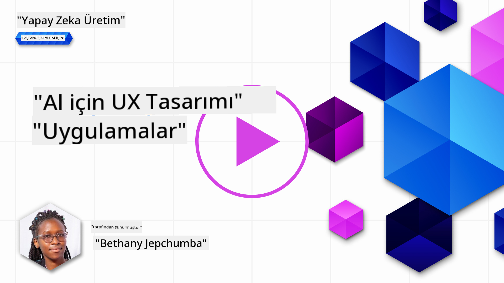
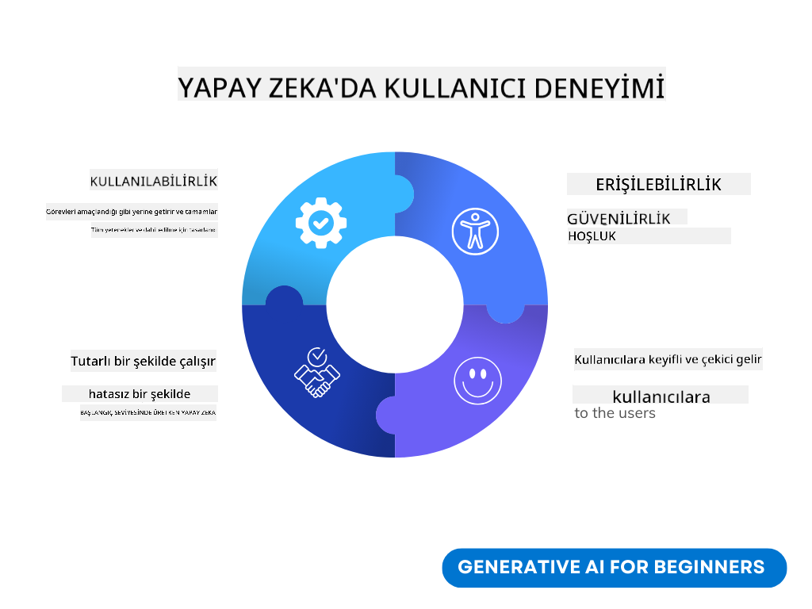
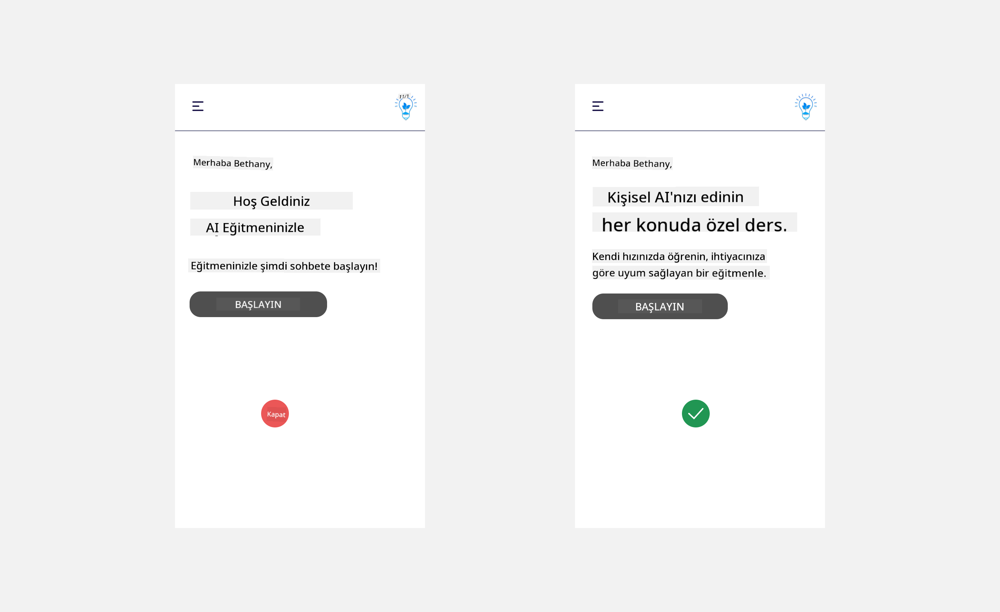
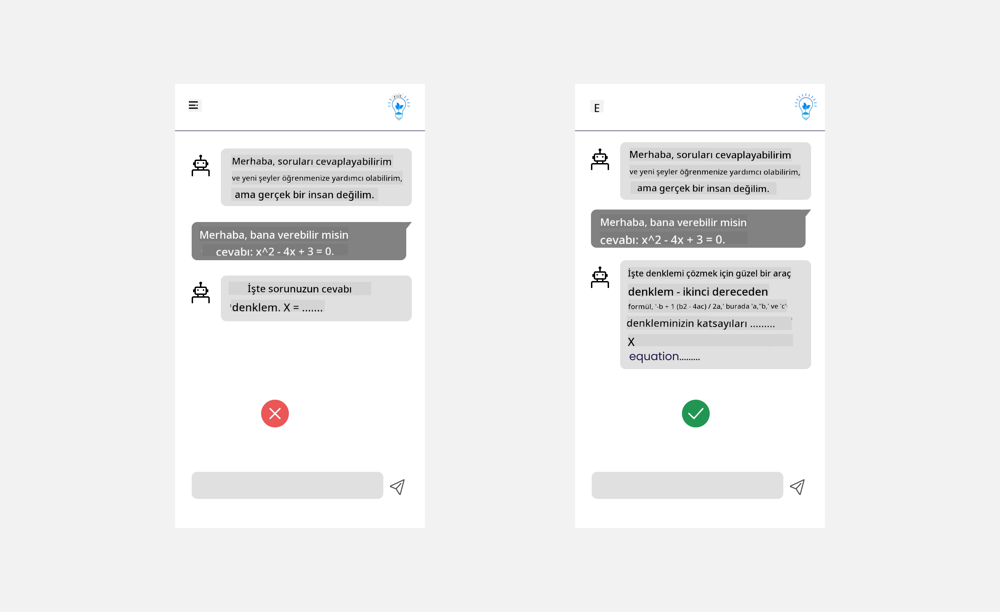
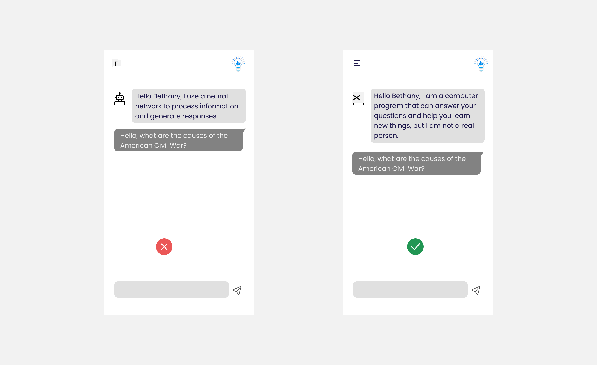
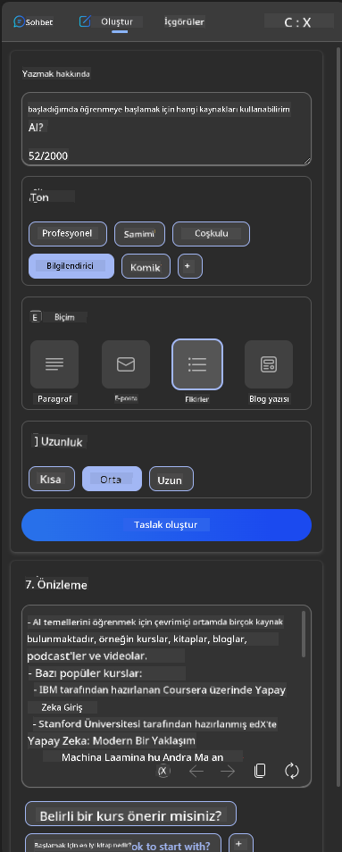
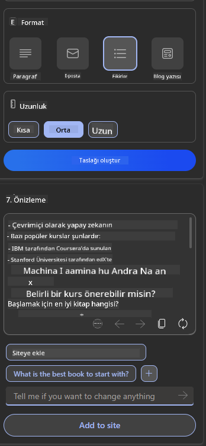
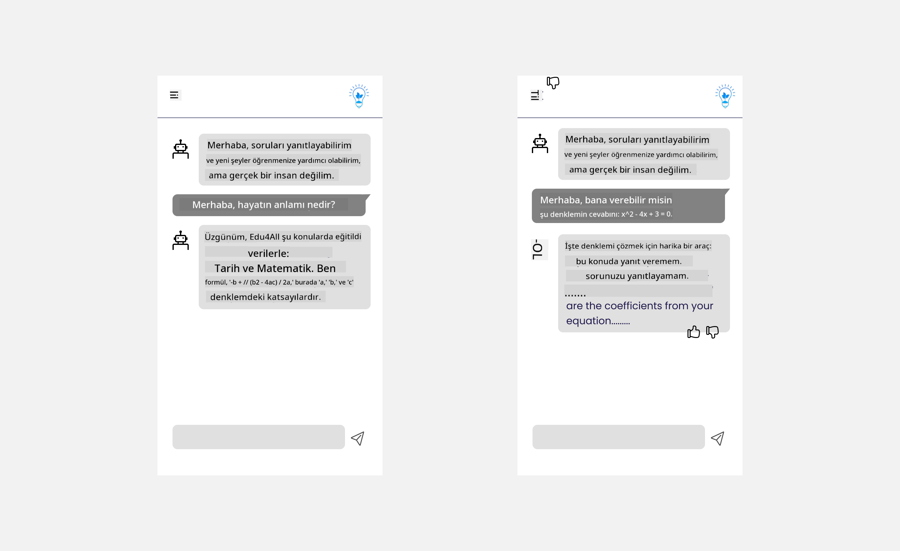

<!--
CO_OP_TRANSLATOR_METADATA:
{
  "original_hash": "ec385b41ee50579025d50cc03bfb3a25",
  "translation_date": "2025-05-19T21:55:02+00:00",
  "source_file": "12-designing-ux-for-ai-applications/README.md",
  "language_code": "tr"
}
-->
# AI Uygulamaları için UX Tasarımı

> _(Bu dersin videosunu izlemek için yukarıdaki resme tıklayın)_

Kullanıcı deneyimi, uygulama geliştirmenin çok önemli bir yönüdür. Kullanıcıların, görevlerini verimli bir şekilde yerine getirmek için uygulamanızı kullanabilmesi gerekir. Verimli olmak bir şeydir, ancak uygulamaları herkesin kullanabileceği şekilde tasarlamanız da gerekir, yani onları _erişilebilir_ hale getirmek. Bu bölüm, insanların kullanabileceği ve kullanmak isteyeceği bir uygulama tasarlamanıza yardımcı olmayı umarak bu alana odaklanacaktır.

## Giriş

Kullanıcı deneyimi, bir kullanıcının belirli bir ürün veya hizmetle, ister bir sistem, araç veya tasarım olsun, nasıl etkileşimde bulunduğunu ve kullandığını ifade eder. AI uygulamaları geliştirirken, geliştiriciler sadece kullanıcı deneyiminin etkili olmasını sağlamakla kalmaz, aynı zamanda etik olmasına da odaklanırlar. Bu derste, kullanıcı ihtiyaçlarını ele alan Yapay Zeka (AI) uygulamalarının nasıl oluşturulacağını ele alıyoruz.

Ders aşağıdaki alanları kapsayacaktır:

- Kullanıcı Deneyimine Giriş ve Kullanıcı İhtiyaçlarını Anlama
- Güven ve Şeffaflık için AI Uygulamaları Tasarlama
- İşbirliği ve Geri Bildirim için AI Uygulamaları Tasarlama

## Öğrenme Hedefleri

Bu dersi aldıktan sonra:

- Kullanıcı ihtiyaçlarını karşılayan AI uygulamalarının nasıl oluşturulacağını anlayabileceksiniz.
- Güven ve işbirliğini teşvik eden AI uygulamaları tasarlayabileceksiniz.

### Ön Koşul

Biraz zaman ayırarak [kullanıcı deneyimi ve tasarım düşüncesi](https://learn.microsoft.com/training/modules/ux-design?WT.mc_id=academic-105485-koreyst) hakkında daha fazla okuyun.

## Kullanıcı Deneyimine Giriş ve Kullanıcı İhtiyaçlarını Anlama

Hayali eğitim girişimimizde, iki ana kullanıcımız var: öğretmenler ve öğrenciler. Bu iki kullanıcının her birinin benzersiz ihtiyaçları vardır. Kullanıcı merkezli tasarım, ürünlerin, hedeflendiği kişiler için uygun ve faydalı olmasını sağlamak amacıyla kullanıcıyı önceliklendirir.

Uygulama, iyi bir kullanıcı deneyimi sağlamak için **kullanışlı, güvenilir, erişilebilir ve hoş** olmalıdır.

### Kullanılabilirlik

Kullanışlı olmak, uygulamanın amacına uygun işlevselliğe sahip olması anlamına gelir; örneğin, not verme sürecini otomatikleştirmek veya tekrar için flash kartlar oluşturmak gibi. Not verme sürecini otomatikleştiren bir uygulama, öğrencilerin çalışmalarına önceden tanımlanmış kriterlere göre doğru ve verimli bir şekilde puan verebilmelidir. Benzer şekilde, tekrar flash kartları oluşturan bir uygulama, verileri temel alarak ilgili ve çeşitli sorular oluşturabilmelidir.

### Güvenilirlik

Güvenilir olmak, uygulamanın görevini tutarlı bir şekilde ve hatasız yerine getirebilmesi anlamına gelir. Ancak, tıpkı insanlar gibi AI da mükemmel değildir ve hatalara meyilli olabilir. Uygulamalar, insan müdahalesi veya düzeltme gerektiren hatalar veya beklenmedik durumlarla karşılaşabilir. Hataları nasıl ele alırsınız? Bu dersin son bölümünde, AI sistemleri ve uygulamalarının işbirliği ve geri bildirim için nasıl tasarlandığını ele alacağız.

### Erişilebilirlik

Erişilebilir olmak, kullanıcı deneyimini, engelli olanlar da dahil olmak üzere çeşitli yeteneklere sahip kullanıcılara genişletmek anlamına gelir, böylece kimse dışlanmaz. Erişilebilirlik yönergeleri ve ilkelerini takip ederek, AI çözümleri daha kapsayıcı, kullanılabilir ve tüm kullanıcılar için faydalı hale gelir.

### Hoş

Hoş olmak, uygulamanın kullanımı keyifli olması anlamına gelir. Çekici bir kullanıcı deneyimi, kullanıcının uygulamaya geri dönmesini teşvik ederek olumlu bir etki yaratabilir ve işletme gelirini artırabilir.

Her zorluk AI ile çözülemez. AI, manuel görevleri otomatikleştirmek veya kullanıcı deneyimlerini kişiselleştirmek gibi kullanıcı deneyiminizi artırmak için devreye girer.

## Güven ve Şeffaflık için AI Uygulamaları Tasarlama

Güven inşa etmek, AI uygulamaları tasarlarken kritik öneme sahiptir. Güven, kullanıcının uygulamanın işi yapacağına, sonuçları tutarlı bir şekilde sunacağına ve sonuçların kullanıcının ihtiyaçlarına uygun olacağına dair güven duymasını sağlar. Bu alandaki bir risk, güvensizlik ve aşırı güvendir. Güvensizlik, bir kullanıcının AI sistemine az ya da hiç güvenmemesi durumunda ortaya çıkar, bu da kullanıcının uygulamanızı reddetmesine yol açar. Aşırı güven, bir kullanıcının AI sisteminin yeteneklerini abartması durumunda ortaya çıkar ve kullanıcıların AI sistemine aşırı güvenmesine yol açar. Örneğin, otomatik not verme sistemi durumunda aşırı güven, öğretmenin bazı kağıtları not verme sisteminin iyi çalıştığından emin olmak için gözden geçirmemesine yol açabilir. Bu, öğrenciler için adaletsiz veya yanlış notlara ya da geri bildirim ve iyileştirme fırsatlarının kaçırılmasına neden olabilir.

Güvenin tasarımın merkezine yerleştirildiğinden emin olmanın iki yolu açıklanabilirlik ve kontroldür.

### Açıklanabilirlik

AI, gelecekteki nesillere bilgi aktarma gibi kararlar alırken yardımcı olduğunda, öğretmenlerin ve ebeveynlerin AI kararlarının nasıl alındığını anlamaları kritiktir. Bu, açıklanabilirlik - AI uygulamalarının nasıl karar aldığını anlama - anlamına gelir. Açıklanabilirlik için tasarım yapmak, bir AI uygulamasının neler yapabileceği örneklerinin detaylarını eklemeyi içerir. Örneğin, "AI öğretmeni ile başlayın" yerine sistem: "Notlarınızı daha kolay tekrar için özetleyin" ifadesini kullanabilir.

Başka bir örnek, AI'nın kullanıcı ve kişisel verileri nasıl kullandığıdır. Örneğin, öğrenci kişiliğine sahip bir kullanıcı, kişiliğine bağlı olarak sınırlamalara sahip olabilir. AI, sorulara cevapları açıklayamayabilir, ancak kullanıcının bir sorunu nasıl çözebileceğini düşünmesine rehberlik edebilir.

Açıklanabilirliğin son önemli kısmı, açıklamaların basitleştirilmesidir. Öğrenciler ve öğretmenler AI uzmanı olmayabilir, bu nedenle uygulamanın neler yapabileceği veya yapamayacağına dair açıklamalar basitleştirilmeli ve kolayca anlaşılabilir olmalıdır.

### Kontrol

Üretici AI, AI ve kullanıcı arasında bir işbirliği yaratır; örneğin, bir kullanıcı farklı sonuçlar için istemleri değiştirebilir. Ek olarak, bir çıktı üretildiğinde, kullanıcılar sonuçları değiştirerek bir kontrol hissi elde edebilmelidir. Örneğin, Bing kullanırken, isteminizi format, ton ve uzunluğa göre özelleştirebilirsiniz. Ayrıca, çıktınıza değişiklikler ekleyebilir ve çıktıyı aşağıda gösterildiği gibi değiştirebilirsiniz:

Bing'de, bir kullanıcının uygulama üzerinde kontrol sahibi olmasını sağlayan bir diğer özellik, AI'nın kullandığı verilere katılma ve katılmama yeteneğidir. Bir okul uygulaması için, bir öğrenci kendi notlarını ve öğretmenlerin kaynaklarını tekrar materyali olarak kullanmak isteyebilir.

> AI uygulamaları tasarlarken, kullanıcıların aşırı güven duymasını ve yetenekleri hakkında gerçekçi olmayan beklentiler oluşturmasını önlemek için niyetlilik önemlidir. Bunu yapmanın bir yolu, istemler ve sonuçlar arasında sürtünme yaratmaktır. Kullanıcıya bunun bir AI olduğunu ve bir insan olmadığını hatırlatmak

## İşbirliği ve Geri Bildirim için AI Uygulamaları Tasarlama

Daha önce belirtildiği gibi, üretici AI, kullanıcı ve AI arasında bir işbirliği yaratır. Çoğu etkileşim, bir kullanıcının bir istem girmesi ve AI'nın bir çıktı üretmesiyle gerçekleşir. Peki ya çıktı yanlışsa? Uygulama hataları nasıl ele alır? AI, kullanıcıyı suçlar mı yoksa hatayı açıklamak için zaman ayırır mı?

AI uygulamaları, geri bildirim almak ve vermek için inşa edilmelidir. Bu sadece AI sisteminin gelişmesine yardımcı olmakla kalmaz, aynı zamanda kullanıcılarla güven oluşturur. Tasarımda bir geri bildirim döngüsü dahil edilmelidir, örneğin basit bir beğenme veya beğenmeme butonu gibi.

Bunu ele almanın bir başka yolu, sistemin yeteneklerini ve sınırlamalarını açıkça iletmektir. Bir kullanıcı, AI'nın yeteneklerini aşan bir şey talep ettiğinde, bunun nasıl ele alınacağı da gösterilmelidir.

Sistem hataları, kullanıcının AI'nın kapsamı dışındaki bilgilerle yardıma ihtiyaç duyabileceği veya uygulamanın bir kullanıcının oluşturabileceği soru/konu sayısı üzerinde bir sınırı olabileceği uygulamalarda yaygındır. Örneğin, Tarih ve Matematik gibi sınırlı konularla eğitilmiş bir AI uygulaması, Coğrafya ile ilgili soruları ele alamayabilir. Bunu hafifletmek için, AI sistemi şu şekilde bir yanıt verebilir: "Üzgünüm, ürünümüz aşağıdaki konularda verilerle eğitilmiştir....., sorduğunuz soruya yanıt veremem."

AI uygulamaları mükemmel değildir, bu nedenle hata yapmaları muhtemeldir. Uygulamalarınızı tasarlarken, kullanıcı geri bildirimleri ve hata yönetimi için basit ve kolayca açıklanabilir bir şekilde yer bırakmalısınız.

## Ödev

Bugüne kadar oluşturduğunuz herhangi bir AI uygulamasını alın, uygulamanızda aşağıdaki adımları uygulamayı düşünün:

- **Hoş:** Uygulamanızı daha hoş hale getirmek için nasıl bir yaklaşım izleyebilirsiniz? Her yerde açıklamalar ekliyor musunuz? Kullanıcıyı keşfetmeye teşvik ediyor musunuz? Hata mesajlarınızı nasıl ifade ediyorsunuz?

- **Kullanılabilirlik:** Bir web uygulaması oluşturun. Uygulamanızın hem fare hem de klavye ile gezilebilir olduğundan emin olun.

- **Güven ve şeffaflık:** AI'ya ve çıktısına tamamen güvenmeyin, sürece bir insan ekleyerek çıktıyı doğrulamanın yollarını düşünün. Ayrıca, güven ve şeffaflığı sağlamak için diğer yolları düşünün ve uygulayın.

- **Kontrol:** Kullanıcının uygulamaya sağladığı veriler üzerinde kontrol sahibi olmasını sağlayın. AI uygulamasında veri toplama işlemlerine katılma ve katılmama yollarını uygulayın.

## Öğrenmeye Devam Edin!

Bu dersi tamamladıktan sonra, [Üretici AI Öğrenme koleksiyonumuzu](https://aka.ms/genai-collection?WT.mc_id=academic-105485-koreyst) inceleyerek Üretici AI bilginizi artırmaya devam edin!

13. Derse geçin, burada [AI uygulamalarını güvence altına almayı](../13-securing-ai-applications/README.md?WT.mc_id=academic-105485-koreyst) ele alacağız!

**Feragatname**: 
Bu belge, AI çeviri hizmeti [Co-op Translator](https://github.com/Azure/co-op-translator) kullanılarak çevrilmiştir. Doğruluk için çaba sarf etsek de, otomatik çevirilerin hata veya yanlışlık içerebileceğini lütfen unutmayın. Orijinal belge, kendi dilinde yetkili kaynak olarak kabul edilmelidir. Kritik bilgiler için profesyonel insan çevirisi önerilir. Bu çevirinin kullanımından kaynaklanan yanlış anlamalar veya yanlış yorumlamalardan sorumlu değiliz.