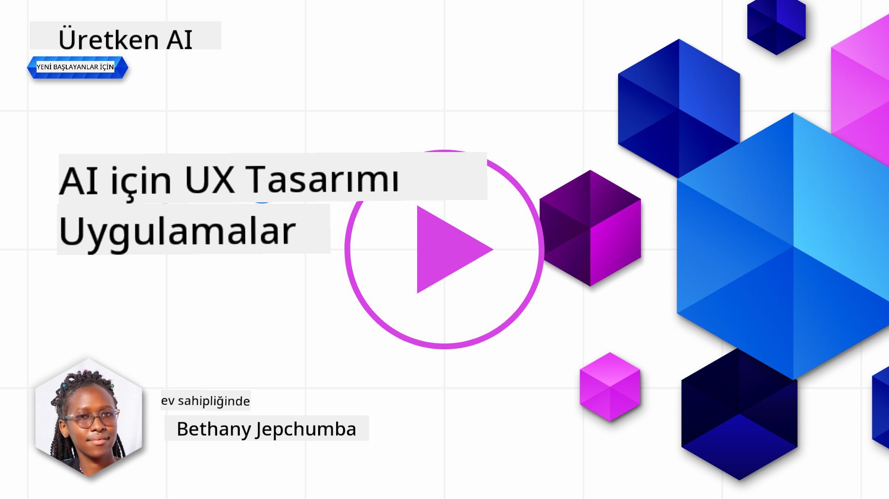
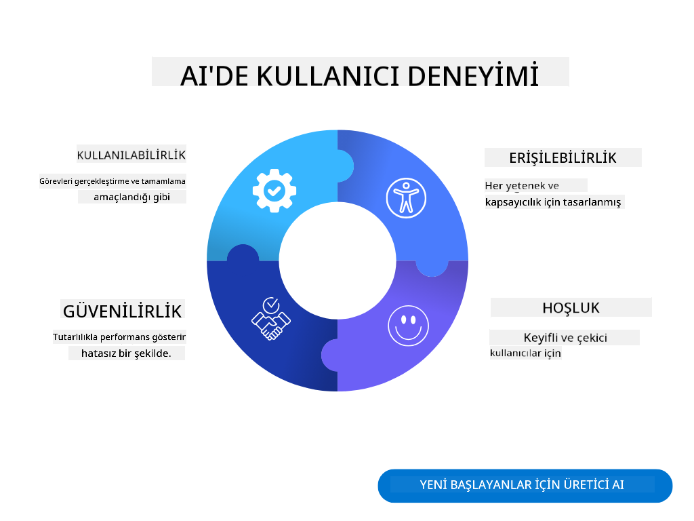
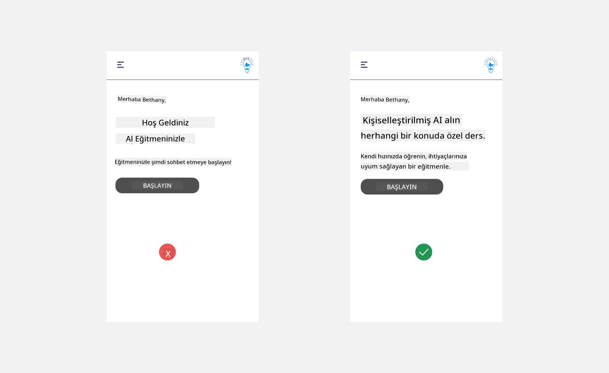
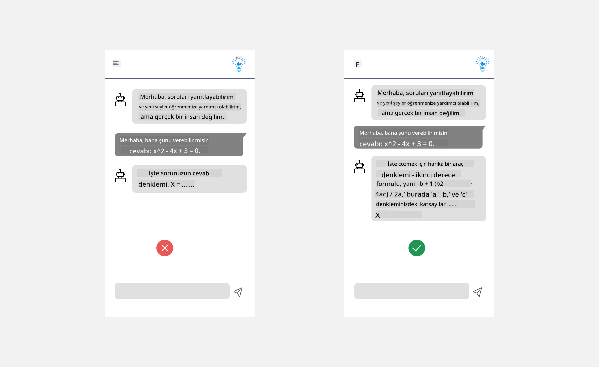
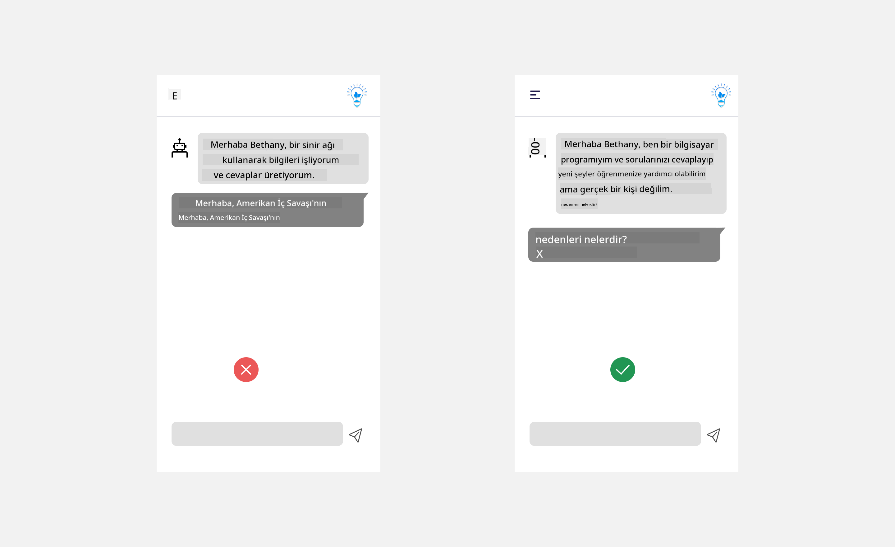
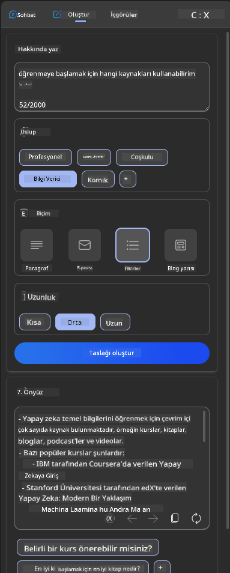
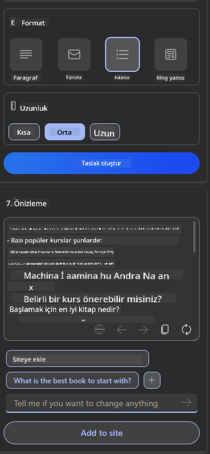
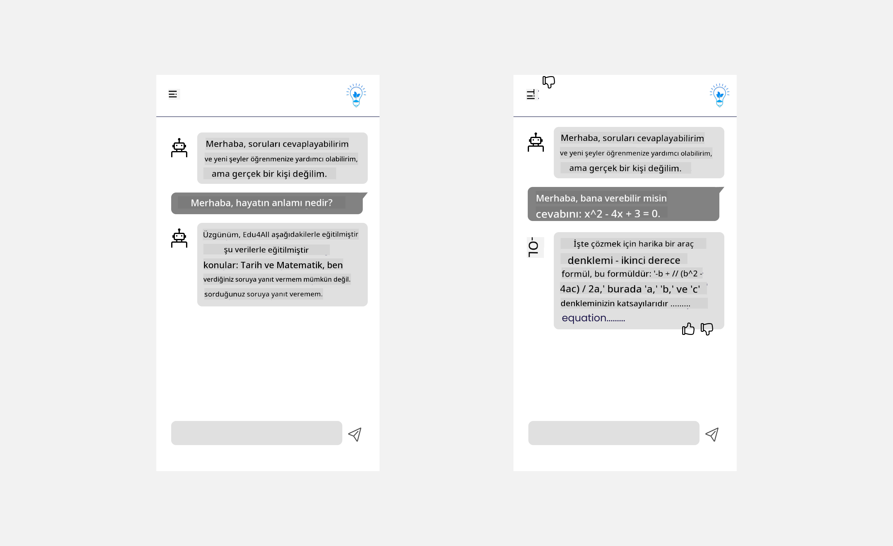

<!--
CO_OP_TRANSLATOR_METADATA:
{
  "original_hash": "ec385b41ee50579025d50cc03bfb3a25",
  "translation_date": "2025-06-25T20:22:20+00:00",
  "source_file": "12-designing-ux-for-ai-applications/README.md",
  "language_code": "tr"
}
-->
# AI Uygulamaları İçin UX Tasarımı

> _(Bu dersin videosunu izlemek için yukarıdaki resme tıklayın)_

Kullanıcı deneyimi, uygulama geliştirmenin çok önemli bir yönüdür. Kullanıcılar, uygulamanızı verimli bir şekilde kullanarak görevleri yerine getirebilmelidir. Verimli olmak bir şeydir, ancak uygulamaları herkesin kullanabileceği şekilde tasarlamak, onları _erişilebilir_ hale getirmek de gereklidir. Bu bölüm, bu alana odaklanacak, böylece insanların kullanabileceği ve kullanmak isteyeceği bir uygulama tasarlamanız umulur.

## Giriş

Kullanıcı deneyimi, bir kullanıcının belirli bir ürün veya hizmetle, ister bir sistem, araç veya tasarım olsun, nasıl etkileşimde bulunduğu ve kullandığıdır. AI uygulamaları geliştirirken, geliştiriciler sadece kullanıcı deneyiminin etkili olmasını sağlamakla kalmaz, aynı zamanda etik olmasına da odaklanırlar. Bu derste, kullanıcı ihtiyaçlarını karşılayan Yapay Zeka (AI) uygulamalarını nasıl oluşturacağımızı ele alıyoruz.

Ders aşağıdaki alanları kapsayacaktır:

- Kullanıcı Deneyimine Giriş ve Kullanıcı İhtiyaçlarını Anlama
- Güven ve Şeffaflık İçin AI Uygulamaları Tasarlama
- İşbirliği ve Geri Bildirim İçin AI Uygulamaları Tasarlama

## Öğrenme hedefleri

Bu dersi aldıktan sonra, şunları yapabileceksiniz:

- Kullanıcı ihtiyaçlarını karşılayan AI uygulamalarını nasıl oluşturacağınızı anlayın.
- Güven ve işbirliğini teşvik eden AI uygulamaları tasarlayın.

### Ön Koşul

Biraz zaman ayırın ve [kullanıcı deneyimi ve tasarım düşüncesi](https://learn.microsoft.com/training/modules/ux-design?WT.mc_id=academic-105485-koreyst) hakkında daha fazla okuyun.

## Kullanıcı Deneyimine Giriş ve Kullanıcı İhtiyaçlarını Anlama

Hayali eğitim girişimimizde, iki ana kullanıcıya sahibiz: öğretmenler ve öğrenciler. Her iki kullanıcının da benzersiz ihtiyaçları vardır. Kullanıcı odaklı tasarım, kullanıcıyı önceliklendirir ve ürünlerin, hedeflendiği kişiler için alakalı ve faydalı olmasını sağlar.

Uygulama, iyi bir kullanıcı deneyimi sağlamak için **yararlı, güvenilir, erişilebilir ve hoş** olmalıdır.

### Kullanılabilirlik

Yararlı olmak, uygulamanın amacına uygun işlevselliğe sahip olması anlamına gelir, örneğin not verme sürecini otomatikleştirmek veya gözden geçirme için flash kartlar oluşturmak gibi. Not verme sürecini otomatikleştiren bir uygulama, öğrencilerin çalışmalarına önceden belirlenmiş kriterlere göre doğru ve verimli bir şekilde puan verebilmelidir. Benzer şekilde, gözden geçirme flash kartları oluşturan bir uygulama, verilerine dayalı olarak ilgili ve çeşitli sorular oluşturabilmelidir.

### Güvenilirlik

Güvenilir olmak, uygulamanın görevini tutarlı bir şekilde ve hatasız olarak yerine getirebilmesi anlamına gelir. Ancak, AI tıpkı insanlar gibi mükemmel değildir ve hatalara eğilimli olabilir. Uygulamalar, insan müdahalesi veya düzeltme gerektiren hatalar veya beklenmedik durumlarla karşılaşabilir. Hataları nasıl ele alıyorsunuz? Bu dersin son bölümünde, AI sistemlerinin ve uygulamalarının işbirliği ve geri bildirim için nasıl tasarlandığını ele alacağız.

### Erişilebilirlik

Erişilebilir olmak, kullanıcı deneyimini çeşitli yeteneklere sahip kullanıcılara, engelli olanlar da dahil olmak üzere, genişleterek kimsenin dışlanmadığından emin olmak anlamına gelir. Erişilebilirlik yönergeleri ve ilkelerini takip ederek, AI çözümleri daha kapsayıcı, kullanılabilir ve tüm kullanıcılar için faydalı hale gelir.

### Hoş

Hoş olmak, uygulamanın kullanımı zevkli olması anlamına gelir. Çekici bir kullanıcı deneyimi, kullanıcı üzerinde olumlu bir etki yaratabilir ve kullanıcıyı uygulamaya geri dönmeye teşvik ederek işletme gelirini artırabilir.

Her zorluk AI ile çözülemez. AI, kullanıcı deneyiminizi geliştirmek için, ister manuel görevleri otomatikleştirmek, isterse kullanıcı deneyimlerini kişiselleştirmek olsun, devreye girer.

## Güven ve Şeffaflık İçin AI Uygulamaları Tasarlama

AI uygulamaları tasarlarken güven oluşturmak çok önemlidir. Güven, kullanıcının uygulamanın işi yapacağına, sonuçları tutarlı bir şekilde sunacağına ve sonuçların kullanıcının ihtiyaçlarına uygun olduğuna güvenmesini sağlar. Bu alanda bir risk, güvensizlik ve aşırı güven olabilir. Güvensizlik, bir kullanıcının bir AI sistemine az veya hiç güvenmemesi durumunda ortaya çıkar, bu da kullanıcının uygulamanızı reddetmesine yol açar. Aşırı güven, bir kullanıcının AI sisteminin yeteneğini abartması durumunda ortaya çıkar ve kullanıcıların AI sistemine çok fazla güvenmesine neden olur. Örneğin, otomatik bir not verme sistemi, aşırı güven durumunda öğretmenin bazı kağıtları not verme sisteminin iyi çalıştığını kontrol etmek için gözden geçirmemesine yol açabilir. Bu, öğrenciler için adaletsiz veya yanlış notlara veya geri bildirim ve iyileştirme fırsatlarının kaçırılmasına neden olabilir.

Güvenin tasarımın merkezine yerleştirilmesini sağlamak için iki yol açıklanabilirlik ve kontroldür.

### Açıklanabilirlik

AI, geleceğe bilgi aktarma gibi kararlar alırken yardımcı olduğunda, öğretmenlerin ve ebeveynlerin AI kararlarının nasıl alındığını anlaması çok önemlidir. Bu, açıklanabilirliktir - AI uygulamalarının nasıl kararlar aldığına dair anlayış. Açıklanabilirlik için tasarım yapmak, bir AI uygulamasının ne yapabileceğine dair örneklerin ayrıntılarını eklemeyi içerir. Örneğin, "AI öğretmen ile başlayın" yerine sistem, "Notlarınızı daha kolay gözden geçirme için AI kullanarak özetleyin" ifadesini kullanabilir.

Başka bir örnek, AI'nın kullanıcı ve kişisel verileri nasıl kullandığıdır. Örneğin, öğrenci kişiliğine sahip bir kullanıcı, kişiliğine bağlı olarak sınırlamalara sahip olabilir. AI, soruların cevaplarını açıklayamayabilir, ancak kullanıcının bir sorunu nasıl çözebileceğini düşünmesine yardımcı olabilir.

Açıklanabilirliğin son önemli kısmı, açıklamaların basitleştirilmesidir. Öğrenciler ve öğretmenler AI uzmanı olmayabilir, bu nedenle uygulamanın ne yapabileceği veya yapamayacağına dair açıklamalar basitleştirilmiş ve anlaşılması kolay olmalıdır.

### Kontrol

Üretken AI, AI ile kullanıcı arasında bir işbirliği yaratır, burada örneğin bir kullanıcı farklı sonuçlar için istemleri değiştirebilir. Ayrıca, bir çıktı oluşturulduktan sonra, kullanıcıların sonuçları değiştirebilmeleri, onlara kontrol hissi verir. Örneğin, Bing kullanırken, isteminizi format, ton ve uzunluğa göre özelleştirebilirsiniz. Ayrıca, çıktınıza değişiklikler ekleyebilir ve çıktıyı aşağıda gösterildiği gibi değiştirebilirsiniz:

Bing'de kullanıcının uygulama üzerinde kontrol sahibi olmasına olanak tanıyan bir başka özellik, AI'nın kullandığı verileri açma ve kapama yeteneğidir. Bir okul uygulaması için, bir öğrenci notlarını ve öğretmenlerin kaynaklarını gözden geçirme materyali olarak kullanmak isteyebilir.

> AI uygulamaları tasarlarken, kullanıcıların aşırı güven duymalarını ve yetenekleri hakkında gerçekçi olmayan beklentiler oluşturmalarını önlemek için kasıtlılık önemlidir. Bunu yapmanın bir yolu, istemler ve sonuçlar arasında sürtünme yaratmaktır. Kullanıcıya, bunun AI olduğunu ve bir insan olmadığını hatırlatmak

## İşbirliği ve Geri Bildirim İçin AI Uygulamaları Tasarlama

Daha önce belirtildiği gibi, üretken AI, kullanıcı ve AI arasında bir işbirliği yaratır. Çoğu etkileşim, bir kullanıcının bir istem girmesi ve AI'nın bir çıktı üretmesiyle gerçekleşir. Peki ya çıktı yanlışsa? Hatalar meydana geldiğinde uygulama nasıl başa çıkar? AI kullanıcıyı suçlar mı yoksa hatayı açıklamak için zaman ayırır mı?

AI uygulamaları, geri bildirim alacak ve verecek şekilde tasarlanmalıdır. Bu, AI sisteminin iyileşmesine yardımcı olmakla kalmaz, aynı zamanda kullanıcılarla güven oluşturur. Tasarımda bir geri bildirim döngüsü dahil edilmelidir, bir örnek basit bir yukarı veya aşağı başparmak olabilir.

Bunu ele almanın bir başka yolu, sistemin yeteneklerini ve sınırlamalarını açıkça iletmektir. Bir kullanıcı AI'nın yeteneklerini aşan bir istekte hata yaptığında, bununla başa çıkmanın bir yolu olmalıdır, aşağıda gösterildiği gibi.

Sistem hataları, kullanıcıların AI'nın kapsamı dışındaki bilgilerle yardıma ihtiyaç duyabileceği veya uygulamanın kullanıcıların özetler oluşturabileceği soru/konu sayısı üzerinde bir sınırlama olabileceği uygulamalarda yaygındır. Örneğin, sınırlı konular hakkında veri ile eğitilmiş bir AI uygulaması, örneğin Tarih ve Matematik, Coğrafya ile ilgili soruları ele alamayabilir. Bunu hafifletmek için, AI sistemi şu şekilde bir yanıt verebilir: "Üzgünüm, ürünümüz şu konularda veri ile eğitilmiştir....., sorduğunuz soruya yanıt veremem."

AI uygulamaları mükemmel değildir, dolayısıyla hata yapmaları kaçınılmazdır. Uygulamalarınızı tasarlarken, kullanıcı geri bildirimi ve hata yönetimi için basit ve kolay anlaşılır bir şekilde yer açtığınızdan emin olmalısınız.

## Ödev

Bugüne kadar geliştirdiğiniz AI uygulamalarından herhangi birini alın, uygulamanızda aşağıdaki adımları uygulamayı düşünün:

- **Hoş:** Uygulamanızı daha hoş hale nasıl getirebileceğinizi düşünün. Her yerde açıklamalar ekliyor musunuz? Kullanıcıyı keşfetmeye teşvik ediyor musunuz? Hata mesajlarınızı nasıl ifade ediyorsunuz?

- **Kullanılabilirlik:** Bir web uygulaması oluşturun. Uygulamanızın hem fare hem de klavye ile gezilebilir olduğundan emin olun.

- **Güven ve şeffaflık:** AI'ya ve çıktısına tamamen güvenmeyin, sürece bir insan ekleyerek çıktıyı doğrulama yollarını düşünün. Ayrıca güven ve şeffaflığı sağlamak için diğer yolları düşünün ve uygulayın.

- **Kontrol:** Kullanıcılara uygulamaya sağladıkları veriler üzerinde kontrol verin. AI uygulamasında veri toplamaya katılma ve çıkma yollarını uygulayın.

## Öğrenmeye Devam Edin!

Bu dersi tamamladıktan sonra, [Üretken AI Öğrenme koleksiyonumuzu](https://aka.ms/genai-collection?WT.mc_id=academic-105485-koreyst) inceleyerek Üretken AI bilginizi geliştirmeye devam edin!

AI uygulamalarını nasıl [güvence altına alacağımızı](../13-securing-ai-applications/README.md?WT.mc_id=academic-105485-koreyst) inceleyeceğimiz 13. Derse geçin!

**Feragatname**: 
Bu belge, AI çeviri hizmeti [Co-op Translator](https://github.com/Azure/co-op-translator) kullanılarak çevrilmiştir. Doğruluğu sağlamak için çaba sarf etsek de, otomatik çevirilerin hata veya yanlışlıklar içerebileceğini lütfen unutmayın. Belgenin orijinal dilindeki hali yetkili kaynak olarak kabul edilmelidir. Kritik bilgiler için profesyonel insan çevirisi önerilir. Bu çevirinin kullanımından doğabilecek yanlış anlamalar veya yanlış yorumlamalardan sorumlu değiliz.