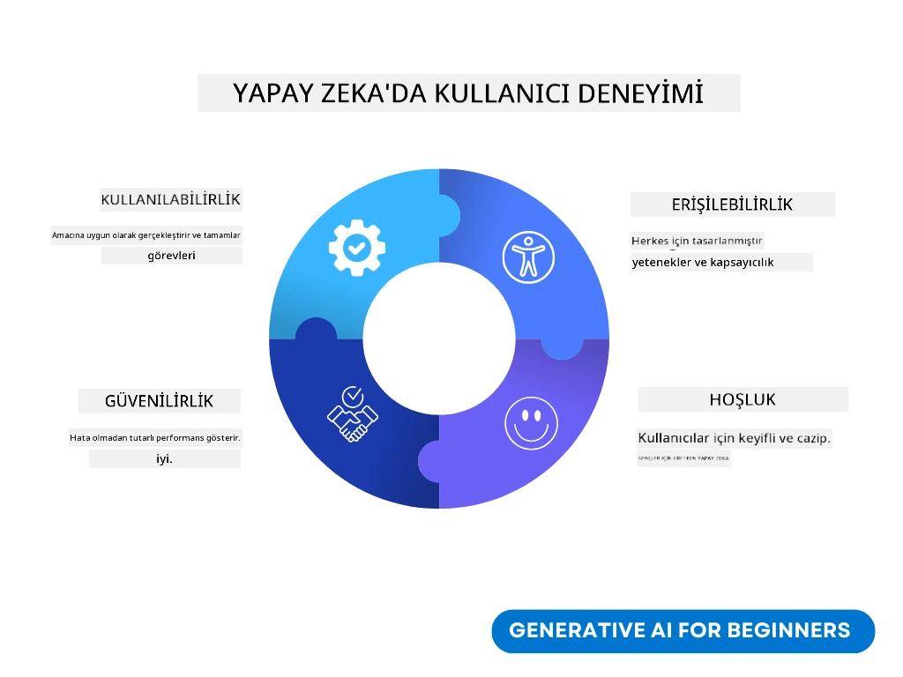
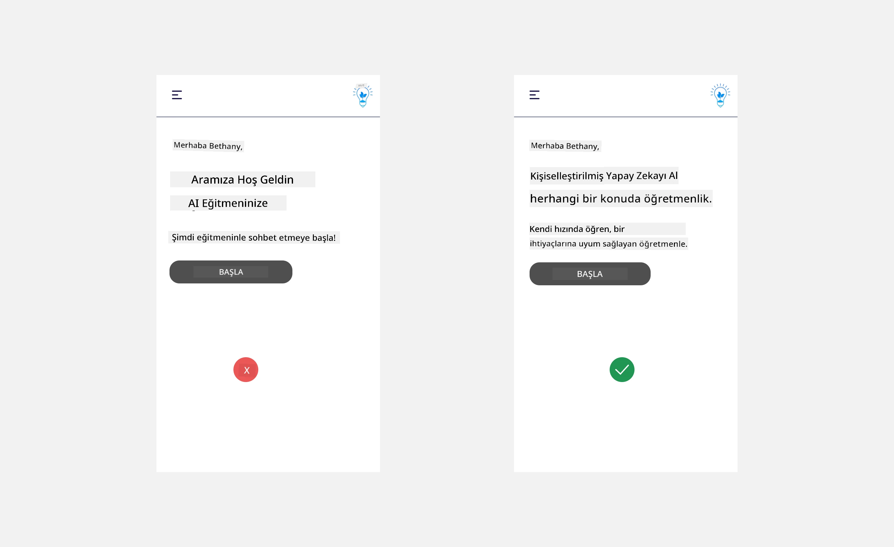
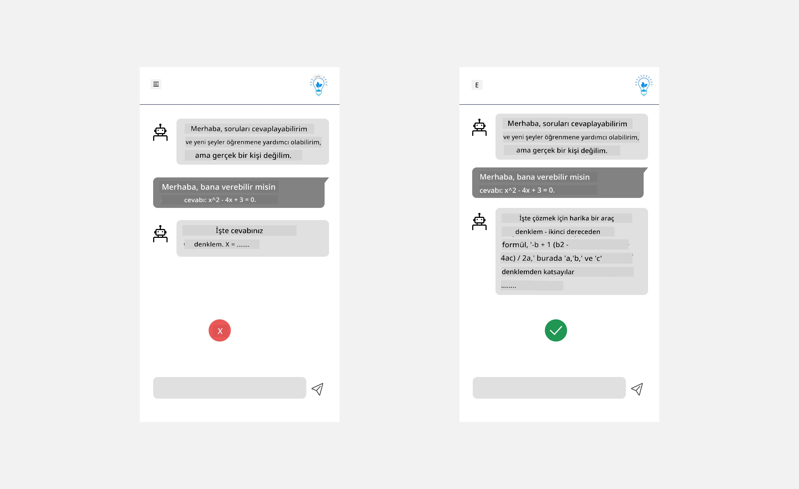
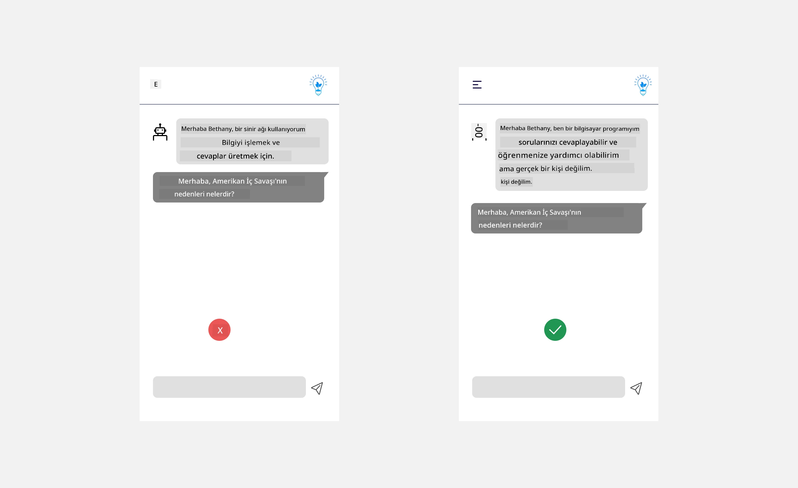
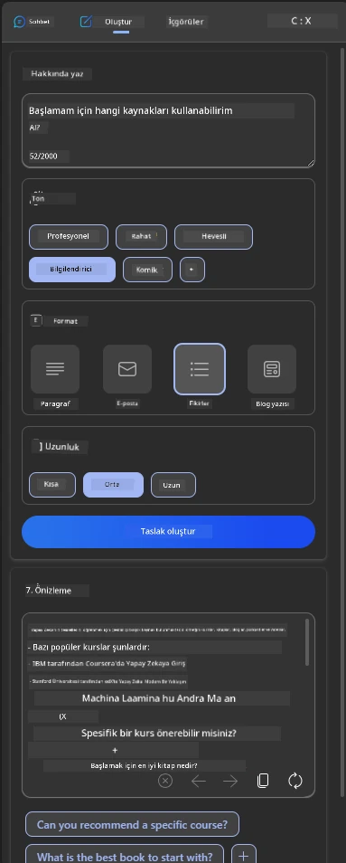
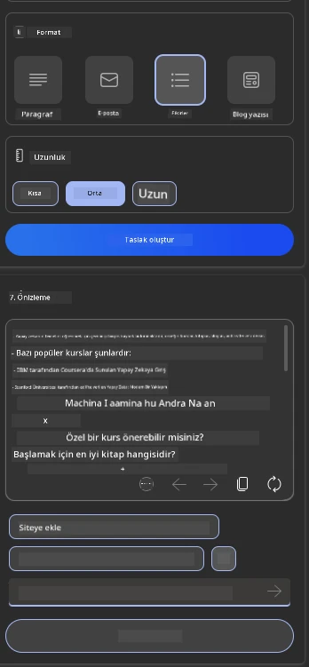

# AI Uygulamaları için UX Tasarımı

> _(Bu dersin videosunu izlemek için yukarıdaki görsele tıklayın)_

Kullanıcı deneyimi, uygulama geliştirmenin çok önemli bir yönüdür. Kullanıcıların görevleri yerine getirmek için uygulamanızı verimli bir şekilde kullanabilmeleri gerekir. Verimli olmak bir şeydir, ancak uygulamaları herkes tarafından kullanılabilir hale getirmek, yani _erişilebilir_ yapmak da gerekir. Bu bölümde bu alana odaklanacağız, böylece insanların kullanabileceği ve kullanmak isteyeceği bir uygulama tasarlamanız mümkün olur.

## Giriş

Kullanıcı deneyimi, bir kullanıcının belirli bir ürün ya da hizmetle—bir sistem, araç ya da tasarım olabilir—nasıl etkileşimde bulunduğu ve kullandığıdır. AI uygulamaları geliştirilirken, geliştiriciler sadece kullanıcı deneyiminin etkili olmasına değil, aynı zamanda etik olmasına da odaklanır. Bu derste, kullanıcı ihtiyaçlarını ele alan Yapay Zeka (AI) uygulamalarının nasıl inşa edileceğini ele alacağız.

Ders aşağıdaki konuları kapsayacaktır:

- Kullanıcı Deneyimi'ne Giriş ve Kullanıcı İhtiyaçlarını Anlama
- Güven ve Şeffaflık için AI Uygulamaları Tasarlamak
- İşbirliği ve Geri Bildirim için AI Uygulamaları Tasarlamak

## Öğrenme hedefleri

Bu dersi tamamladıktan sonra şunları yapabileceksiniz:

- Kullanıcı ihtiyaçlarını karşılayan AI uygulamalarının nasıl inşa edildiğini anlamak.
- Güven ve işbirliğini teşvik eden AI uygulamaları tasarlamak.

### Önkoşul

Biraz zaman ayırın ve [kullanıcı deneyimi ve tasarım düşüncesi hakkında daha fazla bilgi edinin.](https://learn.microsoft.com/training/modules/ux-design?WT.mc_id=academic-105485-koreyst)

## Kullanıcı Deneyimine Giriş ve Kullanıcı İhtiyaçlarını Anlama

Hayali eğitim girişimimizde iki temel kullanıcı var: öğretmenler ve öğrenciler. Bu iki kullanıcının her birinin kendine özgü ihtiyaçları vardır. Kullanıcı merkezli tasarım, ürünlerin amaçlanan kullanıcılar için ilgili ve faydalı olmasını sağlayarak kullanıcıyı önceliklendirir.

Uygulamanın, iyi bir kullanıcı deneyimi sunmak için **faydalı, güvenilir, erişilebilir ve keyifli** olması gerekir.

### Kullanılabilirlik

Faydalı olmak, uygulamanın amacına uygun işlevselliğe sahip olması anlamına gelir; örneğin notlandırma sürecini otomatikleştirmek veya tekrar için flash kartlar oluşturmak gibi. Notlandırma sürecini otomatikleştiren bir uygulama, önceden belirlenmiş kriterlere göre öğrencilerin çalışmalarına doğru ve verimli bir şekilde puan verebilmelidir. Benzer şekilde, tekrar için flash kartlar oluşturan bir uygulama, verilerine dayanarak ilgili ve çeşitli sorular üretebilmelidir.

### Güvenilirlik

Güvenilir olmak, uygulamanın görevini sürekli ve hatasız şekilde yerine getirebilmesi anlamına gelir. Ancak, AI da tıpkı insanlar gibi mükemmel değildir ve hata yapabilir. Uygulamalar, insan müdahalesi veya düzeltme gerektiren hatalar ya da beklenmedik durumlarla karşılaşabilir. Hataları nasıl yönetirsiniz? Dersin son bölümünde, AI sistemlerinin ve uygulamalarının işbirliği ve geri bildirim için nasıl tasarlandığını ele alacağız.

### Erişilebilirlik

Erişilebilir olmak, kullanıcı deneyimini farklı yeteneklere sahip kullanıcılara, engelli bireyler de dahil olmak üzere, kapsayıcı hale getirmek ve hiç kimsenin dışlanmamasını sağlamaktır. Erişilebilirlik yönergeleri ve ilkelerine uyulduğunda, AI çözümleri daha kapsayıcı, kullanılabilir ve tüm kullanıcılar için faydalı olur.

### Keyifli

Keyifli olmak, uygulamanın kullanımı keyifli hale getirmesi demektir. Çekici bir kullanıcı deneyimi, kullanıcıyı uygulamaya tekrar gelmeye teşvik eder ve işletme gelirlerini artırabilir.

Her zorluk AI ile çözülemez. AI, kullanıcı deneyiminizi artırmak için gelir; ister manuel görevleri otomatikleştirerek, ister kullanıcı deneyimlerini kişiselleştirerek.

## Güven ve Şeffaflık için AI Uygulamaları Tasarlamak

AI uygulamaları tasarlarken güven inşa etmek çok önemlidir. Güven, kullanıcının uygulamanın işi yapacağına, sonuçları istikrarlı vereceğine ve sonuçların kullanıcının ihtiyacına uygun olduğuna inanmasını sağlar. Bu alandaki riskler güvensizlik ve aşırı güvendir. Güvensizlik, kullanıcının AI sistemine az ya da hiç güven duymamasıyla ortaya çıkar ve bu durumda kullanıcı uygulamanızı reddeder. Aşırı güven ise kullanıcıların AI sisteminin yeteneklerini fazla tahmin etmesiyle oluşur ve kullanıcıların AI sistemine çok fazla güvenmesine yol açar. Örneğin, aşırı güven durumunda otomatik notlandırma sistemi öğretmenin bazı kağıtları kontrol etmemesine neden olabilir ve bu da öğrenciler için adaletsiz ya da yanlış notlar veya geri bildirim ve gelişim imkanının kaçırılmasıyla sonuçlanabilir.

Güvenin tasarımın tam merkezine yerleştirilmesini sağlamak için iki yol vardır: açıklanabilirlik ve kontrol.

### Açıklanabilirlik

AI, kararlar alınmasına yardımcı olduğunda, örneğin bilgiyi gelecek nesillere aktarmada, öğretmenlerin ve ebeveynlerin AI kararlarının nasıl alındığını anlaması çok önemlidir. Buna açıklanabilirlik denir - AI uygulamalarının kararları nasıl aldığını anlamak. Açıklanabilirlik için tasarım, AI'nın nasıl sonuçlara ulaştığını vurgulayan detayların eklenmesini içerir. İzleyicinin, çıktının bir insan değil AI tarafından oluşturulduğunu fark etmesi gerekir. Örneğin, "Şimdi eğitmeninle sohbet etmeye başla" demek yerine, "İhtiyaçlarınıza uyum sağlayan ve kendi hızınızda öğrenmenize yardımcı olan AI eğitmenini kullanın" demek.

Bir diğer örnek, AI'nın kullanıcı ve kişisel verileri nasıl kullandığıdır. Örneğin, öğrenci rolündeki bir kullanıcının rolüne göre sınırlamaları olabilir. AI, soruların cevaplarını veremeyebilir ancak kullanıcıyı sorunu nasıl çözebilecekleri konusunda düşünmeye yönlendirebilir.

Açıklanabilirliğin son önemli kısmı açıklamaların sadeleştirilmesidir. Öğrenciler ve öğretmenler AI uzmanı olmayabilir, bu yüzden uygulamanın neler yapabileceği veya yapamayacağına dair açıklamalar basitleştirilmiş ve kolay anlaşılır olmalıdır.

### Kontrol

Üretken AI, kullanıcı ile AI arasında işbirliği yaratır; örneğin kullanıcı farklı sonuçlar için istemleri (prompt) değiştirebilir. Ayrıca çıktı oluşturulduktan sonra kullanıcılar sonuçları değiştirebilmelidir, bu onlara kontrol hissi verir. Örneğin, Microsoft Copilot (eski adıyla Bing Chat) kullanırken, isteminizi format, ton ve uzunluğa göre uyarlayabilirsiniz. Ayrıca çıktınıza değişiklikler ekleyip çıktı üzerinde düzenlemeler yapabilirsiniz:

Microsoft Copilot'ta kullanıcıya uygulama üzerinde kontrol sağlayan bir diğer özellik, AI'nın kullandığı veriye katılımı açma ve kapama seçeneğidir. Bir okul uygulaması için öğrenci, notlarını ve öğretmenlerin kaynaklarını tekrar materyali olarak kullanmak isteyebilir.

> AI uygulamaları tasarlarken, amaçlılık kullanıcıların AI yetenekleri hakkındaki gerçekçi olmayan beklentileri önlemek için aşırı güveni engellemede anahtardır. Bunu yapmanın yollarından biri, istemlerle sonuçlar arasında sürtünme oluşturmaktır. Kullanıcıya bunun AI olduğunu, bir insan olmadığını hatırlatmaktır.

## İşbirliği ve Geri Bildirim için AI Uygulamaları Tasarlamak

Daha önce belirtildiği gibi, üretken AI kullanıcı ile AI arasında işbirliği yaratır. Çoğu etkileşim, kullanıcı bir istem girer ve AI bir çıktı oluşturur. Peki ya çıktı yanlışsa? Uygulama hataları olursa nasıl yönetir? AI kullanıcıyı suçlar mı yoksa hatayı açıklamaya zaman ayırır mı?

AI uygulamaları geri bildirim almaya ve vermeye uygun olarak inşa edilmelidir. Bu sadece AI sisteminin gelişmesine yardımcı olmakla kalmaz, aynı zamanda kullanıcılarla güven inşa eder. Tasarıma bir geri bildirim döngüsü dahil edilmelidir; örneğin, çıktıya basit bir "beğen" veya "beğenme" işareti eklenmesi gibi.

Bunun başka bir yolu da sistemin yeteneklerinin ve sınırlamalarının açıkça iletilmesidir. Bir kullanıcı AI yeteneklerinin ötesinde bir şey istediğinde, bunun nasıl ele alınacağına dair bir yol olmalıdır, aşağıdaki gibi gösterildiği gibi.

Sistem hataları, kullanıcı AI kapsamı dışındaki bilgi veya uygulamanın soru/konu özeti oluşturma sınırı olduğunda yaygındır. Örneğin, sadece Tarih ve Matematik konularında eğitilmiş bir AI uygulaması Coğrafya ile ilgili soruları yanıtlayamayabilir. Bunu hafifletmek için AI sistemi şu şekilde cevap verebilir: "Üzgünüz, ürünümüz sadece aşağıdaki konularda eğitim aldı....., sorunuza yanıt veremiyorum."

AI uygulamaları kusursuz değildir; bu nedenle hata yapmaları muhtemeldir. Uygulamalarınızı tasarlarken, kullanıcı geri bildirimi ve hata yönetimi için alan yaratmalı, bunu basit ve kolay açıklanabilir bir şekilde yapmalısınız.

## Ödev

Şimdiye kadar geliştirdiğiniz AI uygulamalarından herhangi birini alın ve uygulamanızda aşağıdaki adımları uygulamayı düşünün:

- **Keyifli:** Uygulamanızı nasıl daha keyifli hale getirebilirsiniz? Her yere açıklamalar mı ekliyorsunuz? Kullanıcıyı keşfetmeye teşvik ediyor musunuz? Hata mesajlarınızı nasıl ifade ediyorsunuz?

- **Kullanılabilirlik:** Bir web uygulaması inşa ediyorsanız, uygulamanızın hem fare hem de klavye ile gezilebilir olduğundan emin olun.

- **Güven ve şeffaflık:** AI'ya ve çıktısına tamamen güvenmeyin; çıktıyı doğrulamak için tasarıma bir insan eklemeyi düşünün. Ayrıca, güven ve şeffaflık sağlamak için diğer yolları da düşünün ve uygulayın.

- **Kontrol:** Kullanıcının uygulamaya sağladığı veriler üzerinde kontrol sahibi olmasını sağlayın. AI uygulamasında kullanıcıların veri toplamaya katılma veya katılmama seçeneği sunan bir yöntem uygulayın.

<!-- ## [Ders sonrası test](../../../12-designing-ux-for-ai-applications/quiz-url) -->

## Öğreniminize Devam Edin!

Bu dersi tamamladıktan sonra, Üretken AI bilginizi geliştirmeye devam etmek için [Üretken AI Öğrenme koleksiyonumuza](https://aka.ms/genai-collection?WT.mc_id=academic-105485-koreyst) göz atın!

Ders 13'e geçin; burada [AI uygulamalarının güvenliğini](../13-securing-ai-applications/README.md?WT.mc_id=academic-105485-koreyst) inceleyeceğiz!

---

<!-- CO-OP TRANSLATOR DISCLAIMER START -->
**Feragatname**:
Bu belge, AI çeviri hizmeti [Co-op Translator](https://github.com/Azure/co-op-translator) kullanılarak çevrilmiştir. Doğruluk için çaba sarf etsek de, otomatik çevirilerin hata veya yanlışlık içerebileceğini lütfen unutmayınız. Orijinal belge, kendi dilinde yetkili kaynak olarak kabul edilmelidir. Kritik bilgiler için profesyonel insan çevirisi önerilir. Bu çevirinin kullanımı sonucu ortaya çıkabilecek yanlış anlamalardan veya yanlış yorumlamalardan sorumlu değiliz.
<!-- CO-OP TRANSLATOR DISCLAIMER END -->