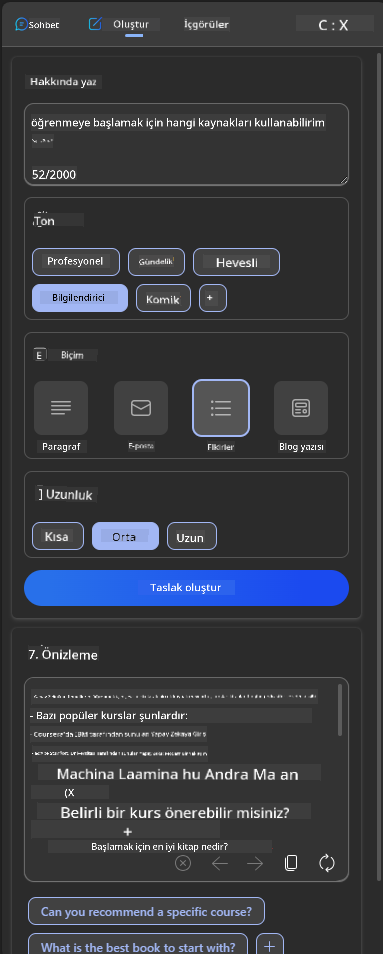
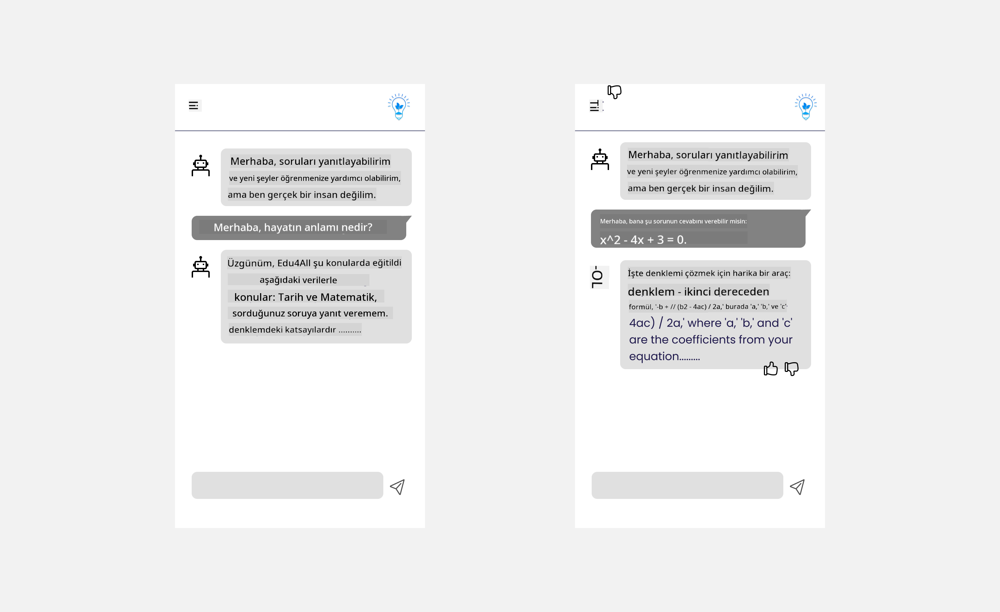

<!--
CO_OP_TRANSLATOR_METADATA:
{
  "original_hash": "747668e4c53d067369f06e9ec2e6313e",
  "translation_date": "2025-08-26T16:54:41+00:00",
  "source_file": "12-designing-ux-for-ai-applications/README.md",
  "language_code": "tr"
}
-->
# AI Uygulamaları için UX Tasarımı

> _(Dersi izlemek için yukarıdaki görsele tıklayın)_

Kullanıcı deneyimi, uygulama geliştirmenin çok önemli bir yönüdür. Kullanıcıların, uygulamanızı verimli bir şekilde kullanarak görevlerini yerine getirebilmesi gerekir. Verimli olmak önemli ama aynı zamanda uygulamaları herkesin kullanabileceği şekilde tasarlamanız gerekir, yani _erişilebilir_ olmalıdır. Bu bölümde bu konuya odaklanacağız, böylece insanların kullanabileceği ve kullanmak isteyeceği bir uygulama tasarlamanız hedefleniyor.

## Giriş

Kullanıcı deneyimi, bir kullanıcının belirli bir ürün veya hizmetle (sistem, araç ya da tasarım) nasıl etkileşime girdiği ve kullandığıdır. AI uygulamaları geliştirirken, geliştiriciler sadece kullanıcı deneyiminin etkili olmasına değil, aynı zamanda etik olmasına da odaklanır. Bu derste, kullanıcı ihtiyaçlarını karşılayan Yapay Zeka (AI) uygulamalarının nasıl geliştirileceğini ele alıyoruz.

Ders şu başlıkları kapsayacak:

- Kullanıcı Deneyimine Giriş ve Kullanıcı İhtiyaçlarını Anlama
- Güven ve Şeffaflık için AI Uygulamaları Tasarlama
- İş Birliği ve Geri Bildirim için AI Uygulamaları Tasarlama

## Öğrenme Hedefleri

Bu dersi tamamladıktan sonra şunları yapabileceksiniz:

- Kullanıcı ihtiyaçlarını karşılayan AI uygulamalarının nasıl geliştirileceğini anlamak.
- Güven ve iş birliğini teşvik eden AI uygulamaları tasarlamak.

### Ön Koşul

Biraz zaman ayırıp [kullanıcı deneyimi ve tasarım odaklı düşünme](https://learn.microsoft.com/training/modules/ux-design?WT.mc_id=academic-105485-koreyst) hakkında daha fazla okuyun.

## Kullanıcı Deneyimine Giriş ve Kullanıcı İhtiyaçlarını Anlama

Kurgusal eğitim girişimimizde iki ana kullanıcımız var: öğretmenler ve öğrenciler. Her iki kullanıcının da kendine özgü ihtiyaçları bulunuyor. Kullanıcı odaklı bir tasarım, ürünü hedef kitlesi için anlamlı ve faydalı kılarak kullanıcıyı önceliklendirir.

Uygulama, iyi bir kullanıcı deneyimi sunmak için **faydalı, güvenilir, erişilebilir ve keyifli** olmalıdır.

### Kullanılabilirlik

Faydalı olmak, uygulamanın amaçlanan işlevi yerine getirmesi anlamına gelir; örneğin notlandırma sürecini otomatikleştirmek veya tekrar için flash kartlar oluşturmak gibi. Notlandırma sürecini otomatikleştiren bir uygulama, önceden belirlenmiş kriterlere göre öğrencilerin çalışmalarına doğru ve verimli bir şekilde puan verebilmelidir. Benzer şekilde, tekrar flash kartları oluşturan bir uygulama, elindeki verilere göre ilgili ve çeşitli sorular üretebilmelidir.

### Güvenilirlik

Güvenilir olmak, uygulamanın görevini tutarlı ve hatasız bir şekilde yerine getirebilmesi demektir. Ancak, AI da insanlar gibi mükemmel değildir ve hata yapabilir. Uygulamalar, insan müdahalesi veya düzeltme gerektiren hatalar ya da beklenmedik durumlarla karşılaşabilir. Hataları nasıl yönetirsiniz? Bu dersin son bölümünde, AI sistemlerinin ve uygulamalarının iş birliği ve geri bildirim için nasıl tasarlandığını ele alacağız.

### Erişilebilirlik

Erişilebilir olmak, kullanıcı deneyimini farklı yeteneklere sahip tüm kullanıcılara, engelli bireyler de dahil olmak üzere, ulaştırmak demektir. Böylece kimse dışlanmaz. Erişilebilirlik ilkelerine ve yönergelerine uyarak, AI çözümleri daha kapsayıcı, kullanılabilir ve herkes için faydalı hale gelir.

### Keyifli

Keyifli olmak, uygulamanın kullanımı zevkli olması anlamına gelir. Çekici bir kullanıcı deneyimi, kullanıcı üzerinde olumlu bir etki yaratır, uygulamaya tekrar gelmesini teşvik eder ve iş gelirini artırır.

Her zorluk AI ile çözülemez. AI, kullanıcı deneyiminizi geliştirmek için devreye girer; ister manuel işleri otomatikleştirmek, ister kullanıcı deneyimini kişiselleştirmek olsun.

## Güven ve Şeffaflık için AI Uygulamaları Tasarlama

AI uygulamaları tasarlarken güven inşa etmek çok önemlidir. Güven, kullanıcının uygulamanın işi yapacağına, tutarlı sonuçlar vereceğine ve bu sonuçların ihtiyacı olan şeyler olduğuna inanmasını sağlar. Bu alandaki risklerden biri güvensizlik, diğeri ise aşırı güvendir. Güvensizlik, kullanıcının AI sistemine az ya da hiç güvenmemesiyle ortaya çıkar ve bu da kullanıcının uygulamanızı reddetmesine yol açar. Aşırı güven ise, kullanıcının AI sisteminin yeteneklerini abartması ve sisteme gereğinden fazla güvenmesiyle oluşur. Örneğin, otomatik notlandırma sisteminde aşırı güven, öğretmenin bazı kağıtları kontrol etmeyip sistemin doğru çalıştığını varsaymasına yol açabilir. Bu da öğrenciler için adaletsiz veya hatalı notlara ya da geri bildirim ve gelişim fırsatlarının kaçırılmasına neden olabilir.

Güveni tasarımın merkezine koymanın iki yolu açıklanabilirlik ve kontroldür.

### Açıklanabilirlik

AI, geleceğin nesillerine bilgi aktarmak gibi kararları desteklediğinde, öğretmenlerin ve ebeveynlerin AI kararlarının nasıl alındığını anlaması çok önemlidir. Buna açıklanabilirlik denir - AI uygulamalarının kararları nasıl verdiğini anlamak. Açıklanabilirlik için tasarım yapmak, AI'nın çıktıya nasıl ulaştığını gösteren detaylar eklemeyi içerir. Kullanıcılar, çıktının bir AI tarafından üretildiğinin ve insan olmadığının farkında olmalıdır. Örneğin, "Şimdi eğitmeninle sohbet etmeye başla" demek yerine, "İhtiyaçlarına uyum sağlayan ve kendi hızında öğrenmene yardımcı olan AI eğitmenini kullan" diyebilirsiniz.

Bir diğer örnek, AI'nın kullanıcı ve kişisel verileri nasıl kullandığıdır. Örneğin, öğrenci personasına sahip bir kullanıcının, bu personası nedeniyle bazı kısıtlamaları olabilir. AI, soruların cevaplarını doğrudan veremeyebilir ama kullanıcının problemi nasıl çözebileceği konusunda yol gösterebilir.

Açıklanabilirliğin bir diğer önemli yönü de açıklamaların sadeleştirilmesidir. Öğrenciler ve öğretmenler AI uzmanı olmayabilir, bu nedenle uygulamanın neleri yapıp neleri yapamayacağına dair açıklamalar basit ve anlaşılır olmalıdır.

### Kontrol

Üretken AI, AI ile kullanıcı arasında bir iş birliği oluşturur; örneğin, kullanıcı farklı sonuçlar için istemleri değiştirebilir. Ayrıca, bir çıktı üretildikten sonra, kullanıcılar sonuçları değiştirebilmeli ve böylece kontrol hissi kazanmalıdır. Örneğin, Bing kullanırken, isteminizi biçim, ton ve uzunluğa göre özelleştirebilirsiniz. Ayrıca, çıktınıza değişiklikler ekleyebilir ve çıktıyı aşağıda gösterildiği gibi düzenleyebilirsiniz:

Bing'de kullanıcının uygulama üzerinde kontrol sahibi olmasını sağlayan bir diğer özellik ise, AI'nın kullandığı verilere dahil olma veya olmama seçeneğidir. Bir okul uygulamasında, bir öğrenci hem kendi notlarını hem de öğretmenin kaynaklarını tekrar materyali olarak kullanmak isteyebilir.

> AI uygulamaları tasarlarken, kullanıcıların AI'nın yetenekleri konusunda aşırı güvene kapılıp gerçekçi olmayan beklentiler oluşturmamasını sağlamak için kasıtlı olmak önemlidir. Bunu yapmanın bir yolu, istemler ile sonuçlar arasında bir miktar sürtünme oluşturmaktır. Kullanıcıya bunun bir AI olduğunu, bir insan olmadığını hatırlatmak gerekir.

## İş Birliği ve Geri Bildirim için AI Uygulamaları Tasarlama

Daha önce de belirtildiği gibi, üretken AI kullanıcı ile AI arasında bir iş birliği oluşturur. Çoğu etkileşim, kullanıcının bir istem girmesi ve AI'nın bir çıktı üretmesiyle gerçekleşir. Peki ya çıktı yanlışsa? Uygulama hataları nasıl yönetiyor? AI, kullanıcıyı mı suçluyor yoksa hatayı açıklamak için zaman mı ayırıyor?

AI uygulamaları, hem geri bildirim alacak hem de verecek şekilde tasarlanmalıdır. Bu, sadece AI sisteminin gelişmesine yardımcı olmakla kalmaz, aynı zamanda kullanıcılarla güven inşa eder. Tasarımda bir geri bildirim döngüsü bulunmalıdır; örneğin, çıktıya basit bir beğenme veya beğenmeme simgesi eklenebilir.

Bunu yönetmenin bir diğer yolu da sistemin yeteneklerini ve sınırlamalarını açıkça iletmektir. Kullanıcı, AI'nın yeteneklerinin ötesinde bir şey talep ettiğinde, bunun da yönetilmesi gerekir; aşağıda gösterildiği gibi.

Sistem hataları, kullanıcının AI'nın kapsamı dışında bilgiye ihtiyaç duyması ya da uygulamanın bir kullanıcının kaç soru/konu için özet oluşturabileceğine dair bir sınırı olması gibi durumlarda yaygındır. Örneğin, sadece belirli konularla (Tarih ve Matematik gibi) ilgili verilerle eğitilmiş bir AI uygulaması, Coğrafya ile ilgili soruları yanıtlayamayabilir. Bunu önlemek için, AI sistemi şöyle bir yanıt verebilir: "Üzgünüm, ürünümüz şu konulardaki verilerle eğitilmiştir....., sorduğunuz soruya yanıt veremiyorum."

AI uygulamaları mükemmel değildir, bu nedenle hata yapmaları kaçınılmazdır. Uygulamalarınızı tasarlarken, kullanıcıdan geri bildirim almaya ve hataları basit ve kolayca açıklanabilir bir şekilde yönetmeye olanak tanıyan bir yapı oluşturmalısınız.

## Görev

Şimdiye kadar geliştirdiğiniz herhangi bir AI uygulamasını ele alın ve aşağıdaki adımları uygulamayı düşünün:

- **Keyifli:** Uygulamanızı daha keyifli hale nasıl getirebilirsiniz? Her yerde açıklama ekliyor musunuz? Kullanıcıyı keşfetmeye teşvik ediyor musunuz? Hata mesajlarınızı nasıl ifade ediyorsunuz?

- **Kullanılabilirlik:** Bir web uygulaması geliştiriyorsanız, uygulamanızın hem fare hem de klavye ile gezilebilir olduğundan emin olun.

- **Güven ve şeffaflık:** AI'ya ve çıktısına tamamen güvenmeyin, çıktıyı doğrulamak için sürece bir insanı nasıl dahil edebileceğinizi düşünün. Ayrıca, güven ve şeffaflığı sağlamak için başka yolları da düşünün ve uygulayın.

- **Kontrol:** Kullanıcının uygulamaya sağladığı veriler üzerinde kontrol sahibi olmasını sağlayın. Kullanıcının AI uygulamasında veri toplamaya katılmasını veya katılmamasını sağlayacak bir yol uygulayın.

## Öğrenmeye Devam Edin!

Bu dersi tamamladıktan sonra, [Üretken AI Öğrenme koleksiyonumuza](https://aka.ms/genai-collection?WT.mc_id=academic-105485-koreyst) göz atarak Üretken AI bilginizi geliştirmeye devam edebilirsiniz!

13. Derse geçin, burada [AI uygulamalarını güvenli hale getirmeyi](../13-securing-ai-applications/README.md?WT.mc_id=academic-105485-koreyst) inceleyeceğiz!

---

**Feragatname**:  
Bu belge, AI çeviri hizmeti [Co-op Translator](https://github.com/Azure/co-op-translator) kullanılarak çevrilmiştir. Doğruluk için çaba göstersek de, otomatik çevirilerde hata veya yanlışlıklar bulunabileceğini lütfen unutmayın. Belgenin orijinal diliyle hazırlanmış hali esas alınmalıdır. Kritik bilgiler için profesyonel insan çevirisi önerilir. Bu çevirinin kullanımından doğabilecek yanlış anlama veya yanlış yorumlamalardan sorumlu değiliz.