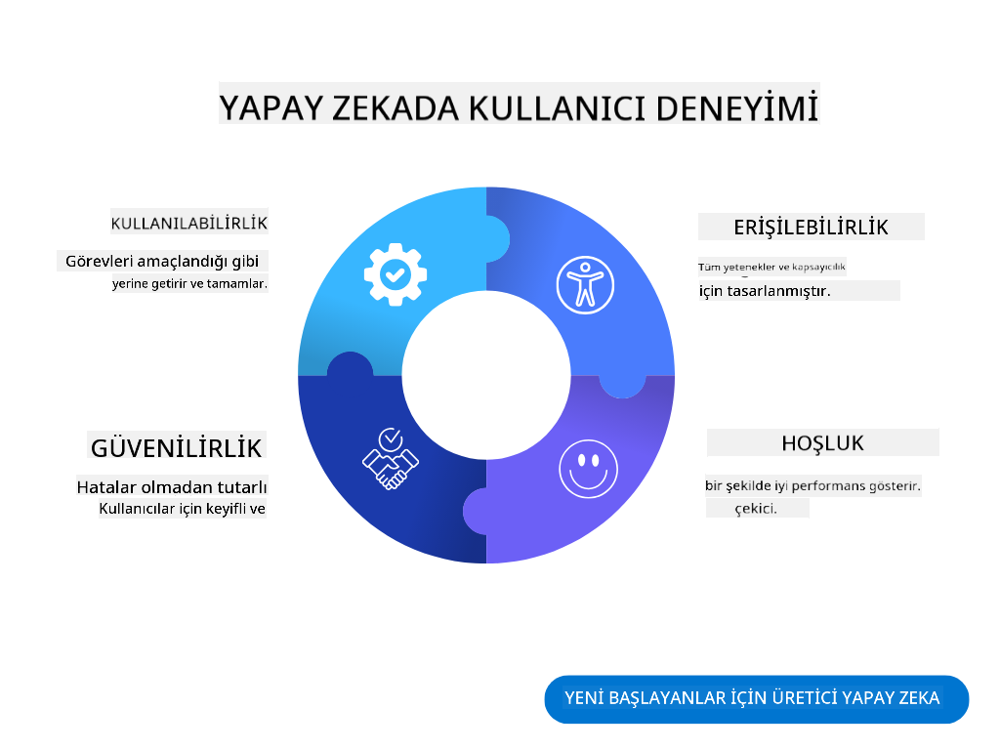
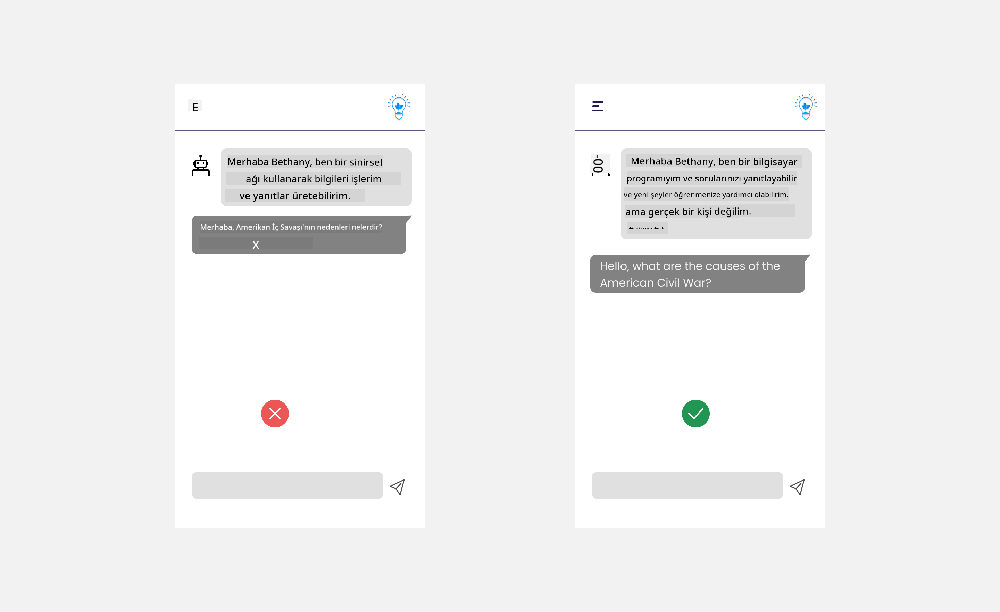

<!--
CO_OP_TRANSLATOR_METADATA:
{
  "original_hash": "ec385b41ee50579025d50cc03bfb3a25",
  "translation_date": "2025-07-09T14:57:13+00:00",
  "source_file": "12-designing-ux-for-ai-applications/README.md",
  "language_code": "tr"
}
-->
# AI Uygulamaları için UX Tasarımı

> _(Bu dersin videosunu izlemek için yukarıdaki görsele tıklayın)_

Kullanıcı deneyimi, uygulama geliştirmenin çok önemli bir yönüdür. Kullanıcıların, görevleri verimli bir şekilde gerçekleştirebilmek için uygulamanızı kolayca kullanabilmesi gerekir. Verimli olmak önemli bir şeydir ancak uygulamaları herkesin kullanabileceği şekilde, yani _erişilebilir_ olarak tasarlamanız da gerekir. Bu bölümde bu konuya odaklanacağız, böylece insanların kullanmak isteyeceği ve kullanabileceği bir uygulama tasarlamanız mümkün olacak.

## Giriş

Kullanıcı deneyimi, bir kullanıcının belirli bir ürün veya hizmetle, ister bir sistem, araç ya da tasarım olsun, nasıl etkileşimde bulunduğu ve kullandığıdır. AI uygulamaları geliştirirken, geliştiriciler sadece kullanıcı deneyiminin etkili olmasına değil, aynı zamanda etik olmasına da odaklanır. Bu derste, kullanıcı ihtiyaçlarını karşılayan Yapay Zeka (AI) uygulamalarının nasıl geliştirileceğini ele alacağız.

Ders aşağıdaki konuları kapsayacak:

- Kullanıcı Deneyimine Giriş ve Kullanıcı İhtiyaçlarını Anlama
- Güven ve Şeffaflık için AI Uygulamaları Tasarlama
- İşbirliği ve Geri Bildirim için AI Uygulamaları Tasarlama

## Öğrenme hedefleri

Bu dersi tamamladıktan sonra şunları yapabileceksiniz:

- Kullanıcı ihtiyaçlarını karşılayan AI uygulamalarını nasıl geliştireceğinizi anlayacaksınız.
- Güven ve işbirliğini teşvik eden AI uygulamaları tasarlayabileceksiniz.

### Önkoşul

Biraz zaman ayırıp [kullanıcı deneyimi ve tasarım odaklı düşünce](https://learn.microsoft.com/training/modules/ux-design?WT.mc_id=academic-105485-koreyst) hakkında daha fazla bilgi edinin.

## Kullanıcı Deneyimine Giriş ve Kullanıcı İhtiyaçlarını Anlama

Hayali eğitim girişimimizde iki ana kullanıcı grubumuz var: öğretmenler ve öğrenciler. Her iki kullanıcının da kendine özgü ihtiyaçları bulunuyor. Kullanıcı odaklı tasarım, ürünlerin hedef kitlesi için ilgili ve faydalı olmasını sağlamak adına kullanıcıyı önceliklendirir.

Uygulama, iyi bir kullanıcı deneyimi sunmak için **yararlı, güvenilir, erişilebilir ve keyifli** olmalıdır.

### Kullanılabilirlik

Yararlı olmak, uygulamanın amacına uygun işlevselliğe sahip olması demektir; örneğin notlandırma sürecini otomatikleştirmek veya tekrar için flash kartlar oluşturmak gibi. Notlandırma sürecini otomatikleştiren bir uygulama, önceden belirlenmiş kriterlere göre öğrencilerin çalışmalarına doğru ve verimli şekilde puan verebilmelidir. Benzer şekilde, tekrar için flash kartlar oluşturan bir uygulama, verilerine dayanarak ilgili ve çeşitli sorular hazırlayabilmelidir.

### Güvenilirlik

Güvenilir olmak, uygulamanın görevini tutarlı ve hatasız şekilde yerine getirebilmesi anlamına gelir. Ancak AI, insanlar gibi mükemmel değildir ve hata yapabilir. Uygulamalar, insan müdahalesi veya düzeltme gerektiren hatalar veya beklenmedik durumlarla karşılaşabilir. Hataları nasıl yönetiyorsunuz? Bu dersin son bölümünde, AI sistemlerinin ve uygulamalarının işbirliği ve geri bildirim için nasıl tasarlandığını ele alacağız.

### Erişilebilirlik

Erişilebilir olmak, kullanıcı deneyimini engelli bireyler de dahil olmak üzere farklı yeteneklere sahip kullanıcılara genişletmek, kimsenin dışlanmamasını sağlamaktır. Erişilebilirlik yönergeleri ve prensiplerine uyulduğunda, AI çözümleri daha kapsayıcı, kullanılabilir ve tüm kullanıcılar için faydalı hale gelir.

### Keyifli Olmak

Keyifli olmak, uygulamanın kullanımı zevkli hale getirmektir. Çekici bir kullanıcı deneyimi, kullanıcı üzerinde olumlu bir etki yaratır, onları uygulamaya geri dönmeye teşvik eder ve iş gelirini artırır.

Her zorluk AI ile çözülemez. AI, manuel görevleri otomatikleştirmek veya kullanıcı deneyimlerini kişiselleştirmek gibi kullanıcı deneyiminizi desteklemek için devreye girer.

## Güven ve Şeffaflık için AI Uygulamaları Tasarlamak

AI uygulamaları tasarlarken güven oluşturmak kritik öneme sahiptir. Güven, kullanıcının uygulamanın işi yapacağına, sonuçları tutarlı şekilde sunacağına ve sonuçların kullanıcının ihtiyaçlarına uygun olduğuna inanmasını sağlar. Bu alandaki riskler güvensizlik ve aşırı güvendir. Güvensizlik, kullanıcının AI sistemine az veya hiç güvenmemesi durumudur ve bu da uygulamanın reddedilmesine yol açar. Aşırı güven ise kullanıcının AI sisteminin yeteneklerini abartmasıdır; bu da kullanıcıların AI sistemine gereğinden fazla güvenmesine neden olur. Örneğin, aşırı güven durumunda otomatik notlandırma sistemi öğretmenin bazı sınav kağıtlarını kontrol etmemesine yol açabilir. Bu da öğrenciler için adaletsiz veya yanlış notlar verilmesine ya da geri bildirim ve gelişim fırsatlarının kaçırılmasına neden olabilir.

Güvenin tasarımın tam merkezine yerleştirilmesini sağlamak için iki yol vardır: açıklanabilirlik ve kontrol.

### Açıklanabilirlik

AI, geleceğe bilgi aktarmak gibi kararları desteklediğinde, öğretmenlerin ve velilerin AI kararlarının nasıl alındığını anlaması çok önemlidir. Bu, açıklanabilirliktir - AI uygulamalarının karar alma süreçlerinin anlaşılmasıdır. Açıklanabilirlik için tasarım, AI uygulamasının neler yapabileceğine dair örnekler eklemeyi içerir. Örneğin, "AI öğretmenle başlayın" yerine sistem şöyle diyebilir: "Notlarınızı AI ile daha kolay tekrar için özetleyin."

Başka bir örnek, AI'nın kullanıcı ve kişisel verileri nasıl kullandığıdır. Örneğin, öğrenci kişiliğine sahip bir kullanıcı, kişiliğine bağlı sınırlamalara sahip olabilir. AI, soruların cevaplarını doğrudan veremeyebilir ancak kullanıcının problemi nasıl çözebileceği konusunda düşünmesine rehberlik edebilir.

Açıklanabilirliğin son önemli parçası, açıklamaların sadeleştirilmesidir. Öğrenciler ve öğretmenler AI uzmanı olmayabilir, bu yüzden uygulamanın neler yapabileceği veya yapamayacağına dair açıklamalar basit ve anlaşılır olmalıdır.

### Kontrol

Generative AI, AI ile kullanıcı arasında bir işbirliği yaratır; örneğin kullanıcı farklı sonuçlar için istemleri değiştirebilir. Ayrıca, çıktı oluşturulduktan sonra kullanıcıların sonuçları değiştirebilmesi, onlara kontrol hissi verir. Örneğin Bing kullanırken, isteminizi format, ton ve uzunluğa göre özelleştirebilirsiniz. Ayrıca çıktınıza değişiklikler ekleyip çıktıyı aşağıdaki gibi düzenleyebilirsiniz:

Bing’de kullanıcıya uygulama üzerinde kontrol sağlayan bir diğer özellik, AI’nın kullandığı verilere katılma veya katılmama seçeneğidir. Bir okul uygulamasında, öğrenci hem kendi notlarını hem de öğretmenlerin kaynaklarını tekrar materyali olarak kullanmak isteyebilir.

> AI uygulamaları tasarlarken, kullanıcıların AI’ya aşırı güvenmesini ve gerçekçi olmayan beklentiler oluşturmasını önlemek için niyetlilik çok önemlidir. Bunu yapmanın bir yolu, istemler ile sonuçlar arasında sürtünme yaratmaktır. Kullanıcıya bunun bir AI olduğunu, gerçek bir insan olmadığını hatırlatmaktır.

## İşbirliği ve Geri Bildirim için AI Uygulamaları Tasarlamak

Daha önce belirtildiği gibi, generative AI kullanıcı ile AI arasında bir işbirliği yaratır. Çoğu etkileşim, kullanıcının bir istem girmesi ve AI’nın çıktı üretmesi şeklindedir. Peki ya çıktı yanlışsa? Uygulama hatalarla karşılaştığında nasıl davranır? AI kullanıcıyı suçlar mı yoksa hatayı açıklamak için zaman ayırır mı?

AI uygulamaları geri bildirim alacak ve verecek şekilde tasarlanmalıdır. Bu, sadece AI sisteminin gelişmesine yardımcı olmakla kalmaz, aynı zamanda kullanıcılarla güven oluşturur. Tasarıma bir geri bildirim döngüsü eklenmelidir; örneğin, çıktı üzerinde basit bir beğenme veya beğenmeme butonu olabilir.

Bunun bir diğer yolu da sistemin yeteneklerini ve sınırlamalarını açıkça iletmektir. Kullanıcı AI’nın yeteneklerinin ötesinde bir şey istediğinde, bunun nasıl yönetileceği de olmalıdır, aşağıda gösterildiği gibi.

Sistem hataları, kullanıcının AI kapsamı dışındaki bilgilerle yardıma ihtiyaç duyduğu uygulamalarda yaygındır veya uygulamanın kullanıcıların kaç soru/konu için özet oluşturabileceği konusunda sınırı olabilir. Örneğin, sadece Tarih ve Matematik verileriyle eğitilmiş bir AI uygulaması Coğrafya ile ilgili soruları yanıtlayamayabilir. Bunu önlemek için AI sistemi şöyle bir yanıt verebilir: "Üzgünüz, ürünümüz aşağıdaki konularda eğitildi..., sorduğunuz soruya yanıt veremiyorum."

AI uygulamaları mükemmel değildir, bu yüzden hata yapmaları kaçınılmazdır. Uygulamalarınızı tasarlarken, kullanıcı geri bildirimi ve hata yönetimi için basit ve kolay anlaşılır bir alan yaratmalısınız.

## Ödev

Şimdiye kadar geliştirdiğiniz herhangi bir AI uygulamasında aşağıdaki adımları uygulamayı düşünün:

- **Keyifli:** Uygulamanızı nasıl daha keyifli hale getirebilirsiniz? Her yerde açıklamalar ekliyor musunuz? Kullanıcıyı keşfetmeye teşvik ediyor musunuz? Hata mesajlarınızı nasıl ifade ediyorsunuz?

- **Kullanılabilirlik:** Bir web uygulaması geliştiriyorsanız, uygulamanızın hem fare hem de klavye ile gezilebilir olduğundan emin olun.

- **Güven ve şeffaflık:** AI’ya ve çıktısına tamamen güvenmeyin, çıktıyı doğrulamak için sürece bir insan eklemeyi düşünün. Ayrıca güven ve şeffaflığı sağlamak için başka yolları da düşünün ve uygulayın.

- **Kontrol:** Kullanıcının uygulamaya sağladığı veriler üzerinde kontrol sahibi olmasını sağlayın. Kullanıcının AI uygulamasında veri toplama işlemine katılma ve katılmama seçeneği sunan bir yöntem uygulayın.

## Öğrenmeye Devam Edin!

Bu dersi tamamladıktan sonra, Generative AI bilginizi geliştirmeye devam etmek için [Generative AI Öğrenme koleksiyonumuza](https://aka.ms/genai-collection?WT.mc_id=academic-105485-koreyst) göz atın!

Bir sonraki ders olan 13. derse geçin; burada [AI uygulamalarının güvenliğini](../13-securing-ai-applications/README.md?WT.mc_id=academic-105485-koreyst) ele alacağız!

**Feragatname**:  
Bu belge, AI çeviri servisi [Co-op Translator](https://github.com/Azure/co-op-translator) kullanılarak çevrilmiştir. Doğruluk için çaba gösterilse de, otomatik çevirilerin hatalar veya yanlışlıklar içerebileceğini lütfen unutmayınız. Orijinal belge, kendi dilinde yetkili kaynak olarak kabul edilmelidir. Kritik bilgiler için profesyonel insan çevirisi önerilir. Bu çevirinin kullanımı sonucu oluşabilecek yanlış anlamalar veya yorum hatalarından sorumlu değiliz.