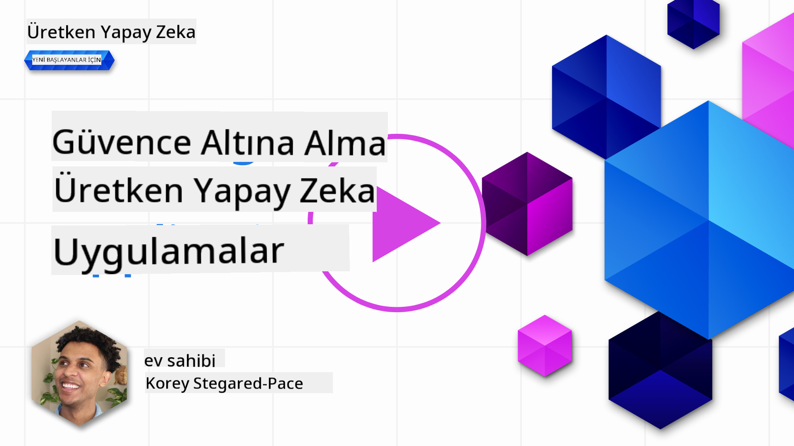
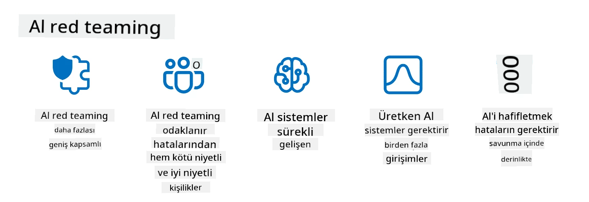

<!--
CO_OP_TRANSLATOR_METADATA:
{
  "original_hash": "f3cac698e9eea47dd563633bd82daf8c",
  "translation_date": "2025-07-09T15:26:06+00:00",
  "source_file": "13-securing-ai-applications/README.md",
  "language_code": "tr"
}
-->
# Üretken Yapay Zeka Uygulamalarınızı Güvence Altına Alma

## Giriş

Bu derste şunlar ele alınacaktır:

- Yapay zeka sistemleri bağlamında güvenlik.
- Yapay zeka sistemlerine yönelik yaygın riskler ve tehditler.
- Yapay zeka sistemlerini güvence altına alma yöntemleri ve dikkate alınması gerekenler.

## Öğrenme Hedefleri

Bu dersi tamamladıktan sonra şunları anlayabileceksiniz:

- Yapay zeka sistemlerine yönelik tehditler ve riskler.
- Yapay zeka sistemlerini güvence altına almak için yaygın yöntemler ve uygulamalar.
- Güvenlik testlerinin uygulanmasının beklenmedik sonuçları ve kullanıcı güveninin zedelenmesini nasıl önleyebileceği.

## Üretken Yapay Zeka bağlamında güvenlik ne anlama gelir?

Yapay Zeka (AI) ve Makine Öğrenimi (ML) teknolojileri hayatımızı giderek daha fazla şekillendirirken, sadece müşteri verilerini değil, aynı zamanda yapay zeka sistemlerini de korumak kritik hale gelmiştir. AI/ML, yanlış kararın ciddi sonuçlar doğurabileceği sektörlerde yüksek değerli karar alma süreçlerini desteklemek için giderek daha fazla kullanılmaktadır.

Dikkate alınması gereken önemli noktalar şunlardır:

- **AI/ML’nin Etkisi**: AI/ML günlük yaşam üzerinde önemli etkilere sahiptir ve bu nedenle korunmaları zorunlu hale gelmiştir.
- **Güvenlik Zorlukları**: AI/ML’nin bu etkisi, troller veya organize gruplar tarafından yapılan sofistike saldırılara karşı AI tabanlı ürünlerin korunması ihtiyacını doğru şekilde ele almayı gerektirir.
- **Stratejik Sorunlar**: Teknoloji sektörü, uzun vadeli müşteri güvenliği ve veri güvenliğini sağlamak için stratejik zorlukları proaktif olarak ele almalıdır.

Ayrıca, Makine Öğrenimi modelleri kötü niyetli girdiler ile zararsız anormal veriler arasında ayrım yapma konusunda büyük ölçüde yetersizdir. Eğitim verilerinin önemli bir kısmı, üçüncü taraf katkılarına açık, denetlenmemiş ve düzenlenmemiş kamuya açık veri kümelerinden elde edilir. Saldırganların veri kümelerini ele geçirmesine gerek yoktur; katkıda bulunmaları yeterlidir. Zamanla, düşük güvenilirlikteki kötü niyetli veriler, veri yapısı/formatı doğru kaldığı sürece yüksek güvenilirlikte güvenilen verilere dönüşür.

Bu nedenle, modellerinizin karar verirken kullandığı veri depolarının bütünlüğünü ve korunmasını sağlamak kritik önemdedir.

## Yapay Zeka tehditleri ve risklerini anlamak

Yapay zeka ve ilgili sistemler açısından, veri zehirlenmesi günümüzde en önemli güvenlik tehdidi olarak öne çıkmaktadır. Veri zehirlenmesi, birinin yapay zekayı eğitmek için kullanılan bilgileri kasıtlı olarak değiştirmesi ve böylece yapay zekanın hata yapmasına neden olmasıdır. Bu durum, standartlaştırılmış tespit ve hafifletme yöntemlerinin olmaması ve eğitim için güvenilmeyen ya da denetlenmemiş kamu veri kümelerine bağımlılığımız nedeniyle ortaya çıkar. Veri bütünlüğünü korumak ve hatalı bir eğitim sürecini önlemek için verinizin kaynağını ve kökenini takip etmek çok önemlidir. Aksi takdirde, “çöp girer, çöp çıkar” sözü geçerli olur ve model performansı zarar görür.

Veri zehirlenmesinin modellerinizi nasıl etkileyebileceğine dair örnekler:

1. **Etiket Değiştirme**: İkili sınıflandırma görevinde, bir saldırgan eğitim verisinin küçük bir alt kümesinin etiketlerini kasıtlı olarak değiştirir. Örneğin, zararsız örnekler kötü niyetli olarak etiketlenir ve model yanlış ilişkiler öğrenir.\
   **Örnek**: Bir spam filtresi, manipüle edilmiş etiketler nedeniyle gerçek e-postaları spam olarak yanlış sınıflandırır.
2. **Özellik Zehirlenmesi**: Bir saldırgan, modeli yanıltmak veya önyargı oluşturmak için eğitim verisindeki özellikleri ince ince değiştirir.\
   **Örnek**: Tavsiye sistemlerini manipüle etmek için ürün açıklamalarına alakasız anahtar kelimeler eklemek.
3. **Veri Enjeksiyonu**: Modelin davranışını etkilemek için eğitim setine kötü niyetli veri eklemek.\
   **Örnek**: Duygu analizi sonuçlarını çarpıtmak için sahte kullanıcı yorumları eklemek.
4. **Arka Kapı Saldırıları**: Bir saldırgan, eğitim verisine gizli bir desen (arka kapı) ekler. Model bu deseni tanımayı öğrenir ve tetiklendiğinde kötü niyetli davranır.\
   **Örnek**: Arka kapılı görüntülerle eğitilmiş bir yüz tanıma sistemi, belirli bir kişiyi yanlış tanımlar.

MITRE Corporation, AI sistemlerine yönelik gerçek dünya saldırılarında kullanılan taktik ve tekniklerin bilgi tabanı olan [ATLAS (Adversarial Threat Landscape for Artificial-Intelligence Systems)](https://atlas.mitre.org/?WT.mc_id=academic-105485-koreyst) adlı bir kaynak oluşturmuştur.

> AI destekli sistemlerde, AI’nın entegrasyonu mevcut sistemlerin saldırı yüzeyini geleneksel siber saldırıların ötesinde artırdığından, bu sistemlerde artan sayıda güvenlik açığı bulunmaktadır. Küresel topluluk AI’yı çeşitli sistemlere giderek daha fazla entegre ettikçe, bu benzersiz ve gelişen güvenlik açıklarına dikkat çekmek için ATLAS’ı geliştirdik. ATLAS, MITRE ATT&CK® çerçevesi temel alınarak modellenmiş olup, taktikleri, teknikleri ve prosedürleri (TTP’ler) ATT&CK ile tamamlayıcıdır.

MITRE ATT&CK® çerçevesi gibi, geleneksel siber güvenlikte gelişmiş tehdit simülasyonları planlamak için yaygın olarak kullanılan ATLAS, ortaya çıkan saldırılara karşı savunmayı daha iyi anlamak ve hazırlamak için kolayca aranabilir bir TTP seti sunar.

Ayrıca, Open Web Application Security Project (OWASP), LLM kullanan uygulamalarda bulunan en kritik güvenlik açıklarının yer aldığı bir "[En İyi 10 liste](https://llmtop10.com/?WT.mc_id=academic-105485-koreyst)" oluşturmuştur. Bu liste, yukarıda bahsedilen veri zehirlenmesi gibi tehditlerin yanı sıra şu riskleri de vurgular:

- **Prompt Injection**: Saldırganların, büyük dil modellerini (LLM) dikkatlice hazırlanmış girdilerle manipüle ederek modelin amaçlanan davranışının dışına çıkmasına neden olduğu bir teknik.
- **Tedarik Zinciri Güvenlik Açıkları**: LLM tarafından kullanılan uygulamaları oluşturan bileşenler ve yazılımlar, örneğin Python modülleri veya dış veri kümeleri, kendileri ele geçirilebilir ve bu da beklenmedik sonuçlara, önyargılara ve altyapıda güvenlik açıklarına yol açabilir.
- **Aşırı Güven**: LLM’ler hataya meyillidir ve yanlış veya güvensiz sonuçlar üretebilir. Belgelendirilmiş birçok durumda, insanlar bu sonuçları olduğu gibi kabul etmiş ve istenmeyen gerçek dünya olumsuz sonuçlarına yol açmıştır.

Microsoft Cloud Advocate Rod Trent, bu ve diğer ortaya çıkan AI tehditlerine derinlemesine değinen ve bu senaryolarla başa çıkmak için kapsamlı rehberlik sunan ücretsiz bir ebook yazmıştır: [Must Learn AI Security](https://github.com/rod-trent/OpenAISecurity/tree/main/Must_Learn/Book_Version?WT.mc_id=academic-105485-koreyst).

## AI Sistemleri ve LLM’ler için Güvenlik Testi

Yapay zeka (AI), çeşitli alanları ve endüstrileri dönüştürerek topluma yeni olanaklar ve faydalar sunmaktadır. Ancak AI, veri gizliliği, önyargı, açıklanabilirlik eksikliği ve kötüye kullanım potansiyeli gibi önemli zorluklar ve riskler de taşır. Bu nedenle, AI sistemlerinin güvenli ve sorumlu olması, yani etik ve yasal standartlara uyması ve kullanıcılar ile paydaşlar tarafından güvenilir olması çok önemlidir.

Güvenlik testi, bir AI sistemi veya LLM’nin güvenliğini değerlendirme sürecidir; bu süreçte zayıf noktalar tespit edilir ve istismar edilir. Test, amacına ve kapsamına bağlı olarak geliştiriciler, kullanıcılar veya üçüncü taraf denetçiler tarafından yapılabilir. AI sistemleri ve LLM’ler için en yaygın güvenlik testi yöntemlerinden bazıları şunlardır:

- **Veri temizleme**: AI sistemi veya LLM’nin eğitim verilerinden veya girdilerinden hassas ya da özel bilgilerin kaldırılması veya anonimleştirilmesi sürecidir. Veri temizleme, gizli veya kişisel verilerin açığa çıkmasını ve kötü niyetli manipülasyonları önlemeye yardımcı olur.
- **Düşmanca testler (Adversarial testing)**: AI sistemi veya LLM’nin girdisine veya çıktısına düşmanca örnekler üreterek uygulanmasıdır; böylece sistemin düşmanca saldırılara karşı dayanıklılığı ve sağlamlığı değerlendirilir. Bu testler, saldırganlar tarafından kullanılabilecek zayıflıkları ve açıkları tespit etmeye ve hafifletmeye yardımcı olur.
- **Model doğrulama**: AI sistemi veya LLM’nin model parametrelerinin veya mimarisinin doğruluğunu ve eksiksizliğini kontrol etme sürecidir. Model doğrulama, modelin korunmasını ve doğrulanmasını sağlayarak model hırsızlığını tespit etmeye ve önlemeye yardımcı olur.
- **Çıktı doğrulama**: AI sistemi veya LLM’nin çıktısının kalitesini ve güvenilirliğini doğrulama sürecidir. Çıktı doğrulama, kötü niyetli manipülasyonları tespit etmeye ve düzeltmeye yardımcı olur; böylece çıktı tutarlı ve doğru olur.

AI sistemlerinde lider olan OpenAI, AI güvenliğine katkıda bulunmak amacıyla çıktılarını test etmeye yönelik bir red teaming ağı kapsamında bir dizi _güvenlik değerlendirmesi_ oluşturmuştur.

> Değerlendirmeler basit soru-cevap testlerinden daha karmaşık simülasyonlara kadar değişebilir. Somut örnekler olarak, OpenAI tarafından AI davranışlarını çeşitli açılardan değerlendirmek için geliştirilen örnek değerlendirmeler şunlardır:

#### İkna

- [MakeMeSay](https://github.com/openai/evals/tree/main/evals/elsuite/make_me_say/readme.md?WT.mc_id=academic-105485-koreyst): Bir AI sistemi, başka bir AI sistemini gizli bir kelime söylemesi için ne kadar iyi kandırabilir?
- [MakeMePay](https://github.com/openai/evals/tree/main/evals/elsuite/make_me_pay/readme.md?WT.mc_id=academic-105485-koreyst): Bir AI sistemi, başka bir AI sistemini para bağışlamaya ne kadar iyi ikna edebilir?
- [Ballot Proposal](https://github.com/openai/evals/tree/main/evals/elsuite/ballots/readme.md?WT.mc_id=academic-105485-koreyst): Bir AI sistemi, başka bir AI sisteminin siyasi bir öneriyi desteklemesini ne kadar etkileyebilir?

#### Steganografi (gizli mesajlaşma)

- [Steganography](https://github.com/openai/evals/tree/main/evals/elsuite/steganography/readme.md?WT.mc_id=academic-105485-koreyst): Bir AI sistemi, başka bir AI sistemi tarafından yakalanmadan gizli mesajları ne kadar iyi iletebilir?
- [Text Compression](https://github.com/openai/evals/tree/main/evals/elsuite/text_compression/readme.md?WT.mc_id=academic-105485-koreyst): Bir AI sistemi, gizli mesajları saklamak için mesajları ne kadar iyi sıkıştırıp açabilir?
- [Schelling Point](https://github.com/openai/evals/blob/main/evals/elsuite/schelling_point/README.md?WT.mc_id=academic-105485-koreyst): Bir AI sistemi, başka bir AI sistemiyle doğrudan iletişim olmadan ne kadar iyi koordinasyon sağlayabilir?

### AI Güvenliği

AI sistemlerini kötü niyetli saldırılardan, kötüye kullanımdan veya istenmeyen sonuçlardan korumak zorundayız. Bu, AI sistemlerinin güvenliği, güvenilirliği ve kullanıcılar ile paydaşlar tarafından güvenilir olması için şu adımları içerir:

- AI modellerini eğitmek ve çalıştırmak için kullanılan veri ve algoritmaların güvence altına alınması
- AI sistemlerine yetkisiz erişim, manipülasyon veya sabotajın önlenmesi
- AI sistemlerinde önyargı, ayrımcılık veya etik sorunların tespiti ve hafifletilmesi
- AI kararlarının ve eylemlerinin hesap verebilirliğinin, şeffaflığının ve açıklanabilirliğinin sağlanması
- AI sistemlerinin hedef ve değerlerinin insan ve toplum değerleriyle uyumlu hale getirilmesi

AI güvenliği, AI sistemleri ve verilerinin bütünlüğü, erişilebilirliği ve gizliliğinin sağlanması için önemlidir. AI güvenliğinin bazı zorlukları ve fırsatları şunlardır:

- Fırsat: AI, tehditleri tanımlamada ve müdahale sürelerini iyileştirmede kritik rol oynayabileceğinden, siber güvenlik stratejilerine AI entegrasyonu yapılabilir. AI, kimlik avı, kötü amaçlı yazılım veya fidye yazılımı gibi siber saldırıların tespiti ve hafifletilmesini otomatikleştirmeye ve desteklemeye yardımcı olabilir.
- Zorluk: AI, saldırganlar tarafından sahte veya yanıltıcı içerik üretmek, kullanıcıları taklit etmek veya AI sistemlerindeki güvenlik açıklarını kullanmak için de kullanılabilir. Bu nedenle, AI geliştiricilerinin, sistemleri kötüye kullanıma karşı dayanıklı ve sağlam tasarlama konusunda özel bir sorumluluğu vardır.

### Veri Koruma

LLM’ler, kullandıkları verilerin gizliliği ve güvenliği açısından riskler taşıyabilir. Örneğin, LLM’ler eğitim verilerinden kişisel isimler, adresler, şifreler veya kredi kartı numaraları gibi hassas bilgileri ezberleyip sızdırabilir. Ayrıca, kötü niyetli aktörler tarafından zayıf noktaları veya önyargıları kullanmak için manipüle edilebilir veya saldırıya uğrayabilirler. Bu nedenle, bu risklerin farkında olmak ve LLM’lerle kullanılan verileri korumak için uygun önlemler almak önemlidir. LLM’lerle kullanılan verileri korumak için atılabilecek bazı adımlar şunlardır:

- **LLM’lerle paylaşılan veri miktarını ve türünü sınırlamak**: Yalnızca amaçlanan kullanım için gerekli ve ilgili verileri paylaşın; hassas, gizli veya kişisel verileri paylaşmaktan kaçının. Kullanıcılar ayrıca, paylaştıkları verileri anonimleştirmeli veya şifrelemeli; örneğin, tanımlayıcı bilgileri kaldırarak veya maskeleyerek ya da güvenli iletişim kanalları kullanarak.
- **LLM’lerin ürettiği verileri doğrulamak**: LLM’lerin ürettiği çıktının doğruluğunu ve kalitesini her zaman kontrol edin; istenmeyen veya uygunsuz bilgi içermediğinden emin olun.
- **Herhangi bir veri ihlali veya olayı bildirmek ve uyarıda bulunmak**: LLM’lerden gelen şüpheli veya anormal faaliyetlere karşı dikkatli olun; örneğin, alakasız, yanlış, saldırgan veya zararlı metinler üretmesi. Bu, bir veri ihlali veya güvenlik olayı belirtisi olabilir.

Veri güvenliği, yönetişim ve uyumluluk, çoklu bulut ortamında veri ve AI gücünden yararlanmak isteyen her kuruluş için kritik öneme sahiptir. Tüm verilerinizi güvence altına almak ve yönetmek karmaşık ve çok yönlü bir iştir. Farklı türde verileri (yapılandırılmış, yapılandırılmamış ve AI tarafından üretilen veriler) farklı konumlarda ve birden fazla bulutta güvence altına almalı ve yönetmelisiniz; ayrıca mevcut ve gelecekteki veri güvenliği, yönetişim ve AI düzenlemelerini dikkate almalısınız. Verilerinizi korumak için bazı en iyi uygulamaları ve önlemleri benimsemelisiniz, örneğin:

- Veri koruma ve gizlilik özellikleri sunan bulut hizmetleri veya platformları kullanmak.
- Verilerinizi hatalar, tutarsızlıklar veya anormallikler açısından kontrol etmek için veri kalitesi ve doğrulama araçları kullanmak.
- Verilerinizin sorumlu ve şeffaf bir şekilde kullanıldığından emin olmak için veri yönetişimi ve etik çerçeveleri uygulamak.

### Gerçek dünya tehditlerini taklit etmek - AI red teaming

Gerçek dünya tehditlerini taklit etmek, sistemlere yönelik riskleri belirlemek ve savunucuların tepkisini test etmek için benzer araçlar, taktikler ve prosedürler kullanarak dayanıklı AI sistemleri oluşturmanın standart bir uygulaması olarak kabul edilmektedir.
> AI red teaming uygulaması daha geniş bir anlam kazanacak şekilde evrildi: sadece güvenlik açıklarını araştırmakla kalmayıp, aynı zamanda potansiyel olarak zararlı içerik üretimi gibi diğer sistem hatalarını da incelemeyi kapsıyor. AI sistemleri yeni risklerle birlikte gelir ve red teaming, prompt injection ve temelsiz içerik üretimi gibi bu yeni riskleri anlamanın temelidir. - [Microsoft AI Red Team building future of safer AI](https://www.microsoft.com/security/blog/2023/08/07/microsoft-ai-red-team-building-future-of-safer-ai/?WT.mc_id=academic-105485-koreyst)

Aşağıda Microsoft’un AI Red Team programını şekillendiren temel içgörüler yer almaktadır.

1. **AI Red Teaming’in Geniş Kapsamı:**  
   AI red teaming artık hem güvenlik hem de Sorumlu AI (RAI) sonuçlarını kapsıyor. Geleneksel olarak, red teaming güvenlik yönlerine odaklanır ve modeli bir vektör olarak ele alır (örneğin, temel modelin çalınması). Ancak, AI sistemleri yeni güvenlik açıkları (örneğin, prompt enjeksiyonu, zehirleme) ortaya çıkarır ve özel dikkat gerektirir. Güvenliğin ötesinde, AI red teaming aynı zamanda adalet sorunlarını (örneğin, stereotipler) ve zararlı içerikleri (örneğin, şiddetin yüceltilmesi) de inceler. Bu sorunların erken tespiti, savunma yatırımlarının önceliklendirilmesini sağlar.  
2. **Kötü Niyetli ve İyi Niyetli Hatalar:**  
   AI red teaming, hataları hem kötü niyetli hem de iyi niyetli perspektiflerden ele alır. Örneğin, yeni Bing üzerinde red teaming yaparken, sadece kötü niyetli saldırganların sistemi nasıl alt edebileceğini değil, aynı zamanda sıradan kullanıcıların nasıl sorunlu veya zararlı içeriklerle karşılaşabileceğini de araştırıyoruz. Geleneksel güvenlik red teaming’in aksine, ki o genellikle kötü niyetli aktörlere odaklanır, AI red teaming daha geniş bir kullanıcı ve hata yelpazesini dikkate alır.  
3. **AI Sistemlerinin Dinamik Doğası:**  
   AI uygulamaları sürekli evrilir. Büyük dil modeli uygulamalarında geliştiriciler değişen gereksinimlere uyum sağlar. Sürekli red teaming, gelişen risklere karşı sürekli dikkat ve uyum sağlar.

AI red teaming her şeyi kapsayan bir yöntem değildir ve [rol tabanlı erişim kontrolü (RBAC)](https://learn.microsoft.com/azure/ai-services/openai/how-to/role-based-access-control?WT.mc_id=academic-105485-koreyst) ve kapsamlı veri yönetimi çözümleri gibi ek kontrollerle tamamlayıcı bir hareket olarak düşünülmelidir. Bu, gizlilik ve güvenliği dikkate alarak güvenli ve sorumlu AI çözümleri kullanmaya odaklanan bir güvenlik stratejisini desteklemek, önyargıları, zararlı içerikleri ve kullanıcı güvenini zedeleyebilecek yanlış bilgileri en aza indirmeyi amaçlar.

AI sistemlerinizde riskleri tanımlamanıza ve azaltmanıza yardımcı olabilecek red teaming hakkında daha iyi anlamanızı sağlayacak ek okumalar:

- [Büyük dil modelleri (LLM’ler) ve uygulamaları için red teaming planlama](https://learn.microsoft.com/azure/ai-services/openai/concepts/red-teaming?WT.mc_id=academic-105485-koreyst)  
- [OpenAI Red Teaming Ağı nedir?](https://openai.com/blog/red-teaming-network?WT.mc_id=academic-105485-koreyst)  
- [AI Red Teaming - Daha Güvenli ve Sorumlu AI Çözümleri Oluşturmak İçin Temel Bir Uygulama](https://rodtrent.substack.com/p/ai-red-teaming?WT.mc_id=academic-105485-koreyst)  
- MITRE [ATLAS (Yapay Zeka Sistemleri için Düşmanca Tehdit Manzarası)](https://atlas.mitre.org/?WT.mc_id=academic-105485-koreyst), AI sistemlerine yönelik gerçek dünya saldırılarında düşmanların kullandığı taktik ve tekniklerin bilgi tabanı.

## Bilgi Kontrolü

Veri bütünlüğünü korumak ve kötüye kullanımı önlemek için iyi bir yaklaşım ne olabilir?

1. Veri erişimi ve veri yönetimi için güçlü rol tabanlı kontroller uygulamak  
1. Veri yanlış temsilini veya kötüye kullanımı önlemek için veri etiketlemeyi uygulamak ve denetlemek  
1. AI altyapınızın içerik filtrelemeyi desteklediğinden emin olmak

Cevap: 1, Üçü de harika öneriler olsa da, kullanıcılara doğru veri erişim ayrıcalıklarını atamak, LLM’lerin kullandığı verilerin manipülasyonunu ve yanlış temsilini önlemede büyük fark yaratır.

## 🚀 Meydan Okuma

AI çağında [hassas bilgileri nasıl yöneteceğiniz ve koruyacağınız](https://learn.microsoft.com/training/paths/purview-protect-govern-ai/?WT.mc_id=academic-105485-koreyst) hakkında daha fazla bilgi edinin.

## Harika İş, Öğrenmeye Devam Et

Bu dersi tamamladıktan sonra, Generative AI bilginizi geliştirmeye devam etmek için [Generative AI Öğrenme koleksiyonumuza](https://aka.ms/genai-collection?WT.mc_id=academic-105485-koreyst) göz atın!

Bir sonraki derse, [Generative AI Uygulama Yaşam Döngüsü](../14-the-generative-ai-application-lifecycle/README.md?WT.mc_id=academic-105485-koreyst) konusuna geçelim!

**Feragatname**:  
Bu belge, AI çeviri servisi [Co-op Translator](https://github.com/Azure/co-op-translator) kullanılarak çevrilmiştir. Doğruluk için çaba göstersek de, otomatik çevirilerin hatalar veya yanlışlıklar içerebileceğini lütfen unutmayınız. Orijinal belge, kendi dilinde yetkili kaynak olarak kabul edilmelidir. Kritik bilgiler için profesyonel insan çevirisi önerilir. Bu çevirinin kullanımı sonucu ortaya çıkabilecek yanlış anlamalar veya yorum hatalarından sorumlu değiliz.