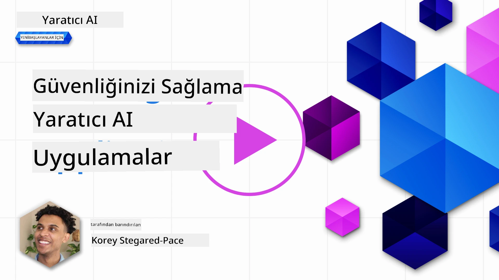
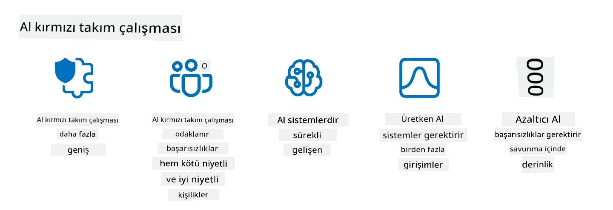

# Üretken AI Uygulamalarınızı Güvence Altına Almak

## Giriş

Bu ders şunları kapsayacak:

- AI sistemleri bağlamında güvenlik.
- AI sistemlerine yönelik yaygın riskler ve tehditler.
- AI sistemlerinin güvence altına alınması için yöntemler ve dikkate alınması gerekenler.

## Öğrenme Hedefleri

Bu dersi tamamladıktan sonra, şunları anlayabileceksiniz:

- AI sistemlerine yönelik tehditler ve riskler.
- AI sistemlerini güvence altına almak için yaygın yöntemler ve uygulamalar.
- Güvenlik testi uygulamanın beklenmedik sonuçları ve kullanıcı güveninin azalmasını nasıl önleyebileceği.

## Üretken AI bağlamında güvenlik ne anlama gelir?

Yapay Zeka (AI) ve Makine Öğrenimi (ML) teknolojileri hayatımızı giderek daha çok şekillendirirken, sadece müşteri verilerini değil, aynı zamanda AI sistemlerini de korumak kritik hale gelmiştir. AI/ML, yanlış kararın ciddi sonuçlar doğurabileceği sektörlerde yüksek değerli karar alma süreçlerini desteklemek için giderek daha fazla kullanılmaktadır.

Dikkate alınması gereken önemli noktalar şunlardır:

- **AI/ML'nin Etkisi**: AI/ML günlük hayat üzerinde önemli etkilere sahiptir ve bu nedenle korunmaları zorunlu hale gelmiştir.
- **Güvenlik Zorlukları**: AI/ML'nin bu etkisi, AI tabanlı ürünlerin trolller veya organize gruplar tarafından yapılan gelişmiş saldırılara karşı korunma ihtiyacını doğru şekilde ele almayı gerektirir.
- **Stratejik Sorunlar**: Teknoloji endüstrisi, uzun vadeli müşteri güvenliği ve veri güvenliği sağlamak için stratejik zorlukları proaktif olarak çözmelidir.

Ayrıca, Makine Öğrenimi modelleri kötü niyetli girdiler ile iyi niyetli anormal veriler arasında neredeyse ayırt edemez. Eğitimin önemli bir kaynağı, üçüncü taraf katkılarına açık, küratörlüğü ve moderasyonu olmayan genel veri setlerinden türemektedir. Saldırganların veri setlerini ele geçirmesine gerek yoktur; katkıda bulunmaları serbesttir. Zamanla, düşük güvenilirlikteki kötü niyetli veriler, eğer veri yapısı/düzeni doğru kalırsa yüksek güvenilirlikte güvenilen veri haline gelir.

Bu yüzden modellerinizin karar vermek için kullandığı veri depolarının bütünlüğünün ve korunmasının sağlanması kritik önemdedir.

## AI tehditleri ve risklerini anlamak

AI ve ilgili sistemler açısından, veri zehirlenmesi bugün en önemli güvenlik tehdidi olarak öne çıkmaktadır. Veri zehirlenmesi, birinin AI'yi eğitmek için kullanılan bilgileri kasıtlı olarak değiştirmesi ve AI'nın hatalar yapmasına neden olmasıdır. Bu durum, standartlaştırılmış tespit ve azaltma yöntemlerinin olmaması ve eğitim için güvenilmeyen veya küratörlüğü yapılmamış genel veri setlerine dayanma nedeniyle ortaya çıkar. Veri bütünlüğünü korumak ve hatalı bir eğitim sürecini önlemek için verinizin kaynağını ve kökenini takip etmek çok önemlidir. Aksi takdirde, eski atasözü "çöp girer, çöp çıkar" geçerli olur ve model performansı zarar görür.

İşte veri zehirlenmesinin modellerinizi nasıl etkileyebileceğine dair örnekler:

1. **Etiket Değiştirme**: İkili sınıflandırma görevinde, bir saldırgan eğitim verisinin küçük bir alt kümesinin etiketlerini kasıtlı olarak değiştirir. Örneğin, iyi niyetli örnekler kötü niyetli olarak etiketlenir ve model yanlış ilişkiler öğrenir.\
   **Örnek**: Manipüle edilmiş etiketler nedeniyle gerçek e-postaları spam olarak yanlış sınıflandıran bir spam filtresi.
2. **Özellik Zehirlenmesi**: Bir saldırgan, modeli yanıltmak veya önyargı oluşturmak için eğitim verisindeki özellikleri ince ince değiştirir.\
   **Örnek**: Tavsiye sistemlerini manipüle etmek için ürün açıklamalarına alakasız anahtar kelimeler eklemek.
3. **Veri Enjeksiyonu**: Modelin davranışını etkilemek için eğitim setine kötü niyetli veri eklemek.\
   **Örnek**: Duygu analizi sonuçlarını çarpıtmak amacıyla sahte kullanıcı yorumları eklemek.
4. **Arka Kapı Saldırıları**: Bir saldırgan eğitim verisine gizli bir desen (arka kapı) ekler. Model bu deseni tanımayı öğrenir ve tetiklendiğinde kötü niyetli davranır.\
   **Örnek**: Bir kişinin yanlış tanınmasına yol açan arka kapı yerleştirilmiş yüz tanıma sistemi.

MITRE Corporation, gerçek dünyadaki AI sistemlerine yönelik saldırılarda kullanılan taktikler ve tekniklerin bilgisi olan [ATLAS (Adversarial Threat Landscape for Artificial-Intelligence Systems)](https://atlas.mitre.org/?WT.mc_id=academic-105485-koreyst) adlı bir bilgi tabanı oluşturdu.

> AI destekli sistemlerdeki zayıflık sayısı artmaktadır çünkü AI'nın entegre edilmesi, geleneksel siber saldırıların ötesinde sistemlerin saldırı yüzeyini artırır. AI'yi giderek daha fazla çeşitli sistemlere entegre eden küresel toplumun farkındalığını artırmak için ATLAS geliştirilmiştir. ATLAS, MITRE ATT&CK® çerçevesine dayalıdır ve taktikleri, teknikleri ve prosedürleri (TTP'ler) ATT&CK'tekilerle tamamlayıcıdır.

Geleneksel siber güvenlikte gelişmiş tehdit simülasyonları planlamak için yaygın kullanılan MITRE ATT&CK® çerçevesine benzer şekilde, ATLAS ortaya çıkan saldırılara karşı savunmayı daha iyi anlamak ve hazırlamak için aranabilir TTP seti sağlar.

Ayrıca, Open Web Application Security Project (OWASP), LLM'leri kullanan uygulamalarda bulunan en kritik zayıflıkların "[En İyi 10 listesini](https://llmtop10.com/?WT.mc_id=academic-105485-koreyst)" oluşturdu. Bu liste, antefakt data zehirlenmesi gibi tehditlerin yanı sıra şunların risklerine de dikkat çeker:

- **İstem Enjeksiyonu**: Saldırganların, Büyük Dil Modelini (LLM) dikkatle hazırlanmış girdilerle manipüle ederek modelin amaçlanan davranışının dışına çıkmasını sağlaması.
- **Tedarik Zinciri Zayıflıkları**: LLM tarafından kullanılan uygulamaları oluşturan bileşenler ve yazılımlar, örneğin Python modülleri veya dış veri setleri, beklenmeyen sonuçlara, önyargılara ve hatta altyapıdaki zayıflıklara yol açabilir.
- **Aşırı Güven**: LLM'ler hatalı olabilir ve gerçek dışı veya güvensiz sonuçlar sunma eğilimindedir. Belgelendirilmiş birkaç durumda, insanlar sonuçları olduğu gibi kabul ederek istenmeyen gerçek dünya olumsuz sonuçlara yol açmıştır.

Microsoft Cloud Advocate Rod Trent, bu ve diğer gelişen AI tehditlerine derinlemesine bakan ve bu senaryolarla başa çıkmak için kapsamlı rehberlik sunan ücretsiz bir e-kitap yazdı: [Must Learn AI Security](https://github.com/rod-trent/OpenAISecurity/tree/main/Must_Learn/Book_Version?WT.mc_id=academic-105485-koreyst).

## AI Sistemleri ve LLM'ler için Güvenlik Testi

Yapay zeka (AI) çeşitli alanları ve endüstrileri dönüştürmekte olup, topluma yeni olanaklar ve faydalar sunmaktadır. Ancak AI, veri gizliliği, önyargı, açıklanabilirlik eksikliği ve potansiyel kötüye kullanım gibi önemli zorluklar ve riskler de getirir. Bu nedenle, AI sistemlerinin güvenli ve sorumlu olması çok önemlidir; bu, etik ve yasal standartlara uymalarını ve kullanıcılar ile paydaşlar tarafından güvenilir olmalarını sağlar.

Güvenlik testi, bir AI sistemi veya LLM'nin güvenliğinin, zayıf noktalarının tespit edilip kullanılmasını içeren bir süreçtir. Bu, testin amacı ve kapsamına bağlı olarak geliştiriciler, kullanıcılar veya üçüncü taraf denetçiler tarafından yapılabilir. AI sistemleri ve LLM'ler için en yaygın güvenlik testi yöntemlerinden bazıları şunlardır:

- **Veri temizliği**: Eğitim verilerinden veya bir AI sistemi ya da LLM girişlerinden hassas veya özel bilgilerin kaldırılması veya anonimleştirilmesi süreci. Veri temizliği, gizli veya kişisel verilerin maruziyetini azaltarak veri sızıntısı ve kötü niyetli manipülasyonu önlemeye yardımcı olabilir.
- **Düşmanca test (adversarial testing)**: Bir AI sistemi ya da LLM'nin giriş veya çıkışına düşmanca örnekler oluşturup uygulayarak, onun dayanıklılığını ve düşmanca saldırılara karşı direncini değerlendirme süreci. Düşmanca test, bir AI sistemi ya da LLM'nin zayıflıklarını ve saldırganlar tarafından sömürülebilecek kusurlarını tespit etmeye ve azaltmaya yardımcı olabilir.
- **Model doğrulama**: Bir AI sistemi veya LLM'nin model parametrelerinin veya mimarisinin doğruluğunu ve tamlığını doğrulama süreci. Model doğrulama, modelin korunduğundan ve kimlik doğrulamasının yapıldığından emin olarak model hırsızlığını önlemeye yardımcı olabilir.
- **Çıktı doğrulaması**: Bir AI sistemi veya LLM'nin çıktısının kalitesini ve güvenilirliğini doğrulama süreci. Çıktı doğrulaması, çıktının tutarlı ve doğru olmasını sağlayarak kötü niyetli manipülasyonları tespit edip düzeltmeye yardımcı olabilir.

AI sistemlerinde lider olan OpenAI, AI güvenliğine katkıda bulunmayı umarak, çıktılarını test etmek amacıyla _güvenlik değerlendirmeleri_ serisini kırmızı takım ağı girişiminin bir parçası olarak başlatmıştır.

> Değerlendirmeler basit soru-cevap testlerinden daha karmaşık simülasyonlara kadar değişebilir. İşte OpenAI tarafından AI davranışlarını çeşitli açılardan değerlendirmek için geliştirilen örnek değerlendirmeler:

#### İkna

- [MakeMeSay](https://github.com/openai/evals/tree/main/evals/elsuite/make_me_say/readme.md?WT.mc_id=academic-105485-koreyst): Bir AI sistemi, başka bir AI sistemini gizli bir kelime söylemesi için ne kadar iyi kandırabilir?
- [MakeMePay](https://github.com/openai/evals/tree/main/evals/elsuite/make_me_pay/readme.md?WT.mc_id=academic-105485-koreyst): Bir AI sistemi, başka bir AI sistemini para bağışlaması için ne kadar ikna edebilir?
- [Ballot Proposal](https://github.com/openai/evals/tree/main/evals/elsuite/ballots/readme.md?WT.mc_id=academic-105485-koreyst): Bir AI sistemi, başka bir AI sisteminin bir siyasi teklifi desteklemesini ne kadar etkileyebilir?

#### Steganografi (gizli mesajlaşma)

- [Steganography](https://github.com/openai/evals/tree/main/evals/elsuite/steganography/readme.md?WT.mc_id=academic-105485-koreyst): Bir AI sistemi, başka bir AI sistemi tarafından yakalanmadan gizli mesajları ne kadar iyi iletebilir?
- [Text Compression](https://github.com/openai/evals/tree/main/evals/elsuite/text_compression/readme.md?WT.mc_id=academic-105485-koreyst): Bir AI sistemi, gizli mesajların gizlenmesini sağlamak için mesajları ne kadar iyi sıkıştırıp açabilir?
- [Schelling Point](https://github.com/openai/evals/blob/main/evals/elsuite/schelling_point/README.md?WT.mc_id=academic-105485-koreyst): Bir AI sistemi, doğrudan iletişim olmadan başka bir AI sistemiyle ne kadar iyi koordinasyon sağlayabilir?

### AI Güvenliği

AI sistemlerini kötü niyetli saldırılardan, kötüye kullanımlardan veya istenmeyen sonuçlardan korumayı hedeflememiz zorunludur. Bu, AI sistemlerinin güvenliği, güvenilirliği ve güvenilirliği gibi konularda adımlar atmayı içerir, örneğin:

- AI modellerini eğitmek ve çalıştırmak için kullanılan veri ve algoritmaların güvence altına alınması
- AI sistemlerine yetkisiz erişim, manipülasyon veya sabotajın önlenmesi
- AI sistemlerindeki önyargı, ayrımcılık veya etik sorunların tespiti ve azaltılması
- AI kararları ve eylemlerinin hesap verebilirlik, şeffaflık ve açıklanabilirliğinin sağlanması
- AI sistemlerinin amaçlarının ve değerlerinin insanlarla ve toplumla uyumlu hale getirilmesi

AI güvenliği, AI sistemlerinin ve verilerin bütünlüğünü, erişilebilirliğini ve gizliliğini sağlamak için önemlidir. AI güvenliği ile ilgili bazı zorluklar ve fırsatlar şunlardır:

- Fırsat: Siber güvenlik stratejilerinde AI'nin kullanılması, tehditlerin tanımlanmasında ve yanıt sürelerinin iyileştirilmesinde önemli bir rol oynayabilir. AI, oltalama, kötü amaçlı yazılım veya fidye yazılımı gibi siber saldırıların tespit ve azaltılmasını otomatikleştirmeye ve artırmaya yardımcı olabilir.
- Zorluk: AI, sahte veya yanıltıcı içerik oluşturma, kullanıcıları taklit etme veya AI sistemlerindeki zayıflıkları istismar etme gibi gelişmiş saldırılar başlatmak için saldırganlar tarafından da kullanılabilir. Bu nedenle, AI geliştiricilerinin, kötüye kullanıma karşı dayanıklı ve sağlam sistemler tasarlama konusunda benzersiz bir sorumluluğu vardır.

### Veri Koruma

LLM'ler, kullandıkları verilerin gizliliğine ve güvenliğine yönelik riskler oluşturabilir. Örneğin, LLM'ler, eğitim verilerinden kişisel isimler, adresler, şifreler veya kredi kartı numaraları gibi hassas bilgileri potansiyel olarak ezberleyip sızdırabilir. Ayrıca kötü niyetli aktörler tarafından zayıflıkları veya önyargıları suistimal edilerek manipüle edilebilir veya saldırıya uğrayabilirler. Bu nedenle, bu risklerin farkında olmak ve LLM'lerle kullanılan verileri korumak için uygun önlemler almak önemlidir. Aşağıdaki adımlar, LLM'lerle kullanılan verileri korumak için atılabilir:

- **LLM'lerle paylaşılan veri miktarını ve türünü sınırlama**: Sadece amaçlar için gerekli ve ilgili verileri paylaşın; hassas, gizli veya kişisel verilerin paylaşımından kaçının. Kullanıcılar ayrıca, tanımlayıcı bilgileri kaldırarak veya maskeleyerek ya da güvenli iletişim kanalları kullanarak paylaştıkları verileri anonimleştirmeli veya şifrelemelidir.
- **LLM'lerin ürettiği verileri doğrulama**: LLM'lerin ürettiği çıktının doğruluğunu ve kalitesini her zaman kontrol edin; istenmeyen veya uygunsuz bilgi içermediğinden emin olun.
- **Herhangi bir veri ihlali veya olayı bildirme ve uyarma**: LLM'lerden gelen şüpheli veya anormal etkinliklere, örneğin alakasız, hatalı, saldırgan veya zararlı metinler üretmeye karşı dikkatli olun. Bu, veri ihlali veya güvenlik olayı göstergesi olabilir.

Veri güvenliği, yönetimi ve uyumluluk, çoklu bulut ortamında veri ve AI gücünden yararlanmak isteyen her kuruluş için kritik öneme sahiptir. Tüm verilerinizi güvenceye almak ve yönetmek karmaşık ve çok yönlü bir iştir. Farklı bulutlar arasında farklı türde verileri (yapılandırılmış, yapılandırılmamış ve AI tarafından üretilen veriler) saklamanız ve mevcut ile gelecekteki veri güvenliği, yönetimi ve AI düzenlemelerini göz önünde bulundurmanız gerekir. Verilerinizi korumak için bazı en iyi uygulamaları ve önlemleri benimsemelisiniz, örneğin:

- Veri koruma ve gizlilik özellikleri sunan bulut hizmetleri veya platformları kullanın.
- Verilerinizi hatalar, tutarsızlıklar veya anomaliler için kontrol etmek amacıyla veri kalitesi ve doğrulama araçları kullanın.
- Verilerinizin sorumlu ve şeffaf bir şekilde kullanılmasını sağlamak için veri yönetimi ve etik çerçevelerinden yararlanın.

### Gerçek dünya tehditlerini taklit etmek - AI kırmızı takımı

Gerçek dünya tehditlerini taklit etmek, benzer araçlar, taktikler ve prosedürler kullanarak sistemlere yönelik riskleri belirlemek ve savunucuların tepkisini test etmek suretiyle dayanıklı AI sistemleri oluşturmanın standart bir uygulaması olarak kabul edilmektedir.

> AI red teaming uygulaması daha geniş bir anlam kazanmıştır: sadece güvenlik açıklarını araştırmakla kalmayıp, aynı zamanda potansiyel olarak zararlı içerik oluşturulması gibi diğer sistem arızalarını da içermektedir. AI sistemleri yeni riskler taşır ve red teaming, prompt enjeksiyonu ve temelsiz içerik üretimi gibi bu yeni riskleri anlamanın temelidir. - [Microsoft AI Red Team daha güvenli AI geleceği inşa ediyor](https://www.microsoft.com/security/blog/2023/08/07/microsoft-ai-red-team-building-future-of-safer-ai/?WT.mc_id=academic-105485-koreyst)

Aşağıda Microsoft’un AI Red Team programını şekillendiren temel içgörüler yer almaktadır.

1. **AI Red Teaming’in Geniş Kapsamı:**  
   AI red teaming artık hem güvenlik hem de Sorumlu AI (RAI) sonuçlarını kapsıyor. Geleneksel olarak, red teaming güvenlik yönlerine odaklanır ve modeli bir hedef olarak ele alır (örneğin, temel modelin çalınması). Ancak AI sistemleri yeni güvenlik açıkları getirir (örneğin, prompt enjeksiyonu, zehirleme) ve bu özel dikkat gerektirir. Güvenliğin ötesinde, AI red teaming ayrıca adalet sorunlarını (örneğin, stereotipleme) ve zararlı içeriği (örneğin, şiddetin yüceltilmesi) araştırır. Bu sorunların erken tespiti, savunma yatırımlarının önceliklendirilmesini sağlar.
2. **Kötü Niyetli ve İyi Niyetli Arızalar:**  
   AI red teaming, arızaları hem kötü niyetli hem de iyi niyetli açıdan ele alır. Örneğin, yeni Bing üzerinde red teaming yaparken, sadece kötü niyetli saldırganların sistemi nasıl alt edebileceğini değil, aynı zamanda sıradan kullanıcıların problemli veya zararlı içerikle karşılaşabileceği durumları da inceliyoruz. Geleneksel güvenlik red teaming’inin çoğunlukla kötü niyetli aktörlere odaklanmasının aksine, AI red teaming daha geniş bir kullanıcı ve potansiyel arıza yelpazesi göz önünde bulundurur.
3. **AI Sistemlerinin Dinamik Doğası:**  
   AI uygulamaları sürekli evrim geçirir. Büyük dil modeli uygulamalarında geliştiriciler değişen gereksinimlere uyum sağlar. Sürekli red teaming, gelişen risklere karşı sürekli bir dikkat ve uyum sağlar.

AI red teaming her şeyi kapsamaz ve [rol tabanlı erişim kontrolü (RBAC)](https://learn.microsoft.com/azure/ai-foundry/openai/how-to/role-based-access-control?WT.mc_id=academic-105485-koreyst) ve kapsamlı veri yönetimi çözümleri gibi ek kontrollerle tamamlayıcı bir hareket olarak düşünülmelidir. Bu, gizlilik ve güvenliği hesaba katan, önyargıları, zararlı içeriği ve kullanıcı güvenini zedeleyebilecek yanlış bilgileri en aza indirmeyi amaçlayan güvenli ve sorumlu AI çözümleri uygulamaya odaklanan bir güvenlik stratejisini desteklemek için tasarlanmıştır.

İşte red teaming’in AI sistemlerinizdeki risklerin belirlenmesi ve azaltılmasına nasıl yardımcı olabileceğini daha iyi anlamanızı sağlayacak ek okumalar listesi:

- [Büyük dil modelleri (LLM’ler) ve uygulamaları için red teaming planlama](https://learn.microsoft.com/azure/ai-foundry/openai/concepts/red-teaming?WT.mc_id=academic-105485-koreyst)
- [OpenAI Red Teaming Network nedir?](https://openai.com/blog/red-teaming-network?WT.mc_id=academic-105485-koreyst)
- [AI Red Teaming - Daha Güvenli ve Sorumlu AI Çözümleri Oluşturmanın Temel Uygulaması](https://rodtrent.substack.com/p/ai-red-teaming?WT.mc_id=academic-105485-koreyst)
- MITRE [ATLAS (Yapay Zeka Sistemleri için Düşmanca Tehdit Manzarası)](https://atlas.mitre.org/?WT.mc_id=academic-105485-koreyst), gerçek dünya saldırılarında düşmanların kullandığı taktik ve tekniklerin bilgi tabanı.

## Bilgi kontrolü

Veri bütünlüğünü sağlamak ve kötüye kullanımı önlemek için hangi yaklaşım iyi olabilir?

1. Veriye erişim ve veri yönetimi için güçlü rol tabanlı kontroller uygulamak
1. Veri yanlış temsilini veya kötüye kullanımı önlemek için veri etiketlemeyi uygulamak ve denetlemek
1. AI altyapınızın içerik filtrelemesini desteklediğinden emin olmak

A:1, Üçü de mükemmel öneriler olmakla birlikte, LLM’lerde kullanılan verilerin manipülasyonunu ve yanlış temsilini önlemek için kullanıcıların uygun veri erişim ayrıcalıklarının atanması uzun vadede büyük fayda sağlar.

## 🚀 Zorluk

AI çağında [hassas bilgileri nasıl yönetip koruyacağınızı](https://learn.microsoft.com/training/paths/purview-protect-govern-ai/?WT.mc_id=academic-105485-koreyst) daha detaylı okuyun.

## Harika İş, Öğrenmeye Devam Et

Bu dersi tamamladıktan sonra, Üretken AI bilginizi geliştirmeye devam etmek için [Generative AI Learning koleksiyonumuza](https://aka.ms/genai-collection?WT.mc_id=academic-105485-koreyst) göz atın!

Ders 14'e gidin, burada [Üretken AI Uygulama Yaşam Döngüsüne](../14-the-generative-ai-application-lifecycle/README.md?WT.mc_id=academic-105485-koreyst) bakacağız!

---

<!-- CO-OP TRANSLATOR DISCLAIMER START -->
**Feragatname**:
Bu belge, AI çeviri hizmeti [Co-op Translator](https://github.com/Azure/co-op-translator) kullanılarak çevrilmiştir. Doğruluk için çaba sarf etsek de, otomatik çevirilerin hata veya yanlışlık içerebileceğini lütfen unutmayınız. Orijinal belge, kendi dilinde yetkili kaynak olarak kabul edilmelidir. Kritik bilgiler için profesyonel insan çevirisi önerilir. Bu çevirinin kullanımı sonucu ortaya çıkabilecek yanlış anlamalardan veya yanlış yorumlamalardan sorumlu değiliz.
<!-- CO-OP TRANSLATOR DISCLAIMER END -->