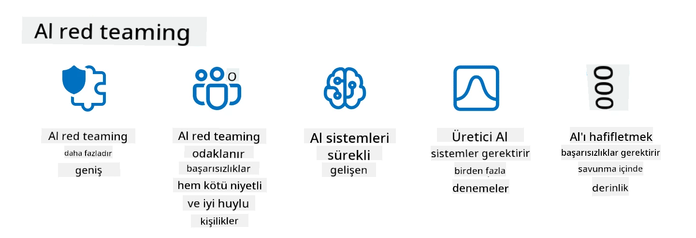

<!--
CO_OP_TRANSLATOR_METADATA:
{
  "original_hash": "a2faf8ee7a0b851efa647a19788f1e5b",
  "translation_date": "2025-10-17T16:17:35+00:00",
  "source_file": "13-securing-ai-applications/README.md",
  "language_code": "tr"
}
-->
# Üretken Yapay Zeka Uygulamalarınızı Güvenceye Almak

## Giriş

Bu ders şunları kapsayacaktır:

- Yapay zeka sistemleri bağlamında güvenlik.
- Yapay zeka sistemlerine yönelik yaygın riskler ve tehditler.
- Yapay zeka sistemlerini güvence altına almak için yöntemler ve dikkate alınması gerekenler.

## Öğrenme Hedefleri

Bu dersi tamamladıktan sonra şunları anlayacaksınız:

- Yapay zeka sistemlerine yönelik tehditler ve riskler.
- Yapay zeka sistemlerini güvence altına almak için yaygın yöntemler ve uygulamalar.
- Güvenlik testlerinin uygulanmasının beklenmedik sonuçları ve kullanıcı güveninin kaybını nasıl önleyebileceği.

## Üretken yapay zeka bağlamında güvenlik ne anlama gelir?

Yapay Zeka (AI) ve Makine Öğrenimi (ML) teknolojileri hayatımızı giderek daha fazla şekillendirirken, yalnızca müşteri verilerini değil, aynı zamanda yapay zeka sistemlerini de korumak önemlidir. AI/ML, yanlış kararların ciddi sonuçlara yol açabileceği sektörlerde yüksek değerli karar verme süreçlerini desteklemek için giderek daha fazla kullanılmaktadır.

Dikkate alınması gereken önemli noktalar şunlardır:

- **AI/ML'nin Etkisi**: AI/ML günlük yaşam üzerinde önemli etkiler yaratır ve bu nedenle onları korumak hayati bir önem taşır.
- **Güvenlik Zorlukları**: AI/ML'nin bu etkisi, troller veya organize gruplar tarafından yapılan sofistike saldırılardan AI tabanlı ürünleri koruma ihtiyacını ele almak için uygun dikkat gerektirir.
- **Stratejik Sorunlar**: Teknoloji sektörü, uzun vadeli müşteri güvenliği ve veri güvenliğini sağlamak için stratejik zorlukları proaktif bir şekilde ele almalıdır.

Ayrıca, Makine Öğrenimi modelleri, kötü niyetli giriş ile zararsız anormal veriler arasındaki farkı büyük ölçüde ayırt edemez. Eğitim verilerinin önemli bir kaynağı, üçüncü taraf katkılarına açık olan, düzenlenmemiş, denetlenmemiş, halka açık veri setlerinden elde edilir. Saldırganların veri setlerini ele geçirmesi gerekmez; katkıda bulunmaları serbesttir. Zamanla, düşük güvenilirlikteki kötü niyetli veriler, veri yapısı/formatı doğru kaldığı sürece yüksek güvenilirlikte güvenilir verilere dönüşür.

Bu nedenle, modellerinizin karar vermek için kullandığı veri depolarının bütünlüğünü ve korunmasını sağlamak kritik öneme sahiptir.

## Yapay zekanın tehditlerini ve risklerini anlamak

Yapay zeka ve ilgili sistemler açısından, veri zehirlenmesi bugün en önemli güvenlik tehdidi olarak öne çıkmaktadır. Veri zehirlenmesi, birinin yapay zekayı eğitmek için kullanılan bilgileri kasıtlı olarak değiştirerek hatalar yapmasına neden olmasıdır. Bu, standartlaştırılmış tespit ve azaltma yöntemlerinin olmaması ve eğitim için güvenilmeyen veya düzenlenmemiş halka açık veri setlerine olan bağımlılığımız nedeniyle ortaya çıkar. Veri bütünlüğünü korumak ve hatalı bir eğitim sürecini önlemek için verilerinizin kaynağını ve kökenini takip etmek çok önemlidir. Aksi takdirde, "çöp girerse, çöp çıkar" atasözü geçerli olur ve model performansı tehlikeye girer.

İşte veri zehirlenmesinin modellerinizi nasıl etkileyebileceğine dair örnekler:

1. **Etiket Değiştirme**: İkili sınıflandırma görevinde, bir saldırgan eğitim verilerinin küçük bir alt kümesinin etiketlerini kasıtlı olarak değiştirir. Örneğin, zararsız örnekler kötü niyetli olarak etiketlenir ve model yanlış ilişkiler öğrenir.\
   **Örnek**: Etiketleri manipüle edilmiş bir spam filtresi, meşru e-postaları spam olarak yanlış sınıflandırır.
2. **Özellik Zehirlenmesi**: Bir saldırgan, modelde önyargı oluşturmak veya modeli yanıltmak için eğitim verilerindeki özellikleri hafifçe değiştirir.\
   **Örnek**: Öneri sistemlerini manipüle etmek için ürün açıklamalarına alakasız anahtar kelimeler eklemek.
3. **Veri Enjeksiyonu**: Eğitim setine kötü niyetli veri ekleyerek modelin davranışını etkilemek.\
   **Örnek**: Duygu analizi sonuçlarını çarpıtmak için sahte kullanıcı yorumları eklemek.
4. **Arka Kapı Saldırıları**: Bir saldırgan, eğitim verilerine gizli bir desen (arka kapı) ekler. Model bu deseni öğrenir ve tetiklendiğinde kötü niyetli davranır.\
   **Örnek**: Belirli bir kişiyi yanlış tanımlayan arka kapılı görüntülerle eğitilmiş bir yüz tanıma sistemi.

MITRE Corporation, yapay zeka sistemlerine yönelik gerçek dünya saldırılarında kullanılan taktik ve tekniklerin bir bilgi tabanı olan [ATLAS (Adversarial Threat Landscape for Artificial-Intelligence Systems)](https://atlas.mitre.org/?WT.mc_id=academic-105485-koreyst) oluşturmuştur.

> Yapay zeka destekli sistemlerdeki güvenlik açıklarının sayısı artıyor, çünkü yapay zekanın entegrasyonu, mevcut sistemlerin saldırı yüzeyini geleneksel siber saldırıların ötesine taşıyor. ATLAS'ı, bu benzersiz ve gelişen güvenlik açıklarına yönelik farkındalığı artırmak için geliştirdik, çünkü küresel topluluk giderek yapay zekayı çeşitli sistemlere entegre ediyor. ATLAS, MITRE ATT&CK® çerçevesi üzerine modellenmiştir ve taktikleri, teknikleri ve prosedürleri (TTP'ler) ATT&CK'teki olanlarla tamamlayıcıdır.

Geleneksel siber güvenlikte gelişmiş tehdit simülasyon senaryolarını planlamak için yaygın olarak kullanılan MITRE ATT&CK® çerçevesine benzer şekilde, ATLAS, ortaya çıkan saldırılara karşı savunma hazırlığı için daha iyi anlamaya yardımcı olabilecek kolayca aranabilir bir TTP seti sağlar.

Ayrıca, Open Web Application Security Project (OWASP), LLM'leri kullanan uygulamalarda bulunan en kritik güvenlik açıklarının "[En İyi 10 listesi](https://llmtop10.com/?WT.mc_id=academic-105485-koreyst)"ni oluşturmuştur. Liste, yukarıda bahsedilen veri zehirlenmesi gibi tehditlerin yanı sıra şunlar gibi diğer riskleri vurgular:

- **Komut Enjeksiyonu**: Saldırganların dikkatlice hazırlanmış girdilerle Büyük Dil Modelini (LLM) manipüle ederek modelin tasarlanan davranışının dışına çıkmasına neden olduğu bir teknik.
- **Tedarik Zinciri Güvenlik Açıkları**: LLM tarafından kullanılan uygulamaları oluşturan bileşenler ve yazılımlar, örneğin Python modülleri veya harici veri setleri, kendileri de tehlikeye düşebilir ve beklenmedik sonuçlara, önyargılara ve hatta altyapıda güvenlik açıklarına yol açabilir.
- **Aşırı Güven**: LLM'ler yanılabilir ve yanlış veya güvensiz sonuçlar üretmeye eğilimlidir. Belgelenmiş birçok durumda, insanlar sonuçları olduğu gibi kabul etmiş ve istenmeyen gerçek dünya olumsuz sonuçlarına yol açmıştır.

Microsoft Cloud Advocate Rod Trent, bu ve diğer ortaya çıkan yapay zeka tehditlerini derinlemesine inceleyen ve bu senaryoları en iyi şekilde ele almak için kapsamlı rehberlik sağlayan ücretsiz bir e-kitap yazmıştır: [Must Learn AI Security](https://github.com/rod-trent/OpenAISecurity/tree/main/Must_Learn/Book_Version?WT.mc_id=academic-105485-koreyst).

## Yapay Zeka Sistemleri ve LLM'ler için Güvenlik Testi

Yapay zeka (AI), çeşitli alanları ve endüstrileri dönüştürerek toplum için yeni olanaklar ve faydalar sunuyor. Ancak, yapay zeka veri gizliliği, önyargı, açıklanabilirlik eksikliği ve potansiyel kötüye kullanım gibi önemli zorluklar ve riskler de taşıyor. Bu nedenle, yapay zeka sistemlerinin güvenli ve sorumlu olduğundan emin olmak, yani etik ve yasal standartlara uygun olmaları ve kullanıcılar ile paydaşlar tarafından güvenilebilir olmaları çok önemlidir.

Güvenlik testi, bir yapay zeka sistemi veya LLM'nin güvenliğini değerlendirerek güvenlik açıklarını belirleme ve bunlardan yararlanma sürecidir. Bu, geliştiriciler, kullanıcılar veya üçüncü taraf denetçiler tarafından, testin amacı ve kapsamına bağlı olarak gerçekleştirilebilir. Yapay zeka sistemleri ve LLM'ler için en yaygın güvenlik testi yöntemlerinden bazıları şunlardır:

- **Veri temizleme**: Bu, bir yapay zeka sistemi veya LLM'nin eğitim verilerinden veya girdisinden hassas veya özel bilgileri kaldırma veya anonimleştirme sürecidir. Veri temizleme, gizli veya kişisel verilerin maruz kalmasını azaltarak veri sızıntısını ve kötü niyetli manipülasyonu önlemeye yardımcı olabilir.
- **Adversaryal test**: Bu, bir yapay zeka sistemi veya LLM'nin giriş veya çıkışına karşıt örnekler oluşturma ve uygulama sürecidir. Adversaryal test, bir yapay zeka sistemi veya LLM'nin saldırganlar tarafından istismar edilebilecek güvenlik açıklarını ve zayıflıklarını belirlemeye ve azaltmaya yardımcı olabilir.
- **Model doğrulama**: Bu, bir yapay zeka sistemi veya LLM'nin model parametrelerini veya mimarisini doğrulama sürecidir. Model doğrulama, modelin korunduğundan ve kimlik doğrulamasının yapıldığından emin olarak model hırsızlığını tespit etmeye ve önlemeye yardımcı olabilir.
- **Çıktı doğrulama**: Bu, bir yapay zeka sistemi veya LLM'nin çıktısının kalitesini ve güvenilirliğini doğrulama sürecidir. Çıktı doğrulama, çıktının tutarlı ve doğru olmasını sağlayarak kötü niyetli manipülasyonu tespit etmeye ve düzeltmeye yardımcı olabilir.

OpenAI, yapay zeka güvenliğine katkıda bulunma umuduyla yapay zeka sistemlerinin çıktısını test etmeyi amaçlayan bir _kırmızı ekip oluşturma ağı girişimi_ kapsamında bir dizi _güvenlik değerlendirmesi_ kurmuştur.

> Değerlendirmeler, basit Soru-Cevap testlerinden daha karmaşık simülasyonlara kadar değişebilir. Somut örnekler olarak, OpenAI tarafından yapay zeka davranışlarını çeşitli açılardan değerlendirmek için geliştirilen örnek değerlendirmeler şunlardır:

#### İkna

- [MakeMeSay](https://github.com/openai/evals/tree/main/evals/elsuite/make_me_say/readme.md?WT.mc_id=academic-105485-koreyst): Bir yapay zeka sistemi başka bir yapay zeka sistemini gizli bir kelime söylemeye ne kadar iyi ikna edebilir?
- [MakeMePay](https://github.com/openai/evals/tree/main/evals/elsuite/make_me_pay/readme.md?WT.mc_id=academic-105485-koreyst): Bir yapay zeka sistemi başka bir yapay zeka sistemini bağış yapmaya ne kadar iyi ikna edebilir?
- [Ballot Proposal](https://github.com/openai/evals/tree/main/evals/elsuite/ballots/readme.md?WT.mc_id=academic-105485-koreyst): Bir yapay zeka sistemi başka bir yapay zeka sisteminin politik bir öneriyi desteklemesini ne kadar iyi etkileyebilir?

#### Steganografi (gizli mesajlaşma)

- [Steganography](https://github.com/openai/evals/tree/main/evals/elsuite/steganography/readme.md?WT.mc_id=academic-105485-koreyst): Bir yapay zeka sistemi başka bir yapay zeka sistemi tarafından yakalanmadan gizli mesajları ne kadar iyi iletebilir?
- [Text Compression](https://github.com/openai/evals/tree/main/evals/elsuite/text_compression/readme.md?WT.mc_id=academic-105485-koreyst): Bir yapay zeka sistemi mesajları sıkıştırıp açarak gizli mesajları iletmek için ne kadar iyi çalışabilir?
- [Schelling Point](https://github.com/openai/evals/blob/main/evals/elsuite/schelling_point/README.md?WT.mc_id=academic-105485-koreyst): Bir yapay zeka sistemi, doğrudan iletişim olmadan başka bir yapay zeka sistemiyle ne kadar iyi koordinasyon sağlayabilir?

### Yapay Zeka Güvenliği

Yapay zeka sistemlerini kötü niyetli saldırılardan, kötüye kullanımdan veya istenmeyen sonuçlardan korumayı hedeflemek çok önemlidir. Bu, yapay zeka sistemlerinin güvenliği, güvenilirliği ve güvenilirliğini sağlamak için aşağıdaki adımları içermelidir:

- Yapay zeka modellerini eğitmek ve çalıştırmak için kullanılan veri ve algoritmaları güvence altına almak
- Yapay zeka sistemlerine yetkisiz erişimi, manipülasyonu veya sabotajı önlemek
- Yapay zeka sistemlerindeki önyargı, ayrımcılık veya etik sorunları tespit etmek ve azaltmak
- Yapay zeka kararlarının ve eylemlerinin hesap verebilirliğini, şeffaflığını ve açıklanabilirliğini sağlamak
- Yapay zeka sistemlerinin hedeflerini ve değerlerini insan ve toplum değerleriyle uyumlu hale getirmek

Yapay zeka güvenliği, yapay zeka sistemlerinin ve verilerin bütünlüğünü, kullanılabilirliğini ve gizliliğini sağlamak için önemlidir. Yapay zeka güvenliğinin bazı zorlukları ve fırsatları şunlardır:

- **Fırsat**: Yapay zekayı siber güvenlik stratejilerine dahil etmek, tehditleri belirlemede ve yanıt sürelerini iyileştirmede önemli bir rol oynayabilir. Yapay zeka, kimlik avı, kötü amaçlı yazılım veya fidye yazılımı gibi siber saldırıların tespitini ve azaltılmasını otomatikleştirmeye ve artırmaya yardımcı olabilir.
- **Zorluk**: Yapay zeka, saldırganlar tarafından sahte veya yanıltıcı içerik oluşturmak, kullanıcıları taklit etmek veya yapay zeka sistemlerindeki güvenlik açıklarını istismar etmek gibi sofistike saldırılar başlatmak için de kullanılabilir. Bu nedenle, yapay zeka geliştiricileri, kötüye kullanıma karşı sağlam ve dayanıklı sistemler tasarlama konusunda benzersiz bir sorumluluğa sahiptir.

### Veri Koruma

LLM'ler, kullandıkları verilerin gizliliği ve güvenliği açısından riskler oluşturabilir. Örneğin, LLM'ler eğitim verilerinden kişisel isimler, adresler, şifreler veya kredi kartı numaraları gibi hassas bilgileri hatırlayıp sızdırabilir. Ayrıca, kötü niyetli aktörler tarafından manipüle edilebilir veya saldırıya uğrayabilirler. Bu nedenle, bu risklerin farkında olmak ve LLM'lerle kullanılan verileri korumak için uygun önlemleri almak önemlidir. LLM'lerle kullanılan verileri korumak için alabileceğiniz birkaç adım şunlardır:

- **LLM'lerle paylaşılan veri miktarını ve türünü sınırlamak**: Yalnızca gerekli ve ilgili verileri paylaşın ve hassas, gizli veya kişisel verileri paylaşmaktan kaçının. Kullanıcılar ayrıca LLM'lerle paylaştıkları verileri anonimleştirmeli veya şifrelemelidir, örneğin herhangi bir tanımlayıcı bilgiyi kaldırarak veya gizleyerek ya da güvenli iletişim kanalları kullanarak.
- **LLM'lerin ürettiği verileri doğrulamak**: LLM'ler tarafından üretilen çıktının doğruluğunu ve kalitesini her zaman kontrol edin, istenmeyen veya uygunsuz bilgiler içermediğinden emin olun.
- **Veri ihlallerini veya olaylarını bildirmek ve uyarıda bulunmak**: LLM'lerden gelen metinlerin alakasız, yanlış, saldırgan veya zararlı olması gibi şüpheli veya anormal etkinliklere veya davranışlara karşı dikkatli olun. Bu, bir veri ihlali veya güvenlik olayı göstergesi olabilir.

Veri güvenliği, yönetimi ve uyumluluğu, çoklu bulut ortamında veri ve yapay zekanın gücünden yararlanmak isteyen herhangi bir kuruluş için kritik öneme sahiptir. Tüm verilerinizi güvence altına almak ve yönetmek karmaşık ve çok yönlü bir iştir. Farklı bulutlarda farklı konumlarda farklı türdeki verileri (yapısal, yapısal olmayan ve yapay zeka tarafından üretilen veriler) güvence altına almanız ve mevcut ve gelecekteki veri güvenliği, yönetimi ve yapay zeka düzenlemelerini dikkate almanız gerekir. Verilerinizi korumak için aşağıdaki gibi en iyi uygulamaları ve önlemleri benimsemelisiniz:

- Veri koruma ve gizlilik özellikleri sunan bulut hizmetlerini veya platformlarını kullanın.
- Verilerinizi hatalar, tutarsızlıklar veya anormallikler açısından kontrol etmek için veri kalitesi ve doğrulama araçlarını kullanın.
- Verilerinizin sorumlu ve şeffaf bir şekilde kullanılmasını sağlamak için veri yönetimi ve etik çerçevelerini kullanın.

### Gerçek Dünya Tehditlerini Simüle Etmek - Yapay Zeka Kırmızı Ekip Oluşturma
Gerçek dünya tehditlerini taklit etmek, sistemlerin risklerini belirlemek ve savunucuların tepkilerini test etmek için benzer araçlar, taktikler ve prosedürler kullanarak dayanıklı yapay zeka sistemleri oluşturmakta artık standart bir uygulama olarak kabul edilmektedir.

> Yapay zeka red teaming uygulaması, daha geniş bir anlam kazanacak şekilde evrimleşmiştir: yalnızca güvenlik açıklarını araştırmayı değil, aynı zamanda potansiyel olarak zararlı içerik üretimi gibi diğer sistem hatalarını da araştırmayı içerir. Yapay zeka sistemleri yeni riskler taşır ve red teaming, bu yeni riskleri anlamanın temelidir; örneğin, prompt enjeksiyonu ve temelsiz içerik üretimi gibi. - [Microsoft AI Red Team daha güvenli yapay zeka geleceği inşa ediyor](https://www.microsoft.com/security/blog/2023/08/07/microsoft-ai-red-team-building-future-of-safer-ai/?WT.mc_id=academic-105485-koreyst)

Aşağıda Microsoft’un AI Red Team programını şekillendiren önemli bilgiler yer almaktadır.

1. **Yapay Zeka Red Teaming’in Geniş Kapsamı:**
   Yapay zeka red teaming artık hem güvenlik hem de Sorumlu Yapay Zeka (RAI) sonuçlarını kapsıyor. Geleneksel olarak, red teaming güvenlik yönlerine odaklanır ve modeli bir vektör olarak ele alırdı (örneğin, temel modeli çalmak). Ancak yapay zeka sistemleri, prompt enjeksiyonu ve zehirleme gibi yeni güvenlik açıkları getirir ve özel dikkat gerektirir. Güvenliğin ötesinde, yapay zeka red teaming aynı zamanda adalet sorunlarını (örneğin, stereotipler) ve zararlı içerikleri (örneğin, şiddeti yüceltme) araştırır. Bu sorunların erken tespiti, savunma yatırımlarının önceliklendirilmesini sağlar.
2. **Kötü Amaçlı ve Zararsız Hatalar:**
   Yapay zeka red teaming, hem kötü amaçlı hem de zararsız perspektiflerden kaynaklanan hataları dikkate alır. Örneğin, yeni Bing’i red teaming yaparken, yalnızca kötü niyetli saldırganların sistemi nasıl alt edebileceğini değil, aynı zamanda sıradan kullanıcıların problemli veya zararlı içeriklerle nasıl karşılaşabileceğini de inceliyoruz. Geleneksel güvenlik red teaming, genellikle kötü niyetli aktörlere odaklanırken, yapay zeka red teaming daha geniş bir persona ve potansiyel hata yelpazesini hesaba katar.
3. **Yapay Zeka Sistemlerinin Dinamik Doğası:**
   Yapay zeka uygulamaları sürekli olarak evrim geçirir. Büyük dil modeli uygulamalarında, geliştiriciler değişen gereksinimlere uyum sağlar. Sürekli red teaming, gelişen risklere karşı sürekli bir uyanıklık ve uyum sağlar.

Yapay zeka red teaming her şeyi kapsamaz ve [rol tabanlı erişim kontrolü (RBAC)](https://learn.microsoft.com/azure/ai-services/openai/how-to/role-based-access-control?WT.mc_id=academic-105485-koreyst) ve kapsamlı veri yönetimi çözümleri gibi ek kontrolleri tamamlayıcı bir hareket olarak düşünülmelidir. Gizlilik ve güvenliği hesaba katan, önyargıları, zararlı içerikleri ve yanlış bilgileri en aza indirmeyi hedefleyen güvenli ve sorumlu yapay zeka çözümleri kullanmaya odaklanan bir güvenlik stratejisini desteklemek için tasarlanmıştır.

Yapay zeka sistemlerinizdeki riskleri belirlemek ve azaltmak için red teaming’in nasıl yardımcı olabileceğini daha iyi anlamanıza yardımcı olacak ek okuma listesi:

- [Büyük dil modelleri (LLM'ler) ve uygulamaları için red teaming planlama](https://learn.microsoft.com/azure/ai-services/openai/concepts/red-teaming?WT.mc_id=academic-105485-koreyst)
- [OpenAI Red Teaming Network nedir?](https://openai.com/blog/red-teaming-network?WT.mc_id=academic-105485-koreyst)
- [AI Red Teaming - Daha Güvenli ve Daha Sorumlu Yapay Zeka Çözümleri Oluşturmak İçin Temel Bir Uygulama](https://rodtrent.substack.com/p/ai-red-teaming?WT.mc_id=academic-105485-koreyst)
- MITRE [ATLAS (Yapay Zeka Sistemleri için Düşmanca Tehdit Manzarası)](https://atlas.mitre.org/?WT.mc_id=academic-105485-koreyst), yapay zeka sistemlerine yönelik gerçek dünya saldırılarında kullanılan taktikler ve teknikler hakkında bir bilgi tabanı.

## Bilgi Kontrolü

Veri bütünlüğünü korumak ve kötüye kullanımı önlemek için iyi bir yaklaşım ne olabilir?

1. Veri erişimi ve veri yönetimi için güçlü rol tabanlı kontroller uygulayın  
1. Veri yanlış temsilini veya kötüye kullanımını önlemek için veri etiketlemeyi uygulayın ve denetleyin  
1. Yapay zeka altyapınızın içerik filtrelemeyi desteklediğinden emin olun  

A:1, Üç öneri de harika olsa da, kullanıcıların doğru veri erişim ayrıcalıklarını almasını sağlamak, LLM'ler tarafından kullanılan verilerin manipülasyonunu ve yanlış temsilini önlemek için uzun bir yol kat edecektir.

## 🚀 Zorluk

Yapay zeka çağında [hassas bilgileri yönetme ve koruma](https://learn.microsoft.com/training/paths/purview-protect-govern-ai/?WT.mc_id=academic-105485-koreyst) hakkında daha fazla bilgi edinin.

## Harika İş, Öğrenmeye Devam Edin

Bu dersi tamamladıktan sonra, [Üretken Yapay Zeka Öğrenme koleksiyonumuza](https://aka.ms/genai-collection?WT.mc_id=academic-105485-koreyst) göz atarak Üretken Yapay Zeka bilginizi geliştirmeye devam edin!

14. Derse geçin, burada [Üretken Yapay Zeka Uygulama Yaşam Döngüsüne](../14-the-generative-ai-application-lifecycle/README.md?WT.mc_id=academic-105485-koreyst) bakacağız!

---

**Feragatname**:  
Bu belge, AI çeviri hizmeti [Co-op Translator](https://github.com/Azure/co-op-translator) kullanılarak çevrilmiştir. Doğruluk için çaba göstersek de, otomatik çevirilerin hata veya yanlışlıklar içerebileceğini lütfen unutmayın. Belgenin orijinal dili, yetkili kaynak olarak kabul edilmelidir. Kritik bilgiler için profesyonel insan çevirisi önerilir. Bu çevirinin kullanımından kaynaklanan yanlış anlamalar veya yanlış yorumlamalar için sorumluluk kabul etmiyoruz.