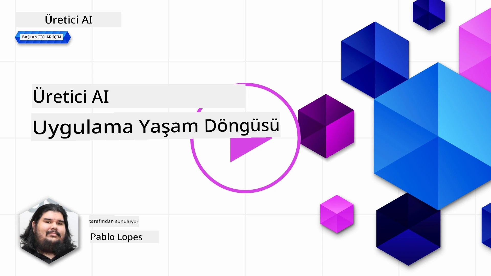
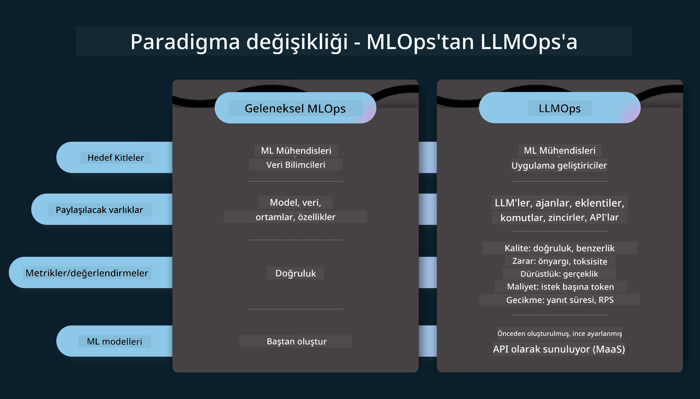
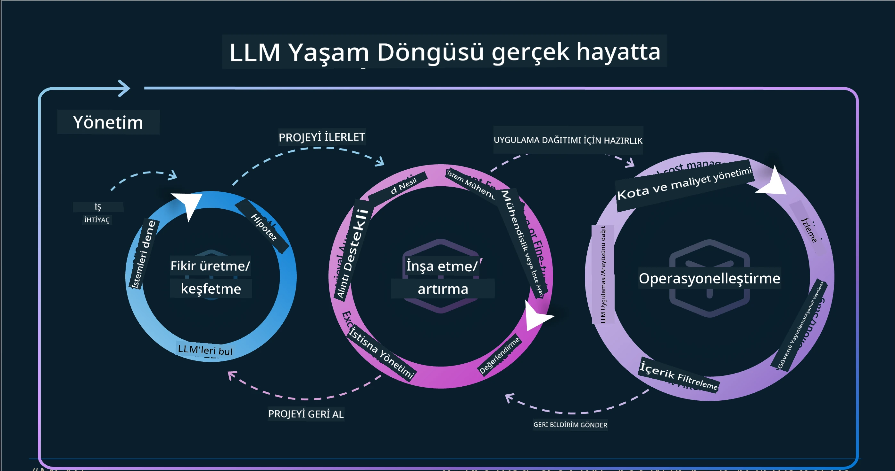
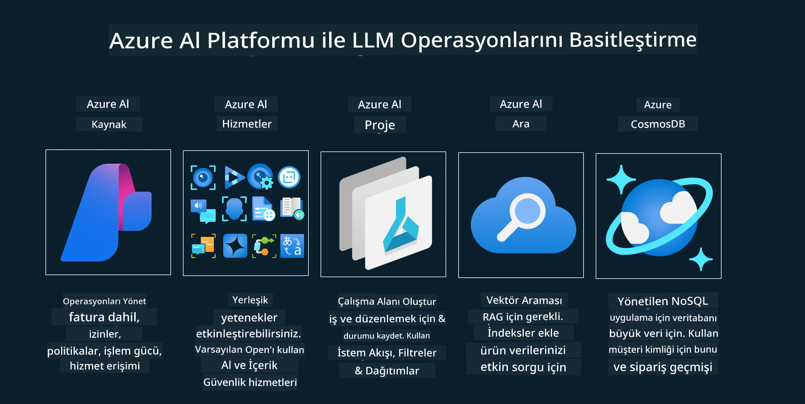
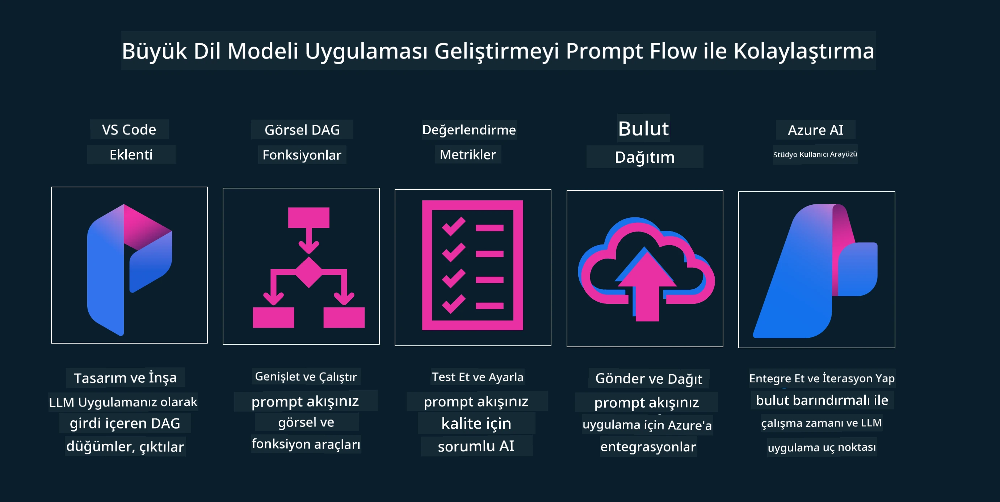

<!--
CO_OP_TRANSLATOR_METADATA:
{
  "original_hash": "df44972d5575ea8cef3c52ee31696d04",
  "translation_date": "2025-12-19T14:56:11+00:00",
  "source_file": "14-the-generative-ai-application-lifecycle/README.md",
  "language_code": "tr"
}
-->

# Üretken Yapay Zeka Uygulama Yaşam Döngüsü

Tüm yapay zeka uygulamaları için önemli bir soru, yapay zekanın hızla gelişen bir alan olması nedeniyle yapay zeka özelliklerinin alaka düzeyidir; uygulamanızın alakalı, güvenilir ve sağlam kalmasını sağlamak için onu sürekli izlemeli, değerlendirmeli ve geliştirmelisiniz. İşte burada üretken yapay zeka yaşam döngüsü devreye girer.

Üretken yapay zeka yaşam döngüsü, üretken yapay zeka uygulaması geliştirme, dağıtma ve sürdürme aşamalarında size rehberlik eden bir çerçevedir. Hedeflerinizi tanımlamanıza, performansınızı ölçmenize, zorluklarınızı belirlemenize ve çözümlerinizi uygulamanıza yardımcı olur. Ayrıca uygulamanızı alanınızın ve paydaşlarınızın etik ve yasal standartlarıyla uyumlu hale getirmenize yardımcı olur. Üretken yapay zeka yaşam döngüsünü takip ederek, uygulamanızın her zaman değer sunmasını ve kullanıcılarınızı memnun etmesini sağlayabilirsiniz.

## Giriş

Bu bölümde:

- MLOps'tan LLMOps'a Paradigma Değişimini Anlayacaksınız
- LLM Yaşam Döngüsü
- Yaşam Döngüsü Araçları
- Yaşam Döngüsü Ölçümleme ve Değerlendirme

## MLOps'tan LLMOps'a Paradigma Değişimini Anlayın

LLM'ler, Yapay Zeka cephaneliğinde yeni bir araçtır, uygulamalar için analiz ve üretim görevlerinde inanılmaz derecede güçlüdürler, ancak bu güç, yapay zeka ve Klasik Makine Öğrenimi görevlerini nasıl kolaylaştırdığımız üzerinde bazı sonuçlar doğurur.

Bununla birlikte, bu aracı dinamik bir şekilde, doğru teşviklerle uyarlamak için yeni bir Paradigmaya ihtiyacımız var. Eski yapay zeka uygulamalarını "ML Uygulamaları" ve yeni yapay zeka uygulamalarını "GenAI Uygulamaları" veya sadece "AI Uygulamaları" olarak kategorize edebiliriz; bu, o dönemde kullanılan ana teknoloji ve teknikleri yansıtır. Bu, anlatımızı birçok yönden değiştirir, aşağıdaki karşılaştırmaya bakın.

LLMOps'ta, uygulama geliştiricilere daha fazla odaklandığımızı, entegrasyonları anahtar nokta olarak kullandığımızı, "Hizmet Olarak Modeller" kullandığımızı ve metrikler için aşağıdaki noktalarda düşündüğümüzü fark edin.

- Kalite: Yanıt kalitesi
- Zarar: Sorumlu Yapay Zeka
- Dürüstlük: Yanıtın dayanaklılığı (Mantıklı mı? Doğru mu?)
- Maliyet: Çözüm Bütçesi
- Gecikme: Token yanıtı için ortalama süre

## LLM Yaşam Döngüsü

Öncelikle, yaşam döngüsünü ve değişiklikleri anlamak için aşağıdaki infografiğe bakalım.

Gördüğünüz gibi, bu MLOps'tan alışık olduğumuz yaşam döngülerinden farklıdır. LLM'lerin birçok yeni gereksinimi vardır; Prompting, kaliteyi artırmak için farklı teknikler (İnce Ayar, RAG, Meta-Promptlar), sorumlu yapay zeka ile farklı değerlendirme ve sorumluluk, son olarak yeni değerlendirme metrikleri (Kalite, Zarar, Dürüstlük, Maliyet ve Gecikme).

Örneğin, nasıl fikir ürettiğimize bir göz atın. Hipotezlerinin doğru olup olmadığını test etmek için çeşitli LLM'lerle denemeler yapmak üzere prompt mühendisliği kullanıyoruz.

Bunun doğrusal değil, entegre döngüler, yinelemeli ve genel bir döngü olduğunu unutmayın.

Bu adımları nasıl keşfedebiliriz? Bir yaşam döngüsü nasıl oluşturabileceğimize ayrıntılı bakalım.

Bu biraz karmaşık görünebilir, önce üç büyük adıma odaklanalım.

1. Fikir Üretme/Keşfetme: Keşif, burada iş ihtiyaçlarımıza göre keşif yapabiliriz. Prototip oluşturma, bir [PromptFlow](https://microsoft.github.io/promptflow/index.html?WT.mc_id=academic-105485-koreyst) yaratma ve Hipotezimiz için yeterince verimli olup olmadığını test etme.
1. İnşa Etme/Geliştirme: Uygulama, şimdi daha büyük veri setleri için değerlendirmeye başlıyoruz, çözümümüzün sağlamlığını kontrol etmek için İnce Ayar ve RAG gibi teknikleri uyguluyoruz. Eğer işe yaramazsa, yeniden uygulamak, akışımıza yeni adımlar eklemek veya verileri yeniden yapılandırmak yardımcı olabilir. Akışımızı ve ölçeğimizi test ettikten sonra, çalışıyorsa ve Metriklerimizi kontrol ettiysek, bir sonraki adıma hazırdır.
1. Operasyonel Hale Getirme: Entegrasyon, şimdi sistemimize İzleme ve Uyarı Sistemleri ekliyoruz, dağıtım ve uygulama entegrasyonu yapıyoruz.

Sonra, güvenlik, uyumluluk ve yönetişime odaklanan genel bir Yönetim döngümüz var.

Tebrikler, artık yapay zeka uygulamanız kullanıma hazır ve operasyonel. Pratik bir deneyim için [Contoso Chat Demo](https://nitya.github.io/contoso-chat/?WT.mc_id=academic-105485-koreys)'a göz atın.

Peki, hangi araçları kullanabiliriz?

## Yaşam Döngüsü Araçları

Araçlar için Microsoft, [Azure AI Platformu](https://azure.microsoft.com/solutions/ai/?WT.mc_id=academic-105485-koreys) ve [PromptFlow](https://microsoft.github.io/promptflow/index.html?WT.mc_id=academic-105485-koreyst) ile döngünüzü kolayca uygulamanızı ve kullanıma hazır hale getirmenizi sağlar.

[Azure AI Platformu](https://azure.microsoft.com/solutions/ai/?WT.mc_id=academic-105485-koreys), [AI Studio](https://ai.azure.com/?WT.mc_id=academic-105485-koreys) kullanmanıza olanak tanır. AI Studio, modelleri, örnekleri ve araçları keşfetmenizi sağlayan bir web portalıdır. Kaynaklarınızı yönetir, kullanıcı arayüzü geliştirme akışları ve Kod-Öncelikli geliştirme için SDK/CLI seçenekleri sunar.

Azure AI, operasyonlarınızı, hizmetlerinizi, projelerinizi, vektör arama ve veritabanı ihtiyaçlarınızı yönetmek için birden çok kaynak kullanmanıza olanak tanır.

Proof-of-Concept(POC)'ten büyük ölçekli uygulamalara kadar PromptFlow ile inşa edin:

- VS Code'dan görsel ve fonksiyonel araçlarla uygulamalar tasarlayın ve oluşturun
- Uygulamalarınızı kaliteli yapay zeka için kolayca test edin ve ince ayar yapın.
- Azure AI Studio'yu kullanarak bulut ile entegre edin, iterasyon yapın, hızlı entegrasyon için itme ve dağıtım yapın.

## Harika! Öğrenmeye Devam Edin!

Harika, şimdi kavramları kullanmak için bir uygulamayı nasıl yapılandırdığımızı öğrenmek için [Contoso Chat Uygulaması](https://nitya.github.io/contoso-chat/?WT.mc_id=academic-105485-koreyst)'na göz atın, Bulut Savunuculuğunun bu kavramları gösterimlerde nasıl eklediğini kontrol edin. Daha fazla içerik için [Ignite breakout oturumumuzu](https://www.youtube.com/watch?v=DdOylyrTOWg) izleyin!

Şimdi, Üretken Yapay Zekayı nasıl etkilediğini ve daha ilgi çekici uygulamalar yapmak için [Retrieval Augmented Generation ve Vektör Veritabanlarını](../15-rag-and-vector-databases/README.md?WT.mc_id=academic-105485-koreyst) anlamak için Ders 15'e geçin!

---

<!-- CO-OP TRANSLATOR DISCLAIMER START -->
**Feragatname**:  
Bu belge, AI çeviri servisi [Co-op Translator](https://github.com/Azure/co-op-translator) kullanılarak çevrilmiştir. Doğruluk için çaba gösterilse de, otomatik çevirilerin hatalar veya yanlışlıklar içerebileceğini lütfen unutmayınız. Orijinal belge, kendi dilinde yetkili kaynak olarak kabul edilmelidir. Kritik bilgiler için profesyonel insan çevirisi önerilir. Bu çevirinin kullanımı sonucu oluşabilecek yanlış anlamalar veya yorum hatalarından sorumlu değiliz.
<!-- CO-OP TRANSLATOR DISCLAIMER END -->