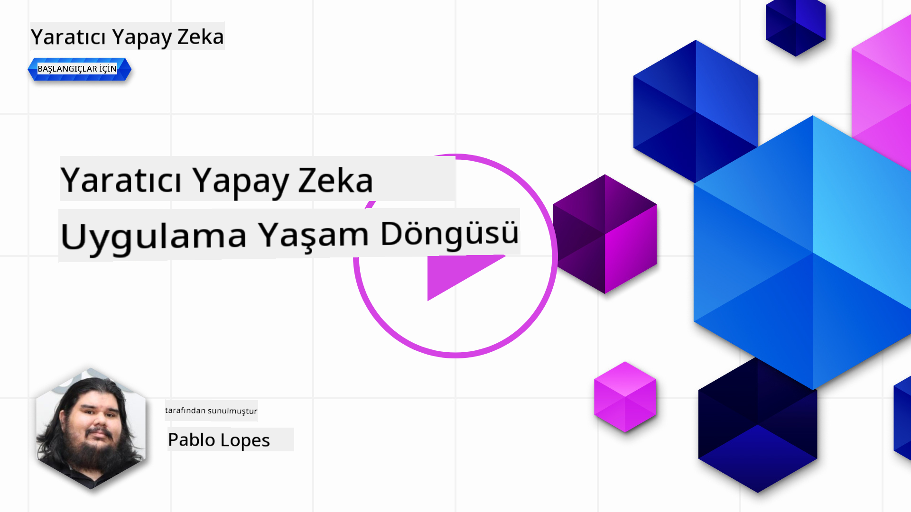
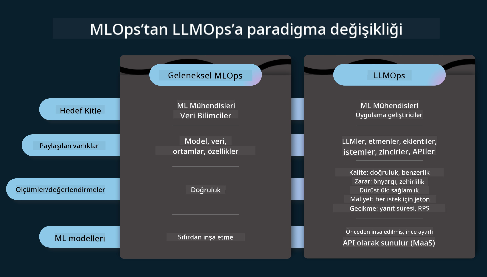
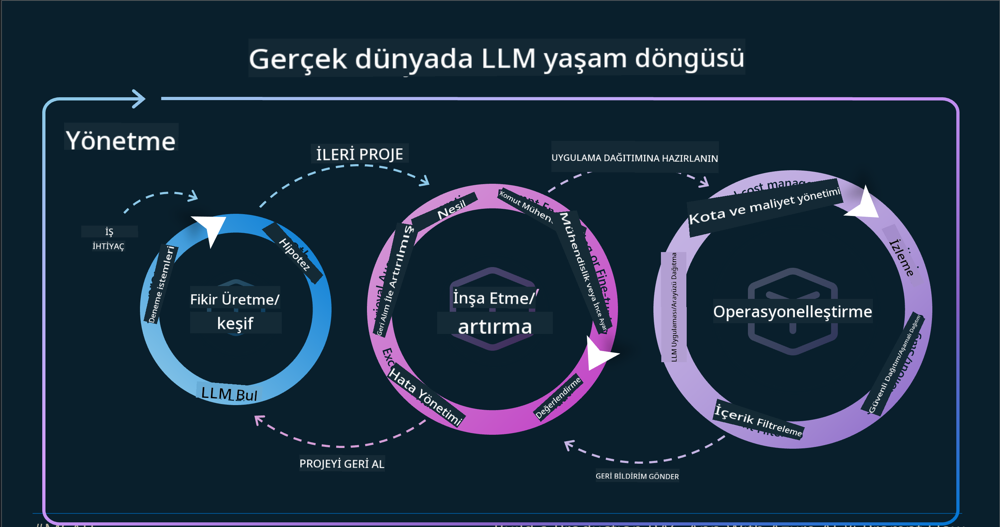
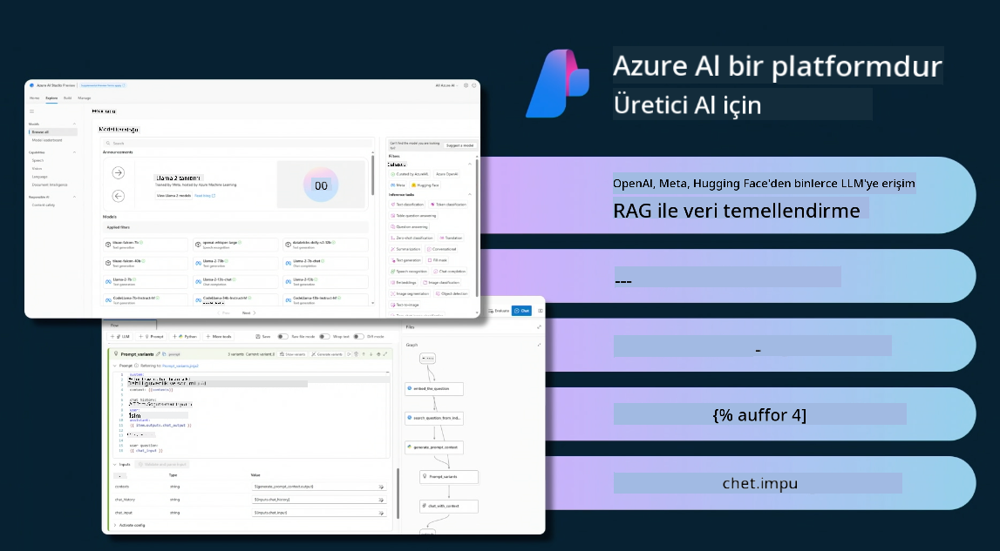
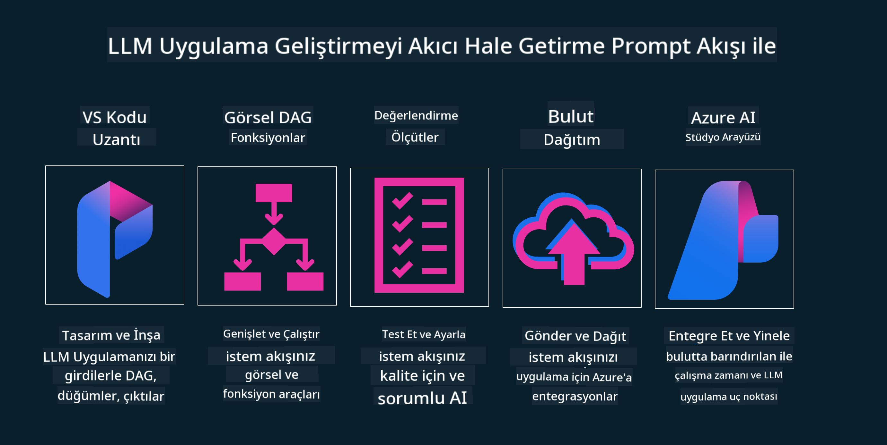

<!--
CO_OP_TRANSLATOR_METADATA:
{
  "original_hash": "27a5347a5022d5ef0a72ab029b03526a",
  "translation_date": "2025-05-19T23:27:21+00:00",
  "source_file": "14-the-generative-ai-application-lifecycle/README.md",
  "language_code": "tr"
}
-->

# Üretken AI Uygulama Yaşam Döngüsü

Tüm AI uygulamaları için önemli bir soru, AI özelliklerinin alaka düzeyidir. AI hızlı gelişen bir alan olduğundan, uygulamanızın alakalı, güvenilir ve sağlam kalmasını sağlamak için sürekli olarak izlemeli, değerlendirmeli ve iyileştirmelisiniz. İşte bu noktada üretken AI yaşam döngüsü devreye girer.

Üretken AI yaşam döngüsü, bir üretken AI uygulamasını geliştirme, dağıtma ve sürdürme aşamalarında size rehberlik eden bir çerçevedir. Hedeflerinizi tanımlamanıza, performansınızı ölçmenize, zorluklarınızı belirlemenize ve çözümlerinizi uygulamanıza yardımcı olur. Ayrıca, uygulamanızı alanınızın ve paydaşlarınızın etik ve yasal standartlarıyla uyumlu hale getirmenize yardımcı olur. Üretken AI yaşam döngüsünü takip ederek, uygulamanızın her zaman değer sunduğundan ve kullanıcılarınızı tatmin ettiğinden emin olabilirsiniz.

## Giriş

Bu bölümde:

- MLOps'tan LLMOps'a Paradigma Değişimini Anlayın
- LLM Yaşam Döngüsü
- Yaşam Döngüsü Araçları
- Yaşam Döngüsü Ölçümleme ve Değerlendirme

## MLOps'tan LLMOps'a Paradigma Değişimini Anlayın

LLM'ler, Yapay Zeka cephaneliğinde yeni bir araçtır. Uygulamalar için analiz ve üretim görevlerinde inanılmaz derecede güçlüdürler. Ancak, bu güç, AI ve Klasik Makine Öğrenimi görevlerini nasıl kolaylaştırdığımız konusunda bazı sonuçlar doğurur.

Bununla birlikte, bu aracı dinamik bir şekilde, doğru teşviklerle uyarlamak için yeni bir Paradigmaya ihtiyacımız var. Eski AI uygulamalarını "ML Uygulamaları" ve daha yeni AI Uygulamalarını "GenAI Uygulamaları" veya sadece "AI Uygulamaları" olarak kategorize edebiliriz. Bu, o dönemde kullanılan ana akım teknoloji ve teknikleri yansıtır. Bu, anlatımızı birden çok şekilde değiştirir, aşağıdaki karşılaştırmaya bakın.

LLMOps'ta, uygulama geliştiricilere daha fazla odaklandığımızı, entegrasyonları anahtar bir nokta olarak kullandığımızı, "Hizmet Olarak Modeller" kullandığımızı ve metrikler için aşağıdaki noktalarda düşündüğümüzü unutmayın.

- Kalite: Yanıt kalitesi
- Zarar: Sorumlu AI
- Dürüstlük: Yanıtın temellendirilmesi (Mantıklı mı? Doğru mu?)
- Maliyet: Çözüm bütçesi
- Gecikme: Jeton yanıtı için ortalama süre

## LLM Yaşam Döngüsü

Öncelikle, yaşam döngüsünü ve değişikliklerini anlamak için bir sonraki infografiğe dikkat edelim.

Görüldüğü gibi, bu MLOps'tan alışılmış yaşam döngülerinden farklıdır. LLM'lerin, Prompting, kaliteyi artırmak için farklı teknikler (İnce Ayar, RAG, Meta-Prompts), sorumlu AI ile farklı değerlendirme ve sorumluluk, son olarak yeni değerlendirme metrikleri (Kalite, Zarar, Dürüstlük, Maliyet ve Gecikme) gibi birçok yeni gereksinimi vardır.

Örneğin, nasıl fikir ürettiğimize bakın. Hipotezlerinin doğru olup olmadığını test etmek için çeşitli LLM'lerle deney yapmak için prompt mühendisliğini kullanarak olasılıkları keşfetmek.

Bu, doğrusal değil, entegre döngüler, yinelemeli ve kapsayıcı bir döngü ile yapılır.

Bu adımları nasıl keşfedebiliriz? Bir yaşam döngüsü nasıl oluşturabileceğimize dair ayrıntılara bakalım.

Bu biraz karmaşık görünebilir, önce üç büyük adıma odaklanalım.

1. Fikir Üretme/Keşfetme: Keşif, burada iş ihtiyaçlarımıza göre keşif yapabiliriz. Prototip oluşturma, bir [PromptFlow](https://microsoft.github.io/promptflow/index.html?WT.mc_id=academic-105485-koreyst) oluşturma ve Hipotezimiz için yeterince verimli olup olmadığını test etme.
2. İnşa Etme/Artırma: Uygulama, şimdi daha büyük veri kümeleri için değerlendirmeye başlıyoruz, çözümümüzün sağlamlığını kontrol etmek için İnce Ayar ve RAG gibi teknikleri uyguluyoruz. Eğer değilse, yeniden uygulamak, akışımıza yeni adımlar eklemek veya verileri yeniden yapılandırmak yardımcı olabilir. Akışımızı ve ölçeğimizi test ettikten sonra, çalışırsa ve metriklerimizi kontrol edersek, bir sonraki adım için hazırdır.
3. Operasyonelleştirme: Entegrasyon, şimdi sistemimize İzleme ve Uyarı Sistemleri ekleyerek, dağıtım ve uygulama entegrasyonu yaparak Uygulamamıza entegrasyon sağlıyoruz.

Sonra, güvenlik, uyumluluk ve yönetişime odaklanan genel bir Yönetim döngümüz var.

Tebrikler, şimdi AI Uygulamanız kullanıma hazır ve operasyonel. Uygulamalı bir deneyim için [Contoso Chat Demo](https://nitya.github.io/contoso-chat/?WT.mc_id=academic-105485-koreys)'ya göz atın.

Peki, hangi araçları kullanabiliriz?

## Yaşam Döngüsü Araçları

Araçlar için, Microsoft [Azure AI Platformu](https://azure.microsoft.com/solutions/ai/?WT.mc_id=academic-105485-koreys) ve [PromptFlow](https://microsoft.github.io/promptflow/index.html?WT.mc_id=academic-105485-koreyst) sunarak yaşam döngünüzü uygulamayı ve kullanıma hazır hale getirmeyi kolaylaştırır.

[Azure AI Platformu](https://azure.microsoft.com/solutions/ai/?WT.mc_id=academic-105485-koreys), [AI Studio](https://ai.azure.com/?WT.mc_id=academic-105485-koreys) kullanmanızı sağlar. AI Studio, modelleri, örnekleri ve araçları keşfetmenize olanak tanıyan bir web portalıdır. Kaynaklarınızı yönetmek, UI geliştirme akışları ve Kod-İlk geliştirme için SDK/CLI seçeneklerini yönetmek.

Azure AI, operasyonlarınızı, hizmetlerinizi, projelerinizi, vektör arama ve veri tabanları ihtiyaçlarınızı yönetmek için birden fazla kaynak kullanmanıza olanak tanır.

Proof-of-Concept'ten (POC) büyük ölçekli uygulamalara kadar PromptFlow ile inşa edin:

- VS Code'dan, görsel ve işlevsel araçlarla uygulamalar tasarlayın ve oluşturun
- Uygulamalarınızı kolayca kaliteli AI için test edin ve ince ayarlayın.
- Azure AI Studio'yu kullanarak bulutla entegre edin ve yineleyin, hızlı entegrasyon için Push ve Deploy yapın.

## Harika! Öğrenmeye Devam Edin!

Harika, şimdi [Contoso Chat App](https://nitya.github.io/contoso-chat/?WT.mc_id=academic-105485-koreyst) ile bu kavramları kullanmak için bir uygulamayı nasıl yapılandırdığımızı öğrenin, Cloud Advocacy'nin bu kavramları gösterimlerde nasıl eklediğini kontrol edin. Daha fazla içerik için [Ignite breakout oturumuna](https://www.youtube.com/watch?v=DdOylyrTOWg) göz atın!

Şimdi, [Retrieval Augmented Generation ve Vektör Veritabanları](../15-rag-and-vector-databases/README.md?WT.mc_id=academic-105485-koreyst)'nın Üretken AI üzerindeki etkisini ve daha ilgi çekici Uygulamalar yapmayı anlamak için 15. Derse göz atın!

**Feragatname**:  
Bu belge, AI çeviri hizmeti [Co-op Translator](https://github.com/Azure/co-op-translator) kullanılarak çevrilmiştir. Doğruluğu sağlamak için çaba sarf etsek de, otomatik çevirilerin hata veya yanlışlıklar içerebileceğini lütfen unutmayın. Orijinal belgenin kendi dilindeki hali yetkili kaynak olarak kabul edilmelidir. Kritik bilgiler için profesyonel insan çevirisi önerilir. Bu çevirinin kullanımından kaynaklanan yanlış anlamalar veya yanlış yorumlamalardan sorumlu değiliz.