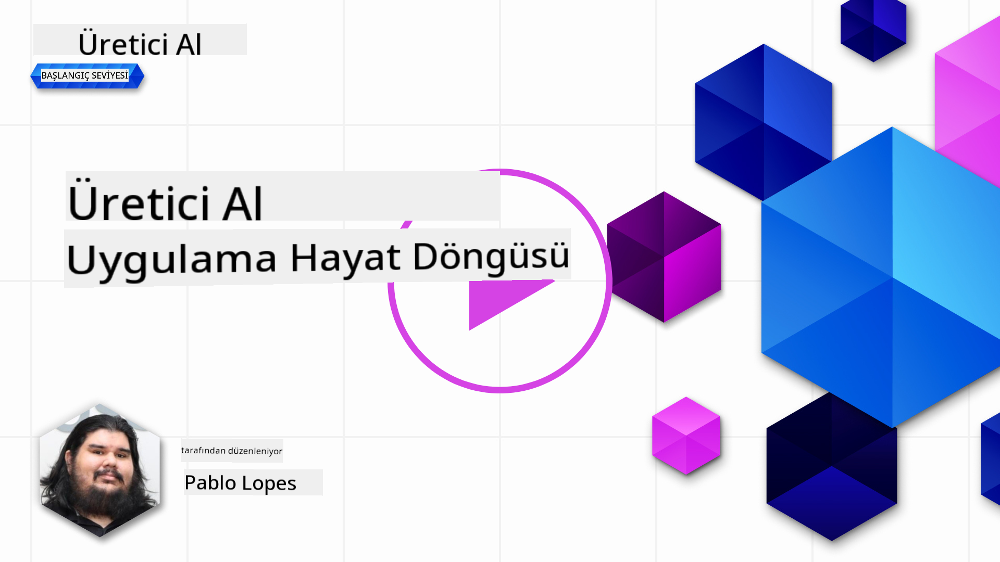
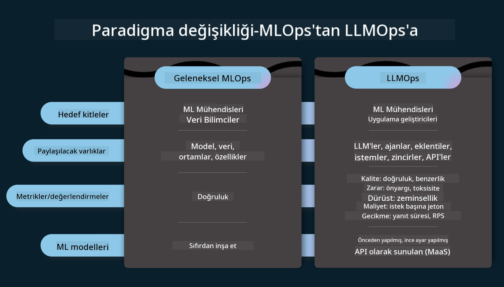
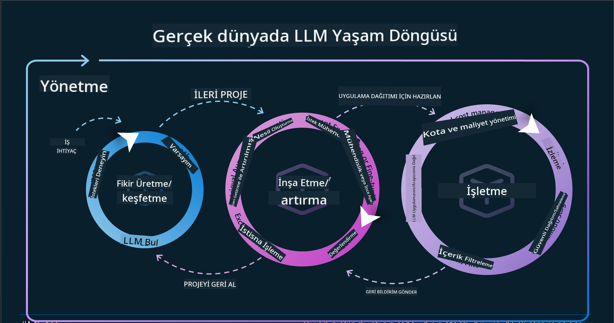
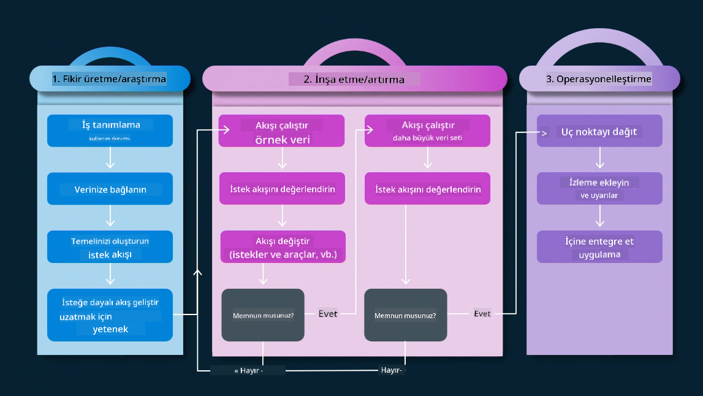
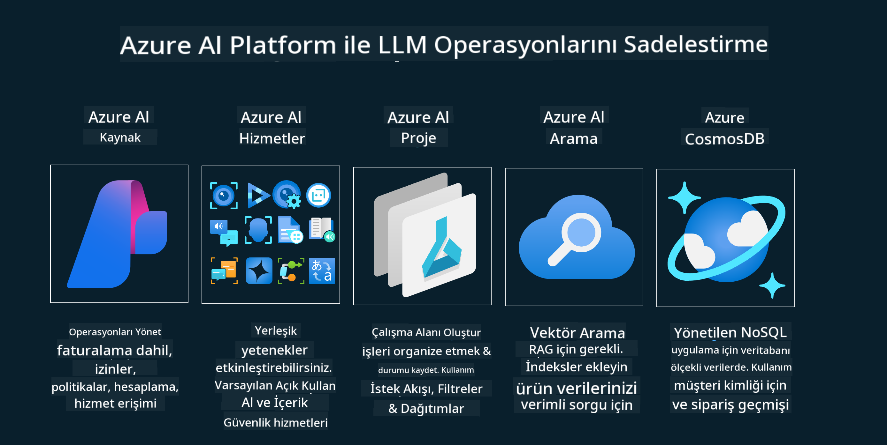
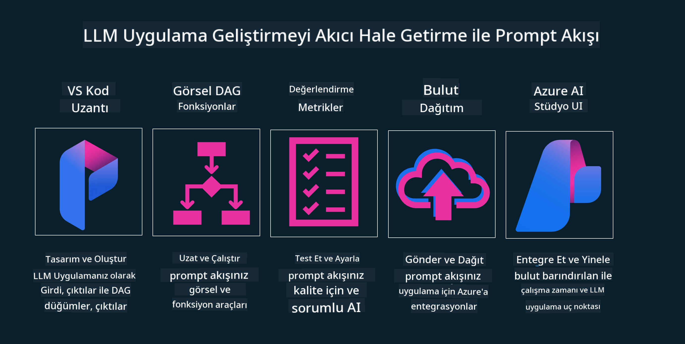

<!--
CO_OP_TRANSLATOR_METADATA:
{
  "original_hash": "27a5347a5022d5ef0a72ab029b03526a",
  "translation_date": "2025-06-25T22:03:08+00:00",
  "source_file": "14-the-generative-ai-application-lifecycle/README.md",
  "language_code": "tr"
}
-->

# Üretken Yapay Zeka Uygulama Yaşam Döngüsü

Tüm yapay zeka uygulamaları için önemli bir soru, yapay zeka özelliklerinin güncelliğidir. Yapay zeka hızla gelişen bir alan olduğu için, uygulamanızın güncel, güvenilir ve sağlam kalmasını sağlamak amacıyla sürekli olarak izlemeli, değerlendirmeli ve iyileştirmelisiniz. İşte burada üretken yapay zeka yaşam döngüsü devreye giriyor.

Üretken yapay zeka yaşam döngüsü, bir üretken yapay zeka uygulaması geliştirirken, dağıtırken ve bakımını yaparken size rehberlik eden bir çerçevedir. Hedeflerinizi tanımlamanıza, performansınızı ölçmenize, zorluklarınızı belirlemenize ve çözümlerinizi uygulamanıza yardımcı olur. Ayrıca uygulamanızı, alanınızın ve paydaşlarınızın etik ve yasal standartlarına uygun hale getirmenizi sağlar. Üretken yapay zeka yaşam döngüsünü takip ederek, uygulamanızın sürekli olarak değer sunmasını ve kullanıcılarınızı memnun etmesini sağlayabilirsiniz.

## Giriş

Bu bölümde:

- MLOps'tan LLMOps'a Paradigma Değişimini Anlayın
- LLM Yaşam Döngüsü
- Yaşam Döngüsü Araçları
- Yaşam Döngüsü Ölçümleme ve Değerlendirme

## MLOps'tan LLMOps'a Paradigma Değişimini Anlayın

LLM'ler, Yapay Zeka cephaneliğinde yeni bir araçtır. Uygulamalar için analiz ve üretim görevlerinde son derece güçlüdürler, ancak bu güç, yapay zeka ve klasik makine öğrenimi görevlerini nasıl optimize ettiğimiz konusunda bazı sonuçlar doğurur.

Bu nedenle, bu aracı dinamik bir şekilde uyarlamak için doğru teşviklerle yeni bir paradigma gereklidir. Daha eski yapay zeka uygulamalarını "ML Uygulamaları" ve daha yeni yapay zeka uygulamalarını "GenAI Uygulamaları" veya sadece "AI Uygulamaları" olarak kategorize edebiliriz, bu da o dönemde kullanılan yaygın teknoloji ve teknikleri yansıtır. Bu, anlatımımızı birçok yönden değiştirir, aşağıdaki karşılaştırmaya bakın.

LLMOps'ta, uygulama geliştiricilere daha fazla odaklandığımızı, entegrasyonları anahtar nokta olarak kullandığımızı, "Model-as-a-Service" kullanarak ve metrikler için aşağıdaki noktaları düşündüğümüzü fark edin.

- Kalite: Yanıt kalitesi
- Zarar: Sorumlu yapay zeka
- Dürüstlük: Yanıtın temellendirilmesi (Mantıklı mı? Doğru mu?)
- Maliyet: Çözüm bütçesi
- Gecikme: Token yanıtı için ortalama süre

## LLM Yaşam Döngüsü

Öncelikle, yaşam döngüsünü ve değişiklikleri anlamak için bir sonraki infografiğe dikkat edelim.

Gördüğünüz gibi, bu MLOps'tan alıştığımız yaşam döngülerinden farklıdır. LLM'ler, Prompting, kaliteyi artırmak için farklı teknikler (Fine-Tuning, RAG, Meta-Prompts), sorumlu yapay zeka ile farklı değerlendirme ve sorumluluk, son olarak yeni değerlendirme metrikleri (Kalite, Zarar, Dürüstlük, Maliyet ve Gecikme) gibi birçok yeni gereksinime sahiptir.

Örneğin, nasıl fikir geliştirdiğimize bakın. Hipotezlerinin doğru olup olmadığını test etmek için çeşitli LLM'lerle deney yapmak amacıyla prompt mühendisliğini kullanarak olasılıkları keşfetmek.

Bu süreç lineer değil, entegre döngüler, yinelemeli ve genel bir döngü ile.

Bu adımları nasıl keşfedebiliriz? Bir yaşam döngüsü nasıl oluşturabileceğimize detaylı bir şekilde bakalım.

Bu biraz karmaşık görünebilir, önce üç büyük adıma odaklanalım.

1. Fikir Geliştirme/Keşfetme: Keşif, burada iş ihtiyaçlarımıza göre keşif yapabiliriz. Prototipleme, bir [PromptFlow](https://microsoft.github.io/promptflow/index.html?WT.mc_id=academic-105485-koreyst) oluşturma ve hipotezimiz için yeterince verimli olup olmadığını test etme.
2. İnşa Etme/Artırma: Uygulama, şimdi daha büyük veri setleri için değerlendirme yapmaya başlıyoruz, çözümümüzün sağlamlığını kontrol etmek için Fine-tuning ve RAG gibi teknikler uyguluyoruz. Eğer sağlam değilse, akışımıza yeni adımlar eklemek veya verileri yeniden yapılandırmak yardımcı olabilir. Akışımızı ve ölçeğimizi test ettikten sonra, çalışıyorsa ve metriklerimizi kontrol ediyorsak, bir sonraki adıma hazırdır.
3. İşletme: Entegrasyon, şimdi sistemimize izleme ve uyarı sistemleri eklemek, dağıtım ve uygulama entegrasyonu eklemek.

Sonrasında, güvenlik, uyumluluk ve yönetişime odaklanan genel bir yönetim döngüsü vardır.

Tebrikler, artık yapay zeka uygulamanız kullanıma hazır ve çalışır durumda. Uygulamalı bir deneyim için [Contoso Chat Demo'ya](https://nitya.github.io/contoso-chat/?WT.mc_id=academic-105485-koreys) göz atın.

Şimdi hangi araçları kullanabiliriz?

## Yaşam Döngüsü Araçları

Araçlar için Microsoft, [Azure AI Platformu](https://azure.microsoft.com/solutions/ai/?WT.mc_id=academic-105485-koreys) ve [PromptFlow](https://microsoft.github.io/promptflow/index.html?WT.mc_id=academic-105485-koreyst) sağlar, bu da döngünüzü kolayca uygulamanızı ve hazır hale getirmenizi sağlar.

[Azure AI Platformu](https://azure.microsoft.com/solutions/ai/?WT.mc_id=academic-105485-koreys), [AI Studio](https://ai.azure.com/?WT.mc_id=academic-105485-koreys) kullanmanıza olanak tanır. AI Studio, modelleri, örnekleri ve araçları keşfetmenize olanak tanıyan bir web portalıdır. Kaynaklarınızı yönetmek, UI geliştirme akışları ve Code-First geliştirme için SDK/CLI seçenekleri sunar.

Azure AI, operasyonlarınızı, hizmetlerinizi, projelerinizi, vektör aramanızı ve veritabanı ihtiyaçlarınızı yönetmek için birçok kaynak kullanmanıza olanak tanır.

PromptFlow ile Kavram Kanıtından (POC) büyük ölçekli uygulamalara kadar inşa edin:

- VS Code'dan görsel ve işlevsel araçlarla uygulamalar tasarlayın ve inşa edin
- Uygulamalarınızı kaliteli yapay zeka için kolayca test edin ve ince ayar yapın.
- Azure AI Studio'yu kullanarak bulutla entegre edin ve yineleyin, hızlı entegrasyon için push ve dağıtım yapın.

## Harika! Öğrenmeye Devam Edin!

Harika, şimdi [Contoso Chat Uygulaması](https://nitya.github.io/contoso-chat/?WT.mc_id=academic-105485-koreyst) ile kavramları nasıl kullanacağımızı öğrenin, bu kavramların bulut savunuculuğunda nasıl gösterildiğini kontrol edin. Daha fazla içerik için [Ignite breakout oturumuna](https://www.youtube.com/watch?v=DdOylyrTOWg) göz atın!

Şimdi, Üretim Artırılmış Nesil ve Vektör Veritabanlarının Üretken Yapay Zekayı nasıl etkilediğini ve daha ilgi çekici uygulamalar yapmayı anlamak için 15. Derse göz atın!

**Feragatname**:  
Bu belge, AI çeviri hizmeti [Co-op Translator](https://github.com/Azure/co-op-translator) kullanılarak çevrilmiştir. Doğruluk için çaba göstersek de, otomatik çevirilerin hata veya yanlışlık içerebileceğini lütfen unutmayın. Orijinal belgenin kendi dilindeki versiyonu yetkili kaynak olarak kabul edilmelidir. Kritik bilgiler için, profesyonel insan çevirisi önerilir. Bu çevirinin kullanımından kaynaklanan herhangi bir yanlış anlama veya yanlış yorumlamadan sorumlu değiliz.