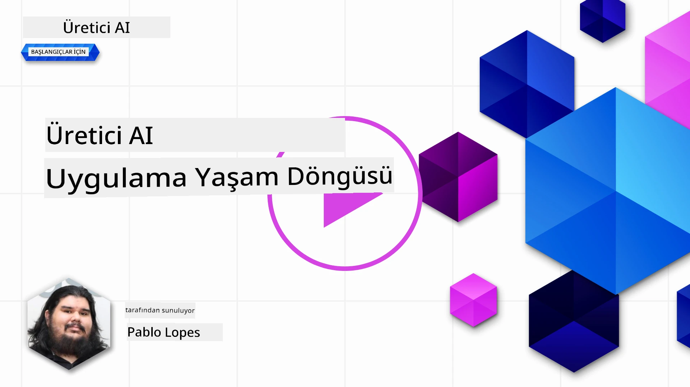
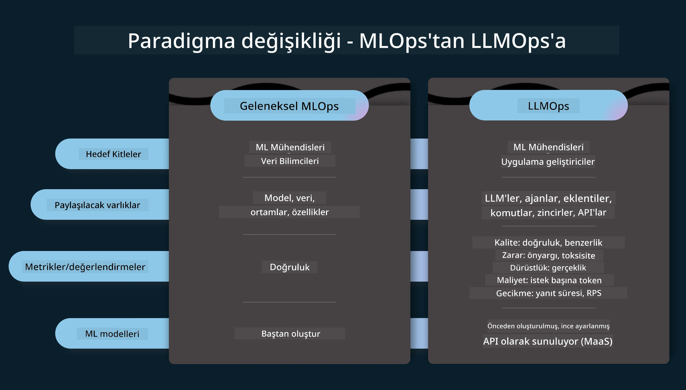
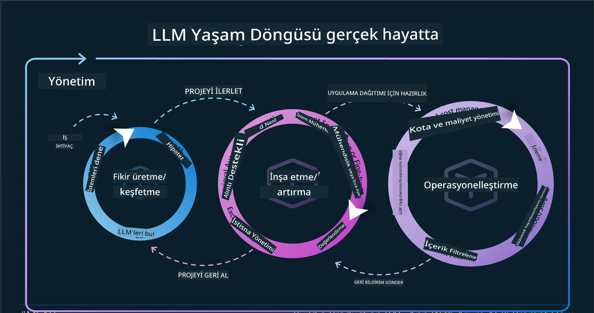
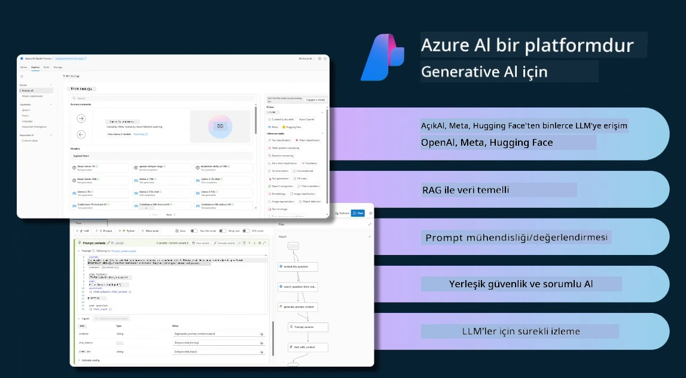
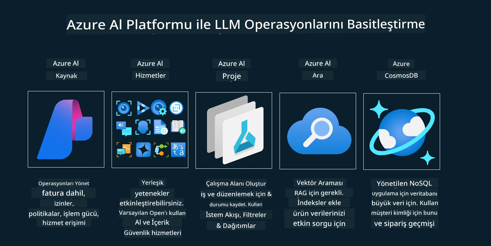
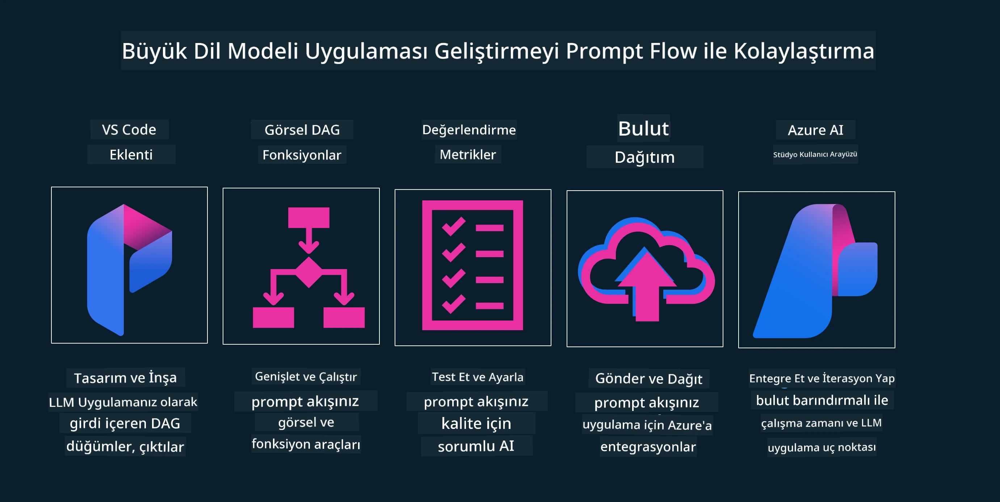

# Jeneratif Yapay Zeka Uygulama Yaşam Döngüsü

Tüm yapay zeka uygulamaları için önemli bir soru, yapay zekanın hızla gelişen bir alan olması nedeniyle yapay zeka özelliklerinin alaka düzeyidir; uygulamanızın alakalı, güvenilir ve sağlam kalmasını sağlamak için onu sürekli olarak izlemeniz, değerlendirmeniz ve geliştirmeniz gerekir. İşte burada jeneratif yapay zeka yaşam döngüsü devreye girer.

Jeneratif yapay zeka yaşam döngüsü, jeneratif bir yapay zeka uygulaması geliştirirken, dağıtırken ve sürdürürken size rehberlik eden bir çerçevedir. Hedeflerinizi tanımlamanıza, performansınızı ölçmenize, zorluklarınızı belirlemenize ve çözümlerinizi uygulamanıza yardımcı olur. Ayrıca uygulamanızın alanınızın etik ve yasal standartlarıyla ve paydaşlarınızla uyumlu olmasını sağlar. Jeneratif yapay zeka yaşam döngüsünü takip ederek, uygulamanızın her zaman değer sağladığından ve kullanıcılarınızı memnun ettiğinden emin olabilirsiniz.

## Giriş

Bu bölümde:

- MLOps'tan LLMOps'a Paradigma Kaymasını Anlayacaksınız
- LLM Yaşam Döngüsünü
- Yaşam Döngüsü Araçlarını
- Yaşam Döngüsü Ölçütlendirmesi ve Değerlendirmesini

öğreneceksiniz.

## MLOps'tan LLMOps'a Paradigma Kaymasını Anlayın

LLM’ler (Büyük Dil Modelleri) yapay zeka cephanesinde yeni bir araçtır, uygulamalar için analiz ve üretim görevlerinde son derece güçlüdürler, ancak bu güç AI ve Klasik Makine Öğrenimi görevlerinde süreçlerimizi nasıl kolaylaştırdığımız konusunda bazı sonuçlar doğurur.

Bununla birlikte, bu aracı dinamik bir şekilde, doğru teşviklerle uyarlamak için yeni bir Paradigmaya ihtiyacımız var. Eski yapay zeka uygulamalarını "ML Uygulamaları" olarak, yeni yapay zeka uygulamalarını ise "GenAI Uygulamaları" veya sadece "AI Uygulamaları" olarak kategorize edebiliriz; bu, o zamanki yaygın teknoloji ve teknikleri yansıtır. Bu anlatımızı birçok yönden değiştirir, aşağıdaki karşılaştırmaya bakın.

LLMOps'ta, uygulama geliştiricilere daha fazla odaklandığımızı, entegrasyonları anahtar bir nokta olarak kullandığımızı, "Hizmet Olarak Modeller" kullandığımızı ve ölçütler için aşağıdaki noktaları düşündüğümüzü fark edin.

- Kalite: Yanıt kalitesi
- Zarar: Sorumlu Yapay Zeka
- Dürüstlük: Yanıtın temelliliği (Mantıklı mı? Doğru mu?)
- Maliyet: Çözüm Bütçesi
- Gecikme: Ortalama token yanıt süresi

## LLM Yaşam Döngüsü

Öncelikle, yaşam döngüsünü ve değişiklikleri anlamak için aşağıdaki infografiğe bakalım.

Dikkat edileceği üzere, bu, MLOps’tan alışık olunan yaşam döngülerinden farklıdır. LLM’lerin çok sayıda yeni gereksinimi vardır; Örnekleme, kaliteyi artırmak için farklı teknikler (İnce Ayar, RAG, Meta-Prompts), sorumlu yapay zeka ile farklı değerlendirme ve sorumluluk, son olarak yeni değerlendirme ölçütleri (Kalite, Zarar, Dürüstlük, Maliyet ve Gecikme).

Örneğin, nasıl fikir ürettiğimize bir bakın. Hipotezlerinin doğru olup olmadığını test etmek için çeşitli LLM’lerle deney yapmak üzere prompt mühendisliğini kullanıyoruz.

Not edin ki bu doğrusal değil, entegre döngüler halinde, iteratif ve kapsamlı bir döngüdür.

Bu adımları nasıl keşfedebiliriz? Bir yaşam döngüsü nasıl oluşturabileceğimize detaylı bakalım.

Bu biraz karmaşık görünebilir, önce üç büyük adıma odaklanalım.

1. Fikir Üretme/Keşif: Keşif burada iş ihtiyaçlarımıza göre keşif yapabiliyoruz. Prototipleme, bir [PromptFlow](https://microsoft.github.io/promptflow/index.html?WT.mc_id=academic-105485-koreyst) oluşturma ve hipotezimiz için yeterince verimli olup olmadığını test etme.
1. İnşa Etme/Geliştirme: Uygulama, şimdi daha büyük veri kümeleri için değerlendirmeye başlıyoruz, ince ayar ve RAG gibi teknikleri uygulatıyoruz, çözümümüzün sağlamlığını kontrol ediyoruz. Eğer sağlam değilse, akışımızda yeni adımlar ekleyerek veya verileri yeniden yapılandırarak yeniden uygulamak işe yarayabilir. Akışımızı ve ölçeğimizi test ettikten ve ölçütlerimizi kontrol ettikten sonra, bir sonraki adıma hazırdır.
1. Operasyonel Hale Getirme: Entegrasyon, artık sistemimize İzleme ve Uyarı Sistemleri ekleme, uygulamayı dağıtma ve uygulama entegrasyonu.

Sonra, güvenlik, uyumluluk ve yönetişime odaklanan kapsamlı Yönetim döngümüz var.

Tebrikler, artık yapay zeka uygulamanız hazır ve operasyonel. Pratik bir deneyim için, [Contoso Sohbet Demo](https://nitya.github.io/contoso-chat/?WT.mc_id=academic-105485-koreyst)’a bir göz atın.

Şimdi hangi araçları kullanabiliriz?

## Yaşam Döngüsü Araçları

Araçlar için, Microsoft [Azure AI Platformu](https://azure.microsoft.com/solutions/ai/?WT.mc_id=academic-105485-koreyst) ve [PromptFlow](https://microsoft.github.io/promptflow/index.html?WT.mc_id=academic-105485-koreyst), döngünüzü kolayca uygulamanıza ve kullanıma hazır hale getirmenize olanak sağlar.

[Azure AI Platformu](https://azure.microsoft.com/solutions/ai/?WT.mc_id=academic-105485-koreyst), [AI Studio](https://ai.azure.com/?WT.mc_id=academic-105485-koreyst) kullanmanıza imkan verir. AI Studio, modelleri, örnekleri ve araçları keşfetmenize olanak tanıyan bir web portalıdır. Kaynaklarınızı yönetme, kullanıcı arayüzü geliştirme akışları ve Kod-Öncelikli geliştirme için SDK/CLI seçenekleri mevcuttur.

Azure AI, operasyonlarınızı, hizmetlerinizi, projelerinizi, vektör arama ve veritabanı ihtiyaçlarınızı yönetmek için birden fazla kaynak kullanmanıza olanak verir.

Proof-of-Concept (POC) aşamasından büyük ölçekli uygulamalara kadar PromptFlow ile şunları yapabilirsiniz:

- VS Code’dan görsel ve fonksiyonel araçlarla uygulamalar tasarlayın ve oluşturun
- Uygulamalarınızı kalite yapay zekası için kolayca test edin ve ince ayar yapın
- Azure AI Studio’yu kullanarak bulut ile entegre edin, hızlı entegrasyon için Push ve Deploy yapın ve yineleyin

## Harika! Öğrenmeye Devam Edin!

Müthiş, şimdi [Contoso Sohbet Uygulaması](https://nitya.github.io/contoso-chat/?WT.mc_id=academic-105485-koreyst) ile kavramları kullanarak uygulamanın nasıl yapılandırıldığını öğrenin, Bulut Savunuculuğunun bu kavramları gösterimlerde nasıl eklediğini görün. Daha fazla içerik için [Ignite breakout oturumumuzu](https://www.youtube.com/watch?v=DdOylyrTOWg) izleyin!

Şimdi, Jeneratif Yapay Zeka’ya Etkisini ve daha etkileşimli uygulamalar yapmayı anlamak için [Retrieval Augmented Generation ve Vektör Veritabanlarını](../15-rag-and-vector-databases/README.md?WT.mc_id=academic-105485-koreyst) içeren 15. Derse göz atın!

---

<!-- CO-OP TRANSLATOR DISCLAIMER START -->
**Feragatname**:
Bu belge, AI çeviri servisi [Co-op Translator](https://github.com/Azure/co-op-translator) kullanılarak çevrilmiştir. Doğruluk için çaba sarf etsek de, otomatik çevirilerin hatalar veya yanlışlıklar içerebileceğini lütfen unutmayınız. Asıl belge, orijinal dilinde yetkili kaynak olarak kabul edilmelidir. Kritik bilgiler için profesyonel insan çevirisi önerilir. Bu çevirinin kullanımından kaynaklanabilecek yanlış anlamalar veya yanlış yorumlamalar konusunda sorumluluk kabul edilmemektedir.
<!-- CO-OP TRANSLATOR DISCLAIMER END -->