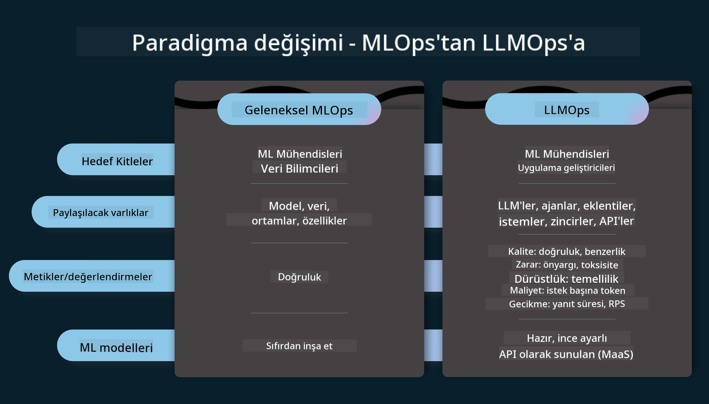

<!--
CO_OP_TRANSLATOR_METADATA:
{
  "original_hash": "27a5347a5022d5ef0a72ab029b03526a",
  "translation_date": "2025-07-09T15:53:12+00:00",
  "source_file": "14-the-generative-ai-application-lifecycle/README.md",
  "language_code": "tr"
}
-->

# Üretken Yapay Zeka Uygulama Yaşam Döngüsü

Tüm yapay zeka uygulamaları için önemli bir soru, yapay zeka özelliklerinin güncelliğidir. Yapay zeka hızla gelişen bir alan olduğundan, uygulamanızın güncel, güvenilir ve sağlam kalmasını sağlamak için sürekli izlemeli, değerlendirmeli ve geliştirmelisiniz. İşte burada üretken yapay zeka yaşam döngüsü devreye girer.

Üretken yapay zeka yaşam döngüsü, üretken yapay zeka uygulaması geliştirirken, dağıtırken ve sürdürürken size rehberlik eden bir çerçevedir. Hedeflerinizi tanımlamanıza, performansınızı ölçmenize, zorluklarınızı belirlemenize ve çözümlerinizi uygulamanıza yardımcı olur. Ayrıca uygulamanızı, alanınızdaki etik ve yasal standartlar ile paydaşlarınızın beklentileriyle uyumlu hale getirmenizi sağlar. Üretken yapay zeka yaşam döngüsünü takip ederek, uygulamanızın her zaman değer sunmasını ve kullanıcılarınızı memnun etmesini sağlayabilirsiniz.

## Giriş

Bu bölümde:

- MLOps'tan LLMOps'a Paradigma Değişimini Anlayacaksınız
- LLM Yaşam Döngüsü
- Yaşam Döngüsü Araçları
- Yaşam Döngüsü Ölçümleme ve Değerlendirme

## MLOps'tan LLMOps'a Paradigma Değişimini Anlayın

LLM'ler, Yapay Zeka cephesinde yeni bir araçtır; uygulamalar için analiz ve üretim görevlerinde inanılmaz derecede güçlüdürler. Ancak bu güç, yapay zeka ve klasik makine öğrenimi görevlerini nasıl düzenlediğimiz konusunda bazı sonuçlar doğurur.

Bununla birlikte, bu aracı dinamik bir şekilde ve doğru teşviklerle adapte etmek için yeni bir paradigma gereklidir. Eski yapay zeka uygulamalarını "ML Uygulamaları", yeni yapay zeka uygulamalarını ise "GenAI Uygulamaları" veya sadece "AI Uygulamaları" olarak kategorize edebiliriz; bu, o dönemde kullanılan ana teknoloji ve teknikleri yansıtır. Bu, anlatımızı birçok açıdan değiştirir, aşağıdaki karşılaştırmaya bakın.

LLMOps'ta, uygulama geliştiricilere daha fazla odaklandığımızı, entegrasyonları anahtar nokta olarak kullandığımızı, "Hizmet Olarak Modeller" yaklaşımını benimsediğimizi ve metrikler için aşağıdaki noktalara önem verdiğimizi fark edin.

- Kalite: Yanıt kalitesi
- Zarar: Sorumlu Yapay Zeka
- Dürüstlük: Yanıtın dayanaklılığı (Mantıklı mı? Doğru mu?)
- Maliyet: Çözüm Bütçesi
- Gecikme: Token yanıtı için ortalama süre

## LLM Yaşam Döngüsü

Öncelikle yaşam döngüsünü ve yapılan değişiklikleri anlamak için aşağıdaki infografiğe bakalım.

Gördüğünüz gibi, bu MLOps'tan alışık olduğumuz yaşam döngülerinden farklıdır. LLM'lerin birçok yeni gereksinimi vardır; Prompting, kaliteyi artırmak için farklı teknikler (Fine-Tuning, RAG, Meta-Prompts), sorumlu yapay zeka ile farklı değerlendirme ve sorumluluklar, son olarak yeni değerlendirme metrikleri (Kalite, Zarar, Dürüstlük, Maliyet ve Gecikme).

Örneğin, nasıl fikir ürettiğimize bakalım. Hipotezlerinin doğru olup olmadığını test etmek için çeşitli LLM'lerle denemeler yapmak amacıyla prompt mühendisliği kullanıyoruz.

Bunun doğrusal değil, entegre döngüler, yinelemeli ve genel bir döngü olduğunu unutmayın.

Bu adımları nasıl keşfedebiliriz? Bir yaşam döngüsünü nasıl oluşturabileceğimize ayrıntılı bakalım.

Bu biraz karmaşık görünebilir, önce üç büyük adıma odaklanalım.

1. Fikir Üretme/Keşfetme: Keşif aşaması, burada iş ihtiyaçlarımıza göre keşif yapabiliriz. Prototip oluşturma, bir [PromptFlow](https://microsoft.github.io/promptflow/index.html?WT.mc_id=academic-105485-koreyst) yaratma ve Hipotezimizin yeterince verimli olup olmadığını test etme.
1. İnşa Etme/Geliştirme: Uygulama aşaması, şimdi daha büyük veri setleri için değerlendirmeye başlıyoruz, Fine-tuning ve RAG gibi teknikleri uygulayarak çözümümüzün sağlamlığını kontrol ediyoruz. Eğer sağlam değilse, akışımıza yeni adımlar eklemek veya veriyi yeniden yapılandırmak yardımcı olabilir. Akışımızı ve ölçeğimizi test ettikten sonra, eğer çalışıyorsa ve metriklerimizi kontrol ettiysek, bir sonraki adıma hazırdır.
1. Operasyonel Hale Getirme: Entegrasyon aşaması, şimdi sistemimize İzleme ve Uyarı Sistemleri ekliyoruz, dağıtım ve uygulama entegrasyonunu gerçekleştiriyoruz.

Bunun ardından, güvenlik, uyumluluk ve yönetişime odaklanan genel bir Yönetim döngüsü vardır.

Tebrikler, artık yapay zeka uygulamanız kullanıma hazır ve operasyonel. Pratik bir deneyim için [Contoso Chat Demo](https://nitya.github.io/contoso-chat/?WT.mc_id=academic-105485-koreys)'a göz atabilirsiniz.

Peki, hangi araçları kullanabiliriz?

## Yaşam Döngüsü Araçları

Araçlar için Microsoft, [Azure AI Platformu](https://azure.microsoft.com/solutions/ai/?WT.mc_id=academic-105485-koreys) ve [PromptFlow](https://microsoft.github.io/promptflow/index.html?WT.mc_id=academic-105485-koreyst) ile döngünüzü kolayca uygulamanızı ve hazır hale getirmenizi sağlar.

[Azure AI Platformu](https://azure.microsoft.com/solutions/ai/?WT.mc_id=academic-105485-koreys), [AI Studio](https://ai.azure.com/?WT.mc_id=academic-105485-koreys) kullanmanıza olanak tanır. AI Studio, modelleri, örnekleri ve araçları keşfetmenizi sağlayan bir web portalıdır. Kaynaklarınızı yönetir, kullanıcı arayüzü geliştirme akışları ve Kod-Öncelikli geliştirme için SDK/CLI seçenekleri sunar.

Azure AI, operasyonlarınızı, servislerinizi, projelerinizi, vektör arama ve veritabanı ihtiyaçlarınızı yönetmek için birden fazla kaynak kullanmanıza olanak tanır.

Proof-of-Concept(POC)’ten büyük ölçekli uygulamalara kadar PromptFlow ile:

- VS Code’dan görsel ve fonksiyonel araçlarla uygulamalar tasarlayın ve oluşturun
- Uygulamalarınızı kolayca test edin ve kaliteli yapay zeka için ince ayar yapın
- Azure AI Studio’yu kullanarak bulut ile entegrasyon ve yineleme yapın, hızlı entegrasyon için Push ve Deploy işlemlerini gerçekleştirin

## Harika! Öğrenmeye Devam Edin!

Mükemmel, şimdi kavramları kullanarak bir uygulamayı nasıl yapılandırdığımızı öğrenmek için [Contoso Chat App](https://nitya.github.io/contoso-chat/?WT.mc_id=academic-105485-koreyst)’e göz atın; Cloud Advocacy’nin bu kavramları gösterimlerde nasıl eklediğini inceleyin. Daha fazla içerik için [Ignite breakout oturumumuzu](https://www.youtube.com/watch?v=DdOylyrTOWg) izleyebilirsiniz.

Şimdi, Üretken Yapay Zeka’yı nasıl etkilediğini ve daha etkileyici uygulamalar oluşturmayı anlamak için [Retrieval Augmented Generation ve Vektör Veritabanları](../15-rag-and-vector-databases/README.md?WT.mc_id=academic-105485-koreyst) konusunu inceleyin!

**Feragatname**:  
Bu belge, AI çeviri servisi [Co-op Translator](https://github.com/Azure/co-op-translator) kullanılarak çevrilmiştir. Doğruluk için çaba göstersek de, otomatik çevirilerin hatalar veya yanlışlıklar içerebileceğini lütfen unutmayın. Orijinal belge, kendi dilinde yetkili kaynak olarak kabul edilmelidir. Kritik bilgiler için profesyonel insan çevirisi önerilir. Bu çevirinin kullanımı sonucu ortaya çıkabilecek yanlış anlamalar veya yorum hatalarından sorumlu değiliz.