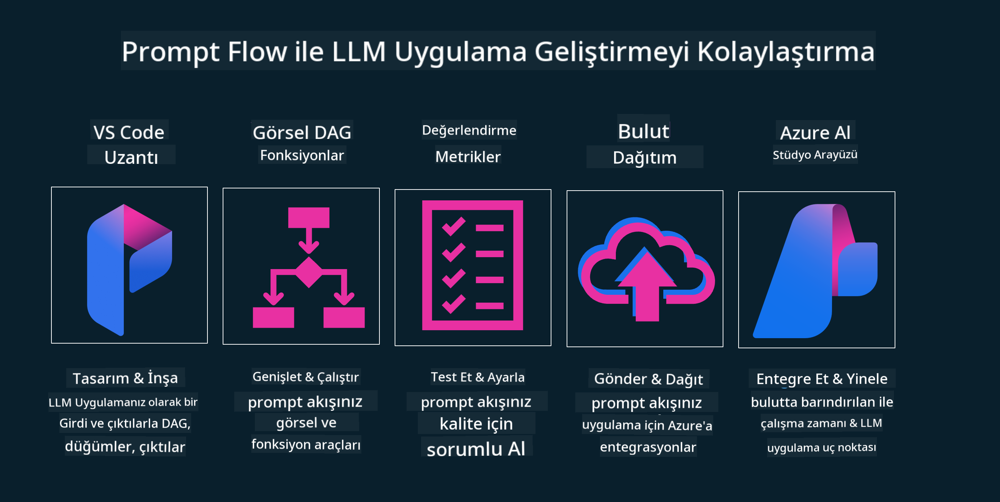

<!--
CO_OP_TRANSLATOR_METADATA:
{
  "original_hash": "b9d32511b27373a1b21b5789d4fda057",
  "translation_date": "2025-10-17T16:21:25+00:00",
  "source_file": "14-the-generative-ai-application-lifecycle/README.md",
  "language_code": "tr"
}
-->

# Üretken Yapay Zeka Uygulama Yaşam Döngüsü

Tüm yapay zeka uygulamaları için önemli bir soru, yapay zeka özelliklerinin geçerliliğidir. Yapay zeka hızla gelişen bir alan olduğundan, uygulamanızın geçerliliğini, güvenilirliğini ve sağlamlığını korumak için sürekli olarak izlemeli, değerlendirmeli ve iyileştirmelisiniz. İşte bu noktada üretken yapay zeka yaşam döngüsü devreye giriyor.

Üretken yapay zeka yaşam döngüsü, bir üretken yapay zeka uygulamasını geliştirme, dağıtma ve sürdürme aşamalarında size rehberlik eden bir çerçevedir. Hedeflerinizi tanımlamanıza, performansınızı ölçmenize, zorluklarınızı belirlemenize ve çözümlerinizi uygulamanıza yardımcı olur. Ayrıca uygulamanızın alanınızın ve paydaşlarınızın etik ve yasal standartlarıyla uyumlu olmasını sağlar. Üretken yapay zeka yaşam döngüsünü takip ederek, uygulamanızın her zaman değer sunmasını ve kullanıcılarınızı memnun etmesini sağlayabilirsiniz.

## Giriş

Bu bölümde şunları öğreneceksiniz:

- MLOps'tan LLMOps'a Paradigma Değişimini Anlamak
- LLM Yaşam Döngüsü
- Yaşam Döngüsü Araçları
- Yaşam Döngüsü Ölçümleme ve Değerlendirme

## MLOps'tan LLMOps'a Paradigma Değişimini Anlamak

LLM'ler, yapay zeka araçları arasında yeni bir araçtır. Uygulamalar için analiz ve üretim görevlerinde son derece güçlüdürler, ancak bu güç, yapay zeka ve klasik makine öğrenimi görevlerini nasıl düzenlediğimiz konusunda bazı sonuçlar doğurur.

Bu nedenle, bu aracı dinamik bir şekilde ve doğru teşviklerle uyarlamak için yeni bir paradigma gereklidir. Eski yapay zeka uygulamalarını "ML Uygulamaları" ve yeni yapay zeka uygulamalarını "GenAI Uygulamaları" veya sadece "AI Uygulamaları" olarak kategorize edebiliriz. Bu, o dönemde kullanılan ana teknoloji ve teknikleri yansıtır. Bu, anlatımızı birçok yönden değiştirir. Aşağıdaki karşılaştırmaya bir göz atın.

LLMOps'ta, uygulama geliştiricilere daha fazla odaklandığımızı, entegrasyonları bir anahtar nokta olarak kullandığımızı, "Hizmet Olarak Modeller" kullandığımızı ve metrikler için aşağıdaki noktalarda düşündüğümüzü fark edin:

- Kalite: Yanıt kalitesi
- Zarar: Sorumlu yapay zeka
- Dürüstlük: Yanıtın temellendirilmesi (Mantıklı mı? Doğru mu?)
- Maliyet: Çözüm bütçesi
- Gecikme: Token yanıtı için ortalama süre

## LLM Yaşam Döngüsü

Öncelikle, yaşam döngüsünü ve değişiklikleri anlamak için aşağıdaki infografiğe bir göz atalım.

Gördüğünüz gibi, bu MLOps'tan alışılmış yaşam döngülerinden farklıdır. LLM'lerin birçok yeni gereksinimi vardır, örneğin Prompting, kaliteyi artırmak için farklı teknikler (Fine-Tuning, RAG, Meta-Prompts), sorumlu yapay zeka ile farklı değerlendirme ve sorumluluk, son olarak yeni değerlendirme metrikleri (Kalite, Zarar, Dürüstlük, Maliyet ve Gecikme).

Örneğin, nasıl fikir ürettiğimize bir göz atın. Hipotezlerinin doğru olup olmadığını test etmek için çeşitli LLM'lerle denemeler yapmak amacıyla prompt mühendisliğini kullanarak olasılıkları keşfetmek.

Bu süreç doğrusal değil, entegre döngüler, yinelemeli ve genel bir döngü ile.

Bu adımları nasıl keşfedebiliriz? Bir yaşam döngüsünü nasıl oluşturabileceğimizi detaylı bir şekilde inceleyelim.

Bu biraz karmaşık görünebilir, önce üç büyük adıma odaklanalım.

1. Fikir Üretme/Keşfetme: Keşif, burada iş ihtiyaçlarımıza göre keşif yapabiliriz. Prototipleme, bir [PromptFlow](https://microsoft.github.io/promptflow/index.html?WT.mc_id=academic-105485-koreyst) oluşturma ve hipotezimiz için yeterince verimli olup olmadığını test etme.
2. İnşa Etme/Geliştirme: Uygulama, şimdi daha büyük veri setlerini değerlendirmeye başlıyoruz, çözümümüzün sağlamlığını kontrol etmek için Fine-tuning ve RAG gibi teknikleri uyguluyoruz. Eğer işe yaramazsa, akışımıza yeni adımlar eklemek veya verileri yeniden yapılandırmak yardımcı olabilir. Akışımızı ve ölçeğimizi test ettikten sonra, işe yarıyorsa ve metriklerimizi kontrol ediyorsak, bir sonraki adıma hazırdır.
3. Operasyonelleştirme: Entegrasyon, şimdi sistemimize İzleme ve Uyarı Sistemleri ekleyerek, uygulama entegrasyonu ve dağıtımını gerçekleştiriyoruz.

Sonrasında, güvenlik, uyumluluk ve yönetişime odaklanan genel bir yönetim döngümüz var.

Tebrikler, artık yapay zeka uygulamanız hazır ve operasyonel. Pratik bir deneyim için [Contoso Chat Demo](https://nitya.github.io/contoso-chat/?WT.mc_id=academic-105485-koreys)'ya göz atabilirsiniz.

Peki, hangi araçları kullanabiliriz?

## Yaşam Döngüsü Araçları

Araçlar için Microsoft, [Azure AI Platform](https://azure.microsoft.com/solutions/ai/?WT.mc_id=academic-105485-koreys) ve [PromptFlow](https://microsoft.github.io/promptflow/index.html?WT.mc_id=academic-105485-koreyst) ile yaşam döngünüzü kolayca uygulamanızı ve hazır hale getirmenizi sağlar.

[Azure AI Platform](https://azure.microsoft.com/solutions/ai/?WT.mc_id=academic-105485-koreys), [AI Studio](https://ai.azure.com/?WT.mc_id=academic-105485-koreys)'yu kullanmanıza olanak tanır. AI Studio, modelleri, örnekleri ve araçları keşfetmenizi sağlayan bir web portalıdır. Kaynaklarınızı yönetmek, UI geliştirme akışlarını ve Kod-Öncelikli geliştirme için SDK/CLI seçeneklerini sunar.

Azure AI, operasyonlarınızı, hizmetlerinizi, projelerinizi, vektör arama ve veri tabanı ihtiyaçlarınızı yönetmek için birden fazla kaynak kullanmanıza olanak tanır.

PromptFlow ile Kavram Kanıtı (POC)'dan büyük ölçekli uygulamalara kadar oluşturun:

- VS Code'dan görsel ve işlevsel araçlarla uygulamalar tasarlayın ve oluşturun.
- Uygulamalarınızı kolayca test edin ve kaliteli yapay zeka için ince ayar yapın.
- Azure AI Studio'yu kullanarak bulutla entegre edin ve yineleyin, hızlı entegrasyon için yayınlayın ve dağıtın.

## Harika! Öğrenmeye Devam Edin!

Harika, şimdi [Contoso Chat App](https://nitya.github.io/contoso-chat/?WT.mc_id=academic-105485-koreyst) ile bu kavramları nasıl yapılandırdığımızı öğrenin ve Cloud Advocacy'nin bu kavramları gösterimlerde nasıl kullandığını kontrol edin. Daha fazla içerik için [Ignite breakout oturumuna](https://www.youtube.com/watch?v=DdOylyrTOWg) göz atın!

Şimdi, Üretken Yapay Zeka ve daha ilgi çekici uygulamalar oluşturmak için [Retrieval Augmented Generation ve Vektör Veri Tabanlarının](../15-rag-and-vector-databases/README.md?WT.mc_id=academic-105485-koreyst) nasıl etkili olduğunu anlamak için 15. Derse göz atın!

---

**Feragatname**:  
Bu belge, AI çeviri hizmeti [Co-op Translator](https://github.com/Azure/co-op-translator) kullanılarak çevrilmiştir. Doğruluk için çaba göstersek de, otomatik çeviriler hata veya yanlışlıklar içerebilir. Belgenin orijinal dili, yetkili kaynak olarak kabul edilmelidir. Kritik bilgiler için profesyonel insan çevirisi önerilir. Bu çevirinin kullanımından kaynaklanan yanlış anlamalar veya yanlış yorumlamalardan sorumlu değiliz.