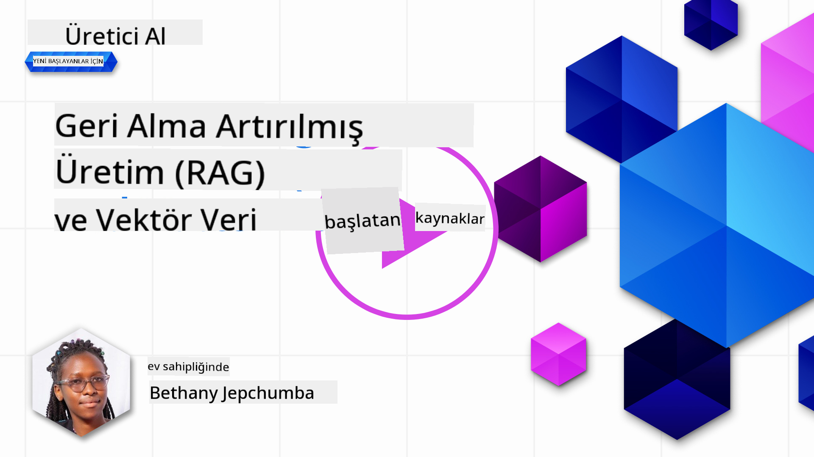
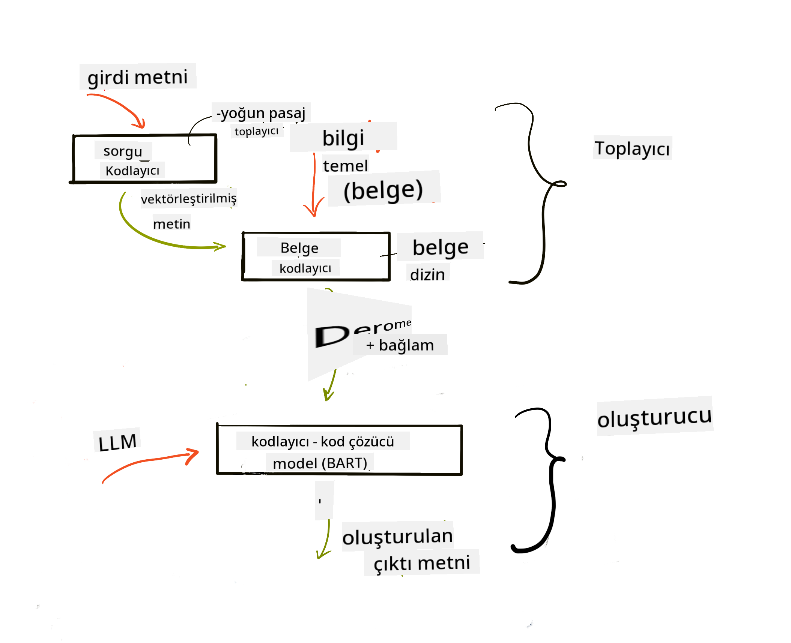
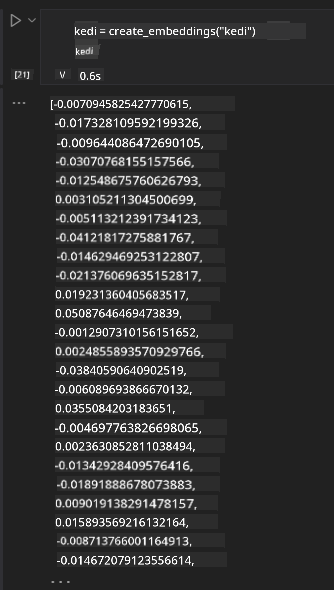

<!--
CO_OP_TRANSLATOR_METADATA:
{
  "original_hash": "e2861bbca91c0567ef32bc77fe054f9e",
  "translation_date": "2025-07-09T16:12:12+00:00",
  "source_file": "15-rag-and-vector-databases/README.md",
  "language_code": "tr"
}
-->
# Retrieval Augmented Generation (RAG) ve Vektör Veritabanları

[](https://aka.ms/gen-ai-lesson15-gh?WT.mc_id=academic-105485-koreyst)

Arama uygulamaları dersinde, kendi verilerinizi Büyük Dil Modellerine (LLM) nasıl entegre edeceğinizi kısaca öğrenmiştik. Bu derste, LLM uygulamanızda verilerinizi temel alma kavramlarına, sürecin işleyişine ve hem gömme (embedding) hem de metin verilerini depolama yöntemlerine daha derinlemesine bakacağız.

> **Video Yakında Gelecek**

## Giriş

Bu derste aşağıdaki konuları ele alacağız:

- RAG’a giriş, ne olduğu ve yapay zekada (AI) neden kullanıldığı.

- Vektör veritabanlarının ne olduğunu anlamak ve uygulamamız için bir tane oluşturmak.

- RAG’ı bir uygulamaya nasıl entegre edeceğimize dair pratik bir örnek.

## Öğrenme Hedefleri

Bu dersi tamamladıktan sonra şunları yapabileceksiniz:

- RAG’ın veri alma ve işleme süreçlerindeki önemini açıklamak.

- RAG uygulamasını kurmak ve verilerinizi bir LLM’e temel almak.

- RAG ve Vektör Veritabanlarının LLM uygulamalarında etkili entegrasyonu.

## Senaryomuz: LLM’lerimizi kendi verilerimizle geliştirmek

Bu derste, eğitim girişimimize kendi notlarımızı eklemek istiyoruz; böylece sohbet botu farklı konular hakkında daha fazla bilgi edinebilecek. Elimizdeki notları kullanarak, öğrenenler daha iyi çalışabilecek ve farklı konuları anlayarak sınavlarına daha kolay hazırlanabilecekler. Senaryomuzu oluşturmak için şunları kullanacağız:

- `Azure OpenAI:` sohbet botumuzu oluşturmak için kullanacağımız LLM

- `AI for beginners' lesson on Neural Networks:` LLM’imizi temel alacağımız veri

- `Azure AI Search` ve `Azure Cosmos DB:` verilerimizi depolamak ve arama dizini oluşturmak için vektör veritabanı

Kullanıcılar notlarından pratik quizler oluşturabilecek, tekrar kartları hazırlayabilecek ve bunları kısa özetlere dönüştürebilecekler. Başlamak için, RAG’ın ne olduğuna ve nasıl çalıştığına bakalım:

## Retrieval Augmented Generation (RAG)

LLM destekli bir sohbet botu, kullanıcıdan gelen girdileri işleyerek yanıtlar üretir. Etkileşimli olacak şekilde tasarlanmıştır ve kullanıcılarla çok çeşitli konularda iletişim kurar. Ancak yanıtları, sağlanan bağlam ve temel eğitim verileriyle sınırlıdır. Örneğin, GPT-4’ün bilgi kesim tarihi Eylül 2021’dir; yani bu tarihten sonraki olaylar hakkında bilgisi yoktur. Ayrıca, LLM’leri eğitmek için kullanılan veriler, kişisel notlar veya bir şirketin ürün kılavuzu gibi gizli bilgileri içermez.

### RAG’lar (Retrieval Augmented Generation) nasıl çalışır


Diyelim ki notlarınızdan quizler oluşturan bir sohbet botu dağıtmak istiyorsunuz, bilgi tabanına bağlantı gerekecek. İşte burada RAG devreye girer. RAG’lar şu şekilde çalışır:

- **Bilgi tabanı:** Geri getirme işleminden önce, bu belgeler alınır ve ön işleme tabi tutulur; genellikle büyük belgeler küçük parçalara bölünür, metin gömme (embedding) haline dönüştürülür ve bir veritabanında saklanır.

- **Kullanıcı Sorgusu:** kullanıcı bir soru sorar

- **Geri Getirme:** Kullanıcı soru sorduğunda, gömme modeli bilgi tabanımızdan ilgili bilgileri alır ve bağlamı artırarak isteme (prompt) dahil edilir.

- **Geliştirilmiş Üretim:** LLM, alınan verilere dayanarak yanıtını geliştirir. Böylece yanıt sadece önceden eğitilmiş verilere değil, eklenen bağlamdan gelen ilgili bilgilere de dayanır. Alınan veriler LLM’nin yanıtlarını zenginleştirmek için kullanılır. LLM ardından kullanıcının sorusuna yanıt verir.



RAG mimarisi, iki bölümden oluşan transformer yapısıyla uygulanır: bir encoder ve bir decoder. Örneğin, kullanıcı bir soru sorduğunda, giriş metni kelimelerin anlamını yakalayan vektörlere 'kodlanır' ve bu vektörler belge dizinimize 'çözülür' ve kullanıcı sorgusuna dayalı yeni metin oluşturulur. LLM, çıktı üretmek için hem encoder-decoder modelini kullanır.

Önerilen makaleye göre RAG uygulamasında iki yaklaşım vardır: [Retrieval-Augmented Generation for Knowledge intensive NLP Tasks](https://arxiv.org/pdf/2005.11401.pdf?WT.mc_id=academic-105485-koreyst):

- **_RAG-Sequence_**: alınan belgeleri kullanarak kullanıcı sorgusuna en iyi cevabı tahmin etmek

- **RAG-Token**: belgeleri kullanarak sonraki token’ı üretmek, ardından kullanıcı sorgusuna yanıt vermek için belgeleri geri getirmek

### Neden RAG kullanmalısınız?

- **Bilgi zenginliği:** metin yanıtlarının güncel ve doğru olmasını sağlar. Böylece, dahili bilgi tabanına erişerek alan bazlı görevlerde performansı artırır.

- **Doğrulanabilir veri** kullanarak uydurmayı azaltır ve kullanıcı sorgularına bağlam sağlar.

- **Maliyet etkin:** LLM’yi ince ayar yapmaya kıyasla daha ekonomiktir.

## Bilgi tabanı oluşturma

Uygulamamız kişisel verilerimize dayanıyor, yani AI For Beginners müfredatındaki Neural Network dersi.

### Vektör Veritabanları

Vektör veritabanı, geleneksel veritabanlarından farklı olarak, gömülü vektörleri depolamak, yönetmek ve aramak için tasarlanmış özel bir veritabanıdır. Belgelerin sayısal temsillerini saklar. Veriyi sayısal gömme haline getirmek, yapay zeka sistemimizin veriyi anlamasını ve işlemesini kolaylaştırır.

Gömme verilerimizi vektör veritabanlarında saklarız çünkü LLM’lerin kabul ettiği token sayısı sınırlıdır. Tüm gömmeleri LLM’ye veremeyeceğimiz için, bunları parçalara bölmemiz gerekir ve kullanıcı soru sorduğunda, soruya en uygun gömmeler istemle birlikte döndürülür. Parçalama ayrıca LLM’ye gönderilen token sayısını azaltarak maliyetleri düşürür.

Popüler vektör veritabanları arasında Azure Cosmos DB, Clarifyai, Pinecone, Chromadb, ScaNN, Qdrant ve DeepLake bulunur. Azure CLI kullanarak Azure Cosmos DB modeli oluşturabilirsiniz:

```bash
az login
az group create -n <resource-group-name> -l <location>
az cosmosdb create -n <cosmos-db-name> -r <resource-group-name>
az cosmosdb list-keys -n <cosmos-db-name> -g <resource-group-name>
```

### Metinden gömme oluşturma

Verilerimizi depolamadan önce, veriyi veritabanına kaydetmeden önce vektör gömme haline dönüştürmemiz gerekir. Büyük belgeler veya uzun metinlerle çalışıyorsanız, beklediğiniz sorgulara göre parçalayabilirsiniz. Parçalama cümle veya paragraf seviyesinde yapılabilir. Parçalama, çevresindeki kelimelerden anlam çıkardığı için, parçaya belge başlığı veya parçadan önce/sonra gelen metin gibi ek bağlamlar ekleyebilirsiniz. Veriyi şu şekilde parçalayabilirsiniz:

```python
def split_text(text, max_length, min_length):
    words = text.split()
    chunks = []
    current_chunk = []

    for word in words:
        current_chunk.append(word)
        if len(' '.join(current_chunk)) < max_length and len(' '.join(current_chunk)) > min_length:
            chunks.append(' '.join(current_chunk))
            current_chunk = []

    # If the last chunk didn't reach the minimum length, add it anyway
    if current_chunk:
        chunks.append(' '.join(current_chunk))

    return chunks
```

Parçalandıktan sonra, metnimizi farklı gömme modelleri kullanarak gömebiliriz. Kullanabileceğiniz bazı modeller: word2vec, OpenAI’nin ada-002 modeli, Azure Computer Vision ve daha fazlası. Kullanılacak model, kullandığınız dil, kodlanan içerik türü (metin/görüntü/ses), kodlayabileceği giriş boyutu ve gömme çıktısının uzunluğuna bağlıdır.

OpenAI’nin `text-embedding-ada-002` modeliyle gömülen bir metin örneği:


## Geri getirme ve Vektör Arama

Kullanıcı bir soru sorduğunda, geri getirme modeli bunu sorgu kodlayıcı ile vektöre dönüştürür, ardından belge arama dizinimizde girişle ilgili vektörleri arar. İşlem tamamlandığında, hem giriş vektörü hem de belge vektörleri metne dönüştürülür ve LLM’ye iletilir.

### Geri getirme

Geri getirme, sistemin arama kriterlerini karşılayan belgeleri dizinden hızlıca bulmaya çalıştığı aşamadır. Geri getirme modelinin amacı, bağlam sağlamak ve LLM’yi verilerinizle temel almaktır.

Veritabanımızda arama yapmak için birkaç yöntem vardır:

- **Anahtar kelime araması** - metin aramaları için kullanılır

- **Anlamsal arama** - kelimelerin anlamsal anlamını kullanır

- **Vektör araması** - belgeleri metinden gömme vektörlerine dönüştürür. Geri getirme, kullanıcı sorusuna en yakın vektörlere sahip belgeler sorgulanarak yapılır.

- **Hibrit** - anahtar kelime ve vektör aramasının birleşimi.

Geri getirmede zorluk, veritabanında sorguya benzer yanıt olmadığında ortaya çıkar; sistem en iyi bilgiyi döndürür. Ancak, alaka düzeyi için maksimum mesafe ayarlamak veya anahtar kelime ile vektör aramasını birleştiren hibrit arama gibi taktikler kullanabilirsiniz. Bu derste hibrit arama kullanacağız. Verilerimizi, parçalar ve gömmeleri içeren sütunlara sahip bir dataframe’de saklayacağız.

### Vektör Benzerliği

Geri getirme modeli, bilgi tabanında birbirine yakın gömmeleri arar; en yakın komşu, benzer metinlerdir. Kullanıcı bir sorgu sorduğunda, önce gömülür ve benzer gömmelerle eşleştirilir. Farklı vektörlerin ne kadar benzer olduğunu ölçmek için yaygın kullanılan yöntem, iki vektör arasındaki açıya dayanan kosinüs benzerliğidir.

Benzerliği ölçmek için kullanabileceğimiz diğer yöntemler Euclidean mesafesi (vektör uç noktaları arasındaki düz çizgi) ve nokta çarpımıdır (iki vektörün karşılık gelen elemanlarının çarpımlarının toplamını ölçer).

### Arama dizini

Geri getirme yaparken, arama yapmadan önce bilgi tabanımız için bir arama dizini oluşturmamız gerekir. Dizin, gömmelerimizi saklar ve büyük bir veritabanında bile en benzer parçaları hızlıca bulabilir. Dizini yerel olarak şu şekilde oluşturabiliriz:

```python
from sklearn.neighbors import NearestNeighbors

embeddings = flattened_df['embeddings'].to_list()

# Create the search index
nbrs = NearestNeighbors(n_neighbors=5, algorithm='ball_tree').fit(embeddings)

# To query the index, you can use the kneighbors method
distances, indices = nbrs.kneighbors(embeddings)
```

### Yeniden sıralama

Veritabanını sorguladıktan sonra, sonuçları en alakalıdan başlayarak sıralamanız gerekebilir. Yeniden sıralama LLM’si, makine öğrenimi kullanarak arama sonuçlarının alaka düzeyini artırır ve en alakalıdan başlayarak sıralar. Azure AI Search kullanıldığında, yeniden sıralama semantik yeniden sıralayıcı ile otomatik yapılır. En yakın komşular kullanılarak yeniden sıralamanın nasıl çalıştığına örnek:

```python
# Find the most similar documents
distances, indices = nbrs.kneighbors([query_vector])

index = []
# Print the most similar documents
for i in range(3):
    index = indices[0][i]
    for index in indices[0]:
        print(flattened_df['chunks'].iloc[index])
        print(flattened_df['path'].iloc[index])
        print(flattened_df['distances'].iloc[index])
    else:
        print(f"Index {index} not found in DataFrame")
```

## Hepsini bir araya getirmek

Son adım, yanıtların verilerimize dayalı olmasını sağlamak için LLM’imizi sürece dahil etmektir. Bunu şu şekilde uygulayabiliriz:

```python
user_input = "what is a perceptron?"

def chatbot(user_input):
    # Convert the question to a query vector
    query_vector = create_embeddings(user_input)

    # Find the most similar documents
    distances, indices = nbrs.kneighbors([query_vector])

    # add documents to query  to provide context
    history = []
    for index in indices[0]:
        history.append(flattened_df['chunks'].iloc[index])

    # combine the history and the user input
    history.append(user_input)

    # create a message object
    messages=[
        {"role": "system", "content": "You are an AI assistant that helps with AI questions."},
        {"role": "user", "content": history[-1]}
    ]

    # use chat completion to generate a response
    response = openai.chat.completions.create(
        model="gpt-4",
        temperature=0.7,
        max_tokens=800,
        messages=messages
    )

    return response.choices[0].message

chatbot(user_input)
```

## Uygulamamızı değerlendirme

### Değerlendirme Ölçütleri

- Sağlanan yanıtların kalitesi: doğal, akıcı ve insan benzeri olması

- Verinin temelliliği: yanıtın sağlanan belgelerden gelip gelmediğinin değerlendirilmesi

- Alaka düzeyi: yanıtın soruyla uyumlu ve ilgili olması

- Akıcılık: yanıtın dilbilgisel olarak anlamlı olması

## RAG (Retrieval Augmented Generation) ve vektör veritabanları kullanım alanları

Fonksiyon çağrılarının uygulamanızı geliştirebileceği birçok farklı kullanım alanı vardır, örneğin:

- Soru-Cevap: şirket verilerinizi temel alan ve çalışanların soru sorabileceği bir sohbet oluşturmak.

- Tavsiye Sistemleri: en benzer değerleri eşleştiren sistemler oluşturmak, örneğin filmler, restoranlar ve daha fazlası.

- Sohbet botu hizmetleri: sohbet geçmişini saklayabilir ve kullanıcı verilerine göre kişiselleştirilmiş konuşmalar yapabilirsiniz.

- Vektör gömmelerine dayalı görsel arama, görüntü tanıma ve anomali tespiti için faydalıdır.

## Özet

RAG’ın temel alanlarını, verilerimizi uygulamaya eklemekten kullanıcı sorgusu ve çıktısına kadar ele aldık. RAG oluşturmayı kolaylaştırmak için Semanti Kernel, Langchain veya Autogen gibi çerçeveleri kullanabilirsiniz.

## Ödev

Retrieval Augmented Generation (RAG) öğreniminize devam etmek için şunları yapabilirsiniz:

- Seçtiğiniz bir çerçeveyi kullanarak uygulama için bir ön yüz oluşturun

- LangChain veya Semantic Kernel gibi bir çerçeve kullanarak uygulamanızı yeniden oluşturun.

Dersi tamamladığınız için tebrikler 👏.

## Öğrenme burada bitmiyor, yolculuğa devam edin

Bu dersi tamamladıktan sonra, Generative AI bilginizi geliştirmeye devam etmek için [Generative AI Learning collection](https://aka.ms/genai-collection?WT.mc_id=academic-105485-koreyst) koleksiyonumuza göz atın!

**Feragatname**:  
Bu belge, AI çeviri servisi [Co-op Translator](https://github.com/Azure/co-op-translator) kullanılarak çevrilmiştir. Doğruluk için çaba göstersek de, otomatik çevirilerin hatalar veya yanlışlıklar içerebileceğini lütfen unutmayınız. Orijinal belge, kendi dilinde yetkili kaynak olarak kabul edilmelidir. Kritik bilgiler için profesyonel insan çevirisi önerilir. Bu çevirinin kullanımı sonucu ortaya çıkabilecek yanlış anlamalar veya yorum hatalarından sorumlu değiliz.