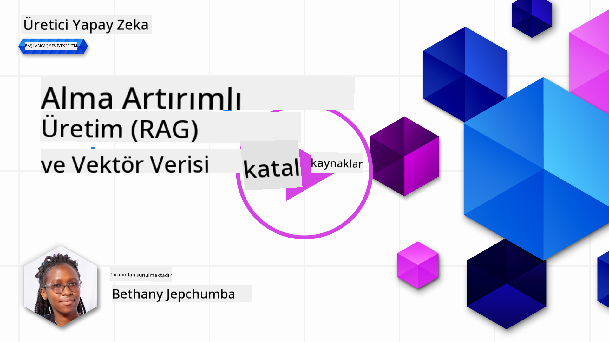
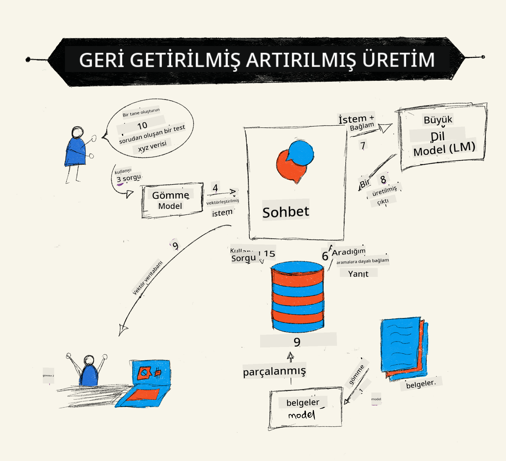
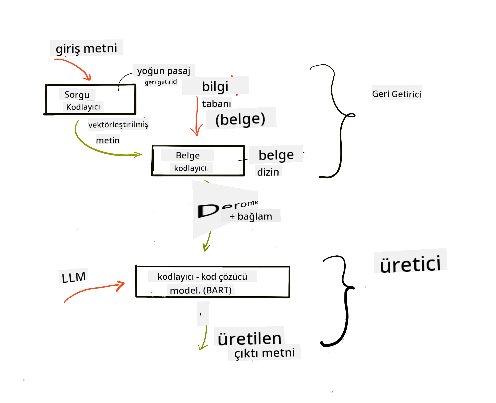

<!--
CO_OP_TRANSLATOR_METADATA:
{
  "original_hash": "e2861bbca91c0567ef32bc77fe054f9e",
  "translation_date": "2025-05-20T01:17:08+00:00",
  "source_file": "15-rag-and-vector-databases/README.md",
  "language_code": "tr"
}
-->
# Geri Alma Destekli Üretim (RAG) ve Vektör Veritabanları

[](https://aka.ms/gen-ai-lesson15-gh?WT.mc_id=academic-105485-koreyst)

Arama uygulamaları dersinde, kendi verilerinizi Büyük Dil Modellerine (LLM'ler) nasıl entegre edeceğimizi kısaca öğrendik. Bu derste, verilerinizi LLM uygulamanıza nasıl dayandıracağınızı, sürecin mekaniklerini ve verileri saklama yöntemlerini, hem gömme hem de metin dahil olmak üzere, daha ayrıntılı olarak inceleyeceğiz.

> **Video Çok Yakında**

## Giriş

Bu derste şunları ele alacağız:

- RAG'e giriş, nedir ve neden AI (yapay zeka) alanında kullanılır.

- Vektör veritabanlarının ne olduğunu anlamak ve uygulamamız için bir tane oluşturmak.

- RAG'i bir uygulamaya nasıl entegre edeceğimize dair pratik bir örnek.

## Öğrenme Hedefleri

Bu dersi tamamladıktan sonra şunları yapabileceksiniz:

- RAG'in veri alma ve işleme açısından önemini açıklamak.

- RAG uygulamasını kurmak ve verilerinizi bir LLM'ye dayandırmak.

- LLM Uygulamalarında RAG ve Vektör Veritabanlarının etkili entegrasyonu.

## Senaryomuz: Kendi verilerimizle LLM'lerimizi geliştirmek

Bu ders için, eğitim girişimine kendi notlarımızı eklemek istiyoruz, bu da sohbet botunun farklı konular hakkında daha fazla bilgi edinmesini sağlar. Sahip olduğumuz notları kullanarak, öğrenenler daha iyi çalışabilecek ve farklı konuları anlayabilecek, bu da sınavlarına hazırlanmayı kolaylaştıracaktır. Senaryomuzu oluşturmak için şunları kullanacağız:

- `Azure OpenAI:` sohbet botumuzu oluşturmak için kullanacağımız LLM

- `AI for beginners' lesson on Neural Networks`: LLM'mizi dayandıracağımız veri bu olacak

- `Azure AI Search` ve `Azure Cosmos DB:` veritabanı verilerimizi saklamak ve bir arama dizini oluşturmak için

Kullanıcılar notlarından pratik sınavlar oluşturabilecek, revizyon kartları hazırlayabilecek ve bunları kısa özetlere dönüştürebilecekler. Başlamak için, RAG'in ne olduğunu ve nasıl çalıştığını inceleyelim:

## Geri Alma Destekli Üretim (RAG)

Bir LLM destekli sohbet botu, kullanıcı isteklerini işleyerek yanıtlar üretir. Etkileşimli olacak şekilde tasarlanmıştır ve kullanıcılarla geniş bir konu yelpazesinde etkileşime girer. Ancak, yanıtları sağlanan bağlam ve temel eğitim verileriyle sınırlıdır. Örneğin, GPT-4'ün bilgi kesim noktası Eylül 2021'dir, bu da bu tarihten sonra meydana gelen olaylar hakkında bilgi sahibi olmadığı anlamına gelir. Ayrıca, LLM'leri eğitmek için kullanılan veriler, kişisel notlar veya bir şirketin ürün kılavuzu gibi gizli bilgileri içermez.

### RAG'ler (Geri Alma Destekli Üretim) nasıl çalışır



Diyelim ki notlarınızdan sınavlar oluşturan bir sohbet botu dağıtmak istiyorsunuz, bilgi tabanına bir bağlantı gerekecektir. İşte burada RAG devreye girer. RAG'ler şu şekilde çalışır:

- **Bilgi tabanı:** Geri almadan önce, bu belgelerin alınması ve ön işleme tabi tutulması gerekir, genellikle büyük belgeleri daha küçük parçalara ayırarak, metin gömme dönüştürerek ve bir veritabanında saklayarak.

- **Kullanıcı Sorgusu:** Kullanıcı bir soru sorar.

- **Geri Alma:** Kullanıcı bir soru sorduğunda, gömme modeli bilgi tabanımızdan ilgili bilgileri alarak isteme dahil edilecek daha fazla bağlam sağlar.

- **Destekli Üretim:** LLM, alınan verilere dayanarak yanıtını geliştirir. Bu, üretilen yanıtın yalnızca önceden eğitilmiş verilere değil, aynı zamanda ek bağlamdan gelen ilgili bilgilere de dayanmasını sağlar. Alınan veriler, LLM'nin yanıtlarını desteklemek için kullanılır. LLM daha sonra kullanıcının sorusuna bir yanıt döndürür.



RAG'lerin mimarisi, bir kodlayıcı ve bir kod çözücüden oluşan dönüştürücüler kullanılarak uygulanır. Örneğin, bir kullanıcı bir soru sorduğunda, giriş metni kelimelerin anlamını yakalayan vektörlere 'kodlanır' ve vektörler belge dizinimize 'kod çözülür' ve kullanıcı sorgusuna dayalı yeni metin oluşturur. LLM, çıktıyı oluşturmak için hem bir kodlayıcı-kod çözücü modelini kullanır.

Önerilen makaleye göre RAG'i uygularken iki yaklaşım: [Bilgi Yoğun NLP (doğal dil işleme yazılımı) Görevleri için Geri Alma Destekli Üretim](https://arxiv.org/pdf/2005.11401.pdf?WT.mc_id=academic-105485-koreyst) şunlardır:

- **_RAG-Dizi_** kullanıcı sorgusuna en iyi olası yanıtı tahmin etmek için alınan belgeleri kullanarak

- **RAG-Token** belgeleri kullanarak bir sonraki tokeni oluşturmak, ardından bunları kullanıcının sorgusuna yanıt vermek için almak

### Neden RAG'leri kullanmalısınız?

- **Bilgi zenginliği:** metin yanıtlarının güncel ve güncel olmasını sağlar. Bu nedenle, iç bilgi tabanına erişerek alan özel görevlerde performansı artırır.

- Kullanıcı sorgularına bağlam sağlamak için bilgi tabanındaki **doğrulanabilir verileri** kullanarak uydurmayı azaltır.

- Bir LLM'yi ince ayarlamaya göre daha ekonomik oldukları için **maliyet etkilidir**.

## Bilgi tabanı oluşturma

Uygulamamız, AI For Beginners müfredatındaki Sinir Ağı dersi olan kişisel verilerimize dayanmaktadır.

### Vektör Veritabanları

Vektör veritabanı, geleneksel veritabanlarından farklı olarak, gömülü vektörleri depolamak, yönetmek ve aramak için tasarlanmış özel bir veritabanıdır. Belgelerin sayısal temsillerini depolar. Verileri sayısal gömmelere ayırmak, AI sistemimizin verileri anlamasını ve işlemesini kolaylaştırır.

Gömme verilerimizi vektör veritabanlarında saklıyoruz çünkü LLM'lerin giriş olarak kabul ettikleri belirteç sayısında bir sınır vardır. Tüm gömmeleri bir LLM'ye geçemeyeceğiniz için, onları parçalara ayırmamız gerekecek ve bir kullanıcı bir soru sorduğunda, soruya en çok benzeyen gömmeler istemle birlikte döndürülecektir. Parçalama ayrıca bir LLM üzerinden geçirilen belirteç sayısında maliyetleri azaltır.

Bazı popüler vektör veritabanları arasında Azure Cosmos DB, Clarifyai, Pinecone, Chromadb, ScaNN, Qdrant ve DeepLake bulunur. Aşağıdaki komutu kullanarak Azure CLI ile bir Azure Cosmos DB modeli oluşturabilirsiniz:

```bash
az login
az group create -n <resource-group-name> -l <location>
az cosmosdb create -n <cosmos-db-name> -r <resource-group-name>
az cosmosdb list-keys -n <cosmos-db-name> -g <resource-group-name>
```

### Metinden gömmelere

Verilerimizi saklamadan önce, veritabanında saklanmadan önce vektör gömmelerine dönüştürmemiz gerekecek. Büyük belgeler veya uzun metinlerle çalışıyorsanız, beklediğiniz sorgulara göre parçalayabilirsiniz. Parçalama, cümle düzeyinde veya paragraf düzeyinde yapılabilir. Parçalama, etraflarındaki kelimelerden anlamlar çıkardığı için, bir parçaya başka bir bağlam ekleyebilirsiniz, örneğin, belge başlığını ekleyerek veya parçanın öncesine veya sonrasına biraz metin ekleyerek. Verileri şu şekilde parçalayabilirsiniz:

```python
def split_text(text, max_length, min_length):
    words = text.split()
    chunks = []
    current_chunk = []

    for word in words:
        current_chunk.append(word)
        if len(' '.join(current_chunk)) < max_length and len(' '.join(current_chunk)) > min_length:
            chunks.append(' '.join(current_chunk))
            current_chunk = []

    # If the last chunk didn't reach the minimum length, add it anyway
    if current_chunk:
        chunks.append(' '.join(current_chunk))

    return chunks
```

Bir kez parçalandığında, metnimizi farklı gömme modelleri kullanarak gömebiliriz. Kullanabileceğiniz bazı modeller arasında: word2vec, OpenAI tarafından ada-002, Azure Computer Vision ve daha birçokları bulunur. Kullanılacak modeli seçmek, kullandığınız dillere, kodlanan içeriğin türüne (metin/görüntü/ses), kodlayabileceği giriş boyutuna ve gömme çıktısının uzunluğuna bağlı olacaktır.

OpenAI'nin `text-embedding-ada-002` modelini kullanarak gömülü metin örneği:


## Geri Alma ve Vektör Arama

Bir kullanıcı bir soru sorduğunda, alıcı bunu sorgu kodlayıcı kullanarak bir vektöre dönüştürür, ardından belgede girişle ilgili olan belgede ilgili vektörleri aramak için belge arama dizinimizde arama yapar. İşlem tamamlandığında, hem giriş vektörünü hem de belge vektörlerini metne dönüştürür ve LLM üzerinden geçirir.

### Geri Alma

Geri alma, sistemin arama kriterlerini karşılayan belgeleri hızla bulmaya çalıştığı zaman gerçekleşir. Alıcının amacı, LLM'yi verilerinizle dayandırmak ve bağlam sağlamak için kullanılacak belgeleri elde etmektir.

Veritabanımızda arama yapmak için birkaç yol vardır, örneğin:

- **Anahtar kelime araması** - metin aramaları için kullanılır

- **Anlamsal arama** - kelimelerin anlamsal anlamını kullanır

- **Vektör arama** - belgeleri gömme modelleri kullanarak metinden vektör temsillerine dönüştürür. Geri alma, kullanıcı sorusuna en yakın vektör temsillerine sahip belgeleri sorgulayarak yapılacaktır.

- **Hibrit** - hem anahtar kelime hem de vektör aramasının bir kombinasyonu.

Geri alma ile ilgili bir zorluk, veritabanında sorguya benzer bir yanıt olmadığında ortaya çıkar, sistem o zaman elde edebilecekleri en iyi bilgiyi döndürecektir, ancak, maksimum alaka mesafesini ayarlamak veya hem anahtar kelimeleri hem de vektör aramayı birleştiren hibrit aramayı kullanmak gibi taktikler kullanabilirsiniz. Bu derste, hem vektör hem de anahtar kelime aramasının bir kombinasyonu olan hibrit aramayı kullanacağız. Verilerimizi, parçalara ve gömmelere sahip sütunlar içeren bir veri çerçevesine kaydedeceğiz.

### Vektör Benzerliği

Alıcı, bilgi veritabanında birbirine yakın olan gömmeleri arayacak, en yakın komşu, benzer metinler olduklarından. Bir kullanıcı bir sorgu sorduğunda, önce gömülür ve ardından benzer gömmelerle eşleştirilir. Farklı vektörlerin ne kadar benzer olduğunu bulmak için kullanılan yaygın ölçüm, iki vektör arasındaki açıya dayalı olan kosinüs benzerliğidir.

Benzerliği ölçmek için kullanabileceğimiz diğer alternatifler, vektör uç noktaları arasındaki doğru çizgi olan Öklid mesafesi ve iki vektörün karşılık gelen elemanlarının çarpımlarının toplamını ölçen nokta çarpımıdır.

### Arama dizini

Geri alma yaparken, arama yapmadan önce bilgi tabanımız için bir arama dizini oluşturmamız gerekecek. Bir dizin, gömmelerimizi depolayacak ve büyük bir veritabanında bile en benzer parçaları hızla alabilecektir. Dizinimizi yerel olarak şu şekilde oluşturabiliriz:

```python
from sklearn.neighbors import NearestNeighbors

embeddings = flattened_df['embeddings'].to_list()

# Create the search index
nbrs = NearestNeighbors(n_neighbors=5, algorithm='ball_tree').fit(embeddings)

# To query the index, you can use the kneighbors method
distances, indices = nbrs.kneighbors(embeddings)
```

### Yeniden sıralama

Veritabanını sorguladıktan sonra, en alakalı olanlardan sonuçları sıralamanız gerekebilir. Bir yeniden sıralama LLM, arama sonuçlarının alaka düzeyini en alakalı olanlardan başlayarak sıralayarak iyileştirmek için Makine Öğrenimini kullanır. Azure AI Arama'yı kullanarak, yeniden sıralama sizin için otomatik olarak yapılır. En yakın komşuları kullanarak yeniden sıralamanın nasıl çalıştığına bir örnek:

```python
# Find the most similar documents
distances, indices = nbrs.kneighbors([query_vector])

index = []
# Print the most similar documents
for i in range(3):
    index = indices[0][i]
    for index in indices[0]:
        print(flattened_df['chunks'].iloc[index])
        print(flattened_df['path'].iloc[index])
        print(flattened_df['distances'].iloc[index])
    else:
        print(f"Index {index} not found in DataFrame")
```

## Hepsini bir araya getirmek

Son adım, verilerimize dayalı yanıtlar alabilmek için LLM'mizi karışıma eklemektir. Şu şekilde uygulayabiliriz:

```python
user_input = "what is a perceptron?"

def chatbot(user_input):
    # Convert the question to a query vector
    query_vector = create_embeddings(user_input)

    # Find the most similar documents
    distances, indices = nbrs.kneighbors([query_vector])

    # add documents to query  to provide context
    history = []
    for index in indices[0]:
        history.append(flattened_df['chunks'].iloc[index])

    # combine the history and the user input
    history.append(user_input)

    # create a message object
    messages=[
        {"role": "system", "content": "You are an AI assistant that helps with AI questions."},
        {"role": "user", "content": history[-1]}
    ]

    # use chat completion to generate a response
    response = openai.chat.completions.create(
        model="gpt-4",
        temperature=0.7,
        max_tokens=800,
        messages=messages
    )

    return response.choices[0].message

chatbot(user_input)
```

## Uygulamamızı değerlendirme

### Değerlendirme Ölçütleri

- Doğal, akıcı ve insan benzeri ses çıkaran yanıtların kalitesi

- Sağlanan belgelerden gelen yanıtın değerlendirilmesi

- Yanıtın sorulan soruyla eşleşip eşleşmediğinin ve ilgili olup olmadığının değerlendirilmesi

- Yanıtın dilbilgisel olarak mantıklı olup olmadığı

## RAG (Geri Alma Destekli Üretim) ve vektör veritabanları kullanımı için kullanım durumları

Fonksiyon çağrılarının uygulamanızı geliştirebileceği birçok farklı kullanım durumu vardır, örneğin:

- Soru ve Cevaplama: şirket verilerinizi bir sohbete dayandırarak çalışanların soru sorması için kullanılabilir.

- Öneri Sistemleri: en benzer değerleri eşleştiren bir sistem oluşturabileceğiniz yerler, örneğin filmler, restoranlar ve daha fazlası.

- Sohbet botu hizmetleri: sohbet geçmişini saklayabilir ve kullanıcı verilerine dayalı olarak konuşmayı kişiselleştirebilirsiniz.

- Vektör gömmelerine dayalı görüntü araması, görüntü tanıma ve anomali tespiti yaparken faydalıdır.

## Özet

RAG'in temel alanlarını, verilerimizi uygulamaya eklemekten kullanıcı sorgusuna ve çıktıya kadar ele aldık. RAG oluşturmayı basitleştirmek için Semanti Kernel, Langchain veya Autogen gibi çerçeveler kullanabilirsiniz.

## Ödev

Geri Alma Destekli Üretim (RAG) öğreniminize devam etmek için şunları yapabilirsiniz:

- Seçtiğiniz çerçeveyi kullanarak uygulama için bir ön yüz oluşturun.

- Bir çerçeve, ya LangChain ya da Semantik Kernel kullanarak uygulamanızı yeniden oluşturun.

Dersi tamamladığınız için tebrikler 👏.

## Öğrenme burada bitmez, Yolculuğa devam edin

Bu dersi tamamladıktan sonra, Generatif AI bilginizi geliştirmeye devam etmek için [Generatif AI Öğrenme koleksiyonumuzu](https://aka.ms/genai-collection?WT.mc_id=academic-105485-koreyst) inceleyin!

**Feragatname**:  
Bu belge, AI çeviri hizmeti [Co-op Translator](https://github.com/Azure/co-op-translator) kullanılarak çevrilmiştir. Doğruluk için çaba göstersek de, otomatik çevirilerin hata veya yanlışlıklar içerebileceğini lütfen unutmayın. Orijinal belgenin kendi dilindeki hali yetkili kaynak olarak kabul edilmelidir. Kritik bilgiler için profesyonel insan çevirisi önerilir. Bu çevirinin kullanımından kaynaklanan yanlış anlama veya yanlış yorumlamalardan dolayı sorumluluk kabul etmiyoruz.