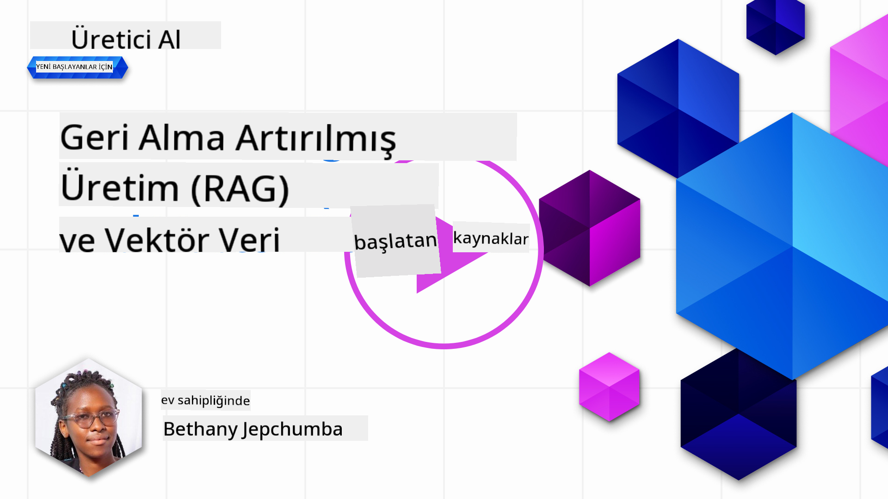
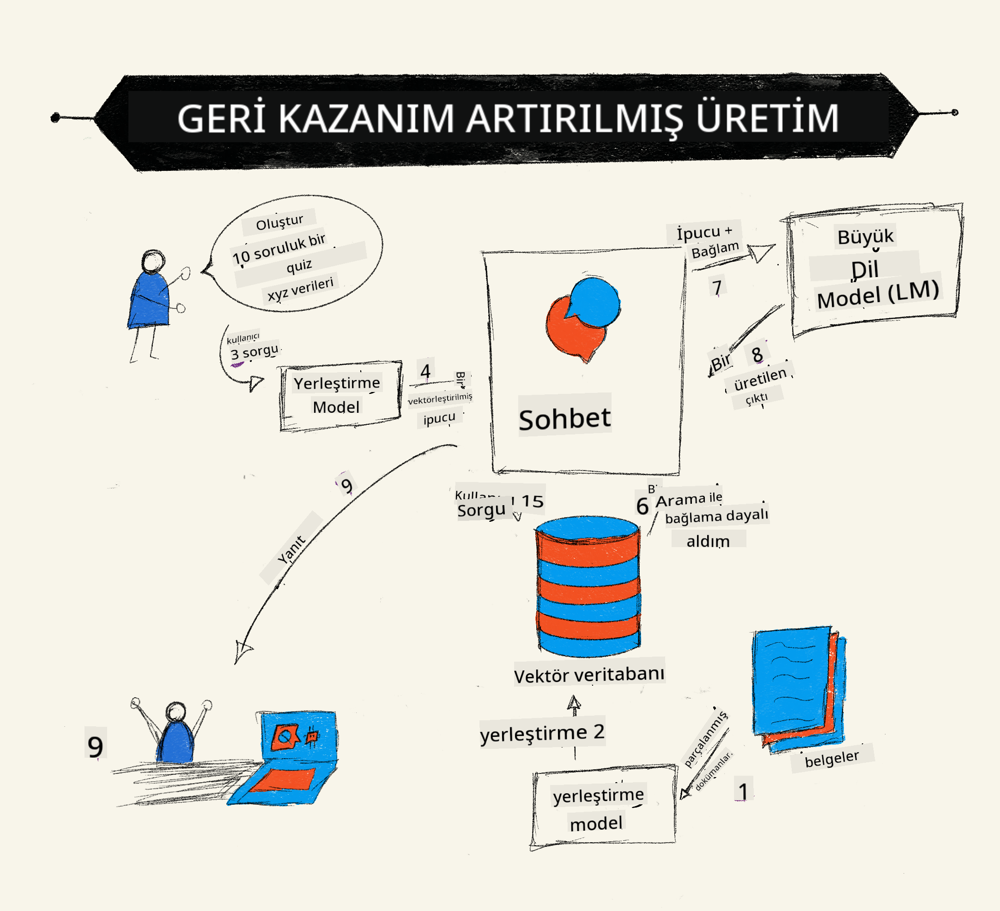
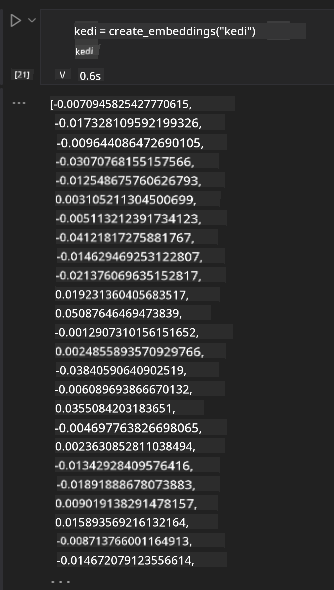

<!--
CO_OP_TRANSLATOR_METADATA:
{
  "original_hash": "e2861bbca91c0567ef32bc77fe054f9e",
  "translation_date": "2025-06-25T22:31:47+00:00",
  "source_file": "15-rag-and-vector-databases/README.md",
  "language_code": "tr"
}
-->
# Retrieval Augmented Generation (RAG) ve Vektör Veritabanları

[](https://aka.ms/gen-ai-lesson15-gh?WT.mc_id=academic-105485-koreyst)

Arama uygulamaları dersinde, kendi verilerinizi Büyük Dil Modellerine (LLM'ler) nasıl entegre edebileceğinizi kısaca öğrenmiştik. Bu derste, verilerinizi LLM uygulamanıza nasıl dayandıracağınızı, sürecin mekaniklerini ve hem gömülemeler hem de metin dahil olmak üzere verileri depolama yöntemlerini daha ayrıntılı olarak inceleyeceğiz.

> **Video Yakında Geliyor**

## Giriş

Bu derste aşağıdaki konuları ele alacağız:

- RAG'a giriş, nedir ve yapay zekada (AI) neden kullanılır.

- Vektör veritabanlarının ne olduğunu anlamak ve uygulamamız için bir tane oluşturmak.

- RAG'ı bir uygulamaya nasıl entegre edeceğimize dair pratik bir örnek.

## Öğrenme Hedefleri

Bu dersi tamamladıktan sonra, şunları yapabileceksiniz:

- RAG'ın veri alma ve işleme açısından önemini açıklayın.

- RAG uygulamasını kurun ve verilerinizi bir LLM'ye dayandırın.

- LLM uygulamalarında RAG ve Vektör Veritabanlarının etkili entegrasyonu.

## Senaryomuz: LLM'lerimizi kendi verilerimizle geliştirmek

Bu ders için, eğitim başlangıç şirketine kendi notlarımızı eklemek istiyoruz, böylece chatbot farklı konular hakkında daha fazla bilgi alabilir. Sahip olduğumuz notları kullanarak, öğrenciler daha iyi çalışabilecek ve farklı konuları anlayabilecek, böylece sınavlarına daha kolay hazırlanabilecekler. Senaryomuzu oluşturmak için şunları kullanacağız:

- `Azure OpenAI:` chatbotumuzu oluşturmak için kullanacağımız LLM

- `AI for beginners' lesson on Neural Networks`: LLM'mizi dayandıracağımız veri

- `Azure AI Search` ve `Azure Cosmos DB:` veritabanı, verilerimizi depolamak ve bir arama dizini oluşturmak için

Kullanıcılar notlarından pratik sınavlar oluşturabilecek, revizyon flash kartları hazırlayabilecek ve bunları kısa özetlere dönüştürebilecekler. Başlamak için, RAG'ın ne olduğunu ve nasıl çalıştığını inceleyelim:

## Retrieval Augmented Generation (RAG)

Bir LLM destekli chatbot, kullanıcı istemlerini işleyerek yanıtlar üretir. Etkileşimli olacak şekilde tasarlanmıştır ve geniş bir konu yelpazesinde kullanıcılarla etkileşime girer. Ancak, yanıtları sağlanan bağlam ve temel eğitim verileriyle sınırlıdır. Örneğin, GPT-4'ün bilgi kesme noktası Eylül 2021'dir, yani bu tarihten sonra gerçekleşen olaylar hakkında bilgi sahibi değildir. Ayrıca, LLM'leri eğitmek için kullanılan veriler, kişisel notlar veya bir şirketin ürün kılavuzu gibi gizli bilgileri içermez.

### RAG'lar (Retrieval Augmented Generation) nasıl çalışır



Diyelim ki notlarınızdan sınavlar oluşturacak bir chatbot dağıtmak istiyorsunuz, bilgi tabanına bir bağlantıya ihtiyacınız olacaktır. İşte burada RAG devreye giriyor. RAG'lar şu şekilde çalışır:

- **Bilgi tabanı:** Alım öncesi, bu belgelerin alınması ve ön işleme tabi tutulması gerekir, genellikle büyük belgeleri daha küçük parçalara ayırmak, metin gömmelemelerine dönüştürmek ve bir veritabanında depolamak.

- **Kullanıcı Sorgusu:** kullanıcı bir soru sorar

- **Alma:** Kullanıcı bir soru sorduğunda, gömmeleme modeli bilgi tabanımızdan ilgili bilgileri alarak isteme dahil edilecek daha fazla bağlam sağlar.

- **Artırılmış Üretim:** LLM, alınan veriye dayanarak yanıtını geliştirir. Yanıtın sadece önceden eğitilmiş verilere değil, aynı zamanda eklenen bağlamdan alınan ilgili bilgilere dayanmasını sağlar. Alınan veri, LLM'nin yanıtlarını artırmak için kullanılır. LLM daha sonra kullanıcının sorusuna bir yanıt verir.


RAG'ların mimarisi, bir kodlayıcı ve bir kod çözücüden oluşan dönüştürücüler kullanılarak uygulanır. Örneğin, bir kullanıcı soru sorduğunda, giriş metni 'kodlanarak' kelimelerin anlamını yakalayan vektörlere dönüştürülür ve vektörler belge dizinimize 'kod çözücü' olarak girilir ve kullanıcı sorgusuna dayanarak yeni metin oluşturulur. LLM, çıktıyı oluşturmak için hem kodlayıcı-kod çözücü modelini kullanır.

Önerilen makaleye göre RAG uygularken iki yaklaşım: [Bilgi yoğun NLP (doğal dil işleme yazılımı) Görevleri için Alım-Artırılmış Üretim](https://arxiv.org/pdf/2005.11401.pdf?WT.mc_id=academic-105485-koreyst) şunlardır:

- **_RAG-Dizi_** alınan belgeleri kullanarak bir kullanıcı sorgusuna en iyi olası yanıtı tahmin etmek

- **RAG-Token** belgeleri kullanarak bir sonraki tokeni oluşturmak, ardından bunları kullanıcının sorgusuna yanıt vermek için almak

### Neden RAG'ları kullanırsınız?

- **Bilgi zenginliği:** metin yanıtlarının güncel ve güncel olmasını sağlar. Dolayısıyla, iç bilgi tabanına erişerek alan spesifik görevlerde performansı artırır.

- Kullanıcı sorgularına bağlam sağlamak için bilgi tabanındaki **doğrulanabilir verileri** kullanarak sahtecilik oranını azaltır.

- Bir LLM'yi ince ayarlamaya kıyasla daha ekonomik oldukları için **maliyet etkin**.

## Bilgi tabanı oluşturma

Uygulamamız, Kişisel verilerimize, yani AI For Beginners müfredatındaki Sinir Ağı dersine dayanmaktadır.

### Vektör Veritabanları

Geleneksel veritabanlarının aksine, bir vektör veritabanı, gömülü vektörleri depolamak, yönetmek ve aramak için tasarlanmış özel bir veritabanıdır. Belgelerin sayısal temsilini depolar. Verileri sayısal gömmelemelere ayırmak, AI sistemimizin verileri anlamasını ve işlemesini kolaylaştırır.

Gömmelemelerimizi vektör veritabanlarında depolarız çünkü LLM'ler giriş olarak kabul ettikleri token sayısında sınırlıdır. Tüm gömmelemeleri bir LLM'ye geçiremeyeceğiniz için, bunları parçalara ayırmamız gerekecek ve bir kullanıcı soru sorduğunda, soruya en çok benzeyen gömmelemeler istemle birlikte geri dönecektir. Parçalama ayrıca bir LLM aracılığıyla geçirilen token sayısı üzerinde maliyetleri azaltır.

Popüler vektör veritabanları arasında Azure Cosmos DB, Clarifyai, Pinecone, Chromadb, ScaNN, Qdrant ve DeepLake bulunmaktadır. Azure CLI kullanarak aşağıdaki komutla bir Azure Cosmos DB modeli oluşturabilirsiniz:

```bash
az login
az group create -n <resource-group-name> -l <location>
az cosmosdb create -n <cosmos-db-name> -r <resource-group-name>
az cosmosdb list-keys -n <cosmos-db-name> -g <resource-group-name>
```

### Metinden gömmelemelere

Verilerimizi depolamadan önce, verileri veritabanında depolanmadan önce vektör gömmelemelerine dönüştürmemiz gerekecek. Büyük belgeler veya uzun metinlerle çalışıyorsanız, beklediğiniz sorgulara göre parçalara ayırabilirsiniz. Parçalama cümle seviyesinde veya paragraf seviyesinde yapılabilir. Parçalama, etrafındaki kelimelerden anlamlar çıkardığı için, parçaya bazı başka bağlamlar ekleyebilirsiniz, örneğin, belge başlığını ekleyerek veya parçanın öncesinde veya sonrasında bazı metinler ekleyerek. Verileri şu şekilde parçalara ayırabilirsiniz:

```python
def split_text(text, max_length, min_length):
    words = text.split()
    chunks = []
    current_chunk = []

    for word in words:
        current_chunk.append(word)
        if len(' '.join(current_chunk)) < max_length and len(' '.join(current_chunk)) > min_length:
            chunks.append(' '.join(current_chunk))
            current_chunk = []

    # If the last chunk didn't reach the minimum length, add it anyway
    if current_chunk:
        chunks.append(' '.join(current_chunk))

    return chunks
```

Parçalandıktan sonra, metnimizi farklı gömmeleme modelleri kullanarak gömmeleyebiliriz. Kullanabileceğiniz bazı modeller arasında: word2vec, OpenAI tarafından ada-002, Azure Computer Vision ve daha fazlası bulunur. Kullanacağınız modeli seçmek, kullandığınız dillere, kodlanan içeriğin türüne (metin/görüntüler/ses), kodlayabileceği girişin boyutuna ve gömmeleme çıktısının uzunluğuna bağlı olacaktır.

OpenAI'nin `text-embedding-ada-002` modelini kullanarak gömülen bir metin örneği:


## Alım ve Vektör Arama

Kullanıcı bir soru sorduğunda, alıcı bunu sorgu kodlayıcı kullanarak bir vektöre dönüştürür, ardından belge arama dizinimizde girdiyle ilgili belgelerdeki ilgili vektörleri arar. Tamamlandığında, hem giriş vektörünü hem de belge vektörlerini metne dönüştürür ve LLM aracılığıyla geçirir.

### Alım

Alım, sistemin arama kriterlerini karşılayan belgeleri dizinden hızlıca bulmaya çalıştığında gerçekleşir. Alıcının amacı, bağlam sağlamak ve LLM'yi verilerinize dayandırmak için kullanılacak belgeleri almaktır.

Veritabanımızda arama yapmak için birkaç yol vardır, örneğin:

- **Anahtar kelime araması** - metin aramaları için kullanılır

- **Anlamsal arama** - kelimelerin anlamsal anlamını kullanır

- **Vektör arama** - belgeleri metinden gömmeleme modelleri kullanarak vektör temsillerine dönüştürür. Alım, kullanıcı sorusuna en yakın vektör temsillerine sahip belgeleri sorgulayarak yapılacaktır.

- **Hibrit** - hem anahtar kelime hem de vektör aramanın birleşimi.

Alımda bir zorluk, veritabanında sorguya benzer bir yanıt olmadığında ortaya çıkar, sistem o zaman elde edebileceği en iyi bilgiyi döndürecektir, ancak benzerlik için maksimum mesafeyi ayarlamak veya hem anahtar kelime hem de vektör aramayı birleştiren hibrit arama kullanmak gibi taktikler kullanabilirsiniz. Bu derste, hem vektör hem de anahtar kelime aramanın birleşimi olan hibrit aramayı kullanacağız. Verilerimizi parçalara ve gömmelemelere sahip sütunlar içeren bir veri çerçevesine depolayacağız.

### Vektör Benzerliği

Alıcı, bilgi veritabanında birbirine yakın olan gömmelemeleri arayacak, en yakın komşu, benzer olan metinlerdir. Kullanıcı bir sorgu sorduğunda, önce gömülür ve ardından benzer gömmelemelerle eşleştirilir. Farklı vektörlerin ne kadar benzer olduğunu bulmak için kullanılan ortak ölçüm, iki vektör arasındaki açıya dayanan kosinüs benzerliğidir.

Benzerliği ölçmek için kullanabileceğimiz diğer alternatifler, vektör uç noktaları arasındaki düz çizgi olan Öklid mesafesi ve iki vektörün karşılık gelen öğelerinin ürünlerinin toplamını ölçen nokta ürünüdür.

### Arama dizini

Alım yaparken, arama yapmadan önce bilgi tabanımız için bir arama dizini oluşturmamız gerekecek. Bir dizin, gömmelemelerimizi depolar ve büyük bir veritabanında bile en benzer parçaları hızlıca alabilir. Dizini yerel olarak şu şekilde oluşturabiliriz:

```python
from sklearn.neighbors import NearestNeighbors

embeddings = flattened_df['embeddings'].to_list()

# Create the search index
nbrs = NearestNeighbors(n_neighbors=5, algorithm='ball_tree').fit(embeddings)

# To query the index, you can use the kneighbors method
distances, indices = nbrs.kneighbors(embeddings)
```

### Yeniden sıralama

Veritabanını sorguladıktan sonra, sonuçları en alakalı olanlardan başlayarak sıralamanız gerekebilir. Bir yeniden sıralama LLM, arama sonuçlarının alaka düzeyini artırmak için bunları en alakalı olanlardan başlayarak sıralamak için Makine Öğrenimi kullanır. Azure AI Search kullanarak, yeniden sıralama sizin için otomatik olarak yapılır ve anlamsal yeniden sıralayıcı kullanılır. En yakın komşuları kullanarak yeniden sıralamanın nasıl çalıştığına dair bir örnek:

```python
# Find the most similar documents
distances, indices = nbrs.kneighbors([query_vector])

index = []
# Print the most similar documents
for i in range(3):
    index = indices[0][i]
    for index in indices[0]:
        print(flattened_df['chunks'].iloc[index])
        print(flattened_df['path'].iloc[index])
        print(flattened_df['distances'].iloc[index])
    else:
        print(f"Index {index} not found in DataFrame")
```

## Hepsini bir araya getirmek

Son adım, LLM'mizi karışıma ekleyerek verilerimize dayanan yanıtlar alabilmektir. Şu şekilde uygulayabiliriz:

```python
user_input = "what is a perceptron?"

def chatbot(user_input):
    # Convert the question to a query vector
    query_vector = create_embeddings(user_input)

    # Find the most similar documents
    distances, indices = nbrs.kneighbors([query_vector])

    # add documents to query  to provide context
    history = []
    for index in indices[0]:
        history.append(flattened_df['chunks'].iloc[index])

    # combine the history and the user input
    history.append(user_input)

    # create a message object
    messages=[
        {"role": "system", "content": "You are an AI assistant that helps with AI questions."},
        {"role": "user", "content": history[-1]}
    ]

    # use chat completion to generate a response
    response = openai.chat.completions.create(
        model="gpt-4",
        temperature=0.7,
        max_tokens=800,
        messages=messages
    )

    return response.choices[0].message

chatbot(user_input)
```

## Uygulamamızı değerlendirme

### Değerlendirme Ölçütleri

- Yanıtların kalitesinin doğal, akıcı ve insan gibi olup olmadığını sağlama

- Verilerin dayandırılması: yanıtın verilen belgelerden gelip gelmediğini değerlendirme

- Alaka düzeyi: yanıtın sorulan soruyla eşleşip eşleşmediğini ve ilgili olup olmadığını değerlendirme

- Akıcılık - yanıtın dilbilgisel olarak anlamlı olup olmadığını değerlendirme

## RAG (Retrieval Augmented Generation) ve vektör veritabanlarını kullanmanın kullanım alanları

Fonksiyon çağrılarının uygulamanızı nasıl geliştirebileceği birçok farklı kullanım alanı vardır, örneğin:

- Soru ve Cevap: şirket verilerinizi çalışanların sorular sorması için kullanılabilecek bir sohbete dayandırma.

- Tavsiye Sistemleri: en benzer değerleri eşleştiren bir sistem oluşturabileceğiniz yer, örneğin filmler, restoranlar ve daha fazlası.

- Chatbot hizmetleri: sohbet geçmişini depolayabilir ve kullanıcı verilerine dayalı olarak sohbeti kişiselleştirebilirsiniz.

- Vektör gömmelemelerine dayalı görüntü arama, görüntü tanıma ve anomali tespiti yaparken kullanışlıdır.

## Özet

RAG'ın temel alanlarını, verilerimizi uygulamaya eklemekten, kullanıcı sorgusuna ve çıktısına kadar ele aldık. RAG oluşturmayı basitleştirmek için Semanti Kernel, Langchain veya Autogen gibi çerçeveler kullanabilirsiniz.

## Ödev

Retrieval Augmented Generation (RAG) öğreniminizi sürdürmek için şunları yapabilirsiniz:

- Seçtiğiniz çerçeveyi kullanarak uygulama için bir ön yüz oluşturun

- Bir çerçeve kullanarak, ya LangChain ya da Semantic Kernel, ve uygulamanızı yeniden oluşturun.

Dersi tamamladığınız için tebrikler 👏.

## Öğrenme burada bitmez, Yolculuğa devam edin

Bu dersi tamamladıktan sonra, Generative AI bilginizi artırmaya devam etmek için [Generative AI Öğrenme koleksiyonumuzu](https://aka.ms/genai-collection?WT.mc_id=academic-105485-koreyst) inceleyin!

**Feragatname**:  
Bu belge, [Co-op Translator](https://github.com/Azure/co-op-translator) adlı yapay zeka çeviri hizmeti kullanılarak çevrilmiştir. Doğruluk için çaba sarf etsek de, otomatik çevirilerin hata veya yanlışlıklar içerebileceğini lütfen unutmayın. Belgenin orijinal dili, yetkili kaynak olarak kabul edilmelidir. Kritik bilgiler için profesyonel insan çevirisi önerilir. Bu çevirinin kullanımından doğabilecek yanlış anlama veya yanlış yorumlamalardan sorumlu değiliz.