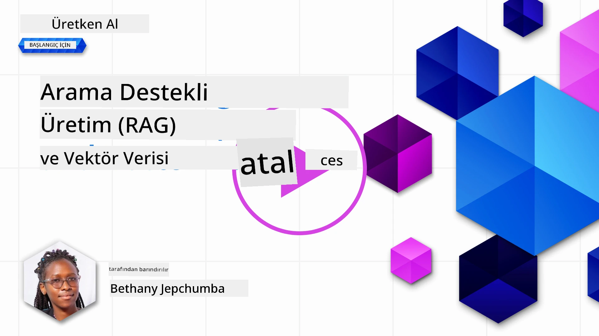
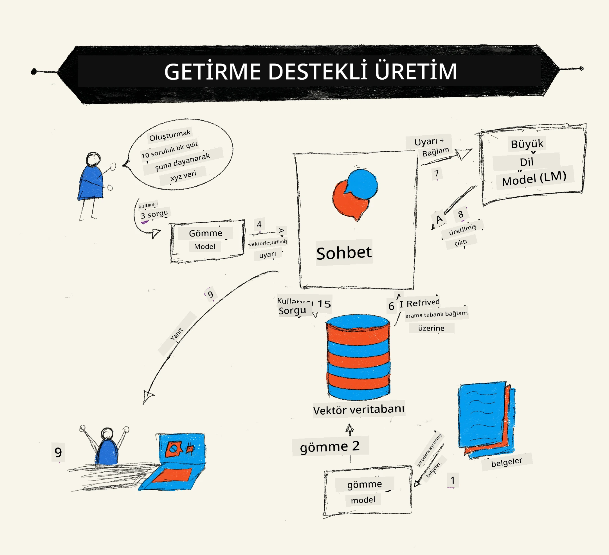
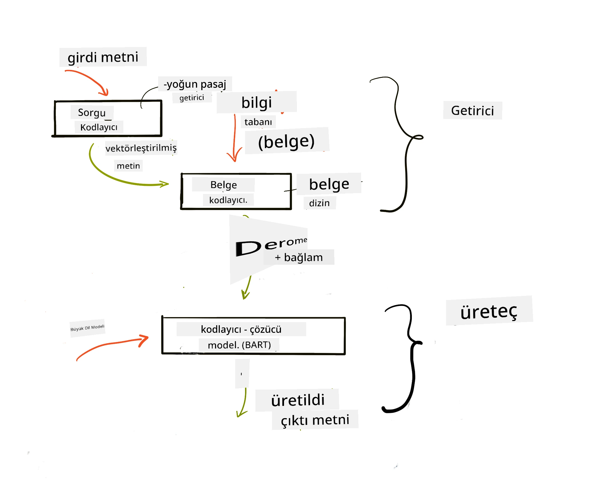
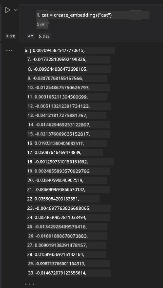

# Retrieval Augmented Generation (RAG) ve Vektör Veritabanları

[](https://youtu.be/4l8zhHUBeyI?si=BmvDmL1fnHtgQYkL)

Arama uygulamaları dersinde, kendi verilerinizi Büyük Dil Modellerine (LLM'ler) nasıl entegre edeceğinizi kısaca öğrenmiştik. Bu derste, verilerinizi LLM uygulamanıza nasıl dayandıracağınız, sürecin mekanikleri ve hem gömme (embedding) hem de metin depolama yöntemleri gibi konuları daha derinlemesine inceleyeceğiz.

> **Video Yakında Gelecek**

## Giriş

Bu derste aşağıdaki konuları ele alacağız:

- RAG'a giriş, ne olduğu ve yapay zeka (AI) alanında neden kullanıldığı.

- Vektör veritabanlarının ne olduğunu anlamak ve uygulamamız için bir tane oluşturmak.

- RAG'ın bir uygulamaya nasıl entegre edileceğine yönelik pratik bir örnek.

## Öğrenme Hedefleri

Bu dersi tamamladıktan sonra şunları yapabileceksiniz:

- Veri getirme ve işleme sürecinde RAG'ın önemini açıklamak.

- RAG uygulamasını kurmak ve verilerinizi bir LLM'e dayandırmak.

- LLM uygulamalarında etkili bir şekilde RAG ve Vektör Veritabanlarını entegre etmek.

## Senaryomuz: LLM'lerimizi kendi verilerimizle geliştirmek

Bu derste, chatbotun farklı konular hakkında daha fazla bilgi edinmesine olanak tanıyan kendi notlarımızı eğitim girişimine eklemek istiyoruz. Elimizdeki notları kullanarak, öğrenenler daha iyi çalışabilecek ve farklı konuları anlayabilecek, bu da sınavlara hazırlanmayı kolaylaştıracaktır. Senaryomuzu oluşturmak için şunları kullanacağız:

- `Azure OpenAI:` chatbotumuzu oluşturmak için kullanacağımız LLM

- `Yapay Zeka için Yeni Başlayanlar` dersinde Sinir Ağları: LLM'imizi dayandıracağımız veri

- `Azure AI Search` ve `Azure Cosmos DB:` verilerimizi depolamak ve bir arama dizini oluşturmak için vektör veritabanı

Kullanıcılar notlarından uygulamalı testler oluşturabilecek, tekrar kartları hazırlayabilecek ve bunları özetleyerek kısa genel bakışlar yapabilecekler. Başlamak için RAG'ın ne olduğunu ve nasıl çalıştığını inceleyelim:

## Retrieval Augmented Generation (RAG)

LLM destekli bir chatbot, kullanıcı istemlerini işleyerek yanıtlar oluşturur. Etkileşimli olması ve kullanıcılarla çeşitli konularda iletişim kurması amaçlanmıştır. Ancak yanıtları, sağlanan bağlam ve temel eğitim verileriyle sınırlıdır. Örneğin, GPT-4'ün bilgi kesim tarihi Eylül 2021'dir; yani bu tarihten sonra gerçekleşen olaylar hakkında bilgisi yoktur. Ayrıca, LLM'lerin eğitilmesinde kullanılan veriler kişisel notlar veya şirketlerin ürün kılavuzları gibi gizli bilgileri içermez.

### RAG'lar (Retrieval Augmented Generation) nasıl çalışır



Diyelim ki notlarınızdan quizler oluşturan bir chatbot dağıtmak istiyorsunuz, bilgi tabanına bir bağlantı gerekecektir. İşte burada RAG devreye girer. RAG'lar şu şekilde çalışır:

- **Bilgi tabanı:** Getirmeden önce, belgelerin alınması ve ön işlenmesi gerekir; genellikle büyük belgeler küçük parçalara bölünür, metin gömme (embedding) formatına dönüştürülür ve bir veritabanında saklanır.

- **Kullanıcı Sorgusu:** kullanıcı bir soru sorar

- **Getirme:** Kullanıcı soru sorduğunda, gömme modeli bilgi tabanından ilgili bilgileri alarak isteme bağlamını zenginleştirir.

- **Artırılmış Oluşturma:** LLM, alınan verilere dayanarak yanıtını geliştirir. Bu, yanıtın sadece önceden eğitilmiş verilere değil, ek bağlamdan elde edilen ilgili bilgilere dayanmasını sağlar. Alınan veriler LLM'nin yanıtlarını zenginleştirmek için kullanılır. LLM daha sonra kullanıcı sorusuna yanıt verir.



RAG mimarisi, bir kodlayıcı (encoder) ve çözücüden (decoder) oluşan transformerlara dayalı olarak uygulanır. Örneğin, kullanıcı soru sorduğunda, giriş metni kelimelerin anlamını yakalayan vektörlere 'kodlanır' ve bu vektörler belge dizinimize 'çözülür' ve kullanıcı sorgusuna dayalı yeni metin üretilir. LLM, çıktı oluşturmak için hem kodlayıcı-çözücü modelini kullanır.

Önerilen makaleye göre RAG uygulamada iki yaklaşım vardır: [Retrieval-Augmented Generation for Knowledge intensive NLP (doğal dil işleme) Tasks](https://arxiv.org/pdf/2005.11401.pdf?WT.mc_id=academic-105485-koreyst):

- **_RAG-Dizisi_**: Sorgu için en iyi cevabı tahmin etmek üzere alınan belgeleri kullanmak

- **RAG-Kelimesi**: Belgeleri bir sonraki tokenı oluşturmak için kullanmak, ardından kullanıcı sorgusuna cevap vermek için bunları almak

### Neden RAG kullanırsınız?  

- **Bilgi zenginliği:** Metin yanıtlarının güncel ve doğru olmasını sağlar. Bu nedenle, dahili bilgi tabanına erişimle alan spesifik görevlerde performansı artırır.

- Kullanıcı sorgularına bağlam sağlamak için bilgi tabanında bulunan **doğrulanabilir verileri** kullanarak uydurmayı azaltır.

- LLM'i ince ayarlamaya kıyasla daha **maliyet-etkin**dir.

## Bir bilgi tabanı oluşturmak

Uygulamamız, kişisel verilerimiz olan Yapay Zeka için Yeni Başlayanlar müfredatındaki Sinir Ağı dersine dayalıdır.

### Vektör Veritabanları

Vektör veritabanı, geleneksel veritabanlarının aksine gömülü vektörleri saklamak, yönetmek ve aramak için tasarlanmış özel bir veritabanıdır. Belgelerin sayısal temsillerini depolar. Veriyi sayısal gömme (embedding) haline getirmek, yapay zeka sistemimizin veriyi anlamasını ve işlemesini kolaylaştırır.

Vektör veritabanlarında gömme verimizi saklarız çünkü LLM'lerin kabul ettiği token sayısı sınırlıdır. Tüm gömmeleri bir LLM'e gönderemezsiniz, bu nedenle gömmeleri parçalara ayırmamız gerekir; kullanıcı bir soru sorduğunda soruyla en çok ilişkili gömmeler istemle birlikte geri döndürülür. Parçalama, LLM üzerinden geçen token sayısını da azaltır, böylece maliyeti düşürür.

Popüler vektör veritabanları arasında Azure Cosmos DB, Clarifyai, Pinecone, Chromadb, ScaNN, Qdrant ve DeepLake bulunur. Azure CLI kullanarak Azure Cosmos DB modeli şu komutla oluşturulabilir:

```bash
az login
az group create -n <resource-group-name> -l <location>
az cosmosdb create -n <cosmos-db-name> -r <resource-group-name>
az cosmosdb list-keys -n <cosmos-db-name> -g <resource-group-name>
```

### Metinden gömme veriye dönüşüm

Verilerimizi depolamadan önce vektör gömmelerine dönüştürmemiz gerekir. Büyük belgeler veya uzun metinlerle çalışıyorsanız, beklediğiniz sorgulara göre parçalayabilirsiniz. Parçalama cümle seviyesinde veya paragraf seviyesinde yapılabilir. Parçalar, çevresindeki kelimelerden anlam çıkardığı için, parçaya başka bağlamlar da ekleyebilirsiniz, örneğin belge başlığını veya parçanın öncesindeki/sonrasındaki bazı metinleri eklemek gibi. Veriyi aşağıdaki gibi parçalayabilirsiniz:

```python
def split_text(text, max_length, min_length):
    words = text.split()
    chunks = []
    current_chunk = []

    for word in words:
        current_chunk.append(word)
        if len(' '.join(current_chunk)) < max_length and len(' '.join(current_chunk)) > min_length:
            chunks.append(' '.join(current_chunk))
            current_chunk = []

    # Son parça minimum uzunluğa ulaşmadıysa bile yine de ekle
    if current_chunk:
        chunks.append(' '.join(current_chunk))

    return chunks
```

Parçalandıktan sonra farklı gömme modelleri kullanarak metnimizi gömebiliriz. Kullanabileceğiniz modeller arasında word2vec, OpenAI'nin ada-002 modeli, Azure Bilgisayarlı Görü ve daha fazlası bulunur. Kullanılacak model, kullandığınız dil, kodlanan içerik türü (metin/görüntü/ses), kodlayabildiği girdi boyutu ve gömme çıktısının uzunluğuna bağlı olarak seçilir.

OpenAI'nin `text-embedding-ada-002` modeli ile gömülmüş bir metin örneği:


## Getirme ve Vektör Arama

Kullanıcı soru sorduğunda, getirme modeli sorguyu bir vektöre dönüştürür, ardından belge arama dizinimizde girilen vektörle ilgili belgelerdeki benzer vektörleri arar. İşlem tamamlandığında, hem giriş vektörü hem de doküman vektörleri metne dönüştürülür ve LLM'e iletilir.

### Getirme

Getirme, sistemin arama kriterlerini karşılayan belgeleri dizinden hızla bulmaya çalıştığı aşamadır. Getirme modelinin amacı, bağlam sağlamak ve LLM'i verilerinizle dayandırmak üzere kullanılacak belgeleri almaktır.

Veritabanında arama yapmak için birkaç yöntem vardır:

- **Anahtar kelime araması** - metin aramaları için kullanılır

- **Vektör arama** - belgeleri metinden gömme modellleriyle vektör temsillerine dönüştürür, böylece kelimelerin anlamı kullanılarak **anlamsal arama** yapılabilir. Getirme, kullanıcı sorusuna en yakın vektör temsillerine sahip belgeler sorgulanarak yapılır.

- **Hibrit** - anahtar kelime ve vektör aramalarının birleşimi.

Getirmede sorun, veritabanında sorguya benzer yanıt olmadığında ortaya çıkar; sistem yine de elde edebildiği en iyi bilgiyi döndürür. Ancak, uygunluk için maksimum mesafe ayarlamak veya anahtar kelime ve vektör aramalarını birleştiren hibrit arama kullanmak gibi taktikler uygulanabilir. Bu derste hibrit aramayı kullanacağız. Verilerimizi, hem parçaları hem de gömmeleri içeren sütunlara sahip bir veri çerçevesine kaydedeceğiz.

### Vektör Benzerliği

Getirme modeli, bilgi tabanında yakın gömme verileri arar, en yakın komşuları bulur çünkü bunlar benzer metinlerdir. Kullanıcı bir sorgu sorduğunda, önce bu gömme oluşturulur ve ardından benzer gömmelerle eşleştirilir. Farklı vektörlerin ne kadar benzer olduğunu ölçmek için sıklıkla kullanılan yöntem, iki vektör arasındaki açıya dayanan kosinüs benzerliğidir.

Benzerlik ölçmek için kullanabileceğimiz diğer yöntemler arasında, vektör uç noktaları arasındaki düz çizgi mesafesi olan Öklid mesafesi ve iki vektörün karşılık gelen elemanlarının çarpımlarının toplamını ölçen nokta çarpımı vardır.

### Arama dizini

Getirme yaparken, arama yapmadan önce bilgi tabanımız için bir arama dizini oluşturmalıyız. Bir dizin gömmelerimizi saklar ve büyük veritabanlarında bile en benzer parçaları hızla geri getirebilir. Dizini yerel olarak şu şekilde oluşturabiliriz:

```python
from sklearn.neighbors import NearestNeighbors

embeddings = flattened_df['embeddings'].to_list()

# Arama dizinini oluşturun
nbrs = NearestNeighbors(n_neighbors=5, algorithm='ball_tree').fit(embeddings)

# Dizin sorgulamak için kneighbors yöntemini kullanabilirsiniz
distances, indices = nbrs.kneighbors(embeddings)
```

### Yeniden sıralama

Veritabanını sorguladıktan sonra, sonuçları en alakalıdan başlayarak sıralamanız gerekebilir. Yeniden sıralama yapan LLM, arama sonuçlarının alakalılığını artırmak için makine öğrenimi kullanır ve sonuçları en alakalısına göre sıralar. Azure AI Search kullanıldığında, yeniden sıralama sizin için otomatik olarak anlamsal yeniden sıralayıcı (semantic reranker) ile yapılır. En yakın komşu yöntemi ile yeniden sıralamanın nasıl çalıştığına bir örnek:

```python
# En benzer belgeleri bulun
distances, indices = nbrs.kneighbors([query_vector])

index = []
# En benzer belgeleri yazdırın
for i in range(3):
    index = indices[0][i]
    for index in indices[0]:
        print(flattened_df['chunks'].iloc[index])
        print(flattened_df['path'].iloc[index])
        print(flattened_df['distances'].iloc[index])
    else:
        print(f"Index {index} not found in DataFrame")
```

## Hepsini bir araya getirmek

Son adım, yanıtların verilerimize dayandırılmasını sağlamak için LLM'i karışıma eklemektir. Bunu şu şekilde uygulayabiliriz:

```python
user_input = "what is a perceptron?"

def chatbot(user_input):
    # Soruyu bir sorgu vektörüne dönüştür
    query_vector = create_embeddings(user_input)

    # En benzer belgeleri bul
    distances, indices = nbrs.kneighbors([query_vector])

    # Bağlam sağlamak için belgeleri sorguya ekle
    history = []
    for index in indices[0]:
        history.append(flattened_df['chunks'].iloc[index])

    # Geçmiş ve kullanıcı girdiğini birleştir
    history.append(user_input)

    # Bir mesaj nesnesi oluştur
    messages=[
        {"role": "system", "content": "You are an AI assistant that helps with AI questions."},
        {"role": "user", "content": "\n\n".join(history) }
    ]

    # Yanıt oluşturmak için Responses API'sini kullan
    response = client.responses.create(
        model="gpt-5-mini",
        max_output_tokens=800,
        input=messages,
        store=False,
    )

    return response.output_text

chatbot(user_input)
```

## Uygulamamızı Değerlendirme

### Değerlendirme Ölçütleri

- Sağlanan yanıtların kalitesi; yanıtların doğal, akıcı ve insan benzeri olmasını sağlama

- Verilerin doğrulanabilirliği: yanıtın sağlanan belgelerden geldiğini değerlendirme

- Alakalılık: yanıtın soruyla uyumlu ve ilgili olup olmadığını değerlendirme

- Akıcılık: yanıtın gramatik olarak mantıklı olup olmadığı

## RAG (Retrieval Augmented Generation) ve vektör veritabanlarının kullanım alanları

Fonksiyon çağrılarının uygulamanızı geliştirebileceği birçok farklı kullanım alanı vardır, örneğin:

- Soru ve Cevaplama: şirket verilerinizi çalışanların soru sorabileceği bir sohbet botuna dayandırmak.

- Tavsiye Sistemleri: en benzer değerleri eşleştiren sistemler oluşturmak, örneğin film, restoran ve daha fazlası.

- Sohbet botu hizmetleri: sohbet geçmişini saklamak ve kullanıcı verilerine göre kişiselleştirilmiş sohbet sunmak.

- Vektör gömmelerine dayalı görüntü arama; görüntü tanıma ve anormallik tespiti için faydalıdır.

## Özet

Verilerimizi uygulamaya eklemek, kullanıcı sorgusu ve çıktı gibi RAG'ın temel alanlarını kapsadık. RAG oluşturmayı basitleştirmek için Semanti Kernel, Langchain veya Autogen gibi çerçeveleri kullanabilirsiniz.

## Ödev

Retrieval Augmented Generation (RAG) öğreniminizi devam ettirmek için şunları yapabilirsiniz:

- Tercih ettiğiniz çerçeveyi kullanarak uygulama için bir ön yüz oluşturun

- LangChain ya da Semantik Kernel çerçevelerinden birini kullanarak uygulamanızı yeniden oluşturun.

Dersi tamamladığınız için tebrikler 👏.

## Öğrenme burada bitmiyor, yolculuğa devam edin

Bu dersi tamamladıktan sonra, [Üretken AI Öğrenme koleksiyonumuzu](https://aka.ms/genai-collection?WT.mc_id=academic-105485-koreyst) inceleyerek Üretken AI bilginizi artırmaya devam edin!

---

<!-- CO-OP TRANSLATOR DISCLAIMER START -->
**Feragatname**:
Bu belge, AI çeviri hizmeti [Co-op Translator](https://github.com/Azure/co-op-translator) kullanılarak çevrilmiştir. Doğruluk için çaba sarf etsek de, otomatik çevirilerin hata veya yanlışlık içerebileceğini lütfen unutmayınız. Orijinal belge, kendi dilinde yetkili kaynak olarak kabul edilmelidir. Kritik bilgiler için profesyonel insan çevirisi önerilir. Bu çevirinin kullanımı sonucu ortaya çıkabilecek yanlış anlamalardan veya yanlış yorumlamalardan sorumlu değiliz.
<!-- CO-OP TRANSLATOR DISCLAIMER END -->