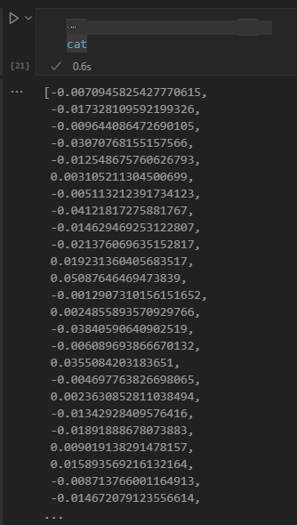

<!--
CO_OP_TRANSLATOR_METADATA:
{
  "original_hash": "b4b0266fbadbba7ded891b6485adc66d",
  "translation_date": "2025-10-17T16:18:47+00:00",
  "source_file": "15-rag-and-vector-databases/README.md",
  "language_code": "tr"
}
-->
# Bilgi Getirme Destekli Üretim (RAG) ve Vektör Veritabanları

[](https://youtu.be/4l8zhHUBeyI?si=BmvDmL1fnHtgQYkL)

Arama uygulamaları dersinde, kendi verilerinizi Büyük Dil Modellerine (LLM'ler) entegre etmenin nasıl yapılacağını kısaca öğrenmiştik. Bu derste, verilerinizi LLM uygulamanıza dayandırma kavramlarını, sürecin mekaniklerini ve verilerin depolanması yöntemlerini, hem gömülü veriler hem de metinler dahil olmak üzere daha ayrıntılı bir şekilde inceleyeceğiz.

> **Video Yakında Geliyor**

## Giriş

Bu derste aşağıdaki konuları ele alacağız:

- RAG'a giriş, ne olduğu ve yapay zekada (AI) neden kullanıldığı.

- Vektör veritabanlarının ne olduğunu anlamak ve uygulamamız için bir tane oluşturmak.

- RAG'ı bir uygulamaya entegre etme üzerine pratik bir örnek.

## Öğrenme Hedefleri

Bu dersi tamamladıktan sonra:

- RAG'ın veri getirme ve işleme açısından önemini açıklayabileceksiniz.

- RAG uygulamasını kurabilecek ve verilerinizi bir LLM'ye dayandırabileceksiniz.

- LLM uygulamalarında RAG ve Vektör Veritabanlarını etkili bir şekilde entegre edebileceksiniz.

## Senaryomuz: LLM'lerimizi kendi verilerimizle geliştirmek

Bu ders için, eğitim girişimimize kendi notlarımızı eklemek istiyoruz, böylece chatbot farklı konular hakkında daha fazla bilgi alabilir. Sahip olduğumuz notları kullanarak, öğrenciler daha iyi çalışabilecek ve farklı konuları anlayabilecek, bu da sınavlarına hazırlanmayı kolaylaştıracaktır. Senaryomuzu oluşturmak için şunları kullanacağız:

- `Azure OpenAI:` Chatbotumuzu oluşturmak için kullanacağımız LLM

- `AI için başlangıç dersi: Sinir Ağları`: LLM'mizi dayandıracağımız veri

- `Azure AI Search` ve `Azure Cosmos DB:` Verilerimizi depolamak ve bir arama dizini oluşturmak için vektör veritabanı

Kullanıcılar notlarından pratik sınavlar oluşturabilecek, revizyon kartları hazırlayabilecek ve bunları kısa özetlere dönüştürebilecek. Başlamak için, RAG'ın ne olduğunu ve nasıl çalıştığını inceleyelim:

## Bilgi Getirme Destekli Üretim (RAG)

Bir LLM destekli chatbot, kullanıcı istemlerini işleyerek yanıtlar üretir. Etkileşimli olacak şekilde tasarlanmıştır ve kullanıcılarla geniş bir konu yelpazesinde iletişim kurar. Ancak, yanıtları sağlanan bağlam ve temel eğitim verileriyle sınırlıdır. Örneğin, GPT-4'ün bilgi kesim tarihi Eylül 2021'dir, yani bu tarihten sonra meydana gelen olaylar hakkında bilgi sahibi değildir. Ayrıca, LLM'leri eğitmek için kullanılan veriler, kişisel notlar veya bir şirketin ürün kılavuzu gibi gizli bilgileri içermez.

### RAG'ların (Bilgi Getirme Destekli Üretim) nasıl çalıştığı


Diyelim ki notlarınızdan sınavlar oluşturan bir chatbot dağıtmak istiyorsunuz, bilgi tabanına bir bağlantı gerekecektir. İşte burada RAG devreye girer. RAG'lar şu şekilde çalışır:

- **Bilgi tabanı:** Getirme işleminden önce, bu belgelerin genellikle büyük belgeleri daha küçük parçalara ayırarak, metin gömülü verilere dönüştürerek ve bir veritabanında depolayarak alınması ve ön işleme tabi tutulması gerekir.

- **Kullanıcı Sorgusu:** Kullanıcı bir soru sorar.

- **Getirme:** Kullanıcı bir soru sorduğunda, gömme modeli bilgi tabanımızdan daha fazla bağlam sağlamak için ilgili bilgileri alır ve isteme dahil eder.

- **Destekli Üretim:** LLM, alınan verilere dayanarak yanıtını geliştirir. Bu, üretilen yanıtın yalnızca önceden eğitilmiş verilere değil, aynı zamanda ek bağlamdan gelen ilgili bilgilere dayanmasını sağlar. Alınan veriler, LLM'nin yanıtlarını desteklemek için kullanılır. LLM daha sonra kullanıcının sorusuna bir yanıt döndürür.


RAG'ların mimarisi, bir kodlayıcı ve bir kod çözücüden oluşan dönüştürücüler kullanılarak uygulanır. Örneğin, bir kullanıcı bir soru sorduğunda, giriş metni 'kodlanır' ve kelimelerin anlamını yakalayan vektörlere dönüştürülür, ardından vektörler belge dizinimize 'kod çözülür' ve kullanıcı sorgusuna dayalı yeni metin oluşturur. LLM, çıktıyı oluşturmak için hem kodlayıcı hem de kod çözücü model kullanır.

Önerilen makaleye göre RAG'ı uygularken iki yaklaşım: [Bilgi Yoğun NLP (doğal dil işleme yazılımı) Görevleri için Bilgi Getirme Destekli Üretim](https://arxiv.org/pdf/2005.11401.pdf?WT.mc_id=academic-105485-koreyst):

- **_RAG-Sequence_** alınan belgeleri kullanarak bir kullanıcı sorgusuna en iyi olası yanıtı tahmin etmek

- **RAG-Token** belgeleri kullanarak bir sonraki token'ı oluşturmak, ardından kullanıcı sorgusuna yanıt vermek için bunları almak

### Neden RAG kullanmalısınız? 

- **Bilgi zenginliği:** metin yanıtlarının güncel ve güncel olmasını sağlar. Bu nedenle, iç bilgi tabanına erişerek alan spesifik görevlerde performansı artırır.

- **Doğrulanabilir veri** kullanarak kullanıcı sorgularına bağlam sağlamak için sahte bilgileri azaltır.

- **Maliyet etkinliği:** LLM'yi ince ayar yapmaya kıyasla daha ekonomiktir.

## Bilgi tabanı oluşturma

Uygulamamız, kişisel verilerimize, yani AI For Beginners müfredatındaki Sinir Ağı dersine dayanmaktadır.

### Vektör Veritabanları

Vektör veritabanı, geleneksel veritabanlarından farklı olarak, gömülü vektörleri depolamak, yönetmek ve aramak için tasarlanmış özel bir veritabanıdır. Belgelerin sayısal temsillerini depolar. Verileri sayısal gömülü verilere ayırmak, AI sistemimizin verileri anlamasını ve işlemesini kolaylaştırır.

Gömülü verilerimizi vektör veritabanlarında depolarız çünkü LLM'lerin giriş olarak kabul ettiği token sayısında bir sınır vardır. Gömülü verilerin tamamını bir LLM'ye aktaramayacağınız için, bunları parçalara ayırmamız gerekecek ve bir kullanıcı bir soru sorduğunda, soruya en çok benzeyen gömülü veriler istemle birlikte döndürülecektir. Parçalama ayrıca bir LLM'den geçen token sayısındaki maliyetleri azaltır.

Popüler vektör veritabanlarından bazıları Azure Cosmos DB, Clarifyai, Pinecone, Chromadb, ScaNN, Qdrant ve DeepLake'dir. Azure CLI kullanarak aşağıdaki komutla bir Azure Cosmos DB modeli oluşturabilirsiniz:

```bash
az login
az group create -n <resource-group-name> -l <location>
az cosmosdb create -n <cosmos-db-name> -r <resource-group-name>
az cosmosdb list-keys -n <cosmos-db-name> -g <resource-group-name>
```

### Metinden gömülü verilere

Verilerimizi depolamadan önce, veritabanında depolanmadan önce vektör gömülü verilere dönüştürmemiz gerekecek. Büyük belgeler veya uzun metinlerle çalışıyorsanız, beklediğiniz sorgulara göre bunları parçalara ayırabilirsiniz. Parçalama cümle düzeyinde veya paragraf düzeyinde yapılabilir. Parçalama, etrafındaki kelimelerden anlamlar çıkardığı için, bir parçaya biraz bağlam ekleyebilirsiniz, örneğin belge başlığını ekleyerek veya parçadan önce veya sonra biraz metin ekleyerek. Verileri şu şekilde parçalara ayırabilirsiniz:

```python
def split_text(text, max_length, min_length):
    words = text.split()
    chunks = []
    current_chunk = []

    for word in words:
        current_chunk.append(word)
        if len(' '.join(current_chunk)) < max_length and len(' '.join(current_chunk)) > min_length:
            chunks.append(' '.join(current_chunk))
            current_chunk = []

    # If the last chunk didn't reach the minimum length, add it anyway
    if current_chunk:
        chunks.append(' '.join(current_chunk))

    return chunks
```

Parçalara ayrıldıktan sonra, metnimizi farklı gömme modelleri kullanarak gömebiliriz. Kullanabileceğiniz bazı modeller şunlardır: word2vec, OpenAI tarafından ada-002, Azure Computer Vision ve daha birçok model. Kullanılacak bir model seçmek, kullandığınız dillere, kodlanan içeriğin türüne (metin/görüntü/ses), kodlayabileceği giriş boyutuna ve gömme çıktısının uzunluğuna bağlı olacaktır.

OpenAI'nin `text-embedding-ada-002` modeli kullanılarak gömülü bir metin örneği:


## Getirme ve Vektör Arama

Bir kullanıcı bir soru sorduğunda, alıcı bunu sorgu kodlayıcı kullanarak bir vektöre dönüştürür, ardından belgelerimizin arama dizininde girişle ilgili belgeler için ilgili vektörleri arar. İşlem tamamlandıktan sonra, hem giriş vektörünü hem de belge vektörlerini metne dönüştürür ve LLM'ye iletir.

### Getirme

Getirme, sistemin arama kriterlerini karşılayan belgeleri dizinden hızlı bir şekilde bulmaya çalıştığında gerçekleşir. Alıcının amacı, bağlam sağlamak ve LLM'yi verilerinize dayandırmak için kullanılacak belgeleri elde etmektir.

Veritabanımızda arama yapmak için birkaç yöntem vardır, örneğin:

- **Anahtar kelime araması** - metin aramaları için kullanılır.

- **Anlamsal arama** - kelimelerin anlamsal anlamını kullanır.

- **Vektör araması** - belgeleri gömme modelleri kullanarak metinden vektör temsillerine dönüştürür. Getirme, kullanıcı sorusuna en yakın vektör temsillerine sahip belgeleri sorgulayarak yapılır.

- **Hibrit** - hem anahtar kelime hem de vektör aramasını birleştirir.

Getirme ile ilgili bir zorluk, veritabanında sorguya benzer bir yanıt olmadığında ortaya çıkar, sistem o zaman elde edebileceği en iyi bilgiyi döndürür, ancak maksimum alaka mesafesini ayarlamak veya hem anahtar kelimeleri hem de vektör aramayı birleştiren hibrit arama kullanmak gibi taktikler kullanabilirsiniz. Bu derste, hem vektör hem de anahtar kelime aramasını birleştiren hibrit arama kullanacağız. Verilerimizi, parçaları ve gömülü verileri içeren sütunlarla bir veri çerçevesine depolayacağız.

### Vektör Benzerliği

Alıcı, bilgi veritabanında birbirine yakın olan gömülü verileri arayacaktır, en yakın komşu, çünkü bunlar benzer metinlerdir. Bir kullanıcı bir sorgu sorduğunda, önce gömülür, ardından benzer gömülü verilerle eşleştirilir. Farklı vektörlerin ne kadar benzer olduğunu bulmak için kullanılan yaygın ölçüm, iki vektör arasındaki açıya dayalı olan kosinüs benzerliğidir.

Benzerliği ölçmek için kullanabileceğimiz diğer alternatifler, vektör uç noktaları arasındaki düz çizgi olan Öklid mesafesi ve iki vektörün karşılık gelen elemanlarının çarpımlarının toplamını ölçen nokta çarpımıdır.

### Arama dizini

Getirme işlemi yaparken, arama yapmadan önce bilgi tabanımız için bir arama dizini oluşturmamız gerekecek. Bir dizin, gömülü verilerimizi depolar ve büyük bir veritabanında bile en benzer parçaları hızlı bir şekilde alabilir. Dizini yerel olarak şu şekilde oluşturabiliriz:

```python
from sklearn.neighbors import NearestNeighbors

embeddings = flattened_df['embeddings'].to_list()

# Create the search index
nbrs = NearestNeighbors(n_neighbors=5, algorithm='ball_tree').fit(embeddings)

# To query the index, you can use the kneighbors method
distances, indices = nbrs.kneighbors(embeddings)
```

### Yeniden sıralama

Veritabanını sorguladıktan sonra, sonuçları en alakalı olanlardan başlayarak sıralamanız gerekebilir. Yeniden sıralama LLM, arama sonuçlarının alaka düzeyini iyileştirmek için bunları en alakalıdan başlayarak sıralamak için Makine Öğrenimi kullanır. Azure AI Search kullanarak, yeniden sıralama sizin için otomatik olarak yapılır ve bir anlamsal yeniden sıralayıcı kullanılır. En yakın komşuları kullanarak yeniden sıralamanın nasıl çalıştığına bir örnek:

```python
# Find the most similar documents
distances, indices = nbrs.kneighbors([query_vector])

index = []
# Print the most similar documents
for i in range(3):
    index = indices[0][i]
    for index in indices[0]:
        print(flattened_df['chunks'].iloc[index])
        print(flattened_df['path'].iloc[index])
        print(flattened_df['distances'].iloc[index])
    else:
        print(f"Index {index} not found in DataFrame")
```

## Hepsini bir araya getirmek

Son adım, LLM'mizi karışıma ekleyerek yanıtların verilerimize dayalı olmasını sağlamaktır. Bunu şu şekilde uygulayabiliriz:

```python
user_input = "what is a perceptron?"

def chatbot(user_input):
    # Convert the question to a query vector
    query_vector = create_embeddings(user_input)

    # Find the most similar documents
    distances, indices = nbrs.kneighbors([query_vector])

    # add documents to query  to provide context
    history = []
    for index in indices[0]:
        history.append(flattened_df['chunks'].iloc[index])

    # combine the history and the user input
    history.append(user_input)

    # create a message object
    messages=[
        {"role": "system", "content": "You are an AI assistant that helps with AI questions."},
        {"role": "user", "content": history[-1]}
    ]

    # use chat completion to generate a response
    response = openai.chat.completions.create(
        model="gpt-4",
        temperature=0.7,
        max_tokens=800,
        messages=messages
    )

    return response.choices[0].message

chatbot(user_input)
```

## Uygulamamızı değerlendirme

### Değerlendirme Ölçütleri

- Yanıtların doğal, akıcı ve insan gibi duyulmasını sağlama kalitesi

- Verilerin dayandırılması: yanıtın sağlanan belgelerden gelip gelmediğini değerlendirme

- Alaka düzeyi: yanıtın sorulan soruyla eşleşip eşleşmediğini ve ilgili olup olmadığını değerlendirme

- Akıcılık - yanıtın dilbilgisel olarak mantıklı olup olmadığını değerlendirme

## RAG (Bilgi Getirme Destekli Üretim) ve vektör veritabanlarını kullanma senaryoları

Fonksiyon çağrılarının uygulamanızı geliştirebileceği birçok farklı kullanım durumu vardır, örneğin:

- Soru ve Cevaplama: şirket verilerinizi bir sohbete dayandırarak çalışanların sorular sorması için kullanılabilir.

- Öneri Sistemleri: en benzer değerleri eşleştiren bir sistem oluşturabileceğiniz yerler, örneğin filmler, restoranlar ve daha fazlası.

- Chatbot hizmetleri: sohbet geçmişini depolayabilir ve kullanıcı verilerine dayalı olarak konuşmayı kişiselleştirebilirsiniz.

- Görüntü tanıma ve anomali tespiti yaparken faydalı olan vektör gömülü verilere dayalı görüntü arama.

## Özet

Bu derste, verilerimizi uygulamaya eklemekten, kullanıcı sorgusuna ve çıktısına kadar RAG'ın temel alanlarını ele aldık. RAG oluşturmayı basitleştirmek için Semanti Kernel, Langchain veya Autogen gibi çerçeveler kullanabilirsiniz.

## Ödev

Bilgi Getirme Destekli Üretim (RAG) öğreniminize devam etmek için şunları yapabilirsiniz:

- Seçtiğiniz bir çerçeveyi kullanarak uygulama için bir ön yüz oluşturun.

- LangChain veya Semantic Kernel çerçevesini kullanarak uygulamanızı yeniden oluşturun.

Dersi tamamladığınız için tebrikler 👏.

## Öğrenme burada bitmiyor, yolculuğa devam edin

Bu dersi tamamladıktan sonra, Generative AI bilginizi geliştirmeye devam etmek için [Generative AI Öğrenme koleksiyonumuzu](https://aka.ms/genai-collection?WT.mc_id=academic-105485-koreyst) inceleyin!

---

**Feragatname**:  
Bu belge, AI çeviri hizmeti [Co-op Translator](https://github.com/Azure/co-op-translator) kullanılarak çevrilmiştir. Doğruluk için çaba göstersek de, otomatik çevirilerin hata veya yanlışlık içerebileceğini lütfen unutmayın. Belgenin orijinal dili, yetkili kaynak olarak kabul edilmelidir. Kritik bilgiler için profesyonel insan çevirisi önerilir. Bu çevirinin kullanımından kaynaklanan yanlış anlamalar veya yanlış yorumlamalar için sorumluluk kabul etmiyoruz.