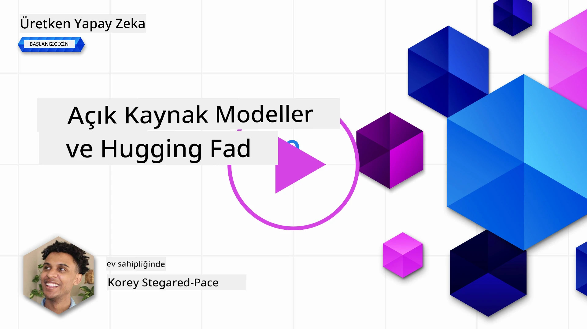
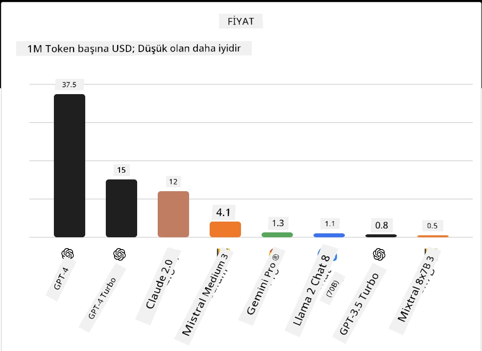
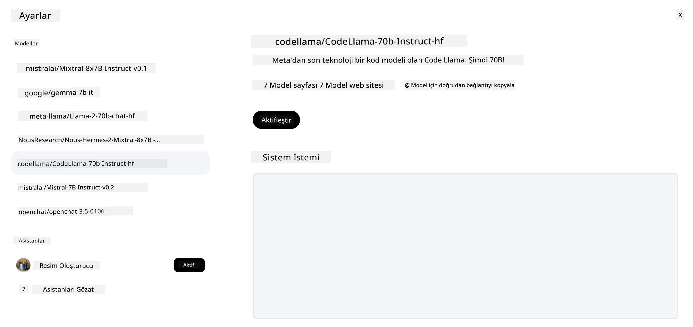
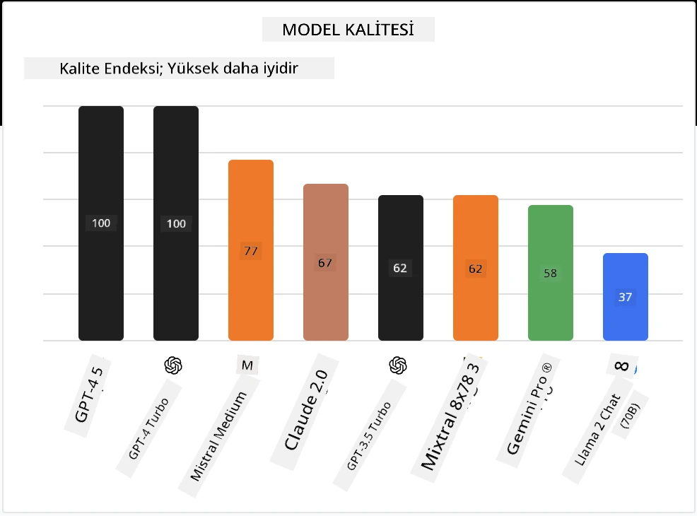

## Giriş

Açık kaynak LLM dünyası heyecan verici ve sürekli gelişmektedir. Bu ders, açık kaynak modellerine derinlemesine bir bakış sağlamayı amaçlamaktadır. Özel modellerin açık kaynak modellerle nasıl karşılaştırıldığı hakkında bilgi arıyorsanız, ["Farklı LLM'leri Keşfetme ve Karşılaştırma" dersi](../02-exploring-and-comparing-different-llms/README.md?WT.mc_id=academic-105485-koreyst) sayfasına gidin. Bu ders ayrıca ince ayar konusunu da kapsayacak, ancak daha ayrıntılı bir açıklama ["LLM'leri İnce Ayarlama" dersi](../18-fine-tuning/README.md?WT.mc_id=academic-105485-koreyst) içinde bulunabilir.

## Öğrenme hedefleri

- Açık kaynak Modeller hakkında anlayış kazanmak
- Açık kaynak Modellerle çalışmanın faydalarını anlamak
- Hugging Face ve Microsoft Foundry model kataloğunda bulunan açık modelleri keşfetmek

## Açık Kaynak Modeller Nedir?

Açık kaynak yazılım, çeşitli alanlarda teknolojinin büyümesinde kritik bir rol oynamıştır. Açık Kaynak Girişimi (OSI), yazılımın açık kaynak olarak sınıflandırılması için [10 kriter belirlemiştir](https://web.archive.org/web/20241126001143/https://opensource.org/osd?WT.mc_id=academic-105485-koreyst). Kaynak kodu, OSI tarafından onaylanmış bir lisans altında açıkça paylaşılmalıdır.

LLM geliştirme süreci yazılım geliştirmeye benzer öğeler taşırken, süreç tam olarak aynı değildir. Bu, LLM bağlamında açık kaynak tanımı üzerine toplulukta çok tartışma yaratmıştır. Bir modelin geleneksel açık kaynak tanımıyla uyumlu olması için aşağıdaki bilgiler herkese açık olmalıdır:

- Modeli eğitmek için kullanılan veri setleri.
- Eğitim sırasında kullanılan tam model ağırlıkları.
- Değerlendirme kodu.
- İnce ayar kodu.
- Tam model ağırlıkları ve eğitim metrikleri.

Şu anda bu kriterlere uyan sadece birkaç model bulunmaktadır. [Allen Institute for Artificial Intelligence (AllenAI) tarafından oluşturulan OLMo modeli](https://huggingface.co/allenai/OLMo-7B?WT.mc_id=academic-105485-koreyst) bu kategoriye uygundur.

Bu ders için, modeller yazıldığı zamanda yukarıdaki kriterlere tam olarak uymayabileceği için, ilerleyen bölümlerde “açık modeller” olarak adlandırılacaktır.

## Açık Modellerin Faydaları

**Yüksek Özelleştirilebilirlik** - Açık modeller ayrıntılı eğitim bilgileriyle sunulduğundan, araştırmacılar ve geliştiriciler modelin iç yapısını değiştirebilir. Bu, belirli bir görev veya çalışma alanı için ince ayar yapılmış oldukça özel modellerin oluşturulmasını sağlar. Bunun örnekleri arasında kod üretimi, matematiksel işlemler ve biyoloji bulunmaktadır.

**Maliyet** - Bu modelleri kullanma ve dağıtma maliyeti, özel modellere göre token başına daha düşüktür. Üretken Yapay Zeka uygulamaları geliştirirken, kullanım durumunuzda performans ve fiyat arasında bir değerlendirme yapılmalıdır.

Kaynak: Artificial Analysis

**Esneklik** - Açık modellerle çalışmak, farklı modelleri kullanma veya bunları birleştirme konusunda size esneklik sağlar. Bunun örneği, kullanıcıların arayüz üzerinden kullanılan modeli doğrudan seçebildiği [HuggingChat Asistanları](https://huggingface.co/chat?WT.mc_id=academic-105485-koreyst)dır:

## Farklı Açık Modelleri Keşfetmek

### Llama 2

Meta tarafından geliştirilen [LLama2](https://huggingface.co/meta-llama?WT.mc_id=academic-105485-koreyst), sohbet tabanlı uygulamalar için optimize edilmiş bir açık modeldir. Bu, modele büyük miktarda diyalog ve insan geri bildirimi ile ince ayar yapılmasından kaynaklanmaktadır. Bu yöntemle model, insan beklentisine daha uyumlu sonuçlar üretir ve bu da daha iyi bir kullanıcı deneyimi sağlar.

Llama'nın bazı ince ayar yapılmış versiyonları arasında, Japoncaya özel olan [Japanese Llama](https://huggingface.co/elyza/ELYZA-japanese-Llama-2-7b?WT.mc_id=academic-105485-koreyst) ve temel modelin geliştirilmiş sürümü olan [Llama Pro](https://huggingface.co/TencentARC/LLaMA-Pro-8B?WT.mc_id=academic-105485-koreyst) bulunmaktadır.

### Mistral

Yüksek performans ve etkinliğe güçlü odaklanan [Mistral](https://huggingface.co/mistralai?WT.mc_id=academic-105485-koreyst) bir açık modeldir. Mixture-of-Experts yaklaşımını kullanır; bu, özel uzman modelleri bir sistemde birleştirir ve girdiye bağlı olarak belirli modeller seçilir ve kullanılır. Bu, hesaplamayı daha etkili kılar çünkü modeller yalnızca uzman oldukları girdilerle ilgilenirler.

Mistral'ın bazı ince ayar yapılmış versiyonları arasında, tıbbi alana odaklanan [BioMistral](https://huggingface.co/BioMistral/BioMistral-7B?text=Mon+nom+est+Thomas+et+mon+principal?WT.mc_id=academic-105485-koreyst) ve matematiksel işlemleri gerçekleştiren [OpenMath Mistral](https://huggingface.co/nvidia/OpenMath-Mistral-7B-v0.1-hf?WT.mc_id=academic-105485-koreyst) yer almaktadır.

### Falcon

Teknoloji İnovasyon Enstitüsü (**TII**) tarafından oluşturulan [Falcon](https://huggingface.co/tiiuae?WT.mc_id=academic-105485-koreyst), 40 milyar parametrede eğitilen Falcon-40B modeliyle GPT-3'ten daha düşük hesaplama bütçesiyle daha iyi performans göstermiştir. Bunun sebebi, FlashAttention algoritması ve çıkarım süresi bellek gereksinimlerini azaltan çoklu sorgu dikkat mekanizmasının kullanılmasıdır. Azalan çıkarım süresiyle Falcon-40B, sohbet uygulamaları için uygundur.

Falcon'un ince ayar yapılmış versiyonlarına örnek olarak, açık modellere dayanan bir asistan olan [OpenAssistant](https://huggingface.co/OpenAssistant/falcon-40b-sft-top1-560?WT.mc_id=academic-105485-koreyst) ve temel modelden daha yüksek performans sunan [GPT4ALL](https://huggingface.co/nomic-ai/gpt4all-falcon?WT.mc_id=academic-105485-koreyst) verilebilir.

## Nasıl Seçim Yapılır

Açık model seçimi için tek bir doğru cevap yoktur. İyi bir başlangıç noktası, Microsoft Foundry model kataloğundaki görev filtreleme özelliğini kullanmaktır. Bu, modelin hangi görevler için eğitildiğini anlamanıza yardımcı olur. Hugging Face ayrıca belirli metriklere göre en iyi performans gösteren modelleri gösteren bir LLM Liderlik Tablosu tutmaktadır.

Farklı türlerdeki LLM'leri karşılaştırmak için [Artificial Analysis](https://artificialanalysis.ai/?WT.mc_id=academic-105485-koreyst) de harika bir kaynaktır:

Kaynak: Artificial Analysis

Belirli bir kullanım durumu üzerinde çalışıyorsanız, aynı alana odaklanmış ince ayar yapılmış modelleri aramak etkili olabilir. Birden fazla açık modeli deneyerek, sizin ve kullanıcılarınızın beklentilerine göre nasıl performans gösterdiğini görmek de iyi bir uygulamadır.

## Sonraki Adımlar

Açık modellerin en güzel kısmı, onlarla hızlıca çalışmaya başlayabilmenizdir. Burada tartıştığımız modelleri içeren özel bir Hugging Face koleksiyonunu barındıran [Microsoft Foundry model kataloğunu](https://ai.azure.com?WT.mc_id=academic-105485-koreyst) inceleyin.

## Öğrenme burada bitmez, yolculuğa devam edin

Bu dersi tamamladıktan sonra, Üretken Yapay Zeka bilginizi geliştirmeye devam etmek için [Generative AI Öğrenme koleksiyonumuzu](https://aka.ms/genai-collection?WT.mc_id=academic-105485-koreyst) keşfedin!

---

<!-- CO-OP TRANSLATOR DISCLAIMER START -->
**Feragatname**:
Bu belge, AI çeviri hizmeti [Co-op Translator](https://github.com/Azure/co-op-translator) kullanılarak çevrilmiştir. Doğruluk için çaba sarf etsek de, otomatik çevirilerin hata veya yanlışlık içerebileceğini lütfen unutmayınız. Orijinal belge, kendi dilinde yetkili kaynak olarak kabul edilmelidir. Kritik bilgiler için profesyonel insan çevirisi önerilir. Bu çevirinin kullanımı sonucu ortaya çıkabilecek yanlış anlamalardan veya yanlış yorumlamalardan sorumlu değiliz.
<!-- CO-OP TRANSLATOR DISCLAIMER END -->