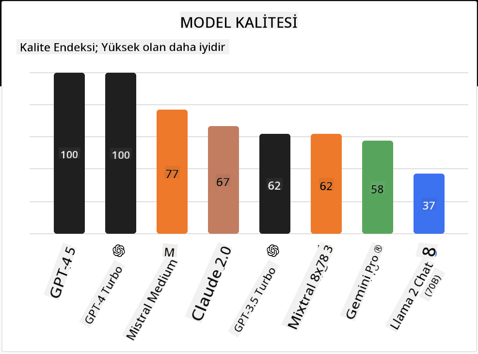

<!--
CO_OP_TRANSLATOR_METADATA:
{
  "original_hash": "85b754d4dc980f270f264d17116d9a5f",
  "translation_date": "2025-12-19T14:55:45+00:00",
  "source_file": "16-open-source-models/README.md",
  "language_code": "tr"
}
-->

## Giriş

Açık kaynak LLM dünyası heyecan verici ve sürekli gelişiyor. Bu ders, açık kaynak modellerine derinlemesine bir bakış sağlamayı amaçlamaktadır. Eğer özel modellerin açık kaynak modellerle nasıl karşılaştırıldığı hakkında bilgi arıyorsanız, ["Farklı LLM'leri Keşfetme ve Karşılaştırma" dersine](../02-exploring-and-comparing-different-llms/README.md?WT.mc_id=academic-105485-koreyst) gidin. Bu ders ayrıca ince ayar konusunu da kapsayacak, ancak daha ayrıntılı açıklama ["LLM'lerin İnce Ayarı" dersinde](../18-fine-tuning/README.md?WT.mc_id=academic-105485-koreyst) bulunabilir.

## Öğrenme hedefleri

- Açık kaynak Modelleri anlama
- Açık kaynak Modellerle çalışmanın faydalarını anlama
- Hugging Face ve Azure AI Studio'da mevcut açık modelleri keşfetme

## Açık Kaynak Modeller Nedir?

Açık kaynak yazılım, çeşitli alanlarda teknolojinin büyümesinde kritik bir rol oynamıştır. Açık Kaynak Girişimi (OSI), [yazılımın açık kaynak olarak sınıflandırılması için 10 kriter](https://web.archive.org/web/20241126001143/https://opensource.org/osd?WT.mc_id=academic-105485-koreyst) tanımlamıştır. Kaynak kodu, OSI tarafından onaylanmış bir lisans altında açıkça paylaşılmalıdır.

LLM'lerin geliştirilmesi yazılım geliştirmeye benzer unsurlar içerse de süreç tam olarak aynı değildir. Bu, toplulukta LLM bağlamında açık kaynak tanımı üzerine çokça tartışmaya yol açmıştır. Bir modelin geleneksel açık kaynak tanımıyla uyumlu olması için aşağıdaki bilgilerin kamuya açık olması gerekir:

- Modeli eğitmek için kullanılan veri setleri.
- Eğitimin bir parçası olarak tam model ağırlıkları.
- Değerlendirme kodu.
- İnce ayar kodu.
- Tam model ağırlıkları ve eğitim metrikleri.

Şu anda bu kriterlere uyan sadece birkaç model bulunmaktadır. [Allen Institute for Artificial Intelligence (AllenAI) tarafından oluşturulan OLMo modeli](https://huggingface.co/allenai/OLMo-7B?WT.mc_id=academic-105485-koreyst) bu kategoriye uyan bir modeldir.

Bu ders için, yazım sırasında yukarıdaki kriterlere uymayabilecekleri için modellere "açık modeller" olarak atıfta bulunacağız.

## Açık Modellerin Faydaları

**Yüksek Özelleştirilebilirlik** - Açık modeller ayrıntılı eğitim bilgileriyle yayınlandığından, araştırmacılar ve geliştiriciler modelin iç yapısını değiştirebilir. Bu, belirli bir görev veya çalışma alanı için ince ayar yapılmış yüksek derecede uzmanlaşmış modellerin oluşturulmasını sağlar. Bunun bazı örnekleri kod üretimi, matematiksel işlemler ve biyolojidir.

**Maliyet** - Bu modelleri kullanmanın ve dağıtmanın token başına maliyeti, özel modellere göre daha düşüktür. Üretken AI uygulamaları geliştirirken, bu modellerle kullanım durumunuzda performans ve fiyat karşılaştırması yapmak önemlidir.

Kaynak: Artificial Analysis

**Esneklik** - Açık modellerle çalışmak, farklı modelleri kullanma veya birleştirme konusunda esneklik sağlar. Bunun bir örneği, kullanıcıların arayüzde doğrudan kullanılan modeli seçebildiği [HuggingChat Asistanlarıdır](https://huggingface.co/chat?WT.mc_id=academic-105485-koreyst):

## Farklı Açık Modelleri Keşfetmek

### Llama 2

Meta tarafından geliştirilen [Llama2](https://huggingface.co/meta-llama?WT.mc_id=academic-105485-koreyst), sohbet tabanlı uygulamalar için optimize edilmiş açık bir modeldir. Bu, büyük miktarda diyalog ve insan geri bildirimi içeren ince ayar yöntemi sayesinde gerçekleşmiştir. Bu yöntemle model, insan beklentilerine daha uygun sonuçlar üretir ve daha iyi bir kullanıcı deneyimi sağlar.

Llama'nın ince ayarlı bazı versiyonları arasında Japonca uzmanlaşmış [Japanese Llama](https://huggingface.co/elyza/ELYZA-japanese-Llama-2-7b?WT.mc_id=academic-105485-koreyst) ve temel modelin geliştirilmiş versiyonu olan [Llama Pro](https://huggingface.co/TencentARC/LLaMA-Pro-8B?WT.mc_id=academic-105485-koreyst) bulunmaktadır.

### Mistral

[Mistral](https://huggingface.co/mistralai?WT.mc_id=academic-105485-koreyst), yüksek performans ve verimliliğe güçlü odaklanan açık bir modeldir. Mixture-of-Experts yaklaşımını kullanır; bu, uzmanlaşmış modeller grubunu tek bir sistemde birleştirir ve girdiye bağlı olarak belirli modeller seçilir. Bu, hesaplamayı daha etkili hale getirir çünkü modeller yalnızca uzman oldukları girdilerle ilgilenir.

Mistral'ın ince ayarlı bazı versiyonları arasında tıbbi alana odaklanan [BioMistral](https://huggingface.co/BioMistral/BioMistral-7B?text=Mon+nom+est+Thomas+et+mon+principal?WT.mc_id=academic-105485-koreyst) ve matematiksel hesaplama yapan [OpenMath Mistral](https://huggingface.co/nvidia/OpenMath-Mistral-7B-v0.1-hf?WT.mc_id=academic-105485-koreyst) bulunmaktadır.

### Falcon

Teknoloji İnovasyon Enstitüsü (**TII**) tarafından oluşturulan [Falcon](https://huggingface.co/tiiuae?WT.mc_id=academic-105485-koreyst) bir LLM'dir. Falcon-40B, 40 milyar parametre üzerinde eğitilmiştir ve daha az hesaplama bütçesiyle GPT-3'ten daha iyi performans gösterdiği kanıtlanmıştır. Bu, FlashAttention algoritması ve çıkarım zamanında bellek gereksinimlerini azaltan çoklu sorgu dikkat mekanizması kullanımı sayesinde mümkün olmuştur. Azaltılmış çıkarım süresi ile Falcon-40B sohbet uygulamaları için uygundur.

Falcon'un ince ayarlı bazı versiyonları arasında açık modeller üzerine inşa edilmiş bir asistan olan [OpenAssistant](https://huggingface.co/OpenAssistant/falcon-40b-sft-top1-560?WT.mc_id=academic-105485-koreyst) ve temel modelden daha yüksek performans sunan [GPT4ALL](https://huggingface.co/nomic-ai/gpt4all-falcon?WT.mc_id=academic-105485-koreyst) bulunmaktadır.

## Nasıl Seçilir

Açık model seçmek için tek bir doğru cevap yoktur. Başlamak için iyi bir yer, Azure AI Studio'nun görev bazlı filtreleme özelliğini kullanmaktır. Bu, modelin hangi tür görevler için eğitildiğini anlamanıza yardımcı olur. Hugging Face ayrıca belirli metriklere göre en iyi performans gösteren modelleri gösteren bir LLM Lider Tablosu tutmaktadır.

Farklı türlerde LLM'leri karşılaştırmak için [Artificial Analysis](https://artificialanalysis.ai/?WT.mc_id=academic-105485-koreyst) başka harika bir kaynaktır:

Kaynak: Artificial Analysis

Belirli bir kullanım durumu üzerinde çalışıyorsanız, aynı alana odaklanmış ince ayarlı versiyonları aramak etkili olabilir. Birden fazla açık modeli deneyerek sizin ve kullanıcılarınızın beklentilerine göre nasıl performans gösterdiklerini görmek de iyi bir uygulamadır.

## Sonraki Adımlar

Açık modellerle çalışmaya başlamak en iyi yanı, bunlarla oldukça hızlı bir şekilde çalışmaya başlayabilmenizdir. Burada tartıştığımız modelleri içeren özel bir Hugging Face koleksiyonunu barındıran [Azure AI Foundry Model Kataloğu](https://ai.azure.com?WT.mc_id=academic-105485-koreyst)'na göz atın.

## Öğrenme burada bitmez, yolculuğa devam edin

Bu dersi tamamladıktan sonra, Üretken AI bilginizi geliştirmeye devam etmek için [Generative AI Öğrenme koleksiyonumuza](https://aka.ms/genai-collection?WT.mc_id=academic-105485-koreyst) göz atın!

---

<!-- CO-OP TRANSLATOR DISCLAIMER START -->
**Feragatname**:  
Bu belge, AI çeviri servisi [Co-op Translator](https://github.com/Azure/co-op-translator) kullanılarak çevrilmiştir. Doğruluk için çaba göstersek de, otomatik çevirilerin hatalar veya yanlışlıklar içerebileceğini lütfen unutmayınız. Orijinal belge, kendi dilinde yetkili kaynak olarak kabul edilmelidir. Kritik bilgiler için profesyonel insan çevirisi önerilir. Bu çevirinin kullanımı sonucu oluşabilecek yanlış anlamalar veya yorum hatalarından sorumlu değiliz.
<!-- CO-OP TRANSLATOR DISCLAIMER END -->