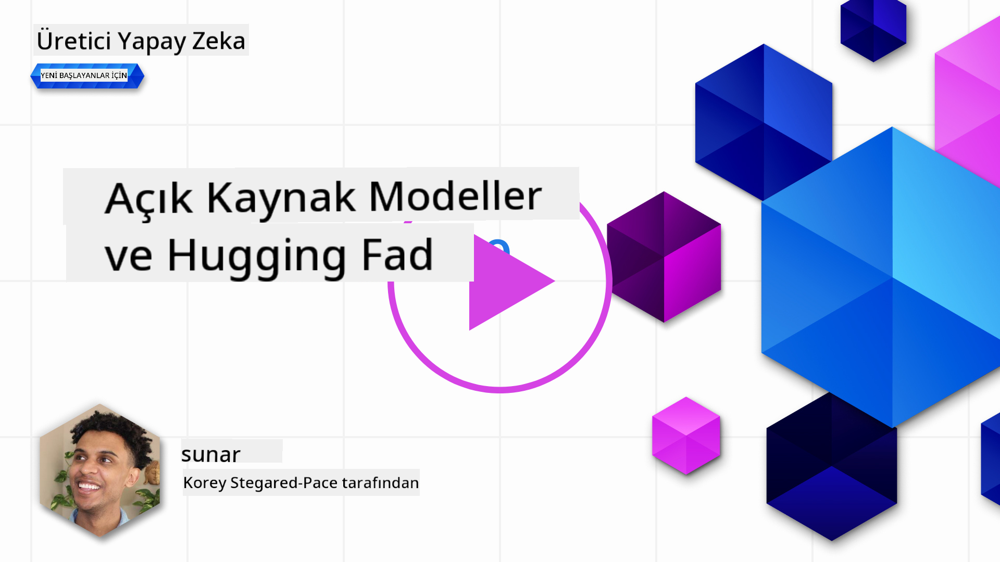
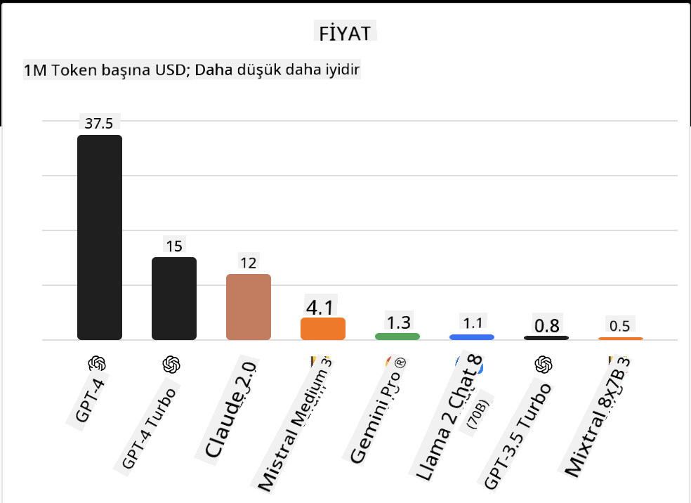

<!--
CO_OP_TRANSLATOR_METADATA:
{
  "original_hash": "0bba96e53ab841d99db731892a51fab8",
  "translation_date": "2025-07-09T17:09:36+00:00",
  "source_file": "16-open-source-models/README.md",
  "language_code": "tr"
}
-->

## Giriş

Açık kaynak LLM dünyası heyecan verici ve sürekli gelişiyor. Bu ders, açık kaynak modellerine derinlemesine bir bakış sunmayı amaçlıyor. Eğer tescilli modellerin açık kaynak modellerle nasıl karşılaştırıldığı hakkında bilgi arıyorsanız, ["Farklı LLM’leri Keşfetme ve Karşılaştırma" dersi](../02-exploring-and-comparing-different-llms/README.md?WT.mc_id=academic-105485-koreyst) sayfasına göz atabilirsiniz. Bu ders ayrıca ince ayar (fine-tuning) konusunu da ele alacak, ancak daha detaylı açıklama için ["LLM’lerin İnce Ayarı" dersi](../18-fine-tuning/README.md?WT.mc_id=academic-105485-koreyst) incelenebilir.

## Öğrenme hedefleri

- Açık kaynak Modelleri anlamak
- Açık kaynak Modellerle çalışmanın avantajlarını kavramak
- Hugging Face ve Azure AI Studio’da bulunan açık modelleri keşfetmek

## Açık Kaynak Modeller Nedir?

Açık kaynak yazılım, çeşitli alanlarda teknolojinin gelişiminde önemli bir rol oynamıştır. Open Source Initiative (OSI), yazılımların açık kaynak olarak sınıflandırılması için [10 kriter](https://web.archive.org/web/20241126001143/https://opensource.org/osd?WT.mc_id=academic-105485-koreyst) belirlemiştir. Kaynak kodu, OSI tarafından onaylanmış bir lisans altında açıkça paylaşılmalıdır.

LLM geliştirme süreci yazılım geliştirmeye benzer unsurlar taşısa da tamamen aynı değildir. Bu durum, toplulukta LLM’ler bağlamında açık kaynak tanımının ne olduğu konusunda çokça tartışmaya yol açmıştır. Geleneksel açık kaynak tanımıyla uyumlu bir model için aşağıdaki bilgilerin kamuya açık olması gerekir:

- Modelin eğitildiği veri setleri.
- Eğitim sürecinin bir parçası olarak tam model ağırlıkları.
- Değerlendirme kodu.
- İnce ayar (fine-tuning) kodu.
- Tam model ağırlıkları ve eğitim metrikleri.

Şu anda bu kriterlere uyan sadece birkaç model bulunmaktadır. [Allen Institute for Artificial Intelligence (AllenAI) tarafından oluşturulan OLMo modeli](https://huggingface.co/allenai/OLMo-7B?WT.mc_id=academic-105485-koreyst) bu kategoriye uyan modellerden biridir.

Bu ders için, yazım anında yukarıdaki kriterlere tam uymayabilecekleri için modelleri “açık modeller” olarak adlandıracağız.

## Açık Modellerin Avantajları

**Yüksek Özelleştirilebilirlik** - Açık modeller, detaylı eğitim bilgileriyle yayınlandığı için araştırmacılar ve geliştiriciler modelin iç yapısını değiştirebilir. Bu, belirli bir görev veya çalışma alanı için ince ayar yapılmış, yüksek derecede uzmanlaşmış modeller oluşturmayı mümkün kılar. Örnekler arasında kod üretimi, matematiksel işlemler ve biyoloji yer alır.

**Maliyet** - Bu modelleri kullanmanın ve dağıtmanın token başına maliyeti, tescilli modellere göre daha düşüktür. Üretken AI uygulamaları geliştirirken, kullanım durumunuza göre bu modellerle çalışırken performans ve fiyat dengesi göz önünde bulundurulmalıdır.

  
Kaynak: Artificial Analysis

**Esneklik** - Açık modellerle çalışmak, farklı modelleri kullanma veya birleştirme konusunda esneklik sağlar. Örneğin, [HuggingChat Asistanları](https://huggingface.co/chat?WT.mc_id=academic-105485-koreyst) kullanıcı arayüzünde doğrudan kullanılacak modeli seçme imkanı sunar:

## Farklı Açık Modelleri Keşfetmek

### Llama 2

[LLama2](https://huggingface.co/meta-llama?WT.mc_id=academic-105485-koreyst), Meta tarafından geliştirilen, sohbet tabanlı uygulamalara optimize edilmiş bir açık modeldir. Bu, modelin büyük miktarda diyalog ve insan geri bildirimi içeren ince ayar yöntemi sayesinde mümkün olmuştur. Bu yöntemle model, insan beklentilerine daha uygun sonuçlar üretir ve daha iyi bir kullanıcı deneyimi sağlar.

Llama’nın ince ayar yapılmış bazı versiyonları arasında Japonca’ya odaklanan [Japanese Llama](https://huggingface.co/elyza/ELYZA-japanese-Llama-2-7b?WT.mc_id=academic-105485-koreyst) ve temel modelin geliştirilmiş versiyonu olan [Llama Pro](https://huggingface.co/TencentARC/LLaMA-Pro-8B?WT.mc_id=academic-105485-koreyst) yer alır.

### Mistral

[Mistral](https://huggingface.co/mistralai?WT.mc_id=academic-105485-koreyst), yüksek performans ve verimliliğe odaklanan açık bir modeldir. Mixture-of-Experts yaklaşımını kullanır; bu yöntem, uzmanlaşmış modellerden oluşan bir grubu tek bir sistemde birleştirir ve girdiye bağlı olarak belirli modeller seçilerek kullanılır. Bu sayede hesaplama daha etkili hale gelir çünkü modeller sadece uzman oldukları girdilerle ilgilenir.

Mistral’ın ince ayar yapılmış bazı versiyonları arasında tıp alanına odaklanan [BioMistral](https://huggingface.co/BioMistral/BioMistral-7B?text=Mon+nom+est+Thomas+et+mon+principal?WT.mc_id=academic-105485-koreyst) ve matematiksel hesaplama yapan [OpenMath Mistral](https://huggingface.co/nvidia/OpenMath-Mistral-7B-v0.1-hf?WT.mc_id=academic-105485-koreyst) bulunur.

### Falcon

[Falcon](https://huggingface.co/tiiuae?WT.mc_id=academic-105485-koreyst), Technology Innovation Institute (**TII**) tarafından oluşturulan bir LLM’dir. Falcon-40B, 40 milyar parametre üzerinde eğitilmiştir ve daha az hesaplama bütçesiyle GPT-3’ten daha iyi performans gösterdiği kanıtlanmıştır. Bunun sebebi, FlashAttention algoritması ve çoklu sorgu dikkat mekanizması kullanarak çıkarım sırasında bellek gereksinimlerini azaltmasıdır. Bu azalmış çıkarım süresi sayesinde Falcon-40B sohbet uygulamaları için uygundur.

Falcon’un ince ayar yapılmış bazı versiyonları arasında açık modeller üzerine inşa edilmiş bir asistan olan [OpenAssistant](https://huggingface.co/OpenAssistant/falcon-40b-sft-top1-560?WT.mc_id=academic-105485-koreyst) ve temel modelden daha yüksek performans sunan [GPT4ALL](https://huggingface.co/nomic-ai/gpt4all-falcon?WT.mc_id=academic-105485-koreyst) yer alır.

## Nasıl Seçim Yapılır?

Açık model seçmek için tek bir doğru cevap yoktur. Başlamak için iyi bir yer, Azure AI Studio’nun görev bazlı filtreleme özelliğini kullanmaktır. Bu, modelin hangi tür görevler için eğitildiğini anlamanıza yardımcı olur. Hugging Face ayrıca belirli metriklere göre en iyi performans gösteren modelleri gösteren bir LLM Lider Tablosu tutmaktadır.

Farklı türlerdeki LLM’leri karşılaştırmak için [Artificial Analysis](https://artificialanalysis.ai/?WT.mc_id=academic-105485-koreyst) de harika bir kaynaktır:

  
Kaynak: Artificial Analysis

Belirli bir kullanım durumu üzerinde çalışıyorsanız, aynı alana odaklanmış ince ayar yapılmış versiyonları aramak etkili olabilir. Birden fazla açık modeli deneyerek sizin ve kullanıcılarınızın beklentilerine göre nasıl performans gösterdiklerini görmek de iyi bir uygulamadır.

## Sonraki Adımlar

Açık modellerin en güzel yanı, onlarla çalışmaya oldukça hızlı başlayabilmenizdir. Burada bahsettiğimiz modelleri içeren özel bir Hugging Face koleksiyonuna sahip [Azure AI Studio Model Kataloğu](https://ai.azure.com?WT.mc_id=academic-105485-koreyst) sayfasını inceleyin.

## Öğrenme burada bitmiyor, yolculuğa devam edin

Bu dersi tamamladıktan sonra, Üretken AI bilginizi geliştirmeye devam etmek için [Generative AI Learning koleksiyonumuza](https://aka.ms/genai-collection?WT.mc_id=academic-105485-koreyst) göz atın!

**Feragatname**:  
Bu belge, AI çeviri servisi [Co-op Translator](https://github.com/Azure/co-op-translator) kullanılarak çevrilmiştir. Doğruluk için çaba göstersek de, otomatik çevirilerin hatalar veya yanlışlıklar içerebileceğini lütfen unutmayın. Orijinal belge, kendi dilinde yetkili kaynak olarak kabul edilmelidir. Kritik bilgiler için profesyonel insan çevirisi önerilir. Bu çevirinin kullanımı sonucu ortaya çıkabilecek yanlış anlamalar veya yorum hatalarından sorumlu değiliz.