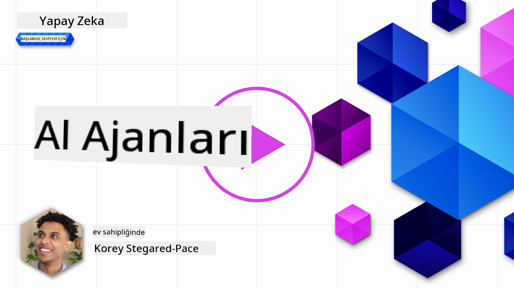
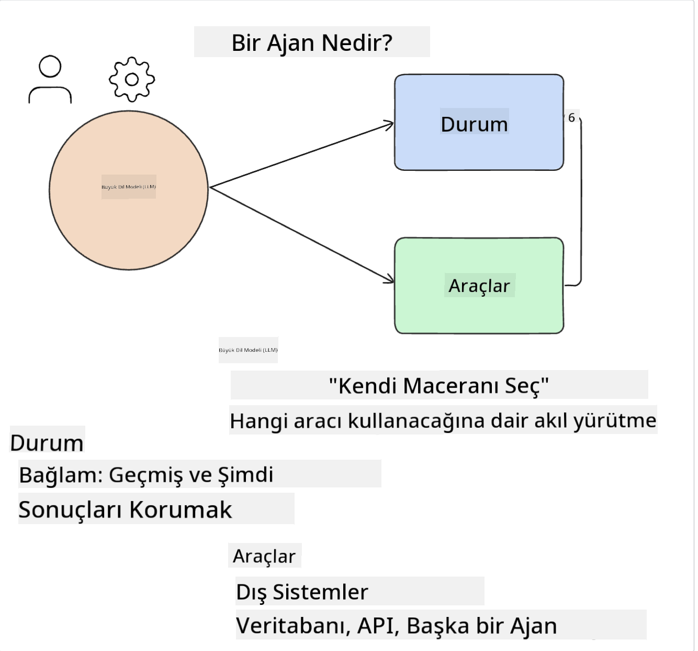
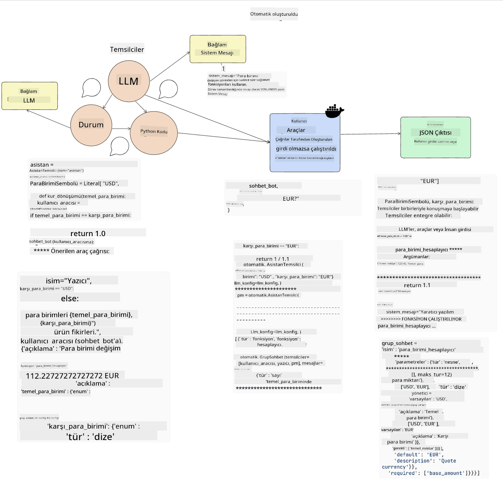
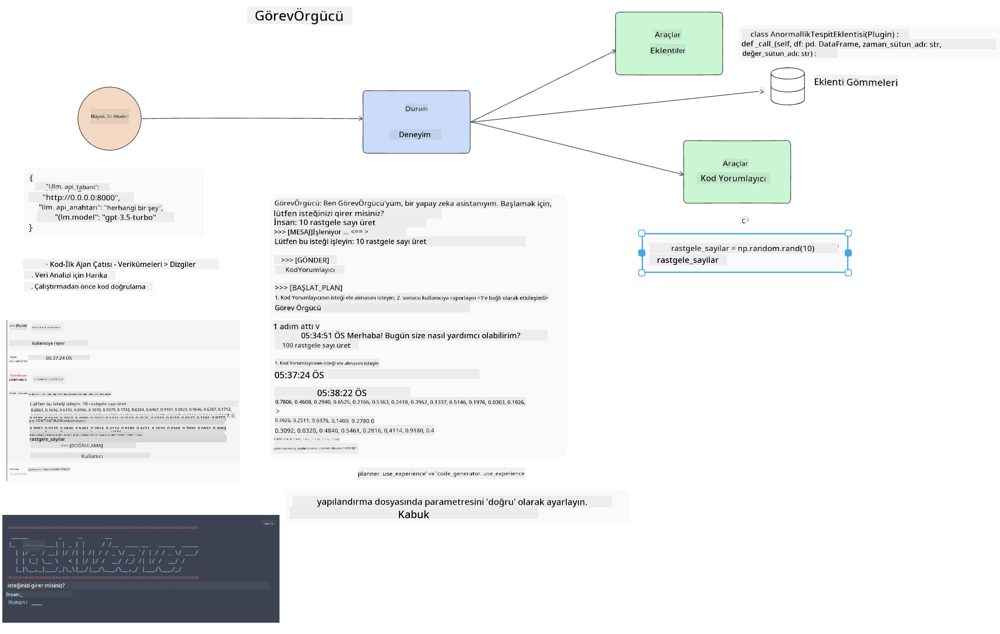
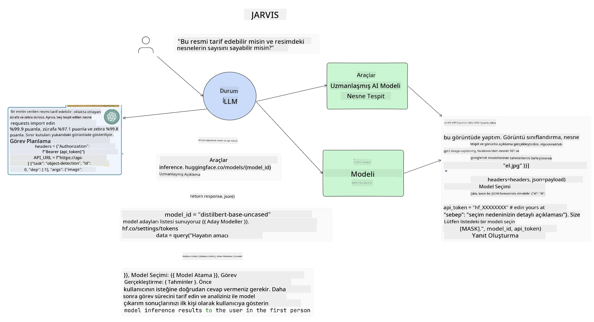

<!--
CO_OP_TRANSLATOR_METADATA:
{
  "original_hash": "11f03c81f190d9cbafd0f977dcbede6c",
  "translation_date": "2025-05-20T07:23:13+00:00",
  "source_file": "17-ai-agents/README.md",
  "language_code": "tr"
}
-->
[](https://aka.ms/gen-ai-lesson17-gh?WT.mc_id=academic-105485-koreyst)

## Giriş

Yapay Zeka (AI) Temsilcileri, Generative AI'deki heyecan verici bir gelişmeyi temsil eder, Büyük Dil Modelleri'nin (LLM'ler) yardımcılar olmaktan eylem yapabilen temsilcilere dönüşmesini sağlar. AI Temsilci çerçeveleri, geliştiricilerin LLM'lere araçlara ve durum yönetimine erişim sağlayan uygulamalar oluşturmasına olanak tanır. Bu çerçeveler ayrıca görünürlüğü artırarak kullanıcıların ve geliştiricilerin LLM'ler tarafından planlanan eylemleri izlemesine olanak tanır, böylece deneyim yönetimini iyileştirir.

Ders şu alanları kapsayacaktır:

- AI Temsilcisi nedir - AI Temsilcisi tam olarak nedir?
- Dört farklı AI Temsilci Çerçevesini keşfetmek - Onları benzersiz kılan nedir?
- Bu AI Temsilcilerini farklı kullanım senaryolarına uygulamak - AI Temsilcilerini ne zaman kullanmalıyız?

## Öğrenme hedefleri

Bu dersi aldıktan sonra, şunları yapabileceksiniz:

- AI Temsilcilerinin ne olduğunu ve nasıl kullanılabileceklerini açıklayın.
- Popüler AI Temsilci Çerçevelerinden bazılarının farklarını ve nasıl farklılaştıklarını anlayın.
- AI Temsilcilerinin nasıl işlediğini anlayarak onlarla uygulamalar oluşturun.

## AI Temsilcileri Nedir?

AI Temsilcileri, Generative AI dünyasında çok heyecan verici bir alan. Bu heyecan bazen terimlerin ve uygulamalarının karışmasına neden olur. İşleri basit ve AI Temsilcilerine atıfta bulunan çoğu aracı kapsayıcı hale getirmek için şu tanımı kullanacağız:

AI Temsilcileri, Büyük Dil Modellerinin (LLM'ler) **durum** ve **araçlara** erişim sağlayarak görevleri yerine getirmesine olanak tanır.



Bu terimleri tanımlayalım:

**Büyük Dil Modelleri** - Bu kurs boyunca bahsedilen modeller, GPT-3.5, GPT-4, Llama-2, vb. gibi modellerdir.

**Durum** - Bu, LLM'nin çalıştığı bağlamı ifade eder. LLM, geçmiş eylemlerinin ve mevcut bağlamın rehberliğinde sonraki eylemler için karar verme sürecini yönlendirir. AI Temsilci Çerçeveleri, geliştiricilerin bu bağlamı daha kolay korumasına olanak tanır.

**Araçlar** - Kullanıcının talep ettiği ve LLM'nin planladığı görevi tamamlamak için LLM'nin araçlara erişimi olması gerekir. Araçlara bazı örnekler, bir veritabanı, bir API, harici bir uygulama veya başka bir LLM olabilir!

Bu tanımlar, uygulamalarının nasıl gerçekleştirildiğini inceleyeceğimiz için ileriye dönük olarak size iyi bir temel sağlamayı umuyor. Birkaç farklı AI Temsilci çerçevesini inceleyelim:

## LangChain Temsilcileri

[LangChain Temsilcileri](https://python.langchain.com/docs/how_to/#agents?WT.mc_id=academic-105485-koreyst), yukarıda verdiğimiz tanımların bir uygulamasıdır.

**Durumu** yönetmek için, `AgentExecutor` adlı yerleşik bir işlev kullanır. Bu, tanımlanan `agent` ve kendisine sunulan `tools` kabul eder.

`Agent Executor` ayrıca sohbet geçmişini saklayarak sohbetin bağlamını sağlar.


LangChain, LLM'nin erişebileceği uygulamanıza dahil edilebilecek [araçlar kataloğu](https://integrations.langchain.com/tools?WT.mc_id=academic-105485-koreyst) sunar. Bunlar topluluk ve LangChain ekibi tarafından oluşturulmuştur.

Bu araçları tanımlayabilir ve `Agent Executor`'e aktarabilirsiniz.

Görünürlük, AI Temsilcilerinden bahsederken önemli bir başka konudur. Uygulama geliştiricilerinin LLM'nin hangi aracı kullandığını ve neden kullandığını anlaması önemlidir. Bunun için LangChain ekibi LangSmith'i geliştirmiştir.

## AutoGen

Bir sonraki AI Temsilci çerçevesi, [AutoGen](https://microsoft.github.io/autogen/?WT.mc_id=academic-105485-koreyst). AutoGen'in ana odak noktası sohbetlerdir. Temsilciler hem **konuşabilir** hem de **özelleştirilebilir**.

**Konuşabilir -** LLM'ler, bir görevi tamamlamak için başka bir LLM ile bir sohbet başlatabilir ve sürdürebilir. Bu, `AssistantAgents` oluşturularak ve onlara belirli bir sistem mesajı verilerek yapılır.

```python

autogen.AssistantAgent( name="Coder", llm_config=llm_config, ) pm = autogen.AssistantAgent( name="Product_manager", system_message="Creative in software product ideas.", llm_config=llm_config, )

```

**Özelleştirilebilir** - Temsilciler yalnızca LLM olarak değil, kullanıcı veya araç olarak da tanımlanabilir. Bir geliştirici olarak, bir görevi tamamlamak için geri bildirim almak amacıyla kullanıcıyla etkileşimde bulunan bir `UserProxyAgent` tanımlayabilirsiniz. Bu geri bildirim, görevin yürütülmesine devam edebilir veya durdurabilir.

```python
user_proxy = UserProxyAgent(name="user_proxy")
```

### Durum ve Araçlar

Durumu değiştirmek ve yönetmek için, bir yardımcı Temsilci görevi tamamlamak için Python kodu oluşturur.

İşte sürecin bir örneği:



#### Sistem Mesajıyla Tanımlanmış LLM

```python
system_message="For weather related tasks, only use the functions you have been provided with. Reply TERMINATE when the task is done."
```

Bu sistem mesajı, bu belirli LLM'yi görevine uygun işlevlere yönlendirir. AutoGen ile farklı sistem mesajlarına sahip birden fazla AssistantAgent tanımlayabileceğinizi unutmayın.

#### Sohbet Kullanıcı Tarafından Başlatılır

```python
user_proxy.initiate_chat( chatbot, message="I am planning a trip to NYC next week, can you help me pick out what to wear? ", )

```

Bu kullanıcı_proxy (İnsan) mesajı, Temsilcinin hangi işlevleri gerçekleştirmesi gerektiğini araştırma sürecini başlatacaktır.

#### İşlev Yürütülür

```bash
chatbot (to user_proxy):

***** Suggested tool Call: get_weather ***** Arguments: {"location":"New York City, NY","time_periond:"7","temperature_unit":"Celsius"} ******************************************************** --------------------------------------------------------------------------------

>>>>>>>> EXECUTING FUNCTION get_weather... user_proxy (to chatbot): ***** Response from calling function "get_weather" ***** 112.22727272727272 EUR ****************************************************************

```

İlk sohbet işlendiğinde, Temsilci önerilen aracı çağıracaktır. Bu durumda, `get_weather`. Depending on your configuration, this function can be automatically executed and read by the Agent or can be executed based on user input.

You can find a list of [AutoGen code samples](https://microsoft.github.io/autogen/docs/Examples/?WT.mc_id=academic-105485-koreyst) to further explore how to get started building.

## Taskweaver

The next agent framework we will explore is [Taskweaver](https://microsoft.github.io/TaskWeaver/?WT.mc_id=academic-105485-koreyst). It is known as a "code-first" agent because instead of working strictly with `strings` , it can work with DataFrames in Python. This becomes extremely useful for data analysis and generation tasks. This can be things like creating graphs and charts or generating random numbers.

### State and Tools

To manage the state of the conversation, TaskWeaver uses the concept of a `Planner`. The `Planner` is a LLM that takes the request from the users and maps out the tasks that need to be completed to fulfill this request.

To complete the tasks the `Planner` is exposed to the collection of tools called `Plugins` adlı bir işlevdir. Bu, Python sınıfları veya genel bir kod yorumlayıcı olabilir. Bu eklentiler, LLM'nin doğru eklentiyi daha iyi arayabilmesi için gömülü olarak saklanır.



İşte anomali tespitiyle başa çıkmak için bir eklenti örneği:

```python
class AnomalyDetectionPlugin(Plugin): def __call__(self, df: pd.DataFrame, time_col_name: str, value_col_name: str):
```

Kod, yürütülmeden önce doğrulanır. Taskweaver'da bağlamı yönetmek için başka bir özellik, `experience`. Experience allows for the context of a conversation to be stored over to the long term in a YAML file. This can be configured so that the LLM improves over time on certain tasks given that it is exposed to prior conversations.

## JARVIS

The last agent framework we will explore is [JARVIS](https://github.com/microsoft/JARVIS?tab=readme-ov-file?WT.mc_id=academic-105485-koreyst). What makes JARVIS unique is that it uses an LLM to manage the `state` konuşmanın durumu ve `tools` diğer AI modelleridir. Her AI modeli, nesne algılama, transkripsiyon veya görüntü açıklaması gibi belirli görevleri yerine getiren uzmanlaşmış modellerdir.



LLM, genel amaçlı bir model olarak, kullanıcının isteğini alır ve belirli görevi ve görevi tamamlamak için gereken herhangi bir argümanı/veriyi belirler.

```python
[{"task": "object-detection", "id": 0, "dep": [-1], "args": {"image": "e1.jpg" }}]
```

LLM, isteği özel AI modelinin yorumlayabileceği bir biçimde, örneğin JSON olarak düzenler. AI modeli, görevine dayalı tahminini geri döndürdüğünde, LLM yanıtı alır.

Görevi tamamlamak için birden fazla model gerekiyorsa, bu modellerden gelen yanıtları da yorumlayarak kullanıcıya yanıt oluşturur.

Aşağıdaki örnek, bir kullanıcının bir resimdeki nesnelerin açıklamasını ve sayısını istediğinde nasıl çalışacağını gösterir:

## Ödev

AI Temsilcileri hakkında öğreniminizi sürdürmek için AutoGen ile şunları yapabilirsiniz:

- Bir eğitim girişiminin farklı departmanlarıyla iş toplantısını simüle eden bir uygulama oluşturun.
- LLM'lerin farklı kişilikleri ve öncelikleri anlamasına rehberlik eden sistem mesajları oluşturun ve kullanıcının yeni bir ürün fikrini sunmasını sağlayın.
- LLM, ardından her departmandan takip soruları üreterek sunumu ve ürün fikrini rafine edip geliştirmelidir.

## Öğrenme burada bitmiyor, Yolculuğa devam edin

Bu dersi tamamladıktan sonra, Generative AI bilginizi geliştirmeye devam etmek için [Generative AI Öğrenme koleksiyonumuzu](https://aka.ms/genai-collection?WT.mc_id=academic-105485-koreyst) inceleyin!

**Feragatname**:  
Bu belge, [Co-op Translator](https://github.com/Azure/co-op-translator) adlı AI çeviri hizmeti kullanılarak çevrilmiştir. Doğruluk için çaba sarf etsek de, otomatik çevirilerin hata veya yanlışlıklar içerebileceğini unutmayın. Orijinal belgenin kendi dilindeki hali yetkili kaynak olarak kabul edilmelidir. Kritik bilgiler için profesyonel insan çevirisi önerilir. Bu çevirinin kullanımından kaynaklanan yanlış anlamalar veya yanlış yorumlamalardan sorumlu değiliz.