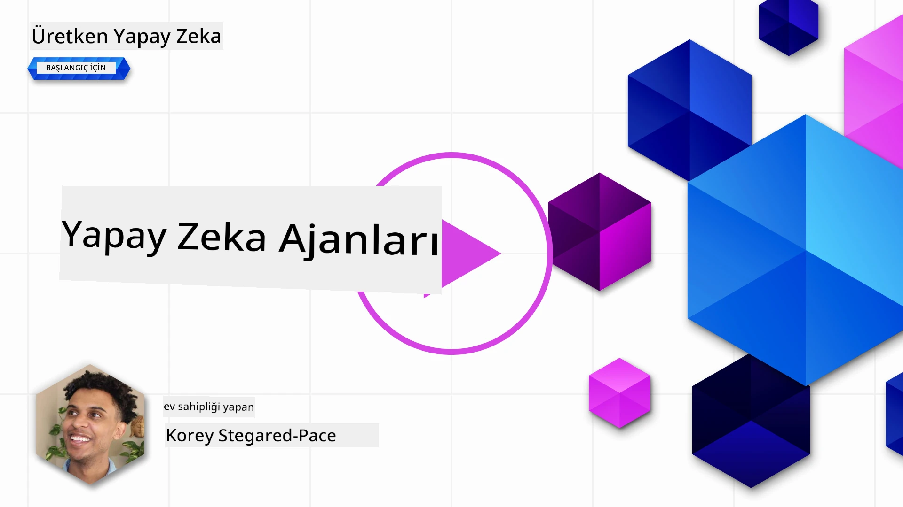
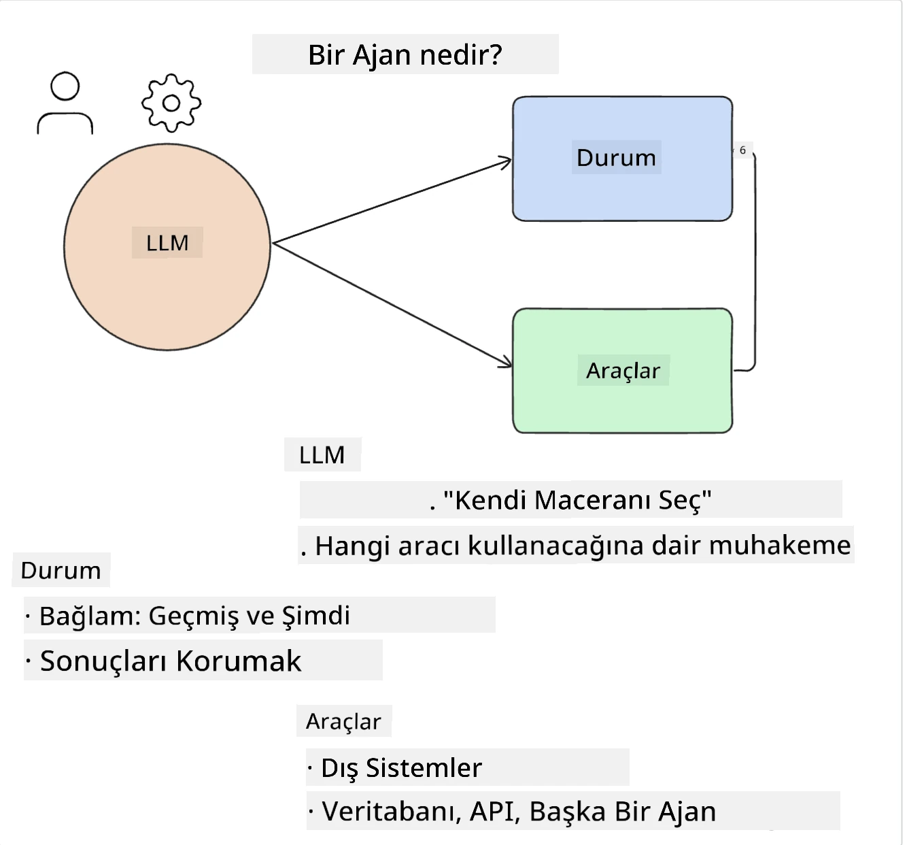
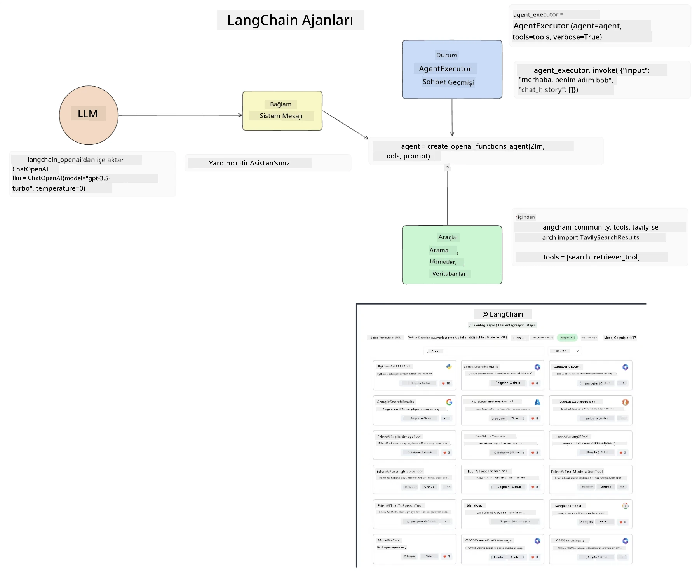
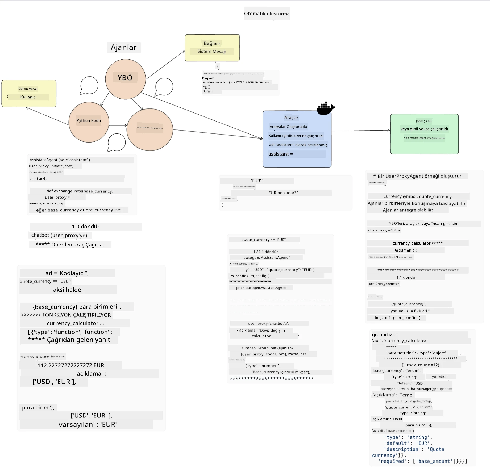
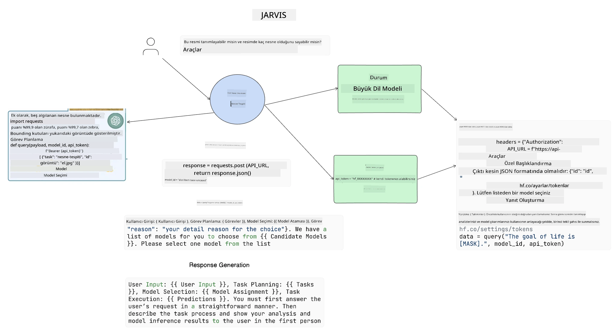

[](https://youtu.be/yAXVW-lUINc?si=bOtW9nL6jc3XJgOM)

## Giriş

AI Ajanları, Büyük Dil Modellerinin (LLM'ler) asistanlardan eylem gerçekleştirebilen ajanlara dönüşmesini sağlayan Üretken AI'da heyecan verici bir gelişmeyi temsil eder. AI Ajanı çerçeveleri, geliştiricilerin LLM'lere araçlara ve durum yönetimine erişim sağlayan uygulamalar oluşturmasına olanak tanır. Bu çerçeveler ayrıca görünürlülüğü artırır, kullanıcıların ve geliştiricilerin LLM'lerin planladığı eylemleri izlemelerine olanak tanıyarak deneyim yönetimini iyileştirir.

Ders aşağıdaki alanları kapsayacaktır:

- AI Ajanının ne olduğunu anlama - AI Ajanı tam olarak nedir?
- Dört farklı AI Ajan Çerçevesini keşfetme - Onları benzersiz yapan nedir?
- Bu AI Ajanlarını farklı kullanım senaryolarına uygulama - Ne zaman AI Ajanları kullanmalıyız?

## Öğrenme hedefleri

Bu dersi tamamladıktan sonra şunları yapabileceksiniz:

- AI Ajanlarının ne olduğunu ve nasıl kullanılabileceğini açıklamak.
- Bazı popüler AI Ajan Çerçeveleri arasındaki farkları anlamak ve bunların nasıl farklılaştığını kavramak.
- AI Ajanlarının nasıl çalıştığını anlayarak onlarla uygulamalar geliştirmek.

## AI Ajanları Nedir?

AI Ajanları, Üretken AI dünyasında çok heyecan verici bir alandır. Bu heyecan bazen terimlerin ve uygulamalarının karıştırılmasına yol açabilir. AI Ajanlarına atıfta bulunan çoğu aracı kapsayacak şekilde basit ve kapsayıcı tutmak için şu tanımı kullanacağız:

AI Ajanları, Büyük Dil Modellerinin (LLM'ler) **duruma** ve **araçlara** erişim vererek görevleri gerçekleştirmelerine olanak tanır.



Bu terimleri tanımlayalım:

**Büyük Dil Modelleri** - Bu kurs boyunca bahsedilen GPT-3.5, GPT-4, Llama-2 gibi modellerdir.

**Durum** - LLM'nin içinde çalıştığı bağlamı ifade eder. LLM, geçmiş eylemlerinin ve mevcut bağlamın bilgisini kullanarak sonraki eylemleri için karar verir. AI Ajanı Çerçeveleri, geliştiricilerin bu bağlamı daha kolay yönetmesini sağlar.

**Araçlar** - Kullanıcının talep ettiği ve LLM'nin planladığı görevi tamamlamak için LLM'nin araçlara erişmesi gerekir. Araç örnekleri, bir veritabanı, bir API, harici bir uygulama veya hatta başka bir LLM olabilir!

Bu tanımlar, uygulamada nasıl uygulandıklarını incelerken size sağlam bir temel sağlayacaktır. Şimdi birkaç farklı AI Ajan çerçevesini inceleyelim:

## LangChain Ajanları

[LangChain Ajanları](https://python.langchain.com/docs/how_to/#agents?WT.mc_id=academic-105485-koreyst), yukarıda verdiğimiz tanımların uygulanmasıdır.

**Durum** yönetmek için gömülü bir fonksiyon olan `AgentExecutor` kullanılır. Bu, tanımlanan `ajan`ı ve ona erişilebilen `araçları` kabul eder.

`Agent Executor` ayrıca sohbet geçmişini depolar ve sohbete bağlam sağlar.



LangChain, LLM'nin erişebileceği [bir araç kataloğu](https://integrations.langchain.com/tools?WT.mc_id=academic-105485-koreyst) sunar. Bu araçlar topluluk ve LangChain ekibi tarafından yapılmıştır.

Ardından bu araçları tanımlayıp `Agent Executor`'a iletebilirsiniz.

Görünürlük, AI Ajanları hakkında konuşurken bir diğer önemli konudur. Uygulama geliştiricilerinin LLM'nin hangi aracı kullandığını ve neden kullandığını anlaması önemlidir. Bunun için LangChain ekibi LangSmith'i geliştirmiştir.

## AutoGen

Bir sonraki tartışacağımız AI Ajan çerçevesi [AutoGen](https://microsoft.github.io/autogen/?WT.mc_id=academic-105485-koreyst) olur. AutoGen’in ana odağı sohbetlerdir. Ajanlar hem **konuşabilir** hem de **özelleştirilebilir**.

**Konuşabilir -** LLM'ler, bir görevi tamamlamak için başka bir LLM ile sohbet başlatabilir ve sürdürebilir. Bu, `AssistantAgents` oluşturarak ve onlara belirli bir sistem mesajı vererek yapılır.

```python

autogen.AssistantAgent( name="Coder", llm_config=llm_config, ) pm = autogen.AssistantAgent( name="Product_manager", system_message="Creative in software product ideas.", llm_config=llm_config, )

```

**Özelleştirilebilir** - Ajanlar sadece LLM olarak değil, kullanıcı veya araç olarak da tanımlanabilir. Bir geliştirici olarak, görevin tamamlanmasında kullanıcıdan geri bildirim almakla sorumlu olan `UserProxyAgent` tanımlayabilirsiniz. Bu geri bildirim görev yürütülmesini sürdürebilir veya durdurabilir.

```python
user_proxy = UserProxyAgent(name="user_proxy")
```

### Durum ve Araçlar

Durumu değiştirmek ve yönetmek için bir asistan Ajan, görevi tamamlamak üzere Python kodu üretir.

İşte sürecin bir örneği:



#### Sistem Mesajı ile Tanımlanan LLM

```python
system_message="For weather related tasks, only use the functions you have been provided with. Reply TERMINATE when the task is done."
```

Bu sistem mesajları, belirli LLM'ye görevine uygun fonksiyonların hangileri olduğunu yönlendirir. Unutmayın, AutoGen ile farklı sistem mesajlarına sahip birden fazla AssistantAgent tanımlayabilirsiniz.

#### Sohbet Kullanıcı Tarafından Başlatılır

```python
user_proxy.initiate_chat( chatbot, message="I am planning a trip to NYC next week, can you help me pick out what to wear? ", )

```

Kullanıcı_proxy (İnsan) tarafından gönderilen bu mesaj, Ajanın gerçekleştirmesi gereken olası fonksiyonları keşfetme sürecini başlatacaktır.

#### Fonksiyon Çalıştırılır

```bash
chatbot (to user_proxy):

***** Suggested tool Call: get_weather ***** Arguments: {"location":"New York City, NY","time_periond:"7","temperature_unit":"Celsius"} ******************************************************** --------------------------------------------------------------------------------

>>>>>>>> EXECUTING FUNCTION get_weather... user_proxy (to chatbot): ***** Response from calling function "get_weather" ***** 112.22727272727272 EUR ****************************************************************

```

İlk sohbet işlendiğinde, Ajan çağrılması önerilen aracı gönderir. Burada, `get_weather` adlı bir fonksiyondur. Yapılandırmanıza bağlı olarak, bu fonksiyon otomatik olarak yürütülebilir ve Ajan tarafından okunabilir veya kullanıcı girdisine bağlı olarak çalıştırılabilir.

Başlangıç yapmak için nasıl başlayacağınızı daha iyi keşfetmek için [AutoGen kod örnekleri](https://microsoft.github.io/autogen/docs/Examples/?WT.mc_id=academic-105485-koreyst) listesine bakabilirsiniz.

## Taskweaver

Bir sonraki ajan çerçevesi [Taskweaver](https://microsoft.github.io/TaskWeaver/?WT.mc_id=academic-105485-koreyst) olacaktır. Bu çerçeve "ilk kod" ajanı olarak bilinir çünkü sadece `string`lerle değil, Python'da DataFrame'ler ile de çalışabilir. Bu, veri analizi ve üretim görevleri için son derece kullanışlıdır. Örneğin grafik ve tablolar oluşturmak veya rastgele sayılar üretmek gibi.

### Durum ve Araçlar

Konuşmanın durumunu yönetmek için TaskWeaver `Planner` kavramını kullanır. `Planner`, kullanıcılardan gelen isteği alır ve bu isteği yerine getirmek için tamamlanması gereken görevleri haritalar.

Görevleri tamamlamak için `Planner`, `Plugins` olarak adlandırılan araç koleksiyonuna erişebilir. Bunlar Python sınıfları veya genel bir kod yorumlayıcısı olabilir. Bu eklentiler gömme olarak depolanır, böylece LLM doğru eklentiyi daha iyi arayabilir.


İşte anormallik tespiti için bir eklenti örneği:

```python
class AnomalyDetectionPlugin(Plugin): def __call__(self, df: pd.DataFrame, time_col_name: str, value_col_name: str):
```

Kod yürütülmeden önce doğrulanır. Taskweaver'da bağlamı yönetmek için bir diğer özellik de `experience`dır. Experience, bir sohbetin bağlamının uzun vadede YAML dosyasında saklanmasına olanak tanır. Bu, LLM'nin belirli görevlerde önceki sohbetlere maruz kaldıkça zamanla gelişmesini sağlayacak şekilde yapılandırılabilir.

## JARVIS

İnceleyeceğimiz son ajan çerçevesi [JARVIS](https://github.com/microsoft/JARVIS?tab=readme-ov-file&WT.mc_id=academic-105485-koreyst) olacaktır. JARVIS'i benzersiz yapan şey, konuşmanın `durum`unu yönetmek için bir LLM kullanması ve `araçların` diğer AI modelleri olmasıdır. Her AI modeli, nesne tanıma, transkripsiyon veya resim açıklaması gibi belirli görevleri gerçekleştiren uzmanlaşmış modellerdir.



Genel amaçlı bir model olan LLM, kullanıcıdan gelen isteği alır ve görevi ile görevin tamamlanması için gerekli argüman/verileri belirler.

```python
[{"task": "object-detection", "id": 0, "dep": [-1], "args": {"image": "e1.jpg" }}]
```

LLM daha sonra isteği, özel AI modelinin yorumlayabileceği şekilde (örneğin JSON olarak) biçimlendirir. AI modeli göreve göre tahminini döndürdüğünde, LLM yanıtı alır.

Görevi tamamlamak için birden fazla model gerekiyorsa, kullanıcıya yanıt oluşturmak üzere bunların yanıtlarını da yorumlar.

Aşağıdaki örnek, bir kullanıcının bir resimdeki nesnelerin açıklamasını ve sayısını istediğinde nasıl çalışacağını gösterir:

## Ödev

AI Ajanları ile öğrenmeye devam etmek için AutoGen ile aşağıdakileri oluşturabilirsiniz:

- Eğitim girişiminin farklı departmanlarıyla bir iş toplantısını simüle eden bir uygulama.
- LLM'leri farklı kişilikleri ve öncelikleri anlamaya yönlendiren sistem mesajları oluşturun ve kullanıcının yeni bir ürün fikrini sunmasına olanak tanıyın.
- Ardından, LLM her departmandan takip soruları üreterek fikri ve ürün önerisini iyileştirsin.

## Öğrenme burada bitmez, yolculuğa devam edin

Bu dersi tamamladıktan sonra, Üretken AI bilginizi artırmaya devam etmek için [Generative AI Learning koleksiyonumuzu](https://aka.ms/genai-collection?WT.mc_id=academic-105485-koreyst) inceleyin!

---

<!-- CO-OP TRANSLATOR DISCLAIMER START -->
**Feragatname**:
Bu belge, AI çeviri hizmeti [Co-op Translator](https://github.com/Azure/co-op-translator) kullanılarak çevrilmiştir. Doğruluk için çaba gösterilse de, otomatik çevirilerin hata veya yanlışlık içerebileceğini lütfen unutmayın. Orijinal belge, kendi anadilinde yetkili kaynak olarak kabul edilmelidir. Kritik bilgiler için profesyonel insan çevirisi önerilir. Bu çevirinin kullanılması sonucu oluşabilecek herhangi bir yanlış anlama veya yanlış yorumlamadan sorumlu değiliz.
<!-- CO-OP TRANSLATOR DISCLAIMER END -->