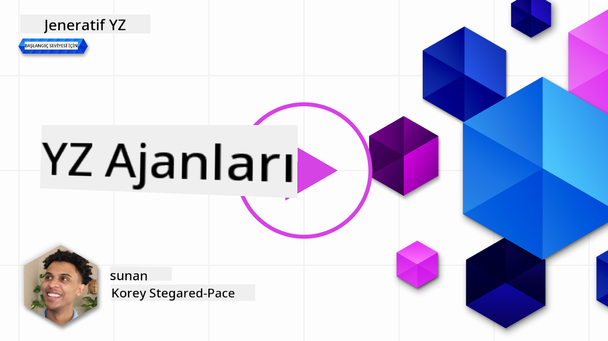
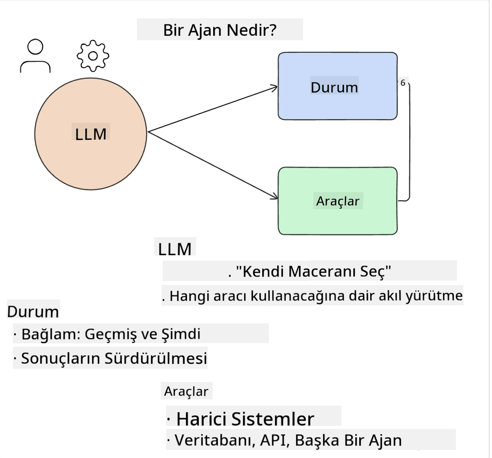
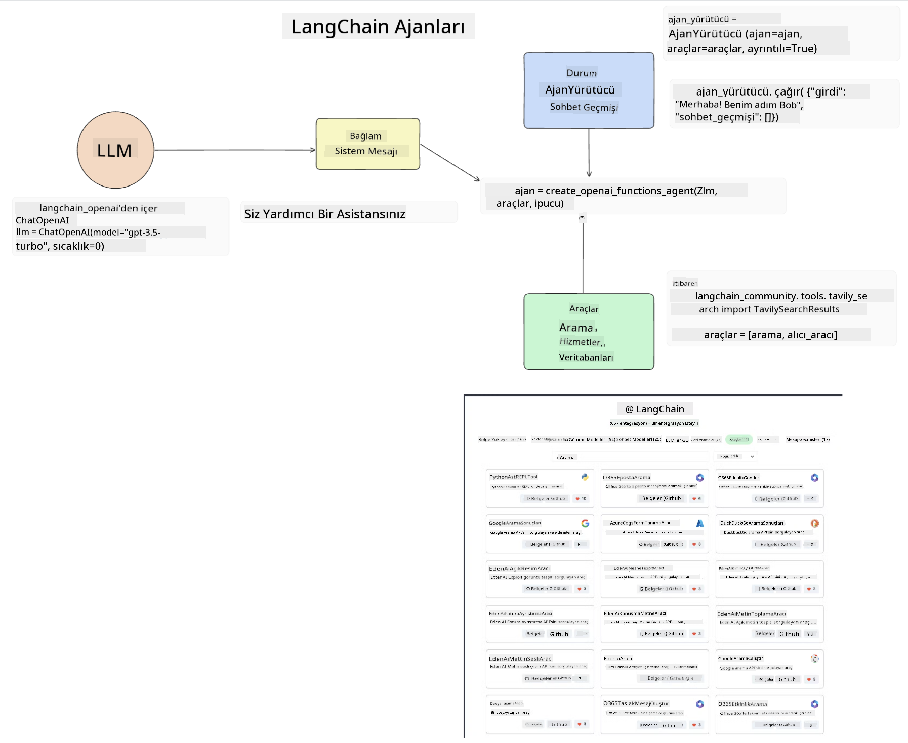
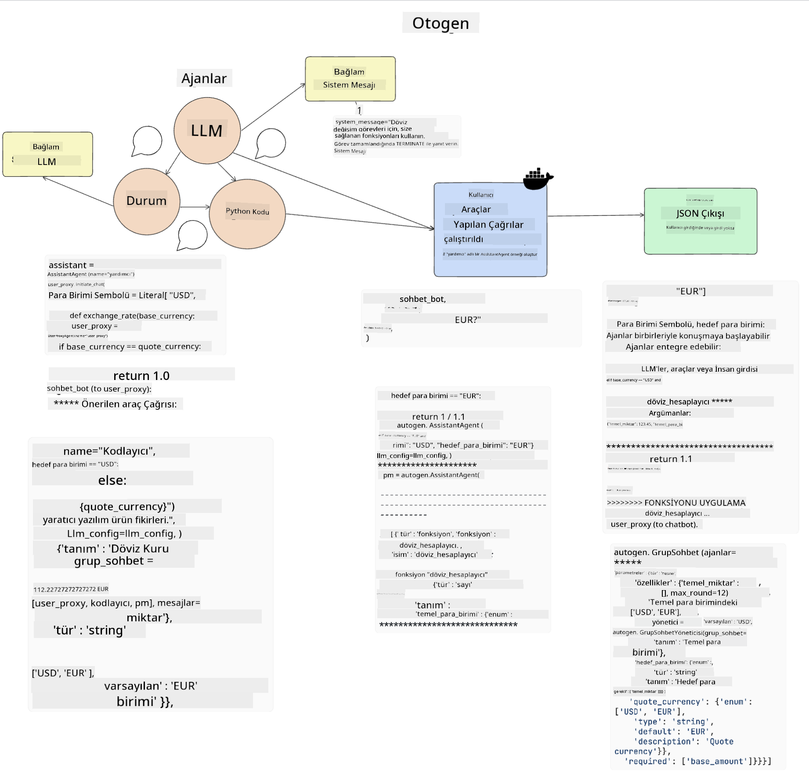
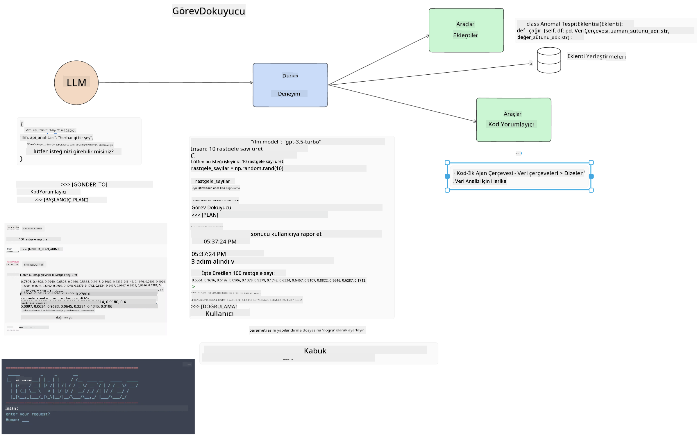
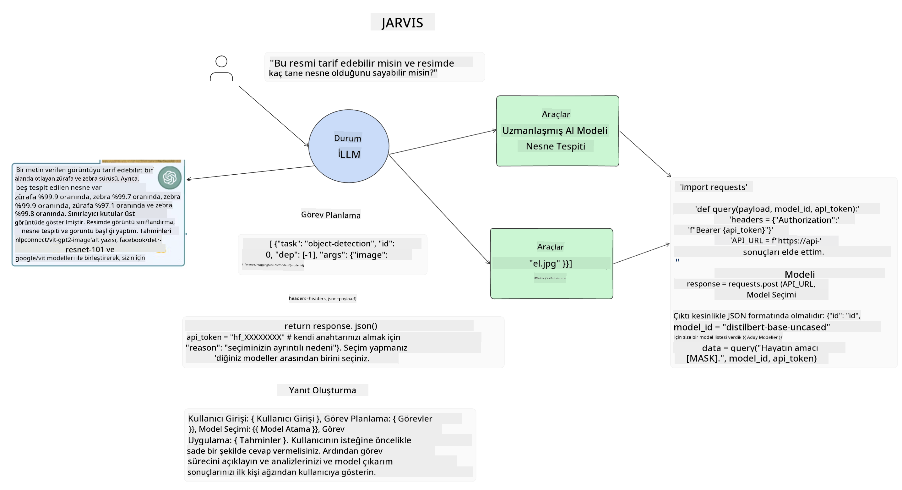

<!--
CO_OP_TRANSLATOR_METADATA:
{
  "original_hash": "11f03c81f190d9cbafd0f977dcbede6c",
  "translation_date": "2025-06-26T00:17:27+00:00",
  "source_file": "17-ai-agents/README.md",
  "language_code": "tr"
}
-->
[](https://aka.ms/gen-ai-lesson17-gh?WT.mc_id=academic-105485-koreyst)

## Giriş

Yapay Zeka Ajanları, Üretken Yapay Zeka alanında heyecan verici bir gelişmeyi temsil ediyor; Büyük Dil Modellerinin (LLM'ler) asistanlardan eylem yapabilen ajanlara dönüşmesini sağlıyor. Yapay Zeka Ajanı çerçeveleri, geliştiricilerin LLM'lere araçlar ve durum yönetimi erişimi sağlayan uygulamalar oluşturmasına olanak tanır. Bu çerçeveler ayrıca görünürlüğü artırır ve kullanıcıların ve geliştiricilerin LLM'ler tarafından planlanan eylemleri izlemesine olanak tanır, böylece deneyim yönetimini iyileştirir.

Bu ders şu alanları kapsayacaktır:

- Yapay Zeka Ajanının ne olduğunu anlamak - Yapay Zeka Ajanı tam olarak nedir?
- Dört farklı Yapay Zeka Ajanı Çerçevesini keşfetmek - Onları benzersiz kılan nedir?
- Bu Yapay Zeka Ajanlarını farklı kullanım senaryolarına uygulamak - Yapay Zeka Ajanlarını ne zaman kullanmalıyız?

## Öğrenme hedefleri

Bu dersi aldıktan sonra:

- Yapay Zeka Ajanlarının ne olduğunu ve nasıl kullanılabileceğini açıklayabileceksiniz.
- Popüler Yapay Zeka Ajanı Çerçevelerinden bazıları arasındaki farkları anlayacak ve nasıl farklılaştıklarını göreceksiniz.
- Yapay Zeka Ajanlarının nasıl çalıştığını anlayarak onlarla uygulamalar geliştirebileceksiniz.

## Yapay Zeka Ajanları Nedir?

Yapay Zeka Ajanları, Üretken Yapay Zeka dünyasında oldukça heyecan verici bir alandır. Bu heyecanla birlikte bazen terimlerin ve uygulamalarının karışıklığı da gelir. İşleri basit ve Yapay Zeka Ajanlarına atıfta bulunan çoğu aracı kapsayıcı tutmak için bu tanımı kullanacağız:

Yapay Zeka Ajanları, Büyük Dil Modellerinin (LLM'ler) bir **duruma** ve **araçlara** erişim sağlayarak görevleri yerine getirmesine olanak tanır.



Bu terimleri tanımlayalım:

**Büyük Dil Modelleri** - Bu kursta bahsedilen modellerdir, örneğin GPT-3.5, GPT-4, Llama-2, vb.

**Durum** - Bu, LLM'nin çalıştığı bağlamı ifade eder. LLM, geçmiş eylemlerinin ve mevcut bağlamın bağlamını kullanarak sonraki eylemler için karar verme sürecini yönlendirir. Yapay Zeka Ajanı Çerçeveleri, geliştiricilerin bu bağlamı daha kolay sürdürmesine olanak tanır.

**Araçlar** - Kullanıcının talep ettiği ve LLM'nin planladığı görevi tamamlamak için LLM'nin araçlara erişimi gerekir. Araçlara örnek olarak bir veritabanı, bir API, harici bir uygulama veya hatta başka bir LLM verilebilir!

Bu tanımlar, bunların nasıl uygulandığını incelerken size iyi bir temel sağlamayı umuyoruz. Şimdi birkaç farklı Yapay Zeka Ajanı çerçevesini inceleyelim:

## LangChain Ajanları

[LangChain Ajanları](https://python.langchain.com/docs/how_to/#agents?WT.mc_id=academic-105485-koreyst), yukarıda sağladığımız tanımların bir uygulamasıdır.

**Durumu** yönetmek için, `AgentExecutor` adlı yerleşik bir işlev kullanır. Bu, tanımlanmış `agent` ve ona sunulan `tools` kabul eder.

`Agent Executor` ayrıca sohbet geçmişini saklar ve sohbetin bağlamını sağlar.



LangChain, LLM'nin erişim sağlayabileceği uygulamanıza ithal edilebilecek bir [araç kataloğu](https://integrations.langchain.com/tools?WT.mc_id=academic-105485-koreyst) sunar. Bunlar, topluluk ve LangChain ekibi tarafından yapılmıştır.

Bu araçları tanımlayabilir ve `Agent Executor`'a aktarabilirsiniz.

Görünürlük, Yapay Zeka Ajanları hakkında konuşurken önemli bir başka unsurdur. Uygulama geliştiricilerinin, LLM'nin hangi aracı kullandığını ve nedenini anlaması önemlidir. Bunun için, LangChain ekibi LangSmith'i geliştirdi.

## AutoGen

Bir sonraki tartışacağımız Yapay Zeka Ajanı çerçevesi [AutoGen](https://microsoft.github.io/autogen/?WT.mc_id=academic-105485-koreyst)'dir. AutoGen'in ana odak noktası konuşmalardır. Ajanlar hem **konuşulabilir** hem de **özelleştirilebilir**.

**Konuşulabilir -** LLM'ler bir görevi tamamlamak için başka bir LLM ile bir konuşma başlatabilir ve sürdürebilir. Bu, `AssistantAgents` oluşturularak ve onlara belirli bir sistem mesajı verilerek yapılır.

```python

autogen.AssistantAgent( name="Coder", llm_config=llm_config, ) pm = autogen.AssistantAgent( name="Product_manager", system_message="Creative in software product ideas.", llm_config=llm_config, )

```

**Özelleştirilebilir** - Ajanlar yalnızca LLM'ler olarak değil, bir kullanıcı veya araç olarak da tanımlanabilir. Bir geliştirici olarak, bir görevi tamamlarken geri bildirim için kullanıcı ile etkileşimden sorumlu bir `UserProxyAgent` tanımlayabilirsiniz. Bu geri bildirim, görevin yürütülmesine devam edebilir veya durdurabilir.

```python
user_proxy = UserProxyAgent(name="user_proxy")
```

### Durum ve Araçlar

Durumu değiştirmek ve yönetmek için, bir yardımcı Ajan görevi tamamlamak için Python kodu üretir.

İşte sürecin bir örneği:



#### Sistem Mesajıyla Tanımlanmış LLM

```python
system_message="For weather related tasks, only use the functions you have been provided with. Reply TERMINATE when the task is done."
```

Bu sistem mesajları, belirli LLM'yi görevine uygun işlevlere yönlendirir. Unutmayın, AutoGen ile farklı sistem mesajlarına sahip birden fazla tanımlı AssistantAgents'a sahip olabilirsiniz.

#### Sohbet Kullanıcı Tarafından Başlatılır

```python
user_proxy.initiate_chat( chatbot, message="I am planning a trip to NYC next week, can you help me pick out what to wear? ", )

```

user_proxy'den (İnsan) gelen bu mesaj, Ajanın hangi işlevleri gerçekleştirmesi gerektiğini keşfetme sürecini başlatacaktır.

#### İşlev Yürütülür

```bash
chatbot (to user_proxy):

***** Suggested tool Call: get_weather ***** Arguments: {"location":"New York City, NY","time_periond:"7","temperature_unit":"Celsius"} ******************************************************** --------------------------------------------------------------------------------

>>>>>>>> EXECUTING FUNCTION get_weather... user_proxy (to chatbot): ***** Response from calling function "get_weather" ***** 112.22727272727272 EUR ****************************************************************

```

İlk sohbet işlendiğinde, Ajan önerilen aracı çağıracaktır. Bu durumda, `get_weather`. Depending on your configuration, this function can be automatically executed and read by the Agent or can be executed based on user input.

You can find a list of [AutoGen code samples](https://microsoft.github.io/autogen/docs/Examples/?WT.mc_id=academic-105485-koreyst) to further explore how to get started building.

## Taskweaver

The next agent framework we will explore is [Taskweaver](https://microsoft.github.io/TaskWeaver/?WT.mc_id=academic-105485-koreyst). It is known as a "code-first" agent because instead of working strictly with `strings` , it can work with DataFrames in Python. This becomes extremely useful for data analysis and generation tasks. This can be things like creating graphs and charts or generating random numbers.

### State and Tools

To manage the state of the conversation, TaskWeaver uses the concept of a `Planner`. The `Planner` is a LLM that takes the request from the users and maps out the tasks that need to be completed to fulfill this request.

To complete the tasks the `Planner` is exposed to the collection of tools called `Plugins` adlı bir işlevdir. Bu, Python sınıfları veya genel bir kod yorumlayıcısı olabilir. Bu eklentiler, LLM'nin doğru eklentiyi daha iyi arayabilmesi için gömümler olarak saklanır.



İşte anomali tespitiyle ilgilenen bir eklenti örneği:

```python
class AnomalyDetectionPlugin(Plugin): def __call__(self, df: pd.DataFrame, time_col_name: str, value_col_name: str):
```

Kod, yürütülmeden önce doğrulanır. Taskweaver'da bağlamı yönetmek için bir başka özellik, `experience`. Experience allows for the context of a conversation to be stored over to the long term in a YAML file. This can be configured so that the LLM improves over time on certain tasks given that it is exposed to prior conversations.

## JARVIS

The last agent framework we will explore is [JARVIS](https://github.com/microsoft/JARVIS?tab=readme-ov-file?WT.mc_id=academic-105485-koreyst). What makes JARVIS unique is that it uses an LLM to manage the `state` sohbetin ve `tools` diğer yapay zeka modelleridir. Her bir yapay zeka modeli, nesne algılama, transkripsiyon veya resim altyazısı gibi belirli görevleri yerine getiren uzmanlaşmış modellerdir.



LLM, genel amaçlı bir model olarak, kullanıcıdan gelen isteği alır ve belirli görevi ve görevi tamamlamak için gereken herhangi bir argüman/veriyi belirler.

```python
[{"task": "object-detection", "id": 0, "dep": [-1], "args": {"image": "e1.jpg" }}]
```

LLM daha sonra isteği, uzmanlaşmış yapay zeka modelinin yorumlayabileceği bir şekilde, örneğin JSON olarak biçimlendirir. Yapay zeka modeli göreve dayalı tahminini geri döndürdüğünde, LLM yanıtı alır.

Görevi tamamlamak için birden fazla modele ihtiyaç duyulursa, kullanıcıya yanıt oluşturmak için onları bir araya getirmeden önce bu modellerden gelen yanıtı da yorumlar.

Aşağıdaki örnek, bir kullanıcının bir resimdeki nesnelerin açıklamasını ve sayısını istediğinde bunun nasıl çalışacağını göstermektedir:

## Ödev

Yapay Zeka Ajanları öğreniminizi AutoGen ile devam ettirmek için:

- Bir eğitim startup'ının farklı departmanlarıyla iş toplantısını simüle eden bir uygulama oluşturun.
- LLM'lere farklı kişilikleri ve öncelikleri anlamalarında rehberlik eden sistem mesajları oluşturun ve kullanıcıya yeni bir ürün fikri sunma olanağı sağlayın.
- LLM daha sonra, sunumu ve ürün fikrini geliştirmek ve iyileştirmek için her departmandan takip soruları oluşturmalıdır.

## Öğrenme burada bitmez, yolculuğa devam edin

Bu dersi tamamladıktan sonra, Üretken Yapay Zeka bilginizi artırmaya devam etmek için [Üretken Yapay Zeka Öğrenme koleksiyonumuzu](https://aka.ms/genai-collection?WT.mc_id=academic-105485-koreyst) inceleyin!

**Feragatname**:  
Bu belge, AI çeviri hizmeti [Co-op Translator](https://github.com/Azure/co-op-translator) kullanılarak çevrilmiştir. Doğruluk için çaba göstersek de, otomatik çevirilerin hata veya yanlışlıklar içerebileceğini lütfen unutmayın. Orijinal belgenin kendi dilindeki versiyonu yetkili kaynak olarak kabul edilmelidir. Kritik bilgiler için, profesyonel insan çevirisi önerilir. Bu çevirinin kullanımı sonucu oluşabilecek yanlış anlamalar veya yanlış yorumlamalardan sorumlu değiliz.