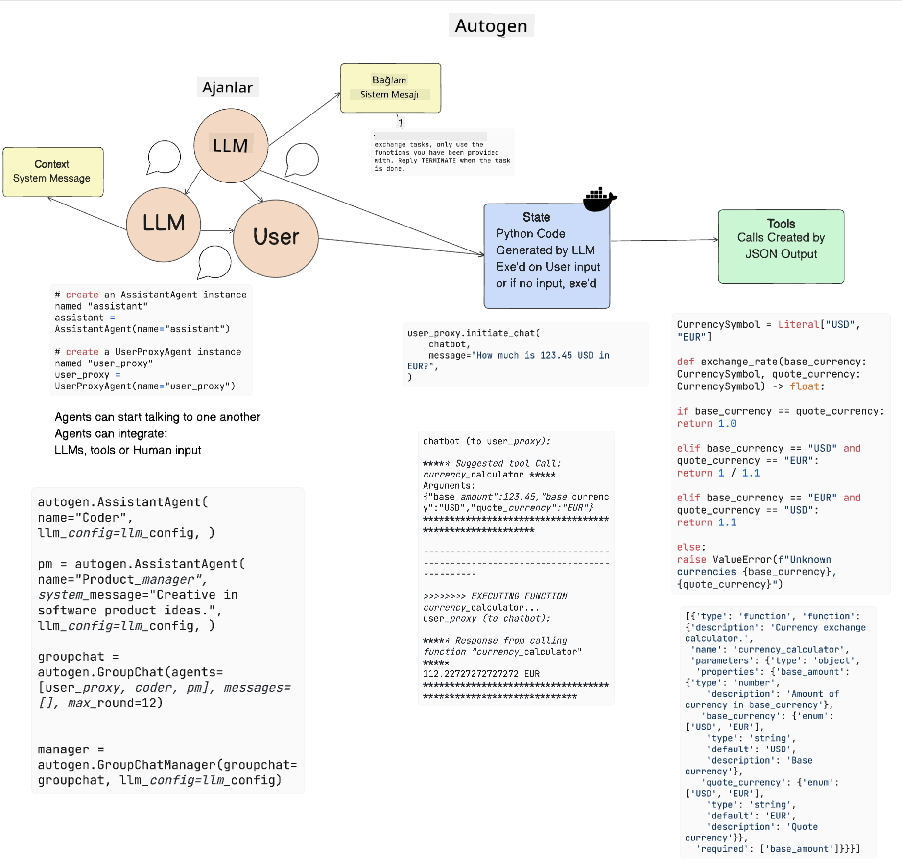

<!--
CO_OP_TRANSLATOR_METADATA:
{
  "original_hash": "11f03c81f190d9cbafd0f977dcbede6c",
  "translation_date": "2025-07-09T17:25:06+00:00",
  "source_file": "17-ai-agents/README.md",
  "language_code": "tr"
}
-->
[](https://aka.ms/gen-ai-lesson17-gh?WT.mc_id=academic-105485-koreyst)

## Giriş

AI Agent’lar, Büyük Dil Modellerinin (LLM’ler) asistanlardan eylem gerçekleştirebilen ajanlara dönüşmesini sağlayan, Üretken Yapay Zeka alanında heyecan verici bir gelişmeyi temsil ediyor. AI Agent çerçeveleri, geliştiricilerin LLM’lere araçlara ve durum yönetimine erişim sağlayan uygulamalar oluşturmasına olanak tanır. Bu çerçeveler ayrıca görünürlüğü artırarak kullanıcıların ve geliştiricilerin LLM’lerin planladığı eylemleri takip etmesini sağlar ve böylece deneyim yönetimini iyileştirir.

Bu derste aşağıdaki konular ele alınacaktır:

- AI Agent nedir? - AI Agent tam olarak nedir?
- Dört farklı AI Agent Çerçevesini keşfetmek - Onları benzersiz kılan nedir?
- Bu AI Agent’ları farklı kullanım senaryolarına uygulamak - AI Agent’ları ne zaman kullanmalıyız?

## Öğrenme hedefleri

Bu dersi tamamladıktan sonra şunları yapabileceksiniz:

- AI Agent’ların ne olduğunu ve nasıl kullanılabileceğini açıklayabilmek.
- Popüler AI Agent Çerçeveleri arasındaki farkları anlamak ve bunların nasıl farklılaştığını kavramak.
- AI Agent’ların nasıl çalıştığını anlayarak onlarla uygulamalar geliştirebilmek.

## AI Agent’lar Nedir?

AI Agent’lar, Üretken Yapay Zeka dünyasında oldukça heyecan verici bir alandır. Bu heyecan bazen terimlerin ve uygulamalarının karışıklığına yol açabilir. İşleri basit ve AI Agent olarak adlandırılan çoğu aracı kapsayacak şekilde tutmak için şu tanımı kullanacağız:

AI Agent’lar, Büyük Dil Modellerinin (LLM’ler) **durum** ve **araçlara** erişim sağlayarak görevleri yerine getirmesine olanak tanır.


Bu terimleri tanımlayalım:

**Büyük Dil Modelleri** - Bu derste bahsedilen GPT-3.5, GPT-4, Llama-2 gibi modellerdir.

**Durum** - LLM’nin çalıştığı bağlamı ifade eder. LLM, önceki eylemlerinin ve mevcut bağlamın bilgisini kullanarak sonraki kararlarını yönlendirir. AI Agent Çerçeveleri, geliştiricilerin bu bağlamı daha kolay yönetmesini sağlar.

**Araçlar** - Kullanıcının talep ettiği ve LLM’nin planladığı görevi tamamlamak için LLM’nin araçlara erişimi gerekir. Araçlara örnek olarak bir veritabanı, API, harici bir uygulama veya başka bir LLM verilebilir!

Bu tanımlar, ileride nasıl uygulandıklarını incelerken size sağlam bir temel sağlayacaktır. Şimdi birkaç farklı AI Agent çerçevesini keşfedelim:

## LangChain Agents

[LangChain Agents](https://python.langchain.com/docs/how_to/#agents?WT.mc_id=academic-105485-koreyst), yukarıda verdiğimiz tanımların bir uygulamasıdır.

**Durum** yönetmek için `AgentExecutor` adlı yerleşik bir fonksiyon kullanır. Bu fonksiyon, tanımlanmış `agent` ve ona erişimi olan `tools`u kabul eder.

`AgentExecutor` ayrıca sohbet geçmişini saklayarak sohbetin bağlamını sağlar.


LangChain, LLM’nin erişebileceği araçların bulunduğu bir [araç kataloğu](https://integrations.langchain.com/tools?WT.mc_id=academic-105485-koreyst) sunar. Bu araçlar topluluk ve LangChain ekibi tarafından oluşturulmuştur.

Bu araçları tanımlayıp `AgentExecutor`’a iletebilirsiniz.

Görünürlük, AI Agent’lar hakkında konuşurken önemli bir diğer konudur. Uygulama geliştiricilerinin LLM’nin hangi aracı neden kullandığını anlaması önemlidir. Bu amaçla LangChain ekibi LangSmith’i geliştirmiştir.

## AutoGen

Bir sonraki AI Agent çerçevesi [AutoGen](https://microsoft.github.io/autogen/?WT.mc_id=academic-105485-koreyst). AutoGen’in ana odağı sohbetlerdir. Agent’lar hem **konuşabilir** hem de **özelleştirilebilir**.

**Konuşabilir -** LLM’ler, bir görevi tamamlamak için başka bir LLM ile sohbet başlatabilir ve sürdürebilir. Bu, `AssistantAgents` oluşturarak ve onlara belirli bir sistem mesajı vererek yapılır.

```python

autogen.AssistantAgent( name="Coder", llm_config=llm_config, ) pm = autogen.AssistantAgent( name="Product_manager", system_message="Creative in software product ideas.", llm_config=llm_config, )

```

**Özelleştirilebilir** - Agent’lar sadece LLM olarak değil, kullanıcı veya araç olarak da tanımlanabilir. Geliştirici olarak, görevin tamamlanması için kullanıcıdan geri bildirim almakla sorumlu bir `UserProxyAgent` tanımlayabilirsiniz. Bu geri bildirim, görevin devam etmesini veya durmasını sağlayabilir.

```python
user_proxy = UserProxyAgent(name="user_proxy")
```

### Durum ve Araçlar

Durumu değiştirmek ve yönetmek için bir asistan Agent, görevi tamamlamak üzere Python kodu üretir.

İşte sürecin bir örneği:



#### Sistem Mesajı ile Tanımlanmış LLM

```python
system_message="For weather related tasks, only use the functions you have been provided with. Reply TERMINATE when the task is done."
```

Bu sistem mesajı, belirli LLM’ye hangi fonksiyonların görev için uygun olduğunu belirtir. Unutmayın, AutoGen ile farklı sistem mesajlarına sahip birden fazla AssistantAgent tanımlayabilirsiniz.

#### Sohbet Kullanıcı Tarafından Başlatılır

```python
user_proxy.initiate_chat( chatbot, message="I am planning a trip to NYC next week, can you help me pick out what to wear? ", )

```

Kullanıcı_proxy (İnsan) tarafından gönderilen bu mesaj, Agent’ın hangi fonksiyonları çalıştırması gerektiğini keşfetme sürecini başlatır.

#### Fonksiyon Çalıştırılır

```bash
chatbot (to user_proxy):

***** Suggested tool Call: get_weather ***** Arguments: {"location":"New York City, NY","time_periond:"7","temperature_unit":"Celsius"} ******************************************************** --------------------------------------------------------------------------------

>>>>>>>> EXECUTING FUNCTION get_weather... user_proxy (to chatbot): ***** Response from calling function "get_weather" ***** 112.22727272727272 EUR ****************************************************************

```

İlk sohbet işlendiğinde, Agent çağrılması önerilen aracı gönderir. Bu örnekte `get_weather` adlı bir fonksiyondur. Yapılandırmanıza bağlı olarak, bu fonksiyon otomatik olarak çalıştırılabilir ve Agent tarafından okunabilir ya da kullanıcı girdisine bağlı olarak çalıştırılabilir.

Başlamak için daha fazla örnek görmek isterseniz, [AutoGen kod örnekleri](https://microsoft.github.io/autogen/docs/Examples/?WT.mc_id=academic-105485-koreyst) listesini inceleyebilirsiniz.

## Taskweaver

İnceleyeceğimiz bir sonraki agent çerçevesi [Taskweaver](https://microsoft.github.io/TaskWeaver/?WT.mc_id=academic-105485-koreyst). Bu çerçeve, `strings` ile çalışmak yerine Python’da DataFrame’lerle çalışabildiği için "kod öncelikli" agent olarak bilinir. Bu, veri analizi ve üretim görevleri için oldukça faydalıdır. Örneğin grafik ve tablo oluşturma ya da rastgele sayı üretme gibi.

### Durum ve Araçlar

Konuşmanın durumunu yönetmek için TaskWeaver, `Planner` kavramını kullanır. `Planner`, kullanıcıdan gelen isteği alır ve bu isteği yerine getirmek için tamamlanması gereken görevleri haritalar.

Görevleri tamamlamak için `Planner`, `Plugins` adı verilen araç koleksiyonuna erişir. Bunlar Python sınıfları veya genel bir kod yorumlayıcı olabilir. Bu eklentiler, LLM’nin doğru eklentiyi daha iyi arayabilmesi için embedding olarak saklanır.


İşte anomali tespiti için bir eklenti örneği:

```python
class AnomalyDetectionPlugin(Plugin): def __call__(self, df: pd.DataFrame, time_col_name: str, value_col_name: str):
```

Kod çalıştırılmadan önce doğrulanır. Taskweaver’da bağlam yönetimi için bir diğer özellik ise `experience`dır. Experience, bir konuşmanın bağlamının uzun vadede YAML dosyasında saklanmasına olanak tanır. Bu, LLM’nin önceki konuşmalara maruz kalması durumunda belirli görevlerde zamanla gelişmesini sağlar.

## JARVIS

İnceleyeceğimiz son agent çerçevesi [JARVIS](https://github.com/microsoft/JARVIS?tab=readme-ov-file?WT.mc_id=academic-105485-koreyst). JARVIS’i benzersiz kılan, konuşmanın `durum`unu bir LLM’nin yönetmesi ve `araçlar`ın diğer AI modelleri olmasıdır. Her AI modeli, nesne tespiti, transkripsiyon veya resim açıklaması gibi belirli görevleri yerine getiren uzmanlaşmış modellerdir.


Genel amaçlı bir model olan LLM, kullanıcıdan gelen isteği alır ve görevi ile tamamlanması için gereken argümanları/verileri belirler.

```python
[{"task": "object-detection", "id": 0, "dep": [-1], "args": {"image": "e1.jpg" }}]
```

LLM, isteği uzman AI modelinin anlayabileceği şekilde, örneğin JSON formatında, biçimlendirir. AI modeli göreve dayalı tahminini döndürdüğünde, LLM yanıtı alır.

Görevi tamamlamak için birden fazla model gerekiyorsa, LLM bu modellerden gelen yanıtları da yorumlar ve bunları birleştirerek kullanıcıya yanıt üretir.

Aşağıdaki örnek, bir kullanıcının bir resimdeki nesnelerin açıklamasını ve sayısını istediğinde nasıl çalışacağını gösterir:

## Ödev

AI Agent’lar ile öğreniminize AutoGen kullanarak devam edebilirsiniz:

- Eğitim alanında bir startup’ın farklı departmanlarıyla iş toplantısını simüle eden bir uygulama geliştirin.
- LLM’lerin farklı kişilikleri ve öncelikleri anlamasını sağlayan sistem mesajları oluşturun ve kullanıcının yeni bir ürün fikrini sunmasına olanak tanıyın.
- Ardından LLM, her departmandan gelen takip sorularını üreterek sunumu ve ürün fikrini geliştirsin.

## Öğrenme burada bitmiyor, yolculuğa devam edin

Bu dersi tamamladıktan sonra, Üretken Yapay Zeka bilginizi geliştirmeye devam etmek için [Generative AI Learning koleksiyonumuzu](https://aka.ms/genai-collection?WT.mc_id=academic-105485-koreyst) inceleyin!

**Feragatname**:  
Bu belge, AI çeviri servisi [Co-op Translator](https://github.com/Azure/co-op-translator) kullanılarak çevrilmiştir. Doğruluk için çaba gösterilse de, otomatik çevirilerin hatalar veya yanlışlıklar içerebileceğini lütfen unutmayınız. Orijinal belge, kendi dilinde yetkili kaynak olarak kabul edilmelidir. Kritik bilgiler için profesyonel insan çevirisi önerilir. Bu çevirinin kullanımı sonucu oluşabilecek yanlış anlamalar veya yorum hatalarından sorumlu değiliz.