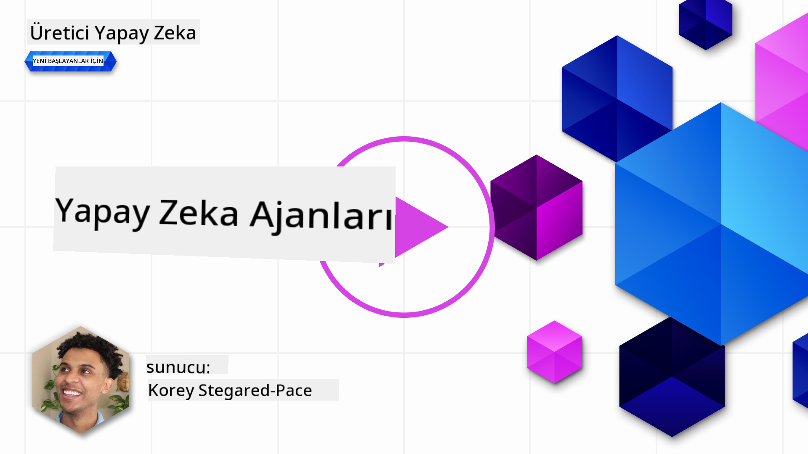
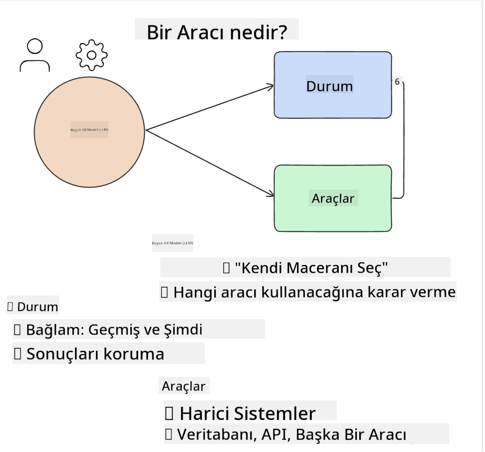
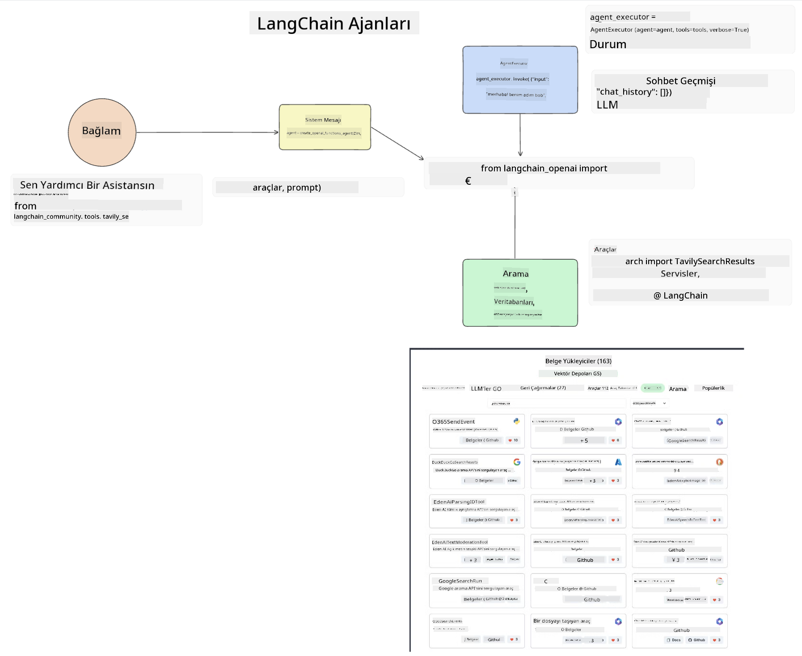

<!--
CO_OP_TRANSLATOR_METADATA:
{
  "original_hash": "8e8d1f6a63da606af7176a87ff8e92b6",
  "translation_date": "2025-10-17T16:24:50+00:00",
  "source_file": "17-ai-agents/README.md",
  "language_code": "tr"
}
-->
[](https://youtu.be/yAXVW-lUINc?si=bOtW9nL6jc3XJgOM)

## Giriş

AI Agent'ler, Generative AI dünyasında heyecan verici bir gelişmeyi temsil eder ve Büyük Dil Modellerinin (LLM'ler) asistanlardan eylem gerçekleştirebilen ajanlara dönüşmesini sağlar. AI Agent çerçeveleri, geliştiricilerin LLM'lere araçlara erişim ve durum yönetimi sağlayan uygulamalar oluşturmasına olanak tanır. Bu çerçeveler ayrıca görünürlüğü artırır, kullanıcıların ve geliştiricilerin LLM'lerin planladığı eylemleri izlemesine olanak tanır ve böylece deneyim yönetimini iyileştirir.

Bu ders aşağıdaki konuları kapsayacaktır:

- AI Agent nedir? - AI Agent tam olarak nedir?
- Dört farklı AI Agent çerçevesini keşfetmek - Onları benzersiz kılan nedir?
- Bu AI Agent'leri farklı kullanım senaryolarında uygulamak - AI Agent'leri ne zaman kullanmalıyız?

## Öğrenme hedefleri

Bu dersi tamamladıktan sonra:

- AI Agent'lerin ne olduğunu ve nasıl kullanılabileceğini açıklayabileceksiniz.
- Popüler AI Agent çerçevelerinden bazılarının farklarını ve nasıl farklılaştıklarını anlayabileceksiniz.
- AI Agent'lerin nasıl çalıştığını anlayarak onlarla uygulamalar geliştirebileceksiniz.

## AI Agent'ler Nedir?

AI Agent'ler, Generative AI dünyasında oldukça heyecan verici bir alandır. Bu heyecan bazen terimlerin ve uygulamalarının kafa karışıklığına yol açabilir. İşleri basit ve AI Agent'lere atıfta bulunan çoğu aracı kapsayıcı tutmak için şu tanımı kullanacağız:

AI Agent'ler, Büyük Dil Modellerinin (LLM'ler) bir **duruma** ve **araçlara** erişim sağlayarak görevleri yerine getirmesine olanak tanır.



Bu terimleri tanımlayalım:

**Büyük Dil Modelleri** - Bu kurs boyunca bahsedilen modellerdir, örneğin GPT-3.5, GPT-4, Llama-2, vb.

**Durum** - LLM'nin çalıştığı bağlamı ifade eder. LLM, geçmiş eylemlerinin ve mevcut bağlamın rehberliğinde sonraki eylemler için kararlar alır. AI Agent çerçeveleri, geliştiricilerin bu bağlamı daha kolay yönetmesine olanak tanır.

**Araçlar** - Kullanıcının talep ettiği ve LLM'nin planladığı görevi tamamlamak için LLM'nin araçlara erişmesi gerekir. Araçlara örnek olarak bir veritabanı, bir API, harici bir uygulama veya başka bir LLM verilebilir!

Bu tanımlar, ileride nasıl uygulandıklarını inceleyeceğimiz için size sağlam bir temel sağlayacaktır. Şimdi birkaç farklı AI Agent çerçevesini keşfedelim:

## LangChain Agents

[LangChain Agents](https://python.langchain.com/docs/how_to/#agents?WT.mc_id=academic-105485-koreyst), yukarıda verdiğimiz tanımların bir uygulamasıdır.

**Durumu** yönetmek için, `AgentExecutor` adlı yerleşik bir işlev kullanır. Bu işlev, tanımlı `agent` ve ona sunulan `tools` öğelerini kabul eder.

`AgentExecutor`, sohbet geçmişini de saklayarak sohbetin bağlamını sağlar.



LangChain, LLM'nin erişebileceği [araç kataloğu](https://integrations.langchain.com/tools?WT.mc_id=academic-105485-koreyst) sunar. Bu araçlar, topluluk ve LangChain ekibi tarafından oluşturulmuştur.

Bu araçları tanımlayabilir ve `AgentExecutor`'a iletebilirsiniz.

AI Agent'lerden bahsederken görünürlük de önemli bir konudur. Uygulama geliştiricilerinin LLM'nin hangi aracı kullandığını ve neden kullandığını anlaması önemlidir. Bunun için LangChain ekibi LangSmith'i geliştirmiştir.

## AutoGen

Bir sonraki AI Agent çerçevesi [AutoGen](https://microsoft.github.io/autogen/?WT.mc_id=academic-105485-koreyst). AutoGen'in ana odak noktası konuşmalardır. Agent'ler hem **konuşabilir** hem de **özelleştirilebilir**.

**Konuşabilir -** LLM'ler bir görevi tamamlamak için başka bir LLM ile konuşma başlatabilir ve sürdürebilir. Bu, `AssistantAgents` oluşturarak ve onlara belirli bir sistem mesajı vererek yapılır.

```python

autogen.AssistantAgent( name="Coder", llm_config=llm_config, ) pm = autogen.AssistantAgent( name="Product_manager", system_message="Creative in software product ideas.", llm_config=llm_config, )

```

**Özelleştirilebilir** - Agent'ler yalnızca LLM olarak değil, bir kullanıcı veya araç olarak da tanımlanabilir. Bir geliştirici olarak, bir görevi tamamlamak için kullanıcıdan geri bildirim almakla sorumlu bir `UserProxyAgent` tanımlayabilirsiniz. Bu geri bildirim, görevin yürütülmesine devam edilmesini veya durdurulmasını sağlayabilir.

```python
user_proxy = UserProxyAgent(name="user_proxy")
```

### Durum ve Araçlar

Durumu değiştirmek ve yönetmek için, bir yardımcı Agent görevi tamamlamak için Python kodu oluşturur.

İşte sürecin bir örneği:


#### Sistem Mesajı ile Tanımlı LLM

```python
system_message="For weather related tasks, only use the functions you have been provided with. Reply TERMINATE when the task is done."
```

Bu sistem mesajı, belirli bir LLM'yi görevine uygun işlevlere yönlendirir. Unutmayın, AutoGen ile farklı sistem mesajlarına sahip birden fazla tanımlı AssistantAgent oluşturabilirsiniz.

#### Kullanıcı Tarafından Sohbet Başlatılır

```python
user_proxy.initiate_chat( chatbot, message="I am planning a trip to NYC next week, can you help me pick out what to wear? ", )

```

Bu kullanıcı_proxy (İnsan) mesajı, Agent'in hangi işlevleri gerçekleştirmesi gerektiğini keşfetme sürecini başlatır.

#### İşlev Yürütülür

```bash
chatbot (to user_proxy):

***** Suggested tool Call: get_weather ***** Arguments: {"location":"New York City, NY","time_periond:"7","temperature_unit":"Celsius"} ******************************************************** --------------------------------------------------------------------------------

>>>>>>>> EXECUTING FUNCTION get_weather... user_proxy (to chatbot): ***** Response from calling function "get_weather" ***** 112.22727272727272 EUR ****************************************************************

```

İlk sohbet işlendiğinde, Agent önerilen aracı çağırır. Bu durumda, `get_weather` adlı bir işlevdir. Yapılandırmanıza bağlı olarak, bu işlev Agent tarafından otomatik olarak yürütülebilir veya kullanıcı girdisine göre yürütülebilir.

[AutoGen kod örnekleri](https://microsoft.github.io/autogen/docs/Examples/?WT.mc_id=academic-105485-koreyst) listesine göz atarak nasıl başlayacağınızı daha fazla keşfedebilirsiniz.

## Taskweaver

Bir sonraki agent çerçevesi [Taskweaver](https://microsoft.github.io/TaskWeaver/?WT.mc_id=academic-105485-koreyst). "Kod-öncelikli" bir agent olarak bilinir çünkü `strings` ile çalışmak yerine Python'da DataFrame'lerle çalışabilir. Bu, veri analizi ve üretim görevleri için son derece kullanışlı hale gelir. Örneğin grafikler ve tablolar oluşturmak veya rastgele sayılar üretmek gibi.

### Durum ve Araçlar

Sohbetin durumunu yönetmek için TaskWeaver, bir `Planner` kavramını kullanır. `Planner`, kullanıcıların taleplerini alır ve bu talepleri yerine getirmek için tamamlanması gereken görevleri haritalar.

Görevleri tamamlamak için `Planner`, `Plugins` adı verilen araçlar koleksiyonuna erişir. Bu araçlar Python sınıfları veya genel bir kod yorumlayıcı olabilir. Bu eklentiler, LLM'nin doğru eklentiyi daha iyi arayabilmesi için gömülü olarak saklanır.


İşte anomali tespiti için bir eklenti örneği:

```python
class AnomalyDetectionPlugin(Plugin): def __call__(self, df: pd.DataFrame, time_col_name: str, value_col_name: str):
```

Kod, yürütülmeden önce doğrulanır. Taskweaver'da bağlamı yönetmek için başka bir özellik de `experience`dır. Deneyim, bir konuşmanın bağlamının uzun vadede YAML dosyasında saklanmasını sağlar. Bu, LLM'nin önceki konuşmalara maruz kaldıkça belirli görevlerde zamanla gelişmesini sağlayabilir.

## JARVIS

Son olarak keşfedeceğimiz agent çerçevesi [JARVIS](https://github.com/microsoft/JARVIS?tab=readme-ov-file?WT.mc_id=academic-105485-koreyst). JARVIS'i benzersiz kılan şey, bir LLM'nin sohbetin `durumunu` yönetmesi ve `araçların` diğer AI modelleri olmasıdır. Her bir AI modeli, nesne algılama, transkripsiyon veya görüntü açıklama gibi belirli görevleri yerine getiren uzmanlaşmış modellerdir.


Genel amaçlı bir model olan LLM, kullanıcıdan gelen talebi alır ve belirli görevi ve bu görevi tamamlamak için gereken argümanları/verileri belirler.

```python
[{"task": "object-detection", "id": 0, "dep": [-1], "args": {"image": "e1.jpg" }}]
```

LLM daha sonra talebi, özel AI modelinin yorumlayabileceği bir biçimde, örneğin JSON olarak düzenler. AI modeli, görevine dayalı tahminini geri gönderdiğinde, LLM yanıtı alır.

Görevi tamamlamak için birden fazla modele ihtiyaç duyulursa, LLM bu modellerden gelen yanıtları yorumlar ve bunları birleştirerek kullanıcıya yanıt oluşturur.

Aşağıdaki örnek, bir kullanıcının bir resimdeki nesnelerin açıklamasını ve sayısını istediği durumda nasıl çalışacağını gösterir:

## Ödev

AI Agent'ler ile öğreniminizi sürdürmek için AutoGen ile şunları yapabilirsiniz:

- Bir eğitim girişiminin farklı departmanlarıyla iş toplantısını simüle eden bir uygulama oluşturun.
- LLM'lerin farklı kişilikleri ve öncelikleri anlamasına rehberlik eden sistem mesajları oluşturun ve kullanıcıya yeni bir ürün fikrini sunma imkanı sağlayın.
- LLM, ardından her departmandan gelen takip sorularını oluşturmalı ve bu sorular ürün fikrini geliştirmek için kullanılmalıdır.

## Öğrenme burada bitmiyor, yolculuğa devam edin

Bu dersi tamamladıktan sonra, Generative AI bilginizi geliştirmeye devam etmek için [Generative AI Öğrenme koleksiyonumuza](https://aka.ms/genai-collection?WT.mc_id=academic-105485-koreyst) göz atın!

---

**Feragatname**:  
Bu belge, AI çeviri hizmeti [Co-op Translator](https://github.com/Azure/co-op-translator) kullanılarak çevrilmiştir. Doğruluk için çaba göstersek de, otomatik çevirilerin hata veya yanlışlıklar içerebileceğini lütfen unutmayın. Belgenin orijinal dili, yetkili kaynak olarak kabul edilmelidir. Kritik bilgiler için profesyonel insan çevirisi önerilir. Bu çevirinin kullanımından kaynaklanan yanlış anlamalar veya yanlış yorumlamalar için sorumluluk kabul etmiyoruz.